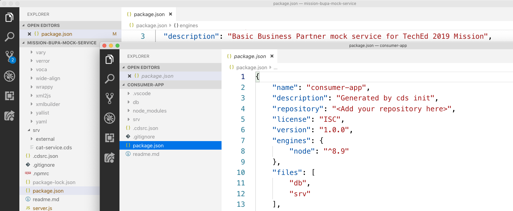

## Prerequisites
- You should start off in the same place as you were at the end of the previous tutorial -- in VS Code, with your `teched2019-mission-mock-service-bupa` project still open.

## Details
### You will learn
- The difference between `@sap/cds` and `@sap/cds-dk`
- How to install `@sap/cds-dk` globally
- How to initialize a new CAP project
- What the basic structure of a CAP-based service looks like
- How to supply seed data in CSV form
- How to start up a CAP service locally

> For a quick map and overview of what this tutorial is, and where it sits in the overall "S/4HANA Extensions with Cloud Application Programming Model (CAP)" mission, see the diagram in this blog post: [SAP TechEd Mission – API Hub, Cloud SDK and CAP – an overview](https://blogs.sap.com/2019/11/08/sap-teched-mission-api-hub-cloud-sdk-and-cap-an-overview/).

So you have a mock service running, and supporting V2 as well as V4 flavored responses to OData operation requests. Now it's time to put together a second service that will eventually consume data from (make requests to) this mock service. We'll use the SAP Cloud Application Programming Model for this second consumer service so we can take advantage of the powerful Core Data Services language to bridge local and remote data sources in service definitions.

To keep things simple, the consumer service will be based on the simple bookshop model that you may have seen before, so that you can focus on the consumption parts you'll eventually add and use.

---

[ACCORDION-BEGIN [Step 1: ](Install @sap/cds-dk globally)]

The first step is to create a new app using the `cds` command line tool which is part of the `@sap/cds-dk` package. While you've already used the `@sap/cds` package in the preceding tutorials in this mission, it's been within the context of an individual project directory where `@sap/cds` was referenced locally. Node.js packages can be installed globally, too, and that's what you'll do now with `@sap/cds-dk` so that the `cds` command line client is available everywhere.

> Originally the Node.js package incarnation of CAP was in the form of a single top-level module `@sap/cds`. Today we also have `@sap/cds-dk`, where the "dk" refers to "development kit". This is the package that you'll want to install to develop with CAP, taking advantage of all the tools that it includes; in parallel there is `@sap/cds` which you can think of as the leaner "runtime" package.

Execute the following commands in a command prompt (even one in an integrated terminal within VS Code will do).

```Bash
npm install -g @sap/cds-dk
```

> If there's an older `@sap/cds` package already installed on the machine, you may have to remove it first; if so, you'll be instructed to do so.

To satisfy yourself that the install proceeded successfully, invoke the `cds` executable with the `-v` option and check that you get sensible output. Here's an example of what that might look like (versions may be different):

```Bash
$ cds -v
@sap/cds-dk: 1.4.1
@sap/cds: 3.21.0
@sap/cds-compiler: 1.21.1
@sap/cds-foss: 1.1.0
@sap/cds-messaging: 1.5.0
@sap/cds-reflect: 2.9.1
@sap/cds-rest: 1.3.0
@sap/cds-services: 1.22.0
@sap/generator-cds: 2.11.1
Node.js: v10.17.0
home: /home/qmacro/teched2019-mission-mock-service-bupa/node_modules/@sap/cds
```

[DONE]
[ACCORDION-END]

[ACCORDION-BEGIN [Step 2: ](Initialize a new CAP project)]

With your freshly installed `cds` command line tool, you can now create a new CAP-based project, in the form of a new directory with various things preconfigured. Do this now, in your home directory or another directory where you have write access.

> To keep things together, we recommend you create this new project directory next to the mock service project directory you created in a previous tutorial in this mission.

```Bash
cds init consumer-app
```

> If you've used earlier versions of the `cds init` invocation you may remember the `--modules` switch. This is now deprecated. See the [Start a New Project](https://cap.cloud.sap/docs/get-started/in-a-nutshell#start-a-project) section of the CAP documentation for more details.

This will emit output similar to the following:

```Bash
[cds] - creating new project in ./consumer-app
done.

Continue with 'cd consumer-app'
Find samples on https://github.com/SAP-samples/cloud-cap-samples
Learn about next steps at https://cap.cloud.sap/docs/get-started
```

When the initialization process finishes, you will have a new `consumer-app/` directory which you can now open up in VS Code. Do this either by creating a new top-level window in your running VS Code instance (with **File | New Window**) and then opening this new directory (with **File | Open...**), or simply by running the following (if your operating system allows this):

```
code consumer-app
```

You should end up with two VS Code top-level windows, one showing your `teched2019-mission-mock-service-bupa` project, and the other one showing this new `consumer-app` project, like this:



[DONE]
[ACCORDION-END]

[ACCORDION-BEGIN [Step 3: ](Add a schema and service definition)]

Initializing the project created a number of empty directories, predominantly the following:

- `app/`: for UI artifacts
- `db/`: for the database level schema model
- `srv/`: for the service definition layer

The first thing to do is create a database level definition.

Create a file called `schema.cds` in the `db/` directory (you may have seen this conventionally called `data-model.cds` in the past), and save the following contents into it:

```CDS
namespace my.bookshop;

using cuid from '@sap/cds/common';

entity Books {
  key ID : Integer;
  title  : String;
  stock  : Integer;
  author : Association to Authors;
}

entity Authors {
  key ID : Integer;
  name   : String;
  books  : Association to many Books on books.author = $self;
}

entity Orders : cuid {
  book     : Association to Books;
  quantity : Integer;
}
```

Now add a service definition, in the form of a new file called `service.cds` in the `srv/` directory, with the following contents (don't forget to save!):

```CDS
using my.bookshop as my from '../db/schema';

service CatalogService {
    entity Books as projection on my.Books;
    entity Authors as projection on my.Authors;
    entity Orders as projection on my.Orders;
}
```

So far so good.

In data model definitions, entities are related through associations, which can be either unmanaged (where you have to specify the foreign key and join conditions yourself) or managed.

[VALIDATE_3]
[ACCORDION-END]

[ACCORDION-BEGIN [Step 4: ](Install the requirements)]
You may have noticed that this line in the `db/schema.cds` file is highlighted as problematic:

```CDS
using cuid from '@sap/cds/common';
```

That's because the resource that's being referred to is not available. This is the "common" definitions file that's supplied with all CAP installs, and is to be found within the `@sap/cds` and `@sap/cds-dk` packages.

This point, then, is a good time to install the dependencies for this project, which are defined in the `package.json` file in the `dependencies` section.

Within VS Code, open a new terminal (choose "Terminal: Create new Integrated Terminal" from the Command Palette as in previous tutorials in this mission) and run the following:

```Bash
npm install
```

This should complete in a short time, and you should notice a new directory in the project's root, named `node_modules/`. This is where the installed dependencies (and their dependencies) have been placed.

We're going to be using `SQLite` as a persistence layer shortly, so this is also a good point to install the Node.js library for `SQLite` too. Install this as a "development dependency", like this:

```Bash
npm install --save-dev sqlite3
```

The result of this will be that the package will be installed, and recorded as a development dependency in the `package.json` file (have a look) ... this is as opposed to a runtime / production dependency.

At the end of this step, the relevant sections in your `package.json` file should look something like this:

```JSON
  "dependencies": {
    "@sap/cds": "^3",
    "express": "^4"
  },
```

and this:

```JSON
  "devDependencies": {
    "sqlite3": "^4.1.1"
  }
```

You can cross-reference this list with what `npm` thinks is installed, with the following command:

```Bash
npm list --depth=0
```

This should give you a top-level list (i.e. without nested dependencies) of the packages installed in this project. The output should look something like this (version numbers may be different):

```
consumer-app@1.0.0 /home/qmacro/mission-temp/consumer-app
├── @sap/cds@3.21.0
├── express@4.17.1
└── sqlite3@4.1.1
```

[DONE]
[ACCORDION-END]


[ACCORDION-BEGIN [Step 5: ](Add sample data)]

Seed data can be supplied in the form of CSV files, one for each entity type. This data will be loaded into the appropriate tables at the persistence layer when the `cds deploy` command is used.

Create a new directory `csv/` inside the `db/` directory, and add three files, named as follows:

- `my.bookshop-Authors.csv`
- `my.bookshop-Books.csv`
- `my.bookshop-Orders.csv`

Add the following CSV data sets into each of these corresponding new files:

**`my.bookshop-Authors.csv`**

```CSV
ID,NAME
42,Douglas Adams
101,Emily Brontë
107,Charlote Brontë
150,Edgar Allen Poe
170,Richard Carpenter
```

**`my.bookshop-Books.csv`**

```CSV
ID,TITLE,AUTHOR_ID,STOCK
421,The Hitch Hiker's Guide To The Galaxy,42,1000
427,"Life, The Universe And Everything",42,95
201,Wuthering Heights,101,12
207,Jane Eyre,107,11
251,The Raven,150,333
252,Eleonora,150,555
271,Catweazle,170,22
```

**`my.bookshop-Orders.csv`**

```CSV
ID,BOOK_ID,QUANTITY
7e2f2640-6866-4dcf-8f4d-3027aa831cad,421,15
64e718c9-ff99-47f1-8ca3-950c850777d4,271,9
```

To effect the loading of this seed data, run the following command in an integrated terminal within your project in VS Code (ensure you're in the project directory before you do):

```Bash
cds deploy --to sqlite
```

You should see output similar to this:

```
 > filling my.bookshop.Authors from db/csv/my.bookshop-Authors.csv
 > filling my.bookshop.Books from db/csv/my.bookshop-Books.csv
 > filling my.bookshop.Orders from db/csv/my.bookshop-Orders.csv
/> successfully deployed database to ./sqlite.db
```

Now you can start the service up ...

```Bash
npm start
```

... and explore the data that's just been loaded, and the relationships between the items. Here are a few examples:

- The book orders: <http://localhost:4004/catalog/Orders?$expand=book>
- The authors and their books: <http://localhost:4004/catalog/Authors?$expand=books>
- Books that are low on stock: <http://localhost:4004/catalog/Books?$filter=stock%20lt%2050>

[DONE]
[ACCORDION-END]

At this point in the mission, you have a mocked SAP S/4HANA Business Partner service supplying address data, and a bookshop style service (to which you'll eventually add a simple user interface), which will be extended to consume that address data and combine it with the bookshop order information.
