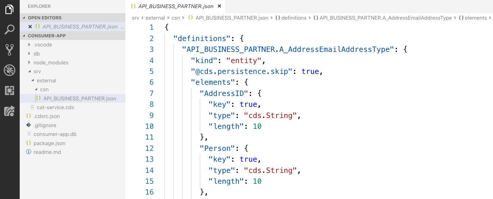
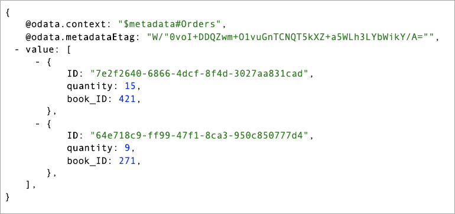
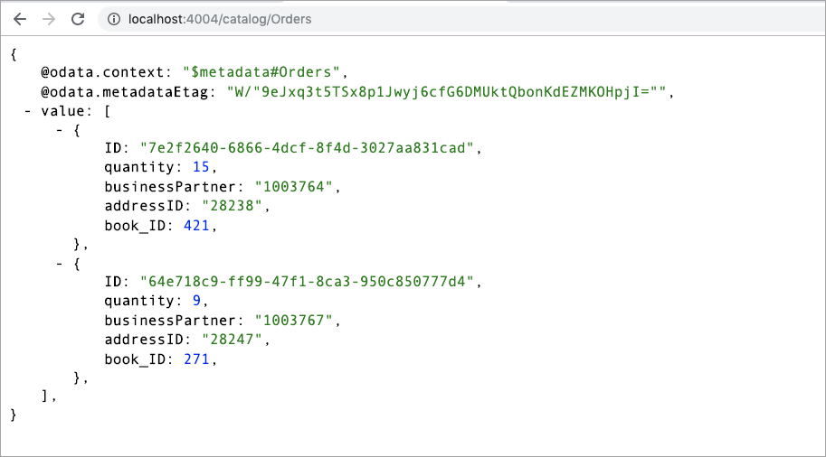
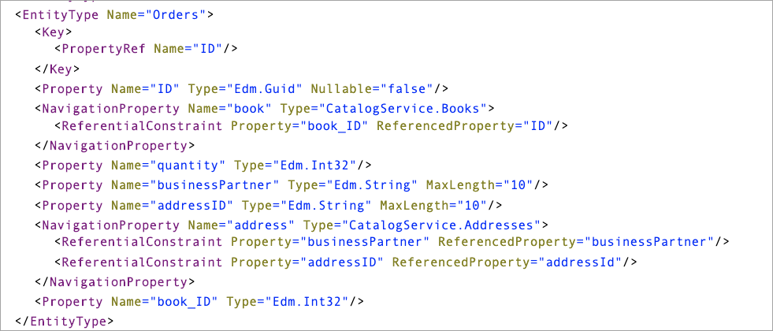
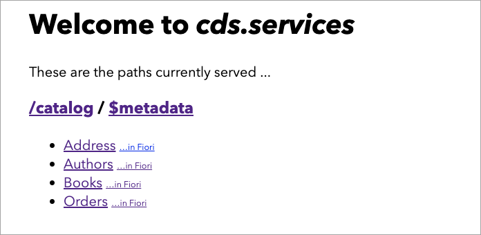

## Prerequisites
- You should start off in the same place as you were at the end of the previous tutorial -- in VS Code, with the project open and an integrated terminal ready with a command prompt for you to enter commands.

## Details
### You will learn
- What a Core Schema Notation (CSN) definition looks like
- How to import a CSN file into a CAP project
- How you can extend definitions using separate files
- How to define consumption of a remote service
- What constraints look like on a navigation property definition

> For a quick map and overview of what this tutorial is, and where it sits in the overall "S/4HANA Extensions with Cloud Application Programming Model (CAP)" mission, see the diagram in this blog post: [SAP TechEd Mission – API Hub, Cloud SDK and CAP – an overview](https://blogs.sap.com/2019/11/08/sap-teched-mission-api-hub-cloud-sdk-and-cap-an-overview/).

It's time to extend the basic CAP-based service you created in the previous tutorial in this mission. You will add to the `Orders` entity a couple more fields that will be used in a relationship constraint definition, and then extend the service as a whole to describe the consumption of business partner address data that will be provided by the remote mock S/4HANA service.

---

[ACCORDION-BEGIN [Step 1: ](Import business partner service definition)]

In order to consume a remote service, and refer to that service's components within a CDS definition, the service definition must be known and in a format that can be used with CDS. In this step, you'll import the Business Partner API service definition, which has already been translated from EDMX to CDS's Core Schema Notation (CSN) for you.

> All the edits you do in this tutorial will be to the consumer app you created in the previous tutorial in this mission.

> You've already performed a similar step (importing a service definition file) in a previous tutorial in this mission - note that you are going to do it again here in this tutorial, this time in your `consumer-app` project, because this consuming app that you're building needs it too. For a slightly different reason of course - the consuming app needs to know about what it's consuming, and the mock service app needed to know what to mock.

First, create a new directory `external/` within the `srv/` directory of the consumer app project, and then within that new `external` directory create a further new directory `csn/`. The names are not fixed but are recommended as the convention for external service definition files in CSN.

Into this new `srv/external/csn/` directory, import the [`API_BUSINESS_PARTNER.json`](https://github.com/SAPDocuments/Tutorials/blob/master/tutorials/cap-cloudsdk-4-enhance-consume/API_BUSINESS_PARTNER.json) file, ensuring that the JSON structure is preserved -- when looking at the file, use the **Raw** link to download it, in a similar way to how you did it in the first tutorial in this mission. Again, if you copy/paste, make sure you only select the JSON and not anything else (such as comments) rendered by any Chrome extension that is being used to display the JSON in a more readable form.

If you open the file it in VS Code, you'll see something similar to this (you may also wish to refer to the Explorer view on the left-hand side of the screenshot to check you got the directory hierarchy correct):



Have a brief browse through this file, which contains definitions of entities in canonical CSN format (represented in JSON here). Find and examine the definition of the `API_BUSINESS_PARTNER.A_BusinessPartnerAddressType` entity.

[VALIDATE_1]
[ACCORDION-END]


[ACCORDION-BEGIN [Step 2: ](Extend the Orders entity)]

The mock SAP S/4HANA service for business partners that you'll be extending this app to consume contains address information, which is identified with the combination of two fields: the ID of the business partner, and the ID of the address itself.

In this step, you will extend the existing `Orders` entity definition in your `consumer-app` project by adding these two fields. Instead of modifying the original file (`db/schema.cds`), create a new file with just this extension in it. It's a small but nevertheless worthwhile example of how you can manage and separate different contributions to the overall data model, service definition and annotation layers.

Create a new file `extended.cds` in the `db/` directory. In this extension, add the following:

> Here, as elsewhere, try to resist the temptation just to copy and paste this content. Instead, type it into the editor manually. That way you will get a feel for the power and utility that the CDS Language Support extension for VS Code offers. If you are typing it in manually, please pay attention to the casing of the property names.

```CDS
using my.bookshop as my from './schema';

extend my.Orders with {
  businessPartner : String(10);
  addressID       : String(10);
}
```

Notice that the definition of these two new properties (`String(10)`) are taken from the CSN definition of the API that you looked at earlier in this tutorial. Notice also how the `Orders` entity reference is resolved with the `using` statement at the start.

Now check how this extension affects the data model as a whole, and the `Orders` entity definition specifically. In the integrated terminal in VS Code, use the following command to generate SQL statements for the data model, and check to see what is generated for the `Orders` entity:

> Ensure you're in the root directory of the project (that is, `consumer-app/`) when you run these commands.

```Bash
cds compile --to sql db
```

You should see these two new properties `businessPartner` and `addressID` defined.

[VALIDATE_2]
[ACCORDION-END]

[ACCORDION-BEGIN [Step 3: ](Add data to the Orders CSV file)]

Now that you've added a couple of new properties to the `Orders` definition, it makes sense to add new data to the corresponding CSV file that is used to seed the table at the persistence layer when the definition is deployed.

Open up the `my.bookshop-Orders.csv` file that is in the `db/csv/` directory, and add two new columns as shown, supplying business partner and address IDs for the two orders (don't forget to add not only the column names but also the data in the two data rows):

```csv
ID,BOOK_ID,QUANTITY,BUSINESSPARTNER,ADDRESSID
7e2f2640-6866-4dcf-8f4d-3027aa831cad,421,15,1003764,28238
64e718c9-ff99-47f1-8ca3-950c850777d4,271,9,1003767,28247
```

> The business partner and address IDs here are specific ones that will match data in the mock SAP S/4HANA service, so you need to make sure you specify the data correctly to have the data entities match up.

[DONE]
[ACCORDION-END]

[ACCORDION-BEGIN [Step 4: ](Deploy and restart the service)]

Now you should deploy and restart the service, in which the following should happen relating to the changes to the `Orders` entity:

- The `Orders` entity will be redefined at the persistence layer with the two new properties.
- The `Orders` data will be loaded from the CSV file, including the new data.

First, redeploy like so:

```Bash
cds deploy
```

This should result in familiar output:

```
 > filling my.bookshop.Books from db/csv/my.bookshop-Books.csv
 > filling my.bookshop.Authors from db/csv/my.bookshop-Authors.csv
 > filling my.bookshop.Orders from db/csv/my.bookshop-Orders.csv
/> successfully deployed database to ./sqlite.db
```

Now restart the service, like so:

```Bash
npm start
```

Notice that neither the `db/extended.cds` file nor the `srv/external/csn/API_BUSINESS_PARTNER.json` file are included:

```
[cds] - connect to datasource - sqlite:sqlite.db
[cds] - serving CatalogService at /catalog
[cds] - service definitions loaded from:

  srv/service.cds
  db/schema.cds
  node_modules/@sap/cds/common.cds

[cds] - server listens at http://localhost:4004 ... (terminate with ^C)
[cds] - launched in: 660.515ms
```

And even when you access the `Orders` entity set at <http://localhost:4004/catalog/Orders>, the new business partner and address properties are not returned:



That's because they haven't been referenced yet at the service definition level. You will address that next.

[DONE]
[ACCORDION-END]

[ACCORDION-BEGIN [Step 5: ](Have the extended Order entity recognized in the service)]

The `srv/service.cds` service definition file is still referencing the entities in the `my.bookshop` namespace from the `db/schema.cds` file. Change this reference now to point to the `db/extended.cds` file, so that the first line in `srv/service.cds` looks like this:

```CDS
using my.bookshop as my from '../db/extended';
```

Now restart the service (re-invoke `npm start` in the integrated terminal). You should see that the `db/extended.cds` source file is now included in the artifacts that are loaded:

```
[cds] - connect to datasource - sqlite:sqlite.db
[cds] - serving CatalogService at /catalog
[cds] - service definitions loaded from:

  srv/service.cds
  db/extended.cds                  <------------
  db/schema.cds
  node_modules/@sap/cds/common.cds

[cds] - server listens at http://localhost:4004 ... (terminate with ^C)
[cds] - launched in: 655.994ms
```

Look at the `Orders` data again via <http://localhost:4004/catalog/Orders>. Whereas prior to this modification, only the book ID and the quantity were returned, now the business partner and address IDs are returned too:



[DONE]
[ACCORDION-END]

[ACCORDION-BEGIN [Step 6: ](Reference the Business Partner API in the service definition)]

Now it's time to define the consumption of the remote mock SAP S/4HANA service, which you'll do in the local `srv/service.cds` service definition file.

First, remove the reference to the `Orders` entity (you'll be adding it back in a different form later in this tutorial) by **deleting** this line from `srv/service.cds`:

```CDS
entity Orders as projection on my.Orders;
```

Next, introduce the Business Partner API by bringing in a reference to the CSN you imported earlier; do this by adding a second `using` statement (directly below the one referencing `../db/extended`):

```CDS
using API_BUSINESS_PARTNER as BUPA_API from './external/csn/API_BUSINESS_PARTNER';
```

Now use this reference to define a new `Addresses` entity in the `srv/service.cds` file, within the `service CatalogService { ... }` definition (i.e. at the same level as the two existing `entity` declarations), exactly like this:

```CDS
  @cds.persistence.skip
  entity Addresses as projection on BUPA_API.A_BusinessPartnerAddressType {
    key BusinessPartner as businessPartner,
    key AddressID as addressId,
    Country as country,
    CityName as cityName,
    StreetName as streetName
  }
```

Finally, add the `Orders` entity back in, but this time, instead of it being a simple and direct projection onto the `Orders` entity as defined at the data model layer (as it was before), use the `mixin` approach like this:

```CDS
  entity Orders as select from my.Orders mixin {
    address: Association to Addresses
      on address.businessPartner = businessPartner
      and address.addressId = addressID;
  } into {
    *,
    address
  }
```

Spend a bit of time staring at that definition, which combines the local properties of the `Orders` entity with a managed to-one association to an entity in the remote service.

[DONE]
[ACCORDION-END]

[ACCORDION-BEGIN [Step 7: ](Examine the service metadata)]

Restart the service by re-invoking `npm start` in the integrated terminal, and then request the service metadata document at <http://localhost:4004/catalog/$metadata>.

Take a few moments to examine what that metadata now looks like:

- The entity container has references to all four entities (`Addresses`, `Authors`, `Books`, `Orders`).
- The `Books` and `Authors` entities are the same as they were before.
- The `Addresses` entity, although we know it is remote, is presented as a consumable type here.

Perhaps most notably:

- The `Orders` entity now has two navigation properties, one with specific referential constraints that you defined in the previous step (in the `on ... and ...` clause).



[VALIDATE_7]
[ACCORDION-END]

[ACCORDION-BEGIN [Step 8: ](Try to access the address data)]

Presented with the service overview at <http://localhost:4004>, you will see something that looks like this:



If you try to access the `Addresses` entity set directly (<http://localhost:4004/catalog/Addresses>) or even make use of the `address` navigation property in the `Orders` entity set (<http://localhost:4004/catalog/Orders?$expand=address>) you will find that an error occurs. This is visible in the response ...

```XML
<error xmlns="http://docs.oasis-open.org/odata/ns/metadata">
<code>500</code>
<message>SQLITE_ERROR: no such table: CatalogService_Addresses</message>
</error>
```

... and also in the console output of the service:

```
SQLITE_ERROR: no such table: CatalogService_Addresses
```

This is because while we've defined the relationship to the remote service, we haven't provided any implementation that will consume that remote service to satisfy those OData query operations. You'll address this in the next tutorial in this mission.

[DONE]
[ACCORDION-END]
