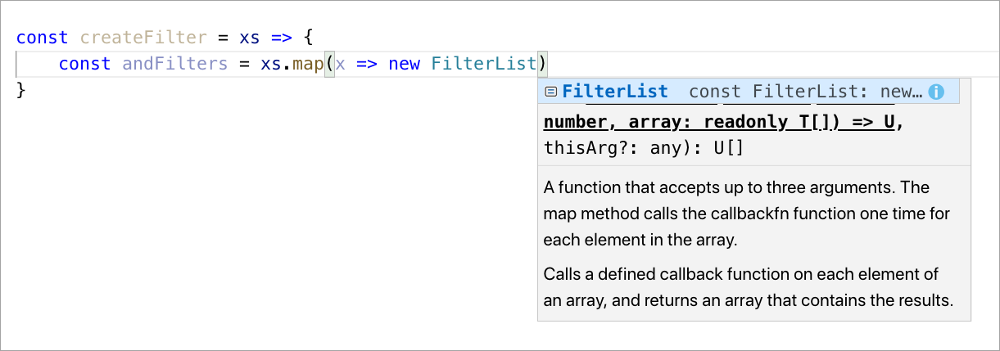

## Prerequisites
- You should start off in the same place as you were at the end of the previous tutorial -- in VS Code, with both mock service and consumer app projects open.

## Details
### You will learn
- How to use SAP Cloud SDK in a Node.js CAP project
- How to implement custom handlers for CDS-based services
- What it feels like to use the SAP Cloud SDK [fluent interface](https://en.wikipedia.org/wiki/Fluent_interface)
- One way to combine local and remote data for an OData response
- How to look at the details of an incoming OData request

> For a quick map and overview of what this tutorial is, and where it sits in the overall "S/4HANA Extensions with Cloud Application Programming Model (CAP)" mission, see the diagram in this blog post: [SAP TechEd Mission – API Hub, Cloud SDK and CAP – an overview](https://blogs.sap.com/2019/11/08/sap-teched-mission-api-hub-cloud-sdk-and-cap-an-overview/).

In the previous tutorial you set up the relationship between local and remote entities declaratively, in the service definition CDS file (`srv/service.cds`). But that's only half the story. Now it's time to make that relationship come to life with some JavaScript in a service implementation that uses the [registration of custom handlers](https://help.sap.com/viewer/66de2977205c403bbc107264b8eccf4b/Cloud/en-US/94c7b69cc4584a1a9dfd9cb2da295d5e.html).

In this tutorial, you will add some implementation logic to handle the case where the OData [$expand query option](http://docs.oasis-open.org/odata/odata/v4.0/os/part2-url-conventions/odata-v4.0-os-part2-url-conventions.html#_Toc372793860) is used to return addresses for the business partners associated with the orders for the books. In other words, to resolve this type of OData query:

<http://localhost:4004/catalog/Orders?$expand=address>

Right now that request will return an error. At the end of this tutorial, it will return data.

The implementation logic will use SAP Cloud SDK to consume the remote mock SAP S/4HANA service you still have running and serving addresses from the Business Partner API.


---

[ACCORDION-BEGIN [Step 1: ](Install SAP Cloud SDK)]

> We recommend that you complete all the command line instructions in VS Code's integrated terminal.

You won't get very far without SAP Cloud SDK for this tutorial, so in this first step you should install it in your `consumer-app` project. Install the SAP Cloud SDK support for the Business Partner API for this project as shown here (this will also cause the SAP Cloud SDK core libraries to be installed, along with others -- you can see the corresponding directories by looking inside the project's `node_modules/` directory, in the `@sap/` subdirectory):

```Bash
npm install @sap/cloud-sdk-vdm-business-partner-service
```


[VALIDATE_1]
[ACCORDION-END]


[ACCORDION-BEGIN [Step 2: ](Initialize a service implementation file)]

Create a new file at the same level as the `service.cds` file (in the `srv/` directory), and with the same name but with a `.js` extension (`srv/service.js`).

In this file, define some key constants as follows:

```JavaScript
const { BusinessPartnerAddress } = require('@sap/cloud-sdk-vdm-business-partner-service')
const { FilterList } = require('@sap/cloud-sdk-core')
const destination = {
    url: 'http://localhost:3000/v2'
}
```

The first two lines make use of features in [SAP Cloud SDK](https://developers.sap.com/topics/cloud-sdk.html). One (`BusinessPartnerAddress`) is the address object from specific virtual data model (VDM) based support for the Business Partners API, and the other is a utility function (`FilterList`) from the SAP Cloud SDK's core, which can be used to construct values for OData `$filter` system query parameters.

Because SAP Cloud SDK has now been installed, these constant declarations will work when executed.

The declaration of `destination` is as a small structure (that might also contain credential information in other circumstances) that locally represents the equivalent of a destination on SAP Cloud Platform. The URL refers, of course, to the root of the OData V2 service that is running from a previous tutorial in this mission.


[DONE]
[ACCORDION-END]

[ACCORDION-BEGIN [Step 3: ](Define helper functions)]

To keep the main part of the implementation relatively clean, define a couple of helper functions next.

#### Function: `createFilter`

First define a `createFilter` function which looks like this:

```JavaScript
const createFilter = xs => {
	const andFilters = xs.map(x => new FilterList([
		BusinessPartnerAddress.BUSINESS_PARTNER.equals(x.businessPartner),
		BusinessPartnerAddress.ADDRESS_ID.equals(x.addressID)
	]))
	return new FilterList(undefined, andFilters).flatten()
}
```

Note that if you type the code in by hand, you'll see the rich contextual help that's available. For example, this screenshot shows the help for `FilterList`, which you imported from the `@sap/cloud-sdk-core` module earlier:



The `createFilter` function takes a list of objects representing records retrieved during normal processing. For example, in the case of the `Orders` requested, the incoming list will look something like this (shown here in JSON):

```JSON
[
  {
    "ID": "7e2f2640-6866-4dcf-8f4d-3027aa831cad",
    "quantity": 15,
    "businessPartner": "1003764",
    "addressID": "28238",
    "book_ID": 421
  },
  {
    "ID": "64e718c9-ff99-47f1-8ca3-950c850777d4",
    "quantity": 9,
    "businessPartner": "1003767",
    "addressID": "28247",
    "book_ID": 271
  }
]
```

What this function produces is a `FilterList` object, which, when expanded, consists of a series of pairs of `AND` filters joined together with `OR`. In a string representation that could then be used as the value for an OData `$filter` system query parameter in an OData query operation, it looks something like this:

```
(((BusinessPartner eq '1003764' and AddressID eq '28238') or (BusinessPartner eq '1003767' and AddressID eq '28247')))
```

#### Function: `SELECT`

Now define another helper function `SELECT` which looks like this:

```JavaScript
function SELECT (columns) {
    return { from(a){
        const b = {}
        for (let p in a) if (p in columns) b[p] = a[p]
        return b
    }}
}
```

This function returns an object of property : value pairs (in b) for those properties requested (in columns). In other words, a subset of the entire set of properties available in the entity (in a). It is used when marshalling the results of the read of the `Orders` entity set.

[DONE]
[ACCORDION-END]

[ACCORDION-BEGIN [Step 4: ](Define the main implementation handler)]

Now that you've defined the helper functions, you're ready to write the main part of the implementation. It's actually relatively short, and consists of a couple of handlers for before and after `READ` events for the `Orders` entity type.

Add the following to the `srv/service.js` file, after the helper functions:

```JavaScript
module.exports = srv => {

	srv.before('READ', 'Orders', async (req) => {

		const { SELECT } = req.query
		SELECT.columns = SELECT.columns.filter(c => !(c.expand && c.ref[0] === 'address'))

	})

	srv.after('READ', 'Orders', async (results, req) => {

		const { Addresses } = srv.entities

		const $expand = req._.odataReq.getQueryOptions() && req._.odataReq.getQueryOptions().$expand || ''
		const result = results[0] || {}

		const entityRE = new RegExp(/([a-z]+)(?=(\(|$))/g)

		if ($expand && $expand.match(entityRE).includes('address') && 'businessPartner' in result && 'addressID' in result) {

			const addresses = await BusinessPartnerAddress
				.requestBuilder()
				.getAll()
				.filter(createFilter(results))
				.execute(destination)

			results.forEach(order => order.address = SELECT (Addresses.elements) .from (addresses.find(
				address => order.businessPartner === address.businessPartner && order.addressID === address.addressId
			)))

		}

	})
}
```

Here's a brief explanation:

- The _before_ handler modifies the incoming request, before the read operation is fulfilled. It removes references to any columns that are not going to be available locally, so that the query can be processed by the core handler successfully. If there's a `$expand=address` in the query, there will be an `address` column (marked to be expanded, too) which would otherwise cause the local retrieval to fail. Notice how this handler receives only the request object (in `req`).

- The _after_ handler is called after the core handler has finished, and it receives not only the original request object but also the results of the core handler's retrieval activities -- that is, the `Order` entities (in `results`). It checks to see if an expand on the address navigation property was requested, and if so, uses the fluent API of SAP Cloud SDK to construct a request for `BusinessPartnerAddress` data, making use of the `createFilter` helper function. After making the call to the remote destination (your mock service running at `http://localhost:3000/v2`), it then attaches the address data to the relevant order records, where the keys match up.

[DONE]
[ACCORDION-END]

[ACCORDION-BEGIN [Step 5: ](Check your implementation logic)]

Check that what you have in `srv/service.js` matches up with the following, which is what the entirety of that JavaScript file should be:

```JavaScript
const { BusinessPartnerAddress } = require('@sap/cloud-sdk-vdm-business-partner-service')
const { FilterList } = require('@sap/cloud-sdk-core')
const destination = {
  url: 'http://localhost:3000/v2'
}

const createFilter = xs => {
  const andFilters = xs.map(x => new FilterList([
    BusinessPartnerAddress.BUSINESS_PARTNER.equals(x.businessPartner),
    BusinessPartnerAddress.ADDRESS_ID.equals(x.addressID)
  ]))
  return new FilterList(undefined, andFilters).flatten()
}

function SELECT (columns) {
    return { from(a){
      const b = {}
        for (let p in a) if (p in columns) b[p] = a[p]
        return b
  }}
}

module.exports = srv => {

  srv.before('READ', 'Orders', async (req) => {

    const { SELECT } = req.query
    SELECT.columns = SELECT.columns.filter(c => !(c.expand && c.ref[0] === 'address'))

  })

  srv.after('READ', 'Orders', async (results, req) => {

    const { Addresses } = srv.entities

    const $expand = req._.odataReq.getQueryOptions() && req._.odataReq.getQueryOptions().$expand || ''
    const result = results[0] || {}

    const entityRE = new RegExp(/([a-z]+)(?=(\(|$))/g)

    if ($expand && $expand.match(entityRE).includes('address') && 'businessPartner' in result && 'addressID' in result) {

      const addresses = await BusinessPartnerAddress
        .requestBuilder()
        .getAll()
        .filter(createFilter(results))
        .execute(destination)

      // Add the data from the remote entity to each of the results, where the keys match up
      results.forEach(order => order.address = SELECT (Addresses.elements) .from (addresses.find(
        address => order.businessPartner === address.businessPartner && order.addressID === address.addressId
      )))

    }

  })
}
```

[DONE]
[ACCORDION-END]

[ACCORDION-BEGIN [Step 6: ](Start the consumer-app service)]

You're already running the mock SAP S/4HANA service, which this new `consumer-app` service will make use of. So now it's time to restart the `consumer-app` service.

In the integrated terminal, do this by invoking the usual command thus:

```Bash
npm start
```

This time you should notice that the startup messages also mention the fact that the main service (`CatalogService`) has an implementation in `service.js`, which (by implication) has also been successfully loaded:

```
[cds] - connect to datasource - sqlite:sqlite.db
[cds] - serving CatalogService at /catalog - with impl: srv/service.js
[cds] - service definitions loaded from:

  srv/service.cds
  db/extended.cds
  srv/external/csn/API_BUSINESS_PARTNER.json
  db/schema.cds
  node_modules/@sap/cds/common.cds

[cds] - launched in: 1963.309ms
[cds] - server listening on http://localhost:4004 ...
[ terminate with ^C ]
```

> Regarding each of the definition files listed in this output, take a moment to make sure you understand why each of them has been loaded.

> You're running your `consumer-app` service, but also make sure your mock service (from the first two tutorials in this mission) is still running. You can check by requesting data from it at this URL: <http://localhost:3000/v2/sap/opu/odata/sap/API_BUSINESS_PARTNER/A_BusinessPartnerAddress>. If you get no response, pop back over to the tutorial "[Install an OData V2 Adapter](https://developers.sap.com/tutorials/cap-cloudsdk-2-v2-adapter.html)" earlier in this mission, specifically to Step 3 ("Start the service and check the OData responses") to see how to restart it (tip: `npm start`).

Now the `consumer-app` service has been started up, you can explore the data again, using OData queries like these:

- The book orders: <http://localhost:4004/catalog/Orders?$expand=book>
- The authors and their books: <http://localhost:4004/catalog/Authors?$expand=books>
- Books that are low on stock: <http://localhost:4004/catalog/Books?$filter=stock%20lt%2050>

But you can now also explore the orders with the corresponding addresses, like this:

- The orders and the addresses of the ordering business partners: <http://localhost:4004/catalog/Orders?$expand=address>

This last query causes a call to be made to the mock service in order to fully prepare the response, and should return something that looks like this:

```JSON
{
  "@odata.context": "$metadata#Orders(address())",
  "@odata.metadataEtag": "W/\"A2eaKarp/YHq3Cd1xXOM0LWCByE1rbdIuqstTdJEvc4=\"",
  "value": [
    {
      "ID": "7e2f2640-6866-4dcf-8f4d-3027aa831cad",
      "quantity": 15,
      "businessPartner": "1003764",
      "addressID": "28238",
      "book_ID": 421,
      "address": {
        "businessPartner": "1003764",
        "addressId": "28238",
        "country": null,
        "cityName": "Walldorf",
        "streetName": "Dietmar-Hopp-Allee"
      }
    },
    {
      "ID": "64e718c9-ff99-47f1-8ca3-950c850777d4",
      "quantity": 9,
      "businessPartner": "1003767",
      "addressID": "28247",
      "book_ID": 271,
      "address": {
        "businessPartner": "1003767",
        "addressId": "28247",
        "country": null,
        "cityName": "Potsdam",
        "streetName": "Konrad-Zuse-Ring"
      }
    }
  ]
}
```

Well done -- you've just built a service that serves data from local persistence combined with data from a remote service!

[DONE]
[ACCORDION-END]
