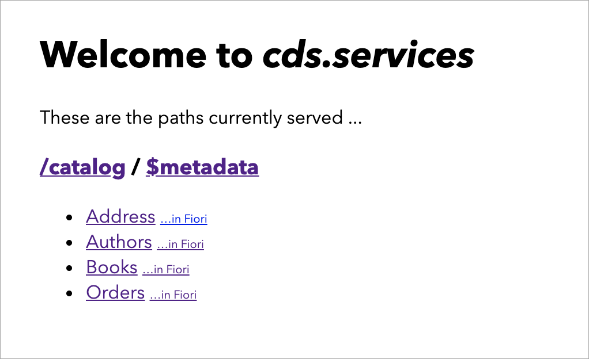
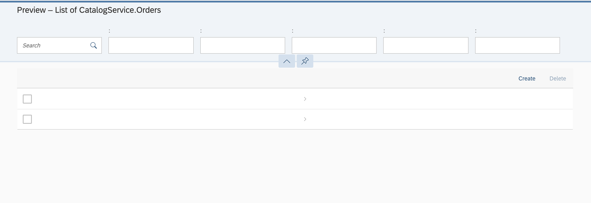
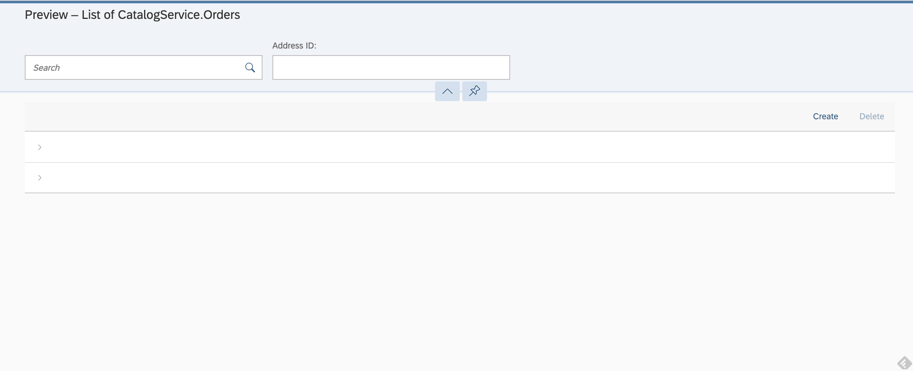
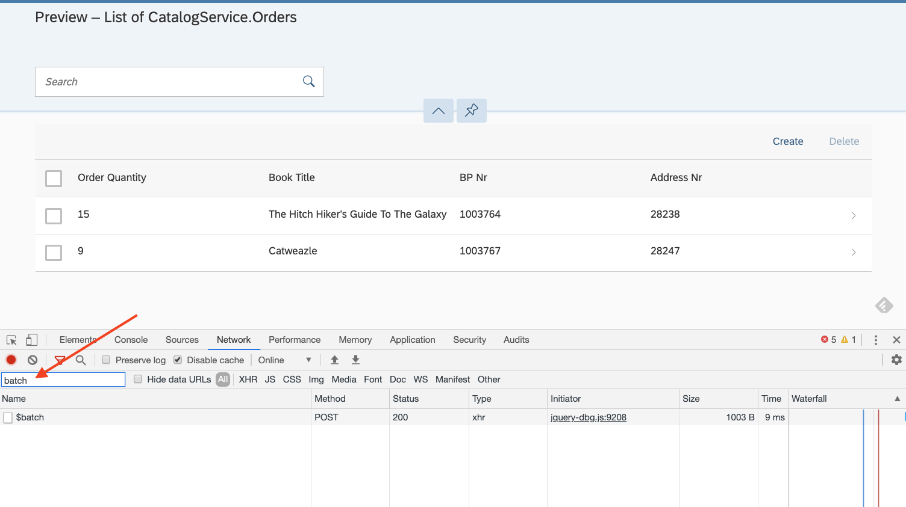
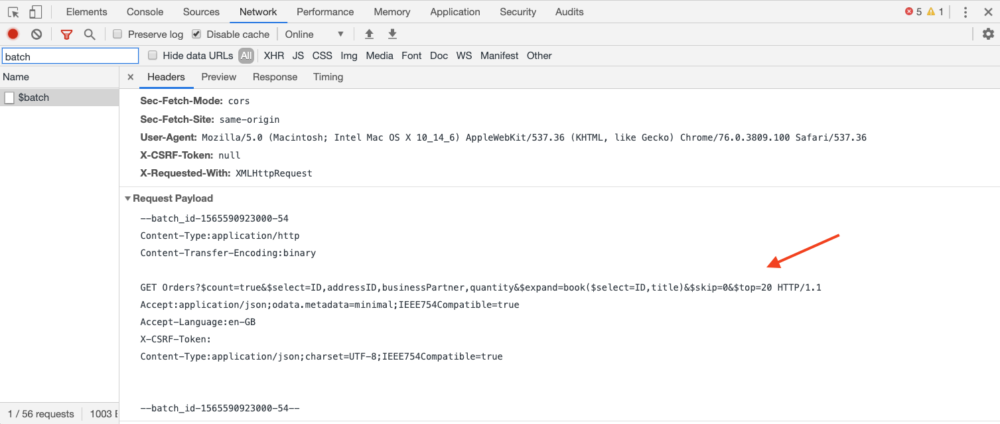
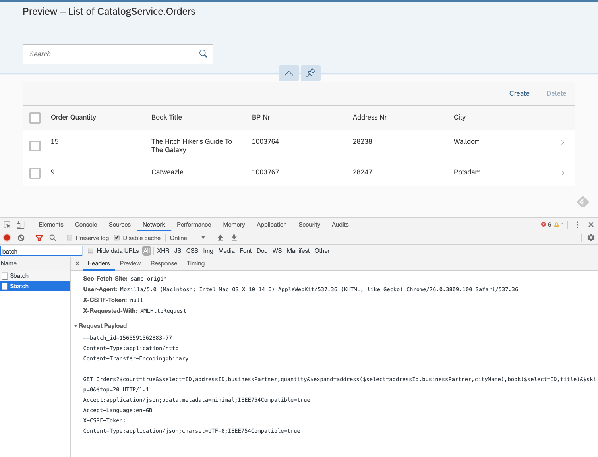
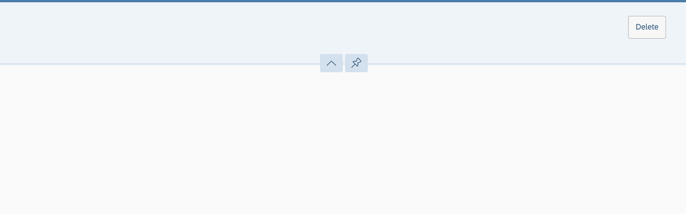
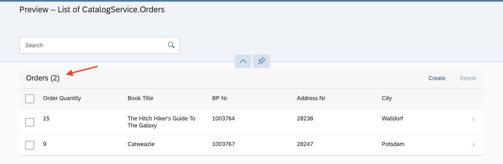
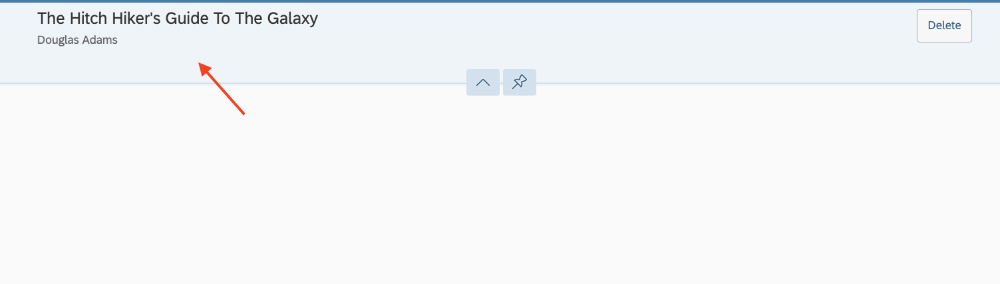

## Prerequisites
- You should start off in the same place as you were at the end of the previous tutorial -- in VS Code, with both mock service and consumer app projects open and running.

## Details
### You will learn
- What the _SAP Fiori preview_ feature is in CAP services
- How that feature uses SAP Fiori Elements
- Basic annotations for controlling the UI of SAP Fiori Element List Reports
- How SAP Fiori Elements apps cause appropriate OData operations to be generated

> For a quick map and overview of what this tutorial is, and where it sits in the overall "S/4HANA Extensions with Cloud Application Programming Model (CAP)" mission, see the diagram in this blog post: [SAP TechEd Mission – API Hub, Cloud SDK and CAP – an overview](https://blogs.sap.com/2019/11/08/sap-teched-mission-api-hub-cloud-sdk-and-cap-an-overview/).

In the previous tutorial you got the consumer app retrieving data from the remote mock service, and saw the data in raw form (<http://localhost:4004/catalog/Orders?$expand=address>) -- that is, a JSON representation of a response to an OData query operation.

To complete this mission, you will now make use of the SAP Cloud Application Programming Model runtime's _SAP Fiori preview_ feature, and supply annotations describing what information should appear in that preview. Needless to say, you'll specify information from both local and remote sources.


---

[ACCORDION-BEGIN [Step 1: ](Explore the raw SAP Fiori preview)]

Based on this tutorial's prerequisites within the context of the mission, your consumer app should be running and available at <http://localhost:4004>. If it isn't, go to the integrated terminal in your VS Code instance where you've been editing your consumer app and start it with:

```Bash
npm start
```

At the root URL <http://localhost:4004> you should see something similar to this:



Next to the link to the `Orders` entity set, there's the **`...in Fiori`** link, which is the automatic SAP Fiori preview for that `Orders` entity set. Select it, and you should see something like this:



This is the basis upon which you will build, adding annotations to declare what should appear.

Note that there are two empty records in the list, and if you were wondering if there were two because you have two `Orders` records currently stored in your consumer app service, you'd be correct.

[VALIDATE_1]
[ACCORDION-END]

[ACCORDION-BEGIN [Step 2: ](Create an annotations file)]

Alongside the `service.cds` and `service.js` files you already have in the `srv/` directory of your consumer app project, create a new file called `annotations.cds`.

> All of the annotations that you're about to add are UI-related and are documented in the [OData 4.0 Vocabularies - SAP UI](https://wiki.scn.sap.com/wiki/display/EmTech/OData+4.0+Vocabularies+-+SAP+UI) Wiki page.

The first annotation you should add is one that will reduce the five selection fields down to one (for the address ID), to neaten things up a little and make things simpler.

Add the following to the `annotations.cds` file; it's an annotation that gives a title for the `addressID` property, and then a single line describing the selection fields, like this:

```CDS
annotate CatalogService.Orders with {
	addressID @title:'Address ID'
}

annotate CatalogService.Orders with @UI.SelectionFields: [ addressID ];

```

Now restart the service by issuing this command in the integrated terminal (you may have to cancel the existing execution with **Ctrl-C**):

```Bash
npm start
```

After restarting the service, refresh the SAP Fiori preview page for the `Orders` entity (this page: <http://localhost:4004/$fiori-preview?service=CatalogService&entity=Orders>). You should see that there is now only a single selection field plus the search field, so that it looks similar to this:



[DONE]
[ACCORDION-END]

[ACCORDION-BEGIN [Step 3: ](Invoke auto restart with cds watch)]

In subsequent steps in this tutorial you'll be making a number of small incremental changes, and restarting the service each time, with `npm start`, to check. There's a better way, and that's using the [watch](https://cap.cloud.sap/docs/get-started/in-a-nutshell#run) facility.

In the terminal, invoke the following command:

```Bash
cds watch
```

You should see output similar to this:

```
[cds] - running nodemon...
--exec cds run --with-mocks --in-memory?
--ext cds,csn,csv,ts,mjs,cjs,js,json,properties,edmx,xml
```

followed by the regular output that you've seen from `npm start` (which, if you look inside the `package.json` file, actually invokes `cds run`).

You can now continue to make the changes in the rest of this tutorial without having to use `npm start` each time. Nice!

[DONE]
[ACCORDION-END]

[ACCORDION-BEGIN [Step 4: ](Rework the annotation syntax)]

Let's use our newly discovered annotation power to good effect and enhance the display of the preview by specifying properties that should appear on each line (which are still currently empty).

Right now there is a single annotation line in the `srv/annotations.cds` file that describes the selection fields required, so you _could_ add another `annotate CatalogService.Orders` statement below it. Instead, embrace the syntactical flexibility and modify that last single line so it looks like this:

```CDS
annotate CatalogService.Orders with @(

	UI: {
		SelectionFields: [ addressID ],
	}

);
```

Syntactically this is just the same as what you had before, except that it's a bit more verbose. For example, notice that the curly braces are in place after the `UI` part, wrapping the `SelectionFields` child term in such a way that you can add further siblings in the same expression. If you're not convinced, simply refresh the browser tab to check.

[DONE]
[ACCORDION-END]

[ACCORDION-BEGIN [Step 5: ](Add line item annotations)]

Now that you have reworked the annotations, it's easier to add further elements. In this step, add a `UI.LineItem` annotation by modifying what you have in the latter half of `srv/annotations.cds` so it looks like this (that is,  add the `LineItem` section directly below the `SelectionFields` annotation):

```CDS
annotate CatalogService.Orders with @(

	UI: {
		SelectionFields: [ addressID ],
		LineItem: [
			{ Value: quantity, Label: 'Order Quantity' },
			{ Value: book.title, Label: 'Book Title' },
			{ Value: businessPartner, Label: 'BP Nr' },
			{ Value: addressID, Label: 'Address ID' }
		]
	}

);
```

Note that the second property is `book.title` -- a property of the `Books` entity that is related via the `book` navigation property of the `Orders` entity.

Check this out in the browser tab, and also by opening the Chrome Developer Tools in your Chrome browser (you _are_ using Chrome, right?) by right-clicking anywhere on the main app display in the **Preview - List of CatalogService.Orders** tab and choosing **Inspect**. Once open, select the **Network** panel, specify the word **`batch`** in the **Filter** field, and refresh the tab.

You should see something like this (on your instance of Chrome, the Developer Tools may have opened to the right rather than at the bottom, that's also fine):



At this point, select the request, and then scroll down to the bottom of the **Headers** tab, where you'll be able to view the actual OData operation that was sent:



It shows a GET request for a (relative) URL that looks like this:

```
Orders?$count=true&$select=ID,addressID,businessPartner,quantity&$expand=book($select=ID,title)&$skip=0&$top=20
```

Here is the same URL with some whitespace to make it readable:

```
Orders
	?$count=true
	&$select=ID,addressID,businessPartner,quantity
	&$expand=book($select=ID,title)
	&$skip=0
	&$top=20
```

Take note of the `$expand` system query option to retrieve the ID and title properties of the `Books` entity, via the `book` navigation property.

[VALIDATE_5]
[ACCORDION-END]

[ACCORDION-BEGIN [Step 6: ](Add a further list item annotation for the remote data)]

It's time to add one more `ListItem` annotation to bring in some data from the remote mock service -- the name of the business partner's city.

Add another line to the `ListItem` annotation for `address.cityName` so that it looks like this:

```CDS
		LineItem: [
			{ Value: quantity, Label: 'Order Quantity' },
			{ Value: book.title, Label: 'Book Title' },
			{ Value: businessPartner, Label: 'BP Nr' },
			{ Value: addressID, Label: 'Address ID' },
			{ Value: address.cityName, Label: 'City' }
		]
```

By now you might be able to guess what this will do -- cause the OData query operation to have further `$expand` requirements for the `address` navigation property, selecting (in addition to the foreign keys that makes the managed association work) the `cityName` property.

Refresh the browser tab while you still have the Chrome Developer Tools open at the **Network** panel, with the value **`batch`** still in the filter field. Once the page has reloaded, select the latest `$batch` request listed, and scroll down to the bottom of the **Network** panel to see something that should look like this:



Note the additional request to expand the `address` navigation property in the URL (shown here with extra whitespace as before):

```
Orders
	?$count=true
	&$select=ID,addressID,businessPartner,quantity
	&$expand=address($select=addressId,businessPartner,cityName),book($select=ID,title)
	&$skip=0
	&$top=20
```

And of course, you will notice that data from your remote mock service, specifically the city names, are displayed successfully in the list report. Well done!

[DONE]
[ACCORDION-END]

[ACCORDION-BEGIN [Step 7: ](Finish off with a few more annotations)]

To finish off, it's worth adding a few more annotations; first, to give a title to the list items, and second to start off some display of an item when selected, because the display of a selected item from the list currently looks rather empty:



You should add these annotations in the same `srv/annotations.cds` file as before -- in fact they all belong to the `HeaderInfo` term, which, according to the [OData 4.0 Vocabularies - SAP UI](https://wiki.scn.sap.com/wiki/display/EmTech/OData+4.0+Vocabularies+-+SAP+UI) page, is described as "Information for the header area of an entity representation."

Add a `HeaderInfo` term below the `LineItem` term as shown:

```CDS
annotate CatalogService.Orders with @(

	UI: {
		SelectionFields: [],
		LineItem: [
			{ Value: quantity, Label: 'Order Quantity' },
			{ Value: book.title, Label: 'Book Title' },
			{ Value: businessPartner, Label: 'BP Nr' },
			{ Value: addressID, Label: 'Address ID' },
			{ Value: address.cityName, Label: 'City' }
		],
		HeaderInfo: {
			TypeName: 'Order',
			TypeNamePlural: 'Orders',
			Description: { Value: book.title }
		}
	}

);
```

After the service has been restarted again by the `cds watch` facility, this will result in a nice title to the list report, like this:



It will also cause the display of any selected item from the list, to look like this:



Lovely!

[DONE]
[ACCORDION-END]

At this point, at the end of the mission, you should have the following:

- A mock SAP S/4HANA service listening on port 3000 and responding to OData V4 and OData V2 requests
- A simple consumer app listening on port 4004, with a simple annotation-driven SAP Fiori Elements-based UI
- Application logic in the consumer app's service that uses SAP Cloud SDK to consume the remote service
- All powered by the SAP Cloud Application Programming Model

Good work!
