# Add the SAP SuccessFactors Extension to the Launchpad
<!-- description --> In this last phase of the development journey you will finally add your deployed extension to an SAP Fiori Launchpad on BTP.

## Prerequisites
 - Complete the tutorial: [**Prepare to Develop the SAP SuccessFactors Extension**](cap-extend-sfsf-intro)
 - Complete the tutorial: [**Jump start the SAP SuccessFactors Extension CAP Project**](cap-extend-sfsf-jumpstart)
 - Complete the tutorial: [**Import SAP SuccessFactors OData Services definitions**](cap-extend-sfsf-import-services)
 - Complete the tutorial: [**Create the CDS Data Model for the SAP SuccessFactors Extension**](cap-extend-sfsf-data-model)
 - Complete the tutorial: [**Create the CAP Service for the SAP SuccessFactors Extension**](cap-extend-sfsf-create-service)
 - Complete the tutorial: [**Add Business Logic to the SAP SuccessFactors Extension**](cap-extend-sfsf-add-logic)
 - Complete the tutorial: [**Prepare the SAP SuccessFactors Extension UI with CDS Annotations**](cap-extend-sfsf-ui-annotations)
 - Complete the tutorial: [**Add Security to the SAP SuccessFactors Extension**](cap-extend-sfsf-add-security)
 - Complete the tutorial: [**Deploy the SAP SuccessFactors Extension Database to SAP HANA Cloud**](cap-extend-sfsf-deploy-hc)
 - Complete the tutorial: [**Develop the SAP Fiori Elements Application for the SAP SuccessFactors Extension**](cap-extend-sfsf-fiori-elements)
 - Complete the tutorial: [**Deploy the SAP SuccessFactors Extension to Cloud Foundry**](cap-extend-sfsf-deploy-cf)

> **IMPORTANT UPDATE**: As of **January, 12th, 2023**, **SAP Launchpad Service** has been re-branded to **SAP Work Zone Standard Edition**. As it's been just a product renaming, there's no impact on the functionality, hence not requiring any changes in the procedures described in this tutorial. Therefore, wherever you read **SAP Launchpad Service** in the tutorial, please read **SAP Work Zone Standard Edition**.

## You will learn
  - How to **access the Work Zone Standard Edition Site Manager**
  - How to **prepare the business content** for the Work Zone Standard Edition Site
  - How to **assign the application** to the **business content** and **launchpad roles**
  - How to **create the Work Zone Standard Edition Site**
  - How to **test the Work Zone Standard Edition Site and your application**

---

### Access the work zone standard edition site manager

In the **SAP BTP cockpit**, on the **left-hand pane** expand the **Services** menu and (1) click on **Instances and Subscriptions**. On the right side, locate the **SAP Work Zone Standard Edition** under **Subscriptions** and (2) click on the **Go to Application** icon next to it.

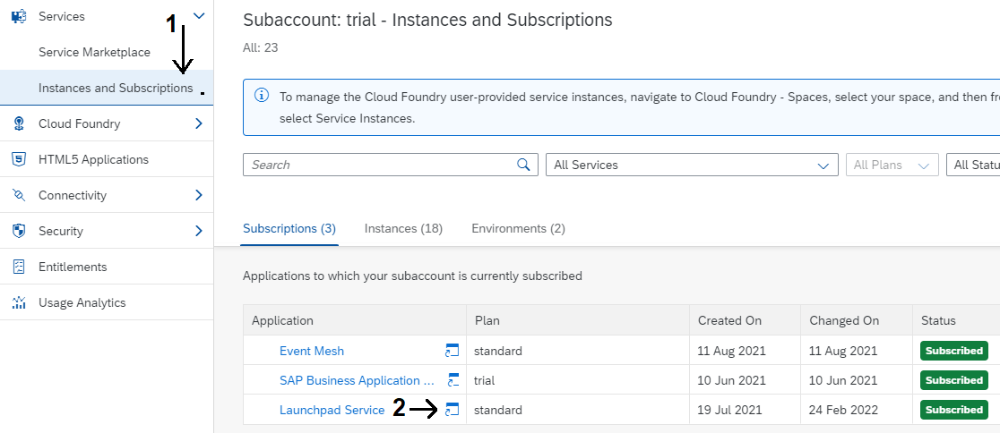

The **Site Manager UI** will open-up in a new browser tab. So, the first thing you need to do is to **refresh** (grab) the content from the **HTML5 applications** repository for bring in our application from there.

(1) Click on the **sandwich menu** at the top-left corner of the page to expand the app menu and (2) click on the **Provider Manager** option. Then, (3) click on the **refresh button** at the far right of the **HTML5 apps** provider to bring-in the content from there.

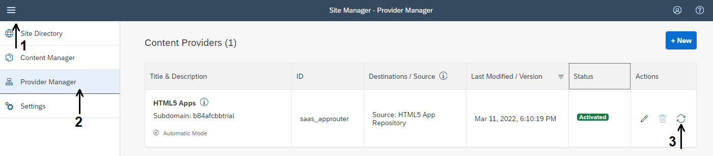

### Prepare the business content - application, group and catalog

To learn about the **concepts** managed by the **SAP Work Zone Standard Edition**, please refer to the official documentation in [**this link**](https://help.sap.com/viewer/8c8e1958338140699bd4811b37b82ece/Cloud/en-US/3f619a13ca2a4a59a14bec8507c3fb69.html).

(1) Click on the **Content Manager** option, then (2) on the **Content Explorer** tab and, finally, (3) on the **HTML5 Apps** tile.

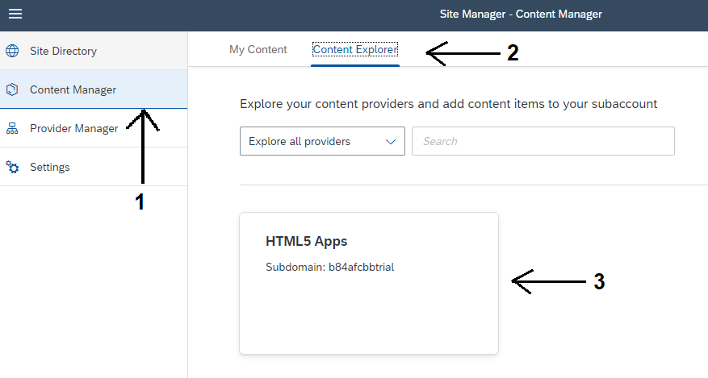

(1) Select the **Manage Projects** app, then (2) click on the **Add to My Content** button.

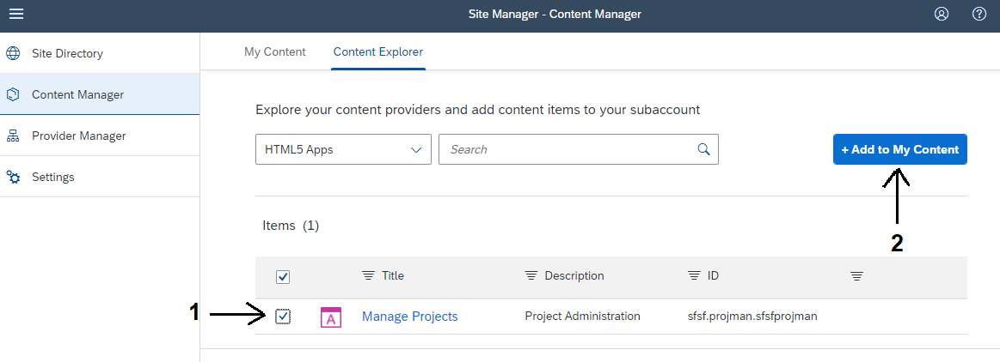

(1) Click on the **My Content** tab, then (2) on the **New** button and (3) select **Catalog** from the menu.

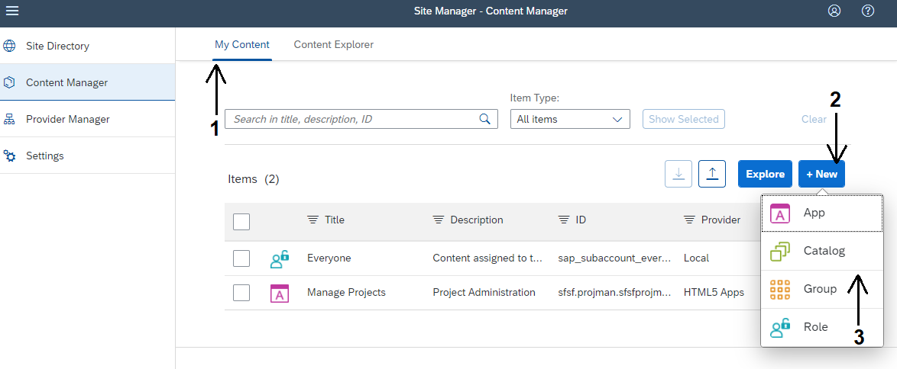

Type **Project Management** as **Title** and **Project Management Catalog** as **Description**. (1) Click on the **Assign Items** search bar and, then, (2) on the "**+**" icon to the right of the **Manage Projects** app. Finally, (3) click on the **Save** button.

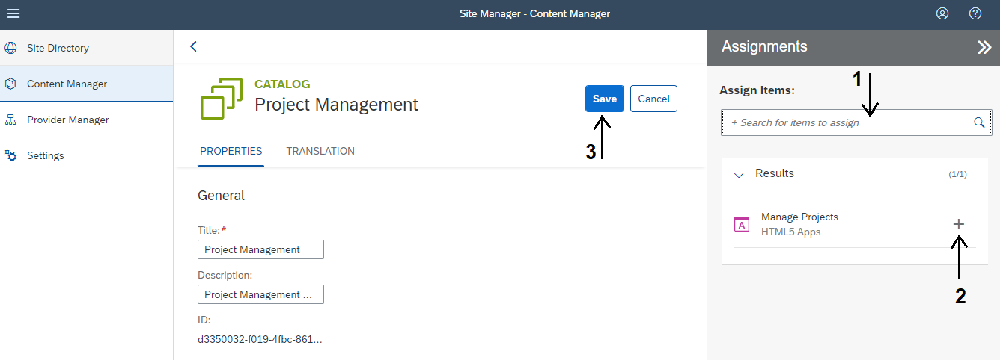

Go back to the **Content Manager** home page, (1) click on the **New** button and (2) select **Group** from the menu.

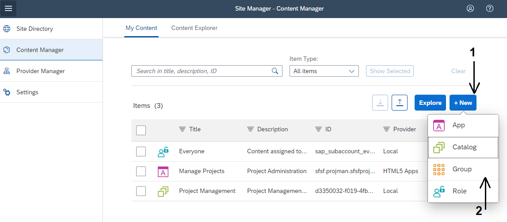

Type **SuccessFactors Extensions** as **Title** and **SuccessFactors Extensions Group** as **Description**. (1) Click on the **Assign Items** search bar and, then, (2) on the "**+**" icon to the right of the **Manage Projects** app. Finally, (3) click on the **Save** button.

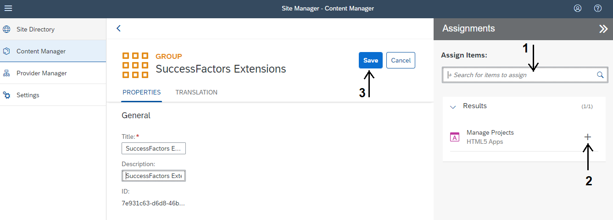

### Assign the application to everyone

Go back to the **Content Manager** home page and click on the **Everyone** role in the list.

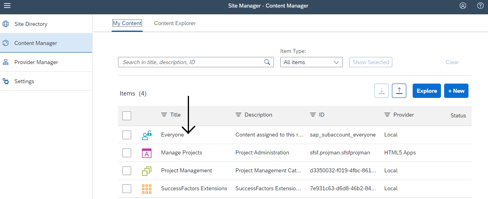

Click on the **Edit** button at the top-right and then (1) on the **Assign Items** search bar. (2) Click on the "**+**" icon to the right of the **Manage Projects** app. Finally, (3) click on the **Save** button.

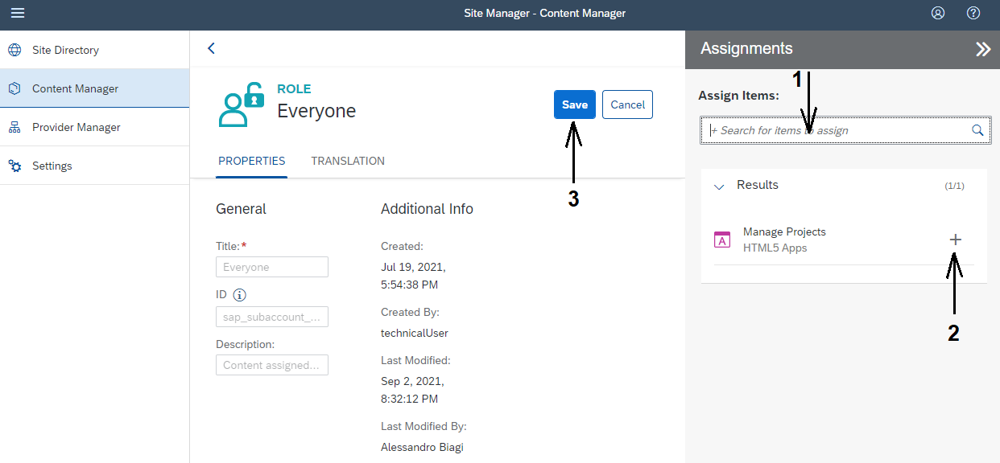

### Create the work zone standard edition site

(1) Click on the **Site Directory** option and then (2) on the **Create Site** button.

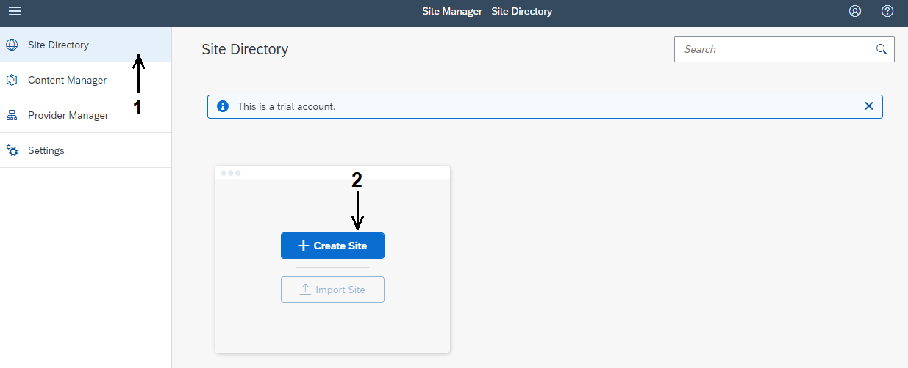

Name the site **BTP Extensions** and click on the **Create** button.

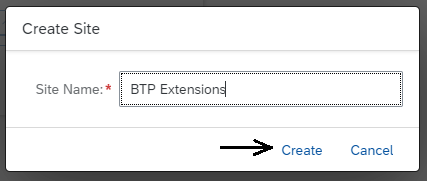

### Test the site and application

Click on the link below the **URL** field to **launch the site**, which will open-up in a new browser tab.

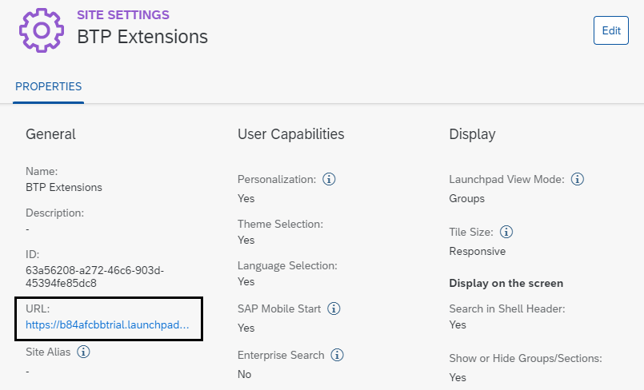

Click on the **Maintain Projects** tile to **launch the application**.

> **NOTE**: the title "**Maintain Projects**" is taken from the **SAP Fiori Launchpad (FLP) configuration** that was done when the SAP Fiori Elements application has been created following this tutorial: [**Develop the SAP Fiori Elements Application for the SAP SuccessFactors Extension**](cap-extend-sfsf-fiori-elements).

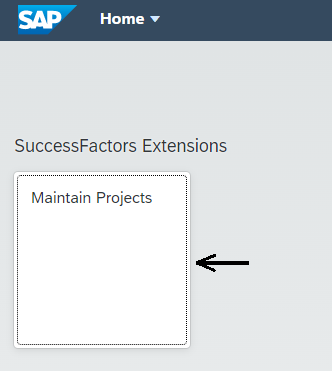

The **List Report page** for the **Project** entity will be loaded:

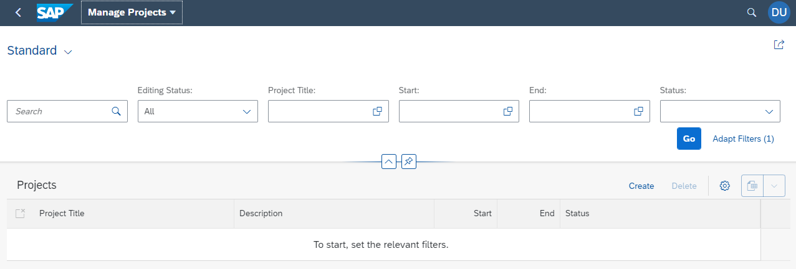

Now, click on the **Go** button and the **initial test data** (loaded to the HANA database from the CSV files) will be displayed:

And that's it! You have successfully added a **fully working SAP Fiori Elements application** deployed to **SAP BTP's HTML5 Apps Repository** to an **SAP Work Zone Standard Edition** site.

You can, now, test it at your will, in the same way you did using the **Fiori Preview** in **step 6** of the tutorial: [**Prepare the SAP SuccessFactors Extension UI with CDS Annotations**](cap-extend-sfsf-ui-annotations).

And this is the **final step** to **Extend SAP SuccessFactors on SAP BTP with CAP**!

### Check your knowledge

### Stretch yourself

**Congratulations**! After having gone through and completed the tutorials in this group you should have successfully **Extended SAP SuccessFactors on SAP BTP with CAP** with a **simple project management application**!

But there's a lot of room for improvement in this solution, so don't miss the opportunity to challenge yourself and go deeper in learning the technologies showcased in this tutorials group by enhancing your application!

Here's a list of suggestions for enhancements:

- Directly assign an SAP SuccessFactors employee to a project as the "Project Owner" adding the corresponding assignment to the employee profile
- Implement a mechanism to remove the assignment from the employee profile whenever he/she is removed from a project team (either by member deletion or replacement). The same would apply to the "Project Owner"
- Implement validations such as: projects must start at least from the current date (not before) and must end after the start date and activities due dates must be within the project's start and end dates
- Implement a mechanism to avoid activities to be added before there's at least one member in the team to assign them
- Implement restrictions such as: users can only view/manage projects that have been created by themselves, only employees who report to the project creator can be assigned as team members, etc.
- And so on, and so forth… the sky's the limit!

