# Add Business Logic to the SAP SuccessFactors Extension
<!-- description --> In this phase of the development you will add the business logic of the extension.

## Prerequisites
 - Complete the tutorial: [**Prepare to Develop the SAP SuccessFactors Extension**](cap-extend-sfsf-intro)
 - Complete the tutorial: [**Jump start the SAP SuccessFactors Extension CAP Project**](cap-extend-sfsf-jumpstart)
 - Complete the tutorial: [**Import SAP SuccessFactors OData Services definitions**](cap-extend-sfsf-import-services)
 - Complete the tutorial: [**Create the CDS Data Model for the SAP SuccessFactors Extension**](cap-extend-sfsf-data-model)
 - Complete the tutorial: [**Create the CAP Service for the SAP SuccessFactors Extension**](cap-extend-sfsf-create-service)

## You will learn
  - How to **create the code file** of the **service module** to attach the service handlers
  - How to **write the service module code**
  - How to **organize your code** in the CAP project
  - How to **write the service handlers code**
  - How to **attach the service handlers** to the **service module events** (OData operations)

---

### Create the service module code file


The **business logic** of the application is implemented via **custom service handlers** for the various operations executed on its entities (create, read, update, delete, etc.). Those handlers are defined in a **module** within a `JavasScript` file with the **same name** of the service but with the `.js` extension.

So, now it's time for you to create it.

On the **left-hand pane** of **SAP Business Application Studio**,  (1) select the `srv` folder, then (2) click on the **three dots** to the right of the project name and (3) select **New File**.

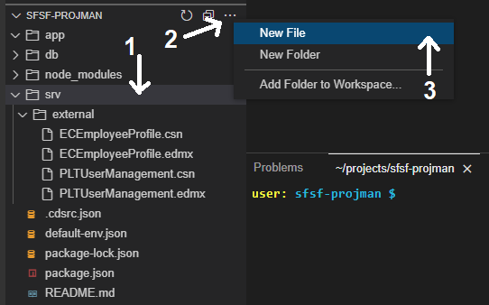

On the **dialog** name the file `projman-service.js` and click **OK**.

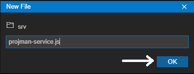


### Code the service module


Copy and paste the **code snippet below** into the recently created file:

```JavasScript
const cds = require('@sap/cds');

module.exports = cds.service.impl(async function () {
    /*** SERVICE ENTITIES ***/
    const {
        Project,
        Member,
        SFSF_User,
    } = this.entities;

    /*** HANDLERS REGISTRATION ***/
    // ON events

    // BEFORE events

    // AFTER events
});
```
Here you import the `@sap/cds` dependency and reference it as `cds`. Then, you implement the service module and, inside it, reference three entities: `Project`, `Member` and `SFSF_User`, as you are supposed to develop handlers for them.

Finally, you make some **comments** as **placeholders** to mark where you will further put your code.


### Organize your code


It is a best practice to have your code organized into **files** representing the nature of the code (i.e. **utility functions** should go into some `utils` file, **handlers** should go into some `handlers` file and so on). Those files represent your "code library", so it's appropriate to store them into some `lib` folder.

So, now you'll create the `lib` folder and its contents.

In the **Terminal** press `CTRL+C` to terminate the `cds watch` command (if not yet terminated).

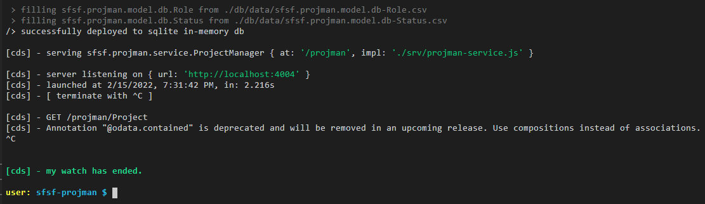

Type `cd srv` and press **Enter**.

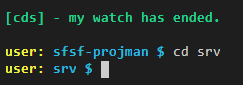

Type `mkdir lib` and press **Enter**.

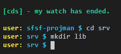

Type `touch lib/handlers.js` and press **Enter**.

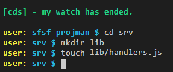


### Code the service handlers


Now, you'll develop the required service handlers according to the business rules that have been defined in the [**group introduction and preparation**](cap-extend-sfsf-intro).

### Users READ handler

On the **left-hand pane** expand the `lib` folder, then click on the `hanlers.js` file to open it.

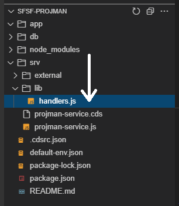

Copy and paste the **following code snippet** into `handlers.js`:

```JavasScript
const cds = require('@sap/cds');

let userService = null;
let assService = null;

(async function () {
    // Connect to external SFSF OData services
    userService = await cds.connect.to('PLTUserManagement');
    assService = await cds.connect.to('ECEmployeeProfile');
})();

/*** HELPERS ***/

// Remove the specified columns from the ORDER BY clause of a SELECT statement
function removeColumnsFromOrderBy(query, columnNames) {
    if (query.SELECT && query.SELECT.orderBy) {
        columnNames.forEach(columnName => {
            // Look for column in query and its respective index
            const element = query.SELECT.orderBy.find(column => column.ref[0] === columnName);
            const idx = query.SELECT.orderBy.indexOf(element);

            if (idx > -1) {
                // Remove column from oder by list
                query.SELECT.orderBy.splice(idx, 1);
                if (!query.SELECT.orderBy.length) {
                    // If list ends up empty, remove it from query
                    delete query.SELECT.orderBy;
                }
            }
        });
    }

    return query;
}

/*** HANDLERS ***/

// Read SFSF users
async function readSFSF_User(req) {
    try {
        // Columns that are not sortable must be removed from "order by"
        req.query = removeColumnsFromOrderBy(req.query, ['defaultFullName']);

        // Handover to the SF OData Service to fecth the requested data
        const tx = userService.tx(req);
        return await tx.run(req.query);
    } catch (err) {
        req.error(err.code, err.message);
    }
}

module.exports = {
    readSFSF_User
}
```

Back to `projman-service.js` add the following lines right under `const cds = require('@sap/cds');`:

```JavasScript
const {
    readSFSF_User
} = require('./lib/handlers');
```

Add the **following line** right under the comment `// ON events`:

```JavasScript
this.on('READ', SFSF_User, readSFSF_User);
```
Your `projman-service.js` code should now look like this:

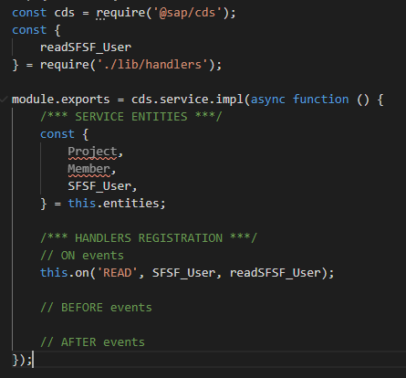

Quickly analyze what's been done.

In the `lib/handlers.js` file you connected `cds` to the SAP SuccessFactors external services, coded one helper function that removes undesired columns from the `order by` clause of a query's select statement and, finally, coded the handler function to read the users from SAP SuccessFactors using the `PLTUserManagement` service.

The code logic is well explained in the detailed comments.

Now, test that handler.

In the **Terminal** type `cd ..` and press **Enter** to go back to the **project root directory**.

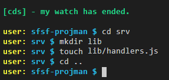

>**IMPORTANT**: newer versions of CDS have handed over to **SAP Cloud SDK** the creation of HTTP clients for making HTTP requests to external services, using the `@sap-cloud-sdk/http-client` node package. So, if you jump-started your CAP project, **before such CDS update**, that dependency might not have been included in your `package.json` file, and, thus, not installed when you ran `npm install`. Before testing the handler, please verify that you have `@sap-cloud-sdk/http-client` listed in the dependencies of your `package.json` and, if not, run: `npm install @sap-cloud-sdk/http-client`.

Once again type `cds watch` and press **Enter**. Then `CTRL+Click` on the `http://localhost:4004` link to launch the **application home page**.

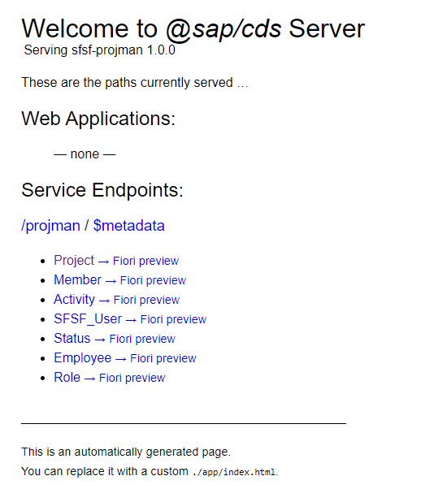

Click on the `SFSF_User` link

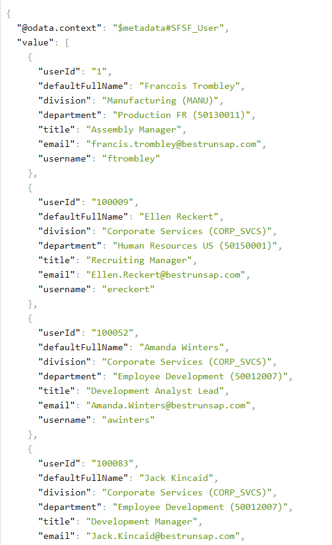

Now, you should be able to view the users that are being read from **SAP SuccessFactors** via the **User entity** from the `PLTUserManagement` service.

### Other handlers

That was the most important handler you should first implement as it's the one responsible for bringing the SAP SuccessFactors' employees into your application.

Now, you can "fast forward" and implement all the other handlers of your application at once.

Open the `lib/hanlers.js` file, then copy and paste the **following code** over (overwrite) the current content:

```JavasScript
const cds = require('@sap/cds');
const namespace = 'sfsf.projman.model.db.';

let userService = null;
let assService = null;

(async function () {
    // Connect to external SFSF OData services
    userService = await cds.connect.to('PLTUserManagement');
    assService = await cds.connect.to('ECEmployeeProfile');
})();

/*** HELPERS ***/

// Remove the specified columns from the ORDER BY clause of a SELECT statement
function removeColumnsFromOrderBy(query, columnNames) {
    if (query.SELECT && query.SELECT.orderBy) {
        columnNames.forEach(columnName => {
            // Look for column in query and its respective index
            const element = query.SELECT.orderBy.find(column => column.ref[0] === columnName);
            const idx = query.SELECT.orderBy.indexOf(element);

            if (idx > -1) {
                // Remove column from oder by list
                query.SELECT.orderBy.splice(idx, 1);
                if (!query.SELECT.orderBy.length) {
                    // If list ends up empty, remove it from query
                    delete query.SELECT.orderBy;
                }
            }
        });
    }

    return query;
}

// Helper for employee create execution
async function executeCreateEmployee(req, userId) {
    const employee = await cds.tx(req).run(SELECT.one.from(namespace + 'Employee').columns(['userId']).where({ userId: { '=': userId } }));
    if (!employee) {
        const sfsfUser = await userService.tx(req).run(SELECT.one.from('User').columns(['userId', 'username', 'defaultFullName', 'email', 'division', 'department', 'title']).where({ userId: { '=': userId } }));
        if (sfsfUser) {
            await cds.tx(req).run(INSERT.into(namespace + 'Employee').entries(sfsfUser));
        }
    }
}

// Helper for employee update execution
async function executeUpdateEmployee(req, entity, entityID, userId) {
    // Need to check whether column has changed
    const column = 'member_userId';
    const query = SELECT.one.from(namespace + entity).columns([column]).where({ ID: { '=': entityID } });
    const item = await cds.tx(req).run(query);
    if (item && item[column] != userId) {
        // Member has changed, then:
        // Make sure there's an Employee entity for the new assignment
        await executeCreateEmployee(req, userId);

        // Create new assignment
        await createAssignment(req, entity, entityID, userId);
    }
    return req;
}

// Helper for assignment creation
async function createAssignment(req, entity, entityID, userId) {
    const columns =  m => { m.member_userId`as userId`, m.parent(p => { p.name`as name`, p.description`as description`, p.startDate`as startDate`, p.endDate`as endDate` }), m.role(r => { r.name`as role` }) };
    const item = await cds.tx(req).run(SELECT.one.from(namespace + entity).columns(columns).where({ ID: { '=': entityID } }));
    if (item) {
        const assignment = {
            userId: userId,
            project: item.parent.name,
            description: item.role.role + " of " + item.parent.description,
            startDate: item.parent.startDate,
            endDate: item.parent.endDate
        };
        console.log(assignment);
        const element = await assService.tx(req).run(INSERT.into('Background_SpecialAssign').entries(assignment));
        if (element) {
            await cds.tx(req).run(UPDATE.entity(namespace + entity).with({ hasAssignment: true }).where({ ID: entityID }));
        }
    }
    return req;
}

// Helper for cascade deletion
async function deepDelete(tx, ID, childEntity) {
    return await tx.run(DELETE.from(namespace + childEntity).where({ parent_ID: { '=': ID } }));
}

/*** HANDLERS ***/

// Read SFSF users
async function readSFSF_User(req) {
    try {
        // Columns that are not sortable must be removed from "order by"
        req.query = removeColumnsFromOrderBy(req.query, ['defaultFullName']);

        // Handover to the SF OData Service to fecth the requested data
        const tx = userService.tx(req);
        return await tx.run(req.query);
    } catch (err) {
        req.error(err.code, err.message);
    }
}

// Before create/update: member
async function createEmployee(req) {
    try {
        // Add SFSF User to Employees entity if it does not exist yet
        const item = req.data;
        const userId = (item.member_userId) ? item.member_userId : null;
        if (userId) {
            await executeCreateEmployee(req, userId);
        }
        return req;
    } catch (err) {
        req.error(err.code, err.message);
    }
}

// After create: member
async function createItem(data, req) {
    try {
        // Create assignment in SFSF
        console.log('After create.');
        await createAssignment(req, req.entity, data.ID, data.member_userId);
        return data;
    } catch (err) {
        req.error(err.code, err.message);
    }
}

// Before update: member
async function updateEmployee(req) {
    try {
        // Need to check if team member was updated
        if (req.data.member_userId) {
            const ID = (req.params[0]) ? ((req.params[0].ID) ? req.params[0].ID : req.params[0]) : req.data.ID;
            const userId = req.data.member_userId;
            await executeUpdateEmployee(req, req.entity, ID, userId);
        }
        return req;
    } catch (err) {
        req.error(err.code, err.message);
    }
}

// Before delete: project or member
async function deleteChildren(req) {
    try {
        // Cascade deletion
        if (req.entity.indexOf('Project') > -1) {
            await deepDelete(cds.tx(req), req.data.ID, 'Activity');
            await deepDelete(cds.tx(req), req.data.ID, 'Member');
        } else {
            const item = await cds.tx(req).run(SELECT.one.from(namespace + req.entity).columns(['parent_ID']).where({ ID: { '=': req.data.ID } }));
            if (item) {
                await deepDelete(cds.tx(req), item.parent_ID, 'Activity');
            }
        }
        return req;
    } catch (err) {
        req.error(err.code, err.message);
    }
}

// After delete/update: member
async function deleteUnassignedEmployees(data, req) {
    try {
        // Build clean-up filter
        const members = SELECT.distinct.from(namespace + 'Member').columns(['member_userId as userId']);
        const unassigned = SELECT.distinct.from(namespace + 'Employee').columns(['userId']).where({ userId: { 'NOT IN': members } });

        // Get the unassigned employees for deletion
        let deleted = await cds.tx(req).run(unassigned);

        // Make sure result is an array
        deleted = (deleted.length === undefined) ? [deleted] : deleted;

        // Clean-up Employees
        for (var i = 0; i < deleted.length; i++) {
            const clean_up = DELETE.from(namespace + 'Employee').where({ userId: { '=': deleted[i].userId } });
            await cds.tx(req).run(clean_up);
        }
        return data;
    } catch (err) {
        req.error(err.code, err.message);
    }
}

// Before "save" project (exclusive for Fiori Draft support)
async function beforeSaveProject(req) {
    try {
        if (req.data.team) {
            // Capture IDs and users from saved members
            let users = []
            req.data.team.forEach(member => { users.push({ ID: member.ID, member_userId: member.member_userId }); });

            // Get current members
            let members = await cds.tx(req).run(SELECT.from(namespace + 'Member').columns(['ID', 'member_userId']).where({ parent_ID: { '=': req.data.ID } }));
            if (members) {
                // Make sure result is an array
                members = (members.length === undefined) ? [members] : members;

                // Process deleted members
                const deleted = [];
                members.forEach(member => {
                    const element = users.find(user => user.ID === member.ID);
                    if (!element) deleted.push(member);
                });
                for (var i = 0; i < deleted.length; i++) {
                    // Delete members' activities
                    await cds.tx(req).run(DELETE.from(namespace + 'Activity').where({ assignedTo_ID: { '=': deleted[i].ID } }));
                    if (req.data.activities) {
                        let idx = 0;
                        do {
                            idx = req.data.activities.findIndex(activity => activity.assignedTo_ID === deleted[i].ID);
                            if (idx > -1) {
                                req.data.activities.splice(idx, 1);
                            }
                        } while (idx > -1)
                    }
                }

                // Process added members
                const added = [];
                users.forEach(user => {
                    const element = members.find(member => user.ID === member.ID);
                    if (!element) added.push(user);
                });
                for (var i = 0; i < added.length; i++) {
                    await executeCreateEmployee(req, added[i].member_userId);
                }

                // Process updated members
                const updated = [];
                users.forEach(user => {
                    const element = members.find(member => user.ID === member.ID);
                    if (element) updated.push(user);
                });
                for (var i = 0; i < updated.length; i++) {
                    await executeUpdateEmployee(req, 'Member', updated[i].ID, updated[i].member_userId);
                }
            }
        }
        return req;
    } catch (err) {
        req.error(err.code, err.message);
    }
}

// After "save" project (exclusive for Fiori Draft support)
async function afterSaveProject(data, req) {
    try {
        if (data.team) {
            // Look for members with unassigned elementId
            let unassigned = await cds.tx(req).run(SELECT.from(namespace + 'Member').columns(['ID', 'member_userId']).where({ parent_ID: { '=': data.ID }, and: { hasAssignment: { '=': false } } }));
            if (unassigned) {
                // Make sure result is an array
                unassigned = (unassigned.length === undefined) ? [unassigned] : unassigned;

                // Create SFSF assignment
                for (var i = 0; i < unassigned.length; i++) {
                    await createAssignment(req, 'Member', unassigned[i].ID, unassigned[i].member_userId);
                }
            }
        }
        await deleteUnassignedEmployees(data, req);

        return data;
    } catch (err) {
        req.error(err.code, err.message);
    }
}

module.exports = {
    readSFSF_User,
    createEmployee,
    createItem,
    updateEmployee,
    deleteChildren,
    deleteUnassignedEmployees,
    beforeSaveProject,
    afterSaveProject
}
```

You just added three additional helpers: two for employee creation/update and one for the special assignment creation in SAP SuccessFactors.

Then, you added the required handlers for the before and after events (OData operations).

The code logic is well explained in the comments details.


### Attach the service handlers to the service module events


Open the `srv/projman-service.js` file, then copy and paste the **following code** over (overwrite) the current content:

```JavasScript
const cds = require('@sap/cds');
const {
    readSFSF_User,
    createEmployee,
    updateEmployee,
    createItem,
    deleteChildren,
    deleteUnassignedEmployees,
    beforeSaveProject,
    afterSaveProject
} = require('./lib/handlers');

module.exports = cds.service.impl(async function () {
    /*** SERVICE ENTITIES ***/
    const {
        Project,
        Member,
        SFSF_User,
    } = this.entities;

    /*** HANDLERS REGISTRATION ***/
    // ON events
    this.on('READ', SFSF_User, readSFSF_User);

    // BEFORE events
    this.before('CREATE', Member, createEmployee);
    this.before('UPDATE', Member, updateEmployee);
    this.before('DELETE', Project, deleteChildren);
    this.before('DELETE', Member, deleteChildren);
    this.before('SAVE', Project, beforeSaveProject); // Fiori Draft support

    // AFTER events
    this.after('CREATE', Member, createItem);
    this.after('UPDATE', Member, deleteUnassignedEmployees);
    this.after('DELETE', Project, deleteUnassignedEmployees);
    this.after('DELETE', Member, deleteUnassignedEmployees);
    this.after('SAVE', Project, afterSaveProject); // Fiori Draft support
});
```

Here you just imported the handler functions from the `lib/handlers.js` file and attached them to their corresponding events (OData operations).

And, with that, you completed the coding of the business logic for your application.


### Check your knowledge


