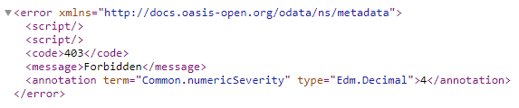

# Add Security to the SAP SuccessFactors Extension
<!-- description --> In this phase of the development you will add authentication and authorization to the extension.

## Prerequisites
 - Complete the tutorial: [**Prepare to Develop the SAP SuccessFactors Extension**](cap-extend-sfsf-intro)
 - Complete the tutorial: [**Jump start the SAP SuccessFactors Extension CAP Project**](cap-extend-sfsf-jumpstart)
 - Complete the tutorial: [**Import SAP SuccessFactors OData Services definitions**](cap-extend-sfsf-import-services)
 - Complete the tutorial: [**Create the CDS Data Model for the SAP SuccessFactors Extension**](cap-extend-sfsf-data-model)
 - Complete the tutorial: [**Create the CAP Service for the SAP SuccessFactors Extension**](cap-extend-sfsf-create-service)
 - Complete the tutorial: [**Add Business Logic to the SAP SuccessFactors Extension**](cap-extend-sfsf-add-logic)
 - Complete the tutorial: [**Prepare the SAP SuccessFactors Extension UI with CDS Annotations**](cap-extend-sfsf-ui-annotations)

## You will learn
  - How to **require user authentication** in your CAP service
  - How to **define authorization** to access the service entities
  - How to **setup the XSUAA service instance** for future deployment
  - How to **add required dependencies** to the CAP project to handle application security

---

### Set service to require authentication

So far, you have been working on a local project which only developers would have access to. Therefore, it's OK to leave your service "unprotected" as it's not yet publicly available. But, as soon as you deploy it to the cloud, it will be available to anyone who knows the service endpoint (which is not quite difficult).

In such scenario, anyone can access the service anonymously and freely make OData calls to it, which will probably cause a big mess in your application and related data. So, it's **imperative to "protect" your service** against such risky situation by **granting access only to authenticated users**.

Then, to make the service available only to authenticated users, you just need to add the `requires` annotation to the **service definition** (in the `projman-service.cds` file), like demonstrated below:

Now, in the service home page, when you **click on any entity link** (i.e. `SFSF_User`) a pop-up in the browser will ask for the **username** and **password**.

As you are still in development you can provide whatever information you like and click **sign in**, because in this environment CAP is using what we call **mocked authentication** which does not utilize real users. So, after clicking sign in, you may see the data from the selected entity:

### Set authorization for service entities access

But, in an **administrative scenario** like this one, just **being an authenticated user is not enough**. It's appropriate that, additionally, the authenticated user must be granted some **administrative role** (i.e. an **Admin** role).

Therefore, you need to specify that the entities from our service are only **viewable** and **maintainable** by users with the **Admin role**. To do so, you also **annotate your entities** with the **requires** annotation, but now you specify the **Admin** role, instead of `authenticated-user`, like demonstrated below:

Now, if you click again on the same entity link (i.e. `SFS_User`) you should receive an **HTTP 403 (Forbidden)** error:

It happened because the **mocked user** (any dummy data you provided) was **not granted the Admin role**, thus cannot access any entity annotated as such.

So, you should fix it now. To do so, you just need to add an `auth` block into the `cds.requires` section of the `package.json` file, like demonstrated below:

This block instructs CAP to use the **mock strategy** (which is default) during development and it creates **two mock users**: **John** who's granted the **Admin** role and **Mary** who's granted the **Viewer** role (which has no authorization in the context of your application).

Now, you need to **login as john** (with any password that you like), but CAP has already opened a session to the first mock user you utilized (who has no Admin role granted) and won't pop-up for a new login (so, you stick with the forbidden error).

To work this around, you will need to completely **close your browser** (not only the Business Application Studio tab), open it again and go back to your SAP BTP cockpit to access **Business Application Studio** from the **Instances and Subscriptions** page. Click on your Dev Space and when the IDE loads again make sure that `cds watch` is properly running, if not, run it again. Launch the **service home page** and click any entity link (i.e. `SFSF_User`).

> **NOTE**: you can also try to open the `http://localhost:4040` in an **incognito window** to achieve that goal

This time the **sign in pop-up** should appear and you **must login with john** to overcome the forbidden error:

To learn more about **authentication** and **authorization** in CAP, you can refer to this two links from the official documentation:

- [Authentication](https://cap.cloud.sap/docs/node.js/authentication)
- [Authorization and Access Control](https://cap.cloud.sap/docs/guides/authorization)

### Setup XSUAA

OK, so far you have defined a simple authorization schema to secure all service entities and verified that it's working as expected. But, in production, security will be handled by the **User Account and Authentication** (UAA) mechanism of Cloud Foundry which, in **SAP BTP**, is implemented by the **XSUAA service**.

Therefore, you need to **configure the XSUAA service instance** to recognize and apply the schema you have defined when the application is deployed on SAP BTP.

For that, you need to create a file named `xs-security.json` in the **project root folder**, and the good news is that CAP can do it for you automatically based on the security schema from the service definition.

In the **Terminal** press `CTRL+C` to terminate the `cds watch` command, then type the command:

- `cds compile srv/ --to xsuaa >xs-security.json`

Then, press **Enter**.

On the **left-hand pane** click on the `xs-security.json` file to open it. Examine the contents and add the **two lines** indicated in the **screenshot below** right before "**scopes**" (if not already generated by the compiler, as older versions of it used to add them automatically). In the **role-templates collection**, change the description of the **Admin** role from "**generated**" to "**Project Administrator**":

This file is used during the **creation** or **update** of the **XSUAA service instance** and controls the roles, scopes, attributes and role templates that will be part of the security for your application.

Now, quickly understand what's done in this descriptor.

Basically, you define a **scope** named **Admin** for the application and assign it to the **Admin role template**. This way, when the application is **deployed to SAP BTP** the **Admin role** will be **automatically created** in the platform and **associated** to the `sfsf-projman` application.

But roles are not directly assigned to the application's users. The assignment is done through **role collections**. So, just add one to the file like demonstrated in the screenshot below:

After deployment, you just need to assign it to the user who should be granted such authorization.

### Add required dependencies

Now, you just need to add four dependencies to the CAP service for it to properly handle security and other related stuff – such as the user JSON Web Token (JWT) – during runtime. Those are:

- `@sap/cds-dk`
- `@sap/xsenv`
- `@sap/xssec`
- `passport`

Therefore, in the **Terminal**, just type the following commands pressing **Enter** after each one:

- `npm install @sap/xsenv`
- `npm install @sap/cds-dk`
- `npm install @sap/xssec`
- `npm install passport`

When the commands complete, your `package.json` file should like the screenshot below:

### Check your knowledge

