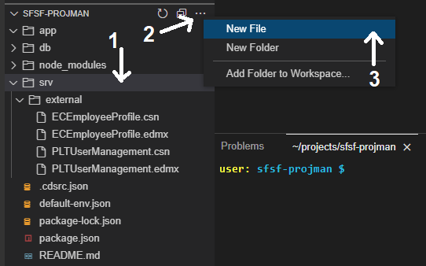
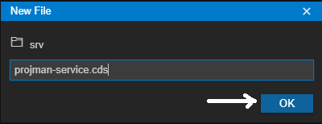
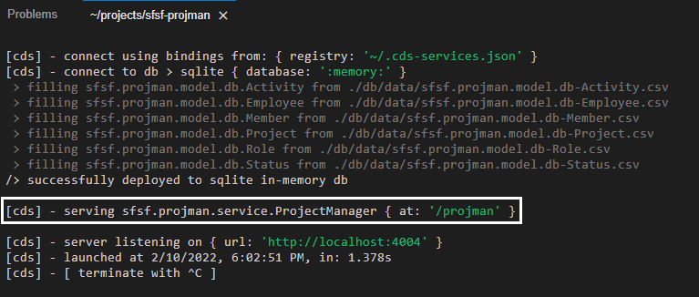
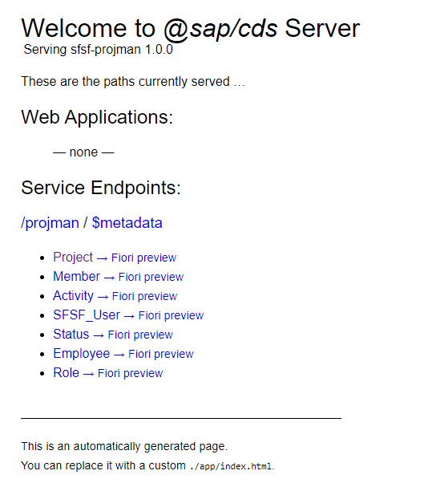
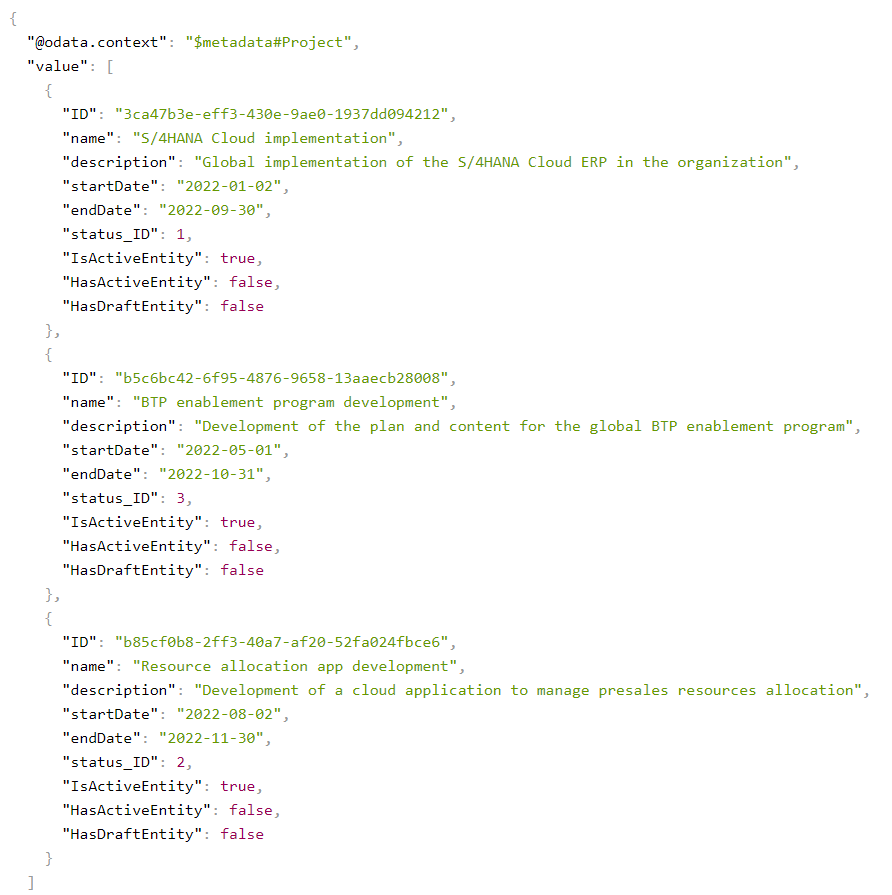

## Prerequisites
 - Complete the tutorial: [**Prepare to Develop the SAP SuccessFactors Extension**](cap-extend-sfsf-intro)
 - Complete the tutorial: [**Jump start the SAP SuccessFactors Extension CAP Project**](cap-extend-sfsf-jumpstart)
 - Complete the tutorial: [**Import SAP SuccessFactors OData Services definitions**](cap-extend-sfsf-import-services)
 - Complete the tutorial: [**Create the CDS Data Model for the SAP SuccessFactors Extension**](cap-extend-sfsf-data-model)

## Details
### You will learn
  - How to **create and code the service definition** in your CAP project
  - Understand the  **service definition code**
  - How to **test the service**

---

[ACCORDION-BEGIN [Step 1: ](Create the service definition file)]

In the previous tutorial from this group, you have defined the data model for your solution and populated it with some initial test data. But, when you first run the application you noticed no services have been defined, thus the entities where not exposed.

In this step you will create the service definition file for further coding.

On the **left-hand pane** of **SAP Business Application Studio**, (1) select the `srv` folder, then (2) click on the **three dots** to the right of the project name and (3) select **New File**.



On the **dialog** name the file `projman-service.cds` and click **OK**.



[DONE]
[ACCORDION-END]

[ACCORDION-BEGIN [Step 2: ](Code the service definition)]

Copy and paste the **code snippet below** into the recently created file:

```CDS Service Definition Language
using sfsf.projman.model.db as model from '../db/projman-model';
using PLTUserManagement as UM_API from '../srv/external/PLTUserManagement.csn';

namespace sfsf.projman.service;

service ProjectManager @(path : '/projman') {
    @odata.draft.enabled
    entity Project as projection on model.Project;

    entity Member as
        select from model.Member {
            * ,
            member.defaultFullName as member_name
        };

    entity Activity as projection on model.Activity;

    @readonly
    entity SFSF_User       as
        select from UM_API.User {
            key userId,
                username,
                defaultFullName,
                email,
                division,
                department,
                title
        };

    annotate SFSF_User with @(cds.odata.valuelist);
}
```

[DONE]
[ACCORDION-END]

[ACCORDION-BEGIN [Step 3: ](Understand the definition code)]

Quickly analyze the service definition code:

First you import the solution model from the file you created in the previous tutorial as well as the `PLTUserManagement` OData service you imported in the [**third tutorial**](cap-extend-sfsf-import-services), referencing them through the aliases: `model` and `UM_API`, respectively.

Then, you define a **namespace to contain the service definition** (`sfsf.projman.service`) and through which you will refer to it in the future.

Next, you declare (define) a service named `ProjectManager` to be hosted at the path `/projman`, so it will be invoked through the syntax `<application host>/projman/<entity name>` (or `$metadata` to fetch the service metadata).

Finally, into the service, you **project the entities** from your model (only those which are **not annotated** with `@cds.autoexpose`) and the `SFSF_User` selecting some **specific fields** from the **SAP SuccessFactors User** entity.

In the **Member** entity, besides all regular fields, you add an **additional projection** of an attribute coming from the association to the **Employee** entity (`defaultFullName`) as `member_name`, which will be further used in some **UI annotations**.

You also annotate the **Project** entity (the **root entity** of your model) with `@odata.draft.enabled`, because CAP exposes services via the **OData v4 protocol** and, for that version, **Fiori Elements** only displays the **CRUD actions** in the UI if the entity is **draft-enabled**. The `SFSF_User` entity is annotated as `@readonly` and with `@cds.odata.valuelist` as it will be used to populate the value help with SAP SuccessFactors Users to be picked as employees assigned to projects.

[DONE]
[ACCORDION-END]

[ACCORDION-BEGIN [Step 4: ](Test the service)]

Now that you have properly defined a service and exposed the desired entities, you should notice that, in the **Terminal**, `cds watch` has updated:



It's now serving the `ProjecManager` service at path `/projman` reading from the service definition file you just created. So, if you go back to the **application preview tab** (the one that has opened when you CTRL-clicked `http://localhost:4004`) and do a **refresh**, you should now see links to **all exposed entities** as well as to the **service metadata**:



You can click on any **entity link** (except the `SFSF_User`) to view the data that has been loaded from the CSV files. Click, for example, on the **Project** entity:



Notice that CAP has automatically added the **draft control attributes** due to the `@odata.draft.enabled` annotation.

If you click the `SFSF_User` link you'll get an error, because that's not an entity defined in the application data model but rather a projection of an entity which should be populated via an OData service consumption. Therefore, CAP cannot use its generic service handlers for such entity as the OData call is delegated to the logic defined by the developer. Thus, for that kind of entities, a custom handler (with specific business logic) must be implemented and you'll do it in the next tutorial from this group.

[DONE]
[ACCORDION-END]

[ACCORDION-BEGIN [Step 5: ](Check your knowledge)]

[VALIDATE_1]
[ACCORDION-END]
