# Create the CDS Data Model for the SAP SuccessFactors Extension
<!-- description --> In this phase of the extension development you will create the extension data model, load initial test data and perform the first CAP service test.

## Prerequisites
 - Complete the tutorial: [**Prepare to Develop the SAP SuccessFactors Extension**](cap-extend-sfsf-intro)
 - Complete the tutorial: [**Jump start the SAP SuccessFactors Extension CAP Project**](cap-extend-sfsf-jumpstart)
 - Complete the tutorial: [**Import SAP SuccessFactors OData Services definitions**](cap-extend-sfsf-import-services)

## You will learn
  - **Review** the extension data model
  - How to **create the CDS data model** in the CAP project
  - How to **populate the model** with **initial test data**
  - How to perform the **first CAP service test**

---

### Review the data model


Before you move on with the coding, just quickly review the conceptual data model of your solution:

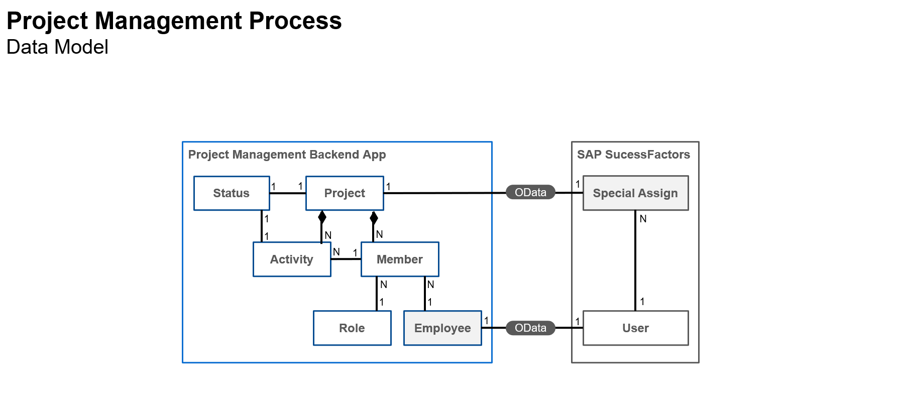

The logical model depicted in the diagram above has been conceived to comply with the following business rules:

1. Each project is composed by members (team) and activities;
2. The project team (members) is made of SAP SuccessFactors employees;
3. Each project member has an specific role in the project;
4. Each project activity is assigned to a specific project member;
5. Projects and activities have one status each (i.e. not started, in progress, overdue, completed etc.);
6. And last, but not least, whenever a team member is assigned to a project, a special assignment is registered to the employee's background to signal that such employee has participated in the project, acting in a specific role, as part of the employee's professional experience.

Now, having that model in mind, you can make its definition into the CAP project.


### Create CDS data model file


On the **left-hand pane** of **SAP Business Application Studio**, (1) select the `db` folder, then (2) click on the **three dots** to the right of the project name and (3) select **New File**.

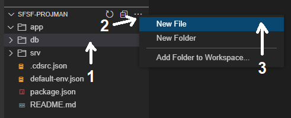

On the **dialog**, name the file `projman-model.cds` and click **OK**.

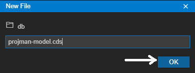


### Perform the model coding


Copy and paste the **code snippet below** into the recently created file:

```CDS Data Modeling Language
using {
    cuid,
    sap
} from '@sap/cds/common';

namespace sfsf.projman.model.db;

entity Project : cuid {
    name        : String(128);
    description : String(1024);
    startDate   : Date;
    endDate     : Date;
    status      : Association to one Status;
    team        : Composition of many Member
                      on team.parent = $self;
    activities  : Composition of many Activity
                      on activities.parent = $self;
}

entity Member : cuid {
    parent        : Association to one Project;
    member        : Association to one Employee;
    role          : Association to one Role;
    hasAssignment : Boolean default false;
}

entity Activity : cuid {
    parent      : Association to one Project;
    assignedTo  : Association to one Member;
    name        : String(128);
    description : String(1024);
    dueDate     : Date;
    status      : Association to one Status;
}

@readonly
@cds.autoexpose
entity Employee {
    key userId          : String(100);
        username        : String(100);
        defaultFullName : String;
        email           : String;
        division        : String(128);
        department      : String(128);
        title           : String(255);
}

@readonly
@cds.autoexpose
entity Role : sap.common.CodeList {
    key ID : Integer;
}

@readonly
@cds.autoexpose
entity Status : sap.common.CodeList {
    key ID          : Integer;
        criticality : Integer;
}
```

Quickly analyze the model code:

First you import some **ready-to-use common aspects** from the CAP framework: `cuid` (common universal unique id) and `sap` (from where we get the `Codelist` aspect). To learn more about the common types and aspects you can read [**this section**](https://cap.cloud.sap/docs/cds/common) from the **CAP official documentation**. The `cuid` aspect automatically **defines a UID primary key** for entities Project, Member and Activity.

Then you define a **namespace to contain the data model** (`sfsf.projman.model.db`) and through which you will refer to it in the future.

Finally, you define each entity with its corresponding attributes and associations according to the model diagram. You'll notice that the **Project** entity is "composed" by a **team** made of **members** who are **employees** and **activities** assigned to the team members, exactly as depicted in the diagram.

You specify that the entities **Employee** (the "bridge" between SAP SuccessFactors users and your local model), **Role** and **Status** are "read-only" via the `@readonly` annotation. You also want those entities to be **automatically exposed in your CAP service** without having to explicitly do it in the service definition (the next step of the development), so you annotate them with the `@cds.autoexpose` annotation as well.


### Load initial test data


Now, populate your data model with some initial test data. This can be done by creating some **files in CSV format** into a **subfolder** of the `db` folder named "**data**" with the specific naming convention of `<namespace>-<entity name>.csv`.

In the **root folder** of your project on the **Terminal**, type `cd db` and press **Enter**.

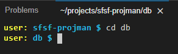

Type `mkdir data` and press **Enter**.

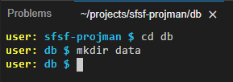

Type `cd data` and press **Enter**.

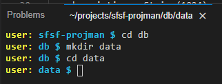

Type the **sequence of commands below** pressing **Enter** after each one:

- `touch sfsf.projman.model.db-Role.csv`
- `touch sfsf.projman.model.db-Status.csv`
- `touch sfsf.projman.model.db-Employee.csv`
- `touch sfsf.projman.model.db-Project.csv`
- `touch sfsf.projman.model.db-Member.csv`
- `touch sfsf.projman.model.db-Activity.csv`

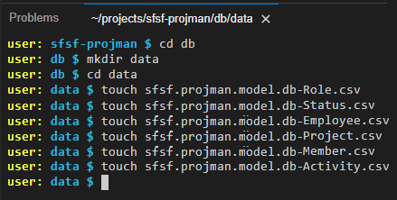

On the **left-hand pane**, expand the `data` folder to view the recently created files, then click on the `sfsf.projman.model.db-Role.csv` file to open it.

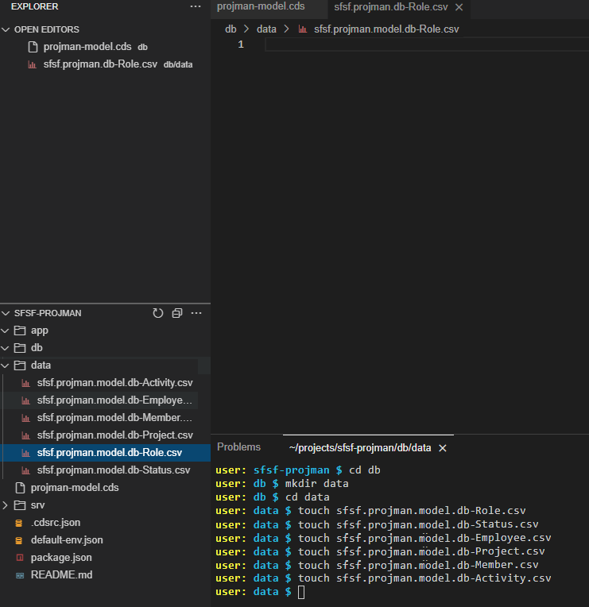

Copy & paste the content below into the `sfsf.projman.model.db-Role.csv` file:

```CSV File Content
ID;name;descr
1;Project Manager;Project Manager Role
2;Project Lead;Project Lead Role
3;Business Owner;Business Owner Role
4;Product Owner;Product Owner Role
5;SCRUM Master;SCRUM Master Role
6;Solution Architect;Solution Architect Role
7;Software Engineer;Software Engineer Role
8;UX Designer;UX Designer Role
9;Program Designer;Program Designer Role
10;Content Designer;Content Designer Role
11;Content Expert;Content Expert Role
```

On the **left-hand pane**, click on the `sfsf.projman.model.db-Status.csv` file to open it, then copy & paste the content below:

```CSV File Content
ID;name;descr;criticality
1;Not Started;Activity has not been started yet;2
2;In Progress;Activity is in progress;5
3;Overdue;Activity is overdue;1
4;Blocked;Activity is blocked;2
5;Paused;Activity is paused;2
6;Canceled;Activity is canceled;1
7;Completed;Activity is completed;3
```

On the **left-hand pane**, click on the `sfsf.projman.model.db-Employee.csv` file to open it, then copy & paste the content below:

```CSV File Content
userId;username;defaultFullName;email;division;department;title
100093;rsmolla;Rick Smolla;Rick.Smolla@bestrunsap.com;Corporate Services (CORP_SVCS);Employee Development (50012007);Development Analyst
100095;kholliston;Kay Holliston;Kay.Holliston@bestrunsap.com;Corporate Services (CORP_SVCS);Human Resources US (50150001);Program Manager
100096;smoultone;Sarah Lynn Moultone;Sarah.Moultone@bestrunsap.com;Manufacturing (MANU);Quality Assurance US (50150013);Inspector
100097;swang;Scott C Wang;Scott.Wang@bestrunsap.com;Manufacturing (MANU);Operations CN (50100010);Quality Assurance Manager
100112;jwilliams;John Williams;John.Williams@bestrunsap.com;Manufacturing (MANU);Operations US (50007753);SVP Operations & Maintenance
100115;mcooper;Mya Cooper;Mya.Cooper@bestrunsap.com;Manufacturing (MANU);Operations US (50007753);VP Operations
```

> **IMPORTANT NOTE**: the above employees have been **taken from an SAP SuccessFactors demo tenant** as they must **match the data that's coming from it**. Those users usually exist at SAP SuccessFactors demo tenants, so if you are using a demo tenant for your project that content should be fine, otherwise you must **search for users in your SAP SuccessFactors tenant** and **adjust the content of this CSV accordingly**.

On the **left-hand pane**, click on the `sfsf.projman.model.db-Project.csv` file to open it, then copy & paste the content below:

```CSV File Content
ID;name;description;startDate;endDate;status_ID
3ca47b3e-eff3-430e-9ae0-1937dd094212;S/4HANA Cloud implementation;Global implementation of the S/4HANA Cloud ERP in the organization;2022-01-02;2022-09-30;1
b85cf0b8-2ff3-40a7-af20-52fa024fbce6;Resource allocation app development;Development of a cloud application to manage presales resources allocation;2022-08-02;2022-11-30;2
b5c6bc42-6f95-4876-9658-13aaecb28008;BTP enablement program development;Development of the plan and content for the global BTP enablement program;2022-05-01;2022-10-31;3
```

On the **left-hand pane**, click on the `sfsf.projman.model.db-Member.csv` file to open it, then copy & paste the content below:

```CSV File Content
ID;parent_ID;member_userId;role_ID;hasAssignment
df87d8d4-16df-48da-a8bf-5b2218f62602;3ca47b3e-eff3-430e-9ae0-1937dd094212;100093;1;true
3470cf57-b0b9-49ce-b568-52f44df3b09c;3ca47b3e-eff3-430e-9ae0-1937dd094212;100095;2;true
81e89fd2-b2d8-4af3-a4b2-2cadfc69e6de;b85cf0b8-2ff3-40a7-af20-52fa024fbce6;100096;1;true
79da3255-627f-4782-af10-beb8d1c796b6;b85cf0b8-2ff3-40a7-af20-52fa024fbce6;100097;2;true
33c8e150-561a-4228-899f-faabe41094aa;b5c6bc42-6f95-4876-9658-13aaecb28008;100112;1;true
d2696b36-3413-4522-a73b-f00560dc3fe5;b5c6bc42-6f95-4876-9658-13aaecb28008;100115;2;true
```

> **IMPORTANT NOTE**: the `member_useId` values **must match** the values in the `userId` column from the `sfsf.projman.model.db-Employee.csv` file.

On the **left-hand pane**, click on the `sfsf.projman.model.db-Activity.csv` file to open it, then copy & paste the content below:

```CSV File Content
ID;parent_ID;assignedTo_ID;name;description;dueDate;status_ID
4dae162a-56ea-4e99-8061-70ec3f30a2fd;3ca47b3e-eff3-430e-9ae0-1937dd094212;df87d8d4-16df-48da-a8bf-5b2218f62602;Do project planning;Plan the whole project;2022-01-05;7
fcba3d35-013a-4ab6-9ab9-9fb938eff8a4;3ca47b3e-eff3-430e-9ae0-1937dd094212;3470cf57-b0b9-49ce-b568-52f44df3b09c;Assign team to project;Look for the appropriate experts to work on project;2022-01-05;3
3fd253a8-4951-47d0-9946-58d97ac21b95;b85cf0b8-2ff3-40a7-af20-52fa024fbce6;81e89fd2-b2d8-4af3-a4b2-2cadfc69e6de;Do project planning;Plan the whole project;2022-05-04;7
91d18efa-3173-4f7e-86f0-74332c69c8cd;b85cf0b8-2ff3-40a7-af20-52fa024fbce6;79da3255-627f-4782-af10-beb8d1c796b6;Assign team to project;Look for the appropriate experts to work on project;2022-05-04;3
341a6fa0-6ecf-4eb4-8638-426eed4584f7;b5c6bc42-6f95-4876-9658-13aaecb28008;33c8e150-561a-4228-899f-faabe41094aa;Do project planning;Plan the whole project;2022-08-05;7
0194b2b8-b9f7-4c6f-8677-18ae7fd627b7;b5c6bc42-6f95-4876-9658-13aaecb28008;d2696b36-3413-4522-a73b-f00560dc3fe5;Assign team to project;Look for the appropriate experts to work on project;2022-08-05;3
```


### Execute the first test


Now it has come the time to test the project as it is so far. You will start by installing the required project dependencies.

In the **Terminal**, change back to the project root folder: type `cd ../..` and press **Enter**.

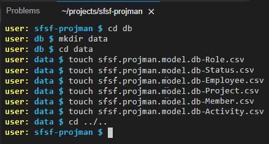

Type `npm install` and press **Enter**.

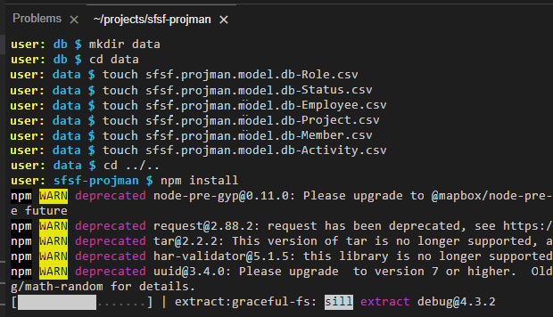

When the **installation is completed** you should see the **following message** in the **Terminal**:

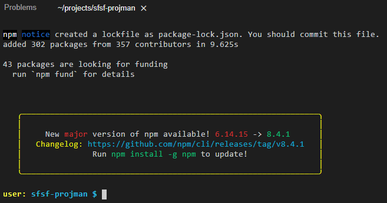

Type `cds watch` and press **Enter** to **run the project** and **watch for changes** in real time. You should see the **following result** in the **Terminal**:

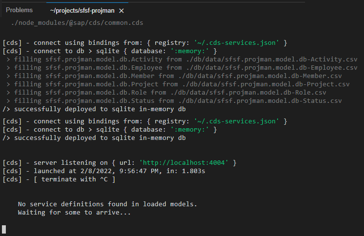

Notice that CDS has **automatically set the database** to an **in-memory `SQLite` database** and filled it with the **CSV files**. It also says that it could not find any service definitions from the loaded models: that's because you really haven't defined any yet (you will do it in the next tutorial from this group).

`CTRL+Click` on the `http://localhost:4004` link that is displayed in the terminal to open the project home page in a new browser tab.

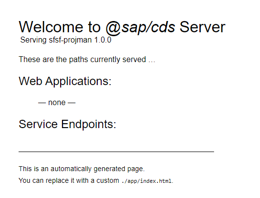

You can see that there are no web applications, and most importantly, no service endpoints yet.

You might be wondering: "what about the Employee, Role and Status entities that I annotated with `@cds.autoexpose`? why are they not showing up here?". Well, as you have not defined any service endpoints to expose the entities, CDS cannot expose them even though you explicitly asked to do it automatically.

But don't worry! They will show up in this page as soon as you complete the next tutorial in this group.


### Check your knowledge


