## Prerequisites
 - Complete the tutorial: [**Prepare to Develop the SAP SuccessFactors Extension**](cap-extend-sfsf-intro)
 - Complete the tutorial: [**Jump start the SAP SuccessFactors Extension CAP Project**](cap-extend-sfsf-jumpstart)
 - Complete the tutorial: [**Import SAP SuccessFactors OData Services definitions**](cap-extend-sfsf-import-services)
 - Complete the tutorial: [**Create the CDS Data Model for the SAP SuccessFactors Extension**](cap-extend-sfsf-data-model)
 - Complete the tutorial: [**Create the CAP Service for the SAP SuccessFactors Extension**](cap-extend-sfsf-create-service)
 - Complete the tutorial: [**Add Business Logic to the SAP SuccessFactors Extension**](cap-extend-sfsf-add-logic)
 - Complete the tutorial: [**Prepare the SAP SuccessFactors Extension UI with CDS Annotations**](cap-extend-sfsf-ui-annotations)
 - Complete the tutorial: [**Add Security to the SAP SuccessFactors Extension**](cap-extend-sfsf-add-security)
 - Complete the tutorial: [**Deploy the SAP SuccessFactors Extension Database to SAP HANA Cloud**](cap-extend-sfsf-deploy-hc)
 - Complete the tutorial: [**Develop the SAP Fiori Elements Application for the SAP SuccessFactors Extension**](cap-extend-sfsf-fiori-elements)

## Details
### You will learn
  - How to **build the MTA archive**
  - How to **deploy the MTA archive** to Cloud Foundry
  - How to **assign a role collection** to a BTP business user
  - How to **launch and test** the deployed application

---

[ACCORDION-BEGIN [Step 1: ](Build the MTA archive)]

Before you build the MTA Archive for deployment, do not forget to switch back the database from **in-memory `SQLite`** to **SAP HANA** (if not already). For that, just open the `package.json` file from the CAP service and set the `cds.requires.db.kind` parameter to `hana` like demonstrated below:

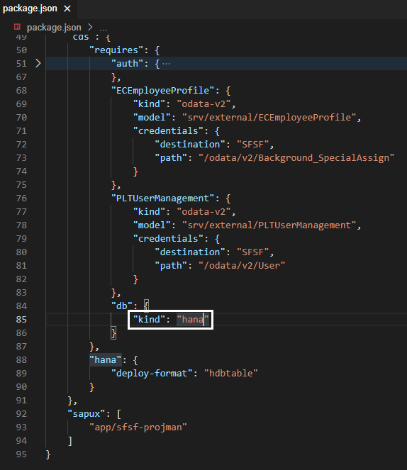

Now you can start the procedure to build the archive. You begin by building the CAP service.

In the **Terminal** type `cds build –-production` and press **Enter** (don't forget to press `CTRL+C` to terminate `cds watch` if it was previously running).

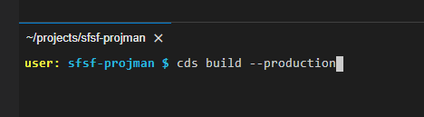

On the **left-hand pane** right-click the `mta.yaml` file and select **Build MTA Project**.

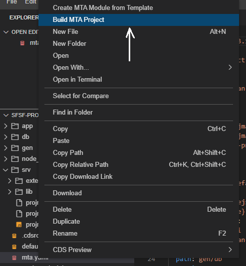

It's going to take some seconds until the build process completes. When it does, it will display a message "**Terminal will be reused by tasks**" in a dedicated terminal named "**Task Build MTA Project**". Look for the message "**Build succeeded**" among the lines in that console to make sure the build process was successful.

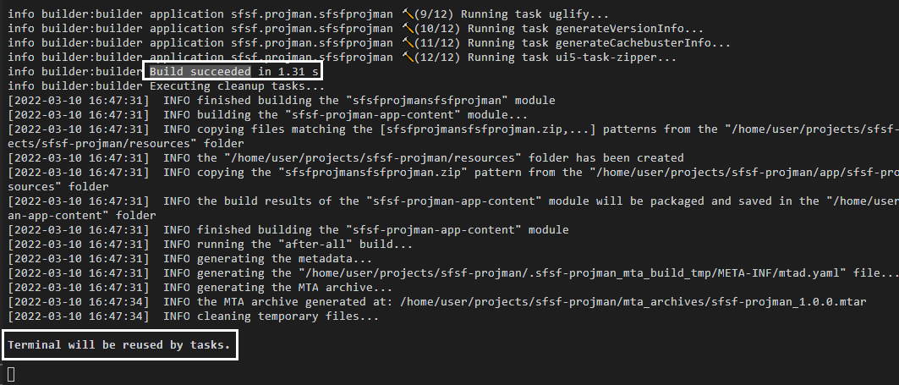

If the process is successful you'll notice that a file named `sfsf-projman_1.0.0.mtar` will be generated into a new folder named `mta_archives` like demonstrated below:

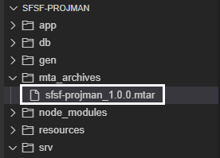

[DONE]
[ACCORDION-END]

[ACCORDION-BEGIN [Step 2: ](Deploy the MTA Archive)]

> **IMPORTANT NOTE**: before  you trigger the process to deploy the MTA archive to Cloud Foundry you **MUST** make sure you **comply with two requirements**:
>
> 1. You are properly **logged to Cloud Foundry** as instructed in **step 2** of the tutorial: [**Jump start the SAP SuccessFactors Extension CAP Project**](cap-extend-sfsf-jumpstart)
> 2. Your **SAP HANA Cloud database is up and running** (remember that everything shuts down overnight on **trial accounts**!)

On the **left-hand pane** right-click the `sfsf-projman_1.0.0.mtar` file and select **Deploy MTA Archive**.

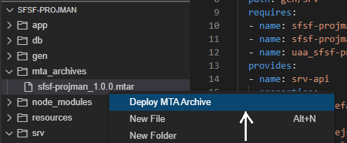

It's going to take a while until the deployment process finishes. When it does, it will display a message "**Terminal will be reused by tasks**" in a dedicated terminal named "**Task Deploy MTA Archive**". Look for the message "**Process finished**" in the last lines and see that **there's no errors/failures listed** among the other lines in that console to make sure the deployment process was truly successful.

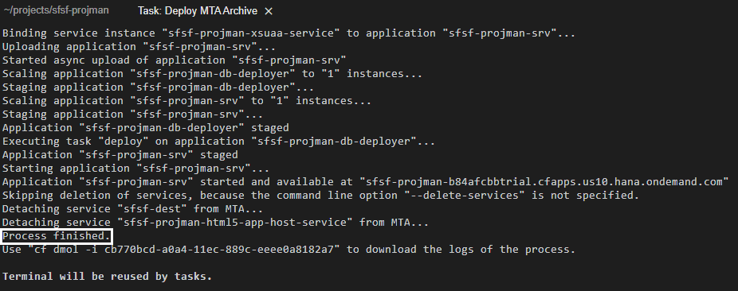

[DONE]
[ACCORDION-END]

[ACCORDION-BEGIN [Step 3: ](Assign Admin role to your business user)]

Before you jump into testing the application, you must remember that it's meant for **project administrators**, meaning, users with the Admin role assigned. So, assign the role to your user in SAP BTP.

In the **SAP BTP cockpit**, on the **left-hand pane** expand the **Security** menu and click on **Role Collections**. On the right side, using the **search box**, search for the `sfsf_projman_Administrator` role and click on it.

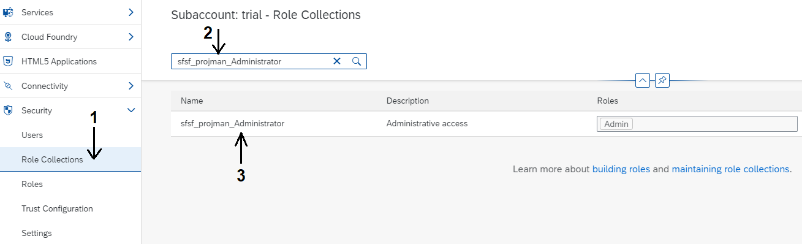

Click on the **Edit** button at the top-right corner, then, in the **Users** list, select the **Default identity provider** from the dropdown list and provide your **SAP BTP user ID** and your **e-mail** (usually in trial accounts they are both your e-mail). Click on the "**+**"" button on top of the list and then click on the **Save** button at the top-right corner.

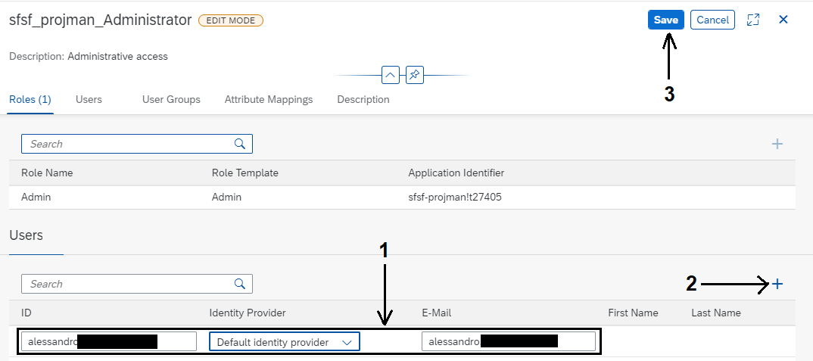

Now you are OK to test the application.

[DONE]
[ACCORDION-END]

[ACCORDION-BEGIN [Step 4: ](Test the deployed application)]

On the **left-hand pane**, (1) click on **HTML5 Applications** and locate your **Business Solution** (`sfsf-projman-<your subdomain>`). Then, (2) click on the link of the **Application Name**.

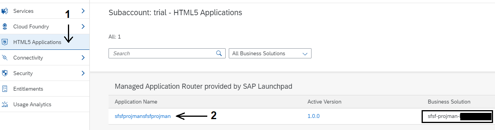

An **SAP Fiori Launchpad** will open-up in a new browser tab with the **application tile** in it:

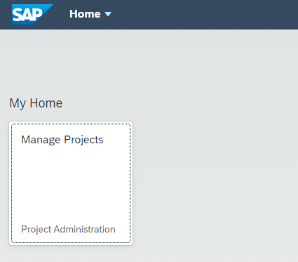

Click on the tile and the **List Report page** for the **Project** entity will be loaded:

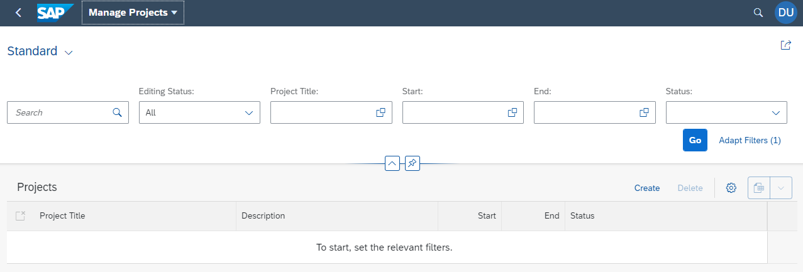

Now, click on the **Go** button and the **initial test data** (loaded to the HANA database from the CSV files) will be displayed:

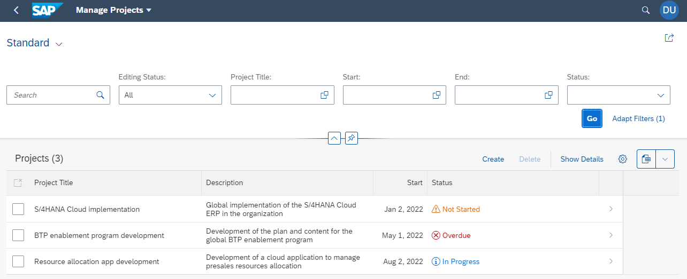

And that's it! You have successfully deployed a **fully working SAP Fiori Elements application** to **SAP BTP Cloud Foundry**!

You can, now, test it at your will, in the same way you did using the **Fiori Preview** in **step 6** of the tutorial: [**Prepare the SAP SuccessFactors Extension UI with CDS Annotations**](cap-extend-sfsf-ui-annotations).

Finally, the last step in the journey of this tutorial group is to add your application to a **user-driven launchpad** using **SAP BTP's Launchpad Service**.

[DONE]
[ACCORDION-END]

[ACCORDION-BEGIN [Step 5: ](Check your knowledge)]

[VALIDATE_1]
[ACCORDION-END]
