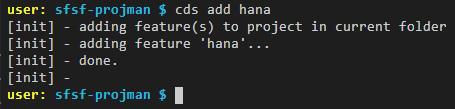
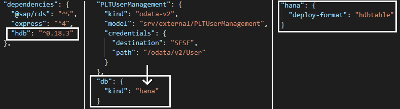
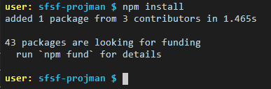
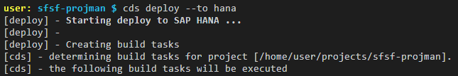
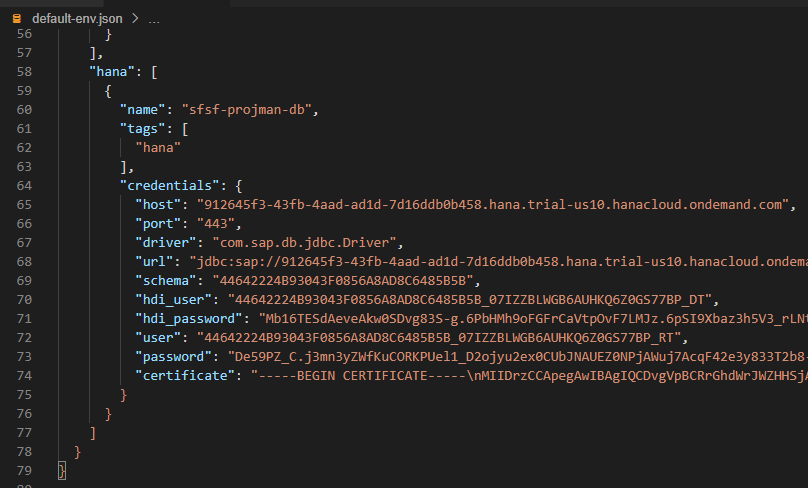
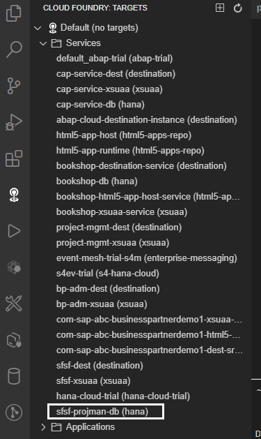
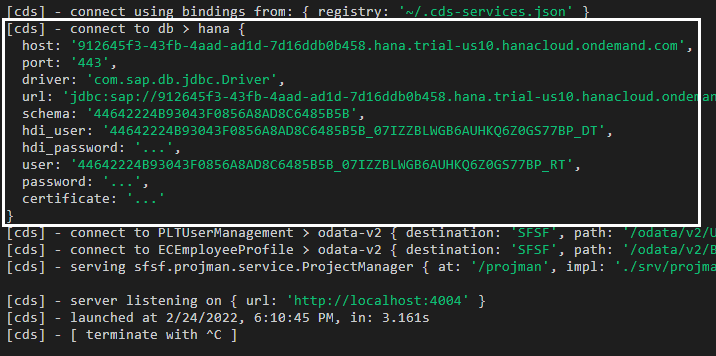
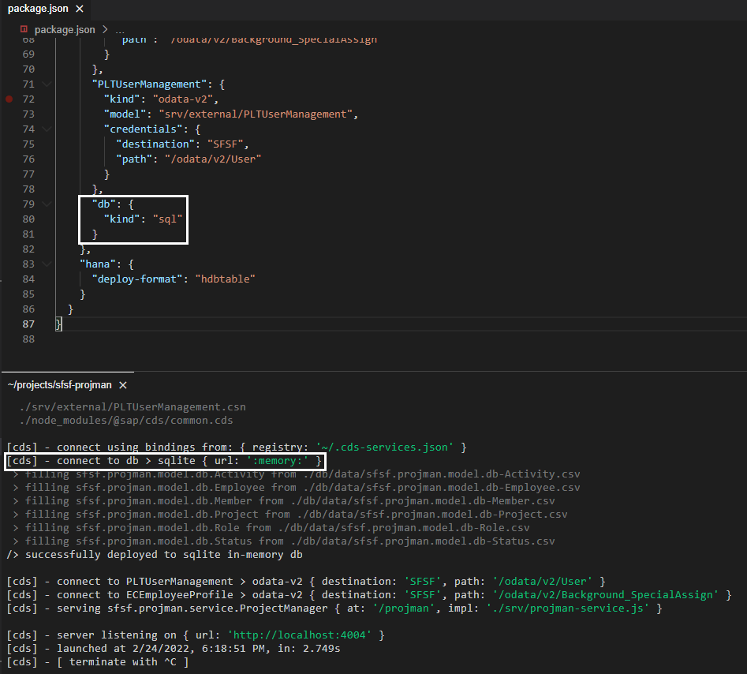

# Deploy the SAP SuccessFactors Extension Database to SAP HANA Cloud
<!-- description --> In this phase of the development you will deploy the extension database to SAP HANA Cloud.

## Prerequisites
 - Complete the tutorial: [**Prepare to Develop the SAP SuccessFactors Extension**](cap-extend-sfsf-intro)
 - Complete the tutorial: [**Jump start the SAP SuccessFactors Extension CAP Project**](cap-extend-sfsf-jumpstart)
 - Complete the tutorial: [**Import SAP SuccessFactors OData Services definitions**](cap-extend-sfsf-import-services)
 - Complete the tutorial: [**Create the CDS Data Model for the SAP SuccessFactors Extension**](cap-extend-sfsf-data-model)
 - Complete the tutorial: [**Create the CAP Service for the SAP SuccessFactors Extension**](cap-extend-sfsf-create-service)
 - Complete the tutorial: [**Add Business Logic to the SAP SuccessFactors Extension**](cap-extend-sfsf-add-logic)
 - Complete the tutorial: [**Prepare the SAP SuccessFactors Extension UI with CDS Annotations**](cap-extend-sfsf-ui-annotations)
 - Complete the tutorial: [**Add Security to the SAP SuccessFactors Extension**](cap-extend-sfsf-add-security)

## You will learn
  - How to **setup your project for SAP HANA**
  - How to **deploy the database to SAP HANA Cloud**
  - How to work with a "**hybrid approach**" (database in the cloud and application running locally)

---

### Setup project for SAP HANA

So far, all data persistence of your application has been utilizing a **default `SQLite` in-memory database**, which means that, each time you restart the application, all data that has been added/updated is completely lost.

It might be OK for local development, but when it goes to a cloud landscape (either development, QA or production) the **data must be persisted** in a **standard relational database** such as **SAP HANA Cloud** (which is going to be the selected database for your application).

Therefore, it's now time to prepare your project to deploy the data model to **SAP HANA Cloud** when it goes to BTP. For that, you must **add the appropriate dependencies** to your project using the `cds add` command.

In the **Terminal** type `cds add hana` and press **Enter**.

On the **left-hand pane** click on the `package.json` file to open it. Examine the contents and notice the modifications in the `dependencies` and `cds.requires` sections and the new `cds.hana` section. Change the `db.kind` from the `cds.requires` section to `hana`.

In the **Terminal** type `npm install` and press **Enter** to install the newly added dependency locally.

### Deploy the database to SAP HANA Cloud

> **IMPORTANT**: before executing the next steps first make sure:
>
> 1. You are properly **logged to Cloud Foundry** as instructed in **step 2** of the tutorial: [**Jump start the SAP SuccessFactors Extension CAP Project**](cap-extend-sfsf-jumpstart)
> 2. Your SAP HANA Cloud database instance (created following [**this tutorial**](hana-cloud-deploying)) is up and running – remember: on **trial accounts** everything (including **SAP HANA database**) **shuts down overnight**!

In the **Terminal** type `cds deploy –-to hana` and press **Enter**.

It's going to take a while before the command completes as it's performing these operations:

1. **Build** the database artifacts from the CAP project in the **gen folder** that's created under the **project root folder**, for further deployment to SAP HANA Cloud.
2. Create a **service instance** named `sfsf-projman-db` of type **SAP HANA Schemas & HDI Containers** with the `hdi-shared` plan, that handles the **HDI container**
3. Create the **SAP HANA database artifacts from the application** inside the HDI container
4. **Bind the service instance** to the local project by modifying the `default-env.json` file, adding the **database credentials** (actually the **service key** from the **service binding**).

After the command completes, you will have achieved what is called a "**hybrid approach**" where your project runs locally, but the **database** (and the corresponding persistence) **runs in the cloud**.

Take a quick look at the `default-env.json` to verify what happened after command completion: on the **left-hand pane** click on the `default-env.json` file to open it:

Notice that a `hana` section has been added to the `VCAP_SERVICES` environment variable, with the **service instance name** of the **HDI container** and the **credentials** (service key) to connect to the SAP HANA Cloud database.

> **IMPORTANT UPDATE**: From **CDS version 5 and above**, this procedure will not modify the `default-env.json` file. Instead, it will create the `.cdsrc-private.json` file containing the service bindings. For such CDS versions you'll need to "re-bind" the **Destination** and **XSUAA** service instances to the local project with: `cds bind --to sfsf-dest,sfsf-xsuaa`. Then, to run the project locally you must use: `cds watch --profile hybrid`. If, in the future, you switch back to the **SQLite in-memory database**, then you can stick with the simple `cds watch`.

If you click on the **Cloud Foundry icon** (small light bulb) on the left-hand pane and **expand the services node**, you'll also see the newly created service instance:

### Run project locally with the database in the cloud

Now, checkout what happens when you execute the application.

In the **Terminal** type `cds watch` and press **Enter**.

> **IMPORTANT**: you must use `cds watch --profile hybrid` when working with **CDS version 5 and above** as per the **update described in the previous step**.

Notice that, now, CDS is **connecting to SAP HANA Cloud** as the persistence mechanism of the application.

Again, in this scenario the **project** is running **locally**, but the **database** is running in the **cloud** (hybrid approach).

If you want to **switch to the `SQLite` in-memory database** again for development, just go back to `package.json` and change the `db.kind` parameter in the `cds.requires` section back to `sql`, and notice that `cds watch` immediately recognizes the change and **switches the connection** to `sqlite` with the `:memory:` credentials:

### Check your knowledge

