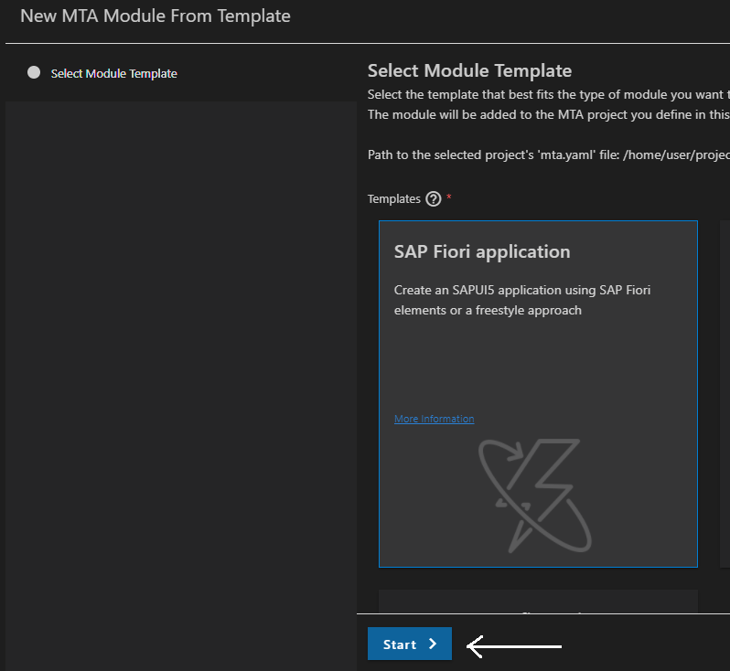

# Develop the SAP Fiori Elements Application for the SAP SuccessFactors Extension
<!-- description --> In this phase of the development you will create the extension UI through a Fiori Elements application.

## Prerequisites
 - Complete the tutorial: [**Prepare to Develop the SAP SuccessFactors Extension**](cap-extend-sfsf-intro)
 - Complete the tutorial: [**Jump start the SAP SuccessFactors Extension CAP Project**](cap-extend-sfsf-jumpstart)
 - Complete the tutorial: [**Import SAP SuccessFactors OData Services definitions**](cap-extend-sfsf-import-services)
 - Complete the tutorial: [**Create the CDS Data Model for the SAP SuccessFactors Extension**](cap-extend-sfsf-data-model)
 - Complete the tutorial: [**Create the CAP Service for the SAP SuccessFactors Extension**](cap-extend-sfsf-create-service)
 - Complete the tutorial: [**Add Business Logic to the SAP SuccessFactors Extension**](cap-extend-sfsf-add-logic)
 - Complete the tutorial: [**Prepare the SAP SuccessFactors Extension UI with CDS Annotations**](cap-extend-sfsf-ui-annotations)
 - Complete the tutorial: [**Add Security to the SAP SuccessFactors Extension**](cap-extend-sfsf-add-security)
 - Complete the tutorial: [**Deploy the SAP SuccessFactors Extension Database to SAP HANA Cloud**](cap-extend-sfsf-deploy-hc)

## You will learn
  - How to **add MTA configuration** to the project structure
  - How to **add `AppRouter` configuration** to the MTA file
  - How to **create the Fiori Elements app** and set it up into the MTA file
  - How to **launch the Fiori Elements app**
  - How to **add additional configuration** to the MTA file, which is **relevant for Cloud Foundry deployment**

---

### Add MTA configuration to the project


To deploy your application to Cloud Foundry on SAP BTP, you are going to use the **MTA** (Multi-Target Application) approach, which facilitates the deployment as it **pushes everything at once** to the platform: UI application, backend service, database, service instances creation and binding, etc.

As you have already done almost everything that is required to setup your project for deployment following the previous tutorials, you can now **add the MTA configuration** to it, which will be described using **YAML** standard in a file named `mta.yaml`.

Fortunately, once again, **CAP can add that file automatically** for you, populating it with all that has been configured in the project so far. But, before you do it, just open the `package.json` file and change the **application description** as demonstrated below, so it can be reflected in the `mta.yaml` file:


In the **Terminal** type `cds add mta` and press **Enter** (don't forget to press `CTRL+C` to terminate `cds watch` if it was previously running).


On the **left-hand pane**, click on the `mta.yaml` file to open it.


If you explore the file, you'll notice that it contains the descriptors for the **server module**, which is the **actual CAP service**, with a dependency pointing to the **service instance of the HDI container** (described in the **resources section**) and a **sidecar module** (suffixed `-db-deployer`), which is an **auxiliary app that runs only during deployment** and takes care of the creation/update of the **HANA database artifacts** into the HDI container (notice that it also depends on the HDI service instance).

All of that has been extracted from the **CAP configuration** (`cds.requires` section) in the `package.json` file.

The next step is to create an `approuter` module with a **unique route name** (in the context of the subaccount region) to take care of the **authentication flow** when the application is accessed from the UI in SAP BTP as well as other stuff, such as **mapping** the **backend service** route to the same domain as the HTML5 application as a destination to avoid problems like CORS (Cross-Origin Resource Sharing) issues.


### Add AppRouter configuration to the MTA file


Before you move forward with the creation of the `approuter` module, you need to make a **copy** of your `xs-security.json` file as the **module generator will overwrite it** with some specific `approuter` configuration.

To do that, simply **select the file** in the left-hand pane then press `CTRL+C` and `CTRL+V` in sequence; With that, you should obtain the following result:


Now, you can move on to the `approunter` configuration.

On the **left-hand pane**, right-click on the `mta.yaml` file and select **Create MTA Module from Template**.


In the **Wizard**, select **`Approuter` Configuration** and click on **Start**.


In the next **Dialog**, select **Managed `Approuter`** as your HTML5 application runtime. As the unique name for the solution, type `sfsf-projman`, appending a "**-**" followed by the **subdomain** of your SAP BTP subaccount (like demonstrated in the screenshot below – this will make sure the name is really unique in the context of the subaccount region) and select **Yes** as the answer for the last question. Then, click on **Next**.


The essential difference between the **managed** and **standalone** `approuter` is that the **managed** is centrally **governed by the launchpad service** through an **HTLM5 application repository** that ties your solution to a URL from the launchpad service, whilst the **standalone** just creates another application in the **Cloud Foundry space** in parallel to the CAP service application. So, basically, in the first case  you access your solution **from a list of applications in the HTML5 repository** – and you're also able to **add it to a user-driven launchpad** – and in the second you do it **directly from the list of applications** in the Cloud Foundry space.

You can get the **subdomain** of your SAP BTP subaccount in the **Overview** page from the cockpit like demonstrated below:


In the **last step**, select **overwrite** (first option) and click on **Finish**.


Now, **merge** the generated `xs-security.json` into the copy you previously created.

On the **left-hand pane**, click on `xs-security.json` and then on `xs-security_copy.json` to open both files. You must **transfer (copy & paste) the blocks indicated** in the screenshot below from `xs-security.json` to the corresponding sections in `xs-security_copy.json`.


Then, after the transfer, the `xs-security_copy.json` file should look like this:


The `uaa.user` scope associated to the `Token_Exchange` role template is required to perform the **OAuth 2.0 authentication flow** executed by the `approuter`. Basically, before loading the **HTML5 application** (which you are going to build in a minute) the router **authenticates the user** logged in to SAP BTP via OAuth 2.0 and gets a **JWT** (JSON Web Token) which is, then, **forwarded** to the HTML5 application and, from there, to the **CAP service**, making sure that only **authenticated** and **authorized** (Admin) users have access to the application.

You can now delete the generated `xs-security.json` and rename the `xs-security_copy.json` to its original name.

On the **left-hand pane**, right-click on `xs-security.json` and select **Delete**. In the **Dialog**, click **OK**.


On the **left-hand pane**, click on `xs-security_copy.json` and press **F2** to rename it. In the **Dialog**, remove the `_copy` and click **OK**.


Now, open the `mta.yaml` file and notice how much configuration has been automatically added to it! Among the new content there's the definition of the **destination** and **UAA** services that are required by the router.

You shall remember that the **CAP service** also **depends** on those service instances, thus **they must be bound** to it as well. For that, you just append their definition to the "**requires**" section of the `sfsf-projman-srv` definition following the order: first destination and then XSUAA, like demonstrated below:


And that's it! This completes the `approuter` configuration.


### Create the Fiori elements app as an MTA Module


Now it's finally come the time to create your **SAP Fiori Elements app** (the front-end of your project management solution) and, to facilitate and speed-up the project configuration, you will **add it** to your project directly as an **MTA module**.

On the **left-hand pane**, right-click on the `mta.yaml` file and select **Create MTA Module from Template**.


In the **Wizard**, select **SAP Fiori Application** and click on **Start**.



In the next **Dialog**, make sure that the application type is **SAP Fiori Elements** and select **List Report Object Page**, then click on **Next**.


In the **Data Source and Service Selection** dialog, select **Use a Local CAP Project** as the **Data Source**, then click on the **browse button** in the **CAP project path** field (small folder) to select the `sfsf-projman` folder under `projects` and, finally, select `sfsf.projman.service.ProjectManager (Node.js)` as the **OData service**. Then, click on **Next**.


In the **Entity Selection** dialog, select **Project** as the **Main entity**, **None** as the **Navigation entity** and leave **Yes** as the answer to the last question, then click on **Next**.


Fill-in the information in the **Project Attributes** dialog like **demonstrated below**, then click on **Next**.


In the **Deployment Configuration** dialog, select **Cloud Foundry** as the **target** and **None** as the **Destination name**, then click on **Next**.


Fill-in the information in the **SAP Fiori Launchpad Configuration** dialog like **demonstrated below**, then click on **Finish**.


Now, if you open again the `mta.yaml` file you'll notice that an **additional configuration** (two modules) related to the SAP Fiori app has been added to it like demonstrated below:


Also, the **actual SAP Fiori application** has been created under the `app` folder in a folder named `sfsf-projman` like you can see in the following screenshot:


### Launch the Fiori elements app


You can, now, test the newly created SAP Fiori app. In the **Terminal**, run `cds watch` and `CTRL+Click` the `http://localhost:4004` link to open the CAP application home page. Notice that under **Web Applications** the link to the **SAP Fiori app home page** is listed:


Click on that link and a **SAP Fiori Launchpad** will open-up with the **application tile** in it:


> **NOTE**: newer versions of the **Fiori Generator** might skip this tile and jump direct into the **List Report** from the **next screenshot**.

Click on the tile – if the sign-in dialog pops-up just enter **john** in the username with **any password** as it's the **mock user** with the **Admin role** you defined in the CAP service for authentication during development – and the **List Report page** for the **Project** entity will be loaded:


Now, click on the **Go** button and the **initial test data** (loaded from the CSV files) will be displayed:


And that's it! There you have it: a **fully working SAP Fiori Elements application** easily created with the help of **SAP Business Application Studio** standard **MTA modules generator**, almost ready to deploy!

You can, now, test it at your will, in the same way you did using the **Fiori Preview** in **step 6** of the tutorial: [**Prepare the SAP SuccessFactors Extension UI with CDS Annotations**](cap-extend-sfsf-ui-annotations).


### Add additional MTA configuration


A few more configurations are required to get the solution fully ready for deployment.

Basically, you will define an `appname` with a `very unique name` (the **same** you used in the `approuter` configuration) and a **destination** to the **CAP service** (which is the backend of your application) to be **mapped** by the `approuter` in a single entry point – remember, the `approuter` is responsible for creating a unique entry point for the solution (UI and backend) putting **everything under the same domain** and taking care of the **authentication flow**.

After doing that, you will adjust the `xs-app.json` file (which holds the configuration of the routes to be mapped by the `approuter`) to **point to the destination of the backend service**.

On the **left-hand pane**, click on the `mta.yaml` file to open it and, under "**parameters**" add the **following line**:

> **NOTE**: use the **exact same name** you provided in the **Add `AppRouter` Configuration to the MTA file** step (`sfsf-projman-<your subdomain>`)


Now, under "**modules**" expand the `sfsf-projman-srv` module and add the following line to the "**parameters**" section:


Create a "**requires**" section to `resources > sfsf-projman-destination-service` using the following code snippet (right under the `type: org.cloudfoundry.managed-service`):

```YAML
  requires:
    - name: srv-api
```

Append the following code snippet to `resources > sfsf-projman-destination-service > parameters > config > inti_data > instance > destinations` (right under the `URL: https://ui5.sap.com`):

```YAML
          - Name: sfsf-projman-app-api
            Description: Project Manager CAP service
            Authentication: NoAuthentication
            ProxyType: Internet
            Type: HTTP
            URL: ~{srv-api/srv-url}
            HTML5.DynamicDestination: true
            HTML5.ForwardAuthToken: true
```

Your `mta.yaml` should now look like this:


Basically, what's been done here is that you instructed the **destination service** to create a **dynamic destination** to the **CAP service** which will be used by the **HTML5 runtime** to invoke it **forwarding the JWT** grabbed by the `approuter` during the **authentication flow**, so it can check whether the user has been properly **authenticated** and has the **authorization** (Admin role) to access the service. Notice that the service is referencing the CAP service via the name `srv-api` that has been given to it in its definition at the beginning of the `mta.yaml` file.

On the **left-hand pane**, click on the `xs-app.json` file under `app/sfsf-projman` folder to open it and add the **following code snippet** as the **very first route** in the "**routes**" collection:

```JSON
        {
            "source": "^/projman/",
            "destination": "sfsf-projman-app-api",
            "csrfProtection": false,
            "authenticationType": "none"
        },
```

Your `xs-app.json` should now look like this:


As you can see, you have mapped the `/projman` service route to the `single entry point` managed by the router using the **destination** defined in the `mta.yaml` file.

And that concludes the **full project configuration** required to **deploy** the application to **Cloud Foundry** via the **MTA approach**.


### Check your knowledge


