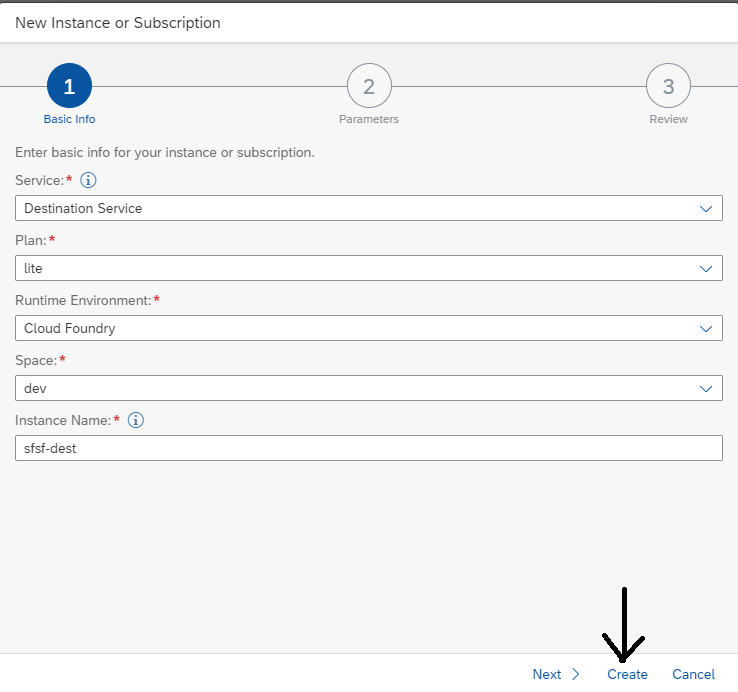
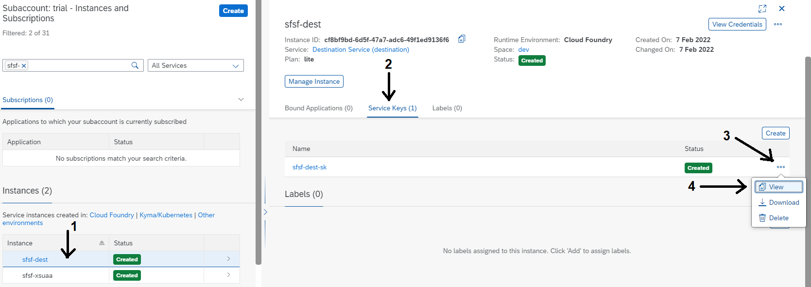
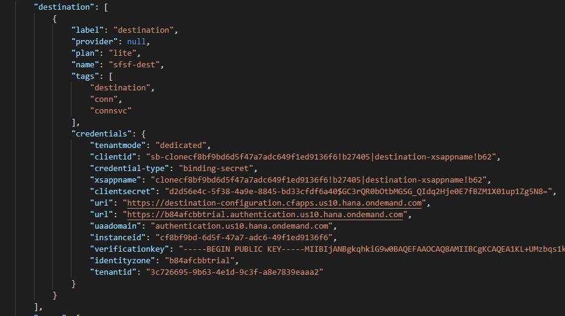

## Prerequisites
 - Complete the tutorial: [**Prepare to Develop the SAP SuccessFactors Extension**](cap-extend-sfsf-intro)
 - Complete the tutorial: [**Jump start the SAP SuccessFactors Extension CAP Project**](cap-extend-sfsf-jumpstart)

## Details
### You will learn
  - How to import OData services definitions to a CAP project via **Entity Data Model XML (EDMX)** files
  - Understand how the EDMX is translated into the **Core Schema Notation (CSN)** (basically a JSON file) from the **CAP framework**
  - Understand the changes made to `package.json` by the import process
  - How to create **destination** and **XSUAA** service instances on BTP Cloud Foundry
  - How to **bind service instances** to your local CAP project

---

[ACCORDION-BEGIN [Step 1: ](Get services metadata)]

The first thing you need to do is to get the XML files (EDM XML – Entity Data Model XML – in short **EDMX**) which define the entities that compose the OData services to be consumed in the application. You can get such files from **SAP API Business Hub**.

1- Access `https://api.sap.com`:


2- In the search bar type `ECEmployeeProfile` and press **Enter**.


3- Click on the item from the search result and in the **API Specification** at the **bottom of the page** click on the **down arrow** next to the **EDMX** option.


4- Save the `ECEmployeeProfile.edmx` file (keep that file name) to a folder in your local computer.

5- Click on the **SAP logo** at the top left corner of the page to **return** to the **home page** and repeat the exact same procedure from **steps 2 to 4**, but now searching for the `PLTUserManagement` OData service to save the `PLTUserManagement.edmx` file to your local computer.

[DONE]
[ACCORDION-END]

[ACCORDION-BEGIN [Step 2: ](Import files to the CAP project)]

Now that you've got both EDMX files in our local computer, it's time to import them to your **CAP project** in order for CDS to generate the corresponding definitions using the so-called **Core Schema Notation** (CSN) which is described in **JSON format**.

1- Simply **drag & drop** the two **EDMX files** to the `srv` folder of your CAP project in **SAP Business Application Studio**.


2- In the terminal window type `cds import srv/ECEmployeeProfile.edmx` and press **Enter**. This should be the **expected output**:


3- Repeat the **same procedure from step 2**, but this time type `cds import srv/PLTUserManagement.edmx` to import the second service definition. In the **left-hand pane** you'll notice that an **external** folder has been created under `srv`. Expand it to see the **generated** `csn` files:


4- Now you can **delete the EDMX files** from the `srv` folder. Just **right-click** each one and select **delete**.

[DONE]
[ACCORDION-END]

[ACCORDION-BEGIN [Step 3: ](Checkout the import results)]

Now, inspect what happened after executing those command lines. First, click on the `ECEmployeeProfile.csn` file in the `srv/external` folder:


You can see the content is nothing else than a **JSON representation** of the service metadata with the **description of the entities contained in it**. This JSON is used by the **CDS framework** to let you make **type-safe OData calls** to the service in the form of simple queries via the **easy-to-use** low-code **CDS Query Language** (CQL).

Press `CTRL+F` to open the find bar and search for `Background_SpecialAssign`:


You'll find the definition for the `Background_SpecialAssign` entity. You'll use that entity to insert the project participation info into the **Employee Profile** as part of the historical professional background. So, whenever an employee is assigned to a project with a certain role, that information is stored in his/her professional background.

Now, open the `PLTUserManagement.csn` file and search for `PLTUserManagement.User`:


That's the entity you are going to use to fetch the **relevant employee data** (you won't use all of its attributes) to assign to the **projects teams**.

Now, look at the `package.json` file to see how CAP is referencing those OData services. Open that file and scroll down to the bottom:


In the `cds.requires` section you'll notice how CAP is referencing both services. But how does it know where in the cloud those services exist? Well, remember that **destination** you created in the **preparation step** of the [**introductory tutorial**](cap-extend-sfsf-intro) of this group? Now it's come the time to **point** those service references to it **as credentials**. To do so, add the following lines to the `cds.requires` section:


With that, you are simply setting the **destination name** and the **path** where the service is hosted within the destination URL.

[DONE]
[ACCORDION-END]

[ACCORDION-BEGIN [Step 4: ](Create destination and XSUAA service instances)]

In order to use that destination for testing your application during development, you need to **bind your project** to **two service instances** in BTP: one for the **destination service** and another for the **XSUAA service**. So, start by creating those service instances and a service key (credentials) for each one in BTP.

In the **BTP cockpit** of your trial account, on the left-hand pane (1) click on **Instances and Subscriptions** then (2) on the **Create** button at the **top-right corner**.


Fill-in the **service instance information** like in the **screenshot below** and click **Create**.



(1) On **Instances and Subscriptions** (2) click on the **Create** button at the top-right corner again.


Fill-in the **service instance information** like in the **screenshot below** and click **Create**.


In the **search bar** type `sfsf-` and press **Enter** to easily find your recently created **service instances**.


In the line corresponding to the `sfsf-dest` service instance click on the **three dots** at the far right and select **Create Service Key**.


On the dialog, type `sfsf-dest-sk` in the **Service Key Name** and click on **Create**.


Click on the line corresponding to the `sfsf-xsuaa` service instance. Then, on the top right corner click on the **three dots** and select **Create Service Key**.


On the dialog, type `sfsf-xsuaa-sk` in the **Service Key Name** and click on **Create**.


Done! You have successfully created both service instances and their corresponding service keys. Now it's time to bind those service instances to your CAP project using their service keys.

[DONE]
[ACCORDION-END]

[ACCORDION-BEGIN [Step 5: ](Bind destination and XSUAA service instances to the local CAP project)]

To be able to use the service instances you created in the previous step during development, you need to bind them to the CAP Project. This is done by creating a file named `default-env.json`. In the file you define the so-called `VCAP_SERVICES` object, which is actually an **environment variable** that **holds all the binding information** of an application.

Whenever you **deploy** an application to **Cloud Foundry**, that variable is automatically created in the application space. In your case, you will create it manually into the `default-env.json` file.

1- In the **root folder** of your project on the **Terminal**, type `touch default-env.json` and press **Enter**.


2- On the left-hand pane, click on the `default-env.json` file to open it. Then, **copy & paste** the following **code snippet**:

```JSON File Content
{
	"VCAP_SERVICES": {
		"destination": [
			{
				"label": "destination",
				"provider": null,
				"plan": "lite",
				"name": "sfsf-dest",
				"tags": [
					"destination",
					"conn",
					"connsvc"
				],
				"credentials": {

				}
			}
		],
		"xsuaa": [
			{
				"label": "xsuaa",
				"provider": null,
				"plan": "application",
				"name": "sfsf-xsuaa",
				"tags": [
					"xsuaa"
				],
				"credentials": {

				}
			}
		]
	}
}
```

3- Back in the cockpit, (1) click on the line corresponding to the `sfsf-dest` service instance, then (2) on the **Service Keys** tab on the right, then (3) on the **three dots** next to the service key and finally (4) select **View**.



4- On the **dialog**, (1) click on **Copy JSON** and then (2) on **Close**.


5- Replace both **curly brackets** right after the **"credentials"** attribute of the **destination service** with the **copied JSON**. The resulting text should look similar to the **screenshot below**:



6- Finally, repeat **steps 3 to 5** for the `sfsf-uaa` service key (name it `sfsf-uaa-sk`) of the **XSUAA service instance**.

With that, you're done **binding** the project to the **destination** and **XSUAA** service instances.

[DONE]
[ACCORDION-END]

[ACCORDION-BEGIN [Step 6: ](Check your knowledge)]

[VALIDATE_1]
[ACCORDION-END]
