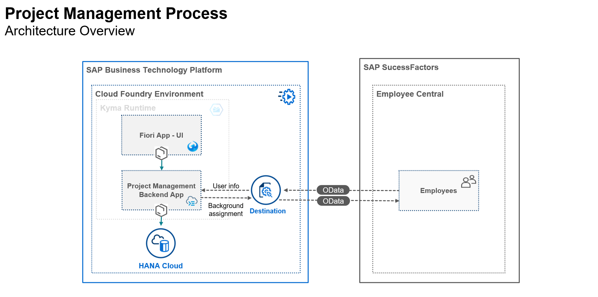
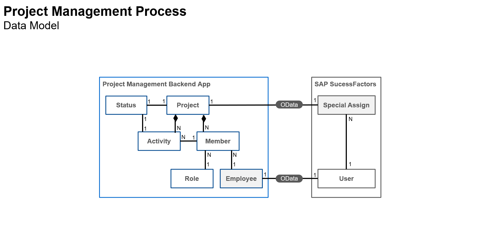
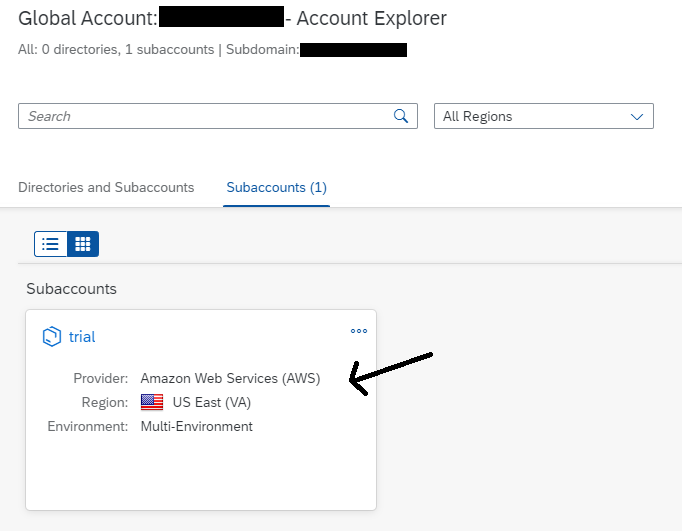
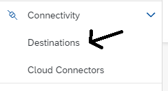
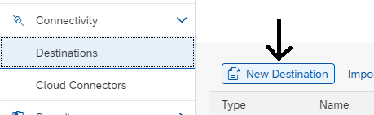
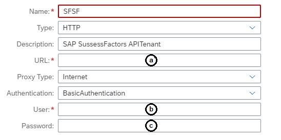
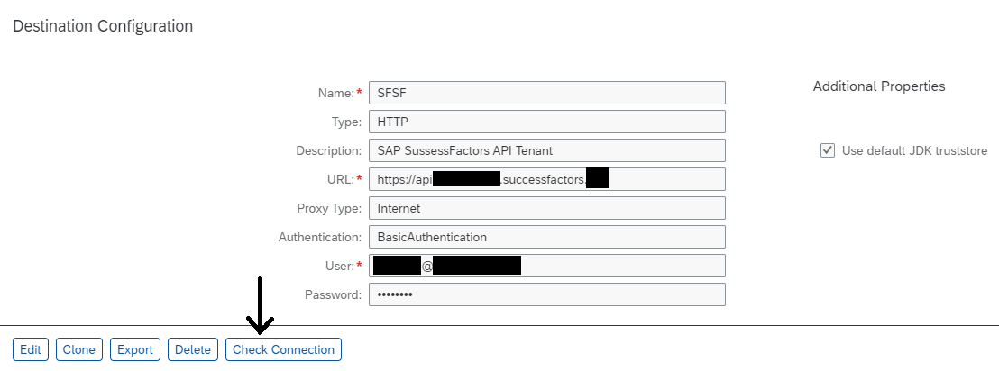
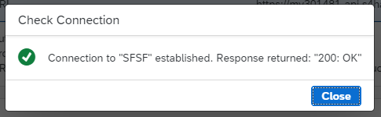

# Prepare to Develop the SAP SuccessFactors Extension
<!-- description --> Business scenario and preparation steps to develop the SAP SuccessFactors extension.

## Prerequisites
 - Get an **SAP Business Technology Platform** trial account following **[this tutorial](hcp-create-trial-account)**
 - Setup **SAP Business Application Studio** in your trial account following **[this tutorial](appstudio-onboarding)**
 - Create an **SAP HANA Cloud** database instance in your trial account following **[this tutorial](hana-cloud-deploying)** (please, be aware that **everything** in trial accounts **shut down overnight** – applications, databases etc., so make sure you **start your database** instance **before deploying** your solution)
 - Setup the **SAP Work Zone Standard Edition** (formerly **SAP Launchpad Service**) in your trial account following **[this tutorial](cp-portal-cloud-foundry-getting-started)**
 - Have access to an **SAP SuccessFactors tenant** with **admin credentials** (unfortunately there's no trial for that one, so make sure you're granted such access by other means)

> **IMPORTANT UPDATE**: As of **January, 12th, 2023**, **SAP Launchpad Service** has been re-branded to **SAP Work Zone Standard Edition**. As it's been just a product renaming, there's no impact on the functionality, hence not requiring any changes in the procedures described in this tutorial series. Therefore, wherever you read **SAP Launchpad Service** in the tutorials, please read **SAP Work Zone Standard Edition**.

## You will learn
  - The **business scenario** proposed to build an **SAP SuccessFactors extension**
  - The extension **architecture**
  - The extension **data model**
  - How to **get prepared** to develop the extension complying to the prerequisites and steps below

---

### Understand the business scenario

You will build a simple **project management** application on top of **SAP SuccessFactors** following these business rules:

1. Each project is composed by members (team) and activities;
2. The project team (members) is made of SAP SuccessFactors employees;
3. Each project member has an specific role in the project;
4. Each project activity is assigned to a specific project member;
5. Projects and activities have one status each (i.e. not started, in progress, overdue, completed etc.);
6. And last, but not least, whenever a team member is assigned to a project, a special assignment is registered to the employee background to signal that such employee has participated in the project, acting in a specific role, as part of the employee's professional experience.

### Understand the application architecture

Here's a diagram representing the overall architecture for the application:

The solution is a standalone application that will read the basic employee (SF user) information from SAP SuccessFactors using the **User** entity from the platform user management OData service and write the project assignments to the employees' background using the **Background Special Assign** entity from the employee profile OData service, through a **single destination** configured in SAP BTP, Cloud Foundry.

The application data model will be stored in an **SAP HANA Cloud** database.

In this tutorial group, the application will be deployed on **Cloud Foundry**, although it could be also deployed to the **`Kyma` Runtime** as depicted in the architecture.

### Understand the data model

Here's a diagram representing the data model for the application:

An extension data model cannot have associations (or compositions) directly linked to entities in the extended solution as they're not persisted in the same database.

Therefore, to assign the employees as members of projects' teams you need to create a kind of "bridge" between the actual entity in SAP SuccessFactors (in this case User) and the application data model by defining an "auxiliary entity" (in this case Employee) to strictly hold the User data from SAP SuccessFactors and associate it to the other entities in the model, serving as a kind of "cache" of employees participating in projects (please, note that **it's not a "replication" of the User entity**, as it only stores the employees who are assigned as members in existing projects).

The User entity from SAP SuccessFactors has been chosen because it's completely stable, meaning that it cannot be deleted but only marked as "inactive", otherwise you could fall into an integrity issue.

In the same way, there's no direct association between the projects and the background assignments, but it's added to the diagram just to have a complete conceptual representation of the model.

### Perform initial preparation

From the **global account** page on SAP BTP cockpit, click on the **trial** subaccount

On the left-hand side, expand the **Connectivity** section and click on **Destinations**

On the right, click on **New Destination**

Fill-up the destination information according to the **screenshot** and **instructions** below:

**a.** URL of your **SAP SuccessFactors API tenant**. Usually it follows the format: `https://api<tenant host>.successfactors.<eu or com>`. You should ask this URL to your SAP SuccessFactors technical administrator.

**b.** SAP SuccessFactors admin user (or any user with read/write permission on Users/Employee Profiles and appropriate access to OData APIs). This user must be provided in the format: **`username@companyId`**

**c.** User password

After providing the information above, click on **Save**

> **NOTE**: for the learning purpose of the tutorial group you will use **basic authentication** in the destination, but be aware that this authentication method is deprecated for productive usage and will be replaced by **OAuth 2 authentication**. To learn how to setup OAuth 2 authentication in your production environment you can refer to **[this link](https://help.sap.com/docs/SAP_SUCCESSFACTORS_PLATFORM/d599f15995d348a1b45ba5603e2aba9b/d9a9545305004187986c866de2b66987.html?version=2205)** from the **SAP SuccessFactors HXM Suite OData API: Developer Guide**.

Click on **Check Connection**

You should receive the **following message**:

Click on **Close**

### Check your knowledge

