## Prerequisites
 - Complete the tutorial: [**Prepare to Develop the SAP SuccessFactors Extension**](cap-extend-sfsf-intro)

## Details
### You will learn
  - How to access **SAP Business Application Studio**
  - How to login to **Cloud Foundry**
  - How to create your **CAP project** using `cds init`
  - Understand the **project structure**

---

[ACCORDION-BEGIN [Step 1: ](Access SAP Business Application Studio)]
You are going to start the journey by accessing the selected IDE for development (in this case, **SAP Business Application Studio**). To proceed with these instructions you must have first completed the prerequisites detailed in the tutorial: [**Prepare to Develop the SAP SuccessFactors Extension**](cap-extend-sfsf-intro).

Access your trial subaccount

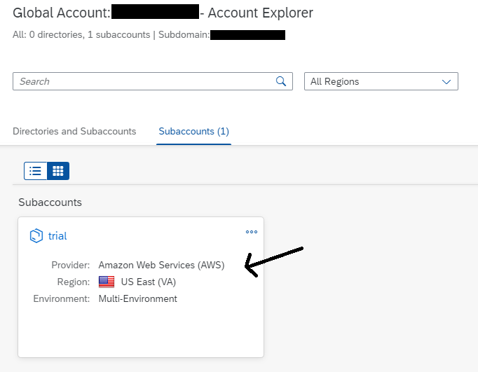

On the left-hand side expand **Services** and click on **Instances and Subscriptions**

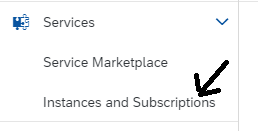

On the right, under **Subscriptions**, click on the **small icon** next to the **SAP Business Application Studio** subscription to **go to the application**

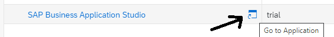

 Start your previously created Dev Space by clicking on the **Start Icon** on the right

 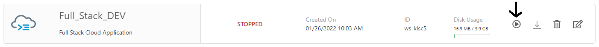

 After the Dev Space has started (status **RUNNING**), go into it by clicking on the **Space Name**

 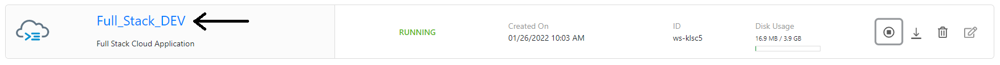

[DONE]
[ACCORDION-END]

[ACCORDION-BEGIN [Step 2: ](Login to Cloud Foundry)]
Before starting the development, you need to make sure to be properly logged in to the **Cloud Foundry environment** on your BTP subaccount.

From the **top menu**, click on **View** and select **Find Command…**

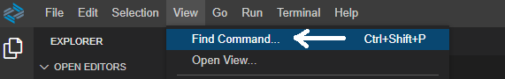

In the **Find Command dropdown**, search for **CF: Login to Cloud Foundry** and select it

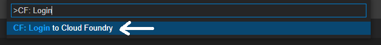

Confirm the **Cloud Foundry endpoint**, by pressing **Enter**

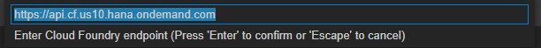

Enter the **e-mail address** you have used to create your **trial account** and press **Enter**

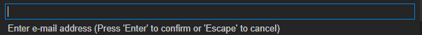

Enter the **password** you have used to create your **trial account** and press **Enter**

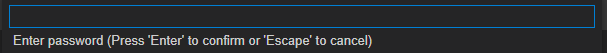

Select your **trial organization** and press **Enter**

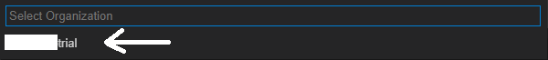

Select your **Cloud Foundry dev space** and press **Enter**

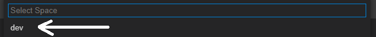

Click on the **small notifications icon** in the bottom right corner to view the login notifications to make sure the **login has been successful**

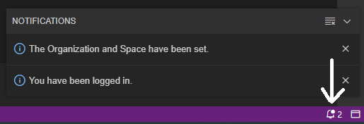

[DONE]
[ACCORDION-END]

[ACCORDION-BEGIN [Step 3: ](Create the CAP project)]
Now it's time to create the CAP Project and understand it's structure.

From the **top menu**, click on **Terminal** and select **New Terminal**

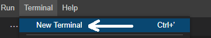

In the **terminal window** at the bottom, type `cd projects` and press **Enter**. The terminal should look like this:

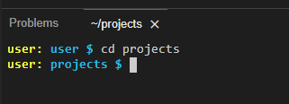

Now type `cds init sfsf-projman` and press **Enter**. The output should look like this:

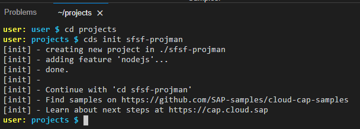

Notice that `sfsf-projman` is the **project and application name** and also the **project folder name**. Now, open the project as a workspace.

From the **top menu**, click on **File** and select **Open Workspace…**

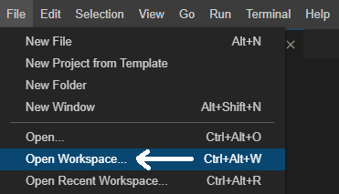

In the **dialog**, (1) select the `sfsf-projman` folder under projects (2) and the **VS Code Workspace (*.code-workspace)** from the **Format dropdown**, then (3) click **Open**

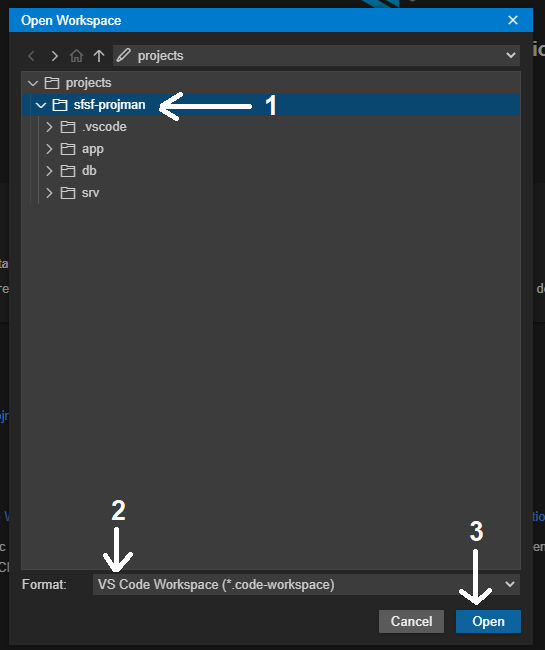

[DONE]
[ACCORDION-END]

[ACCORDION-BEGIN [Step 4: ](Understand the project structure)]
SAP Business Application Studio will restart and, after a few seconds, you should see the **following structure** at the bottom of the left-hand side pane:

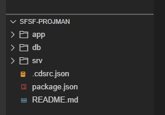

You can see that, under the project folder, `cds` has created three folders: `app`, `db` and `srv` and three files: `cdsrc.json`, `package.json` and `README.md`. Let's quickly understand the purpose of each one of them:

- `app` – is the folder where you are going to create the **HTML5 application** for the **UI** (in your case, it's going to be an **SAP Fiori Elements HTML5 application**).
- `db` – is the folder into which you will create the files to define the application **data model** (CDS data model) and also put some **initial data** in **CSV format** to test the application (under a subfolder named `data`).
- `srv` – is the folder where you place the files of your **service definition** and **business logic**.
- `cdsrc.json` – this file is created to specify **settings** to be used commonly **across several projects** or to alternatively hold **static project settings** additionally to the **package.json**. You can find more information about the usage of this file [**here**](https://cap.cloud.sap/docs/node.js/cds-env).
- `package.json` – this file holds **project specific settings** following the common **node.js standard**.
- `README.md` – is used for **project documentation**.

[DONE]
[ACCORDION-END]

[ACCORDION-BEGIN [Step 5: ](Check your knowledge)]

[VALIDATE_1]
[ACCORDION-END]
