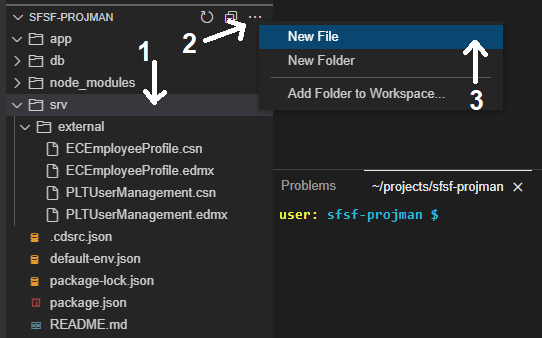

# Prepare the SAP SuccessFactors Extension UI with CDS Annotations
<!-- description --> In this phase of the development you will add CDS annotations to the CAP service for further usage by the Fiori Elements UI.

## Prerequisites
 - Complete the tutorial: [**Prepare to Develop the SAP SuccessFactors Extension**](cap-extend-sfsf-intro)
 - Complete the tutorial: [**Jump start the SAP SuccessFactors Extension CAP Project**](cap-extend-sfsf-jumpstart)
 - Complete the tutorial: [**Import SAP SuccessFactors OData Services definitions**](cap-extend-sfsf-import-services)
 - Complete the tutorial: [**Create the CDS Data Model for the SAP SuccessFactors Extension**](cap-extend-sfsf-data-model)
 - Complete the tutorial: [**Create the CAP Service for the SAP SuccessFactors Extension**](cap-extend-sfsf-create-service)
 - Complete the tutorial: [**Add Business Logic to the SAP SuccessFactors Extension**](cap-extend-sfsf-add-logic)

## You will learn
  - How to **create the annotations file**
  - How to **code the CDS annotations** into the file
  - Understand the **value help** annotations
  - How to **test the application UI** using the **Fiori preview** feature
  - How to **check the result** of an **employee's project assignment** on SAP SuccessFactors
  - How to do **further testing**

---

### Create the annotations file


It is a best practice to maintain the UI annotations in a separate file referencing your CAP service. So, go ahead and create that file.

On the **left-hand pane** of **SAP Business Application Studio**, (1) select the `srv` folder, then (2) click on the **three dots** to the right of the project name and (3) select **New File**.



On the **dialog** name the file `projman-service-ui.cds` and click **OK**.


### Code the CDS annotations


Copy and paste the **code snippet below** into the recently created file:

```CDS Annotations
using sfsf.projman.service.ProjectManager as service from './projman-service';

namespace sfsf.projman.service.ui;

////////////////////////////////////////////////////////////////////////////
//
// UI annotations for the Project Root Entity
//
annotate service.Project with @(UI : {
    UpdateHidden        : false,
    DeleteHidden        : false,
    CreateHidden        : false,
    Identification      : [
        {Value : name}
    ],
    HeaderInfo          : {
        $Type          : 'UI.HeaderInfoType',
        TypeName       : 'Project',
        TypeNamePlural : 'Projects',
        Title          : {
            $Type : 'UI.DataField',
            Value : name
        },
        Description    : {
            $Type : 'UI.DataField',
            Value : description
        }
    },
    SelectionFields     : [
        name,
        startDate,
        endDate,
        status_ID
    ],
    LineItem            : [
        {
            $Type : 'UI.DataField',
            Value : name
        },
        {
            $Type : 'UI.DataField',
            Value : description
        },
        {
            $Type : 'UI.DataField',
            Value : startDate
        },
        {
            $Type : 'UI.DataField',
            Value : endDate
        },
        {
            $Type             : 'UI.DataField',
            Value             : status.name,
            Criticality       : status.criticality,
            ![@UI.Importance] : #High
        }
    ],
    HeaderFacets        : [{
        $Type  : 'UI.ReferenceFacet',
        Target : '@UI.FieldGroup#Detail'
    }],
    Facets              : [
        {
            $Type  : 'UI.ReferenceFacet',
            ID     : 'ProjectsDetails',
            Target : '@UI.FieldGroup#Details',
            Label  : 'Details'
        },
        {
            $Type  : 'UI.ReferenceFacet',
            ID     : 'ProjcetTeam',
            Target : 'team/@UI.LineItem',
            Label  : 'Team'
        },
        {
            $Type  : 'UI.ReferenceFacet',
            ID     : 'ProjcetActivity',
            Target : 'activities/@UI.LineItem',
            Label  : 'Activities'
        }
    ],
    DataPoint #ProjName : {
        Value : name,
        Title : 'Project Title'
    },
    FieldGroup #Detail  : {Data : [{
        $Type       : 'UI.DataField',
        Value       : status_ID,
        Criticality : status.criticality
    }]},
    FieldGroup #Details : {
        $Type : 'UI.FieldGroupType',
        Data  : [
            {
                $Type : 'UI.DataField',
                Value : startDate,
                Label : 'Start'
            },
            {
                $Type : 'UI.DataField',
                Value : endDate,
                Label : 'End'
            }
        ]
    },
});

annotate service.Project with {
    ID          @(
        title     : 'Project ID',
        UI.Hidden : true
    )           @readonly;
    name        @(title : 'Project Title');
    description @(
        title : 'Description',
        UI.MultiLineText
    );
    startDate   @(title : 'Start');
    endDate     @(title : 'End');
    status      @(
        Common : {
            Text            : status.name,
            TextArrangement : #TextOnly,
            ValueListWithFixedValues,
            FieldControl    : #Mandatory
        },
        title  : 'Status'
    );
}

annotate service.Project @(Capabilities : {
    Insertable : true,
    Deletable  : true,
    Updatable  : true,
});

////////////////////////////////////////////////////////////////////////////
//
// UI annotations for the Member Child Entity
//
annotate service.Member with @(UI : {
    UpdateHidden        : false,
    DeleteHidden        : false,
    CreateHidden        : false,
    Identification      : [{Value : member_name}],
    HeaderInfo          : {
        $Type          : 'UI.HeaderInfoType',
        TypeName       : 'Member',
        TypeNamePlural : 'Members',
        Title          : {
            $Type : 'UI.DataField',
            Value : member_userId
        },
        Description    : {
            $Type : 'UI.DataField',
            Value : member.title
        }
    },
    SelectionFields     : [
        member.division,
        member.department,
        member.email,
        role.name
    ],
    LineItem            : [
        {
            $Type : 'UI.DataField',
            Value : member_userId,
            Label : 'Name'
        },
        {
            $Type : 'UI.DataField',
            Value : member.title
        },
        {
            $Type : 'UI.DataField',
            Value : member.email
        },
        {
            $Type : 'UI.DataField',
            Value : member.division
        },
        {
            $Type : 'UI.DataField',
            Value : member.department
        },
        {
            $Type : 'UI.DataField',
            Value : role_ID,
            Label : 'Role'
        }
    ],
    HeaderFacets        : [{
        $Type  : 'UI.ReferenceFacet',
        Target : '@UI.FieldGroup#Detail'
    }],
    Facets              : [{
        $Type  : 'UI.ReferenceFacet',
        ID     : 'ProjectsDetails',
        Target : '@UI.FieldGroup#Details',
        Label  : 'Details'
    }],
    FieldGroup #Detail  : {Data : [{
        $Type : 'UI.DataField',
        Value : role_ID,
        Label : 'Role'
    }]},
    FieldGroup #Details : {
        $Type : 'UI.FieldGroupType',
        Data  : [
            {
                $Type : 'UI.DataField',
                Value : member.email,
                Label : 'e-Mail'
            },
            {
                $Type : 'UI.DataField',
                Value : member.division,
                Label : 'Division'
            },
            {
                $Type : 'UI.DataField',
                Value : member.department,
                Label : 'Department'
            }
        ]
    },
});

annotate service.Member with {
    ID          @(
        Common : {
            Text : member_name,
            TextArrangement : #TextOnly,
        },
        title     : 'Member ID'
    )           @readonly;
    parent      @(
        title     : 'Project ID',
        UI.Hidden : true
    );
    member      @(
        Common : {
            Text            : member.defaultFullName,
            TextArrangement : #TextOnly,
            FieldControl    : #Mandatory,
            ValueList       : {
                $Type          : 'Common.ValueListType',
                CollectionPath : 'SFSF_User',
                Parameters     : [
                    {
                        $Type             : 'Common.ValueListParameterInOut',
                        LocalDataProperty : 'member_userId',
                        ValueListProperty : 'userId'
                    },
                    {
                        $Type             : 'Common.ValueListParameterDisplayOnly',
                        ValueListProperty : 'defaultFullName'
                    }
                ],
                Label : 'Employees'
            }
        },
        title  : 'Name'
    );
    role        @(
        Common : {
            Text            : role.name,
            TextArrangement : #TextOnly,
            ValueListWithFixedValues,
            FieldControl    : #Mandatory
        },
        title  : 'Role'
    );
    member_name @(title : 'Name', UI.Hidden: true);
    hasAssignment @(UI.Hidden: true);
}

annotate service.Member @(Capabilities : {
    SearchRestrictions : {
        $Type      : 'Capabilities.SearchRestrictionsType',
        Searchable : true
    },
    Insertable         : true,
    Deletable          : true,
    Updatable          : true
});

////////////////////////////////////////////////////////////////////////////
//
// UI annotations for the Activity Child Entity
//
annotate service.Activity with @(UI : {
    UpdateHidden        : false,
    DeleteHidden        : false,
    CreateHidden        : false,
    Identification      : [{Value : name}],
    HeaderInfo          : {
        $Type          : 'UI.HeaderInfoType',
        TypeName       : 'Activity',
        TypeNamePlural : 'Activities',
        Title          : {
            $Type : 'UI.DataField',
            Value : name
        },
        Description    : {
            $Type : 'UI.DataField',
            Value : description
        }
    },
    SelectionFields     : [
        name,
        assignedTo_ID,
        dueDate,
        status_ID
    ],
    LineItem            : [
        {
            $Type : 'UI.DataField',
            Value : name
        },
        {
            $Type : 'UI.DataField',
            Value : description
        },
        {
            $Type : 'UI.DataField',
            Value : assignedTo_ID,
            Label : 'Assigned To'
        },
        {
            $Type : 'UI.DataField',
            Value : assignedTo.role.name
        },
        {
            $Type : 'UI.DataField',
            Value : dueDate
        },
        {
            $Type       : 'UI.DataField',
            Value       : status_ID,
            Label       : 'Status',
            Criticality : status.criticality
        }
    ],
    HeaderFacets        : [{
        $Type  : 'UI.ReferenceFacet',
        Target : '@UI.FieldGroup#Detail'
    }],
    Facets              : [{
        $Type  : 'UI.ReferenceFacet',
        ID     : 'ActivityDetails',
        Target : '@UI.FieldGroup#Details',
        Label  : 'Details'
    }],
    FieldGroup #Detail  : {Data : [{
        $Type       : 'UI.DataField',
        Value       : status_ID,
        Criticality : status.criticality
    }]},
    FieldGroup #Details : {
        $Type : 'UI.FieldGroupType',
        Data  : [
            {
                $Type : 'UI.DataField',
                Value : assignedTo_ID,
                Label : 'Assigned To'
            },
            {
                $Type : 'UI.DataField',
                Value : assignedTo.role.name,
                Label : 'Role'
            },
            {
                $Type : 'UI.DataField',
                Value : dueDate,
                Label : 'Due Date'
            }
        ]
    },
});

annotate service.Activity with {
    ID               @(
        title     : 'Activity ID',
        UI.Hidden : true
    )                @readonly;
    parent           @(
        title     : 'Project ID',
        UI.Hidden : true
    );
    name             @(title : 'Activity');
    description      @(
        title : 'Description',
        UI.MultiLineText
    );
    assignedTo       @(
        Common : {
            Text            : assignedTo.member_name,
            TextArrangement : #TextOnly,
            ValueListWithFixedValues,
            FieldControl    : #Mandatory,
            ValueList       : {
                $Type          : 'Common.ValueListType',
                CollectionPath : 'Member',
                Parameters     : [
                    {
                        $Type             : 'Common.ValueListParameterOut',
                        LocalDataProperty : 'assignedTo_ID',
                        ValueListProperty : 'ID'
                    },
                    {
                        $Type             : 'Common.ValueListParameterIn',
                        LocalDataProperty : 'parent_ID',
                        ValueListProperty : 'parent_ID'
                    },
                    {
                        $Type             : 'Common.ValueListParameterDisplayOnly',
                        ValueListProperty : 'member_name'
                    }
                ]
            }
        },
        title  : 'Assigned To'
    );
    dueDate @(title : 'Due Date');
    status           @(
        Common : {
            Text            : status.name,
            TextArrangement : #TextOnly,
            ValueListWithFixedValues,
            FieldControl    : #Mandatory
        },
        title  : 'Status'
    );
}

annotate service.Activity @(Capabilities : {
    SearchRestrictions : {
        $Type      : 'Capabilities.SearchRestrictionsType',
        Searchable : true
    },
    Insertable         : true,
    Deletable          : true,
    Updatable          : true
});

////////////////////////////////////////////////////////////////////////////
//
// UI annotations for the Employee Child Entity
//
annotate service.Employee with {
    userId          @(title : 'User ID')  @readonly;
    username        @(title : 'User Name')  @readonly;
    defaultFullName @(title : 'Name');
    email           @(title : 'e-Mail');
    division        @(title : 'Division');
    department      @(title : 'Department');
    title           @(title : 'Title');
}

annotate service.Employee @(Capabilities : {
    Insertable : false,
    Deletable  : false,
    Updatable  : false
});

////////////////////////////////////////////////////////////////////////////
//
// UI annotations for the SFSF_User Entity
//
annotate service.SFSF_User with @(UI : {
    CreateHidden    : true,
    UpdateHidden    : true,
    DeleteHidden    : true,
    Identification  : [{
        $Type : 'UI.DataField',
        Value : defaultFullName
    }],
    HeaderInfo      : {
        $Type          : 'UI.HeaderInfoType',
        TypeName       : 'User',
        TypeNamePlural : 'Users',
        Title          : {
            $Type : 'UI.DataField',
            Value : defaultFullName
        },
        Description    : {
            $Type : 'UI.DataField',
            Value : title
        }        
    },
    SelectionFields : [
        userId,
        username,
        division,
        department
    ],
    LineItem        : [
        {
            $Type : 'UI.DataField',
            Value : userId
        },
        {
            $Type : 'UI.DataField',
            Value : defaultFullName
        },
        {
            $Type : 'UI.DataField',
            Value : email
        },
        {
            $Type : 'UI.DataField',
            Value : title
        },
        {
            $Type : 'UI.DataField',
            Value : division
        },
        {
            $Type : 'UI.DataField',
            Value : department
        }
    ],
});

annotate service.SFSF_User with {
    userId          @(
        Common : {
            Text : defaultFullName,
            TextArrangement : #TextSeparate
        },
        title : 'User ID'
    )  @readonly;
    username        @(title : 'User Name')  @readonly;
    defaultFullName @(title : 'Name');
    email           @(title : 'e-Mail');
    division        @(title : 'Division');
    department      @(title : 'Department');
    title           @(title : 'Title');
}

annotate service.SFSF_User @(Capabilities : {
    SearchRestrictions : {
        $Type      : 'Capabilities.SearchRestrictionsType',
        Searchable : false
    },
    Insertable         : false,
    Deletable          : false,
    Updatable          : false
});

////////////////////////////////////////////////////////////////////////////
//
// UI annotations for the Role Entity
//
annotate service.Role with {
    ID   @Common : {
        Text            : name,
        TextArrangement : #TextOnly
    }    @title :  'Role ID';
    name @title  : 'Role'
}

annotate service.Role @(Capabilities : {
    Insertable : false,
    Deletable  : false,
    Updatable  : false
});

////////////////////////////////////////////////////////////////////////////
//
// UI annotations for the Status Entity
//
annotate service.Status with {
    ID   @Common : {
        Text            : name,
        TextArrangement : #TextOnly
    }    @title :  'Status ID';
    name @title  : 'Status'
}

annotate service.Status @(Capabilities : {
    Insertable : false,
    Deletable  : false,
    Updatable  : false
});
```


### Understand the value help annotations


The code from the previous step contains all required CDS annotations to make the UI look and behave like expected by the business rules defined in the [**group introduction and preparation**](cap-extend-sfsf-intro).

However, the purpose of this tutorial is not to go deep into the topic of CDS UI annotations and explain them in detail, but rather give you a starting point to further explore it in the future.

But, don't worry! Here you have a really nice **GitHub Repository** from **SAP Samples** that's a **reach source of reference and feature showcase of CDS UI annotations** to be used in Fiori Elements applications, where all the coding done in the previous step is demonstrated and explained:

- [Fiori Elements: annotations reference and feature showcase](https://github.com/SAP-samples/fiori-elements-feature-showcase)

And you can also refer to the advanced topic of **Serving Fiori UIs** from the official **CAP documentation**:

- [Serving Fiori UIs](https://cap.cloud.sap/docs/advanced/fiori)

But, before you move on to testing the application, it's important to highlight just two pieces of those annotations: the **value help** for the `member` attribute in the `Member` entity and the **value help** for the `assignedTo` attribute of the `Activity` entity.

Notice that the **collection path** for the **first value help** is `SFSF_User`, that's bringing the employees from SAP SuccessFactors which are later stored in the `Employee` entity of the application's model by the business logic implemented in the last tutorial, whilst the **collection path** for the **second** one is `Member`, because, according to the business rules, you can only assign activities to employees who are part of the project team.

Therefore, to filter the records in the second value help so only members of the current project are displayed, you set the `Common.ValueListParameterIn` parameter from the `ValueList` annotation to the activity's `parent_ID` which is actually the current project being edited.


### Test the application UI


Finally, it's come the time to test everything that you have done so far! For that, you can rely on the nice **Fiori Preview** feature that's available during development.

So, go ahead and do it!

From the **service home page** click on the **Fiori Preview** link next to the `Project` entity.


After a couple seconds, the page below should be displayed:


The three projects from the initial test data CSV files are listed. Click on the first one (S/4HANA Cloud implementation) and you should get to the object page below:


Now you have the full project details including the composition entities: **Member** and **Activity**.

The **Fiori Preview** is basically a complete **Fiori Elements application** based on the **List report object page template** which is locally available for testing during development.

You'll focus on the **key part** of this application extension for your initial testing: the **communication with SAP SuccessFactors**.

Click on the **Edit** button at the top-right corner of the page. This should put the object in "**draft editing mode**" and make the page look like this:


Now, add a new team member. Click on the **Create** button right on top of the **Members** Smart Table:


> **NOTE**: as **SAP UI5 framework** - which powers-up the **Fiori Elements UI** - is loaded directly from its host in the internet and keeps constantly evolving, it is possible that the new member object page is skipped. In that case, you can fill the data from the next instructions directly in the **Members** Smart Table.


> **NOTE**: the **employees list** from the above screenshot is from an **SAP SuccessFactors demo tenant**. Your list may differ from that one depending on the SAP SuccessFactors tenant you are using.

Click on the line for `Sarah Lynn Moultone` (or some other user from your tenant) then click **OK**, to select that employee: This will take you back to the **object page** for the new member, but, now, you'll notice that `Sarah Lynn Moultone` (or the user you picked) is displayed in the **Name** field as well as in the **page header**.

Click on the **Role** dropdown list and select **Solution Architect**:


Click on the **Apply** button at the bottom-right corner. This will take you back to the **Edit Project** page, but now, with the **new member added** to the **Members** Smart Table:


Click on the **Save** button in the bottom-right corner to **save the project** and go back to the standard object page:


### Check operation result on SAP SuccessFactors


You'll now check what happened on the **SAP SuccessFactors side** after this operation.

Log in to your SAP SuccessFactors tenant (the one you set up in the destination following the instructions in the [**group introduction and preparation**](cap-extend-sfsf-intro)) and search for the employee `Sarah Lynn Moultone` (or any other that you utilized to add as the new team member of the project), then click on it to open the employee profile:


Now, search for the Special Assignments block from the profile to verify whether the project is showing up as an assignment.

> **NOTE**: the **Employee Profile** from the SAP SuccessFactors tenant **must be configured** to display such information (use the **Configure People Profile** functionality from the **Admin Center** for that).

> **HINT**: As it's a configurable block, it can also be placed in different sections within the profile in each tenant. To facilitate, try to **search** for the **S/4HANA Cloud implementation** project in the page, after **making sure that the assignments block is properly configured** in the profile.


### Execute other tests


The **test sequence** you've executed is the **most important** in the context of extending the SAP SuccessFactors solution with **data flowing in both directions**: from and to SAP SuccessFactors.

Here is a list of other tests that you can execute on your own to make sure the application is working fine:

- Create a new project
- Assign team members to newly created project – check whether special assignment is properly created in SAP SuccessFactors
- Assign activities to team members
- Remove a team member – all assigned activities should be deleted
- Change an existing team member by another employee – corresponding assignment should be created in SAP SuccessFactors and assigned activities should be automatically transferred to the new employee
- Delete assigned activities
- Delete the project – all team members and assigned activities should be deleted
- Test the filters in the list report pages: projects main page and employees value help
- After completing all those operations, make sure the Employee entity has only employees that are assigned as team members of the active projects (via the Employee link in the service home page).

If all those tests are successful, then you can say your application is working pretty fine according to the defined business rules.


### Check your knowledge


