## You will learn

- How to configure entitlements.
- How to enable the SAP BTP Kyma runtime in your subaccount in SAP BTP.
- How to create an SAP HANA Cloud service instance in the SAP BTP cockpit.
- How to enable the CAP Operator community module in your Kyma cluster.

## Prerequisites

- You have an [enterprise global account](https://help.sap.com/docs/btp/sap-business-technology-platform/getting-global-account#loiod61c2819034b48e68145c45c36acba6e) in SAP BTP. To use services for free, you can sign up for an SAP BTPEA (SAP BTP Enterprise Agreement) or a Pay-As-You-Go for SAP BTP global account and use the free tier services only. See [Using Free Service Plans](https://help.sap.com/docs/btp/sap-business-technology-platform/using-free-service-plans?version=Cloud).
- You have a platform user. See [User and Member Management](https://help.sap.com/docs/btp/sap-business-technology-platform/user-and-member-management).
- You're an administrator of the global account in SAP BTP.
- You have a subaccount in SAP BTP to deploy the services and applications.

> This tutorial follows the guidance provided in the [SAP BTP Developer's Guide](https://help.sap.com/docs/btp/btp-developers-guide/what-is-btp-developers-guide).

### Configure the entitlements

To deploy the Incident Management sample application, you need the following entitlements:

| Service     |      Plan      |  Quota required |
| ------------- | :-----------: | ----: |
| Kyma runtime | free (Environment) |   1 |
| SAP HANA Cloud |   hana-free    |   1 |
| SAP HANA Cloud |   tools (Application)   |   1 |
| SAP HANA Schemas & HDI Containers |   hdi-shared   |   1 |
| HTML5 Application Repository Service | app-host | 1 |
| HTML5 Application Repository Service | app-runtime | 1 |
| Destination Service | lite | 1 |
| SaaS Provisioning Service | application | 1 |
| Service Manager | container | 1 |
| Authorization and Trust Management Service | broker | 1 |

> You can find more information about entitlements in [Configure Entitlements and Quotas](https://help.sap.com/docs/btp/sap-business-technology-platform/configure-entitlements-and-quotas-for-subaccounts).

### Enable SAP BTP, Kyma runtime

Let's enable your subaccount to use the SAP BTP, Kyma runtime.

1. Navigate to your subaccount and choose **Enable Kyma** under the **Kyma Environment** tab.

    <!-- border; size:540px --> 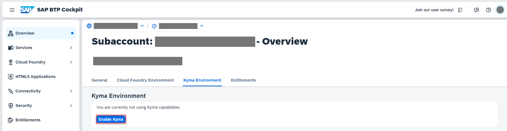

2. In the **Enable Kyma** popup, change the values for **Instance Name** and **Cluster Name** as needed and choose **Create**.

    <!-- border; size:540px --> 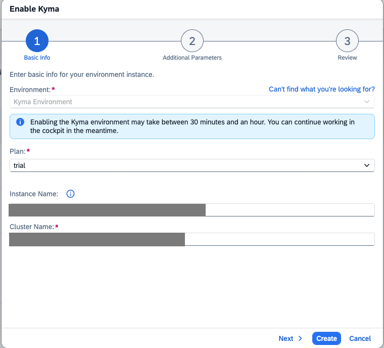

    > Make sure that the instance name is CLI-friendly. CLI-friendly names make it easier to manage your instances with the SAP BTP command-line interface as well.
    >
    > A CLI-friendly name is a short string (up to 32 characters) that contains only alphanumeric characters (A-Z, a-z, 0-9), periods, underscores, and hyphens. It can't contain white spaces.
    >
    > When enabling the runtime, you notice that the instance name is generated automatically for you. You can use that name or replace it with the name of your choice.

### Subscribe to SAP HANA Cloud Administration Tools

1. Navigate to your subaccount and choose **Services** &rarr; **Service Marketplace** on the left.

2. Type **SAP HANA Cloud** in the search box and choose **Create**.

    <!-- border; size:540px --> 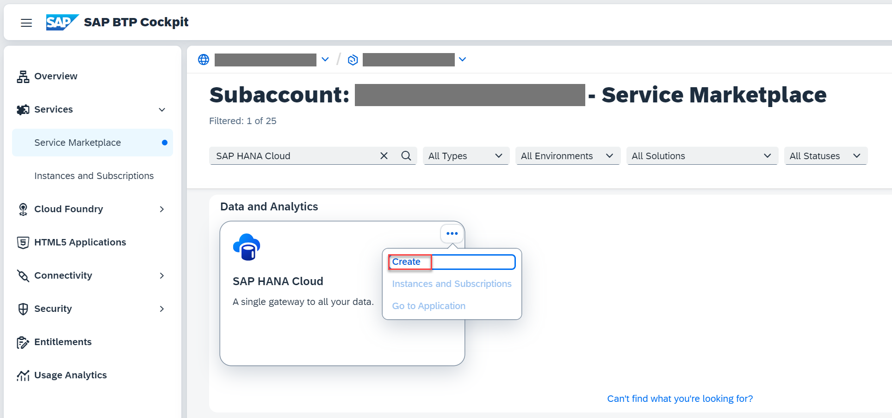

3. In the **New Instance or Subscription** popup, select **tools** from the dropdown in the **Plan** field and choose **Create**.

    <!-- border; size:540px --> 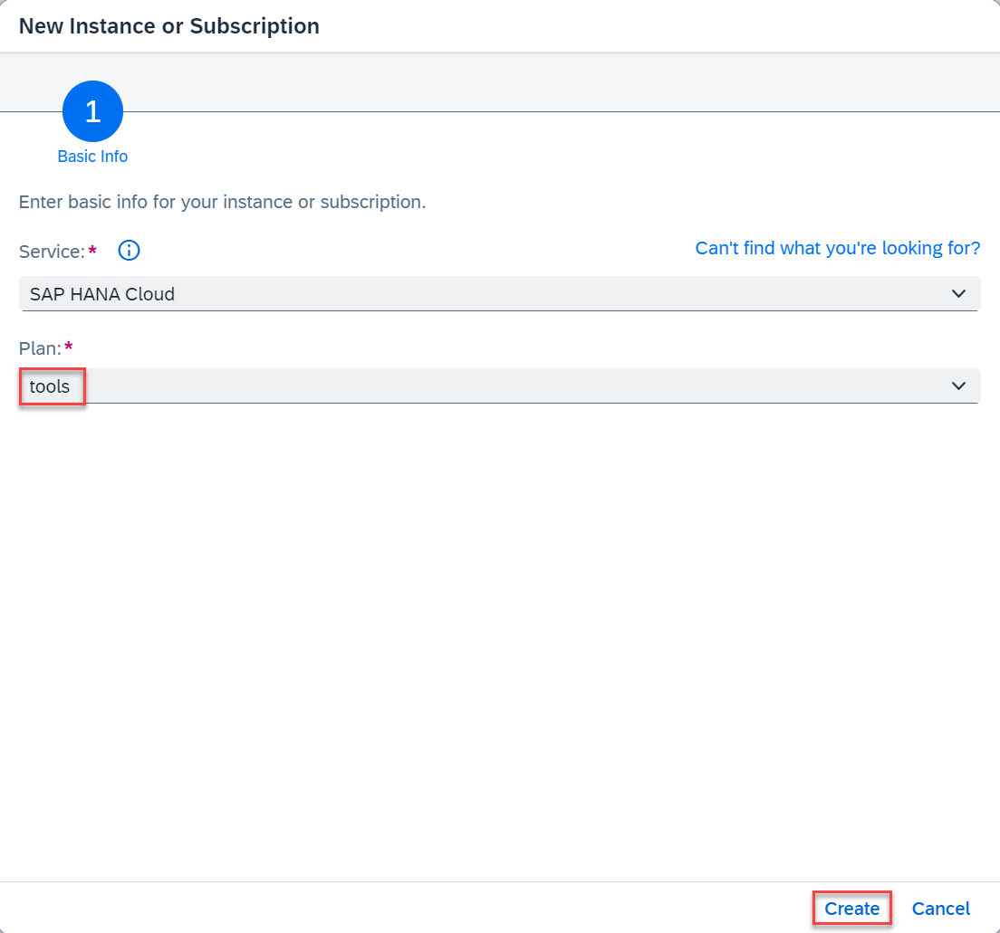

4. Choose **View Subscription** and wait until the status changes to **Subscribed**.

    <!-- border; size:540px --> 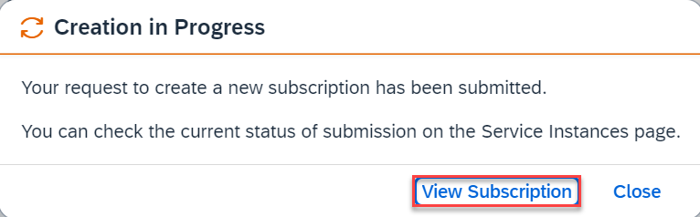

    <!-- border; size:540px --> 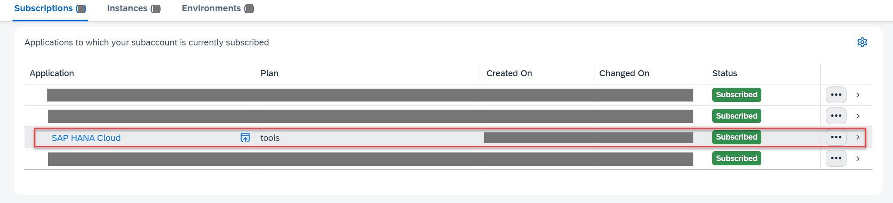

5. In your SAP BTP subaccount, choose **Security** &rarr; **Role Collections** in the left-hand pane.

6. Choose role collection **SAP HANA Cloud Administrator**.

7. Choose **Edit**.

    <!-- border; size:540px --> 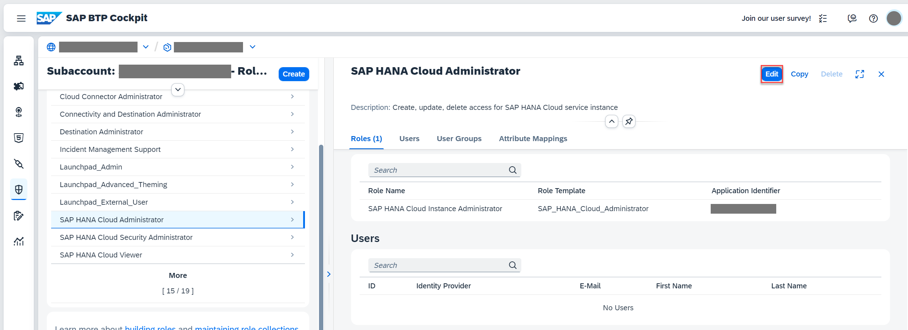

8. In the **Users** section, enter your user and select the icon to add the user.

    <!-- border; size:540px --> 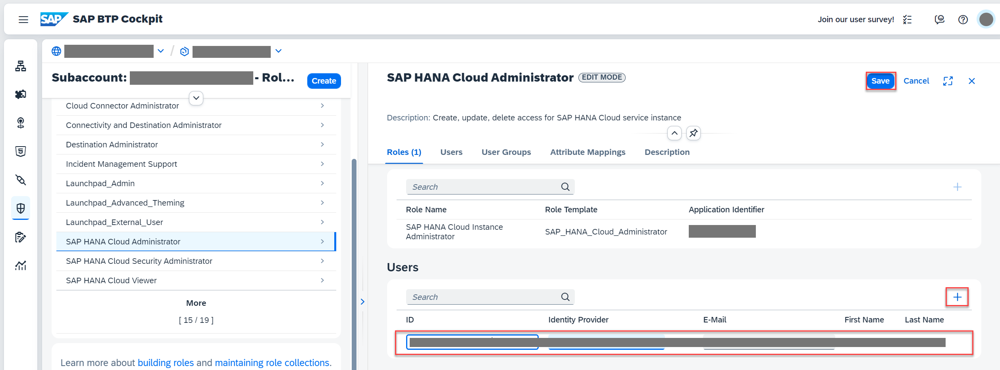

    > Keep the `Default Identity Provider` setting unless you have a custom identity provider configured.

9. Choose **Save**.

    You've assigned the **SAP HANA Cloud Administrator** role collection to your user.

> Log out and log back in to make sure your new role collection is considered.

### Create an SAP HANA Cloud service instance

SAP HANA Cloud is used as a persistence layer.

Follow these steps to create an SAP HANA Cloud service instance in the SAP BTP cockpit:

1. In your SAP BTP subaccount, navigate to **Services** &rarr; **Instances and Subscriptions** in the left-hand pane.

2. Choose **SAP HANA Cloud**. You're redirected to SAP HANA Cloud multi-environment administration tools. Sign in with your SAP BTP cockpit username/email if necessary.

    <!-- border; size:540px --> 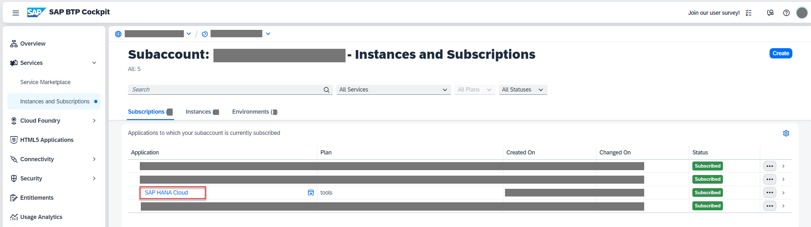

3. In SAP HANA Cloud Central, choose **Create Instance**.

    <!-- border; size:540px --> 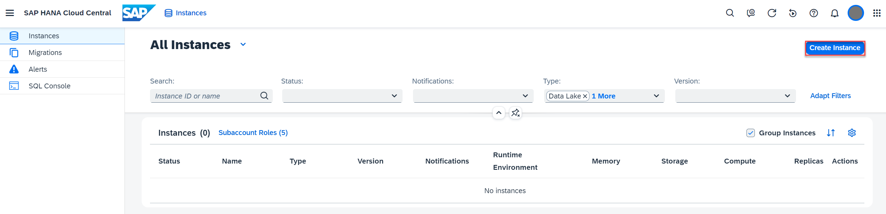

4. Choose *Confiure manually* as **Instance Configuration** and *SAP HANA Database* as **Instance Type**. Then, choose **Next Step**.

    <!-- border; size:540px --> 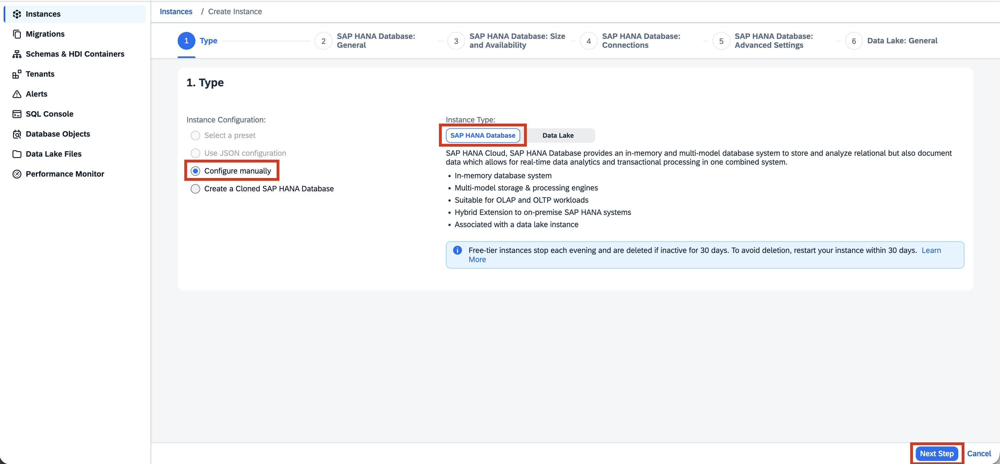

5. In the **Instance Name** field, enter *application-hana-instance*.

6. In the **Administrator Password** and **Confirm Administrator Password** fields, enter a password for DBADMIN. Choose **Next Step**.

    <!-- border; size:540px --> 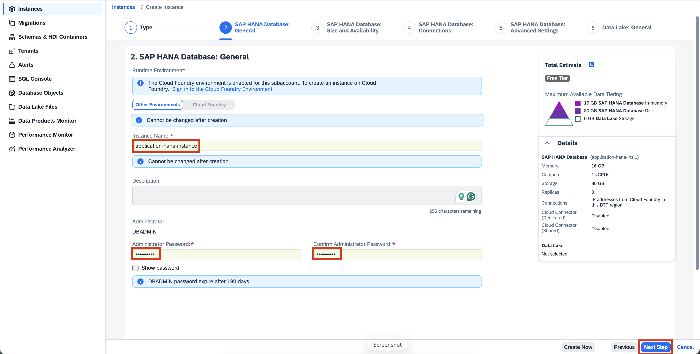

7. At **SAP HANA Database: Size and Availability**, choose **Next Step**.

8. In **SAP HANA Database: Connections**, select the **All IP addresses** radio button, and choose **Next Step**.

    <!-- border; size:540px --> 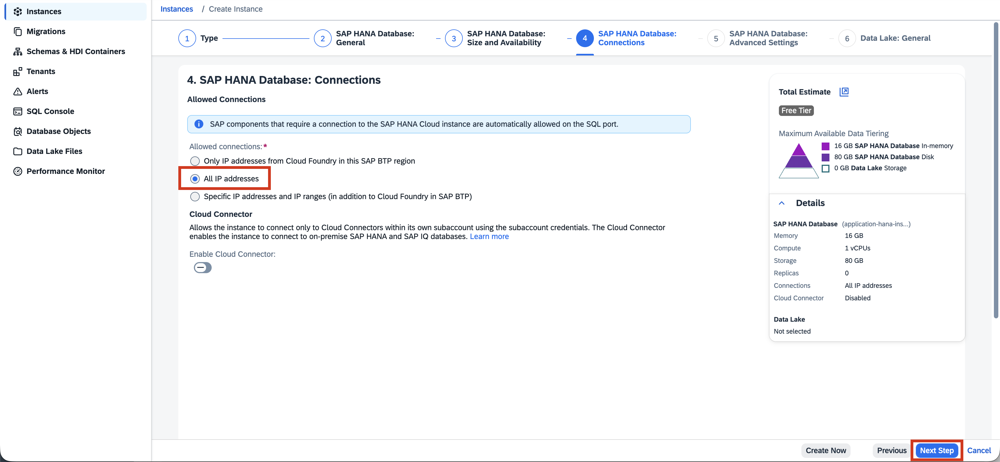

9. At **SAP HANA Database: Advanced Settings**, choose **Next Step**.

10. At **Data Lake: General**, choose **Review and Create**.

11. Choose **Create Instance**.

The creation of the database instance can take some minutes to complete.

> Your SAP HANA Cloud service instance automatically stops overnight, according to the time zone of the region where the server is located. This means you need to restart your instance every day before you start working with it.

### Map your SAP HANA Cloud service instance to your Kyma cluster

1. Go to SAP HANA Cloud Central. If you've closed it, open it again by following these steps:

    - In your SAP BTP subaccount, navigate to **Services** &rarr; **Instances and Subscriptions**.
    - Choose **SAP HANA Cloud**. You're redirected to SAP HANA Cloud multi-environment administration tools. Sign in with your SAP BTP cockpit username/email if necessary.

2. For the **application-hana-instance** instance, choose **Manage Configuration**.

    <!-- border; size:540px --> 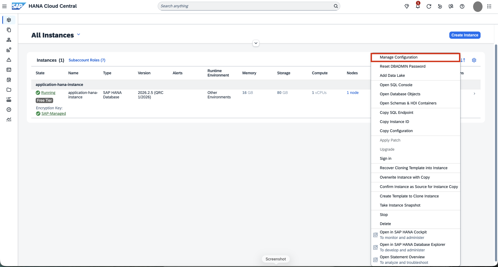

3. Select the **Instance Mapping** tab and choose **Add Mapping**.

    <!-- border; size:540px --> 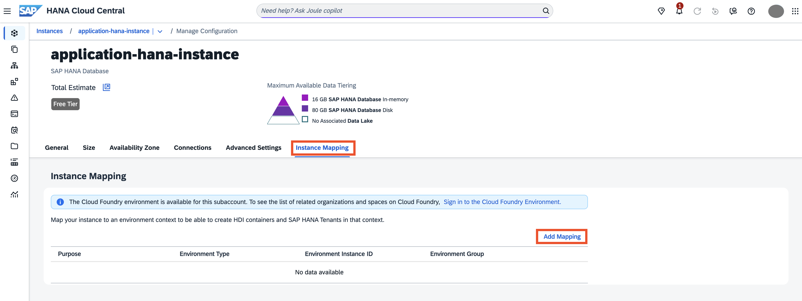

4. Select **Kyma** from the dropdown under **Environment Type**.

5. Under **Environment Instance ID**, paste the GUID of your Kyma cluster. Here's how to find it:

    - Open your Kyma dashboard.
    - Choose **Namespaces** on the left and choose **kyma-system**.
    - Navigate to **Configuration** &rarr; **Config Maps** and choose **sap-btp-operator-config**.
    - You can see the GUID of your Kyma cluster in the **CLUSTER_ID** section.

    <!-- border; size:540px --> 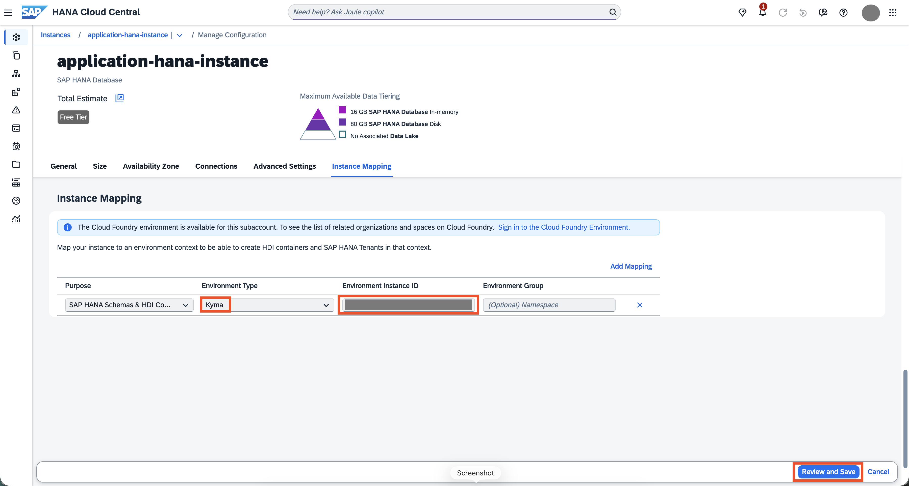

    > If no namespace is provided, the instance is mapped to all namespaces in the cluster.

6. Choose **Review and Save**. In the popup, choose **Save Changes**.

    <!-- border; size:540px --> 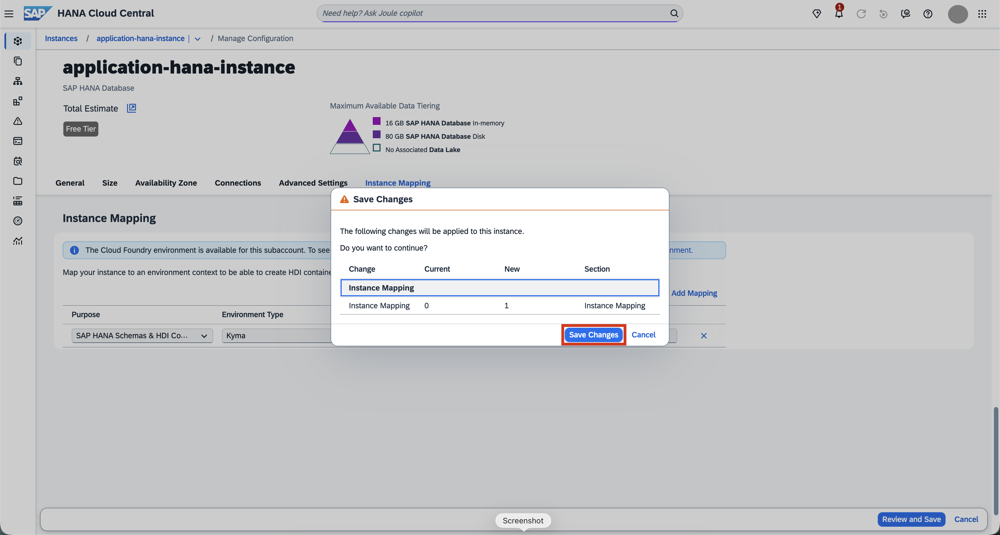

    You've mapped your SAP HANA Cloud service instance to your Kyma cluster.

    > For more information, see [Map an SAP HANA Database to another Environment Context](https://help.sap.com/docs/HANA_CLOUD/9ae9104a46f74a6583ce5182e7fb20cb/1683421d02474567a54a81615e8e2c48.html) to add a new Cloud foundry or Kyma mapping.

