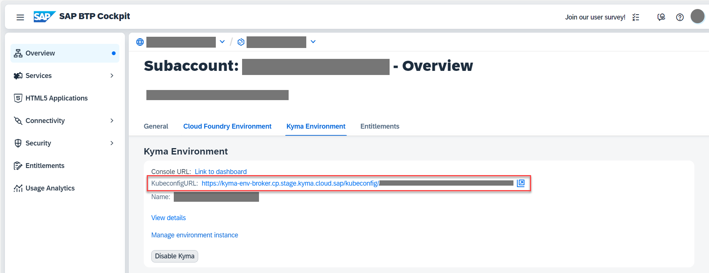
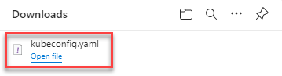

## You will learn

- How to install the tools required for deploying CAP applications in the SAP BTP, Kyma runtime.
    - [kubectl](https://kubernetes.io/docs/tasks/tools/install-kubectl/)
    - [kubelogin](https://github.com/int128/kubelogin)
    - [helm](https://helm.sh/docs/intro/install/)
    - [pack](https://buildpacks.io/docs/tools/pack/#install)
    - A container management app such as [Docker Desktop](https://www.docker.com/products/docker-desktop/) or [Rancher Desktop](https://rancherdesktop.io/).

## Prerequisites

- You've configured the respective entitlements, enabled the Kyma runtime in your subaccount, and created an SAP HANA Cloud service instance in the SAP BTP cockpit. Follow the steps in the [Prepare for Deployment](cap-operator-01-prepare) tutorial that is part of the [Application Lifecycle Management using CAP Operator](<TODO>) tutorial group.
- You have an [enterprise global account](https://help.sap.com/docs/btp/sap-business-technology-platform/getting-global-account#loiod61c2819034b48e68145c45c36acba6e) in SAP BTP. To use services for free, you can sign up for an SAP BTPEA (SAP BTP Enterprise Agreement) or a Pay-As-You-Go for SAP BTP global account and use the free tier services only. See [Using Free Service Plans](https://help.sap.com/docs/btp/sap-business-technology-platform/using-free-service-plans?version=Cloud).
- You have a platform user. See [User and Member Management](https://help.sap.com/docs/btp/sap-business-technology-platform/user-and-member-management).
- You're an administrator of the global account in SAP BTP.
- You have a subaccount in SAP BTP to deploy the services and applications.
- For Windows, you need Chocolatey. Chocolatey is a package manager that speeds up and eases installation of the tools in this tutorial. See how to install Chocolatey in [Setup/Install](https://docs.chocolatey.org/en-us/choco/setup).
- You've prepared a container registry and you've logged in to the container registry through your CLI. A container registry is a repo where you can push your Docker images. You can use any container registry offering as long as it can be reached from the public internet. In case if you don't have access to a container registry, you can make use of the [Docker Registry Community Module](https://kyma-project.io/external-content/docker-registry/docs/user/README.html) from Kyma.

### Install kubectl

[OPTION BEGIN [macOS]]
1. To install kubectl, run the following command:
```Shell/Bash
brew install kubectl
```
2. Check if the installation is successful:
```Shell/Bash
kubectl version --client
```
You see a version number.
[OPTION END]

[OPTION BEGIN [Windows]]
You can install kubectl using Chocolatey.

1. To install kubectl, run the following command:
```Shell/Bash
choco install kubernetes-cli
```
2. Check if the installation is successful:
```Shell/Bash
kubectl version --client
```
You see something like:
`Client Version: version.Info{Major:"1", Minor:"19", GitVersion:"v1.19.3", GitCommit:"1e11e4a2108024935ecfcb2912226cedeafd99df", GitTreeState:"clean", BuildDate:"2020-10-14T12:50:19Z", GoVersion:"go1.15.2", Compiler:"gc", Platform:"windows/amd64"}`
[OPTION END]

[OPTION BEGIN [Linux]]
Follow the instructions for your preferred way of installing kubectl at [Install and Set Up kubectl on Linux](https://kubernetes.io/docs/tasks/tools/install-kubectl-linux/).
[OPTION END]

### Install kubelogin

[OPTION BEGIN [macOS]]
To install kubelogin, run the following command:
```Shell/Bash
brew install int128/kubelogin/kubelogin
```
See [Setup](https://github.com/int128/kubelogin#setup) in the kubelogin docs for more details.
[OPTION END]

[OPTION BEGIN [Windows]]
You can install kubelogin using Chocolatey:

```Shell/Bash
choco install kubelogin
```

See [Setup](https://github.com/int128/kubelogin#setup) in the kubelogin docs for more details.
[OPTION END]

[OPTION BEGIN [Linux]]
To install kubelogin, run the following command:
```Shell/Bash
brew install int128/kubelogin/kubelogin
```

See [Setup](https://github.com/int128/kubelogin#setup) in the kubelogin docs for more details.
[OPTION END]

### Log in to your Kyma cluster

1. Choose `KubeconfigURL` under the **Kyma Environment** tab in your subaccount.

    <!-- border; size:540px --> 

    A `kubeconfig.yaml` file is downloaded.

    <!-- border; size:540px --> 

2. Copy the `kubeconfig.yaml` file to the `~/.kube/` directory and rename it to `config`. Replace or rename any existing file with the same name.

There are two additional steps for Windows users only:

3. Go to `C:\ProgramData\chocolatey\bin`.

4. Rename `kubelogin.exe` to `kubectl-oidc_login.exe`.

### Install helm

[OPTION BEGIN [macOS]]
There's a multitude of options to install Helm. You can see the full list at [Installing Helm](https://helm.sh/docs/intro/install/). We have also listed some options:

To install Helm, run the following command:
```Shell/Bash
brew install helm
```
[OPTION END]

[OPTION BEGIN [Windows]]
There's a multitude of options to install Helm. You can see the full list at [Installing Helm](https://helm.sh/docs/intro/install/). We have also listed some options:

You can install Helm using Chocolatey.

1. To install Helm, run the following command:
```Shell/Bash
choco install kubernetes-helm
```
2. Check if the installation is successful:
```Shell/Bash
helm version
```
You see something like `version.BuildInfo{Version:"v3.8.0", GitCommit:"d14138609b01886f544b2025f5000351c9eb092e", GitTreeState:"clean", GoVersion:"go1.17.5"}`.
[OPTION END]


### Install Paketo (pack)

[OPTION BEGIN [macOS]]
Pack lets you build container images that are collaboratively maintained, making it easier to maintain and update.

```Shell/Bash
brew install buildpacks/tap/pack
```
[OPTION END]

[OPTION BEGIN [Windows]]
Pack lets you build container images that are collaboratively maintained, making it easier to maintain and update.

You can install pack using Chocolatey with the following command:
```Shell/Bash
choco install pack
```
As an alternative, you can install `pack` manually:

1. Download `pack` for your platform from [GitHub](https://github.com/buildpacks/pack/releases).
2. Extract the `pack` binary.
3. Enter **Edit the System Environment Variables** in the Windows search box (Windows icon in the task bar). The **System Properties** dialog is opened.
4. Choose **Environment Variables...**.
5. Choose your `Path` environment variable under *User Variables for `<your_user_name>`* and choose **Edit**.
6. Choose **Browse** and navigate to the folder where you extracted the `pack` binary.
7. Choose **OK** to add `pack` to your `Path` environment variable.
[OPTION END]

[OPTION BEGIN [Linux]]
Pack lets you build container images that are collaboratively maintained, making it easier to maintain and update.

Follow the instructions to install the [pack CLI](https://buildpacks.io/docs/tools/pack/#install).
[OPTION END]

### Install a container management app

[OPTION BEGIN [Docker Desktop]]

Kyma runs on containers. For this tutorial, you need an application that enables you to manage container images on your desktop (build, push, pull, and run) and a Docker-compatible command-line interface. We provide two examples - Docker Desktop and Rancher Desktop. You can choose one of these or any other app suitable for this purpose.

* **macOS**: Download the installer from [Install Docker Desktop on Mac](https://docs.docker.com/desktop/mac/install/) and follow the instructions to install and set up Docker Desktop.

* **Windows**: Download the installer from [Install Docker Desktop on Windows](https://docs.docker.com/desktop/windows/install/) and follow the instructions to install and set up Docker Desktop.

[OPTION END]
[OPTION BEGIN [Rancher Desktop]]

Kyma runs on containers. For this tutorial, you need an application that enables you to manage container images on your desktop (build, push, pull, and run) and a Docker-compatible command-line interface. We provide two examples - Docker Desktop and Rancher Desktop. You can choose one of these or any other app suitable for this purpose.

* **macOS**:

    1. Go to the [releases](https://github.com/rancher-sandbox/rancher-desktop/releases) page.
    2. Download the Rancher Desktop installer for macOS.

        > The macOS installer is called `Rancher.Desktop-<version.architecture>.dmg`. Here's an example with the current latest version: `Rancher.Desktop-1.2.1.x86_64.dmg`.

    3. Run the installer. When the installation is complete, drag the Rancher Desktop icon to the **Applications** folder.

        > You can find details about installation requirements and steps to install or uninstall in [macOS](https://docs.rancherdesktop.io/getting-started/installation#macos).

* **Windows**:

    1. Go to the [releases](https://github.com/rancher-sandbox/rancher-desktop/releases) page.
    2. Download the Rancher Desktop installer for Windows.

        > The Windows installer is called `Rancher.Desktop.Setup.<version>.exe`. Here's an example with the current latest version: `Rancher.Desktop.Setup.1.2.1.exe`.

    3. Run the installer. When the installation is complete, choose **Finish**.

        > You can find details about installation requirements and steps to install or uninstall in [Windows](https://docs.rancherdesktop.io/getting-started/installation#windows).

* **Linux**: There are several ways to install Rancher Desktop on Linux. You can find details about installation requirements and steps to install or uninstall in [Linux](https://docs.rancherdesktop.io/getting-started/installation#linux).

[OPTION END]
