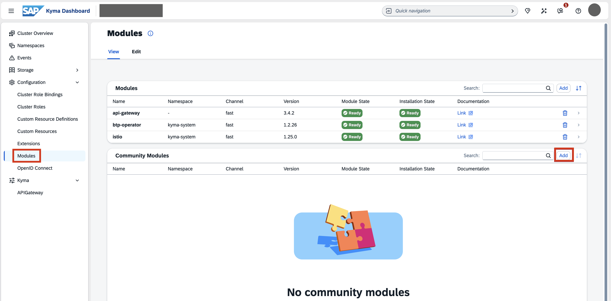
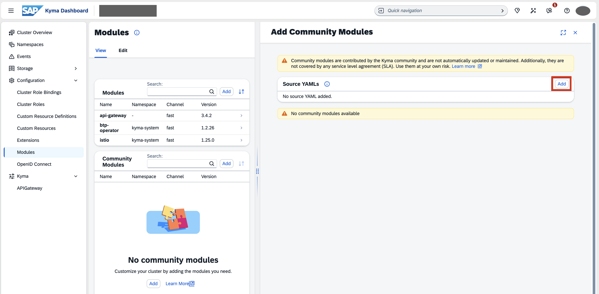
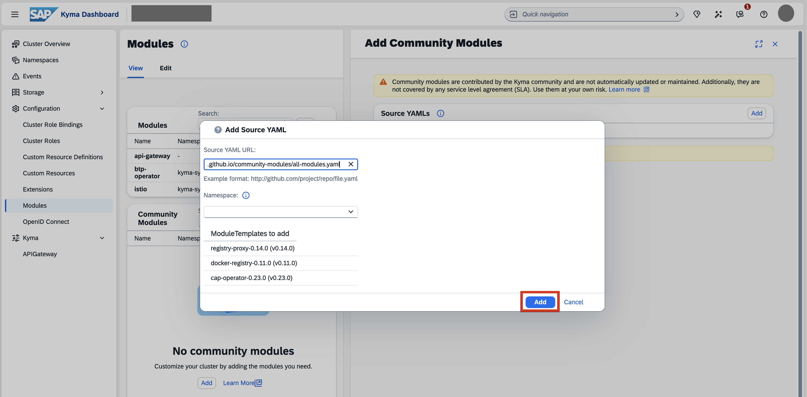
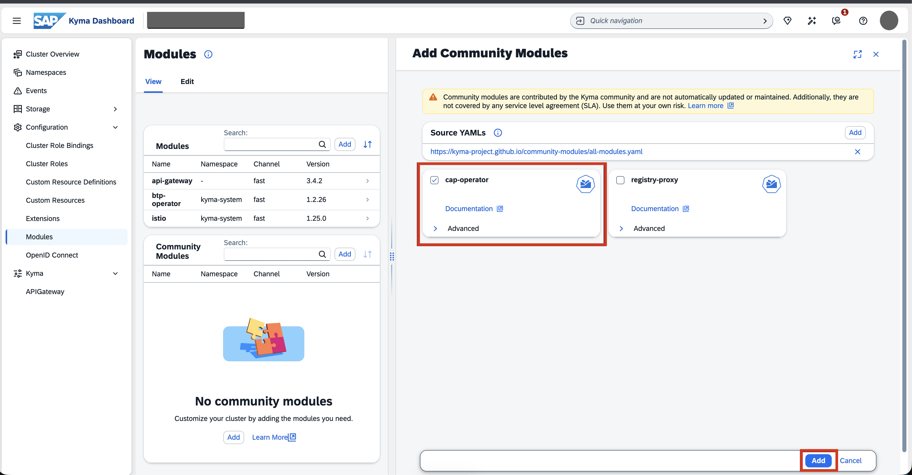
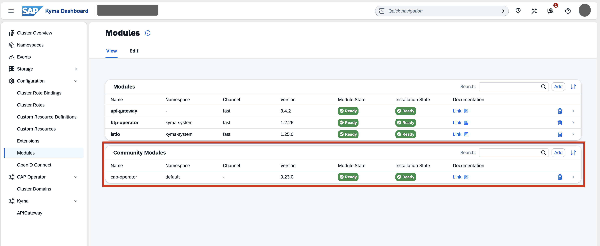

## You will learn

- How to enable the CAP Operator community module in your Kyma cluster.

## Prerequisites

- You've enabled the Kyma runtime in your subaccount. Follow the steps in the [Prepare for Deployment](cap-operator-01-prepare) tutorial that is part of the [Application Lifecycle Management using CAP Operator](<TODO>) tutorial group.
- You have an [enterprise global account](https://help.sap.com/docs/btp/sap-business-technology-platform/getting-global-account#loiod61c2819034b48e68145c45c36acba6e) in SAP BTP. To use services for free, you can sign up for an SAP BTPEA (SAP BTP Enterprise Agreement) or a Pay-As-You-Go for SAP BTP global account and use the free tier services only. See [Using Free Service Plans](https://help.sap.com/docs/btp/sap-business-technology-platform/using-free-service-plans?version=Cloud).
- You have a platform user. See [User and Member Management](https://help.sap.com/docs/btp/sap-business-technology-platform/user-and-member-management).
- You're an administrator of the global account in SAP BTP.
- You have a subaccount in SAP BTP to deploy the services and applications.

### Enable CAP Operator community module

1. Open your Kyma dashboard.

2. Navigate to **Configuration** &rarr; **Modules** and choose **Add** within the **Community Modules** list.

    <!-- border; size:540px --> 

3. Choose **Add** in the **Source YAMLs** section to load the list of community modules.

    <!-- border; size:540px --> 

4. In the popup, you can see the list of available community modules. Choose **Add**.

    <!-- border; size:540px --> 

5. Select the **CAP Operator** module and choose **Add**.

    <!-- border; size:540px --> 

6. Wait until the automatic installation is complete and the **Module State** changes to **Ready**.

    <!-- border; size:540px --> 
