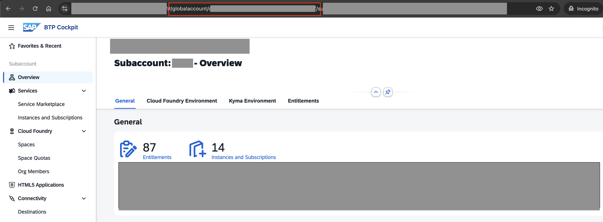
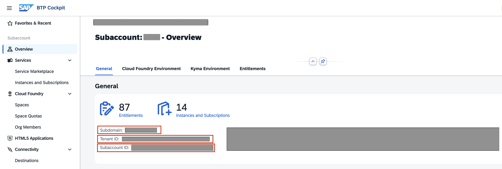
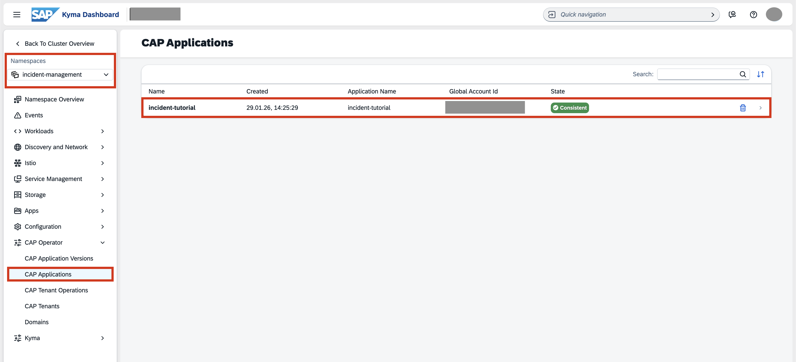

## You will learn

- How to deploy your multi-tenant application in SAP BTP, Kyma runtime using the CAP Operator.

## Prerequisites

- You've configured the respective entitlements, enabled the Kyma runtime in your SAP BTP subaccount, and created an SAP HANA Cloud service instance in the SAP BTP cockpit. Follow the steps in the [Prepare for Deployment](cap-operator-01-prepare) tutorial that is part of the [Application Lifecycle Management using CAP Operator](<TODO>) tutorial group.
- You've installed all the required tools. Follow the steps in the [Install Tools for Deployment](cap-operator-02-tools) tutorial that is part of the [Application Lifecycle Management using CAP Operator](<TODO>) tutorial group.
- You've enabled the CAP Operator community module in your Kyma cluster. Follow the steps in the [Enable CAP Operator Community Module](cap-operator-03-add-cap-operator) tutorial that is part of the [Application Lifecycle Management using CAP Operator](<TODO>) tutorial group.
- You've prepared your multi-tenant application for deployment. Follow the steps in the [Prepare Multi-Tenant Applications for Deployment with CAP Operator](cap-operator-04-prepare-app) tutorial that is part of the [Application Lifecycle Management using CAP Operator](<TODO>) tutorial group.

### Add CAP Operator Helm chart

CAP Operator provides a plugin to generate a Helm chart for your CAP application.

1. Add the [CAP Operator plugin](https://www.npmjs.com/package/@cap-js/cap-operator-plugin/) to your project by running the following command in your project root folder:

    ```bash
    npm add @cap-js/cap-operator-plugin -D
    ```

2. Run the following command to generate a Helm chart for your CAP application:

    ```bash
    npx cds add cap-operator --with-templates
    ```

    As a result, you see a newly created **chart** folder in your project. The **chart** folder holds the Helm configuration, including the **values.yaml** file where you add your container images.

3. Add your container image settings to your **chart/values.yaml** file:

    ```yaml[7,13,19,25]
    ...
    workloads:
        appRouter:
            ...
            deploymentDefinition:
                type: Router
                image: <your-container-registry>/incident-management-approuter:<image-version>
            ...
        server:
            ...
            deploymentDefinition:
                type: CAP
                image: <your-container-registry>/incident-management-srv:<image-version>
            ...
        contentDeploy:
            ...
            jobDefinition:
                type: Content
                image: <your-container-registry>/incident-management-html5-deployer:<image-version>
            ...
        tenantJob:
            ...
            jobDefinition:
                type: TenantOperation
                image: <your-container-registry>/incident-management-mtxs-sidecar:<image-version>
            ...
    ...
    ```

4. Add the `EXIT_PROCESS_AFTER_UPLOAD` environment variable to the content deploy job in your **chart/values.yaml** file to ensure that the HTML5 deployer exits after the upload is complete:

    ```yaml[8,9]
    ...
    contentDeploy:
        ...
        jobDefinition:
            type: Content
            image: <your-container-registry>/incident-management-html5-deployer:<image-version>
            env:
            - name: EXIT_PROCESS_AFTER_UPLOAD
              value: "true"
    ...
    ```

### Deploy CAP Operator Helm chart

1. Run the following command to create a dedicated space for your application and enable the Istio service mesh to handle communication:

    ```bash
    kubectl create namespace incident-management
    kubectl label namespace incident-management istio-injection=enabled
    ```

2. If you are using a private container registry, create a secret in the **incident-management** namespace so the cluster can pull your images. If your images are public, you can skip this step.

    ```bash
    kubectl -n incident-management create secret generic regcred --from-file=.dockerconfigjson=$HOME/.docker/config.json --type=kubernetes.io/dockerconfigjson
    ```

3. Run the following command to get the cluster shoot domain:

    ```bash
    kubectl get gateway -n kyma-system kyma-gateway -o jsonpath='{.spec.servers[0].hosts[0]}' | sed 's/^\*\.//'
    ```

    The result looks like this:
    ```bash
    <xyz123>.kyma.ondemand.com
    ```

    > `<xyz123>` is a placeholder for a string of characters that’s unique for your cluster.

4. Create a new file named **trial-env.yaml** in the project root folder with the following content and replace the placeholder values with your specific information:

    ```yaml
    appName: <your-app-name>
    capOperatorSubdomain: cap-op
    clusterDomain: <cluster-shoot-domain> # Value obtained in the previous step
    globalAccountId: <your-global-account-id>
    providerSubaccountId: <your-provider-subaccount-id>
    providerSubdomain: <your-provider-subdomain>
    tenantId: <your-provider-tenant-id>
    imagePullSecret: regcred # Only include if you performed Step 2
    ```

    > **`appName`**: Choose a name that is unique within your subaccount region. This prevents naming collisions with other deployments.

    > **`capOperatorSubdomain`**: In Kyma clusters, CAP Operator subdomain default value is `cap-op`.

    > **`clusterDomain`**: Use the domain string you retrieved in the previous step.

    > **`globalAccountId`**: You can find this in the URL of your browser when you are viewing your subaccount in the SAP BTP Cockpit.

    > <!-- border; size:540px --> 

    > **`providerSubaccountId`**, **`providerSubdomain`** and **`providerTenantId`**: In the SAP BTP cockpit, go to your subaccount **Overview** and check the **General** section. You can find all three values there.

    > <!-- border; size:540px --> 

    > **`imagePullSecret`**: Only include this line if you are using a private registry. If you followed Step 2, set this to `regcred`.

4. To prepare your deployment, run the following command in your project root to generate the **runtime-values.yaml** file inside your **chart** folder:

    ```bash
    npx cap-op-plugin generate-runtime-values --with-input-yaml trial-env.yaml
    ```

    > This command maps your environment settings to the application's configuration. It creates a **runtime-values.yaml** file that Helm uses during deployment to override the default settings in the **values.yaml** file with your specific cluster and account details.

5. Make sure that your SAP HANA Cloud instance is running. Free tier HANA instances are stopped overnight.

    > Your SAP HANA Cloud service instance automatically stops overnight, according to the time zone of the region where the server is located. This means you need to restart your instance every day before you start working with it. You can restart your instance using the SAP BTP cockpit.

6. Deploy using the Helm command:

    ```bash
    helm upgrade --install incident-management --namespace incident-management ./chart \
    --set-file serviceInstances.xsuaa.jsonParameters=xs-security.json -f ./chart/runtime-values.yaml
    ```

    This command installs the Helm chart from the chart folder with the release name **incident-management** in the **incident-management** namespace.

    > With the **helm upgrade --install** command, you can install a new chart as well as upgrade an existing chart.

7. To check the status of your deployment:

    1. Open your Kyma dashboard.
    2. Choose **Namespaces** on the left and choose **incident-management**.
    3. Navigate to **CAP Operator** &rarr; **CAP Application**.
    4. You can see the status of your deployed application here. When the status is **Consistent**, your application is successfully deployed.

    <!-- border; size:540px --> 

    > In the example deployment, the unique **appName** is **incident-tutorial**.
