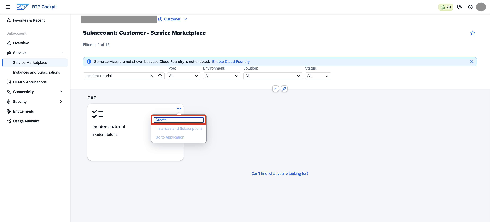
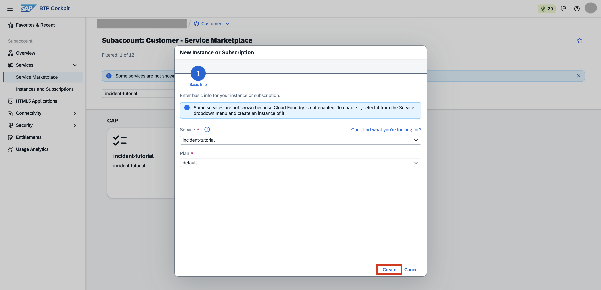
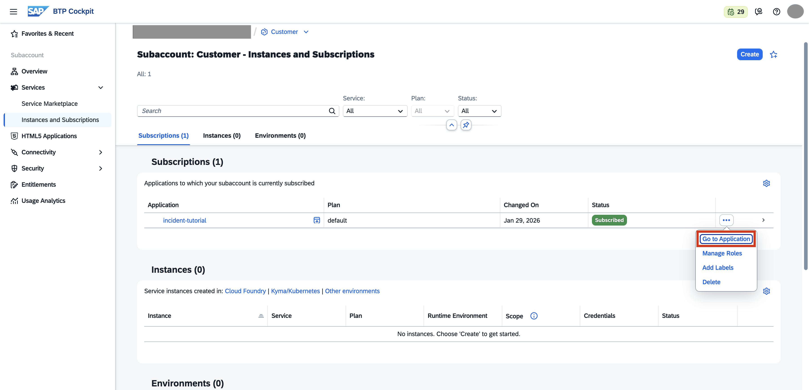

## You will learn

- How to subscribe to a multi-tenant application from a consumer subaccount using the CAP Operator.

## Prerequisites

- You've deployed the application. Follow the steps in the [Deploy your Application using CAP Operator](cap-operator-05-deploy-app) tutorial that is part of the [Application Lifecycle Management using CAP Operator](<TODO>) tutorial group.
- You're an administrator of the global account in SAP BTP.

### Create new subaccount

Create a new subaccount in the same global account where you have deployed the multi-tenant CAP application in the previous tutorial, for example, `Customer`. You can find the steps to create a new subaccount in the [Create Subaccounts](https://help.sap.com/docs/btp/sap-business-technology-platform/create-subaccount) documentation.

### Subscribe to the multi-tenant application

1. Navigate to your subaccount and choose **Services** &rarr; **Service Marketplace** on the left.

2. Type your application name in the search box and choose **Create**.

    <!-- border; size:540px --> 

    > When you enter your application name, ensure it matches the one you used in the previous tutorial. For instance, if you used **incident-tutorial** earlier, use that same name here.

3. In the **New Instance or Subscription** popup, choose **Create**.

    <!-- border; size:540px --> 

    > This subscribes your subaccount to the multi-tenant application deployed in the provider subaccount.

4. In the **Creation in Progress** popup, choose **View Subscription**.

5. Wait until the subscription status changes to **Subscribed** and choose **Go to Application**.

    <!-- border; size:540px --> 

    > You've successfully subscribed to the multi-tenant application from your consumer subaccount.
