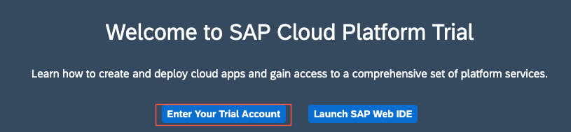
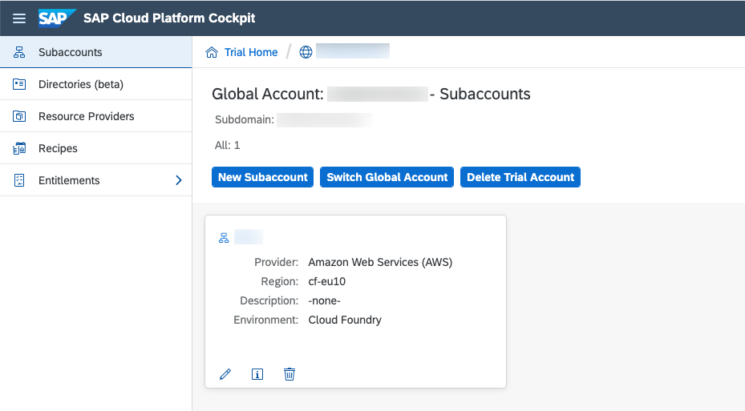
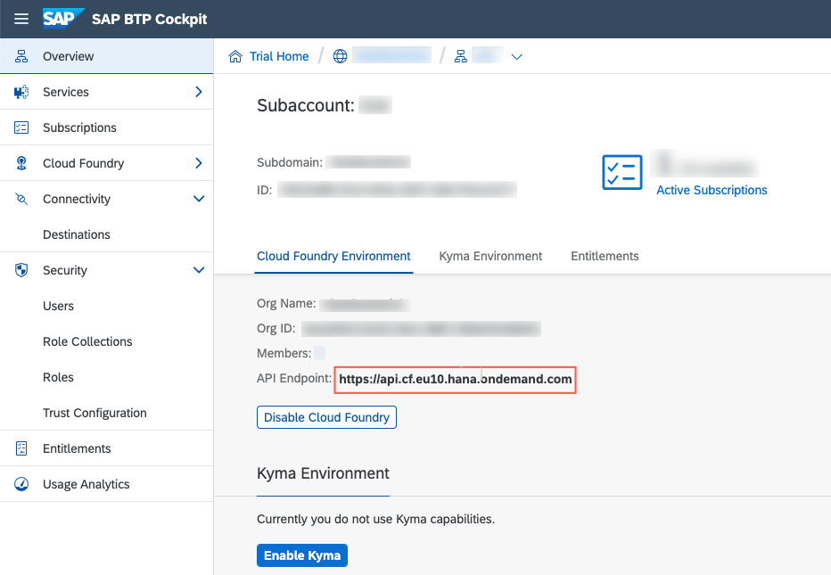
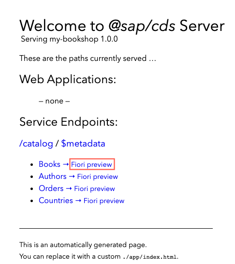

## Prerequisites
- You have finished the tutorial [Create a Business Service with Node.js using Visual Studio Code](cp-apm-nodejs-create-service).  
- If you don't have a Cloud Foundry Trial subaccount and dev space on [SAP BTP Cockpit](https://cockpit.hanatrial.ondemand.com/cockpit/) yet, create your [Cloud Foundry Trial Account](hcp-create-trial-account) with **Europe (Frankfurt) or US East (VA) as region** and, if necessary [Manage Entitlements](cp-trial-entitlements).
- You have downloaded and installed the [cf command line client](https://github.com/cloudfoundry/cli#downloads) for Cloud Foundry as described in the tutorial [Install the Cloud Foundry Command Line Interface (CLI)](cp-cf-download-cli).
- You have to [Set Up the SAP HANA Cloud Service](btp-app-hana-cloud-setup) or use an existing SAP HANA Cloud instance to deploy your application

## Details
### You will learn  
  - How to deploy your business service on SAP Business Technology Platform (SAP BTP) using the SAP Cloud Application Programming Model (CAP) and binding appropriate service instances. See the [Developer Guide for Cloud Foundry](https://docs.cloudfoundry.org/devguide/) for more details.

---

[ACCORDION-BEGIN [Step 1: ](Enhance project configuration for SAP HANA)]

It's now time to switch to SAP HANA as a database. To continue with this tutorial you need to [Set Up the SAP HANA Cloud Service](https://developers.sap.com/tutorials/btp-app-hana-cloud-setup.html#875f00a8-91f8-454b-9d09-2ad87189b10b) or [Use an Existing SAP HANA Cloud Service Instance](https://developers.sap.com/tutorials/btp-app-hana-cloud-setup.html#553c295a-5b64-45dc-a6c4-21522736512c) to deploy your application.

> ### Your SAP HANA Cloud instance will be automatically stopped overnight, according to the server region time zone. That means you need to restart your instance every day, before you start working with your trial.

1. If `cds watch` is still running in VS Code, choose **CTRL+C** in the command line to stop the service.

2. To prepare the project, execute in the root level of your project in VS Code:

    ```Shell/Bash
    cds add hana
    ```

    > This configures deployment for SAP HANA to use the `hdbtable` and `hdbview` formats. The previous command added the `@sap/hana-client` driver for SAP HANA as a dependency in `package.json`. Note that in the future, this might change to `hdb`, which is a leaner driver. See section [SAP Support for `hdb` and `@sap/hana-client`](https://www.npmjs.com/package/hdb#sap-support-for-hdb-and-saphana-client) for a feature comparison.

    > A data source of type `sql` is added in the `cds.requires.db` block. See section [Node.js configuration](https://cap.cloud.sap/docs/node.js/cds-env#profiles) in the CAP documentation for more details.

3. (Optional) To enable SAP Fiori preview add the following configuration in the `package.json` of your `my-bookshop` project in VS Code:

    ```JSON
    "cds": {
      "features": {
        "fiori_preview": true
      },
    }
    ```

    > `fiori_preview:true` enables SAP Fiori preview also in `production` mode as you saw it in your local application in the previous tutorial in step 4 when using `cds watch`. This feature is meant to help you during development and should not be used in productive applications.

    > Don't edit the `gen/db/package.json` file.

[DONE]

[ACCORDION-END]


[ACCORDION-BEGIN [Step 2: ](Identify SAP BTP Cloud Foundry endpoint)]

The Cloud Foundry API endpoint is required so that you can log on to your SAP BTP Cloud Foundry space through Cloud Foundry CLI.

1. Go to the [SAP BTP Trial Cockpit](https://cockpit.hanatrial.ondemand.com/cockpit#/home/trial) and choose **Enter Your Trial Account**.

    !

2. From the **Subaccounts** overview navigate to your subaccount.

    !

3. From your subaccount copy the **Cloud Foundry API Endpoint** value.

    !

4. Go back to Visual Studio Code to the command line. Authenticate with your login credentials using the following command:

    ```Shell/Bash
    cf login
    ```


    > This will ask you to select Cloud Foundry API, org, and space.

    > The API Endpoint is taken by default. If you want to change the API Endpoint use `cf api <CF_API_ENDPOINT>` to change the API. Replace `<CF_API_ENDPOINT>` with the actual value you obtained in the previous step.

    > If you don't know whether you're logged on to Cloud Foundry or if you're wondering to which Cloud Foundry org and space are you logged on, you can always use `cf target` in a terminal to find out.

[DONE]
[ACCORDION-END]

[ACCORDION-BEGIN [Step 3: ](Deploy using cf push)]

SAP BTP, Cloud Foundry environment has a built-in [cf push](https://docs.cloudfoundry.org/devguide/push.html) command to deploy applications. It needs the application files plus an optional `manifest.yml` file to push the application code and to bind the relevant services to the application.

[OPTION BEGIN [Windows]]

1. As `cf push` can only bind but not create services, you need to create the SAP HANA service manually (along with an HDI container and a database schema). In the command line add:

    ```Shell/Bash
    cf create-service hana hdi-shared my-bookshop-db
    ```

    > This process takes some minutes.

    > Check the status of your service using `cf service my-bookshop-db`.

    > If service creation fails, see the [Troubleshooting guide](https://cap.cloud.sap/docs/advanced/troubleshooting#hana) in the CAP documentation for more details.

2. Now, build and deploy both the database part and the actual application and add:

    ```Shell/Bash
    cds build --production
    cf push -f gen/db
    cf push -f gen/srv --random-route
    ```

    > This process takes some minutes.

    > The first part of the command creates the SAP HANA table and view definitions along with `manifest.yaml` files in both in `gen/db` and `gen/srv` folders. Look at `gen/db/manifest.yaml` and see that it binds to the `my-bookshop-db` service that you've created in the previous step.


3. In the deploy log, find the application URL in the `routes` line at the end:

    ```Shell/Bash
    name:              my-bookshop-srv
    requested state:   started
    routes:            my-bookshop-srv-....cfapps.....hana.ondemand.com
    ```

4. Open this URL in the browser and try out the provided links, for example, `.../catalog/Books`. Application data is fetched from SAP HANA. If enabled in step 1.3 you can also try the **Fiori preview**.

    !

[OPTION END]

[OPTION BEGIN [MacOS and Linux]]

1. As `cf push` can only bind but not create services, you need to create the SAP HANA service manually (along with an HDI container and a database schema). In the command line add:

    ```Shell/Bash
    cf create-service hana hdi-shared my-bookshop-db
    ```

    > This process takes some minutes.

    > Check the status of your service using `cf service my-bookshop-db`.

    > If service creation fails, see the [Troubleshooting guide](https://cap.cloud.sap/docs/advanced/troubleshooting#hana) in the CAP documentation for more details.

2. Now, build and deploy both the database part and the actual application and add:

    ```Shell/Bash
    cds build --production && cf push -f gen/db && cf push -f gen/srv --random-route
    ```

    > This process takes some minutes.

    > The first part of the command creates the SAP HANA table and view definitions along with `manifest.yaml` files in both in `gen/db` and `gen/srv` folders. Look at `gen/db/manifest.yaml` and see that it binds to the `my-bookshop-db` service that you've created in the previous step.

3. In the deploy log, find the application URL in the `routes` line at the end:

    ```Shell/Bash
    name:              my-bookshop-srv
    requested state:   started
    routes:            my-bookshop-srv-....cfapps.....hana.ondemand.com
    ```

4. Open this URL in your browser and try out the provided links, for example, `.../catalog/Books`. Application data is fetched from SAP HANA. If enabled in step 1.3 you can also try the **Fiori preview**.

    !

[OPTION END]

[VALIDATE_1]

[ACCORDION-END]

<p style="text-align: center;">Give us 55 seconds of your time to help us improve</p>

<p style="text-align: center;"><a href="https://sapinsights.eu.qualtrics.com/jfe/form/SV_0im30RgTkbEEHMV?TutorialID=cap-service-deploy" target="_blank"></a></p>
