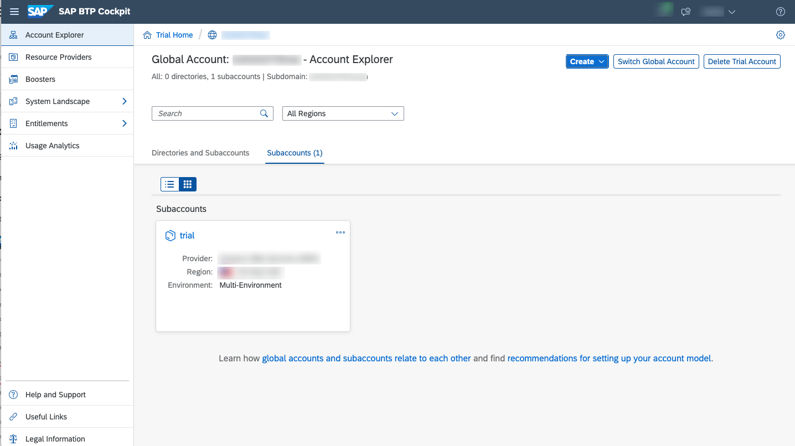

## Prerequisites
- You've finished the tutorial [Create a Business Service with Node.js using Visual Studio Code](cp-apm-nodejs-create-service).  
- If you don't have a Cloud Foundry Trial Subaccount on [SAP Cloud Platform](https://cockpit.hanatrial.ondemand.com/cockpit/) yet, create your [Cloud Foundry Trial Account](hcp-create-trial-account).
- You've downloaded and installed the [cf command line client](https://github.com/cloudfoundry/cli#downloads) for Cloud Foundry as described in the tutorial [Install the Cloud Foundry Command Line Interface (CLI)](cp-cf-download-cli).

## Details
### You will learn  
  - How to deploy your business service on SAP Cloud Platform using the SAP Cloud Application Programming Model (CAP) and binding appropriate service instances (see the [Developer Guide for Cloud Foundry](https://docs.cloudfoundry.org/devguide/)).

---

[ACCORDION-BEGIN [Step 1: ](Enhance project configuration for SAP HANA)]

It's now time to switch to SAP HANA as a database.

1. Add the following configuration in the **`package.json`** file of your `my-bookshop` project (overwrite any existing `cds` configuration):

    ```JSON
    "cds": {
        "requires": {
          "db": {
            "kind": "hana"
          }
        }
      }
    ```

2. Add the SAP HANA driver as a dependency to your project:

    ```Shell/Bash
    npm add hana
    ```

[DONE]

[ACCORDION-END]

[ACCORDION-BEGIN [Step 2: ](Identify SAP Cloud Platform Cloud Foundry endpoint)]

The Cloud Foundry API endpoint is required so that you can log on to your SAP Cloud Platform Cloud Foundry space through Cloud Foundry CLI.

1. Go to the [SAP Cloud Platform Trial Cockpit](https://cockpit.hanatrial.ondemand.com/cockpit#/home/trial) and choose **Enter Your Trial Account**.

    !

2. Navigate to your Subaccount:

    !

3. Copy the **Cloud Foundry API Endpoint** value:

    !

4. Authenticate using your login credentials using the following command in the terminal:

```Shell/Bash
cf login
```
> This will ask you to select CF API, org, and space.

[DONE]
[ACCORDION-END]

[ACCORDION-BEGIN [Step 3: ](Deploy using cf push)]

Cloud Foundry environment of SAP Cloud Platform has a built-in [cf push](https://docs.cloudfoundry.org/devguide/push.html) command to deploy applications. It needs the application files plus an optional **`manifest.yml`** file to push the application code and to bind the relevant services to the application.

[OPTION BEGIN [Windows]]

1. As `cf push` can only bind but not create services, you need to create the SAP HANA service manually (along with an HDI container and a database schema):

    ```Shell/Bash
    cf create-service hanatrial hdi-shared my-bookshop-db-hdi-container
    ```

    >This process takes some minutes.

    >Check the status of your service using `cf service my-bookshop-db-hdi-container`.

    >If service creation fails, see the [Troubleshooting guide](https://cap.cloud.sap/docs/advanced/troubleshooting#hana) for CAP.

2. Now, build and deploy both the database part and the actual application:

    ```Shell/Bash
    cds build
    cf push -f gen/db
    cf push -f gen/srv --random-route
    ```

    >This process takes some minutes.

    >The first command creates the SAP HANA table and view definitions along with `manifest.yaml` files in both in `gen/db` and `gen/srv` folders. Look at `gen/db/manifest.yaml` and see that it binds to the `my-bookshop-db-hdi-container` service that you've created in the previous step.

4. In the deploy log, find the application URL in the `routes` line at the end:

    ```
    name:              my-bookshop-srv
    requested state:   started
    routes:            my-bookshop-srv-....cfapps.sap.hana.ondemand.com
    ```

5. Open this URL in the browser and try out the provided links, for example, `.../catalog/Books`. Application data is fetched from SAP HANA.

[OPTION END]

[OPTION BEGIN [Mac and Linux]]

1. As `cf push` can only bind but not create services, you need to create the SAP HANA service manually (along with an HDI container and a database schema):

    ```Shell/Bash
    cf create-service hanatrial hdi-shared my-bookshop-db-hdi-container
    ```

    >This process takes some minutes.

    >Check the status of your service using `cf service my-bookshop-db-hdi-container`.

    >If service creation fails, see the [Troubleshooting guide](https://cap.cloud.sap/docs/advanced/troubleshooting#hana) for CAP.

2. Now, build and deploy both the database part and the actual application:

    ```Shell/Bash
    cds build && cf push -f gen/db && cf push -f gen/srv --random-route
    ```

    >This process takes some minutes.

    >The first part of the command creates the SAP HANA table and view definitions along with `manifest.yaml` files in both in `gen/db` and `gen/srv` folders. Look at `gen/db/manifest.yaml` and see that it binds to the `my-bookshop-db-hdi-container` service that you've created in step 2.

3. In the deploy log, find the application URL in the `routes` line at the very end:

        ```
        name:              my-bookshop-srv
        requested state:   started
        routes:            my-bookshop-srv-....cfapps.sap.hana.ondemand.com
        ```

4. Open this URL in the browser and try out the provided links, for example, `.../browse/catalog/Books`. Application data is fetched from SAP HANA.

[OPTION END]

[VALIDATE_1]

[ACCORDION-END]

<p style="text-align: center;">Give us 55 seconds of your time to help us improve</p>

<p style="text-align: center;"><a href="https://s.userzoom.com/m/MiBDODgzUzQxNiAg" target="_blank"></a></p>
