# Create simple CAP Service with Node.js using the SAP Business Application Studio
<!-- description --> Use SAP Business Application Studio to develop a basic CAP Node.js service for Cloud Foundry. You will use only simple JavaScript functions (no database) and learn some basics from the SAP Cloud Application Programming Models (CAP).

## You will learn
  - How to create a Dev Space in SAP Business Application Studio
  - How to create a Project using the CAP Project template
  - How to develop a sample service using CAP and Node.js
  - How to run your service locally

## Prerequisites
  - [Get an Account on SAP BTP to Try Out Free Tier Service Plans](btp-free-tier-account) 
  - You are subscribed to [SAP Business Application Studio](appstudio-onboarding)
  - The following prerequisites are optional, on trial accounts the space and role should have been created by default
  - Under Cloud Foundry **Create a Space** if you don't have one already
    <!-- border -->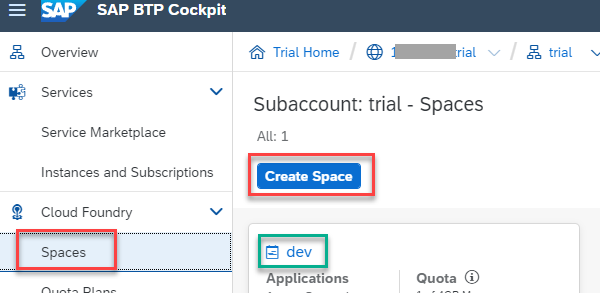
  - Make sure your user has a **Space Developer** Role
    <!-- border -->


## Overview
Find more information on SAP Cloud Application Programming Model [Welcome to CAP](https://cap.cloud.sap/docs/).

In this tutorial group you will learn all the steps to finally consume a CAP Service in a process of SAP Build Process Automation.

<!-- border -->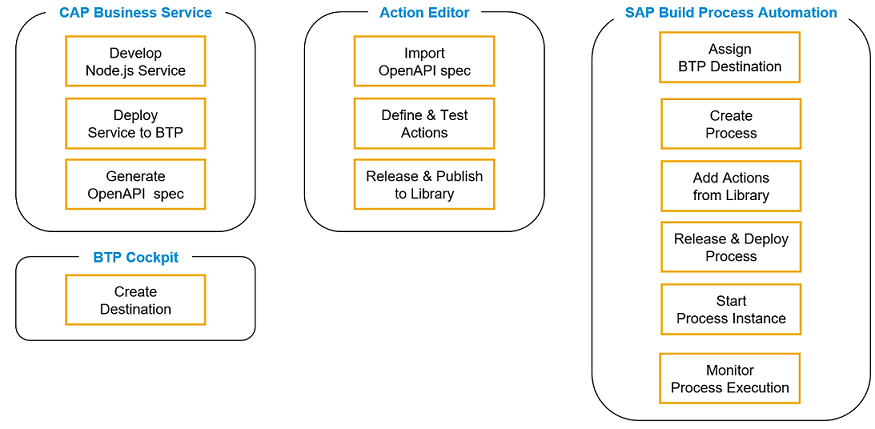

## The Use Case
In this series of tutorials, You will implement a CAP Service with very easy functions like converting a String to a number, converting a list of ids to a comma separated String and finally consume the CAP Service API functions in SAP Build Process Automation Process.


---
### Create your preconfigured dev space

1. Open **SAP Business Application Studio**.

2. Choose **Create Dev Space**.

    <!-- border -->

3. Use name **`demo`** for your dev space and select kind **`Full-Stack Cloud Application Using Productivity Tools`**. 

    <!-- border -->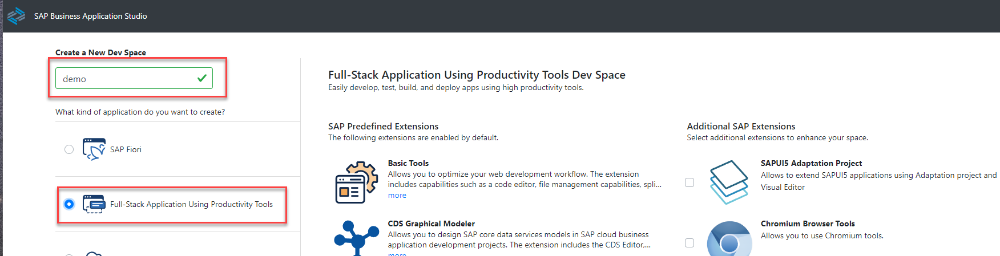

    >By selecting **Full-Stack Cloud Application Using Productivity Tools**, your dev space comes with several extensions out-of-the-box that you need to develop CAP services.

4.  Choose **Create Dev Space**.

    <!-- border -->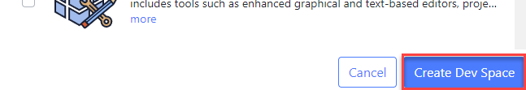

    >The creation of the dev space takes a while. You see that the status for your dev space will change from **STARTING** to **RUNNING**.

6. Once the dev space is running, click the dev space name to open it.

    <!-- border -->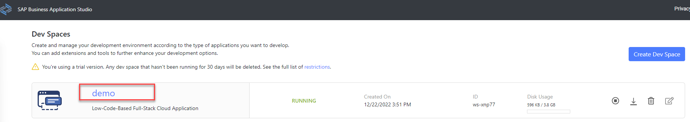

    >Opening the dev space and starting the Application Studio takes a while. 


### Create a Project

1. We will not create a project using the wizard, choose **Cancel**.

    <!-- border -->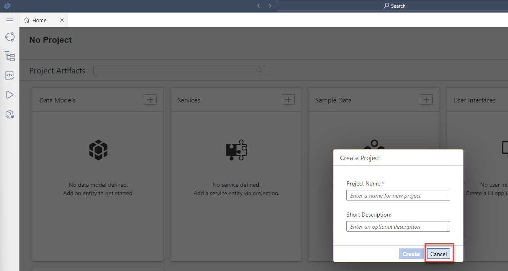

2. Close the **Home** tab, choose **X**.

    <!-- border -->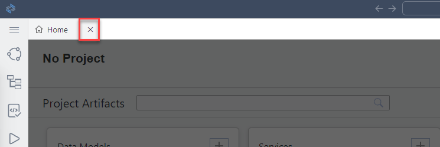

3. Use the **File** menu to create a **New Project from Template**.

    <!-- border -->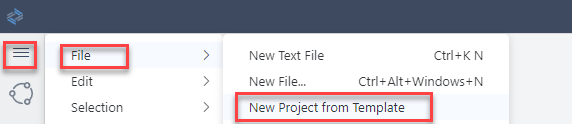

4. Choose **CAP Project** from the templates and choose **Start**.

    <!-- border -->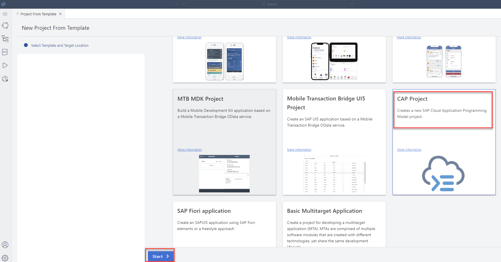

5. Enter the **CAP Project Details**, use name **`sap-build-cap-sample-library`**, select **`MTA based...`**  and choose **Finish**.

    >Runtime **Node.js** is already selected.

    <!-- border -->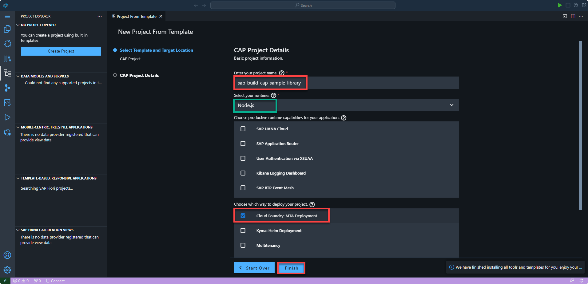

6. Close the **Home** and **Guided Development** tabs, we are not using them. 

    <!-- border -->


7. Change the view from **Project Explorer** to **Explorer**, choose **View** > **Explorer**.

    <!-- border -->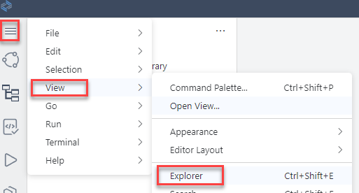

    >The Explorer view will show all files of your project. 


### Build your CAP Service

1. In the Explorer view you will find the file `mta.yaml` in the root folder of your project `sap-build-cap-sample-library`.

    <!-- border -->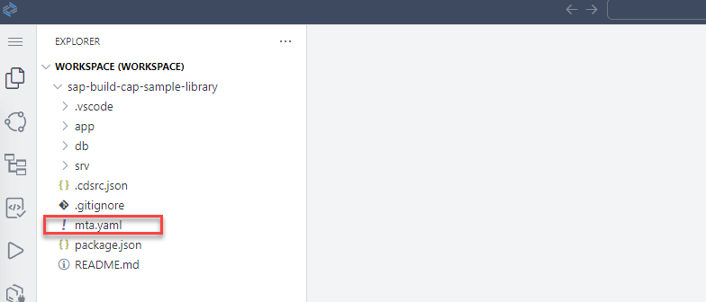


2. Check the file in a text editor, **right-click** > **Open With...** > **Text Editor default**.

    <!-- border -->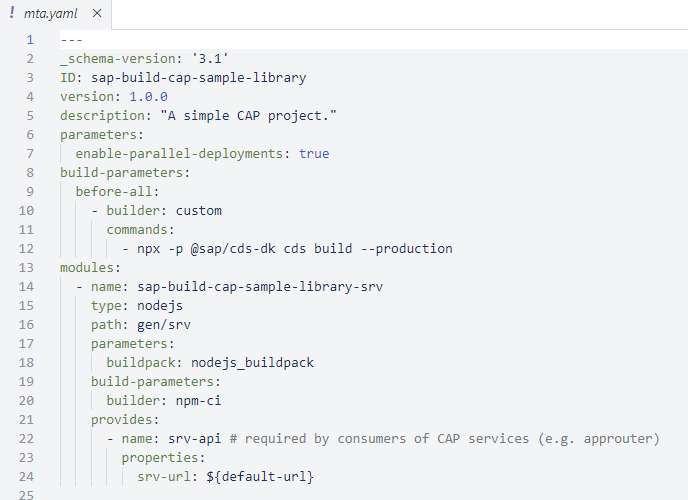

3. In the **`srv`** folder, create a new file called **`service.cds`**.
   
4. In the same folder, create another new file called **`service.js`**.

5. Select the file **`service.cds`** and copy the following code into the editor.

    >Contains the definition of data types and function headers. Functions and actions will make the API of your service.

    >Simple functions like converting a String to an Integer, a list to a CSV String or getting the list of Todos.

    ```CDS
    @Capabilities.BatchSupported : false

    service sap_build_cap_sample_library @(path : '/api/v1') {
    
    define type DataString {
        value : String;
    }

    define type DataInteger {
        value : Integer;
    }
    
    define type DataNumber {
        value : Double;
    }

    define type DataList {
        id : Integer;
        title: String;
        userId: Integer;
        completed: Boolean;
    }

    define type DataListArray {
        responseArray : array of DataList;
    }

    @Core.Description : 'toInteger'
    function toInteger(value : String) returns DataInteger;

    @Core.Description : 'toNumber'
    function toNumber(value : String) returns DataNumber;

    @Core.Description : 'toString'
    function toStr(value : Double) returns DataString;

    @Core.Description : 'addQuotes'
    function addQuotes(value : String) returns DataString;

    @Core.Description : 'listToString'
    action listToString(responseArray : array of DataList, field : String) returns DataString;

    @Core.Description : 'get list of dodos'
    function getListOfTodos() returns DataListArray;

    }
    ```

6. Select the file **`service.js`** and copy the following code into the editor.

    >The JavaScript implementation for the API of your service.

    ```JavaScript
    module.exports = srv => {

        srv.on('toInteger', req => {
            const {value} = req.data;

            return { 'value' : parseInt(value) };
        });

        srv.on('toNumber', req => {
            const {value} = req.data;

            return { 'value' : parseFloat(value) };
        });

        srv.on('toStr', req => {
            const {value} = req.data;

            return { 'value' : value.toString() };
        });

        srv.on('addQuotes', req => {
            const {value} = req.data;

            return { 'value' : "'" + value + "'"};
        });
        
        srv.on('listToString', req => {

            var values = req.data.responseArray;
            var resultList = [];
            var field = req.data.field;
            if (values) {
                for (var i = 0; i < values.length; i++) {
                    resultList.push(values[i][field]);
                }
            }

            return { value : resultList.toString() };
        });

        srv.on('getListOfTodos', req => {
            return { responseArray : [            {
                "id": 1,
                "completed": false,
                "title": "delectus aut autem",
                "userId": 1
            },
            {
                "id": 2,
                "completed": false,
                "title": "quis ut nam facilis et officia qui",
                "userId": 1
            }] }; 
        });

    }
    ```

### Test CAP service locally

This step describes how to test the service locally using a file that contains the Service Endpoints.

1. On the **`sap-build-cap-sample-library`** folder, create a new file called **`test.http`**.

2. Select the file **`test.http`** and copy the following content into the editor.

    >Samples for HTTP requests for the services of your API.

    ```HTTP
    ### call toInteger
    GET http://localhost:4004/api/v1/toInteger(value='20')

    ### call toNumber
    GET http://localhost:4004/api/v1/toNumber(value='20.2')

    ### call toString
    GET http://localhost:4004/api/v1/toStr(value=20.2)

    ### call addQoutes
    GET http://localhost:4004/api/v1/addQuotes(value='abcd')

    ### call getListOfTodods
    GET http://localhost:4004/api/v1/getListOfTodos()

    ### call listToString
    POST http://localhost:4004/api/v1/listToString
    Content-Type: application/json

    {
        "field" : "id",
        "responseArray": [
            {
                "id": 1,
                "title": "delectus aut autem",
                "userId": 1,
                "completed": false
            },
            {
                "id": 2,
                "title": "quis ut nam facilis et officia qui",
                "userId": 1,
                "completed": false
            }
        ]
    }     
    ```
 
4. From the **Terminal** menu, select **New Terminal**.

    <!-- border -->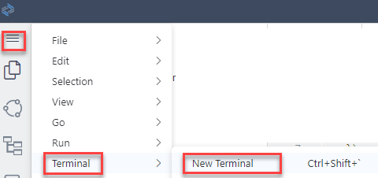

5. On the **`sap-build-cap-sample-library`** folder, run the following command in the **Terminal** window:

    >This will start a local server with your service that will allow you to test your API calls.
   
    ```Shell / Bash
    cds watch
    ```

6. Choose **Send Request**, you will get the response in a separate window.

    <!-- border -->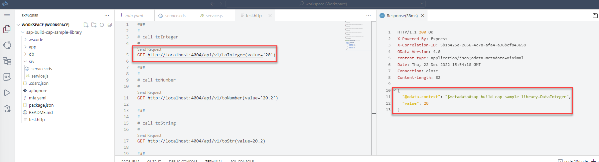

7. Choose **Ctrl - C** to terminate the Server session.


### Deploy your Service to Cloud Foundry

We will use a script to build and deploy the service.

1. On the **`sap-build-cap-sample-library`** folder, create a new file called **`script.sh`**.

2. Select the file **`script.sh`** and copy the following content into the editor.

    ```Shell / Bash
    # set API endpoint and login to Cloud Foundry
    cf api https://api.cf.us10-001.hana.ondemand.com
    cf login
    # some needed npm settings
    npm update --package-lock-only
    npm set registry=https://registry.npmjs.org/
    # build the service locally
    mbt build -t gen --mtar mta.tar
    # deploy the service to the BTP space
    cf deploy gen/mta.tar
    # generate the openAPI spec for the service, used to create the Action project
    cds compile srv --service all -o docs --to openapi
    ```

4. Check your API endpoint definition.

    Check in BTP Cockpit, if the API Endpoint of your Cloud Foundry environment is matching the information you used for the script https://api.cf.us10-001.hana.ondemand.com

    <!-- border -->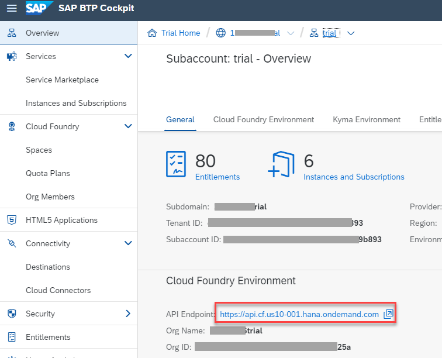


5. Run the following command in the **Terminal** window:

    ```Shell / Bash
    bash script.sh
    ```

6. During script execution, when asked for:

       - your login information, enter **Email** and **Password**

       - your space, on trial **dev** is created as default Cloud Foundry space

    <!-- border -->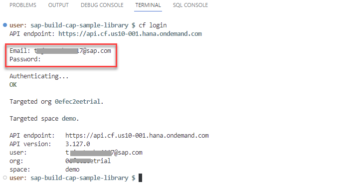


>Once the tasks are completed, your service should be available and running in your Cloud Foundry space. Also a file with the **openAPI** specification is created. This file will be used in a next tutorial.

>In the **BTP Cockpit** you can check if the service is running:

><!-- border -->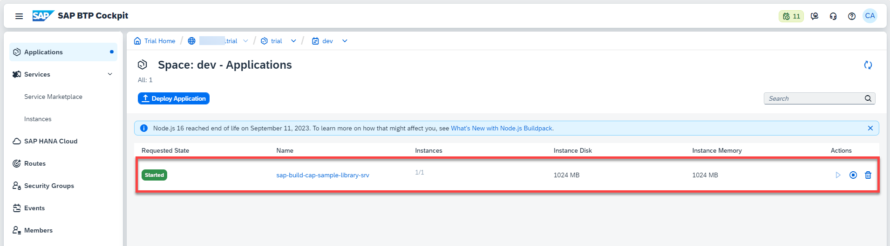<div>&nbsp;</div>

