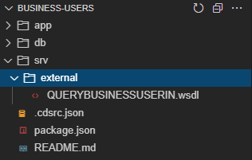

## Prerequisites
 - Get an **SAP Business Technology Platform** trial account following **[this tutorial](hcp-create-trial-account)**
 - Setup **SAP Business Application Studio** in your trial account following **[this tutorial](appstudio-onboarding)**
 - Have access to an **SAP S/4HANA Cloud tenant** with a **communication user** with access to **communication scenario** `SAP_COM_0193` or `SAP_COM_0093`, via some **communication arrangement** (unfortunately S/4HANA Cloud trial tenants **do not** provide it, so make sure you're granted such access by other means)

## Details
### You will learn
  - Understand the **business problem**
  - Understand the **application architecture**
  - How to **get prepared for development**
  - How to **get the web service definition** (WSDL)
  - How to **create the web service reference**
  - How to use the **destination and XSUAA** services to point to the service host
  - How to use  **additional node modules** to create the **SOAP client** and perform the web service calls
  - How to develop a **reusable module** to **create SOAP clients**
  - How to develop the **CAP service code** to **achieve the application's objective**

> **IMPORTANT NOTE**: this tutorial is intended for developers who have previous experience in developing CAP applications which consume either OData or REST APIs using SAP Business Application Studio and SAP BTP destinations, as well as handling communication scenarios and communication arrangements in S/4HANA Cloud.

---

[ACCORDION-BEGIN [Step 1: ](Unserstand the business problem)]

You may have realized that most modern cloud applications are built to interact with other external solutions via OData and/or REST APIs (and you may have already done it yourself in several opportunities). But, there are some solutions that still do not offer 100% of services as OData or REST, providing some interfaces via SOAP web services – this is the case, for example, of S/4HANA Cloud which exposes a variety of OData services but, for same cases, still sticks with SOAP web services.

If you started programming in the last 5 years, you might not even know what I'm talking about – or if you know, it's the fault of some legacy system you have to deal with.

SOAP, or Simple Object Access Protocol (not to be confused with SOA), is a protocol for creating distributed and decentralized web services – the famous web services – which allow the exchange of information between systems, using the XML format. The latest version is from 2007 (1.2) and was the most popular way of connecting systems in the first decade of the 2000s, before the emergence of the REST protocol that encouraged web APIs with JSON and, later, microservices – lighter ways to exchange information between systems over the web.

As previously mentioned almost all the latest web and mobile technologies offer native (or close to) support for handling REST Web APIs, but little is said about SOAP connections. The purpose of this tutorial is precisely to help those who need to deal with Node.js CAP applications on the client and SOAP on the server.

[DONE]
[ACCORDION-END]

[ACCORDION-BEGIN [Step 2: ](Understand the application architecture)]

You are going to build a simple CAP application that reads **Business Users** from **S/4HANA Cloud** (which are exposed exclusively via a SOAP web service).

You can view the application architecture bellow:


[DONE]
[ACCORDION-END]

[ACCORDION-BEGIN [Step 3: ](Get prepared for development)]

Before you move forward with the instructions, first get prepared for development by completing the following two basic steps:

1. Set up a destination to your S/4HANA Cloud system using a **communication user** (NOT a **business user**). You can name your destination **S4HC** just to be compatible with the further instructions in the tutorial. If you have trouble creating your destination just follow [**this tutorial**](abap-extensibility-cbo-rules-create-destination) on SAP Developers.
2. Jump start a new CAP project in **SAP Business Application Studio**: after opening your dev space, open a new terminal window, move to the "**projects**" directory and initialize a new **blank project** with `cds init business-users`. Open the newly created project in a workspace to get ready for development.

[DONE]
[ACCORDION-END]

[ACCORDION-BEGIN [Step 4: ](Download the web service definition)]

The first thing you need to do is to get the web service definition which is described in **WSDL** (Web Services Description Language).

WSDL is an XML notation for describing a web service. A WSDL definition tells a client how to compose a web service request and describes the interface that is provided by the web service provider.

You can get such definition from **SAP API Business Hub**, so access `https://api.sap.com`.

In the home page, first make sure to (1) **login to API Business Hub**.

> **NOTE**: you must login for the download process to work properly.

Then, after login, (2) click on the **S/4HANA Cloud tile**.


In the next page, (1) click on the **APIs tab**, then, (2) in the **find box**, type "**business user read**" and press enter. Finally, (3) click on the **Business User – Read tile**.


In the next page, click on **API Specification**.

> **NOTE**: make sure your **communication user** (set up in your destination) has access to **communication scenario** `SAP_COM_0193` or `SAP_COM_0093`, via some **communication arrangement**, as indicated below:


Click on the **down arrow** next to **WSDL** and save the `QUERYBUSINESSUSERIN.wsdl` file in your local computer.


Now, go to your CAP project in Business Application Studio and create a folder named "**external**" under the `srv` folder, then drag & drop the recently downloaded `QUERYBUSINESSUSERIN.wsdl` file into it like demonstrated below:



This definition will be used later upon creation of the web service client.

[DONE]
[ACCORDION-END]

[ACCORDION-BEGIN [Step 5: ](Create the reference to the web service host)]

The next step is to reference the web service in the project's `package,json` file. So, open it up and insert the following code snippet right **before the last curly bracket**:

```JSON
,
  "cds": {
    "requires": {
      "UserRead": {
        "kind": "SOAP",
        "credentials": {
          "destination": "S4HC",
          "path": "/sap/bc/srt/scs_ext/sap/querybusinessuserin"
        }
      }
    }
  }
```

After the insertion, your `package.json` file should look like the screenshot below:


Notice that the reference is pointing to the destination that has been previously created in BTP with the path to the actual service location.

Although the destination already points to the S/HANA Cloud host, as the WSDL file has been downloaded from SAP API Business Hub (not directly from a communication arrangement in the actual S4/HANA Cloud tenant), the service location within it is "generic", meaning it's just a "placeholder" in the format of `https://host:port/<service path>`.

Therefore, you still need to replace such placeholder with the actual S/4HANA Cloud tenant host, but the code snippets in this tutorial have been developed to dynamically set the service endpoint at runtime using the `setEndpoint` method from the soap node package. So, it's not necessary to do such replacement directly in the WSDL file, although it can be done if you desire, like in the screenshot below:


Now, the project is fully set up to communicate with the web service via the application code.

[DONE]
[ACCORDION-END]

[ACCORDION-BEGIN [Step 6: ](Bind the destination and XSUAA services)]

Before moving on to binding the services to your project, make sure to **login to Cloud Foundry** either via the BAS command palette (View > Find Command) or command line interface (CLI) in the terminal.

After login, create the destination and XSUAA service instances using the command lines below:

- `cf create-service destination lite busers-dest`
- `cf create-service xsuaa application busers-xsuaa`

Upon successful creation of the service instances, on the left-hand pane of BAS (1) click on the **Cloud Foundry icon** (small light bulb), then (2) on the refresh button at the top right of the pane.

The newly created instances should be displayed (3) at end of the list, like demonstrated below:


Right click on the `busers-dest` service instance and select "**Bind service to a locally run project**" and, then, in the dialog, make sure the `business-users` folder is selected and click on the "**Select folder for `.env` file**" button.


Now, repeat the same procedure for the `busers-xsuaa` service instance.

Click again on the **Explorer icon** in the left-hand pane and, then, (1) on the **refresh** button at the right of the project name. (2) You should see the `.env` file that has been created like demonstrated below:


Now, you need to (1) rename that file to `default-env.json` and (2) transform its contents into JSON format (as it's just defining a regular environment variable called `VCAP_SERVICES` which is not in the expected JSON format), like demonstrated below:


[DONE]
[ACCORDION-END]

[ACCORDION-BEGIN [Step 7: ](Install dependencies)]

To facilitate the creation of SOAP clients and avoid to much effort preparing a SOAP envelope in XML format to invoke the web service's methods via HTTP request, you can use a pre-built Node.js SOAP client manager from the "**soap**" package available on `npm` (in Java there's already native support for SOAP web services in frameworks such as Spring).

Also, to create an asynchronous http client and easily fetch destination data from BTP, you will utilize the "**http-client**" and "**connectivity**" node packages from the **SAP Cloud SDK** respectively.

So, install those dependencies by running the following commands:

- `npm install soap`
- `npm install @sap-cloud-sdk/http-client`
- `npm install @sap-cloud-sdk/connectivity`

> **NOTE**: if you intend to deploy your application to Cloud Foundry later, you must also install the "**passport**" package, as the latest CDS version is enforcing security on bootstrap when deployed to production.

And, finally, to install the other dependencies from the original jump-started `package.json` you just run:

- `npm install`

And with that, you are now fully ready to start the development!

[DONE]
[ACCORDION-END]

[ACCORDION-BEGIN [Step 8: ](Create a module to handle SOAP clients)]

In a productive scenario, you usually would have more than one web service being manipulated throughout the application code, so it's convenient to create a module with a function that facilitates the creation and handling of SOAP clients and can be largely reused.

Under the `srv` folder create a folder named `lib` and, in that folder, create a file named `soap-service.js` like demonstrated below:


Open-up that file and paste the following code snippet into it:

```JavaScript
const soap = require('soap');
const client = require('@sap-cloud-sdk/http-client');
const connectivity = require('@sap-cloud-sdk/connectivity');

// Helper to create a soap service through the BTP destination service
async function getSoapService(service, wsdl, endpoint) {
    // Get the service reference
    var definition = cds.env.requires[service];
    // Get the destination data from BTP
    const dest = await connectivity.getDestination({ destinationName: definition.credentials.destination });
    // Get service endpoint
    const url = (dest.url.substr(dest.url.length-1,1) === '/') ? dest.url.substr(0,dest.url.length-1) : dest.url;
    endpoint.url = url + definition.credentials.path;

    // Create an httpClient which connects over the BTP destination
    var httpClient = {
        request: async function (url, data, callback, exheaders, exoptions) {
            client.executeHttpRequest(dest, {
                method: 'POST',
                url: url,
                data: data,
                headers: exheaders
            }, {...exoptions, fetchCsrfToken: false}).then((result) => {
                callback(null, result, result.data);
            }).catch((e) => {
                callback(e);
            });
        }
    }

    // Instantiate the service using that http client
    return soap.createClientAsync(wsdl, { httpClient: httpClient });
}

module.exports = {
    getSoapService
}
```

The code is quite simple: the `getSoapService` function receives the **service name** (defined in `package.json`) and the **WSDL file location** with the service description, then fetches the destination data from BTP and uses it to get the **service endpoint** and create an HTTP client, which is then passed to the `createClientAsync` function from the soap package, that returns a promise to get the actual SOAP client later in the application code.

[DONE]
[ACCORDION-END]

[ACCORDION-BEGIN [Step 9: ](Create a handler to read business users)]

Now, you must create a handler function which will invoke the web service method that returns the business users from S/4HANA Cloud as response.

In the `lib` folder, create a file named `handlers.js` like demonstrated below:


Open-up that file and paste the following code snippet into it:

```JavaScript
const { getSoapService } = require('./soap-service');

let userReadServicePromise = null;
let userReadServiceEndpoint = { url: null };

(async function () {
    // Connect to external S/4HC SOAP service
    userReadServicePromise = getSoapService('UserRead', './srv/external/QUERYBUSINESSUSERIN.wsdl', userReadServiceEndpoint);
})();

/*** HANDLERS ***/

async function readBusinessUser(req) {
    try {
        // Get the SOAP client for the UserRead service
        const userReadService = await userReadServicePromise;
        userReadService.setEndpoint(userReadServiceEndpoint.url);

        // Set the parameters for the QueryBusinessUserIn method of the sevice
        const param = {
            BusinessUser: {
                PersonIDInterval: {
                    IntervalBoundaryTypeCode: 9,
                    LowerBoundaryPersonID: "0000000000"
                },
                BusinessPartnerRoleCodeInterval: {
                    IntervalBoundaryTypeCode: 9,
                    LowerBoundaryBusinessPartnerRoleCode: "000000"
                }
            },
            QueryProcessingConditions: {
                QueryHitsUnlimitedIndicator: true
            }
        };

        // Invoke QueryBusinessUserIn method asynchronously and wait for the response
        const resp = await userReadService.QueryBusinessUserInAsync(param);

        // Prepare the actual service response
        const busUsers = [];
        if (resp && resp[0] && resp[0].BusinessUser) {
            resp[0].BusinessUser.forEach(busUser => {
                busUsers.push({
                    ID: ((busUser.User) ? busUser.User.UserID : busUser.PersonID),
                    FirstName: busUser.PersonalInformation.FirstName,
                    LastName: busUser.PersonalInformation.LastName,
                    PersonFullName: busUser.PersonalInformation.PersonFullName,
                    BusinessPartnerRoleCode: busUser.BusinessPartnerRoleCode,
                    HasUser: ((busUser.User) ? true : false)
                });
            });
        }

        return busUsers;
    } catch (err) {
        req.error(err.code, err.message);
    }
}

module.exports = {
    readBusinessUser
}
```

Upon module loading, a promise to the service is created by the `getSoapService` function, which is, then, used in the `readBusinessUser` handler to get the actual SOAP client for the `UserRead` service referenced in `package.json`. The `QueryBusinessUserIn` method of the service is invoked asynchronously, passing a few required parameters (basically filters and query processing definitions), and the response is finally formatted into the expected CAP service response.

[DONE]
[ACCORDION-END]

[ACCORDION-BEGIN [Step 10: ](Create the CAP service definition)]

Now that you have the complete business logic of the application, you can create the CAP service definition to expose the data fetched from S4/HANA Cloud via a service entity and attach the handler function to its READ event.

In the `srv` folder, create a file named `busers-service.cds` like demonstrated below:


Open-up that file and paste the following code snippet into it:

```CDS Service Definition Language
namespace sap.extensions.soap.busers;

service BusinessUsers @(path : '/bussiness-users') {
    entity BusinessUser {
        ID : String(12);
        FirstName : String(128);
        LastName : String(128);
        PersonFullName : String(258);
        BusinessPartnerRoleCode : String(6);
        HasUser : Boolean;
    }
}
```

Here you are just exposing a non-persistent entity named `BusinessUser` containing only some relevant fields to be fetched from S/4HANA Cloud.

[DONE]
[ACCORDION-END]

[ACCORDION-BEGIN [Step 11: ](Attach the handler function to the READ event)]

The last step is to attach the handler function to the READ event of the `BusinessUser` entity, so the CAP service can be called to retrieve the business users data from S/4HANA Cloud and return it to the client as an OData v4 response.

In the `srv` folder, create a file named `busers-service.js` like demonstrated below:


Open-up that file and paste the following code snippet into it

```JavaScript
const cds = require('@sap/cds');
const {
    readBusinessUser
} = require('./lib/handlers');

module.exports = cds.service.impl(async function () {
    /*** SERVICE ENTITIES ***/
    const {
        BusinessUser
    } = this.entities;

    /*** HANDLERS REGISTRATION ***/
    // ON events
    this.on('READ', BusinessUser, readBusinessUser);
});
```

As you can see, the `readBusinessUser` handler is attached to the **ON READ** event of the `BusinessUser` entity.

[DONE]
[ACCORDION-END]

[ACCORDION-BEGIN [Step 12: ](Test the application)]

Finally, you are all set! So, test the application by running `cds watch` and, then, `CTRL+Click` on the `http://localhost:4004` link to open-up the CAP service home page in a new tab:


Now, click on the `BusinessUser` entity link and, after some seconds, you should get the JSON containing the Business Users from your S/4HANA Cloud tenant, like demonstrated below:


And that's it! A fully working CAP service consuming a SOAP web service from S/4HANA Cloud.

[DONE]
[ACCORDION-END]

[ACCORDION-BEGIN [Step 13: ](Check your knowledge)]

[VALIDATE_1]
[ACCORDION-END]
