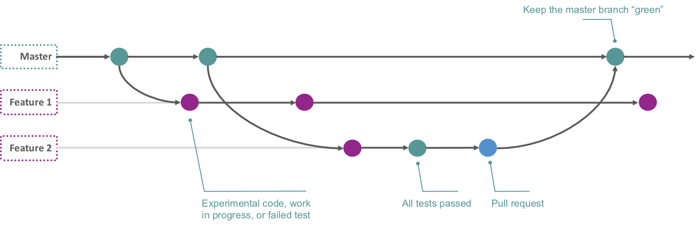
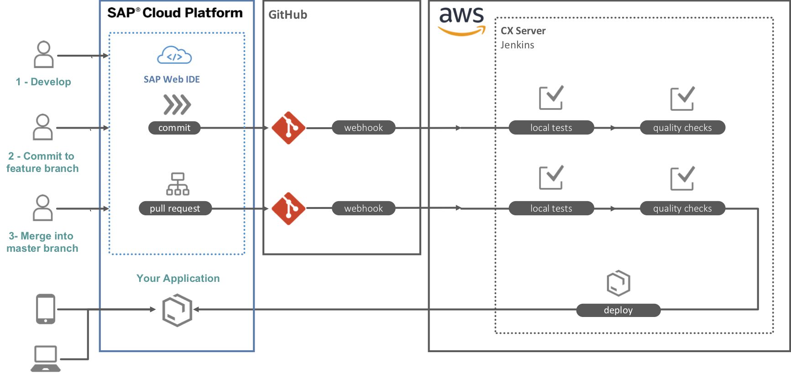

## Prerequisites
- An account on Amazon AWS
- An account on SAP Cloud Platform for Cloud Foundry
- Cloud Foundry CLI installed
- An account on GitHub

## Details
### You will learn
  - The basics of Project "Piper"
  - The benefits of trunk-based development
  - Why Amazon AWS should be a top choice for deploying a build server

This tutorial is in introduction to a series of tutorials where you learn to set up a Continuous Delivery workflow from SAP's **Project "Piper"** on an **Amazon AWS EC2** instance to automatically build, test and deploy an **SAP Cloud SDK** app to **SAP Cloud Foundry**.

---

[ACCORDION-BEGIN [Step 1: ](Introduction to Project "Piper")]

To rapidly build and deliver software, an efficient software development process should be in place. To address this efficiency, SAP has delivered Project "Piper". The goal of project "Piper" is to substantially ease setting up continuous delivery processes for the most important SAP technologies by means of Jenkins pipelines.

In this tutorial, you will create an app using the **SAP Cloud SDK**. It consists of two technical components: SAP Cloud SDK libraries (for Java and for JavaScript/TypeScript) and the Continuous Delivery Toolkit which is based on Project "Piper".

When you create an application using the **SAP Cloud SDK**, it will have the **Project "Piper"** tooling included. It consists of:

 - **`cx-server`** infrastructure
 - configuration and bootstrapping the codified Pipeline via a **`Jenkinsfile`**

**`cx-server`** is the software infrastructure required to run Cloud SDK pipeline. It makes use of Jenkins, various plugins for Jenkins, Docker, various command line tools (maven, npm, cf-cli) and Nexus Open Source Edition.

The **`cx-server`** infrastructure runs in a **Docker** container with a a preconfigured Jenkins and a Nexus-based cache server.

The pipeline contains steps for **building** your app, perform local backend/front-end/lint/code **unit tests** as well as **remote tests**, **quality checks**, **third party checks** and for **deploying** your app to SAP Cloud Platform (Cloud Foundry as well as Neo).

The pipeline provided by Project "Piper" is optimized for **Trunk-based development**. This is a branching model where all developers work on a single `master` branch. They may create short-lived feature branches. When their code builds and successfully passes the automated tests, it will be merged into the master branch.

Trunk-based development is therefore really straightforward, simple, and continuous while at the same time it naturally prevents developers from creating hard to solve merge conflicts.

[DONE]
[ACCORDION-END]

[ACCORDION-BEGIN [Step 2: ](Introduction to Amazon AWS)]

The Jenkins environment will run in a Docker container on an Amazon AWS Elastic Compute Cloud (EC2) instance. There are many benefits of using an EC2 instance as part of a Continuous Delivery workflow. EC2 instances are highly scalable, relatively cheap, quick to stop and start, and easy to set up.

When considering a physical computer to run a build server, another benefit of utilizing an AWS EC2 instance comes to mind. Running a build server on your own hardware, you cannot use cloud connectivity out of the box. You need to have full control over your network in order to use webhooks between your source code repository and your build server, for instance.

Since the cost of the EC2 instance is dependent on the used memory, CPU, and most importantly, uptime of the server, you may try and reduce one or more of these parameters to minimize monthly costs. In addition, you can setup billing alarms that notify you when you reach a predefined threshold. It can also predict your total monthly costs in advance.

Using an EC2 instance helps you create an isolated test environment where automated tests can be executed, such as those provided with Project "Piper".

[DONE]
[ACCORDION-END]

[ACCORDION-BEGIN [Step 3: ](Finishing the tutorial series)]

As mentioned in the beginning, over the course of the next 6 tutorials you will learn to set up a Continuous Delivery workflow from SAP's **Project "Piper"** on an **Amazon AWS EC2** instance to automatically build, test and deploy an **SAP Cloud SDK** app to **SAP Cloud Foundry**.

In this **first tutorial**, you will set up an EC2 instance on your Amazon AWS account, and install the Docker CLI.

In the **second tutorial**, you will create an SAP Cloud SDK app and add it to a new GitHub repository.

In the **third tutorial**, you will copy the SAP Cloud SDK app's CI/CD server and pipelines and do basic configuration on your AWS EC2 instance

In the **fourth tutorial**, you will set up Jenkins, configure the pipeline and monitor the initial build process

In the **fifth tutorial**, you will set up a WebHook connection between GitHub and Jenkins to automate builds and tests so you don't need to manually start the pipeline after each change.

In the **sixth and final tutorial**, you will create a Pull Request which, after merging, automatically gets build, tested and deployed to Cloud Foundry.

When you are finished, you have a build system which represents the following diagram:

You will build your app using SAP Web IDE, and commit code changes to your GitHub account. The webhook will trigger the Jenkins build server, and executes the tests. If a test fails, you have to fix these first. If all tests pass, you can then create a pull request, and have your changes merged into the master branch. Upon this merge, the webhook will trigger the Jenkins server again, executes the tests, and then deploys your app to your target space on SAP Cloud Foundry.

[VALIDATE_3]

[ACCORDION-END]

---
