## Prerequisites
 - An account on Amazon AWS
 - An account on SAP Cloud Platform for Cloud Foundry
 - Cloud Foundry CLI installed
 - An account on GitHub

## Details
### You will learn
  - How to setup an Amazon AWS EC2 instance as part of a Continuous Delivery workflow
  - How to install Docker CLI on the EC2 instance

This tutorial is part of a series where you learn to set up a Continuous Delivery workflow from SAP's **Project "Piper"** on an **Amazon AWS EC2** instance to automatically build, test and deploy an **SAP Cloud SDK** app to **SAP Cloud Foundry**.

You will start the series by launching an EC2 instance on your Amazon AWS account, and install the Docker CLI.

---

[ACCORDION-BEGIN [Step 1: ](Log on to Amazon AWS console)]

Open a browser an navigate to [https://aws.amazon.com/](https://aws.amazon.com/). On the top-right, click the **Sign In To The Console** button to go to the login screen.

Enter your Amazon AWS credentials and click **Sign In**.

You are now logged in into the **AWS Management Console**:

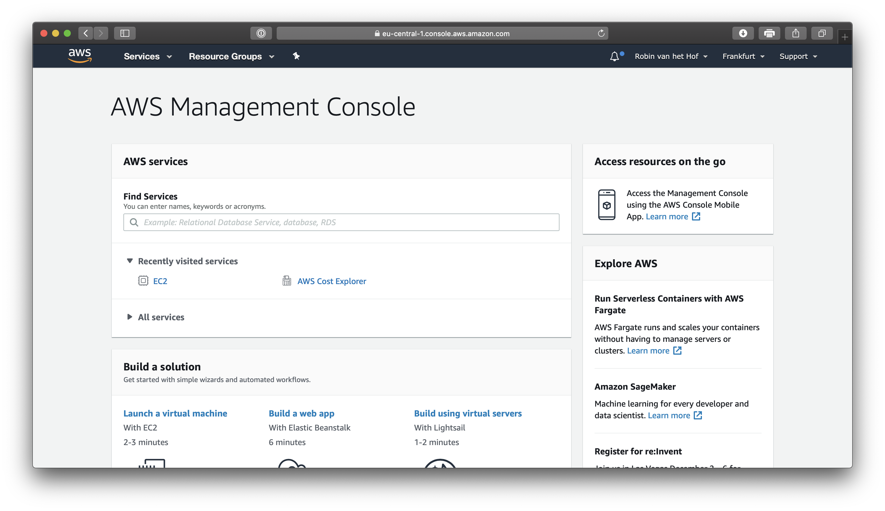

[DONE]
[ACCORDION-END]

[ACCORDION-BEGIN [Step 2: ](Navigate to EC2 Dashboard)]

From the top menu, click **Services** and from the dropdown menu, select **Compute > EC2**.

You are now in the **EC2 Dashboard**:

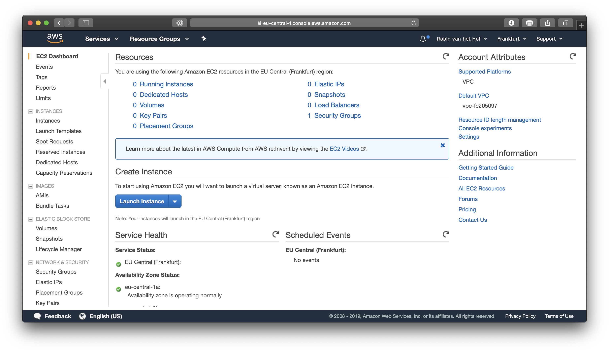

[DONE]
[ACCORDION-END]


[ACCORDION-BEGIN [Step 3: ](Choose Amazon Machine Image)]

Click the blue **Launch Instance** button.

From the list, select the **Amazon Linux AMI 2018.03.0 (HVM), SSD Volume Type**:

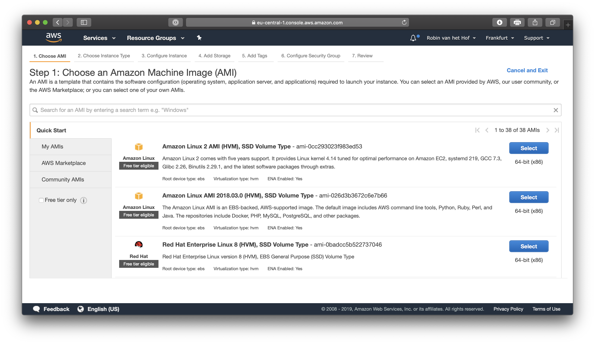

[DONE]
[ACCORDION-END]

[ACCORDION-BEGIN [Step 4: ](Choose Instance Type)]

Tick the checkbox next to the **t2.2xlarge** type and click the **Review and Launch** button.

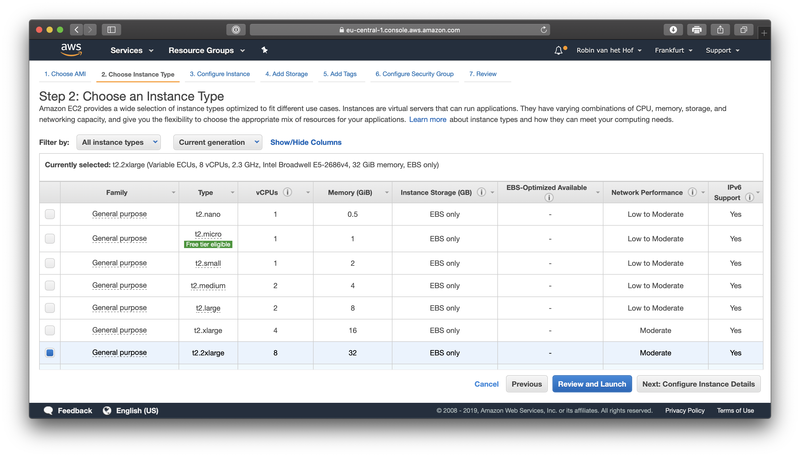

> **Important**: Please note the **t2.2xlarge** instance type is **not free**. As Jenkins is more CPU heavy than memory heavy, and you run this tutorial with a small developer team (just you), this instance type has the best performance / cost ration. For larger development teams, you may also opt for an **m4.2xlarge** or **c5.2xlarge** but they come at a higher cost.

> **Important**: When finished working with your EC2 instance, always make sure to stop the instance so it does not run idle!


[DONE]
[ACCORDION-END]

[ACCORDION-BEGIN [Step 5: ](Review Instance Launch)]

Review the instance launch details.

Again, please take note the selected **t2.2xlarge** instance type does not run for free.

> **Important**: When finished working with your EC2 instance, always make sure to stop the instance so it does not run idle!

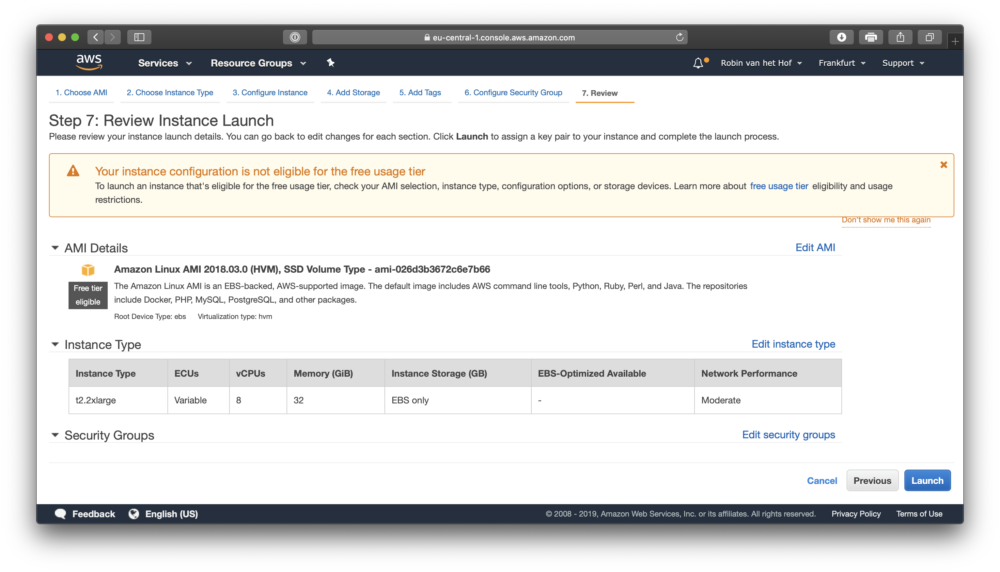

Click the **Launch** button to launch the new EC2 instance.

[DONE]
[ACCORDION-END]

[ACCORDION-BEGIN [Step 6: ](Select key pair for secure connectivity)]

In order to connect securely to the EC2 instance, a key pair needs to be created.

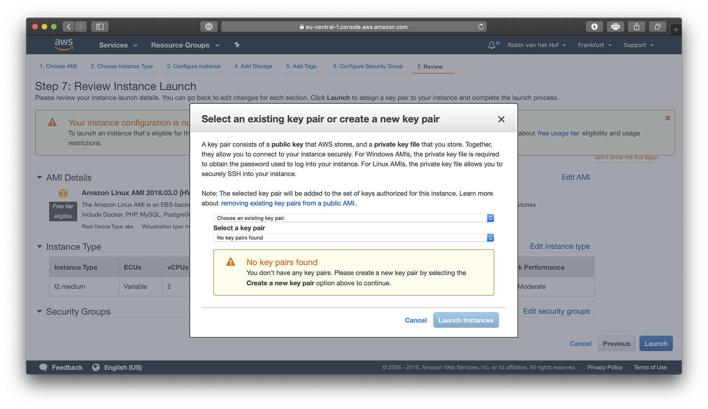

> If you have previously created and installed a key pair, you can opt to reuse an existing key pair. For the purpose of the tutorial, you will create a new key pair

From the dropdown, select **Create a new key pair**

For **Key pair name**, enter **`AWS_CI_CF`**:

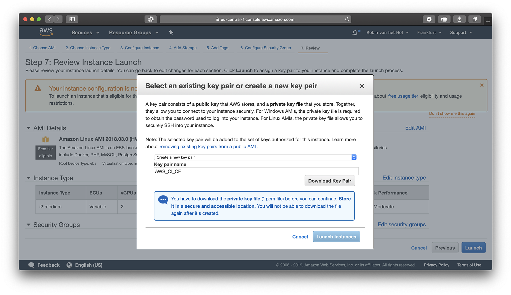

Click the **Download Key Pair** button.

> **Important**: This is the only chance for you to save the private key file. You'll need to provide the name of your key pair when you launch an instance and the corresponding private key each time you connect to the instance.

Store the downloaded `AWS_CI_CF.pem` private key file to a safe location. It is generally a good idea to store it in a subfolder of your user folder.

> **If you use a Mac or Linux computer**: You have to set permissions to the downloaded private key file so that only you can read it.

> To set these permissions, navigate to the folder where you have stored the private key file, and run the following command:

> `chmod 400 AWS_CI_CF.pem`

Once you have downloaded and stored the private key file, you can click the **Launch Instances** button.

[DONE]
[ACCORDION-END]

[ACCORDION-BEGIN [Step 7: ](Launching the new EC2 Instance)]

The new EC2 instance is now launching:

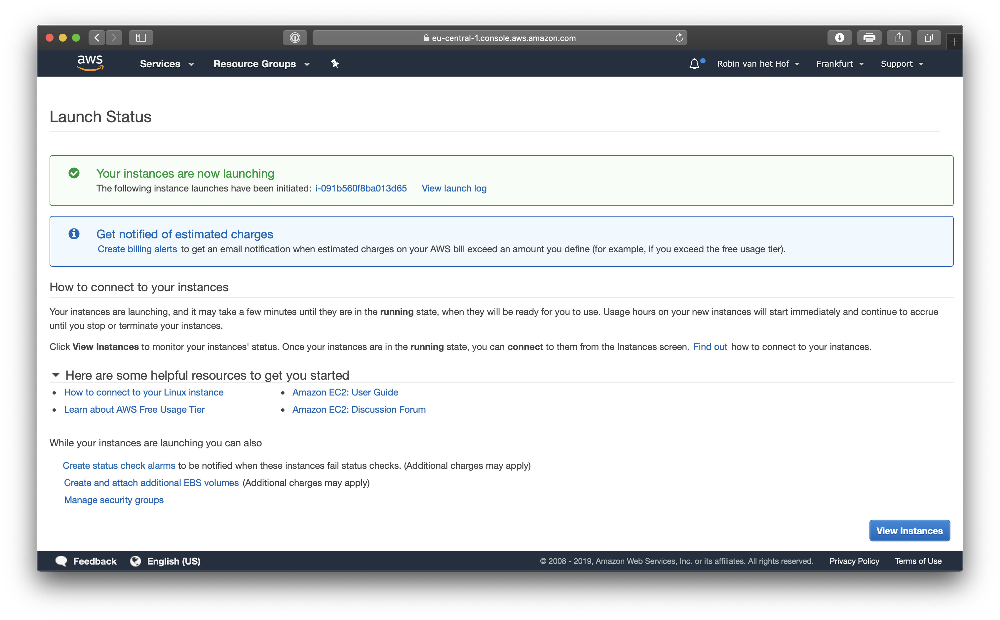

In the lower-right corner, click the blue **View Instances** button to see the current launching status:


Wait until the **Status Checks** column shows **2/2 checks passed** for the newly created instance:

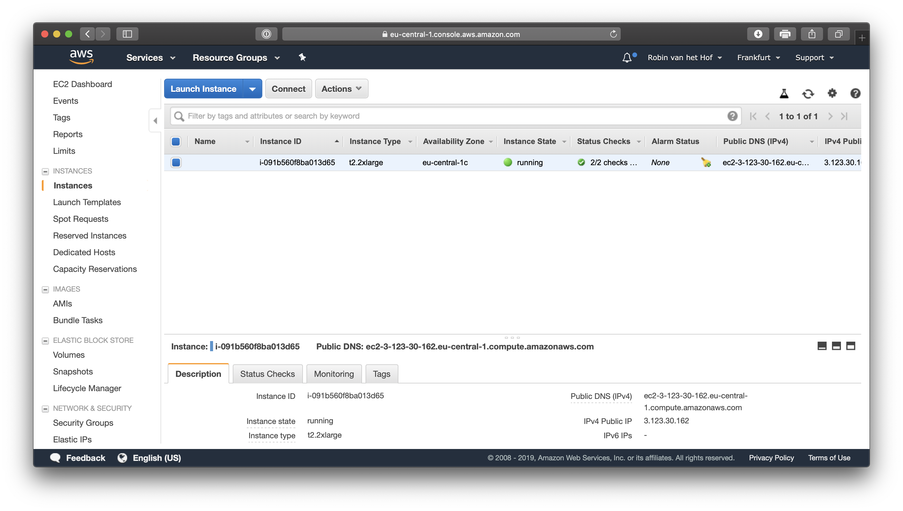

The instance has now fully launched.

[DONE]
[ACCORDION-END]

[ACCORDION-BEGIN [Step 8: ](Copy the public DNS of your instance)]

With the newly created EC2 instance selected in the EC2 dashboard, take note of the **Public DNS** of the instance. This hostname will be used to connect to your instance.

Click the **Copy to clipboard** icon next to the public hostname of your instance, and paste the hostname to a blank text file for future reference:

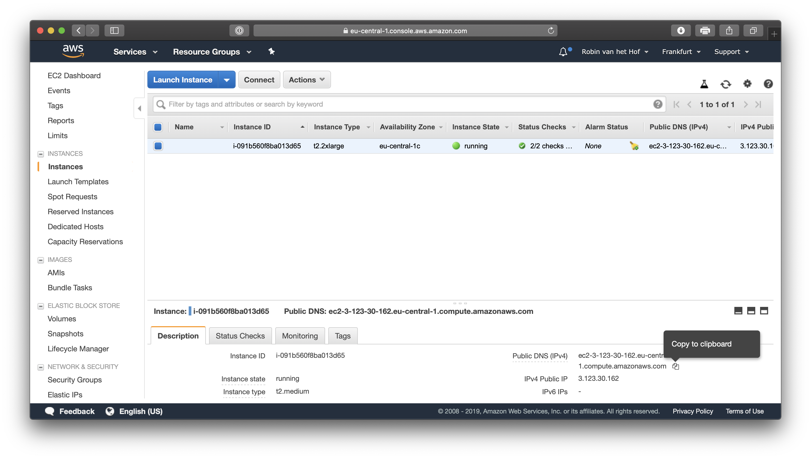


[DONE]
[ACCORDION-END]

[ACCORDION-BEGIN [Step 9: ](Log on to you instance via SSH)]

Now the EC2 instance has fully launched, it is time to connect to it via SSH.

[OPTION BEGIN [Windows]]

Open **Git Bash** from the Start Menu and run the following command:

```
ssh -i /path/my-key-pair.pem ec2-user@<public hostname>
```

where `/path/my-key-pair.pem` is the path and filename where you stored your private key, and `<public hostname>` is the hostname you have copied in **Step 8**.

The `ec2-user` is the default user for an Amazon Linux AMI.

For example:

```
ssh -i ~/ssh/AWS_CI_CF.pem ec2-user@ec2-1-123-35-162.eu-central-1.compute.amazonaws.com
```

> On Unix-like environments, the **tilde** (`~`) represents the user's home directory. This originates from the 1970's, where the most widely used keyboard had the "Home" and tilde symbol shared on the same key.

> If you have stored the private key file in a subfolder `ssh` of your home folder, for instance `C:\Users\Monica\ssh`, you don't have to type:

> `ssh -i` **`/c/Users/Monica/ssh`**`/AWS_CI_CF.pem ...etc`

> ...but instead you can simply use:

> `ssh -i` **`~/ssh`**`/AWS_CI_CF.pem ...etc`

The first time you connect to the EC2 instance you will see a response like this:

```
The authenticity of host 'ec2-1-123-35-162.eu-central-1.compute.amazonaws.com (1.123.35.162)' can't be established.
ECDSA key fingerprint is SHA256:AEi18h2B7YbcNO7KxYlzpFrXnpfuAef0bI65tmB493s.
Are you sure you want to continue connecting (yes/no)?
```

Type in **`yes`** and press **Enter** to continue. If everything went successful, you are now logged in into your new EC2 instance:

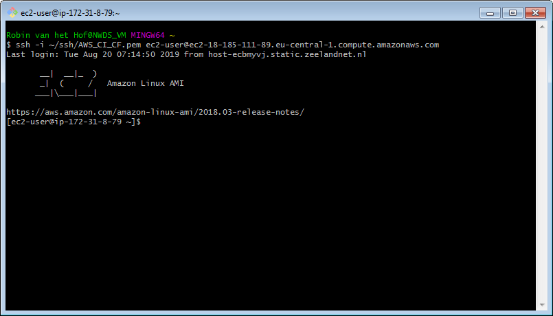

[OPTION END]


[OPTION BEGIN [Linux and macOS]]

Open a terminal and run the following command:

```
ssh -i /path/my-key-pair.pem ec2-user@<public hostname>
```

where `/path/my-key-pair.pem` is the path and filename where you stored your private key, and `<public hostname>` is the hostname you have copied in **Step 8**.

The `ec2-user` is the default user for an Amazon Linux AMI.

For example:

```
ssh -i ~/.ssh/AWS_CI_CF.pem ec2-user@ec2-1-123-35-162.eu-central-1.compute.amazonaws.com
```

The first time you connect to the EC2 instance you will see a response like this:

```
The authenticity of host 'ec2-1-123-35-162.eu-central-1.compute.amazonaws.com (1.123.35.162)' can't be established.
ECDSA key fingerprint is SHA256:AEi18h2B7YbcNO7KxYlzpFrXnpfuAef0bI65tmB493s.
Are you sure you want to continue connecting (yes/no)?
```

Type in **`yes`** and press **Enter** to continue. If everything went successful, you are now logged in into your new EC2 instance:

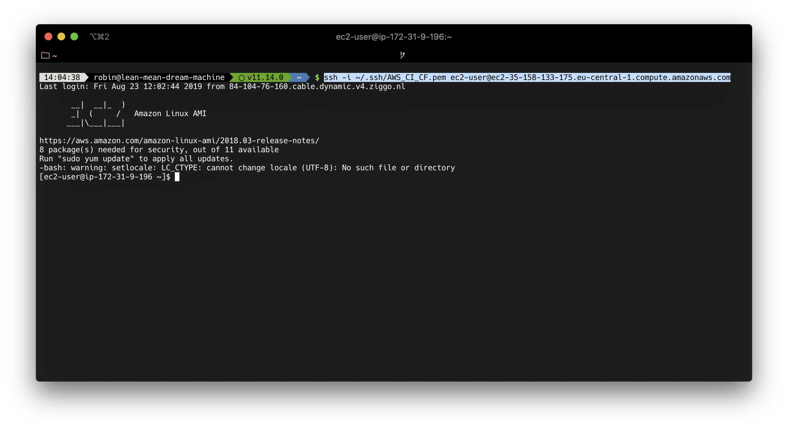

[OPTION END]

[DONE]
[ACCORDION-END]

[ACCORDION-BEGIN [Step 10: ](Update YUM packages)]

As you may have noticed when logging in to your EC2 instance, it was mentioned several packages were outdated and need to be updated.

Run the following command to update the YUM packages on your EC2 instance:

```
sudo yum update -y
```

After 10-20 seconds, the update should have finished successfully.

[VALIDATE_10]

[ACCORDION-END]

[ACCORDION-BEGIN [Step 11: ](Install and run Docker)]

While the EC2 instance comes with the Docker kernel installed, the Docker CLI is not yet installed. This command-line interface is needed in order to install Docker containers.

To install the Docker CLI, run the following command:

```
sudo yum -y install docker
```

After a couple of seconds, the Docker CLI is installed.

You can now start Docker with the following command:

```
sudo service docker start
```

The Docker service is now running.

In the next tutorial, you will create an app using the **SAP Cloud SDK**.

[DONE]
[ACCORDION-END]


---
