## Prerequisites
 - An account on SAP Cloud Platform for Cloud Foundry
 - SAP Web IDE Full-Stack enabled
 - Cloud Foundry CLI installed
 - An account on GitHub

## Details
### You will learn
  - How to create an SAP Cloud SDK app from a Maven archetype
  - How to login to SAP Cloud Foundry from the command-line
  - How to deploy an SAP Cloud SDK app to Cloud Foundry

> This tutorial is part of a series where you learn to set up a Continuous Delivery workflow from SAP's **Project "Piper"** on an **Amazon AWS EC2** instance to automatically build, test and deploy an **SAP Cloud SDK** app to **SAP Cloud Foundry**.

  In this tutorial, you will create a simple SAP Cloud SDK app from a Maven archetype, and learn a bit about the project structure. You will then build this project into a deployable artifact, and deploy it to your Cloud Foundry environment.

---

[ACCORDION-BEGIN [Step 1: ](Create empty repository on Github)]

To set up continuous delivery for your app, you need to use some sort of code versioning control. For this tutorial series, you will use your GitHub account.

Log on to your GitHub account, and click the button to create a new repository.

Provide the following details:

| Field | Value |
|----|----|
| Repository Name | **`cloudsdk-cf-aws`** |
| Description | **`SAP Cloud SDK app running on Cloud Foundry deployed via Jenkins/Piper on AWS`** |
| Private | **`selected`** |

Do **not** select **Initialize this repository with a README**, and do not add a `.gitignore` and license file:

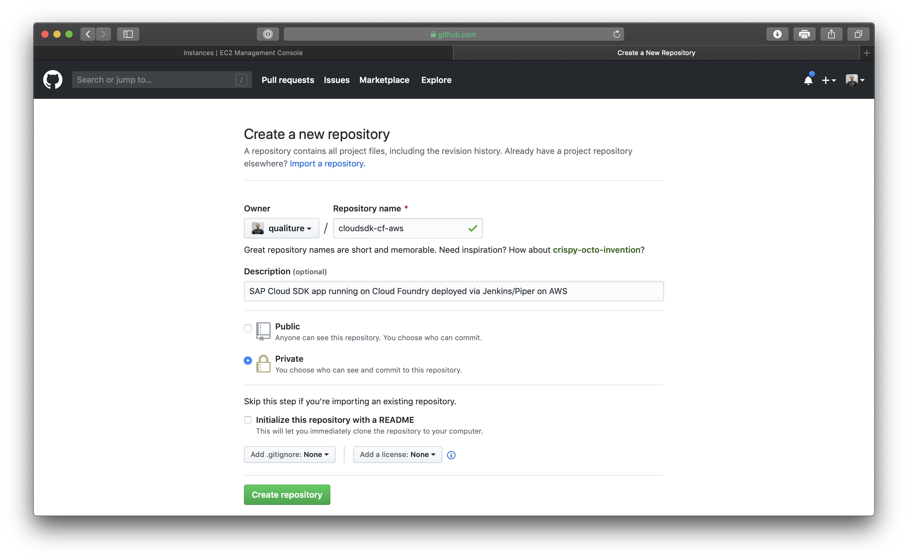

Click the green **Create repository** button when done. The repository is now created.

[DONE]
[ACCORDION-END]

[ACCORDION-BEGIN [Step 2: ](Clone the repository locally)]

[OPTION BEGIN [Windows]]

On your computer, open a new **Command Prompt** from the **Start** menu and navigate to the folder you want to clone the newly created repository to.

Execute the following command:

```
git clone https://github.com/<your GitHub account>/cloudsdk-cf-aws.git
```

You may be asked to provide your GitHub login credentials:

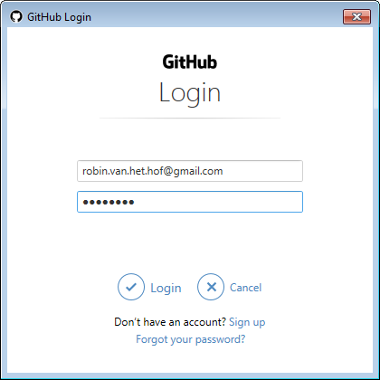

The empty repository is now cloned locally.

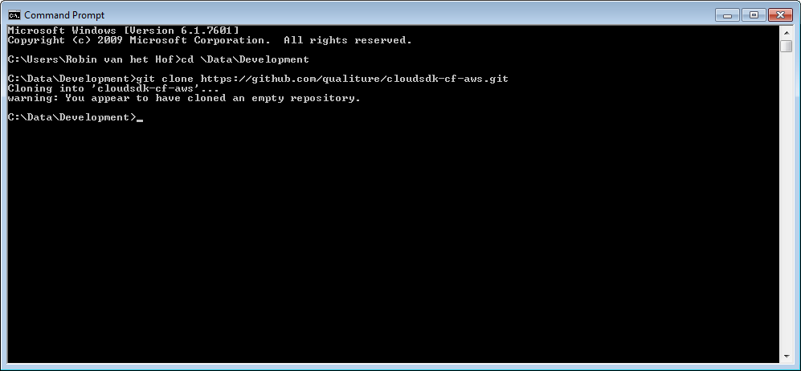

NB: Do not yet change directory to the root directory of your project.


[OPTION END]


[OPTION BEGIN [Linux and macOS]]

On your computer, open a terminal window and navigate to the folder you want to clone the newly created repository to.

Execute the following command:

```
git clone https://github.com/<your GitHub account>/cloudsdk-cf-aws.git
```

The empty repository is now cloned locally.

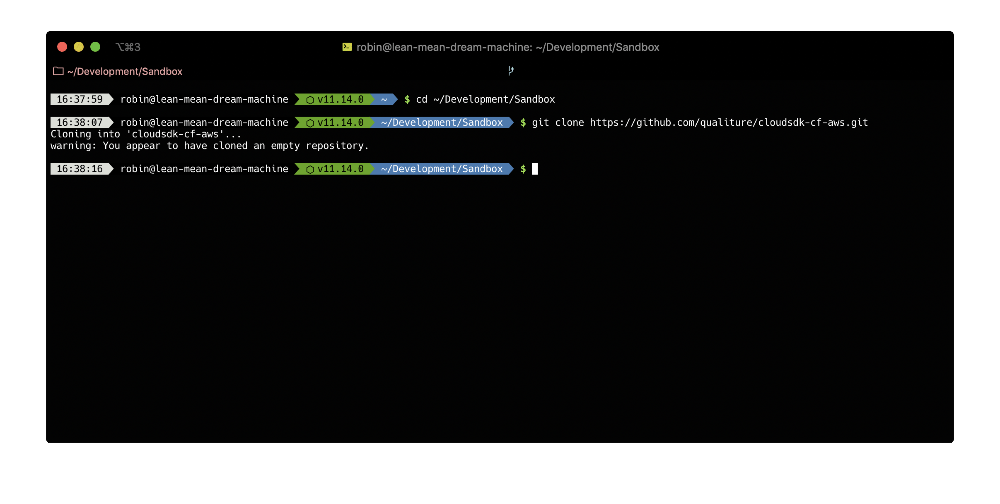

NB: Do not yet change directory to the root directory of your project.

[OPTION END]

[DONE]
[ACCORDION-END]


[ACCORDION-BEGIN [Step 3: ](Generate Cloud SDK app from Maven archetype)]

In this step, you will generate an SAP Cloud SDK app project from a Maven archetype.

Execute the following Maven command:

```
mvn archetype:generate -DarchetypeGroupId=com.sap.cloud.s4hana.archetypes -DarchetypeArtifactId=scp-cf-tomee -DarchetypeVersion=RELEASE
```

When you execute that command, Maven will ask you to fill in some extra properties in order to generate the application.

When asked, provide the following details:

| Property | Value |
|----|----|
| `groupId` | **`com.sap.cloud.sdk.aws.tutorials`** |
| `artifactId` | **`cloudsdk-cf-aws`** |
| `version` | Hit **Enter** to use the default **`1.0-SNAPSHOT`** |
| `package` | Hit **Enter** to use the default **`com.sap.cloud.sdk.aws.tutorial`** |

When Asked to confirm the properties configuration, enter **`Y`** and press **Enter**.

The project is now successfully created:

[OPTION BEGIN [Windows]]

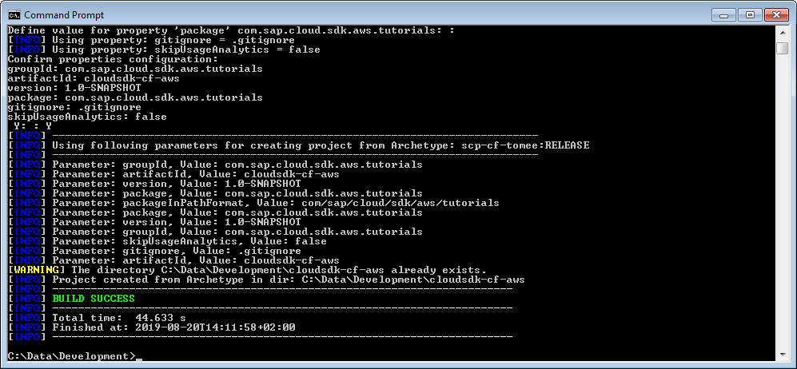

[OPTION END]


[OPTION BEGIN [Linux and macOS]]

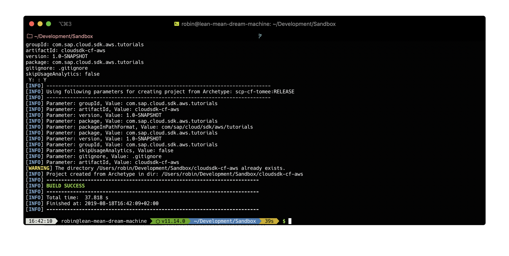

[OPTION END]

[DONE]
[ACCORDION-END]

[ACCORDION-BEGIN [Step 4: ](Push the generated app to your remote repository)]

Change directory to the root of your project with the following command:

```
cd cloudsdk-cf-aws
```

First, add all new files to the local repository's staging area with the following command (make sure to include the 'dot' at the end, indicating the current directory):

```
git add .
```

[OPTION BEGIN [Windows]]

> You may see messages like:

> `warning: LF will be replaced by CRLF in .gitignore.`

> `The file will have its original line endings in your working directory`

> For this tutorial, you can just ignore these. If you want, you can set auto-converting CRLF into LF with the following command:

> `git config --global core.autocrlf true`

> The reason for this warning message is that in Unix systems the end of a line is represented with a line feed (LF). In windows a line is represented with a carriage return (CR) and a line feed (LF) thus (CRLF).

Then, commit the new files with the following command:

```
git commit -am "Initial version"
```

And finally, push all the committed files to the remote repository with the following command:

```
git push origin master
```

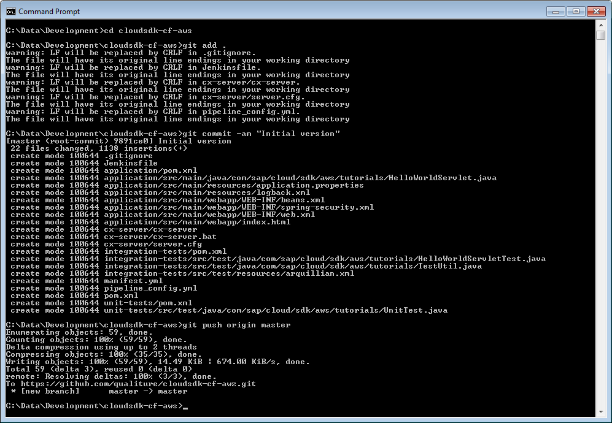

[OPTION END]


[OPTION BEGIN [Linux and macOS]]

Then, commit the new files with the following command:

```
git commit -am "Initial version"
```

And finally, push all the committed files to the remote repository with the following command:

```
git push origin master
```

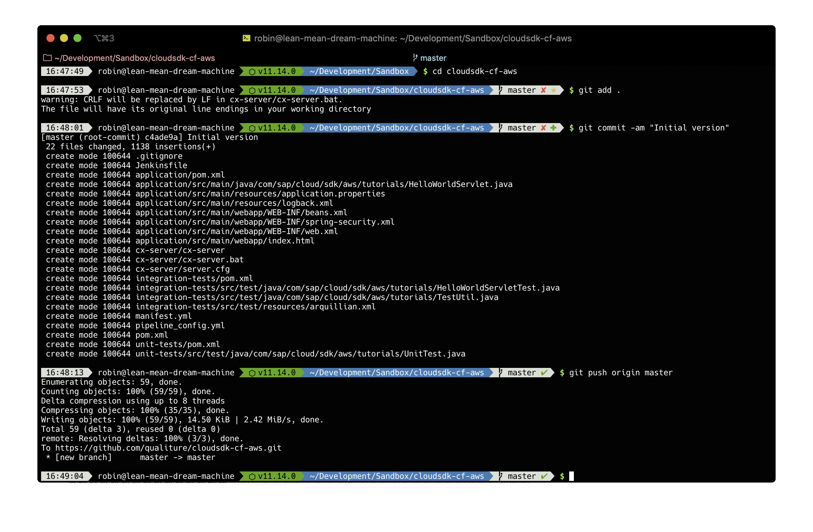

[OPTION END]

You can also check your remote repository on GitHub as it should now also contain the pushed files:

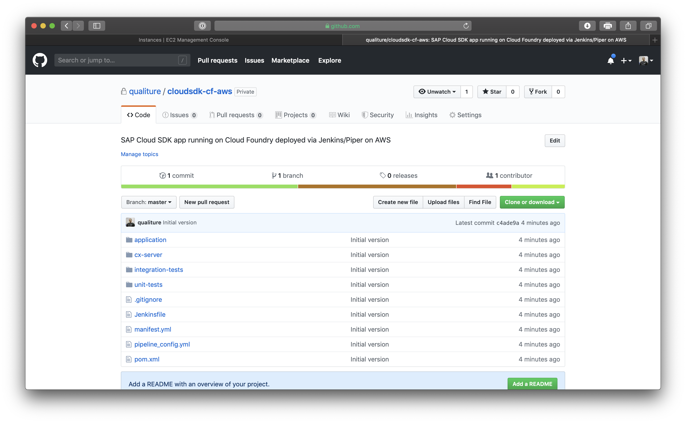

[DONE]
[ACCORDION-END]

[ACCORDION-BEGIN [Step 5: ](Import project in SAP Web IDE)]

In this step, you will import the SAP Cloud SDK project into SAP Web IDE Full-Stack running on SAP Cloud Platform.

> For the purpose of this tutorial you will use SAP Web IDE Full-Stack, but of course you are free to use any IDE that suits your personal preference.

Open a browser and open SAP Web IDE Full-Stack with the following URL:

```
https://webidecp-<your cloud platform ID>trial.dispatcher.hanatrial.ondemand.com/
```

> Alternatively, open your SAP Cloud Platform cockpit at [https://account.hanatrial.ondemand.com](https://account.hanatrial.ondemand.com) and after logging in, navigate to **Neo Trial > Services** and from the **Developer Experience** category, select **SAP Web IDE Full-Stack** and click **Go to Service**.

After logging in, SAP Web IDE Full-Stack opens:

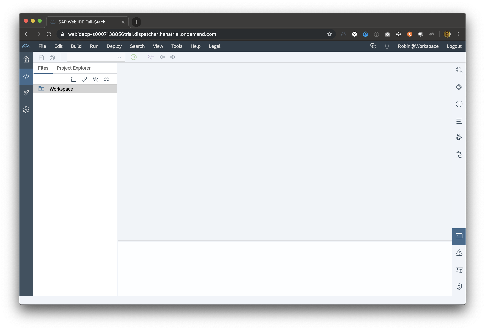

Right-click on the `Workspace` folder, and from the context-menu, select **Git > Clone Repository**.

In the popup, provide the URL to your remote repository **`https://github.com/<your GitHub account>/cloudsdk-cf-aws.git`** and click **Clone**:

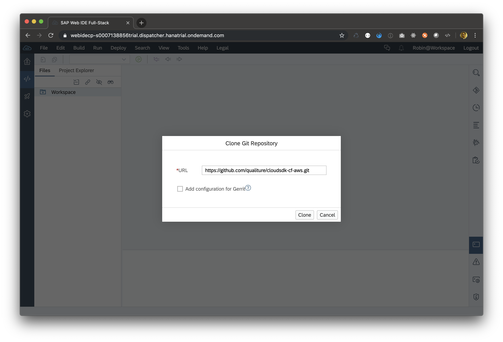

When asked for your GitHub credentials, provide them in the popup:


After successful cloning, SAP Web IDE asks to un-track certain system files. Since that is generally a good idea, click the **Commit and Push** button.

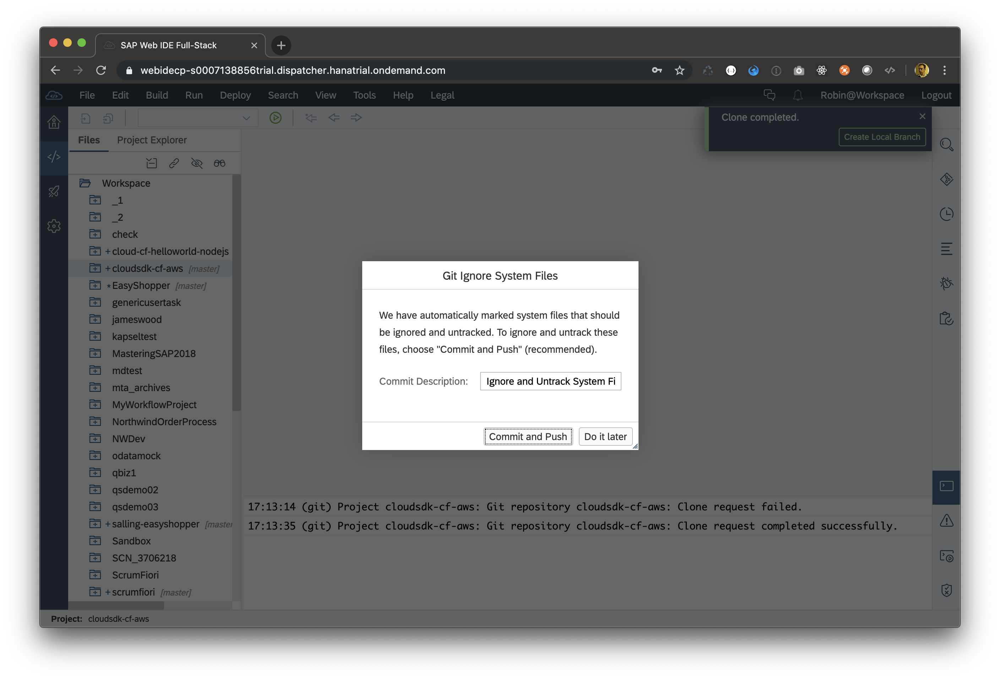

After the commit and push have successfully finished, the project is now available in SAP Web IDE:

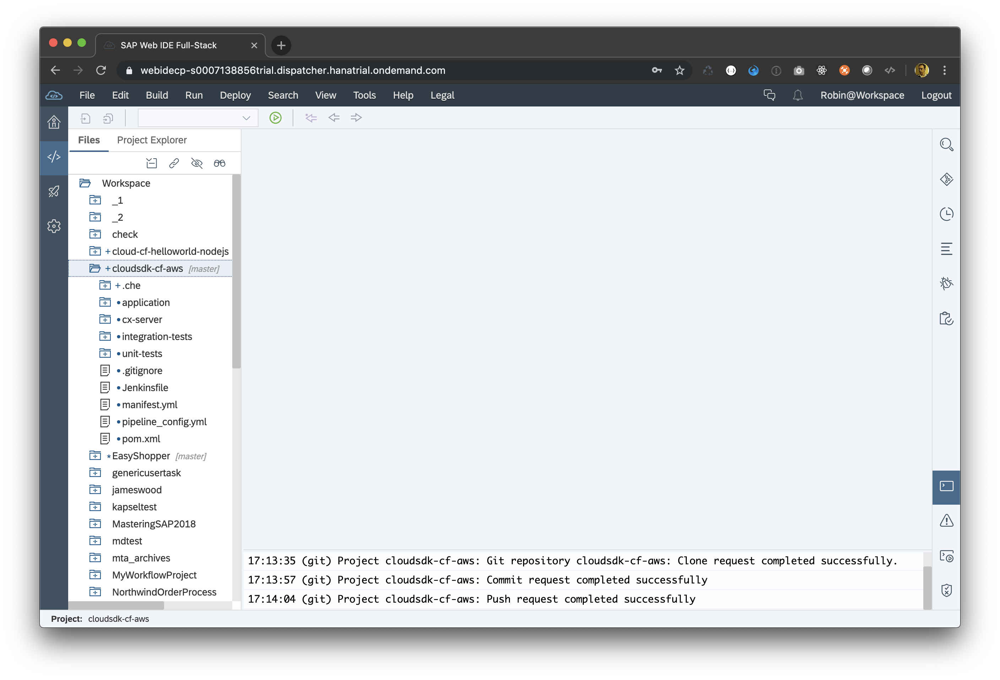

[DONE]
[ACCORDION-END]

[ACCORDION-BEGIN [Step 6: ](Understand project structure)]

The generated SAP Cloud SDK application consists of 4 different Maven modules which are separated by different folders:

| Folder / Module | Description |
|----|----|
| `application` | Contains the source code and configuration of the web application |
| `cx-server` | Contains the script and configuration file to manage your Jenkins CI/CD environment |
| `integration-tests` | Contains the integration tests for your application |
| `unit-tests` | Contains the unit tests for your application |

The `application` folder contains the actual source code of the app.

Navigate to `application/src/main/java/com/sap/cloud/sdk/aws/tutorials` and open the file `HelloWorldServlet.java`. This is a simple servlet that has it's endpoint mapped to the defined `/hello` route, and prints `Hello World!`.

The `integration-tests` and `unit-tests` folders follow the same structure as the `application` source folder, and contain the tests for your application. These will be used later as part of the Jenkins pipeline.

In the root of the project are also a couple of files worth mentioning:

| File | Description |
|----|----|
| `manifest.yml` | Deployment descriptor for Cloud Foundry |
| `Jenkinsfile` | Contains configuration for Jenkins, and bootstraps the codified Continuous Delivery pipeline |
| `pipeline_config.yml` | Configures the SAP Cloud SDK Continuous Delivery pipeline of your project |

> In this tutorial, you won't change the `Jenkinsfile` configuration, but it is an integral part of the pipeline and as such it cannot be deleted from your project.

> The `Jenkinsfile` bootstraps and downloads the ready-made pipeline from GitHub and runs it, so you don't have to build it yourself.

> The actual configuration of the pipeline itself is done in the `pipeline_config.yml` file.

At this stage, you may choose to create a new build package of your app using Maven and after logging in to Cloud Foundry via the CLI, push the built app to Cloud Foundry and see how it runs, but that is beyond the scope of this tutorial.

[DONE]
[ACCORDION-END]

<!--
[ACCORDION-BEGIN [Step 7: ](Build the project)]

In this step of this tutorial, you will build the project into a deployable archive.

Run the following command to clean any previous builds and create a new build package:

```
mvn clean package
```

The build of the package should finish successfully:

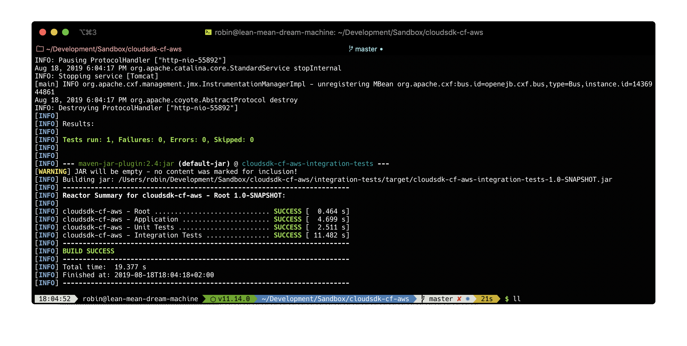

[DONE]
[ACCORDION-END]

[ACCORDION-BEGIN [Step 8: ](Log on to Cloud Foundry)]

Now you have successfully created a deployable artifact, you can now deploy it to your `dev` space on Cloud Foundry.

First, determine the API endpoint you will deploy your application to. This can be found in your Cloud Foundry's `trial` subaccount:

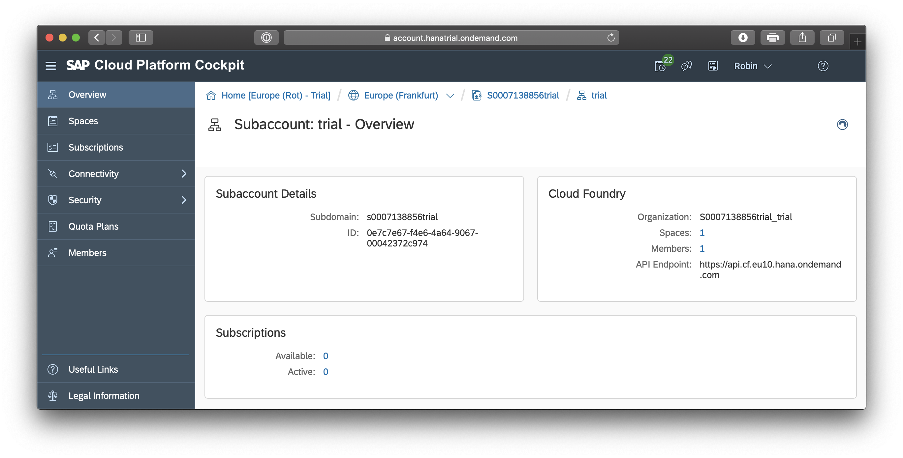

Then, in the root of your project, set the Cloud Foundry API endpoint with the following command:

```
cf api https://api.cf.eu10.hana.ondemand.com
```

You can then log in to the Cloud Foundry environment with the command:

```
cf login
```

After providing your Cloud Foundry login credentials, you are now logged in:

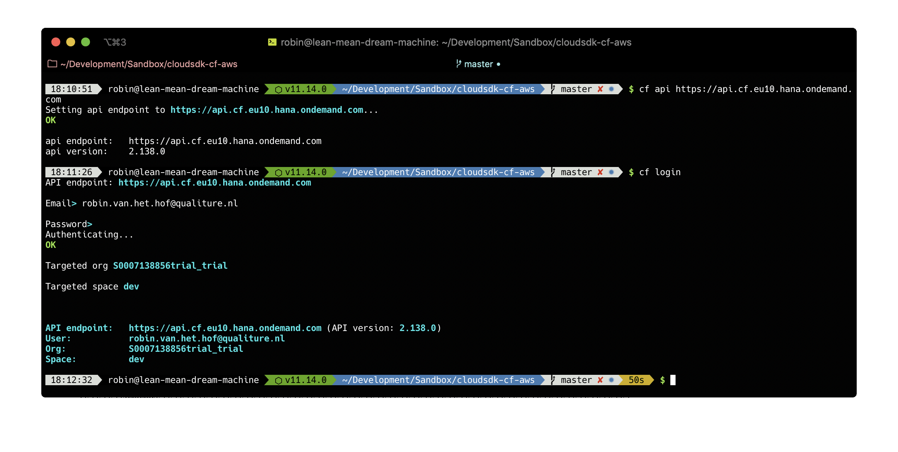

[DONE]
[ACCORDION-END]

[ACCORDION-BEGIN [Step 9: ](Deploy the Cloud SDK app to Cloud Foundry)]

You can now deploy to Cloud Foundry with the following command:

```
cf push
```

After a successful deployment, copy the generated URL from the `routes` parameter:

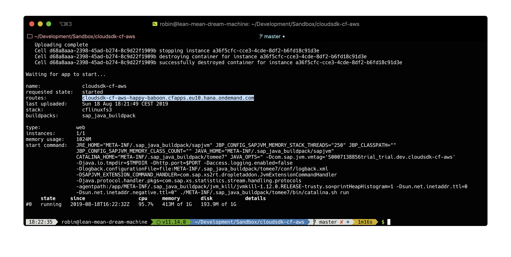

and paste it into a new browser window:

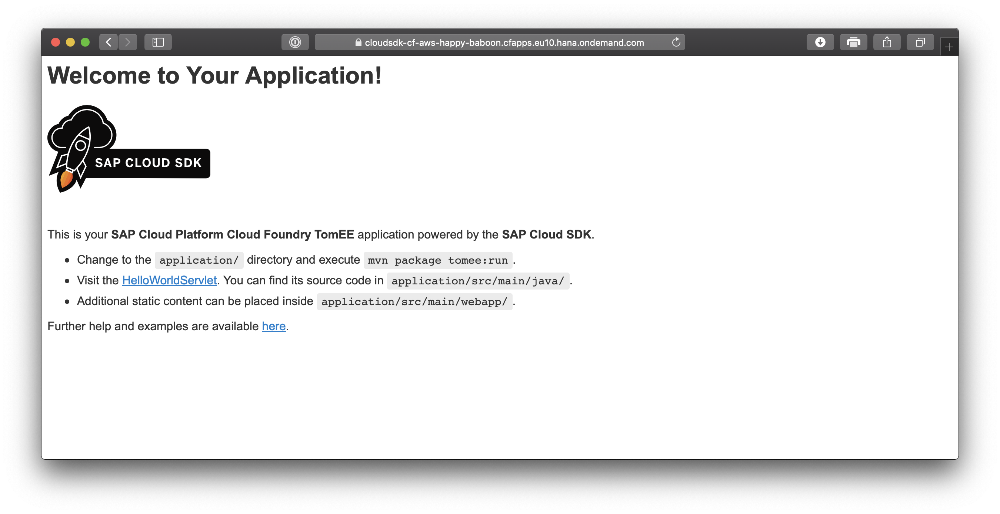

Change the URL and add the **`/hello`** route at the end. You should now see the output from the `HelloWorldServlet` class:

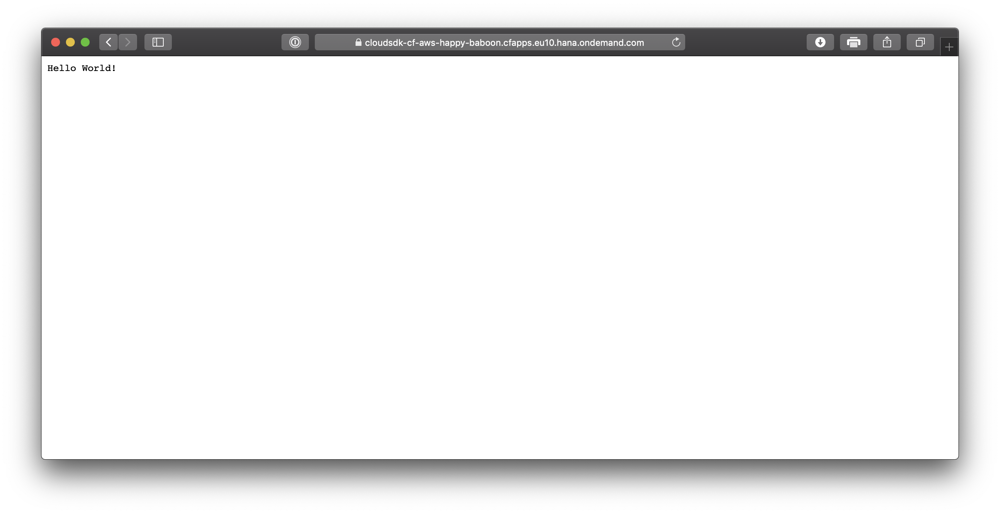

[VALIDATE_9]

[ACCORDION-END]
-->

---
