## Prerequisites
 - An account on Amazon AWS
 - Created an SAP Cloud SDK app
 - Windows users: Git Bash installed

## Details
### You will learn
  - How to securely copy files from your local environment to your AWS EC2 instance
  - How to edit your AWS EC2 instance's Inbound Rules
  - How to start and run the Jenkins CI/CD Server
  - How to secure your Jenkins CI/CD Server

As mentioned in the introduction tutorial of this series, the **`Cx Server`** is the software infrastructure required to run Cloud SDK pipeline. It makes use of Jenkins, various plugins for Jenkins, Docker, various command line tools (maven, npm, cf-cli) and Nexus Open Source Edition.


---

[ACCORDION-BEGIN [Step 1: ](Copy cx-server folder from app to AWS)]

Open a new terminal and navigate to the root of your SAP Cloud SDK app.

You now copy the `cx-server` folder and its content to the home directory of the `ec2-user` on your AWS EC2 instance with the following command:

```sh
scp -i /path/my-key-pair.pem -r ./cx-server ec2-user@<public hostname>:~
```

For instance:

```
scp -i ~/.ssh/AWS_CI_CF.pem -r ./cx-server ec2-user@ec2-3-123-30-162.eu-central-1.compute.amazonaws.com:~
```

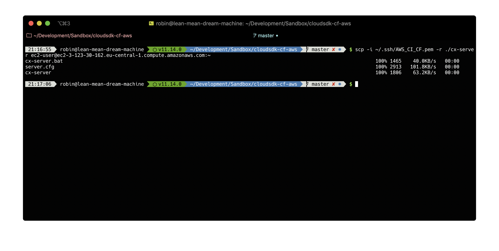


[DONE]
[ACCORDION-END]

[ACCORDION-BEGIN [Step 2: ](Make cx-server script executable)]

After you have copied the `cx-server` directory to AWS, you need to make the containing script executable in order to run it.

Log in to your AWS EC2 instance with the command:

```sh
ssh -i /path/my-key-pair.pem ec2-user@<public hostname>
```

For example:

```
ssh -i ~/.ssh/AWS_CI_CF.pem ec2-user@ec2-1-123-35-162.eu-central-1.compute.amazonaws.com
```

Change directory to `cx-server`:

```sh
cd cx-server
```

If you now list the contents of that directory, you'll notice the containing `cx-server` script is not yet executable.

You can fix that with the following command:

```sh
chmod +x cx-server
```

If you now list the directory contents, you see the script is now executable:

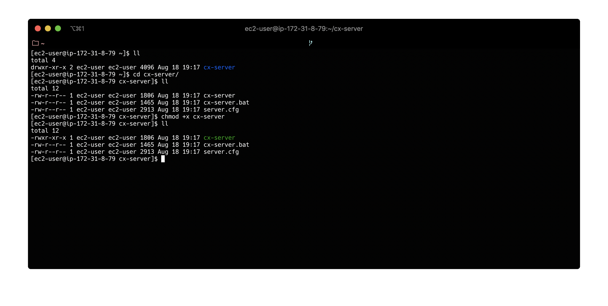

[DONE]
[ACCORDION-END]


[ACCORDION-BEGIN [Step 3: ](Start the SAP Cloud SDK Cx server)]

[OPTION BEGIN [Start the SAP Cloud SDK CI/CD server]]

You can now start the SAP Cloud SDK CI/CD server. While in the `cx-server` directory on your AWS EC2 instance, run the following command:

```sh
sudo ./cx-server start
```

If you run this script for the first time,  it will download the latest version of the SAP Cloud SDK CI/CD Server from Docker Hub and instantiates a container. This may take a couple of seconds:

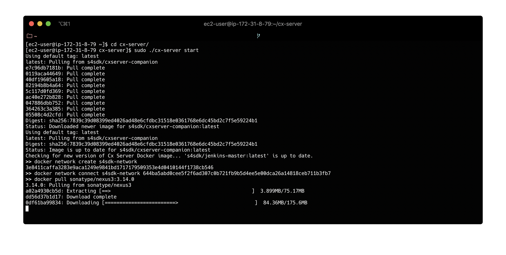

Any subsequent starts, the script will simply reuse the already existing container.

When the Docker download and container instantiation has finished, you can try and open the Jenkins application in the next step.

> Normally, the available disk space of the **t2.2xlarge** EC2 instance type should be sufficient to run the tutorial once. However, the Nexus cache database may grow too big quickly, and won't start up. In that case, you will see a response like this when starting the `cx-server`:

>     >> docker start s4sdk-nexus
>     Error response from daemon: network e19e53519909c9ac125f2f4ebb73136cbaacc50d7ffce1f51eff9ab945e8b2e6 not found
>     Error: failed to start containers: s4sdk-nexus
>     [Error] Failed to start existing nexus container.

> In that case, you may choose to disable the Nexus server. This has some impact on performance since the build process will download all dependencies instead of retrieving them from cache. On the plus side, you don't need to pay for the extra disk space needed. Or you could opt to increase the available disk space of your EC2 instance, but this will come at an additional cost.

> To disable the Nexus cache, click the tab **Troubleshooting: Disable Nexus server** at the beginning of this step.

> To increase the available disk space, click the tab **Troubleshooting: Increase disk space**.

[OPTION END]


[OPTION BEGIN [Troubleshooting: Disable Nexus server]]

To disable the Nexus server, you must set the corresponding flag in the `server.cfg` file of the `cx-server`.

In your terminal, execute the following command:

```sh
nano ~/cx-server/server.cfg
```

This will open the configuration file in the Nano text editor. Scroll towards the end until you find the following block:

```
#>> Toggle for turning the download cache on and off.
# cache_enabled=false
```

Remove the hash-sign **#** to uncomment the flag. It should now read:

```
#>> Toggle for turning the download cache on and off.
cache_enabled=false
```

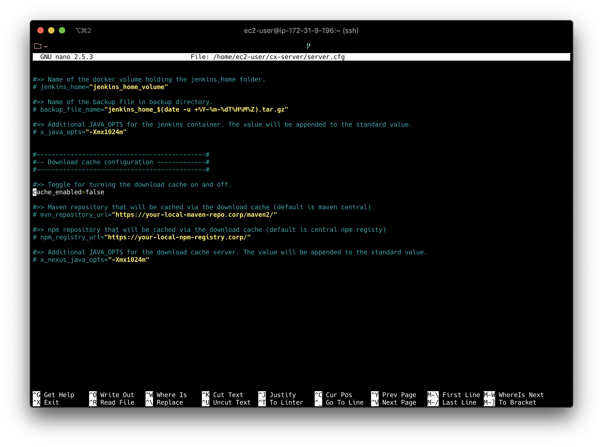

To save the changes, type **Ctrl-X**, then **Y** to confirm, and then **Enter**. You have now left the Nano editor.

To start with a fresh environment, execute the following two commands:

```sh
sudo ./cx-server remove
sudo ./cx-server starts
```

The `cx-server` now runs without the Nexus cache.

[OPTION END]


[OPTION BEGIN [Troubleshooting: Increase disk space]]

To increase the available disk space for your EC2 instance, log in to your AWS console and navigate to **EC2 > Volumes**:

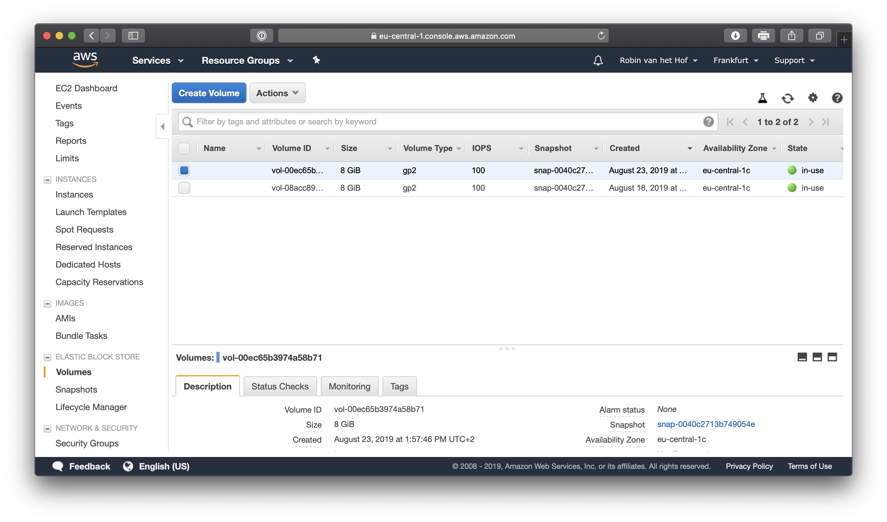

Select the volume for your instance, and from the **Actions** button, select **Modify Volume**. Change the default value of **8** GB to something larger, e.g. **20** GB:

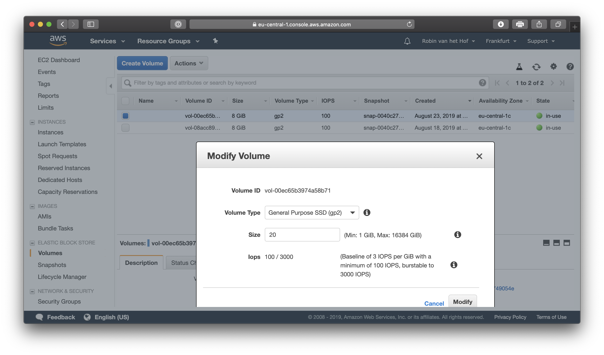

Click the **Modify** button, then click **Yes** to accept your changes and click **Close**  to dismiss the popup.

Next, open a terminal to your EC2 instance, and type the following command:

```sh
lsblk
```

The output shows the root volume is now indeed 20 GB, but the partition is still 8 GB. To extend the partition, type the following command:

```sh
sudo growpart /dev/xvda 1
```

This will extend partition `1` of disk `/dev/xvda`.

Lastly, you will need to extend the filesystem as well. Execute the following command:

```sh
sudo resize2fs /dev/xvda1
```

To check the new disk size, type the following command:

```sh
df -h
```

You should now see the new disk size:

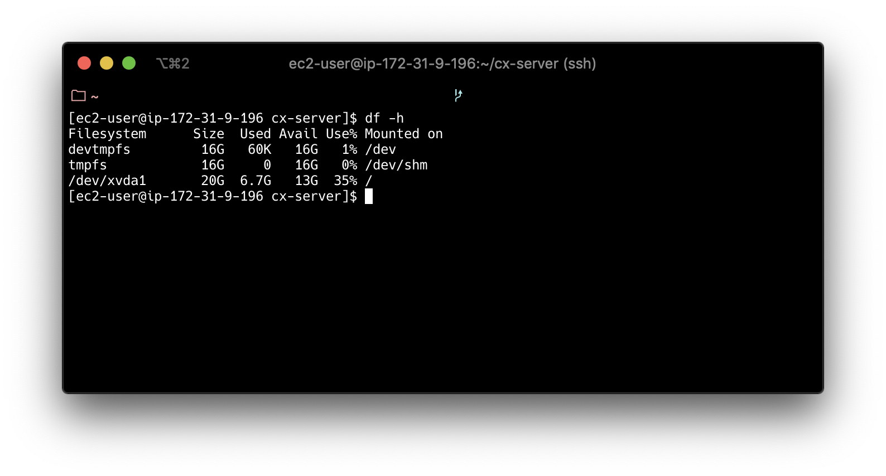

To start with a fresh environment, execute the following two commands in the folder, where it was installed (by default in `~`):

```sh
sudo ./cx-server remove
sudo ./cx-server start
```

> If the Nexus server still fails to start, you may need to remove it as well. Execute the following command:

>     sudo docker container ls -a

> It will give an output like this:

> 

> Copy the `CONTAINER ID` value of the `sonatype/nexus3:3.14.0` container, and run the following command:

>     sudo docker container rm <your_container_id>

> For instance:

>     sudo docker container rm 7ab6aae9d51a

> Now you can start Jenkins with a new Nexus server with command:

>     sudo ./cx-server start

[OPTION END]

[DONE]
[ACCORDION-END]

[ACCORDION-BEGIN [Step 4: ](Try to run Cx Server in a browser)]

Open a new browser window, and navigate to the public DNS of your AWS EC2 instance. Since the CI/CD Server by default runs on port 80, you can just point to the public hostname, for instance:

```
http://ec2-3-123-30-162.eu-central-1.compute.amazonaws.com
```

However, if you followed the tutorial from the letter and created a new EC2 instance from scratch, nothing will happen and eventually your browser will time out... This is because by default the EC2 instance only accepts inbound communication via SSH port 22.

In order to be able to run the CI/CD Server on port 80, you need to create a new Inbound Rule for the AWS EC2 instance

[DONE]
[ACCORDION-END]

[ACCORDION-BEGIN [Step 5: ](Add Inbound Rule)]

Open the AWS Console, navigate to the **EC2 Dashboard** and select your EC2 instance:

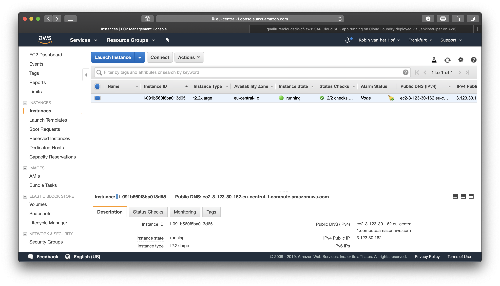

Scroll to the right until you see the column **Security Groups** and click the **launch-wizard-1** link. You are now displaying the details of your EC2 security group:

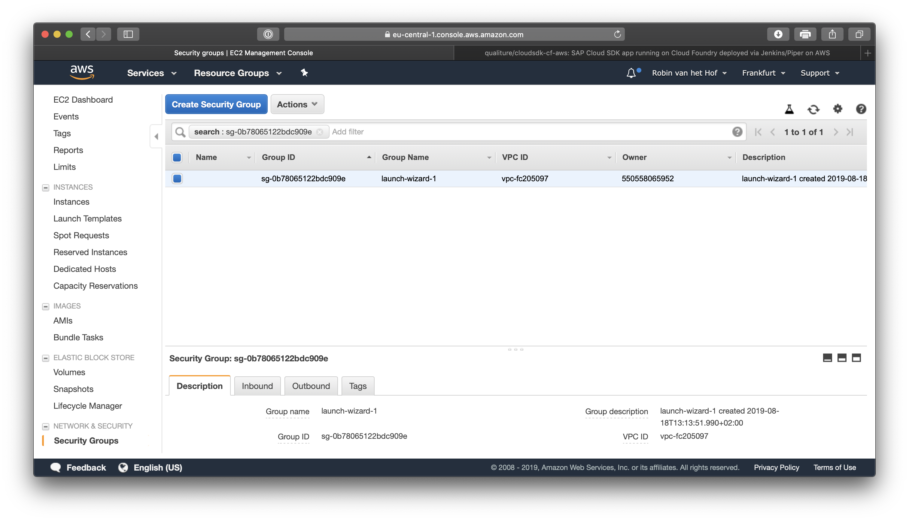

Click the **Actions** button and from the context-menu, select **Edit Inbound Rules**.

In the popup, you'll see an existing rule for SSH connections on port 22.

Click the **Add Rule** button, and a new rule is added. Change the value of the **Type** to **HTTP**, and leave the other defaults.

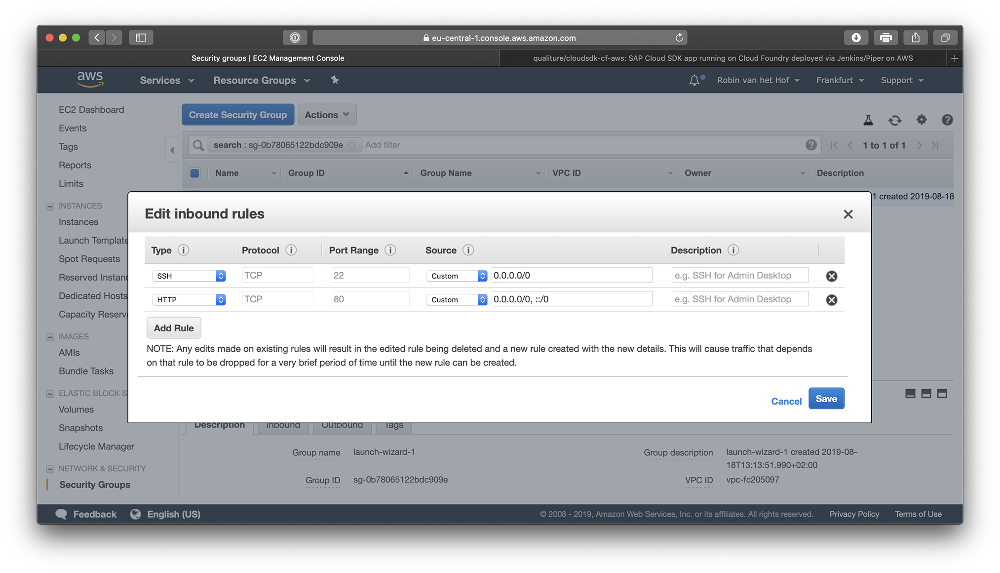

Click the **Save** button to dismiss the popup and save the changes to the EC2 instance's security group.


[DONE]
[ACCORDION-END]

[ACCORDION-BEGIN [Step 6: ](Run the Cx Server in a browser)]

If you now try to run the CI/CD Server in a browser by pointing it to the public DNS of your EC2 instance, Jenkins should display just fine:

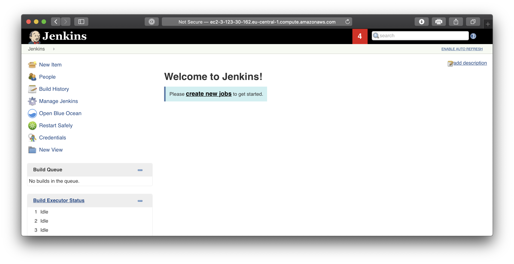

> As you have noticed, you can access Jenkins *without logging in*. And since it is exposed on a publicly accessible URL, *potentially anyone could access it*. In the next and final step, you will enable security so only a logged in administrator has access to your Jenkins environment.

[VALIDATE_6]

[ACCORDION-END]

[ACCORDION-BEGIN [Step 7: ](Secure your Cx Server)]

On Jenkins landing page, click **Manage Jenkins** and then click the **Configure Global Security** button.

Make sure you set the following settings:

| Field | Value | Enabled / Disabled |
|----|----|----|
| Enable security | | **`enabled`** |
| Access Control -> Security Realm | Jenkins' own user database | **`enabled`** |
| Access Control -> Authorization | Logged-in users can do anything | **`enabled`** |

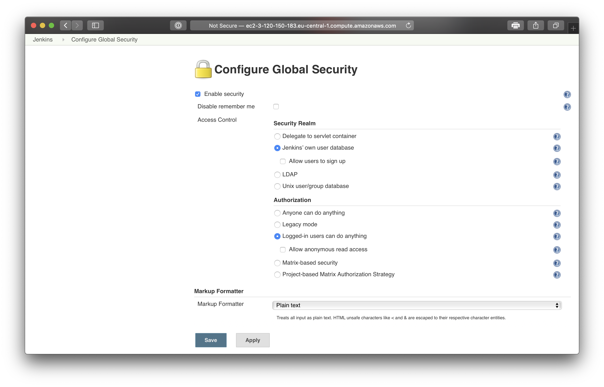

> You may set up additional security, but for now this is sufficient.

Click **Save** when done.

After you have saved the security settings, you are now required to create a Jenkins administrator account.

Provide an account name with strong password, a descriptive full name and email address:

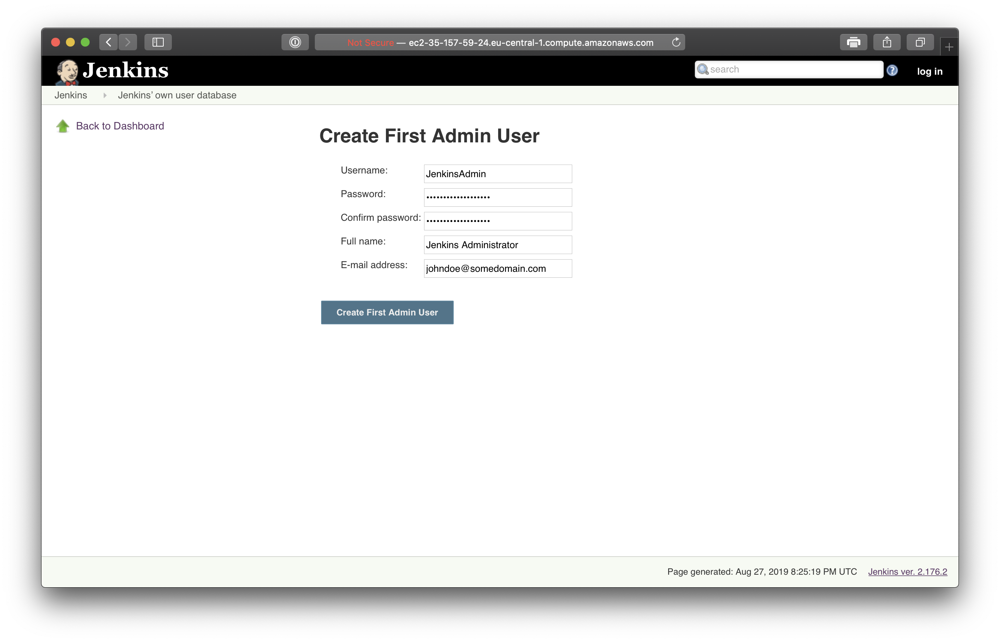

Click the **Create First Admin User** button when done. Jenkins security is now set up, and you are now logged in as a Jenkins administrator. The next you access the Jenkins URL, you are asked to provide your login credentials.

Now security is enabled, you are ready to set up the Jenkins pipeline in the next tutorial,

[DONE]
[ACCORDION-END]


---
