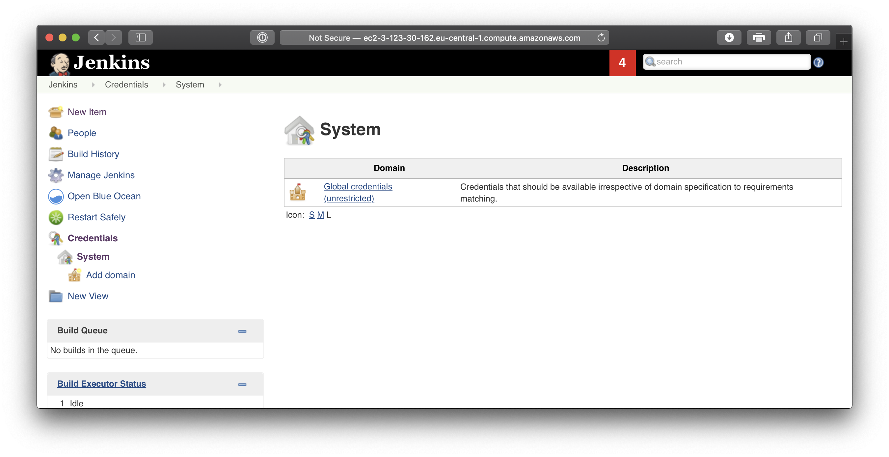
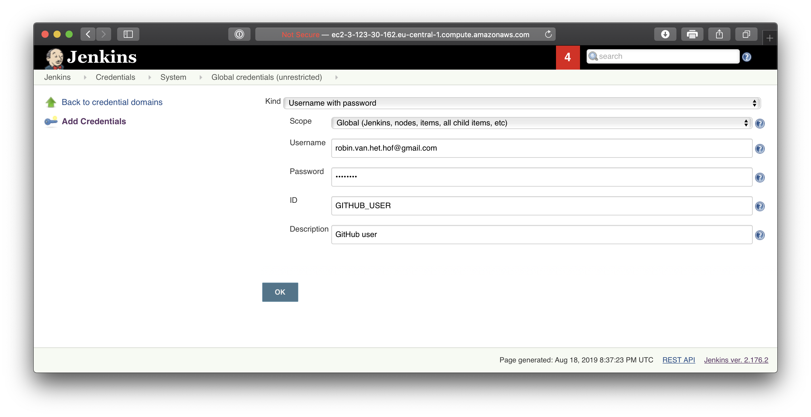
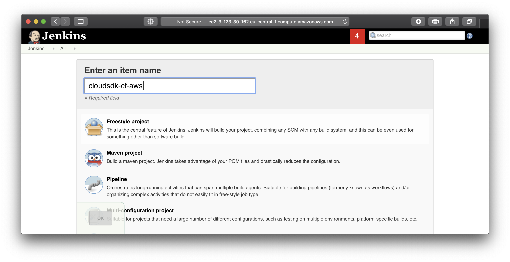
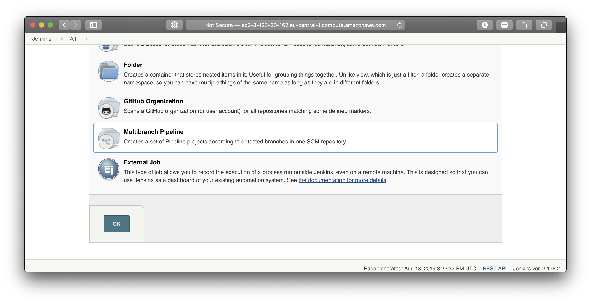
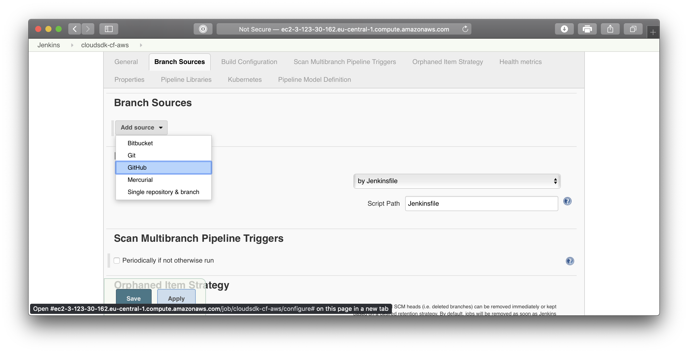
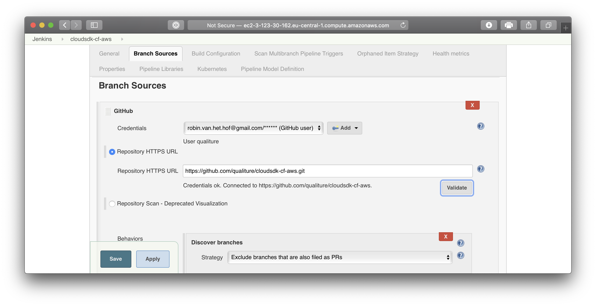
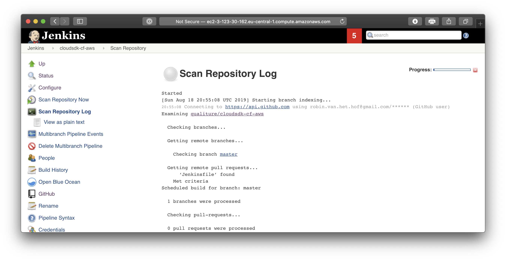
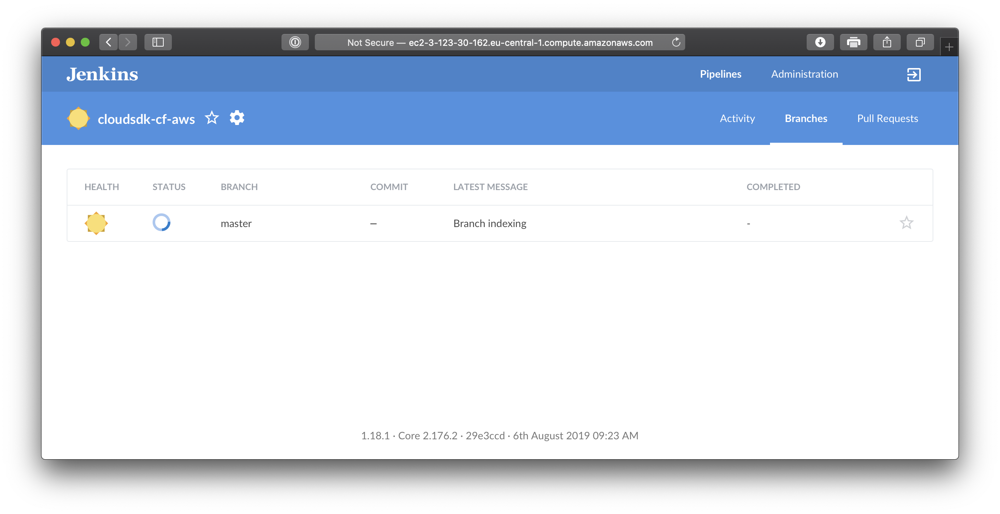
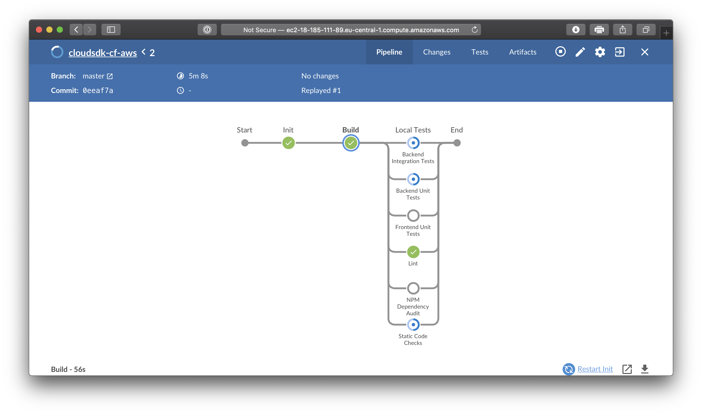
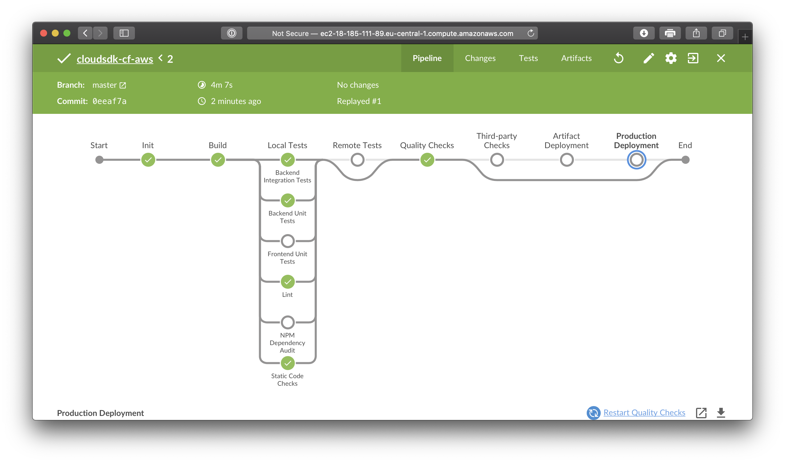

## Prerequisites
 - An account on Amazon AWS
 - Installed Jenkins in a Docker container on AWS EC2 instance
 - Created an SAP Cloud SDK app

## Details
### You will learn
  - How to configure Jenkins to use the Project Piper pipeline
  - Monitor the Pipeline build process using Blue Ocean

---

[ACCORDION-BEGIN [Step 1: ](Add GitHub credentials to Jenkins Cx Server)]

Since the remote repository for our SAP Cloud SDK app is made private, you have to create provide a pair of GitHub login credentials in Jenkins.

On the landing page of the Jenkins CI/CD Server, navigate to **Credentials > System**.

From the right pane, click the **Global credentials (unrestricted)** link:

From the left menu, click **Add Credentials** and provide the following details:

| Field | Value |
|----|----|
| Scope | **`Global`** |
| Username | **`<your GitHub username>`** |
| Password | **`<your GitHub password`** |
| ID | **`GITHUB_USER`** |
| Description | **`GitHub user`** |

Click **OK** when done.

[DONE]
[ACCORDION-END]

[ACCORDION-BEGIN [Step 2: ](Create a new Multibranch Pipeline)]

On the landing page of Jenkins, click the **New Item** button.

At the field next to **Enter an item name**, provide the name of the app, **`cloudsdk-cf-aws`**:

Scroll down a bit, and select **`Multibranch Pipeline`**

Click the **OK** button in the lower left corner to continue

[DONE]
[ACCORDION-END]

[ACCORDION-BEGIN [Step 3: ](Configure the Multibranch Pipeline)]

Now the Pipeline is created, you need to configure it and provide details of the SAP Cloud SDK app's repository.

Click the **Branch Sources** tab on top, and from the **Add source** dropdown, select **GitHub**:

In the screen that follows, provide the following details:

| Field | Value |
|----|----|
| GitHub credentials | **`<select the GitHub user you created in step 1>`** |
| Repository HTTPS URL | **`https://github.com/<github account>/cloudsdk-cf-aws.git`** |

After you have provided the repository HTTPS URL, click the **Validate** button to check whether Jenkins could connect to you GitHub repository.

For now, you can leave the **Behaviours** at their default values, and click the **Save** button.

[DONE]
[ACCORDION-END]

[ACCORDION-BEGIN [Step 4: ](Monitor the build process)]

Upon saving the Pipeline configuration, Jenkins will now initialize the pipeline and trigger a build for the SAP Cloud SDK app in your GitHub repository:

A better and more graphical way to monitor the pipeline build process is to switch to the 'Blue Ocean' view by clicking on the **Open Blue Ocean** link in the left pane.

The main screen shows the current status of the branch being processed:

If you click that item, you will get a more detailed overview of the current status:

When everything has finished successfully, the blue theme has now changed to green:

> The various steps you see in the Blue Ocean view are built-in in the SAP Cloud SDK Pipeline. This also means you don't have to write the pipeline by hand as it is provided by the SAP Cloud SDK out of the box.

Noticed how some steps are skipped? That's because the respective stages are not configured yet in the **`pipeline_config.yml`** file (See Step 6 of the 2nd tutorial in this series). Once they are configured, they will be active and executed.

One of these skipped steps is the **Production Deployment** step. Later on in this tutorial series you will configure a deployment target in the production deployment stage.

<!--
In the next tutorial, you will set up this deployment target, create a new target space on your Cloud Foundry environment, and deploy to that new space.
-->

But first, you will set up Jenkins to automatically start the build process when a pull request is submitted into GitHub.

[VALIDATE_4]

[ACCORDION-END]

---
