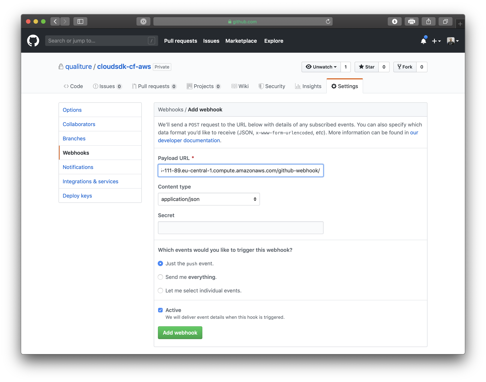
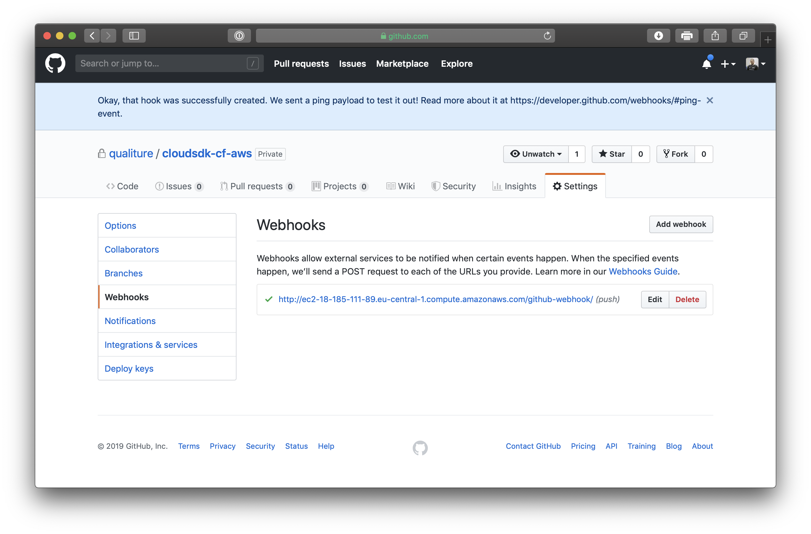
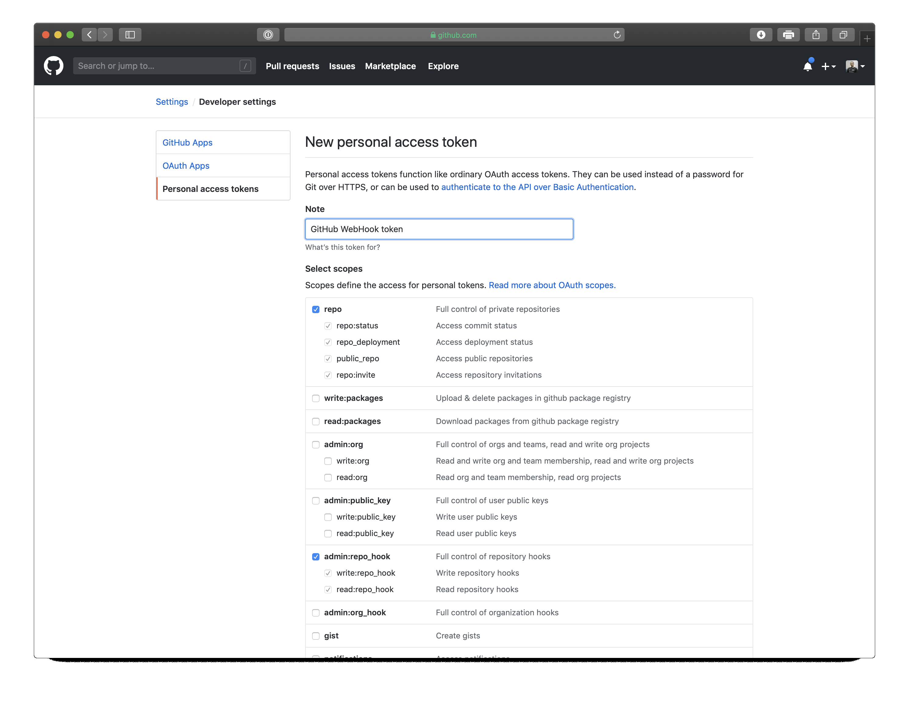
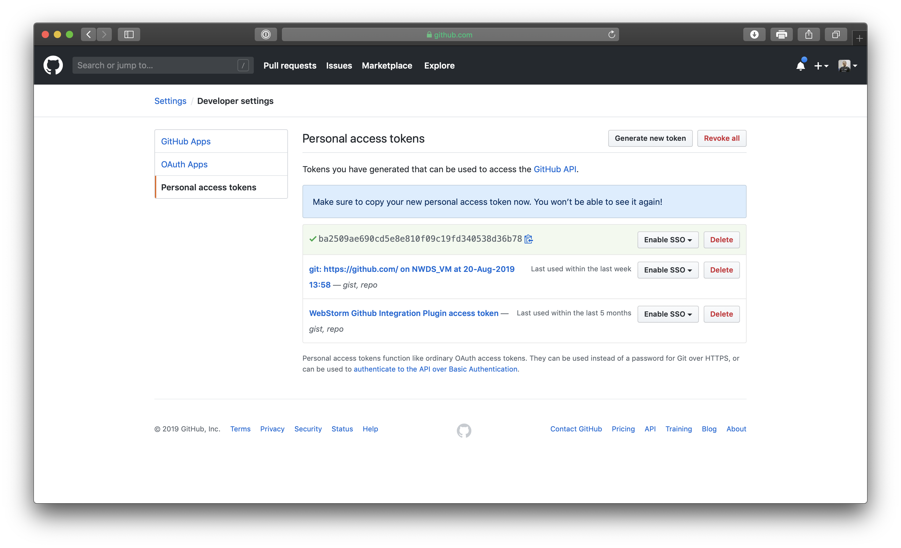
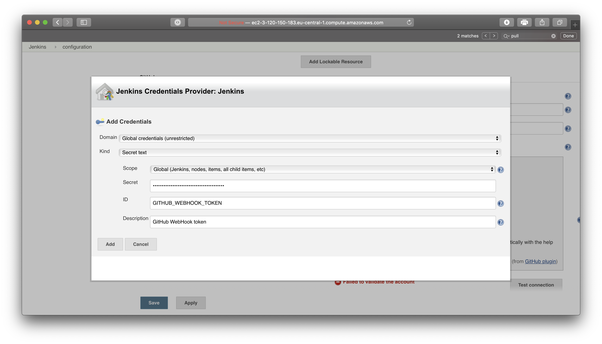
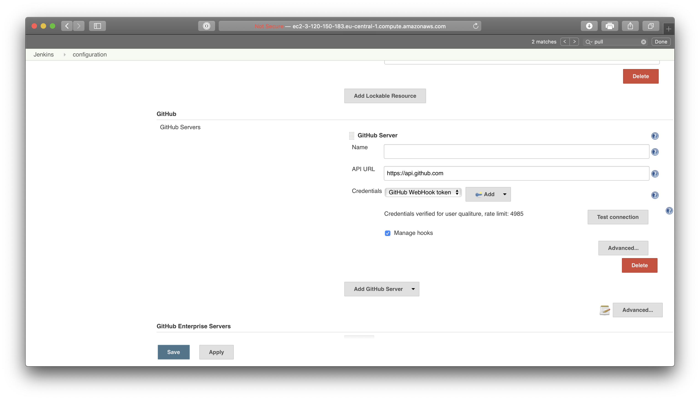

## Prerequisites
 - An account on Amazon AWS
 - Installed Jenkins in a Docker container on AWS EC2 instance
 - An account on GitHub

## Details
### You will learn
  - How to setup a webhook connection between Jenkins and GitHub
  - How a pull-request in GitHub will automatically trigger a build in Jenkins

By default, you have to manually start the pipeline flow from the Jenkins user interface. However, for true Continuous Delivery builds, Jenkins should *immediately* trigger the build and test process for *each* commit or pull request, and *every* change that has successfully passed all tests must be deployed to production.

In this tutorial, you will set up a webhook between GitHub and Jenkins, so Jenkins will be triggered immediately after each change to your repository.

---

[ACCORDION-BEGIN [Step 1: ](Setup a webhook to Jenkins in GitHub)]

Open a browser to your GitHub account, and navigate to your `cloudsdk-cf-aws` repository.

Click on the **Settings** tab at the right, and from the menu on the left, click **Webhooks** and then click the **Add webhook** button.

Here you have to provide a **Payload URL**. In this case, the payload URL is the Jenkins URL which will receive the webhook POST request from GitHub.

The Jenkins payload URL consists of the Jenkins base URL, suffixed with `/github-webhook/`, for instance:

```
http://ec2-18-185-111-89.eu-central-1.compute.amazonaws.com/github-webhook/
```

> Note the final **/** at the end of the URL; if you forget to add it, the URL won't work.

Enter the following details:

| Field | Value |
|----|----|
| Payload URL | **`<Jenkins base URL>/github-webhook/`** |
| Content type | **`application/json`** |
| Which events would you like to trigger this webhook? | **`Just the push event`** |
| Active | **`Enabled`** |



When done, click the green **Add webhook** button.

If the added webhook is successfully validated, it will show a green check next to it:



If it isn't successfully validated, then most likely you have misconfigured the payload URL. In that case, make sure you:

 - have entered the correct base URL for Jenkins running on your Amazon AWS EC2 instance, for instance **`http://ec2-18-185-111-89.eu-central-1.compute.amazonaws.com`**
 - have added **`/github-webhook/`** at the end of your Jenkins base URL, and made sure you added the final **/**

[VALIDATE_1]

[ACCORDION-END]

[ACCORDION-BEGIN [Step 2: ](Create GitHub personal access token)]

In order for the webhook to work, Jenkins need an OAuth token to authenticate to GitHub. To generate this token, click on your **Profile picture** in the top right, click **Settings**, and from the menu on the left, click **Developer settings**.

In the **Developer settings** page, click **Personal access tokens** from the left menu and click the **Generate new token** button.

Enter the following details:

| Field | Value |
|----|----|
| Note | **`GitHub webhook token`** |
| **`repo`** | **`Enabled`** |
| **`admin:repo_hook`** | **`Enabled`** |



Click the green **Generate token** when done.

In the next screen, copy the generated token by clicking the **Copy** icon next to it, and save it in a temporary text file for later use, as you won't get to see the generated token again:




[DONE]
[ACCORDION-END]


[ACCORDION-BEGIN [Step 3: ](Add GitHub OAuth credentials in Jenkins)]

Now you need to add credentials to Jenkins so it can authenticate with the OAuth token to GitHub. In this case, you don't add a username/password credentials, but you add a **Secret text** credential where you provide the personal access token you have generated in the previous step.

Open a browser to your Jenkins instance. On the landing page of the Jenkins CI/CD Server, navigate to **Credentials > System**.

From the right pane, click the **Global credentials (unrestricted)** link.

From the left menu, click **Add Credentials** and provide the following details:

| Field | Value |
|----|----|
| Scope | **`Global`** |
| Kind | **`Secret text`** |
| Scope | **`Global`** |
| Secret | **`<your GitHub personal access token>`** |
| ID | **`GITHUB_WEBHOOK_TOKEN`** |
| Description | **`GitHub webhook token`** |



Click **Add** when done.

[DONE]
[ACCORDION-END]

[ACCORDION-BEGIN [Step 4: ](Link Jenkins to Github)]

The last step of the configuration is to tell Jenkins where to listen to for webhooks.

On Jenkins landing page, select **Manage Jenkins** from the left menu, and in the right pane, click the **Configure System** button.

Scroll down a bit until the **GitHub** panel, and click the **Add GitHub Server** button.

Enter the following details:

| Field | Value |
|----|----|
| Name | **`<leave blank>`** |
| **API URL** | **`https://api.github.com`** |
| **Credentials** | **`GitHub webhook token`** (These are the credentials you have created in the previous step)|
| Manage hooks | **`Enabled`** |



Click the **Test connection** button to verify the connection between Jenkins and GitHub. It should successfully connect.

Click the **Save** button once done.

The webhook configuration between Jenkins and GitHub is now completed, and Jenkins is ready to automatically start a build when changes are detected in your app's GitHub repository.

In the final tutorial, you will create a feature branch in your repository, automatically test and build your changes, and then create a pull request which, after it successfully has been build automatically, is then deployed to SAP Cloud Foundry.

[DONE]
[ACCORDION-END]


---
