## Prerequisites
 - An account on Amazon AWS
 - Installed Jenkins in a Docker container on AWS EC2 instance
 - Created an SAP Cloud SDK app
 - An account on SAP Cloud Platform for Cloud Foundry
 - Cloud Foundry CLI installed

## Details
### You will learn
  - How to create a new space in Cloud Foundry
  - Modify the Pipeline configuration
  - Create a pull request
  - Check and run the deployment result from the finished pipeline

---

[ACCORDION-BEGIN [Step 1: ](Create a new space in Cloud Foundry)]

In this tutorial series, the pipeline used is catered to so-called **trunk-based development**. Trunk-based development is one of the key enablers for agile software development and Continuous Delivery. This is best done with short-lived feature branches (1-2 days max) before it is merged into the master branch.

In this tutorial example, you will make modifications to the source code in a feature branch. When you create a pull request and merge your work from the feature branch into the master branch, the pipeline will pick it up and then deploys a production release in a separate `prod` space.

This `prod` space could also be on a separate Cloud Foundry account, but for the purpose of this tutorial, you will create a second space in the same Cloud Foundry account.

Log on to your Cloud Foundry trial environment, and once you're in the **trial** subaccount, click **Spaces** from the left menu:


Click the **New Space** button, and in the popup, enter `prod`:

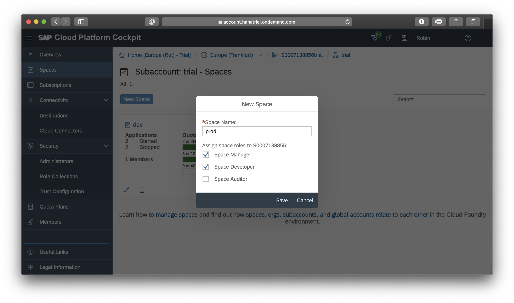

Click **Save** to dismiss the popup and create the new space. The newly created space `prod` is now available:

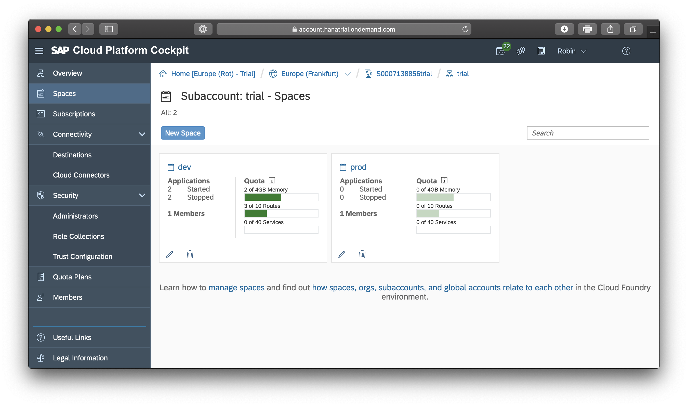

[DONE]
[ACCORDION-END]

[ACCORDION-BEGIN [Step 2: ](Create Cloud Foundry user in Jenkins)]

In this step, you will create a new set of credentials in Jenkins in order for it to be able to deploy to Cloud Foundry.

On the landing page of the Jenkins application, navigate to **Credentials > System**.

From the right pane, click the **Global credentials (unrestricted)** link.

From the left menu, click **Add Credentials** and provide the following details:

| Field | Value |
|----|----|
| Scope | **`Global`** |
| Username | **`<your Cloud Foundry username>`** |
| Password | **`<your Cloud Foundry password>`** |
| ID | **`CF_USER`** |
| Description | **`Cloud Foundry user`** |

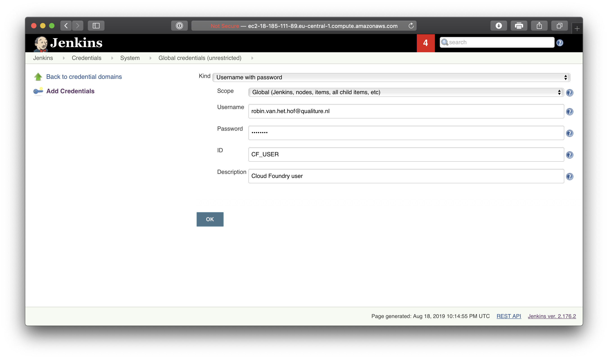

Click **OK** when done.

[DONE]
[ACCORDION-END]


[ACCORDION-BEGIN [Step 3: ](Change pipeline_config.yml configuration)]

Now the Cloud Foundry space is created and Jenkins has credentials to access Cloud Foundry, you can now implement the `productionDeployment` stage of the SAP Cloud SDK app's `pipeline_config.yml` file.

Open SAP Web IDE Full-Stack, navigate to the `cloudsdk-cf-aws` project, and open the `pipeline_config.yml` file.

Replace the commented-out section for `productionDeployment` with the following:

```YAML
  productionDeployment:
    cfTargets:
      - org: '<your trial organization>'
        space: 'prod'
        apiEndpoint: '<your cloud foundry api endpoint'
        appName: 'cloudsdk-cf-aws'
        manifest: 'manifest.yml'
        credentialsId: 'CF_USER'
```

For instance:

```YAML
  productionDeployment:
    cfTargets:
      - org: 'S0007138856trial_trial'
        space: 'prod'
        apiEndpoint: 'https://api.cf.eu10.hana.ondemand.com'
        appName: 'cloudsdk-cf-aws'
        manifest: 'manifest.yml'
        credentialsId: 'CF_USER'
```

The file should now look like this:

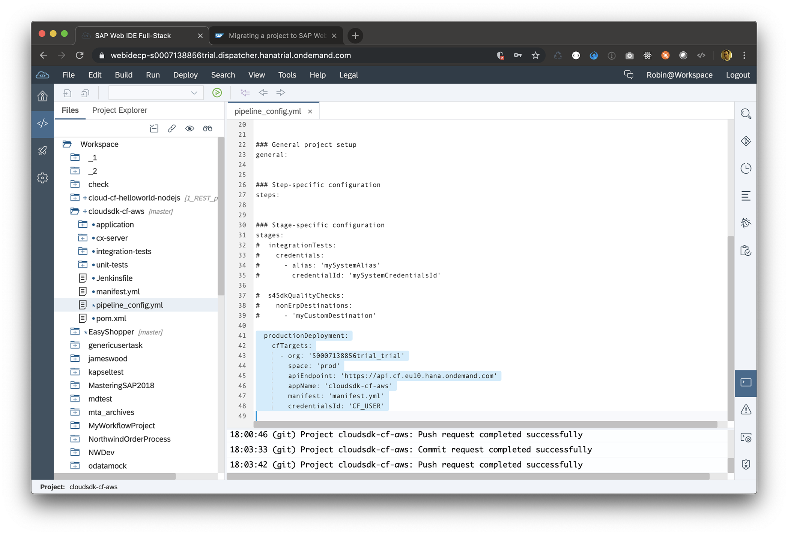

> As this is a YAML file, it is quite sensitive to indentation. Make sure the indentation is exactly as in the code sample and screenshot

[VALIDATE_3]

[ACCORDION-END]

[ACCORDION-BEGIN [Step 4: ](Commit and push the modified pipeline_config.yml)]

In SAP Web IDE Full-Stack, stage the modified `pipeline_config.yml` file and provide a commit message:

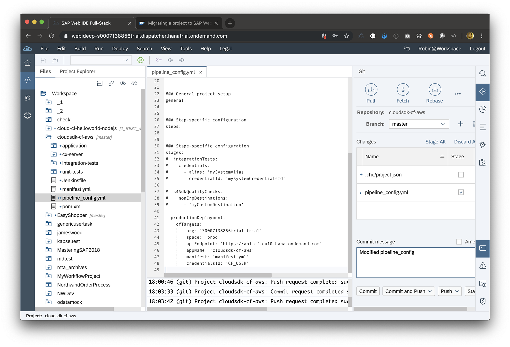

Click the **Commit and Push** button and select **Remote Branch**

[DONE]
[ACCORDION-END]

[ACCORDION-BEGIN [Step 5: ](Check the automated build process)]

Go back to the Jenkins landing page. The pipeline should now be in the running state.

> If not, make sure you have clicked the **Enable auto-refresh** link in the top right corner

Click the **Open Blue Ocean** to monitor the progress.

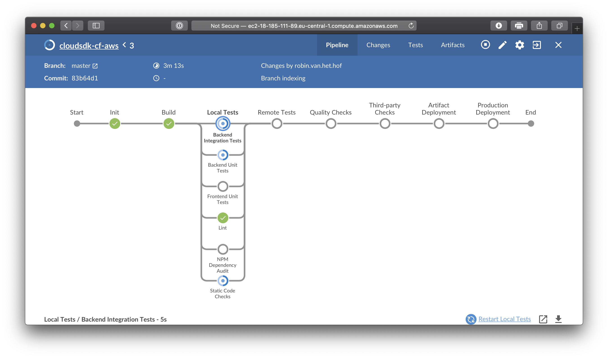

Once it is finished, you will see the **Production Deployment** step has also been carried out now:

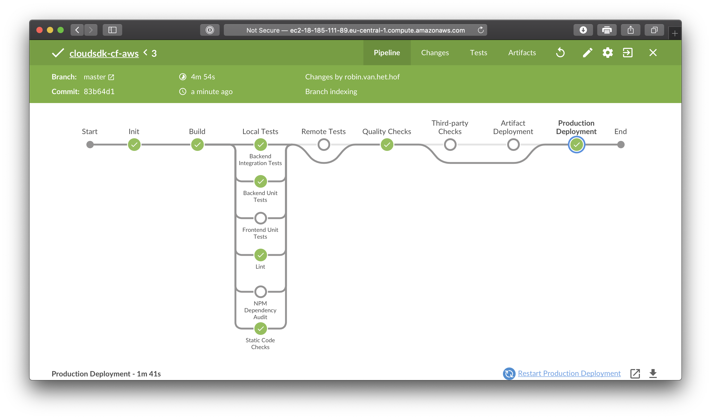

[DONE]
[ACCORDION-END]

[ACCORDION-BEGIN [Step 6: ](Create feature branch)]

While the above works, it is not a typical deployment scenario. As mentioned in the first tutorial, Trunk-based development is a branching model where all developers may create short-lived feature branches. When their code builds and successfully passes the automated tests, it will be merged into the master branch.

To create a feature branch, go back to your project in SAP Web IDE, open the **Git Pane** from the right icon bar, and click the **Create Local Branch** icon (depicted by the plus-sign)

At the popup dialog, enter the name of your new local feature branch:

```
feature-changeservlet
```

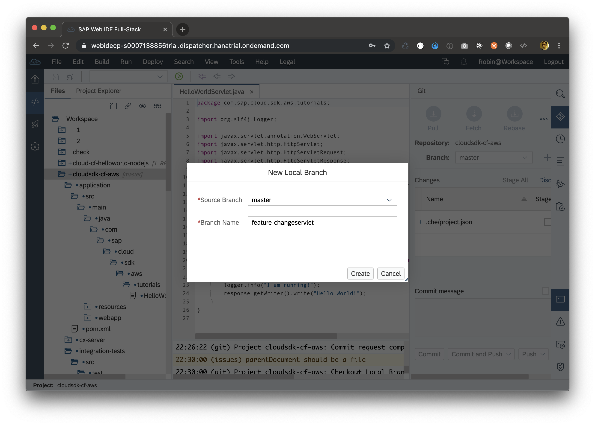

Click **Create** to continue.

To create a remote feature branch for this just created local branch, right-click your **`cloudsdk-cf-aws`** project folder and from the context menu, select **Git > Create Remote Branch**.

At the popup dialog, set both local as well as remote branch to **`feature-changeservlet`**.

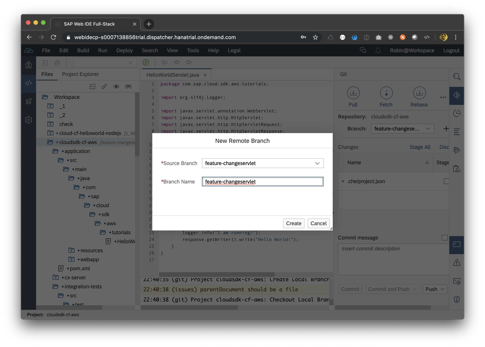

Click **Create** to continue.

<!--
To create a feature branch, open a browser to your GitHub account and navigate to your **`cloudsdk-cf-aws`** repository.

Click the button that currently says **Branch: master** and in the pulldown action menu, at the input field, enter the name of your new feature branch:

```
feature-changeservlet
```

At the bottom of the action menu, click the **Create branch: feature-changeservlet** button to create the new feature branch:

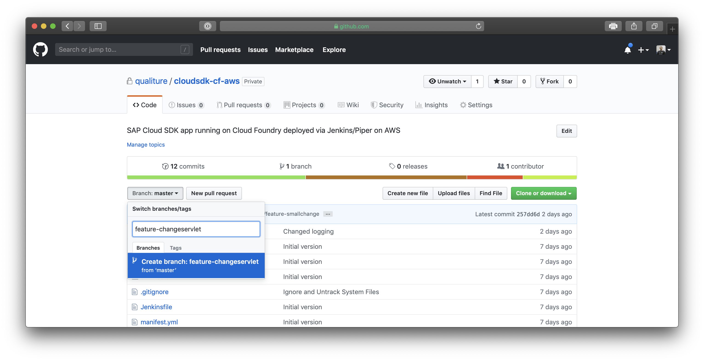
-->

[DONE]
[ACCORDION-END]

[ACCORDION-BEGIN [Step 7: ](Make code change)]

Open SAP Web IDE, navigate to your **`cloudsdk-cf-aws`** project, and open the **`HelloWorldServlet.java`** file from the **`application`** module folder.

In the servlet's **`doGet`** method, change the string that's written to the response from:

```
Hello World!
```

to:

```
Hello Universe!
```

Save the servlet, and from the Git pane, provide a commit message, click the **Commit and Push** button and from the pulldown menu, select **Remote branch**:

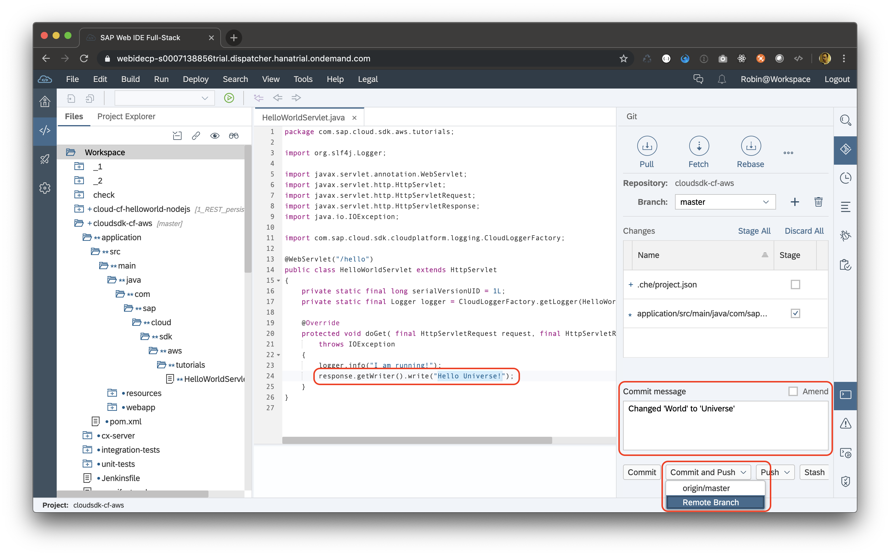

When the popup is shown to select the remote branch, make sure you have selected the new feature branch **`feature-changeservlet`** as the target:

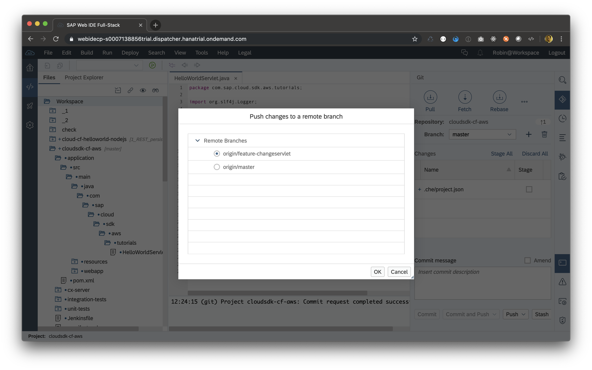

Click **OK** when done.


[DONE]
[ACCORDION-END]

[ACCORDION-BEGIN [Step 8: ](Check build status)]

If you now go back to Jenkins, you will see your **`cloudsdk-cf-aws`** multi-branch pipeline has triggered a build for the new **`feature-changeservlet`** branch.

Click the **Open Blue Ocean** link from the menu and let it run.

Most likely to your surprise, you will notice the automated build will fail in the **Backend Integration Tests** phase:


Scroll down a bit until you come across the console output for the failed integration test, and then the reason for the failed build becomes clear:

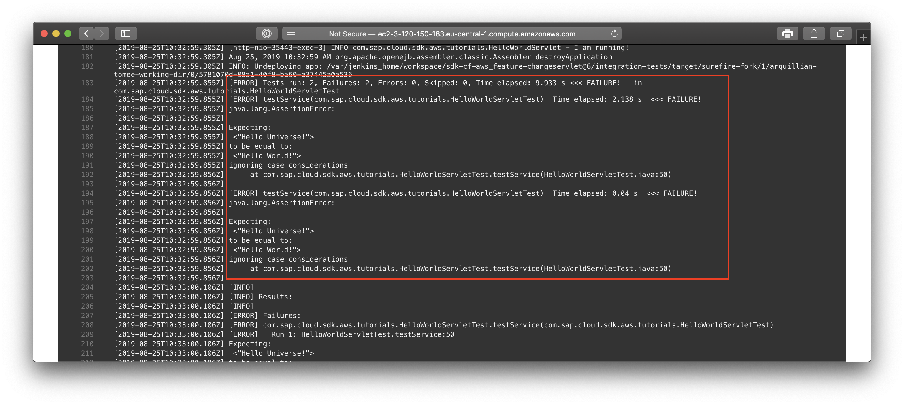

Apparently, the integrated test checks to see if the output is in fact **Hello World!** and will fail if it contains something different. You can actually validate this assumption by opening the **`HelloWorldServletTest.java`** file in the **`integration-tests`** module folder. It indeed contains a test that asserts the printed output contains **Hello World!**.


[DONE]
[ACCORDION-END]

[ACCORDION-BEGIN [Step 9: ](Create pull request)]

Go back the **`HelloWorldServlet.java`**  file and change the string that's written to the response back to **`Hello World!`** to make sure the test will pass.

Commit and push your changes back to the remote feature branch **`feature-changeservlet`**.

The test should now succeed, however, the build is **not** deployed to production:

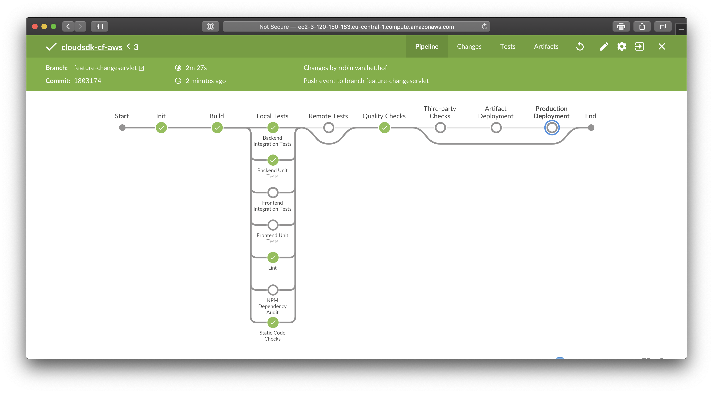

> The reason is the Project "Piper" pipeline is configured in such way that if you have committed and pushed to a feature branch, it will only run the tests and not deploy to production. Once all the tests have passed, you can be certain your code change will work on production and you can create a pull request to merge the working changes to the **`master`** branch. After it is successfully merged, it is then deployed to the production space.

> This automated approach eliminates the need for a dedicated test and QA environment, and time-consuming user testing.

To create a pull request, open a browser to your GitHub account and navigate to the **`cloudsdk-cf-aws`** repository.

You should now see a message that you have just pushed changes to the **`feature-changeservlet`** branch, and you have the option to create a pull request:

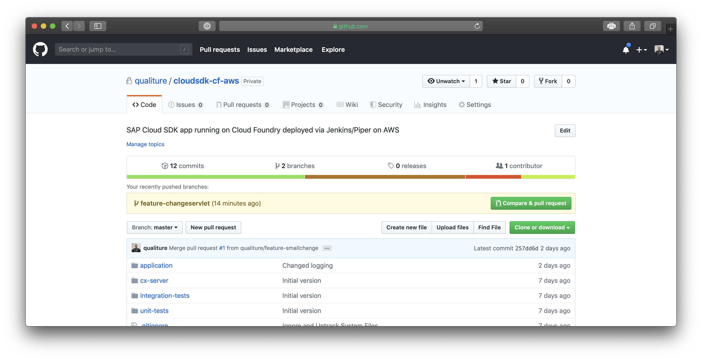

Click the green **Compare & pull request** button.

Provide a title and description for the pull request, and click the green **Create pull request** button:

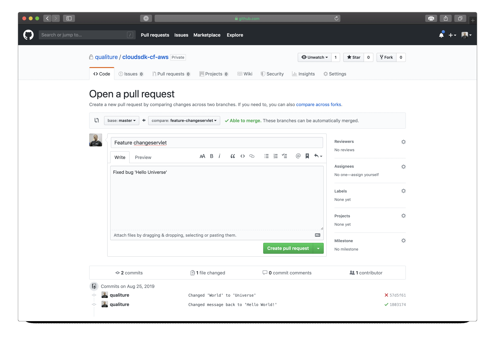

[DONE]
[ACCORDION-END]

[ACCORDION-BEGIN [Step 10: ](Merge pull request)]

A few seconds after you have clicked the **Create pull request** button, it will trigger the pull request build checks on Jenkins:

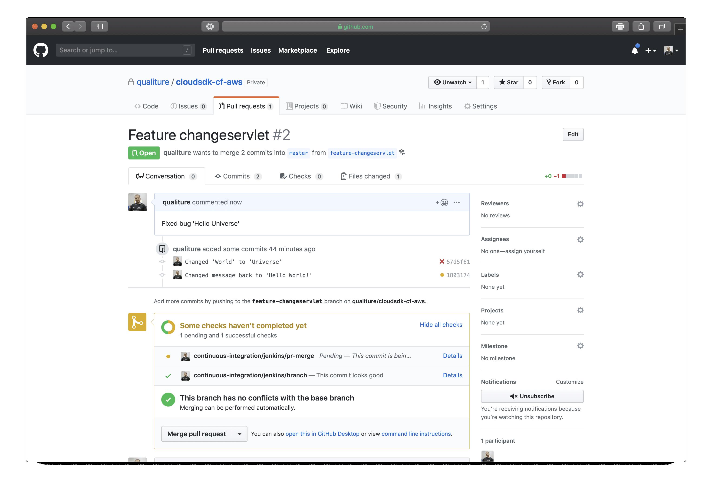

It will finish successfully on Jenkins, but still without pushing the changes to the production space:

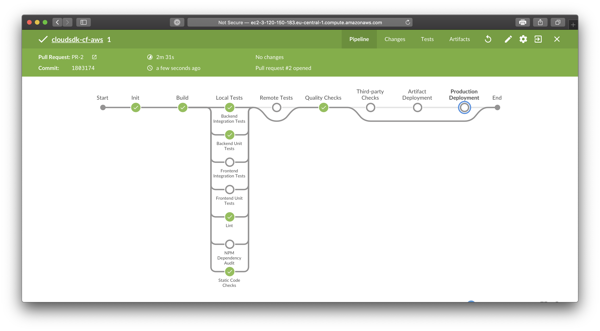

That is because you haven't yet merged the pull request. Only after you have merged the changes from the feature branch to the master branch, it will be deployed.

Go back to GitHub and check to see whether all Jenkins tests have passed. If all tests have passed, the merge button becomes available.

Click the green **Merge pull request** button to merge your changes.

Review the provided data, and click the green **Confirm merge** button to initiate the actual merge:

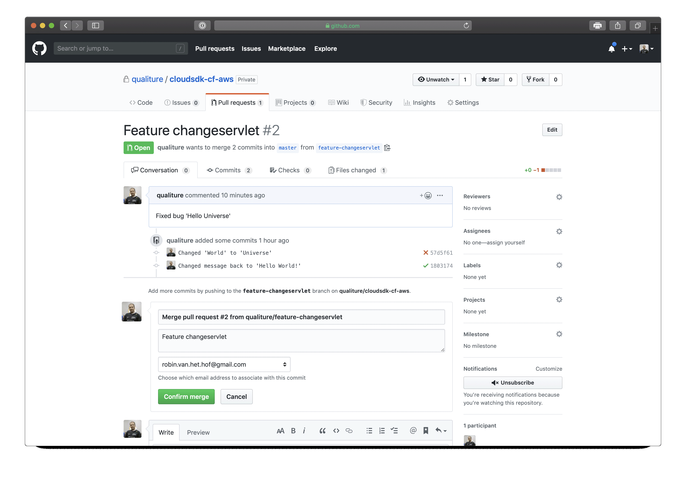

It should now finish with a successful merge into the **`master`** branch:

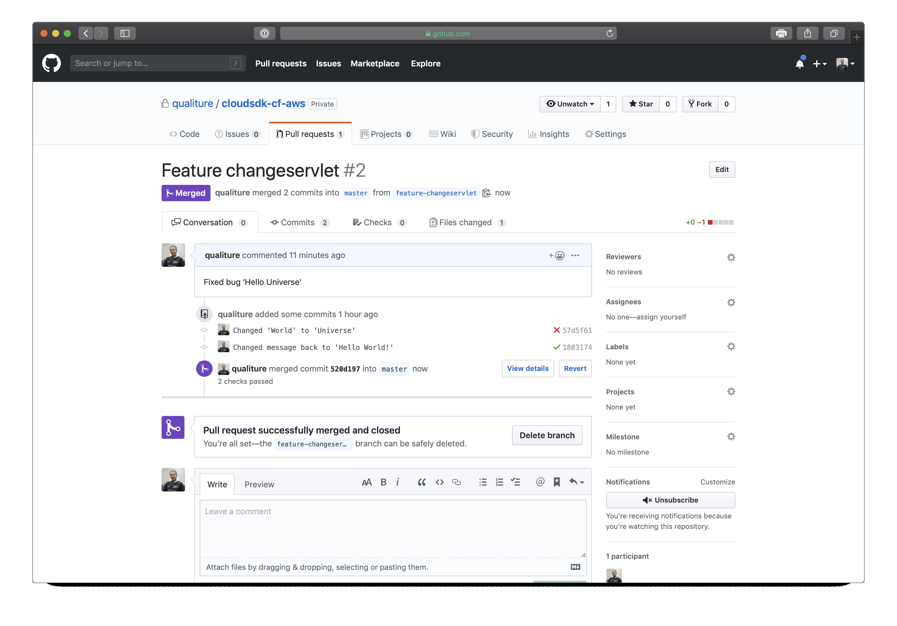

If you go back to Jenkins, you should now see the **`master`** branch is triggered for an automated build.

If all goes well, it will successfully run and deploy to the production space:

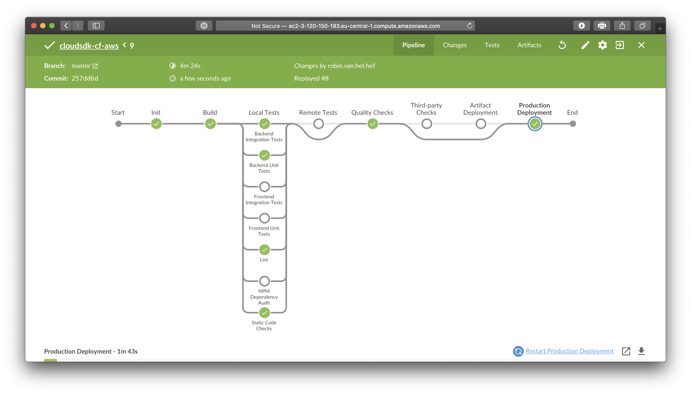


[DONE]
[ACCORDION-END]


[ACCORDION-BEGIN [Step 11: ](Check production deployment on Cloud Foundry)]

Go back to your Cloud Foundry account and once you're in the **trial** subaccount, click **Spaces** from the left menu. You should now see the `prod` space with a new running application:

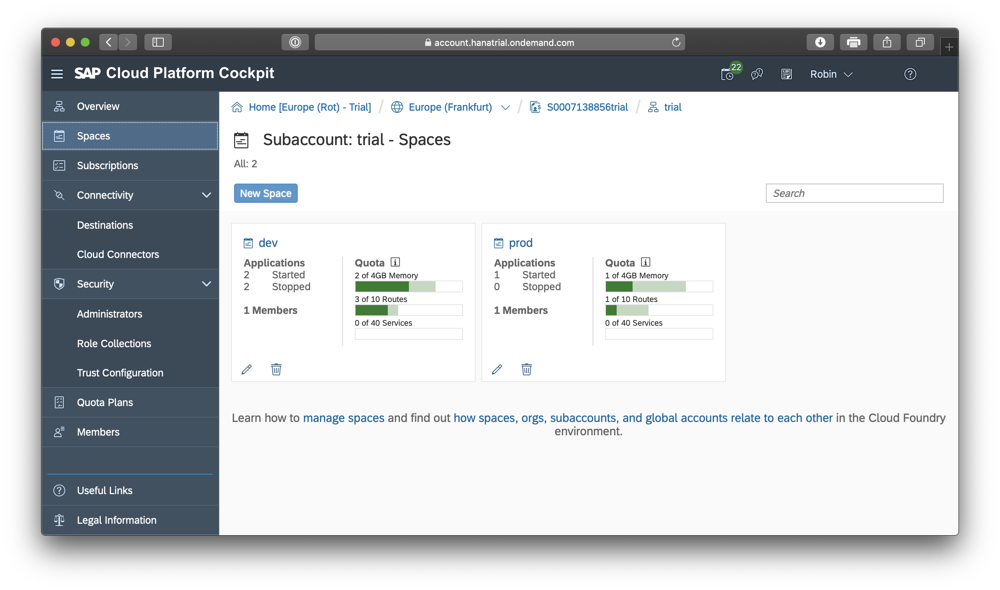

Click the `prod` space tile, and now you see the just application deployed via the pipeline:

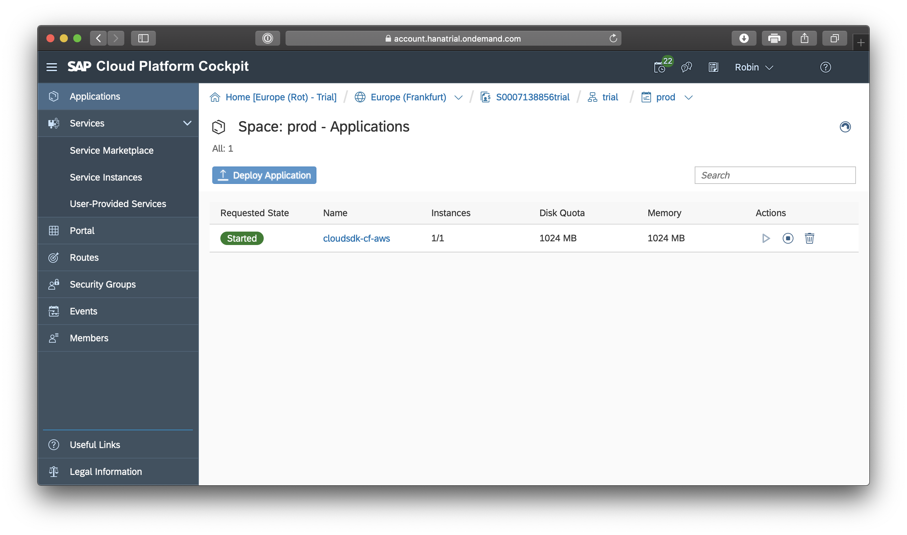

Click the `cloudsdk-cf-aws` application, and in the next page you will see the deployed application URL:

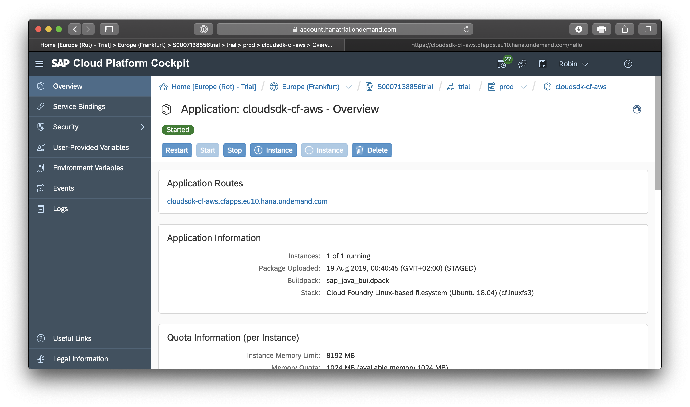

[DONE]
[ACCORDION-END]

[ACCORDION-BEGIN [Step 12: ](Run the app in the production space)]

Click the link in the **Application Route**. This will open the default page for your deployed app. Change the URL by adding the **`/hello`** route at the end, and now you see the `HelloWorldServlet` content:

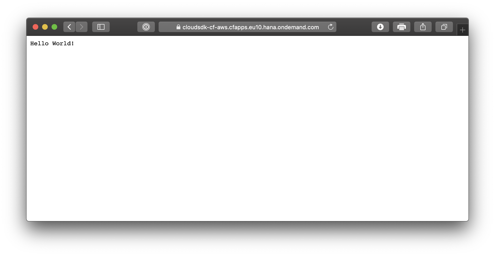


[VALIDATE_12]

[ACCORDION-END]


---
