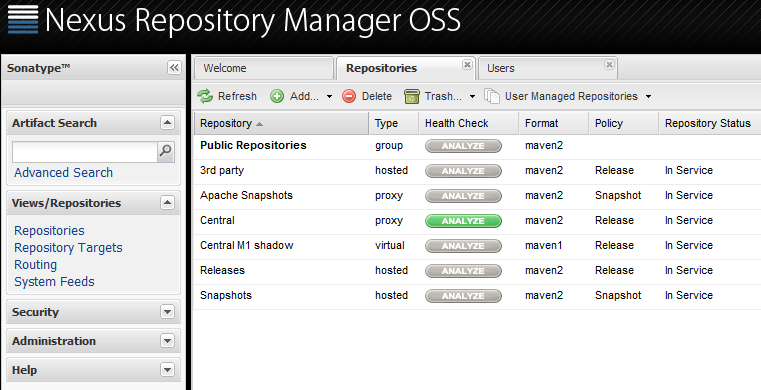

---

title: Continuous Integration (CI) Best Practices with SAP: Artifact Repository
description: Part 3.3: Setting up a Nexus Instance.
tags: [  tutorial>intermediate, tutorial:type/project  ]

---

## Prerequisites

  - **Proficiency:** Intermediate

## Next Steps
 
  - [Landscape Configuration](http://go.sap.com/developer/tutorials/ci-best-practices-landscape.html)
  - [Back to the Navigator](http://go.sap.com/developer/tutorials/ci-best-practices-intro.html)
  
---

What we offer in this part is not more than a basic recipe to set up a minimum installation including only those components on Linux that we consider as absolutely necessary to run a CI/CD process for development with SAP. However, the setup best suited to your concrete requirements cannot be part of this document because it highly depends on your concrete local situation, the network setup, the overall landscape into which the CI/CD process will be embedded, and so on. Therefore, we will restrict ourselves here to showing only the principles and the core elements.

If you are interested in other examples of CI/CD processes with a focus on specific needs and local conditions, just follow the references we provide to the official documentation for the described components. For each component, we provide hints to how the described setup could be improved. This concerns the professional and reliable operation, for example, further security activities and operational refinements.

Note: This document is restricted to the description of component installation on Linux. For installation on Windows, we refer to the installation documentation on the web.


There are a lot of artifact repositories on the market that would fit our purposes. In this document, we will show how to integrate the open source version of Nexus into the CI process.

### Nexus

Nexus is a repository manager, this means it is able to host many repositories. These may play different roles in the software development and release process (like snapshot and release repositories). Furthermore, it's possible to have repositories supporting different technical formats.
This document refers to a Nexus 2 release. In the future, Nexus 3 might also be appropriate, but there are still some features missing in release 3 in comparison to 2 (status April 2016).

> Homepage: http://www.sonatype.org/nexus  
> Downloads: http://www.sonatype.org/nexus/go  
> Installation guide: https://books.sonatype.com/nexus-book/reference/installing.html

#### Prerequisites

- An appropriate Java JDK version for Nexus is installed on the machine.

#### Procedure

1. On the nexus machine, create an OS user `nexus`. Any other OS user that will run the Nexus application will work as well, but this is the name we will use in this document.

2. Create a Nexus installation directory owned by `nexus`. In this document, we will use `/data/nexus`, but any other directory that follows the respective conventions will work as well.
    Ensure that the file partition of the directory is big enough to store all the Nexus data including the binary artifacts uploaded to Nexus.

3. Log on as `nexus`.

4. Extract the downloaded Nexus installation archive into `/data/nexus`.

5. Go into the configuration directory (which should be something like `/data/nexus/nexus-{release}/conf/`) and open the file `nexus.properties`. 
    In this document, we will keep the settings as they are, especially the default setting of the port Nexus is running with. But in your setup, you may choose whatever port is appropriate.

    ```
    application-port=8081
    ``` 

6. Switch to user `root` and create symbolic links as recommended by the Nexus installation guide:

    ```
    cd /usr/local
    ln -s /data/nexus/{the versioned nexus installation directory} nexus
    ln -s /data/nexus/sonatype-work sonatype-work
    ```

    Please note that the directory `sonatype-work` does not yet exist but will be created on startup of the Nexus application.

7. Switch to user `nexus` again and start Nexus with a browser on port 8081.

    ```
    /usr/local/nexus/bin/nexus start
    ```

8. Open the URL `http://{nexus host}:8081/nexus`. You should now be able to access Nexus and you should see some default repositories already configured, especially two of them named `Snapshots` and `Releases`.  

    
    
    Also, there is a user `deployment` that has access permissions for uploading artifacts. The default user for administrator access is `admin/admin123`.
    
    
    
9. To make Nexus productively runnable and secure, please follow the post-install checklist of the official documentation.
 
    > Documentation: https://books.sonatype.com/nexus-book/reference/install-sect-repoman-post-install.html   


## Next Steps
 
  - [Landscape Configuration](http://go.sap.com/developer/tutorials/ci-best-practices-landscape.html)
  - [Back to the Navigator](http://go.sap.com/developer/tutorials/ci-best-practices-intro.html)
