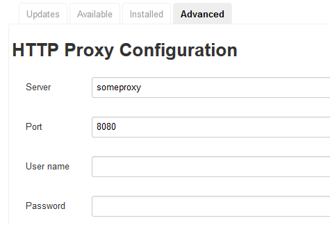

---

title: CI Best Practices Guide: Build Scheduler
description: Part 3.2: Setting up a Jenkins Instance.
tags: [  tutorial>intermediate, tutorial:type/project ]

---

## Prerequisites  

  - **Proficiency:** Intermediate

## Next Steps
 
  - [Artifact Repository](http://go.sap.com/developer/tutorials/ci-best-practices-artifacts.html)
  - [Back to the Navigator](http://go.sap.com/developer/tutorials/ci-best-practices-intro.html)
  
---

What we offer in this part is not more than a basic recipe to set up a minimum installation including only those components on Linux that we consider as absolutely necessary to run a CI/CD process for development with SAP. However, the setup best suited to your concrete requirements cannot be part of this document because it highly depends on your concrete local situation, the network setup, the overall landscape into which the CI/CD process will be embedded, and so on. Therefore, we will restrict ourselves here to showing only the principles and the core elements.

If you are interested in other examples of CI/CD processes with a focus on specific needs and local conditions, just follow the references we provide to the official documentation for the described components. For each component, we provide hints to how the described setup could be improved. This concerns the professional and reliable operation, for example, further security activities and operational refinements.

Note: This document is restricted to the description of component installation on Linux. For installation on Windows, we refer to the installation documentation on the web.


The build scheduler is the component in which build procedures are defined and builds can be triggered. One of the most popular build schedulers is Jenkins, but other solutions, especially on the cloud, are possible as well. 

### Jenkins Basics

Jenkins integrates well with polling (Gerrit) or event-based mechanisms (GitHub). It is available as open source tool and has a large community providing plugins for any purpose. It is easy to write plugins for Jenkins as well.

Jenkins works normally with several instances: one central master machine and arbitrary many slave machines. In this setup, the master only works as scheduler: it hosts the job definitions, metadata, and schedules. It triggers the builds and delegates the build work to a slave. A slave machine only runs a slim slave process that is connected and controlled by the master. The setup and installation of a slave machine, dependent on the requirements of the builds can differ significantly from the master. For example, it can host one or more JDKs (for java builds) different from the master. The slave may even run with a completely different operating system to support multi-platform builds.

Therefore, there are some important differences:

- The Jenkins master process running with a dedicated JDK version on the master.
- The Jenkins slave process or processes running with a dedicated JDK version on the slave.
- The build processes on the slaves. When compiling java, they may run with custom JDKs.
 
In addition, it is possible to run Jenkins also as a one-instance installation which means that builds can run directly on the master without using a slave. For very small projects and for process startup, this approach might be sufficient. But later on, when projects become bigger and the requirements for professional operation increase, a master-slave operation is highly recommended. One aspect to consider is that the Jenkins master is the single point of failure in the build landscape that should not be exposed to direct neighborhood of rather uncontrollable processes started inside a running build.

In this paper, we describe the master-slave installation. If you decide for a master-only approach, please also read through the Jenkins slave section since it describes the additional steps to be done on the master.


### Jenkins Master

This section describes how to set up the Jenkins master. The installation of a slave is described in the next one.

> Homepage, Downloads: https://jenkins-ci.org  
> Installation guide: https://wiki.jenkins-ci.org/display/JENKINS/Installing+Jenkins

#### Prerequisites

- Java JDK 1.7.0 or higher is installed on the machine for running the Jenkins master process.
- It is possible to install arbitrary other JDKs as compilation environment if builds are executed directly on the master.

#### Procedure

1. On the hosting machine, create an OS user `jenkins`. 
   Any other OS user that will run the Jenkins daemon works as well, but this is the name we will use in this document.
2. Create a Jenkins home directory owned by `jenkins`. 
   In this document, we call it `/data/jenkins`, but any other directory that follows the respective conventions will work as well. 
   Ensure that the file partition of the directory is big enough to store all the Jenkins data. 
   Keep in mind that all build logs (also of builds running on slaves) are stored inside this directory.
3. From the Jenkins web site, download the appropriate RPM package and install it as user `root` on the Jenkins master machine.

   ```
   rpm -i jenkins-{version}.noarch.rpm
   ```

4. Configure the Jenkins home, the Java home directory, the Jenkins daemon user and the Jenkins port in `/etc/sysconfig/jenkins`. 
   You must be logged on as `root` user.

   ```
   JENKINS_HOME="/data/jenkins"
   JENKINS_JAVA_HOME={Java home of your Java JDK installation}
   JENKINS_USER="jenkins"
   JENKINS_PORT="8082"
   ```

   Other port numbers would of course work as well depending on which ports are still available on the host.
5. In order to enable the Jenkins master to connect to Jenkins slaves, an SSH based connection mechanism is recommended.
   To prepare this, proceed as follows:
   - Log on as `jenkins` to the Jenkins master machine.
   - Create an RSA key (`id_rsa`, `id_rsa.pub`) pair in the directory `/home/Jenkins/.ssh`:

     ```
     mkdir /home/Jenkins/.ssh
     chmod 700 /home/Jenkins/.ssh
     cd /home/Jenkins/.ssh
     ssh-keygen
     ```

   - A copy of the public key will be needed on the Jenkins slave (see below).

6. Start the Jenkins daemon. Logon to the Jenkins master machine as `root` and execute:

   ```
   service jenkins start
   ```

   You should now see a Jenkins process running with user `jenkins`.
7. Open a browser and access the Jenkins master on port 8082. You should now be able to see the Jenkins master main page.
8. To enable the interaction with Gerrit for code review, some plugins have to be installed.
   In order to use the Jenkins plugin download and installation mechanism, your proxy has to be configured. On the Jenkins main page, go to "Manage Jenkins" / "Manage Plugins" / "Advanced", enter the needed proxy settings specific to your environment and choose "Submit".  
   
   
9. Now go to "Manage Jenkins" / "Manage Plugins" / "Available" and select

   - Gerrit Trigger
   - Git plugin
      
10. Choose "Download now and install after restart".
11. Log on as `root` on the Jenkins master machine and execute:

    ```
    service jenkins restart
    ```

12. To be able to connect slave nodes to the Jenkins master, the ssh user has to be defined in the applications. For this, open the Jenkins front end and go to "Manage Jenkins" / "Manage Credentials" / "Add Credentials" / "SSH Username with private key".
13. Enter the following data:  

    | Field | Value |
    | --- | ------------------------------------------------------------------------- | 
    | Scope	| `Global` |
    | Username | `jenkins` |
    | Private Key | `From the Jenkins master ~/.ssh` |

14. If the master itself is used for running builds, open "Manage Jenkins" / "Configure System" and go the JDK section.
15. Enter "JDK installations..." and choose "Add JDK".

    - Enter an appropriate symbolic name for your JDK installation used for builds.
    - Deselect "Install automatically".
    - Enter the `JAVA_HOME` directory of the JDK installation.

    Later on, you will enter JDKs for the slaves here as well.
16. Also in "Manage Jenkins" / "Configure System", you inform Jenkins about the Maven path to be used on the slaves (see below):

    | Field | Value |
    | --- | ------------------------------------------------------------------------- | 
    | Maven installations | Click on "Add Maven" |
    | Name | `mvn` |
    | Install automatically | `unchecked` |
    | `MAVEN_HOME` | Maven home path of the Maven installation directory on the slave (see below) |

17. Save.


#### Security Enhancements

It is a common practice to install the Credentials Binding Plugin. A Jenkins
job might need passwords, for example, to deploy to a system. You should never enter the password in clear text into the build file. Some tools have their own password handling, 
for example, Maven gets passwords for Nexus deployments from a `settings.xml` file.
The Credentials Binding Plugin enables Jenkins to provide credentials defined as environment variables 
to Jenkins jobs so that they can be accessed from within a build description.

1. In the Jenkins front end open "Manage Jenkins" / "Manage Plugins".
2. In the "Available" tab, select the "Credentials Binding Plugin".
3. Choose "Download now and install after restart".


#### Further Enhancements

- The `gerrit.war` package includes a standalone Jerry servlet container. Deployment on other JEE run times like Tomcat is also possible.
- Jenkins offers a sophisticated permission concept based on roles and also (after installation of the corresponding plugins) support, for example SSH or LDAP. These features will be required for a productively used Jenkins landscape to avoid misuse of administrative settings or unintended triggering of builds, for example.
- Since the Jenkins master will be a single point of failure, some additional isolation from the rest of the network with a firewall makes sense.


### Jenkins Slave

This section also contains parts that have to be done on the master in a master-only approach. In case, you are planning to run a master-only scenario, you do not need a slave machine. In this section only follow those steps that are marked with master-only (MO) and skip the rest.

If you plan to run a separate slave, follow all the steps.

In this document, we restrict ourselves to Linux as operating system for the slaves since only build technologies that do not depend on the underlying platform (like Java or Node.js) are in our focus. There is no explicit Jenkins software installation needed on the slaves (except of course, some basic tools that are needed to run a build, like Java, Git, Maven). Instead, the Jenkins master connects to the slave using SSH and places the slave jar there which is started automatically afterwards.

> Homepage: https://jenkins-ci.org   
> Installation guide: https://wiki.jenkins-ci.org/display/JENKINS/Step+by+step+guide+to+set+up+master+and+slave+machines

#### Prerequisites

- Java JDK 1.7.0 or higher is installed on the machine for running the Jenkins slave process. This Java installation should be the default and the `java` binary set in the `PATH` of the machine.
- (MO) To build SAP applications, SAP JVM 7.1 should be used since the SAP-specific SDK will run during the build.
  Mixing them up can lead to build problems due to incompatibilities.
  
  > Downloads: https://tools.hana.ondemand.com/#cloud  
  > Installation guide: https://help.hana.ondemand.com/help/frameset.htm?76137f42711e1014839a8273b0e91070.html
  
- (MO) Git installation.

  > Homepage: https://git-scm.com  
  > Downloads: https://git-scm.com/downloads  
  > Installation guide: https://git-scm.com/book/en/v2/Getting-Started-Installing-Git  
  
- (MO) Maven installation. The recommended version is Maven 3.0.5. Later versions might lead to build errors due to plugin incompatibilities.

  > Homepage: https://maven.apache.org  
  > Downloads: https://maven.apache.org/download.cgi  
  > Installation guide: https://maven.apache.org/install.html
  

#### Procedure

1. On the slave machine, create an OS user `jenkins`. 
   Any other OS user that will run the Jenkins builds on this slave will work as well, but this is the name we will use in this document.
2. Logon as user `jenkins`.
3. Create the file `~jenkins/.ssh/authorized_keys` (if not yet existing). 
4. Copy the contents of the public SSH key file that was created on the Jenkins master (see the section above) as new line in the `authorized_keys` file. 
   With this, user `jenkins` of the Jenkins master is allowed to open an ssh logon to `jenkins` on the slave machine.
5. Create a root directory for Jenkins.
   This is where the Build job workspaces will be located. In this document we will use `/data/jenkins`.
6. Connect the Jenkins slave to the master. For that, open the Jenkins Master front end and go to "Manage Jenkins" / "Manage Nodes" / "New Node".
7. Enter an appropriate node name (for example, the host name) and select "Dumb Slave".
8. Do the following configurations:

   | Field | Value |
   | --- | ------------------------------------------------------------------------- |  
   | Name | `{any logical name, for example the hostname}` |
   | Description |	`{any description}` |
   | # of executors | `{Number of parallel builds executable on the node. This depends on the load your build jobs produces and the resources of the machine. Start with 1 or 2 and try to increase it}` |
   | Remote root directory	| `/data/jenkins` |
   | Labels | `builds`|
   | Usage | `Utilize this node as much as possible` |
   | Launch method | `Launch slave agents on Unix machines via SSH` |
   | Host | `{DNS name of the Jenkins slave}` |
   | Credentials | `jenkins` |
   |  | `{Choose the "Advanced" button to see more properties}` |
   | Java Path | `{Path of the Java installation for the slave process. This may differ from the SAP JVM to be used for the builds.}` |
   | Availability	| `Keep this slave on-line as much as possible` |

9. Save.
10. (MO) Register the SAP JVM on the master. For this, open the Jenkins Master front end and go to the JDK section "Manage Jenkins" / "Configure System".
11. (MO) Enter "JDK installations..." and choose "Add JDK".
    - Enter an appropriate symbolic name for your SAP JVM 7.1 installation used for builds.
    - Deselect "Install automatically".
    - Enter the `JAVA_HOME` directory of the SAP JVM 7.1 installation.
        
12. Either the slave already connects automatically or you explicitly have to choose the "Connect" button. You should see the executors readily waiting for jobs.

#### Further Enhancements

- Like for the Jenkins master, a firewall could make sense, this time rather to guarantee the isolation of the builds to ensure reproducible build results independent on any side effect.
- When working with many slaves, the Maven `settings.xml` file is needed as identical copies on each of the slaves. A publication mechanism to avoid manual maintenance on each node would be useful.


## Next Steps
 
  - [Artifact Repository](http://go.sap.com/developer/tutorials/ci-best-practices-artifacts.html)
  - [Back to the Navigator](http://go.sap.com/developer/tutorials/ci-best-practices-intro.html)
