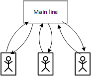
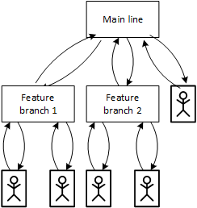
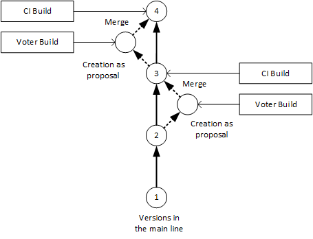
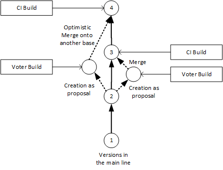
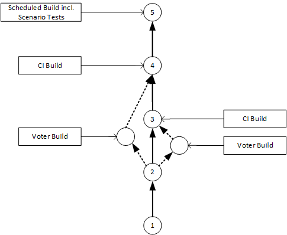

---

title: CI Best Practices Guide: CI/CD Practices
description: Part 2.1: The Practices and Principles of CI and CD.
tags: [  tutorial>intermediate, tutorial:type/project ]

---

## Prerequisites

  - **Proficiency:** Intermediate

## Next Steps
 
  - [Pipeline Suggestions](http://go.sap.com/developer/tutorials/ci-best-practices-pipelines.html)
  - [Back to the Navigator](http://go.sap.com/developer/tutorials/ci-best-practices-intro.html)

---

Continuous Integration (CI) and Continuous Delivery (CD) are both widely used in software engineering: CI as the adoption of agile principles, CD as a combination of agile methodology techniques with a high quality delivery process. Whereas CI deals with how to build up a software product from the contributions of single members of a development team in a controlled though lean way, CD focuses on validating every single change, preferably in an automated way, so that it is potentially shippable.

What exactly the latter means depends on the context. It could mean, for example, taking a web application feature productive or putting a software on a download site. The process is able to serve one-man-shops as well as multiple teams working on one product and it can be adjusted to the customers' individual requirements and constraints. It is also flexible in the sense, that you can decide "how agile" you want the delivery process to be, so there is no need to implement agile practices that might not suit the environment you are working in. At the same time you are free to expand the process as needed.

In this section we will outline the practices for CI and CD.

### Continuous Integration, Delivery and Deployment

The practices of Continuous Integration are well-known.
There are a lot of sources from where developers or build operators can get advice:

> Wikipedia: https://en.wikipedia.org/wiki/Continuous_integration   
> Martin Fowler: http://www.martinfowler.com/articles/continuousIntegration.html

Continuous Integration (CI) focuses on the controlled integration of any change that is created in a collaborative software project into a common so-called main line.

The CI practices are:
  - Everything is under version control
  - Automate the build
  - Run unit test in the build
  - Commit early and often
  - Build each change
  - Fix build errors immediately
  - Keep the build fast
  - Test in a clone of the production environment
  - Make it easy to get the latest build results
  - The build process is transparent for everyone
  - Automate the deployment

Continuous Delivery (CD) adds the following aspect to the Continuous Integration practices:
Any change is ready to be deployed to production from both a technical and a quality point of view.
At any point in time, the latest version of the product is built, tested and provided in a format that could immediately be shipped to customers or deployed to production just by pressing a button. But whether it is done, still depends on a release decision of the development team or delivery manager.

> Wikipedia: https://en.wikipedia.org/wiki/Continuous_delivery   
> Martin Fowler: http://martinfowler.com/bliki/ContinuousDelivery.html

By contrast, Continuous Deployment means that each change is automatically built, tested and deployed to production without manual interaction.

In this document we will mainly focus on Continuous Integration and Delivery only.

### Everything is Under Version Control

Everyone who started with collaborative development, or even as a single developer, has been confronted with the situation to develop and apply bug fixes in parallel and is familiar with the meaning of the word "version hell". To avoid this, there are two basic principles:
  - Define a single source of truth.
  - Put everything under version control.

The source code management system is the single source of truth for the whole process. It predicts the outcome of all the results in the CI process including your final product. Everything must be reproducible out of it, and at the end, it defines the contents of your product including its quality. Any other system (like the artifact repository to be discussed later) has secondary character. For example, if there are doubts about the validity of build or test results, always rely on the sources and rebuild the artifacts, and run the tests again out of the sources.

Hence, caring about the health of the source code management system and making it the leading component in the whole process is the first duty of the build operator. However, using a version control system alone is not enough, it is important how it is used.

#### The Main Line

The contributions of any developer have to converge to a common result, and therefore the definition of a common main line or main integration branch is crucial. Any change is has to be integrated into this unique main line, otherwise it will not become part of the final product.

There are many models how to set this up. In the simplest case, one main line might be sufficient. Whenever a developer starts implementing a feature, he gets a copy of the current snapshot of the main line to his local disk (this is often called pull). The coding starts on the developer’s PC when the local version is up-to-date. Whenever the developer has finished the feature, it's his wish to integrate the change into the main line (push).

Since in general, the main line has evolved further in the meantime, the developer has to rebase his change. This means, he has to merge the current state from the main line with the changes done locally. As a result, the local change is a successor of the main line's current version.
All versioning tools come with features to support this kind of merging in one or another way. The technical details are not of interest here and especially, the high-level term "rebase" used here should not be confused with a Git feature of the same name (Git rebase could be used but does not have to. Often Git merge is more appropriate).

Unless other changes came into the main line in the meantime, the developer can now push the change safely into the current main line (without the risk of introducing any regressions into the current main line). The change is then a part of the most current snapshot and can be pulled again by other developers.

#### Feature Branches

In more complicated scenarios the following could happen:
  - A lot of developers, for example, many more than 10, are working on the project. 
  - Not all changes are meant to be integrated at once into the main line. It is a common practice of especially big organizations that larger features and prototyping are developed isolated from the main line first and integrated into it at a later point in time.

In these cases, so-called feature branches are the common solution. What was described above for single developers, can be done as well on a team level using dedicated branches that are created for a given amount of time as children of the main line.

Developers who are working on a dedicated feature, are not working with the main line directly, but with the feature branch instead. Though the mechanism is the same, the developers of the feature are using this branch as their integration branch. It becomes interesting when the team decides that the feature is ready and can be integrated into the main line. Here, the person responsible for the feature branch has to rebase all the changes to the current state of the main line.
Similar to the single developer scenario, this means that the latest version of the main line is
merged into the feature branch to make the current version of the feature branch a successor of the latest version of the main line.
This might cause a high merging effort. Therefore, you should follow the recommendation to do the rebase as frequently as possible.
When the feature branch is rebased, its changes are ready to be pulled into the main line.

Thus, the principle to follow the fetch - develop - rebase (merge) - push cycle is always the same on any level of the branch hierarchy that was created to best fit to the requirements of the development project. Even sub-feature branches as children of the feature branches could be handled in this way. 

#### Key Learning

Version everything, define your main line.

### Automate the Build

The stories of developers who complain about build breaks and answers from other developers like "it works on my machine" are legendary. The solution is an automated, standardized build procedure with an automatically running "central build". The build result is the only reference when it comes to the question whether the project is broken or clean from a build perspective.

For the sake of being reproducible for all team members, the build description must contain - and also declare - all the dependencies that are needed to execute the build. For example, this also includes the environment in which the build runs. In the ideal case, calling the build tool could be implemented as a bootstrapping mechanism that guarantees the proper, standardized installation of the build tools and checks their up-to-date state.
In this case, the developer does not have to care about the installation at all and the risk of having build problems caused by improper installations on the developer’s PC is minimized.

A build scheduler like Jenkins is of great help for the operation of a central build infrastructure:
  - It offers comfortable front ends as an entry point for end users to trigger builds, monitor them, and so on.
  - It provides interfaces that are needed to integrate the builds with other components of the CI process.

#### Key Learning

Set up a central, reproducible build.

### Run Tests in the Build

Builds are not restricted to validating the syntactical correctness of the code. There are several kinds of tests:
  - Component (unit) tests
  - Static code checks
  - Scenario tests

The difference is as follows:
  - They operate directly on build results (unit tests) or sources (static code checks).
  - Or they require the newly built application to be installed and started or to be deployed on an already provided runtime system.

In any case, tests should automatically run in the build, enabling developers to avoid regressions and failures in an early state. Whenever it is possible to add an automatic test by writing additional code especially in the form of unit tests but also in the form of scripts which automatically install, start, and test the application, this should be done.

Unit test frameworks are available for many source code technologies, most prominently, junit for Java.
For runtime tests, there are a lot of tools that allow implementing interactions with the software to be executed automatically and checking its behavior with the expected one. There are even frameworks to test graphical UIs like Selenium.

Thus the build does not restrict itself anymore to the pure role of syntactical validation of the source code and production of the build artifacts (which then could turn out to be unusable from a functional point of view). The build also acts as a hurdle to ensure the functional correctness of the product (see also section "Build Each Change").

Having these tests implemented in early stages as part of the build (that is executable on the developer’s PC, see above) saves time that otherwise would have been wasted on bugs being discovered only late in the development process.

#### Key Learning

Do as much automated testing as possible in the build.

### Commit Early and Often

As stated earlier, in a distributed development project with a number of developers, every developer aims to integrate his changes with the main line (the same applies for feature branches and their integration into the main line). We recommend to do this frequently, or rather as often as possible for mainly two reasons:
  - Merging local changes with the current version of the main line becomes more and more complicated and time-consuming as the main line evolves further.
  - From the product's quality point of view, the risk of instabilities introduced by a new change increases when the distance between the original base of the change and the current main line version has increased.

What is found in literature is that every developer should do a push of changes at least once a day. That is for sure true for the branch in which the developer normally works. This could be a feature branch. For large projects, the challenge is to balance this principle to what was said about the usage of feature branches above. There is no "golden rule".

#### Key Learning

Do not accumulate changes and then try bulk merges into the main line. Instead, integrate in small steps.

### Build Each Change

As already described, any change aims to be integrated into the main line. However, from the point of view of the main line, each single change that is integrated or pushed into the main line bears the risk of destabilizing it and affecting many other developers who rely on its integrity. To balance the conflicting interests, a continuous build mechanism which builds each change that should be integrated into the main line, was introduced. Building each change is maybe the principle that represents best the basic idea of a CI process.

The typical CI build builds any commit in the main line as soon as it integrated there. This also includes any automated testing that is triggered right after the build. It enables the developer or the team to identify whether the change does any harm. To always have a clear impression of the quality of the main line, the CI build is absolutely required. 

A broken CI build requires immediate action since the quality of the main line is not only at risk, but it is already spoiled. Developers have to prepare a fix as soon as possible to recreate the status of the main line so it can be built again.
This might be expensive since, depending on the frequency of commits being entered into the main line, it blocks the whole evolution of the main line. It is always cheaper to avoid this kind of situation right from the beginning.

Though it is not possible to avoid broken main lines completely, you can avoid most of such problems by using so-called voter builds, also called "Pending Head".

> Martin Fowler: http://martinfowler.com/bliki/PendingHead.html

The developer first proposes a change that is not yet integrated into the main line. This feature is implemented for example in Gerrit as push for review. In GitHub there is the pull request mechanism. Builds can be scheduled automatically on the proposed change before it is integrated into the main line. Thus the voter build, as a kind of measuring device for the quality of a change, brings up problems before they can pollute the main line and require re-work.

It is important to mention that voter builds are not sufficient to prevent the main line completely from harm. The reason is that source code versions on which voter builds run differ, in general, from versions on the main line.

To make this clear, first assume a simple scenario, where changes run into the main line purely sequentially
and do not overlap. The figure below shows that one developer creates a change based on version 2 and proposes it. After a successful build, it is merged into the main line as version 3. Another developer may take this new version as a basis for his change that is finally integrated as version 4 into the main line.

In this example, the results of voter and CI builds are identical since the merge is trivial. Content wise, it results
in the same version.

But when changes are created more frequently, the chance that the processing of different changes overlaps increases.
A situation as shown in the next figure is rather common, where two changes both based on version 2 are created in parallel proposals. We assume that the right one wins in the sense that it is built and merged into the main line as version 3 before the left change has the chance to.

In most cases, the left change can be merged into the main line as version 4, applying an automatic optimistic merge strategy. This applies in the case that the two changes touch completely disjoint code sections. Most source code repositories offer optimistic merge strategies that in the generic case work very well without requiring manual interaction. But it is clear that the voter build and the CI build are operating on different versions.

In the end, it is the CI build alone that tells the truth about the quality of the main line.

There are cases in which the optimistic merge does not work, namely when the two changes overlap. Then the developer who authors the left change must first rebase his change to version 3. Then the change has the chance to get merged into the main line as version 4.

What are the technical requirements that have to be fulfilled for the voter and CI builds to be reliable? To ensure the integrity of a build, it must run on a separate build machine which is set up in a reproducible way and managed by a build operator. By contrast, builds on a developer's PC, whose setup and status is not clear, will not be reproducible as well.
In the picture of the build as a measuring device, it's always important to keep the correct calibration.

In a more complicated development landscape with some feature branches in addition to the main line,
central CI and voter builds that are set up in the same way as for the main line, are recommended as well. Not implementing automatic builds and tests on the feature branches will lead to a much higher integration effort when it comes to pushing from the feature branch into the main line. Here, the principle "Fail Early and Often" is applied.

#### Key Learning

  - Keep the main line clean.
  - Build and automatically test each change that flows into it.
  - Implement CI and voter builds.

### Fix Build Errors Immediately

As a consequence of the "Build Each Change" principle, developers are obliged to react on build errors immediately.
This is quite obvious for the - not recommended - approach of monitor builds, because the change has broken the main line and all developers of the team are affected. In the worst case, they are not able to continue their work.
If voter builds are applied, the risk of spoiling the main line is minimized, so the build errors by one developer do not affect other developers. Nevertheless, the developer who has broken his own build is urged to fix it. Otherwise, any sequel build done by the developer will fail and accumulate problems from change to change.

So as a conclusion of both principles, we can state the developer’s workflow is change - commit - build - fix.

#### Key Learning

Do not accumulate build errors but fix them as soon as they are identified.

### Keep the Build Fast

Having accepted what was said before, the build and test steps that are executed automatically after proposing a change make up a central part of the developer’s workflow. The developer should not have to wait too long for CI build and test results of the change since this might block him from continuing his work. Therefore, performance of CI builds including the tests are of high importance.

There is always a conflict of interest for which one has to find the right balance: one is to make the integration of new changes into the main line as secure as possible, therefore the interest is to do as much validation, testing, and so on, as possible. On the other side, building, testing, and especially scenario testing might take some time. This conflicts with the wish to have fast builds.

For small projects for which building, testing, and so on does not exceed, let’s say 15 minutes, the waiting period might be acceptable. As soon as the project grows larger and the amount of time that build and tests take increases, the acceptance will decrease.

Therefore, a compromise must be found between different levels of acceptance criteria:
  - Those that are considered as crucial for the quality of the main line. Each change merged must fulfil them.
    This includes of course the syntactical correctness, but also unit tests and fast-running scenario tests. They have to run in the CI builds and maybe even in the voter builds.
  - More exhausting scenario tests that take longer than what would be acceptable for a CI build.
    For running these tests, additional scheduled builds could run independently from the CI builds. They do not block the developer, since their processing time does not play such an important role.
    The frequency of the scheduled builds depends on how often the current snapshot of the main line should be intensively tested. Even a test of every single change that is integrated into the main line would be possible. Scheduled builds for subsequent changes may eventually overlap in time, hence they require enough machine capacity.

For scheduled builds, we recommend to reuse the build results from the CI build instead of doing the same build again.

#### Key Learning

Balance between build performance and the number of tests that are required to be run inside the CI build.

### Test in a Clone of the Production Environment

One could interpret this principle as an extension of the famous “but it works on my machine” syndrome.
Different setups, different environments on different stages of a production pipeline are always a cause of errors. What is obviously true with respect to the relationship between local builds on the developer’s PC on the one hand, and central builds on the other hand, cannot be omitted with respect to the relationship between test machines and productive landscape. Make sure that the machines on which scenario tests are executed are comparable to the final production landscape.

So far so good, but the problem is always how to achieve this. When using traditional physical hardware with manually installed and configured software, it is almost impossible to avoid divergence: production and test machines, or any two different environments, will move away from each other with time.

The solution to this problem is to treat the setup and configuration in the same way as writing code (this principle is sometimes referred to as DevOps). Any software and configuration that is installed on a machine is described in source files to enable you to recreate the setup of the machines. To do that, use automation tools (for example, Chef, Puppet, Salt, Ansible, and so on). Whenever a change in configuration is needed it will be done by applying a change to those scripts. This change can then be rolled out to the machines in a controlled and reproducible way. This approach is especially well suited when working with virtual hardware. Bringing up new virtual machines, providing them with the needed software and putting them into production can be done completely automated by pressing one single button.

It is not state of the art to install the software directly on the hardware (be it physical or virtual) but to run the applications inside containers (like Docker) that are instantiated from predefined images.

The key principle is that the setup of the machine is always reproducible. Always ask yourself the question whether you would be able to set up a dedicated machine again in exactly the same way from scratch by simply pressing a button.

#### Key Learning

Use the infrastructure-as-code approach to set up your landscape in a reproducible way.

### Make it Easy to get the Latest Build Results

In addition to the automatic build and testing features described above, in the CI infrastructure, there will always be the need to do some manual test or experiments with the newly built application.
The build infrastructure itself, that means, the build servers, mostly are and should run encapsulated. This is mostly due to security reasons, since make servers should run without being disturbed by any unauthorized access with the risk that build results are spoiled. But it also has the effect that developers who have a valid interest in getting the newest version of the application are not able to download it directly from the build server.

Therefore, you need a central place that developers know about, where they can get the newest versions (any maybe also older versions) of the artifacts. First of all, it is important that this place is reliable in the following sense:
  - A developer is always able to easily find what he is looking for.
  - Only official build results find their way there. Unauthorized changes on the artifacts (for example, manual replacement of build results) must not be possible.

A build result storage could be implemented as a file share. But then build operators or internal infrastructure operators have to do the design and implementation by themselves, which could be highly nontrivial.
The naive approach "just to store the artifacts to a central share" will result in trouble later when it turns out that:
  - More than one application has to be stored.
  - More than one version has to be kept.
  - The application has to be built for more than one platform.
  - More than one build variant is needed, and so on.  
  
The storage of the artifacts has to take care of all these dimensions.

Therefore, a central repository for artifacts is the appropriate solution to store and provide build results for developers as well as for other processes that may rely on artifacts. There are some products offered on the market. In the Java world, Nexus is one of the most common ones.

#### Key Learning

Define a unique and well-organized place for storing build results. Use an artifact repository manager.

### The Build Process is Transparent for Everyone

This principle means that the status of the build process, and therefore the quality of the product, is visible for everybody. For me as a developer, the following questions are of interest:
  - Was my last (or any) change built?
  - Was it tested?
  - What were the build and test results and was my change merged into the main line?
  
The same questions apply to a change of another developer that I am relying on.

After a change was committed by a developer, it is processed in the CI process chain.
Different tools are involved: the source code management tool, the build scheduler, the test landscape, the artifact repository and maybe some others. At any point in time, a change is in a dedicated status (for example, pushed, waiting for build, built with success/error, being tested, and so on) and might be processed by one of the listed components. Everybody must be able to easily get the status information on every single change.

A central entry point to access the information is key. The provisioning could be done by some kind of orchestration tool that could cover both: the control of the complete process pipeline and the transparency of the process state to the developers. In the sample cases described in the later sections, we will see that a change review tool (for example Gerrit) will play this role in tight collaboration with a build scheduler (for example Jenkins).
Gerrit acts as entry point for the changes, it can be accessed by anybody and any tool playing a role is able to write back a notice such that the overall status is always reproducible there.
Another approach is to use Jenkins with the Flow plugin which offers to developers and build engineers an end-to-end overview of the CI pipeline.

#### Key Learning

Implement a single entry point to retrieve status information.

### Automate the Deployment

Deployment, that means the installation of the application to a runtime system, should be done in an automated way.
Automated deployment can be done in several ways and for different purposes:
  - Automated scenario tests that already run in the build, or as a separate process that can be triggered by or after the build (which does not make any difference from a semantic point of view). The intention is that the scenario tests that must run against a running application are part of the acceptance process for a change proposed or committed by the developer. Different implementations are possible.
  
A single runtime system (like a JEE server) that is waiting for deployments would be sufficient in the beginning, but this approach has some drawbacks. Since it is a single instance, the test requests out of the CI process would have to be serialized to avoid clashes from two parallel test requests. A high amount of changes will make this instance a bottleneck.
Another point is that working always with the same instance bears the risk of degeneration of the system with time. It would be a better approach install and start the runtime system on demand during the build. This could be done on the temporary file system that is dedicated to the single test execution instance, or – much more elegant – container technology is used (like Docker) to bring up the runtime system on demand in a well-defined state and to remove the container after usage without polluting any hardware.

  - Provisioning of a test system for manual tests: In a CI build scenario, this might not be appropriate since the frequency and time of the validation of new commits is not really predictable. It makes much more sense to provision manual test systems from a scheduled build that, for example, runs daily at a given time, deploys to the test system, and notifies the tester after successful deployment. What concerns the implementation of runtime system, all what was said before applies here as well though the risk of bottlenecks and collision of different tests is not given here. So one single runtime instance dedicated for this purpose could do the job in a satisfying way. This approach is also capable of supporting a staged environment (several test instances of different stages, that means, quality levels), as desired.
  - The ultimate level of automation is the automated deployment into the productive environment.
  
As a post-step of the CI build, you should only do this if the risk of breaking something is minimized. This approach applies only when manual tests are not needed any more and every test is already done automatically.

Therefore, it is not a good idea to do this extreme level of automation but instead, but instead, usually triggering the deployment to production is done manually after a conscious decision to release. Nevertheless, an automated framework should support the manual step that is still needed as much as possible. For example by just pressing a "release" button, the process framework should automatically start the deployment job to the productive system.

As clarification of the term "continuous delivery", what is not meant by this is that any change is always deployed automatically at once. Continuous delivery means that any change integrated is validated such that it is ready to be productively deployed to production. The decision to release is still left to humans and the deployment is triggered manually.

#### Key Learning

Do deployment as automatic post-build step. Also deploy automatically to production systems, but manually triggered.

## Next Steps
 
  - [Pipeline Suggestions](http://go.sap.com/developer/tutorials/ci-best-practices-pipelines.html)
  - [Back to the Navigator](http://go.sap.com/developer/tutorials/ci-best-practices-intro.html)