---

title: CI Best Practices Guide: SAPUI5/SAP Fiori on ABAP Front-End Server
description: Part 4.4: Implementing the CI pipeline to build an SAPUI5/SAP Fiori application on ABAP Front-End Server.
primary_tag: products>sap-cloud-platform
tags: [  tutorial>intermediate, tutorial:type/project ]

---

## Prerequisites  

  - **Proficiency:** Intermediate
  - [Source Code Versioning System](http://www.sap.com/developer/tutorials/ci-best-practices-scm.html)
  - [Build Scheduler](http://www.sap.com/developer/tutorials/ci-best-practices-build.html)
  - [Artifact Repository](http://www.sap.com/developer/tutorials/ci-best-practices-artifacts.html)
  - [Landscape Configuration](http://www.sap.com/developer/tutorials/ci-best-practices-landscape.html)
  - [Generic Project](http://www.sap.com/developer/tutorials/ci-best-practices-generic.html)

## Next Steps

  - [Back to the Navigator](http://www.sap.com/developer/tutorials/ci-best-practices-intro.html)

---

> This document is part of the guide [Continuous Integration (CI) Best Practices with SAP](http://www.sap.com/developer/tutorials/ci-best-practices-intro.html). For all the examples working properly make sure that you have followed the setup instructions for all components listed in the prerequisites box.


### 1. Introduction

For Fiori and SAPUI5 development there is a lot of infrastructure available to support single developers who are creating and maintaining SAPUI5 or Fiori projects. SAP Web IDE provides a rich tool set to support single developers or small teams; for example, wizards that generate a skeleton, and the metadata files that are required for new projects. The larger the team is, however, the more urgent is the need for an automated CI process based on a central build that includes automated testing and code quality checks.

The runtime used in this chapter's scenario is an ABAP front-end server. ABAP systems are usually part of large landscapes, in which change processes are managed by life-cycle management tools using ABAP transport requests. The most common ABAP system setup is a staging landscape that consists of a development system, an acceptance testing system and a productive system. The systems are linked to each other in this order by transport relationships. Usually, direct modification of objects in the productive system is not permitted. Instead, changes must be applied to the development system under governance of a transport request. The changes make their way to the productive system only through the transport request.

The CI process can coexist with the ABAP life-cycle management process in the following way: the CI process ensures the quality of the code that is implemented outside the ABAP system. It converts the sources into the correct format (mainly minification and preload generation), runs automated tests and code checks, and finally produces an artifact that is ready to be uploaded to the ABAP development system. From this point, ABAP life-cycle management takes control and governs the delivery process, which usually includes transporting the changes into the test system, and later into the productive system. From the perspective of software delivery to production, ABAP life-cycle management is the leading process; the CI process supports development, and is a preparation step for providing the objects being uploaded into the ABAP development system.

Hence, the delivery process infrastructure for SAPUI5 or Fiori objects consists of two distinct parts:

A. The CI process outside the ABAP system: processes single code changes, verifies and tests them automatically, minifies them, produces a preload file, and provides a zip file containing the application. A CI server (Jenkins in our example) is used for this.

B. ABAP life cycle management: controls the transport of the changes from the development to the test system (where acceptance testing can be done), and finally from the test system to the productive system.

The upload into the ABAP development system seems to stand between these two parts. But since it is not part of the artifact creation in the CI build and requires the existence or automated creation of a transport request in the system, it more logically belongs to ABAP life-cycle management. Nevertheless, the upload can be triggered automatically immediately after the CI build. Alternatively, a manually triggered upload is possible.

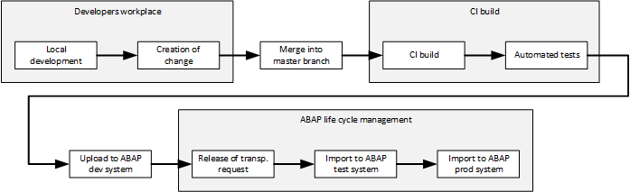

Figure 1: The high-level process flow


#### A. Overview: the CI Process

1. Developers use SAP Web IDE to work on a SAPUI5 or Fiori project. For immediate testing, they run the application directly from SAP Web IDE on SAP Cloud Platform.

2. In SAP Web IDE, the developer creates a commit and pushes it for review to the Gerrit instance.

3. The voter build starts and executes static code checks and automated tests.

4. The change is reviewed by another person. Provided the assessment of the change was positive and the voter build successful, the change is merged into the master branch.

5. The CI build starts. It executes the following steps:

    - Static code checks for JavaScript.

    - Automated tests.

    - Minification: the load on the network can be reduced by removing all comments and white spaces from the JavaScript sources.

    - Preload generation: when a SAPUI5 or Fiori application is called from the browser, a lot of resources are usually downloaded, causing a high number of requests from the browser to the server. This can significantly be improved by merging all JavaScript files into one single file.

    - Packaging the application into a zip file.

Note: If you are using GitHub instead of Gerrit, you can use pull requests to pre-validate and prepare changes. You need to install build hooks that trigger CI-like builds on the underlying feature branches. For information about implementing this method, see [Generic Project with CI using Cloud Services](http://www.sap.com/developer/tutorials/ci-best-practices-generic-cloud.html).

The task runner tool used is Grunt, which is a common open source tool for processing JavaScript applications. The Grunt ecosystem offers many open source plugins that perform tasks such as minification or static code analysis. The preload generation is performed by a plugin that is published by the SAP OpenUI5 project.

What we describe here is intended to be used only as an example. You can use a different infrastructure than described here, for example, an SCM tool or CI server other than Git or Jenkins. Also, you can use a build processor other than Grunt; for example, Gulp.

> [Grunt home](http://gruntjs.com)  
> [Gulp home](http://gulpjs.com)


#### B. Overview: the Delivery Process Using ABAP Life-Cycle Management

The extent to which automation is applied, with respect to the import of the SAPUI5 or Fiori application into the ABAP development system, depends on local requirements. We describe two alternative approaches: The first one fully automates the transport request creation, the application upload, and the release of the transport request; the second one assumes that the transport request is created and released manually - only the application upload using the given transport request is automatically triggered by a successful CI build. The solution that fits your enterprise most efficiently may strike a different balance between manual and automatic processes; you may even decide that the upload to the ABAP system remains a strictly manual step.

- Triggered immediately after a successful CI build for one change, the build scheduler automatically creates a new, individual transport request in the ABAP development system, uploads the application to the ABAP system and releases the transport request. The person who is responsible for transports imports the transport requests to the ABAP test system. Figure 2 shows the process flow. The advantage of this approach is complete automation, a disadvantage may be the loss of control in creating of transport requests.

    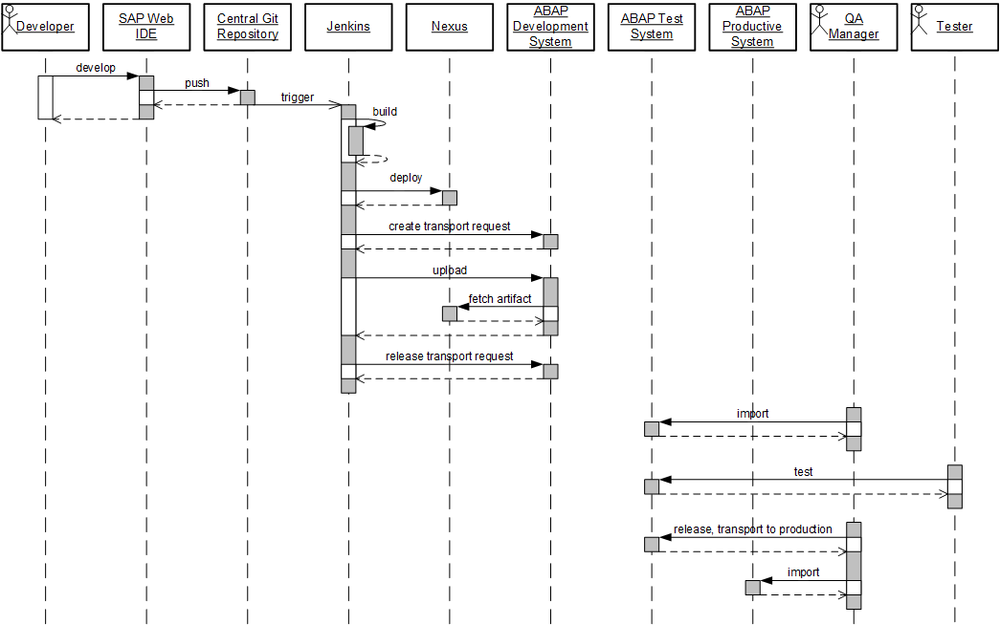

    Figure 2: Process for Fiori development with automatic transport request creation

- The responsible person, for example the quality manager, manually creates the transport request to which imported SAPUI5 or Fiori objects are assigned. All application versions that are uploaded to the system are attached to this open transport request. On a defined schedule - for example once a day - the SAPUI5 or Fiori application is transported into the test system for acceptance testing. The responsible person then releases the transport request and imports it into the test system. For subsequent CI builds, he or she must create a new transport request and provide the new transport request number to the CI process such that newly changed objects are assigned to the latter instead. To avoid a gap in time during which no open transport request exists, the creation of the new transport request must happen before the old one is closed. Figure 3 shows the process. The advantage is the controlled creation of transport requests by a responsible person; however, it may be a disadvantage that this activity requires manual steps.

    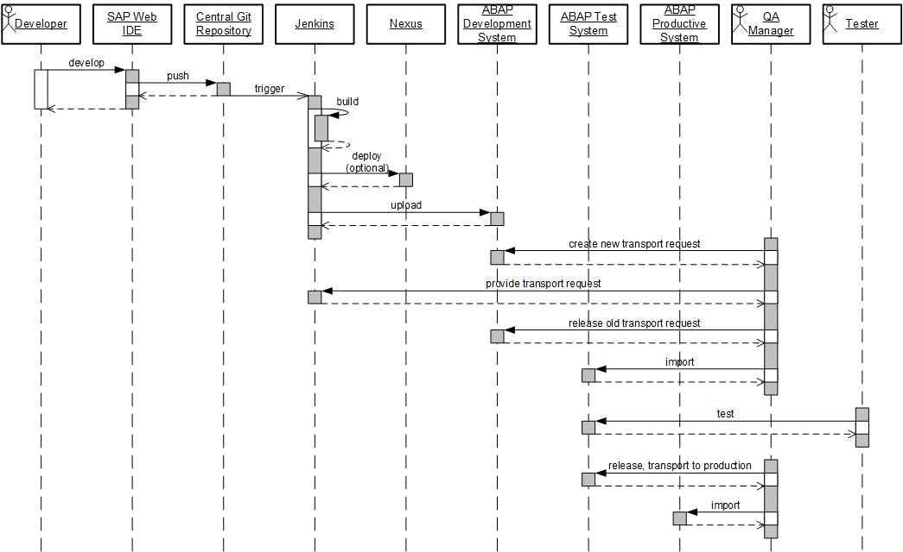

    Figure 3: Process for Fiori development with manual transport request creation

Figure 4 summarizes the infrastructure that is required to run the process.

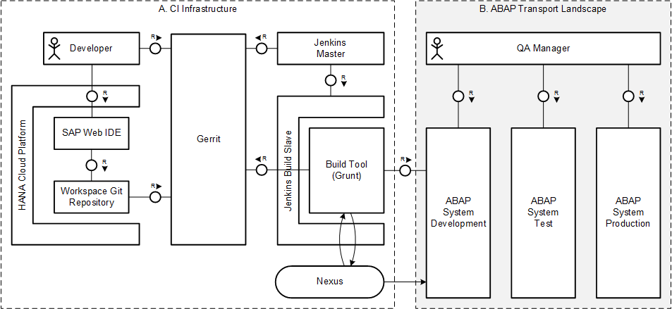

Figure 4: Landscape for Fiori on ABAP front-end server

The scenario described here builds on the chapters that describe how to set up an example infrastructure using Git/Gerrit as SCM and Jenkins as CI task engine. For details, see the corresponding chapters that are linked from our [navigator](http://www.sap.com/developer/tutorials/ci-best-practices-intro.html) page. However, you may decide to use another SCM system or CI task engine.


### 2. Prerequisites

- An account on SAP Cloud Platform.
- SAP Cloud Connector as reverse proxy to pass requests from SAP Web IDE to your corporate Git installation.

> [SAP Cloud Platform Documentation](https://help.hana.ondemand.com/help/frameset.htm?e9137493bb57101492c6858c8d6b0b62.html)  
> [SAP Cloud Platform Cockpit](https://account.hana.ondemand.com)  
> [Connecting to your Corporate Git System](https://help.hana.ondemand.com/webide/frameset.htm?b8427ec16ae64347b97d2d46fb28f7cd.html)


### 3. Creating Sources for a New Project


The standard method for creating a new SAPUI5 or Fiori project is to use the wizard in SAP Web IDE to choose from the available templates and to create a skeleton in your workspace. The example here also mentions the wizard that creates one of the sample Fiori applications for the sake of having something more concrete than a simple Hello-World example.

You can either use SAP Web IDE on SAP Cloud Platform, or alternatively, you can use SAP Web IDE Personal Edition, which offers the same features but runs on your local machine.

> [SAP Web IDE](https://help.hana.ondemand.com/webide/frameset.htm?0221845d73ad403ab2852142f3179177.html)  
> [SAP Web IDE Personal Edition](https://help.hana.ondemand.com/webide/frameset.htm?5b8bca3147ee4dfd99be8aaf6bd4f421.html)

#### Procedure

1. In Gerrit, create a project with a `master` branch as described in [Generic Project](http://www.sap.com/developer/tutorials/ci-best-practices-generic.html).

2. If you are using SAP Web IDE on SAP Cloud Platform, follow the instructions here:

    > [Opening SAP Web IDE](https://help.hana.ondemand.com/webide/frameset.htm?51321a804b1a4935b0ab7255447f5f84.html)

    If you are working with SAP Web IDE Personal Edition, install it and start it as described here:

    > [SAP Web IDE Personal Edition](https://help.hana.ondemand.com/webide/frameset.htm?5b8bca3147ee4dfd99be8aaf6bd4f421.html)

    In either case, we assume that you are now logged in to SAP Web IDE.

3. In SAP Web IDE, go to **Tools > Preferences > Git settings**. Enter your Git user name and email address, and save your settings.

4. Select the workspace folder, then select one of the following options:

    - If you are creating a new Fiori project, select **New > Project from Template**.

    - If you are running through a demo, select **New > Project from Sample Application**.

    In both cases, the next steps are identical.

    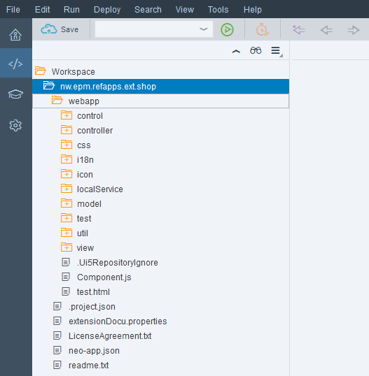

5. Mark the new project and select **Git > Initialize Local Repository**.

6. Mark the new project again and select **Git > Set Remote**. Enter the following data:

    - Name: `origin`

    - URL: `<The HTTPS-based URL of the Gerrit project that you just have created>`

    - Select **Add configuration for Gerrit**.

    - Press **OK**.

    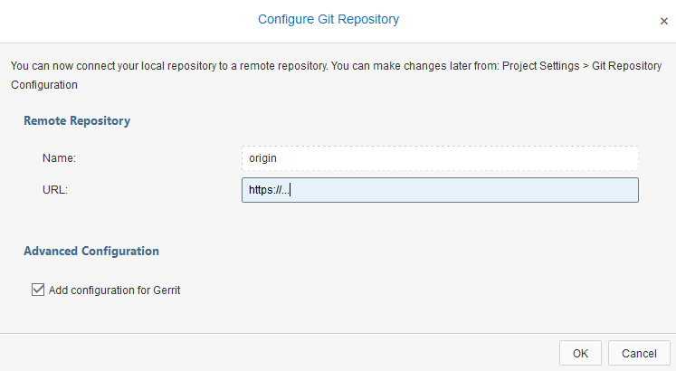

7. On the right sidebar of SAP Web IDE, open the Git pane. Scroll down, mark **Amend Changes** and press **Commit**. This step injects a change ID into the already existing initial commit, which is required to be able to be pushed to Gerrit for review.

    

8. On the right sidebar of SAP Web IDE, open the Git pane. Mark **Stage All** and enter a commit description. Press **Commit**.

    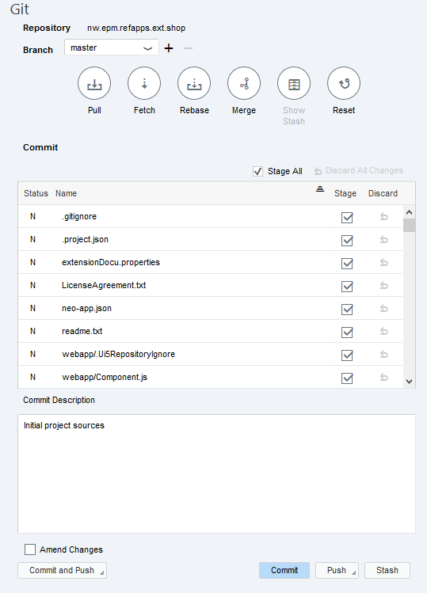

9. In the Git pane, select **Pull** to merge the version graphs of the local Git repository in SAP Web IDE and the remote repository. You may check it in the Git history pane.

    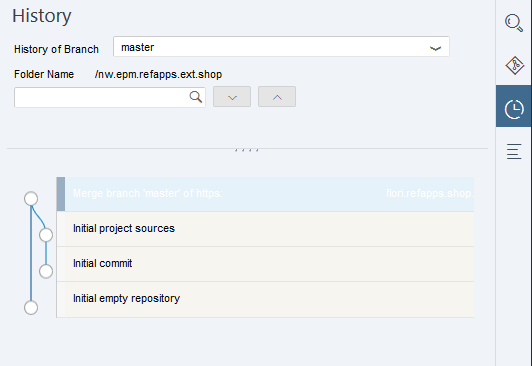

10. To propagate your changes from SAP Web IDE to Gerrit, return to the Git pane, and select **Push > origin/master**.

    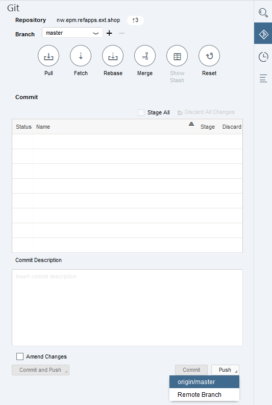

11. Open the Gerrit front end. You see your pushed changes (the Initial commit, the merge commit and the last commit containing all project files) offered for review in Gerrit.

    

12. Review the changes in Gerrit and submit them such that they are merged to the `master` branch.


### 4. Installing Node.js Jenkins Slave Machine

Grunt requires Node.js and the included package manager npm.

#### Procedure

1. Install Node.js on the Jenkins slave machine.

    > [Node.js Home Page](https://Nodejs.org/en/)   
    > [Node.js Downloads](https://nodejs.org/en/download/)

    You can install the `tar.gz` package on Linux in any directory. We recommend that you define a common installation directory on all your Jenkins slave machines.

2. Open the Jenkins front end, and go to **Manage Jenkins > Manage Plugins > Available**. Select **NodeJS Plugin** and start the installation.

    Although the primary feature offered by this plugin (using JavaScript directly in job implementations) is not used in our example, it does handle multiple Node.js versions in parallel, allowing you to choose the appropriate one at the job level.

3. In the Jenkins front end, go to **Manage Jenkins > Configure System**. Scroll down to the **Node.js** section and select **Node.js installations**. Enter the path to the Node.js binaries and an appropriate name for this installation. The name is referred to by build job definitions.


### 5. Creating the Grunt Build File

The Grunt build is controlled by a `Gruntfile.js` file. This file controls the task flow for processing sources and uses Grunt plugins, which are expected to be present during the Grunt run. Use the npm package manager to install the plugins needed for Grunt. A file named `package.json` contains all dependencies to plugins, by way of package name and version, which are needed for the Grunt build.

This scenario has been tested with the Grunt plugin versions that are described in the code listing for `package.json` in the appendix.

#### Procedure

1. Open your project in SAP Web IDE.

2. Select your project folder, choose **New > File** and enter `package.json` as name.

3. Copy the content of `package.json` from the appendix and paste it into the new file.

4. Adapt the `package.json` file to your context by entering the following values:

    - Name of the package

    - Package version

    - Description

5. Select your project folder, choose **New > File** and enter `Gruntfile.js` as its name.

6. Copy the content of `Gruntfile.js` from the appendix and paste it into the new file.

7. In the Git pane, stage the two new files, enter a commit description and select **Commit and Push**.


### 6. Working on a Local Machine

You may clone the Git repository to your local machine either using SAP Web IDE Personal Edition or using the Git command line. This makes sense when you want to test changes on the `Gruntfile.js` locally before pushing them to the central Git repository and having to deal with build errors on the CI server. You need Node.js and Grunt installed on your machine.

#### Procedure

1. Clone the Git repository to your machine (with SAP Web IDE Personal Edition or Git command line).

2. Open a shell and enter the project directory.

3. Execute the following commands on the shell:

    ```
    npm install
    grunt
    ```

    The `npm install` command installs all needed Node.js modules into the project folder. To avoid versioning them with Git, add a line containing `node_modules*` into the `.gitignore` file.

4. Do some example changes, rerun the Grunt build and finally create a Git commit and push it to Gerrit.


### 7. Creating the CI Build

We create the job for the CI build on the current `master` snapshot, which is triggered on each change. The configuration and credentials used in this section are based on the examples in [Build Scheduler](http://www.sap.com/developer/tutorials/ci-best-practices-build.html).

#### Procedure

1. Open Jenkins, select **New Item** to create a new job for the CI build and enter an appropriate item name; the example uses `CI_nw.epm.refapps.ext.shop_master`. Select **Freestyle Project** and press **OK**.

2. In the job configuration, enter the following values:

    Field                                  | Value
    :------------------------------------- | :------------------------------------------
    Restrict where this project can be run | `builds`
    Source Code Management                 | `Git`
    Repository URL                         | `<URL of the Git repository>`
    Credentials                            | `jenkins`
    Branches to build                      | `master`
    Build Triggers                         |
    Poll SCM                               | `checked`
    Schedule                               | `<Enter a pull frequency. For immediate results, two minutes is an appropriate value.>`
    Build Environment                      |
    Delete workspace before build starts   | `checked`
    Inject password to build as environment variables | `checked`
    Global passwords                       | `checked`
    Mask password parameters               | `checked`
    Provide Node & npm bin/folder to PATH  | `checked`
    Installation                           | `<The node installation name as defined above>`

3. In the **Build** section, select **Add build step > Execute shell**. In the **Command** field, enter the following code:

    ```
    npm install
    node_modules/grunt-cli/bin/grunt --no-color default createZip
    ```

    The build logic happens here: first, the npm call installs all the needed Grunt plugins. Next, Grunt is called, and executes the tasks defined in `Gruntfile.js`. The option `--no-color` suppresses odd characters in the build log that control the font color when Grunt is called from the console. For additional details about the file contents, see the appendix.

4. Press **Save**.   

To test the job, apply a local change on your project, create a Git commit and push it to the `master` branch in Gerrit. After two minutes, the CI build starts running.


### 8. Creating the Voter Build

We create the voter build as a copy of the CI build and modify the configuration.

1. Open Jenkins, select **New Item** to create a new job for the voter build, enter an appropriate item name (in our example `VO_nw.epm.refapps.ext.shop_master`), and enter `CI_nw.epm.refapps.ext.shop_master` into the filed **Copy existing item**. Select **OK**.

2. In the **Source Code Management** section, change the following configuration entries:

    Field                            | Value
    :------------------------------- | :----------------------------------------
    Source Code Management: Ref spec | `refs/changes/*:refs/changes/*`
    Branches to build                | `$GERRIT_REFSPEC`

3. In the **Build Triggers** section, unselect **Poll SCM** and select **Gerrit event** instead. Enter the following data:

    Field                           | Value
    :------------------------------ | :----------------------------------------
    Choose a Server                 | `<the Gerrit server you already have defined in Jenkins>`
    Add                             | `Patchset Created`
    Gerrit Project                  | Plain: `<the Gerrit project name>`; Branches Plain: `master`

4. In the **Command** field of the **Build** section, remove the `zip` target from the Grunt call since the creation of the zip file is not needed in the voter build:

    ```
    npm install
    grunt --no-color default
    ```

5. Save.

You may test the voter and the CI build jobs: apply a local change on your project, create a Git commit and push it to Gerrit. The voter build is triggered immediately. Provided, your change does not contain build errors, verify and submit it in Gerrit. After two minutes, the CI build starts running.


### 9. Enabling the Jenkins Slave to Perform RFC Calls

The next step of the CI process is uploading the application into the ABAP development system. The technical tool for the communication between the CI server (Jenkins in this example) and the ABAP system is the SAP NetWeaver RFC (remote function call) library, which executes remote-enabled ABAP function modules from remote locations. From inside a Grunt build, the library is used via the Node.js wrapper `node-rfc`. The SAP NetWeaver RFC Library must be installed on the Jenkins slave machine. You can download it from the Software Downloads page of SAP ONE Support Launchpad.

> [SAP ONE Support Launchpad](https://launchpad.support.sap.com/)

We have tested the `node-rfc` module with Node.js 4.4.3 on the following platforms:

- SUSE Linux Enterprise Server 12
- Ubuntu 16.04
- Red Hat Enterprise Linux Server release 7.2

To install the library, ensure the `g++` compiler collection package has first been installed on the machine.

#### Procedure

1. Enter SAP ONE Support Launchpad, navigate to **Software Downloads** and search for `SAP NW RFC SDK 7.20`. Choose the operating system that is running on your Jenkins slave machine, and download the archive. To extract the archive, you need SAPCAR, which is also available in the SAP ONE Support Launchpad.

2. Log in to the Jenkins slave machine as `root`.

3. Install the SAP NetWeaver RFC library by extracting it using `SAPCAR.EXE` into a dedicated directory, for example, `/opt/sap/nwrfcsdk`:

    ```
    mkdir -p /opt/sap
    cd /opt/sap
    <SAPCAR executable> -xvf <path to the sar archive>/NWRFC_40-20004565.SAR
    ```

    For additional details, see the installation documentation:

    > [SAP NW RFC Installation on the node-rfc](http://sap.github.io/node-rfc/install.html)


4. Still as user `root`, create a new file `/etc/ld.so.conf.d/nwrfcsdk.conf` with the following content:

    ```
    # include nwrfcsdk
    /opt/sap/nwrfcsdk/lib
    ```

    The directory you enter must reflect your actual installation directory.

5. From the command line, run `ldconfig` which sets symbolic links to the dynamic libraries so they can be found at runtime.

6. Make sure that the variable `SAPNWRFC_HOME` pointing to the RFC library directory is set in the environment of user `jenkins`. If `bash` is the login shell, we recommend that you add a line similar to the one below into the `.bashrc` file of the user `jenkins`:

    ```
    export SAPNWRFC_HOME=/opt/sap/nwrfcsdk
    ```


### 10. Creating a Jenkins Job for RFC Calls

The example uploads the application into the ABAP development system as a separate Jenkins job. This corresponds to the separation of the CI build on one side from ABAP life-cycle management on the other side. Accordingly, create a new file `Gruntfile_ABAP.js` that is separate from the already existing file `Gruntfile.js`. `Gruntfile_ABAP.js` implements `node-rfc` module calls inside Grunt tasks for different purposes: transport request creation, application upload and transport request release. Depending on the scenario (full automation or manual creation of transport requests), the appropriate tasks are passed to the `grunt` command as parameters.

The upload of the zipped application is done by a pull from the ABAP system: it requests the zip via HTTP directly from the Jenkins workspace directory. If access to the Jenkins workspace is more restrictive, an alternative solution using Nexus as artifact repository can be applied.

#### Procedure

##### Defining the Job

1. Open Jenkins and select **New Item** to create a new job named `AI_nw.epm.refapps.ext.shop_master` (AI stands for ABAP import). Select **Freestyle Project**, and press **OK**.

2. Select **This build is parametrized**, add the following string parameters and leave their default values empty:

    Name                        | Value
    :-------------------------- | :-----------------------------------------
    `ABAP_PACKAGE`              | `<empty>`
    `ABAP_APPLICATION_NAME`     | `<empty>`
    `ABAP_APPLICATION_DESC`     | `<empty>`
    `ABAP_DEVELOPMENT_SERVER`   | `<empty>`
    `ABAP_DEVELOPMENT_INSTANCE` | `<empty>`
    `ABAP_DEVELOPMENT_CLIENT`   | `<empty>`
    `CI_BUILD_NUMBER`           | `<empty>`
    `GIT_COMMIT`                | `<empty>`

3. Continue entering data into the job configuration:

    Field                                  | Value
    :------------------------------------- | :------------------------------------------
    Restrict where this project can be run | `builds`
    Source Code Management                 | `None`
    Build Environment                      |
    Delete workspace before build starts   | `checked`
    Inject password to build as environment variables | `checked`
    Global passwords                       | `checked`
    Mask password parameters               | `checked`
    Provide Node & npm bin/folder to PATH  | `checked`
    Installation                           | `<The node installation name as defined above>`

4. In the **Build** section, add a build step **Copy artifacts from another project**. Enter the following values:

    Field                                  | Value
    :------------------------------------- | :------------------------------------------
    Project name                           | `CI_nw.epm.refapps.ext.shop_master`
    Which build                            | `Upstream build that triggered this job`
    Artifacts to copy                      | `**`

    This simple example uses the Jenkins archive mechanism to pass the zipped application from the CI build job to this one. Also, the Grunt build file is passed this way, which avoids cloning the source code repository.

5. Add a second build step **Execute shell** and enter as **Command**:

    ```
    npm install
    node_modules/grunt-cli/bin/grunt --no-color --gruntfile Gruntfile_ABAP.js createTransportRequest uploadToABAP releaseTransport
    ```

    `Gruntfile_ABAP.js` (created in a subsequent step) contains the definition of the tasks given here. The task `createTransportRequest` creates a transport request in the ABAP system. The connection data comes from the job parameters and the masked credentials that are defined below. The number of the transport request persists in the job workspace in a file named `target/CTS_Data.txt` from where it can be fetched by the other tasks.

    The task `uploadToABAP` uploads the application as zip file into the ABAP system. The transport request number is read from the data file.

    The task `releaseTransport` releases the transport request, including all the transport tasks inside it.

    This example implementation corresponds to the fully automated scenario.

6. Save.

7. In Jenkins, go to **Manage Jenkins > Configure System > Global Passwords**.

8. Define the credentials for accessing the ABAP system to upload the application. Add the names `ABAP_DEVELOPMENT_USER`, and `ABAP_DEVELOPMENT_PASSWORD`, and set their correct values. The values of these variables are masked in the build log.

9. Save.

This configuration disables parallel execution of this job. To avoid conflicts due to locked objects in the transport request, do not enable it.


##### Adapting the CI Build Job

The job just defined must be automatically triggered after successful execution of the CI build job.

1. Open `CI_nw.epm.refapps.ext.shop_master`.

2. In the generic part of the job configuration, choose **This build is parametrized** and enter the string parameters from the table. The SAPUI5/Fiori application is stored in the ABAP repository as a BSP (Business Server Page) application within a certain ABAP package. Choose appropriate names for both. You must manually create the ABAP package name in the ABAP system; see "Preparing the ABAP development system" below.

    Name                        |  Default Value
    :-------------------------- | :------------------------------------------
    `ABAP_PACKAGE`              | `<The package name in the ABAP system where the application resides>`
    `ABAP_APPLICATION_NAME`     | `<The name as the BSP application in the ABAP system>`
    `ABAP_APPLICATION_DESC`     | `<The description of the BSP application in the ABAP system>`
    `ABAP_DEVELOPMENT_SERVER`   | `<The host name of ABAP system>`
    `ABAP_DEVELOPMENT_INSTANCE` | `<The instance number of the ABAP system>`
    `ABAP_DEVELOPMENT_CLIENT`   | `<The client number of the ABAP system to be used>`  

3. In the **Post-build Action** section, add an **Archive the artifacts** step. Enter the following data into the **Files to archive** field:

    ```
    package.json, Gruntfile_ABAP.js, target/*-opt-static-abap.zip
    ```

4. Add a second **Post-build Action** of type **Trigger parametrized build on other projects** and enter the following data:

    Field                                  | Value
    :------------------------------------- | :------------------------------------------
    Projects to build                      | `AI_nw.epm.refapps.ext.shop_master`
    Trigger when build is                  | `Stable`

    To ensure that the parameters of this job are forwarded to the sequel job, select **Add Parameters > Current build parameters**.

    Select **Add Parameters > Predefined Parameters** and enter the following:

    ```
    CI_BUILD_NUMBER=$BUILD_NUMBER
    GIT_COMMIT=$GIT_COMMIT
    ```

    The Git commit ID and the CI build number can then be written by the upload job into the change request text field.

5. Save.


### 11. Preparing the ABAP Development System

The SAPUI5/Fiori application needs to be assigned to an ABAP package.

1. Use SAP Logon to access the ABAP development system.

2. Enter transaction `se80`, select **Repository Browser**, then select `Package`. Enter an appropriate name. You may also want to create sub-packages.

    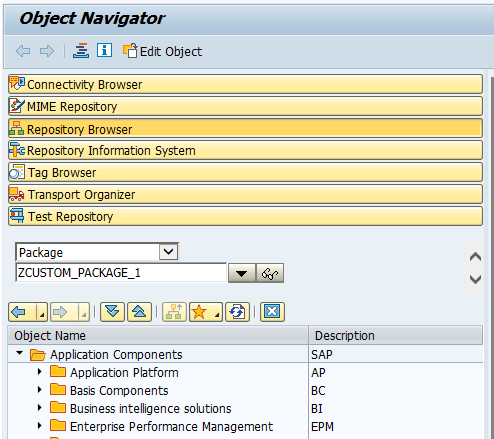

    Create a transport request by pressing **Create**. In the dialog, enter an appropriate description and **Save**.

    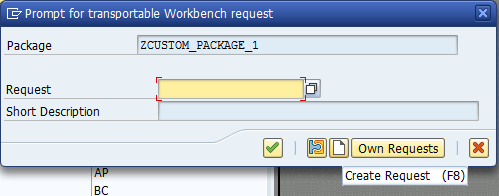

3. Release the transport request. In the object navigator of transaction `se80`, open the **Transport Organizer** tab, select the transport request just created and its contained task. Release both.

    


### 12. Creating the Grunt File for RFC Calls

The RFC features are implemented in a second Grunt file named `Gruntfile_ABAP.js`. The main purpose of this file is to wrap the `node-rfc` library as Grunt tasks. Additional documentation for the `node-rfc` library is available using the following links:

> [Node.js RFC connector Documentation](http://sap.github.io/node-rfc/)  
> [Node.js RFC connector on GitHub](https://github.com/SAP/node-rfc)

#### Procedure

1. From SAP Web IDE, open your SAPUI5 or Fiori project.

2. Select your project folder, choose **New > File** and enter `Gruntfile_ABAP.js` as the file name.

3. Copy the content of `Gruntfile_ABAP.js` from the appendix and paste it into the new file.

4. In the Git pane, stage the new file, enter a commit description and select **Commit and Push**.

Within two minutes, you should see the CI build start. When it finishes, it triggers the ABAP upload build.


### 13. Roundtrip through the CI Process

Everything is now in place to execute a roundtrip through the CI process.

#### Procedure

The following steps simulate the actions that are performed many times each day by developers.

1. Apply changes to your project sources either using SAP Web IDE in the cloud or working locally.

2. Create a Git commit and push it to Gerrit.

3. Monitor the voter build and open Gerrit to view the voting of Jenkins on your change.

4. Review and submit the change in Gerrit. Within 2 minutes after submission, the CI build starts.

5. Monitor the CI build. Check the result: open transaction `se80` in SAP Logon and navigate to the package. Verify that the application has been uploaded.

6. Monitor the transports. Open transaction `stms` in SAP Logon and navigate to **Import overview**. Select your target system - the ABAP test system in our example - and display the import queue. A new request entry is waiting to be imported.

    


### 14. Static Code Analysis with ESLint

ESLint is a commonly used static code analysis tool for JavaScript. This section discusses, at a very high level, how to integrate ESLint into the Grunt build.

> [ESLint Home](http://eslint.org/)

#### Procedure

1. Create an ESLint configuration file. One convenient way to do this is to execute the following commands on a local machine:

    ```
    npm install -g eslint
    eslint --init
    ```

    You can find additional information at the following location:

    > [ESLint on the npm repository](https://www.npmjs.com/package/eslint)

    Depending on the configuration format you have chosen, there is now a new file, named, for example, `.eslintrc.json`. You may later reconfigure this file by switching rules on and off according to your requirements.

2. Open `Gruntfile.js`. Switch on ESLint tests by adding the `eslint` sub task into the `default` task:

    ```
        grunt.registerTask("default", ["clean", "eslint", "copy:copyToDbg", "openui5_preload:preloadDbg", "copy:copyToTmp",
        "uglify:uglifyTmp", "cssmin", "openui5_preload:preloadTmp", "copy:copyDbgToTmp",
        "uglify:uglifyPreload"]);
    ```

    Verify that the name of the ESLint configuration file is correct:

    ```
        "eslint": {
            options: {
                configFile: ".eslintrc.json",
            },
            target: [webAppDir + "/**/*.js"]
        },
    ```

3. Commit the change and push. Monitor the CI build result.


### 15. Code Page Check

Uploading the zipped application to the ABAP system requires you to specify a code page. As the default, the standard code page of SAP GUI is used. However, this may differ from the code pages used by developers who are developing the SAP UI5 or Fiori application. We recommend that you define a standard code page. UTF8 is a good candidate for such a standard, and our example follows this. You may want to choose a different code page that depends on the majority of locales used by developers in your organization. The rule is enforced by the `grunt-encoding` plugin which checks the source files for their correct encoding.

#### Procedure

1. Open `Gruntfile.js`. Switch on the encoding check tests by adding the `encoding` sub-task into the `default` task:

    ```
        grunt.registerTask("default", ["clean", "encoding", "eslint", "copy:copyToDbg", "openui5_preload:preloadDbg", "copy:copyToTmp",
        "uglify:uglifyTmp", "cssmin", "openui5_preload:preloadTmp", "copy:copyDbgToTmp",
        "uglify:uglifyPreload"]);
    ```

    Check whether UTF-8 is the correct encoding for your use case. Eventually, change it according to your setup:

    ```
        "encoding": {
            options: {
                encoding: "UTF8"
            },
    ```

2. Commit the change and push. Monitor the CI build result.


### 16. Automated Testing

The examples given above are intended only to give you an impression of how checks can be handled in Grunt. There are many frameworks available for automated unit testing and application testing and the "best" option to use depends on the explicit project setup. We do not provide a specific recommendation. In general, the `Gruntfile.js` will grow with additional checks as your code quality requirements increase.


### 17. Alternative Approach Using Manual Transport Request Creation

This section discusses an alternative process in which transport requests are created manually. It is intended only to give you an idea of how you might adapt the automated process.


#### Procedure

##### A: Creating the Registration Job for the Transport Request

An open transport request must exist in the system, with its number made available to the upload task by a registration job. This registration job is manually triggered by the quality manager or any other responsible person immediately after creating the transport request in the ABAP system. The job takes the transport request number as an argument and stores it in Jenkins to be fetched by the CI build job, which must be modified accordingly.

1. To create the registration job, open Jenkins and select **New Item**. Enter an appropriate item name like `TR_nw.epm.refapps.ext.shop_master` (TR stands for Transport Request) and select **Freestyle Project**. Press **OK**.

2. In the general section of the project configuration, select **This build is parametrized**, select **Add Parameter > String Parameter** and enter `TRANSPORT_REQUEST` as **Name**. Leave **Default Value** empty.

3. Select **Restrict where this project can be run** and enter `builds`.

4. In the **Build environment** section, select **Delete workspace before build starts**.

5. In the **Build** section, select **Add build step > Execute shell** and enter the following:

    ```
    mkdir target
    echo "{\"REQUESTID\":\"$TRANSPORT_REQUEST\"}" > target/CTS_Data.txt
    ```

6. In the **Post-build Actions** section, select **Add post-build action > Archive the artifacts** and enter `target/CTS_Data.txt` into the **Files to archive** field.

7. Save.

8. Open the configuration of the job `AI_nw.epm.refapps.ext.shop_master`.

9. In the **Build** section, select **Add build step > Copy artifacts from another project**. This build step must be executed after the already existing copy step and before the **Execute shell** build step. You can put the steps into the right order by dragging and dropping in the front end. Enter the following configurations into the new step:

    Field                                  | Value
    :------------------------------------- | :------------------------------------------
    Project name                           | `TR_nw.epm.refapps.ext.shop_master`
    Which build                            | `Latest successful build`
    Artifacts to copy                      | `target/CTS_Data.txt`

10. Change the command in the **Execute shell** step as follows:

    ```
    npm install
    node_modules/grunt-cli/bin/grunt --no-color --gruntfile Gruntfile_ABAP.js uploadToABAP
    ```

11. Save.


##### B: Preparing the ABAP Development System

If one does not already exist, create an ABAP package as described above.


##### C: Creating the Transport Request and Registering its Number to Jenkins

A transport request must be available such that the application can be uploaded to the ABAP system.

1. Use SAP Logon to access the ABAP development system.

2. Enter the transport organizer via transaction `se09` and press **Create**.

    

3. Select **Workbench request**.

    

4. Enter a description and press **Save**.

    

5. Copy the number of the transport request just created.

    

6. Open the job `TR_nw.epm.refapps.ext.shop_master` in Jenkins. Select **Build with Parameters** and enter the transport request number.

    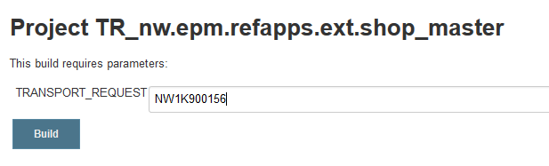

7. Select **Build**.


##### D: Processing Changes

1. From SAP Web IDE, or working locally, apply changes to the sources of your project sources.

2. Create a commit and push it to Gerrit.

3. Monitor the CI build. Check the result: open transaction `se80` in the SAP Logon and navigate to the package. Verify that the files have been uploaded.


##### E: Releasing the Change Request and Creating a New One

At predefined times, for example once a day, the responsible person releases the transport request to bring changes to the ABAP test system. A new transport request must be created before and registered to Jenkins; otherwise, the CI build may encounter an error because the transport request to which it attempts to assign files is already closed.

1. Execute all the steps in "Creating the transport request and registering its number to Jenkins" above. From now on, the CI build uses the new transport request.

2. Use SAP Logon to access the ABAP development system.

3. In transaction `se09`, select the transport request that was in use before and release it.


### 18. (Optional) Using Nexus as the Artifact Repository

Due to access restrictions, HTTP requests from the ABAP development system to Jenkins for fetching the application zip file might be disabled. In this situation, you might want to use a Nexus repository to temporarily store the artifact. To do so, modify the jobs for the CI build and the ABAP import accordingly.

#### Procedure

##### A: Changing the CI Build Job

1. Open `CI_nw.epm.refapps.ext.shop_master`.

2. Add a new string parameter named `NEXUS_SNAPSHOT_REPO`. For **Default value**, enter the URL of the Nexus snapshot repository where the application zip file is stored.

3. In the **Build** section, change the command of the **Execute shell** step to the following:

    ```
    npm install
    node_modules/grunt-cli/bin/grunt --no-color default createZip deployToNexus
    ```

4. In the **Post-build Action > Archive the artifacts** step, remove the zip file entry:

    ```
    package.json, Gruntfile_ABAP.js
    ```

5. Save.


##### B. Changing the Job for RFC Calls

1. Open `AI_nw.epm.refapps.ext.shop_master`.

2. Add a new string parameter named `NEXUS_SNAPSHOT_REPO`. Leave the **Default Value** empty.

3. Save.

The implementation of the upload task in `Gruntfile_ABAP.js` file checks whether there is a local zip file in the Jenkins workspace. If not, then the alternative `zipFileURL`, which is calculated from the artifact co-ordinates, is passed to the ABAP system.

Start a roundtrip for this process implementation by pushing a change. The CI build deploys the generated zip file to Nexus from where it is fetched by the ABAP system.


### Appendix

#### `package.json`

The `package.json` file contains meta-information about the JavaScript project. The dependencies to Grunt plugins are needed during build time, not at run time; they are therefore entered as `devDependencies`. The scenario described here has been tested with the versions shown below; we cannot guarantee compatibility of the plugins in other versions.

The file listed here is the minimum necessary to make the process skeleton run. You might want to add more data according to your requirements.

You will need to enter some data manually, as the name and the version of your package.

> [Npm documentation for `package.json`](https://docs.npmjs.com/files/package.json)

```
{
  "name": "{name of the package}",
  "version": "{version of the package}",
  "description": "{description of the package}",
  "private": true,
  "devDependencies": {
    "grunt": "0.4.5",
    "grunt-cli": "1.2.0",
    "grunt-encoding": "0.3.0",
    "grunt-eslint": "19.0.0",
    "grunt-contrib-clean": "1.0.0",
    "grunt-contrib-copy": "1.0.0",
    "grunt-contrib-cssmin": "1.0.1",
    "grunt-contrib-uglify": "1.0.1",
    "grunt-folder-list": "1.1.0",
    "grunt-mkdir": "1.0.0",
    "grunt-nexus-deployer": "0.0.8",
    "grunt-openui5": "0.9.0",
    "grunt-zip": "0.17.1",
    "node-rfc": "0.1.11"
  }
}
```


#### `Gruntfile.js`

`Gruntfile.js` defines the tasks for building the SAPUI5/Fiori application. All tasks are provided by the Grunt community, and some of them are specific for SAPUI5 development. The tasks provide all needed steps for minifying the JavaScript sources, creating the preload file, and uploading the result into an ABAP system. Optionally, the result may be packaged into a zip file (not needed in our scenario).

In the build result, the minified files inherit the name from the original source files. For debugging purposes, the original files are kept and uploaded to the ABAP system under the original name but with a `dbg` suffix.

The following tasks are executed during a Fiori build:

1. `clean`: Cleans up the build workspace by removing results from previous build runs.

2. `copy:copyToDbg`: Copies the original files to a debug file folder and renames them using a `dbg` suffix.

3. `openui5_preload:preloadDbg`: Generates a preload file that contains the contents of the debug files.

4. `copy:copyToTmp`: Copies the original files for minification.

5. `uglify:uglifyTmp`: Minifies JavaScript files.

6. `cssmin`: Minifies `css` files.

7. `openui5_preload:preloadTmp`: Generates a preload file that contains the contents of minified files.

8. `copy:copyDbgToTmp`: Merges the minified files and debug files into one folder.

9. `uglify:uglifyPreload`: Minifies of the preload file.

10. `zip`: Creates the application zip file.

Note: the Grunt script below is meant only as an example for demonstrating a very rudimentary CI process.

> [Configuring tasks in Grunt documentation](http://gruntjs.com/configuring-tasks)

```
"use strict";

module.exports = function(grunt) {
    // Variables from environment
    var nexusUser = process.env.NEXUS_DEPLOY_USER;
    var nexusPassword = process.env.NEXUS_DEPLOY_PASSWORD;
    var nexusSnapshotRepoURL = process.env.NEXUS_SNAPSHOT_REPO;

    // Project properties
    var webAppDir = "webapp";
    var targetDir = "target";
    var tmpDir = targetDir + "/tmp";
    var tmpDirDbg = targetDir + "/tmp-dbg";
    var zipFileSuffix = "-opt-static-abap.zip";
    var preloadPrefix = "nw/epm/refapps/ext/shop";
    var nexusGroupId = "com.yourcompany";

    // Project configuration.
    grunt.initConfig({
        pkg: grunt.file.readJSON("package.json"),
        clean: {
            build: [targetDir]
        },
        encoding: {
             options: {
                 encoding: "UTF8"
             },
             files: {
                 src: [webAppDir + "/**/*.js", webAppDir + "/**/*.css",
                      webAppDir + "/**/*.xml", webAppDir + "/**/*.json",
                       webAppDir + "/**/*.html", webAppDir + "/**/*.properties"]
             }
        },
        eslint: {
            options: {
                configFile: ".eslintrc.json"
            },
            target: [webAppDir + "/**/*.js"]
        },
        copy: {
            copyToDbg: {
                files: [
                    {
                        expand: true,
                        src: "**/*.js",
                        dest: tmpDirDbg,
                        cwd: webAppDir,
                        filter: function(filepath) {
                            // prevent js from localService to be copied
                            return !filepath.match(new RegExp(webAppDir + "(\\/|\\\\)localService", "gi"));
                        }
                    },
                    {
                        expand: true,
                        src: "**/*.css",
                        dest: tmpDirDbg,
                        cwd: webAppDir
                    }]
            },
            copyToTmp: {
                files: [
                    {
                        expand: true,
                        src: "**/*.js",
                        dest: tmpDir,
                        cwd: webAppDir,
                        filter: function(filepath) {
                            // prevent js from localService to be copied
                            return !filepath.match(new RegExp(webAppDir + "(\\/|\\\\)localService", "gi"));
                        }
                    },
                    {
                        expand: true,
                        src: "**/*.css",
                        dest: tmpDir,
                        cwd: webAppDir
                    },
                    {
                        expand: true,
                        src: "localService/metadata.xml",
                        dest: tmpDir,
                        cwd: webAppDir
                    },
                    {
                        expand: true,
                        src: "**/*",
                        dest: tmpDir,
                        cwd: webAppDir,
                        filter: function(filepath) {
                            // prevent js and css files and contents of webapp/test from being copied
                            return !filepath.match(new RegExp("(" + webAppDir + "(\\/|\\\\)test|${webAppDir}(\\/|\\\\)localService|\\.js$|\\.css$|\\test.html$)", "gi"));
                        }
                    }]
            },
            copyDbgToTmp: {
                files: [
                    {
                        expand: true,
                        src: "**/*.js",
                        dest: tmpDir,
                        cwd: tmpDirDbg,
                        rename: function(dest, src) {
                            return dest + "/" + src.replace(/((\.view|\.fragment|\.controller)?\.js)/, "-dbg$1");
                        }
                    },
                    {
                        expand: true,
                        src: "**/*.css",
                        dest: tmpDir,
                        cwd: tmpDirDbg,
                        rename: function(dest, src) {
                            return dest + "/" + src.replace(".css", "-dbg.css");
                        }
                    }]
            }
        },
        uglify: {
            uglifyTmp: {
                files: [
                    {
                        expand: true,
                        src: "**/*.js",
                        dest: tmpDir,
                        cwd: webAppDir,
                        filter: function(filepath) {
                            // prevent js from localService to be copied
                            return !filepath.match(new RegExp(webAppDir + "(\\/|\\\\)localService", "gi"));
                        }
                    }]
            },
            uglifyPreload: {
                files: [
                    {
                        expand: true,
                        src: tmpDir + "/Component-preload.js"
                    }]
            }
        },
        cssmin: {
            build: {
                files: [
                    {
                        expand: true,
                        src: "**/*.css",
                        dest: tmpDir,
                        cwd: webAppDir
                    }]
            }
        },
        openui5_preload: {
            preloadDbg: {
                options: {
                    resources: {
                        cwd: tmpDirDbg,
                        src: ["**/*.js"],
                        prefix: preloadPrefix
                    },
                    compress: false,
                    dest: tmpDirDbg
                },
                components: true
            },
            preloadTmp: {
                options: {
                    resources: {
                        cwd: tmpDir,
                        src: ["**/*.js"],
                        prefix: preloadPrefix
                    },
                    compress: false,
                    dest: tmpDir
                },
                components: true
            }
        },
        nexusDeployer: {
            build: {
                options: {
                    groupId: nexusGroupId,
                    artifactId: "<%= pkg.name %>",
                    version: "<%= pkg.version %>-SNAPSHOT",
                    packaging: "zip",
                    auth: {
                        username: nexusUser,
                        password: nexusPassword
                    },
                    pomDir: targetDir + "/pom",
                    url: nexusSnapshotRepoURL,
                    uploadMetadata: false,
                    artifact: targetDir + "/<%= pkg.name %>" + zipFileSuffix
                }
            }
        },
        zip: {
            build: {
                cwd: tmpDir,
                src: tmpDir + "/**/*",
                dest: targetDir + "/<%= pkg.name %>" + zipFileSuffix
            }
        }
    });

    grunt.loadNpmTasks("grunt-contrib-clean");
    grunt.loadNpmTasks("grunt-contrib-copy");
    grunt.loadNpmTasks("grunt-contrib-uglify");
    grunt.loadNpmTasks("grunt-contrib-cssmin");
    grunt.loadNpmTasks("grunt-encoding");
    grunt.loadNpmTasks("grunt-zip");
    grunt.loadNpmTasks("grunt-openui5");
    grunt.loadNpmTasks("grunt-nexus-deployer");
    grunt.loadNpmTasks("grunt-eslint");

    grunt.registerTask("default", ["clean", "copy:copyToDbg", "openui5_preload:preloadDbg", "copy:copyToTmp",
          "uglify:uglifyTmp", "cssmin", "openui5_preload:preloadTmp", "copy:copyDbgToTmp",
          "uglify:uglifyPreload"]);
    grunt.registerTask("createZip", ["zip"]);
    grunt.registerTask("deployToNexus", ["nexusDeployer"]);
};
```


#### `Gruntfile_ABAP.js`

This Grunt file contains the logic for RFC connections. It implements tasks that create a transport request, upload the application to the ABAP system, and release the transport request. The connection data to the ABAP system is passed from the environment of the Jenkins job.

The task that creates the transport request also creates a file `target/CTS_Data.txt` that persists the transport request number. The other tasks fetch the transport request number from this file. Typically, the tasks are called through a Grunt command like the following:

```
node_modules/grunt-cli/bin/grunt --gruntfile Gruntfile_ABAP.js createTransportRequest uploadToABAP releaseTransport
```

Alternatively, you can execute the upload without first creating a transport request, passing the transport request number as an argument similar to the following:

```
node_modules/grunt-cli/bin/grunt --gruntfile Gruntfile_ABAP.js uploadToABAP:<transport request number>
```

Implementing the Grunt tasks is straightforward using the `node-rfc` module documentation.

> [Node.js RFC connector Documentation](http://sap.github.io/node-rfc)  
> [Node.js RFC connector on GitHub](https://github.com/SAP/node-rfc)

Important: The RFC call is asynchronous. The Grunt process flow must wait for it to finish, which is why we use promises:

```
"use strict";

var rfc = require("node-rfc");
var fs = require("fs");

module.exports = function(grunt) {

    // Project specific variables
    var abapDevelopmentUser = process.env.ABAP_DEVELOPMENT_USER;
    var abapDevelopmentPassword = process.env.ABAP_DEVELOPMENT_PASSWORD;
    var abapDevelopmentServer = process.env.ABAP_DEVELOPMENT_SERVER;
    var abapDevelopmentInstance = process.env.ABAP_DEVELOPMENT_INSTANCE;
    var abapDevelopmentClient = process.env.ABAP_DEVELOPMENT_CLIENT;
    var abapApplicationName = process.env.ABAP_APPLICATION_NAME;
    var abapApplicationDesc = process.env.ABAP_APPLICATION_DESC;
    var abapPackage = process.env.ABAP_PACKAGE;
    var jobURL = process.env.JOB_URL;
    var nexusSnapshotRepoURL = process.env.NEXUS_SNAPSHOT_REPO;
    var gitCommit = process.env.GIT_COMMIT;

    // Global Variables
    var targetDir = "target";
    var zipFileSuffix = "-opt-static-abap.zip";
    var ctsDataFile = targetDir + "/CTS_Data.txt";
    var nexusGroupId = "com.yourcompany";

    // Project configuration.
    var abapConn = {
        user: abapDevelopmentUser,
        passwd: abapDevelopmentPassword,
        ashost: abapDevelopmentServer,
        sysnr: abapDevelopmentInstance,
        client: abapDevelopmentClient
    };
    grunt.initConfig({
        pkg: grunt.file.readJSON("package.json"),
        createTransportRequest: {
            options: {
                conn: abapConn,
                author: abapDevelopmentUser,
                description: "Commit: " + gitCommit
            }
        },
        uploadToABAP: {
            options: {
                conn: abapConn,
                zipFile: targetDir + "/<%= pkg.name %>" + zipFileSuffix,
                zipFileURL: nexusSnapshotRepoURL + "/" + nexusGroupId.replace(/\./g, "/") + "/<%= pkg.name %>/<%= pkg.version %>-SNAPSHOT/<%= pkg.name %>-<%= pkg.version %>-SNAPSHOT.zip",
                codePage: "UTF8"
            }
        },
        releaseTransport: {
            options: {
                conn: abapConn
            }
        }
    });

    var rfcConnect = function(functionModule, importParameters, gruntContext) {
        return new Promise(function(resolve, reject) {
            var conn = gruntContext.options().conn;
            var client = new rfc.Client(conn);

            grunt.log.writeln("RFC client lib version:", client.getVersion());

            client.connect(function(err) {
                if (err) { // check for login/connection errors
                    grunt.log.errorlns("could not connect to server", err);
                    return reject();
                }
                // invoke remote enabled ABAP function module
                grunt.log.writeln("Invoking function module", functionModule);
                client.invoke(functionModule,
                    importParameters,
                    function(err, res) {
                        if (err) { // check for errors (e.g. wrong parameters)
                            grunt.log.errorlns("Error invoking", functionModule, err);
                            return reject();
                        }
                        client.close();
                        grunt.log.writeln("Messages:", res.EV_LOG_MESSAGES);
                        return resolve(res);
                    });
            });
        });
    };


    grunt.registerTask("createTransportRequest", "Creates an ABAP Transport Request", function() {
        grunt.log.writeln("Creating Transport Request");
        var importParameters = {
            AUTHOR: this.options().author,
            TEXT: this.options().description
        };
        var done = this.async();
        rfcConnect("BAPI_CTREQUEST_CREATE", importParameters, this)
            .then(
            function(returnValue) {
                if (returnValue.EV_SUCCESS == "E" || returnValue.EV_SUCCESS == "W") {
                    grunt.log.errorlns("Error invoking BAPI_CTREQUEST_CREATE.");
                    grunt.log.errorlns("Message Id:", returnValue.EV_MSG_ID);
                    grunt.log.errorlns("Message No:", returnValue.EV_MSG_NO);
                    grunt.log.errorlns("Messages:", returnValue.EV_LOG_MESSAGES);
                    done(false);
                    return;
                }
                if (returnValue.REQUESTID == "") {
                    grunt.log.errorlns("Error invoking BAPI_CTREQUEST_CREATE.");
                    grunt.log.errorlns("Transport request could not be created.");
                    grunt.log.errorlns(returnValue.RETURN.MESSAGE);
                    done(false);
                    return;
                }
                grunt.log.writeln("Transport request", returnValue.REQUESTID, "created.");
                if (fs.existsSync(targetDir) === false) {
                    fs.mkdirSync(targetDir);
                }
                fs.writeFile(ctsDataFile,
                    JSON.stringify(
                        { REQUESTID: returnValue.REQUESTID }
                    ),
                    function(err) {
                        if (err) {
                            grunt.log.errorlns("Error Creating file:", err);
                            done(false);
                            return;
                        }
                        grunt.log.writeln("Created file:", ctsDataFile);
                        done();
                    }
                )
            },
            function() {
                done(false);
            });
    });

    grunt.registerTask("uploadToABAP", "Uploads the application to the ABAP System", function(transportRequest) {
        grunt.log.writeln("Uploading to ABAP");
        if (!transportRequest) {
            if (!fs.existsSync(ctsDataFile)) {
                grunt.log.errorlns("No Transport request specified. Pass one explicitly or run createTransportRequest first.");
                return (false);
            }
            transportRequest = JSON.parse(fs.readFileSync(ctsDataFile, { encoding: "utf8" })).REQUESTID;
        }
        grunt.log.writeln("Transport request:", transportRequest);
        var url = "";
        if (!(typeof this.options().zipFile === "undefined") && fs.existsSync(this.options().zipFile)) {
            url = jobURL + "/ws/" + this.options().zipFile;
        }
        else {
            url = this.options().zipFileURL;
        }
        var importParameters = {
            IV_URL: url,
            IV_SAPUI5_APPLICATION_NAME: abapApplicationName,
            IV_SAPUI5_APPLICATION_DESC: abapApplicationDesc,
            IV_PACKAGE: abapPackage,
            IV_WORKBENCH_REQUEST: transportRequest,
            IV_TEST_MODE: "-",
            IV_EXTERNAL_CODE_PAGE: this.options().codePage
        };
        var done = this.async();
        grunt.log.writeln("Uploading application from", url);
        rfcConnect("/UI5/UI5_REPOSITORY_LOAD_HTTP", importParameters, this)
            .then(
            function(returnValue) {
                if (returnValue.EV_SUCCESS == "E" || returnValue.EV_SUCCESS == "W") {
                    grunt.log.errorlns("Error invoking", "/UI5/UI5_REPOSITORY_LOAD_HTTP");
                    grunt.log.errorlns("Message Id:", returnValue.EV_MSG_ID);
                    grunt.log.errorlns("Message No:", returnValue.EV_MSG_NO);
                    grunt.log.errorlns("Messages:", returnValue.EV_LOG_MESSAGES);
                    done(false);
                    return;
                }
                grunt.log.writeln("Application uploaded.");
                done();
            },
            function() {
                done(false);
            });
    });

    grunt.registerTask("releaseTransport", "Releases an ABAP Transport Request", function(transportRequest) {
        grunt.log.writeln("Releasing Transport Request");
        if (!transportRequest) {
            if (!fs.existsSync(ctsDataFile)) {
                grunt.log.errorlns("No Transport request specified. Pass one explicitly or run createTransportRequest first.");
                return (false);
            }
            transportRequest = JSON.parse(fs.readFileSync(ctsDataFile, { encoding: "utf8" })).REQUESTID;
        }
        grunt.log.writeln("Transport request:", transportRequest);
        var importParameters = {
            REQUESTID: transportRequest,
            COMPLETE: "X",
            BATCH_MODE: "X"
        }
        var done = this.async();
        rfcConnect("BAPI_CTREQUEST_RELEASE", importParameters, this)
            .then(
            function(returnValue) {
                if (returnValue.EV_SUCCESS == "E" || returnValue.EV_SUCCESS == "W") {
                    grunt.log.errorlns("Error invoking", "BAPI_CTREQUEST_RELEASE");
                    grunt.log.errorlns("Message Id:", returnValue.EV_MSG_ID);
                    grunt.log.errorlns("Message No:", returnValue.EV_MSG_NO);
                    grunt.log.errorlns("Messages:", returnValue.EV_LOG_MESSAGES);
                    done(false);
                    return;
                }
                grunt.log.writeln("Transport request released.");
                done();
            },
            function() {
                done(false);
            });
    });
};
```


## Next Steps

  - [Back to the Navigator](http://www.sap.com/developer/tutorials/ci-best-practices-intro.html)
