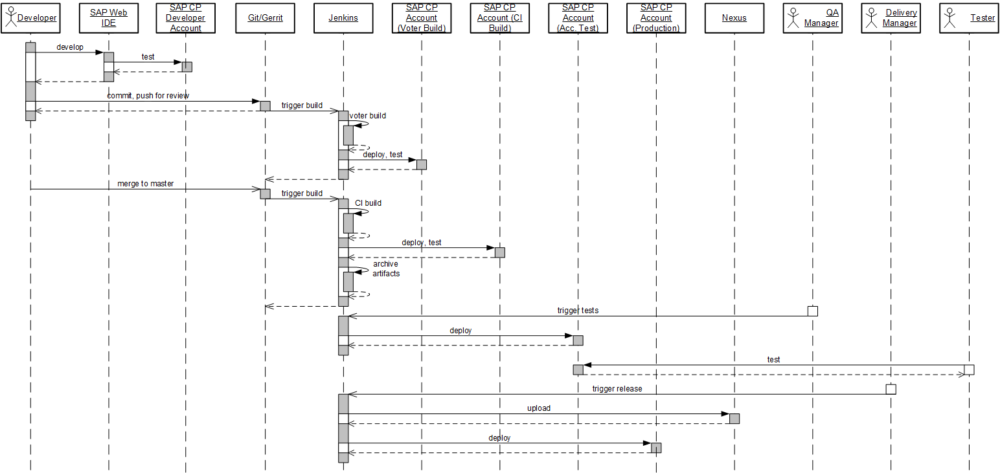
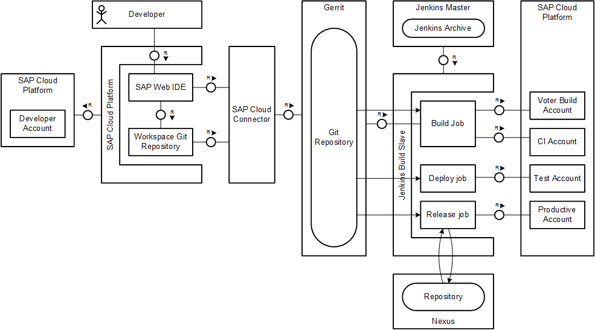
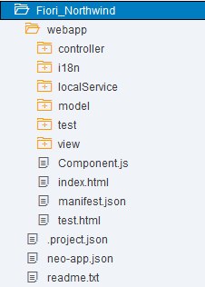
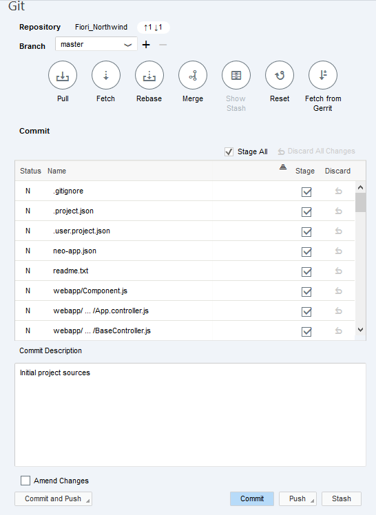
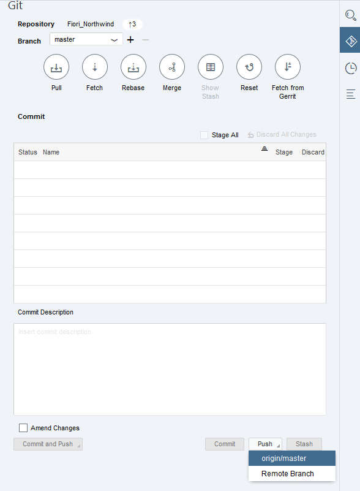
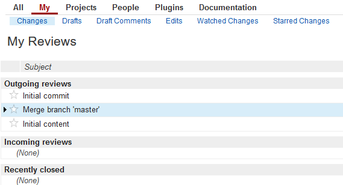
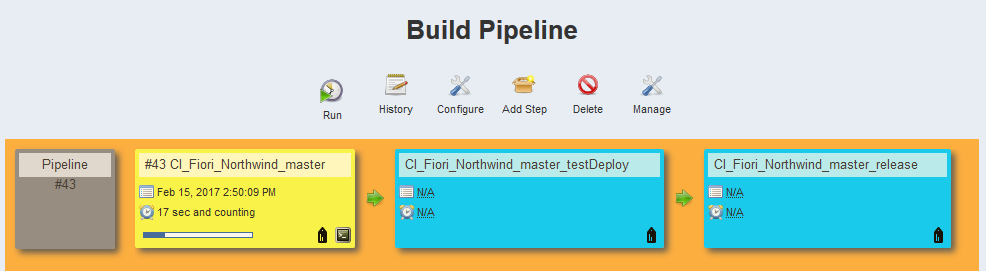

---

title: CI Best Practices Guide: SAPUI5/SAP Fiori on SAP Cloud Platform
description: Part 4.5: Implementing the CI pipeline to build an SAPUI5/SAP Fiori application on SAP Cloud Platform.
primary_tag: products>sap-cloud-platform
tags: [  tutorial>intermediate, tutorial:type/project ]

---

## Prerequisites  

  - **Proficiency:** Intermediate
  - [Source Code Versioning System](http://www.sap.com/developer/tutorials/ci-best-practices-scm.html)
  - [Build Scheduler](http://www.sap.com/developer/tutorials/ci-best-practices-build.html)
  - [Artifact Repository](http://www.sap.com/developer/tutorials/ci-best-practices-artifacts.html)
  - [Landscape Configuration](http://www.sap.com/developer/tutorials/ci-best-practices-landscape.html)
  - [Generic Project](http://www.sap.com/developer/tutorials/ci-best-practices-generic.html)

## Next Steps

  - [Back to the Navigator](http://www.sap.com/developer/tutorials/ci-best-practices-intro.html)

---

> This document is part of the guide [Continuous Integration (CI) Best Practices with SAP](http://www.sap.com/developer/tutorials/ci-best-practices-intro.html). To ensure that all the examples work properly, make sure that you have followed the setup instructions for all components listed in the prerequisites box.


### 1. Introduction

There is a lot of infrastructure available to support single developers who are creating and maintaining SAPUI5 or Fiori projects. SAP Web IDE provides a rich tool set that supports single developers or small teams; for example, wizards that generate a skeleton, and the metadata files that are required for new projects. For larger teams, however, there is an urgent need for an automated CI process based on a central build that includes automated testing and code quality checks.

This chapter's scenario describes a CI process for development of SAP Fiori or SAPUI5 applications running on SAP Cloud Platform. The developer's workspace is SAP Web IDE on SAP Cloud Platform (using SAP Web IDE personal edition as local development environment is also possible) from where deployments into a developer's account for instant testing are possible. When a developer finishes implementing a feature, he or she creates a Git commit in the SAP Web IDE workspace and pushes it into a centralized corporate Git repository, which is connected to SAP Web IDE through the SAP Cloud Connector. The example uses Gerrit for the central Git repository, but other solutions are possible. We make use of the Gerrit review features by implementing a voter build and a review process on the pushed commit before it is merged into the `master` branch of the central Git repository. The voter build usually executes static code checks and unit tests. Depending on the available resources (for example, an additional account on SAP Cloud Platform, or, if an additional account is not available, the application to be tested can be deployed with a generated, unique name), runtime tests are also possible.

Immediately after the commit has been merged to the `master` branch, the CI build starts on the new snapshot. The build executes static code analysis, unit tests and automatic runtime tests. For execution of the latter we use in our example a dedicated SAP Cloud Platform account. Application files are minified (white spaces and comments are removed), and a preload file is created. When the deployed application is accessed from SAP Cloud Platform via a browser, the preload file is requested first by default since it contains the content of all the application's JavaScript files. This reduces the number of round trips between the browser and the back end, significantly increasing the performance of the application loading process. Finally, the SAP Fiori/SAPUI5 application files are packaged into an MTA (multi-target application) archive. This is the package format that can be deployed automatically by the SAP Cloud Platform console client from a CI server where the build runs.

> [Multi-Target Applications](https://help.sap.com/viewer/65de2977205c403bbc107264b8eccf4b/Cloud/en-US/c4f0d850b6ba46089a76d53ab805c9e6.html)  
> [SAP Cloud Platform Console Client](https://help.sap.com/viewer/65de2977205c403bbc107264b8eccf4b/Cloud/en-US/76132306711e1014839a8273b0e91070.html)

After it has been successfully built and tested, the MTA artifact is archived for further processing. Acceptance tests are performed on a dedicated test system to which a stable version of the MTA file has been deployed. The deployment of the MTA version, which was successfully created during a CI build, can be triggered either manually by a responsible person (like a quality manager) or automatically via a defined schedule (for example, once a day in the morning). Testers can then execute manual acceptance tests.

After successful testing, it is the decision of the delivery manager to release the tested version to the productive system and to store the archive as release version to an artifact repository (the example uses Nexus).



Figure 1: Process for SAP Fiori/SAPUI5 development.

The landscape setup for this process is described in [Landscape Configuration](http://go.sap.com/developer/tutorials/ci-best-practices-landscape.html). The pipeline implementation by means of Jenkins jobs places real code into the skeleton described in [Sample Pipeline Configuration](http://go.sap.com/developer/tutorials/ci-best-practices-pipeline-skeleton.html).



Figure 2: Landscape for SAP Fiori/SAPUI5 development.


### 2. Prerequisites

Fiori/SAP UI5 applications are deployed in different stages to SAP Cloud Platform. To accommodate these stages on the runtime requires four different SAP Cloud Platform accounts for the following purposes:

- One development account for automatic deployment and the tests performed during the voter build. The voter builds must be executed sequentially; otherwise, the deployment of a new application version could be started before the running test of the currently deployed version has been finished. If more parallelization is needed, additional accounts could be used in a round-robin access strategy.

- One CI account for automatic deployment and tests during the CI build.

- One test account for manually triggered deployment of the application to be tested manually for acceptance tests.

- One productive account. The release and deployment of the application is triggered manually.

In addition, the following CI infrastructure components are needed. Their setup is described in the CI/CD Landscape - Component Setup pages accessible from the [Navigator](https://www.sap.com/developer/tutorials/ci-best-practices-intro.html) page.

- A corporate Git/Gerrit instance connected with SAP Web IDE (or the personal edition) via the SAP Cloud Connector.

- A Jenkins instance (eventually with separate slaves).

- A Nexus instance.


### 3. Creating Sources for a New Project

The standard procedure for creating a new SAPUI5 or Fiori project is to use the wizard in SAP Web IDE, which lets you choose from available templates and create a SAP Fiori/SAPUI5 skeleton in your workspace. The example is a master-detail application using an external sample OData service.

You can either use SAP Web IDE on SAP Cloud Platform, or SAP Web IDE personal edition, which offers the same features but runs on your local machine.

> [SAP Web IDE](https://help.sap.com/viewer/825270ffffe74d9f988a0f0066ad59f0/CF/en-US/0221845d73ad403ab2852142f3179177.html)  
> [SAP Web IDE Personal Edition](https://help.sap.com/viewer/825270ffffe74d9f988a0f0066ad59f0/CF/en-US/5b8bca3147ee4dfd99be8aaf6bd4f421.html)


#### Procedure

1. In Gerrit, create a project with a `master` branch as described in [Generic Project](http://www.sap.com/developer/tutorials/ci-best-practices-generic.html). The example uses `Fiori_Northwind` as the project name.

2. Before creating the application in SAP Web IDE, define an OData destination has in HANA Platform such that your application can consume it. The example uses the publicly available Northwind sample OData service:

    > [Creating a Northwind Destination](https://openui5.hana.ondemand.com/1.34.3/docs/guide/3a16c7a2f1e944deb000db49e5ece6be.html)

    In the SAP Cloud Platform cockpit, select **Connectivity > Destinations > New Destination**. Enter the following:

    Field                        | Value
    :--------------------------- | :------------------------------------------
    `Name`                       | `Northwind`
    `Type`                       | `HTTP`
    `Description`                | `Northwind OData Service`
    `URL`                        | `http://services.odata.org`
    `Proxy Type`                 | `Internet`
    `Authentication`             | `NoAuthentication`

    Add the following **Additional Properties**:

    Field                        | Value
    :--------------------------- | :------------------------------------------
    `WebIDEEnabled`              | `true`
    `WebIDESystem`               | `Northwind_Data`
    `WebIDEUsage`                | `odata_gen`

3. Open and log in to the appropriate IDE:

    > [Opening SAP Web IDE](https://help.sap.com/viewer/825270ffffe74d9f988a0f0066ad59f0/CF/en-US/51321a804b1a4935b0ab7255447f5f84.html)  
    > [SAP Web IDE Personal Edition](https://help.sap.com/viewer/825270ffffe74d9f988a0f0066ad59f0/CF/en-US/5b8bca3147ee4dfd99be8aaf6bd4f421.html)

4. In the IDE, select **Tools > Preferences > Git settings**. Enter your Git user name and email address, and save your settings.

5. Select the `Workspace` folder, then select **New > Project from Template**. Follow the instructions in the wizard to create the example master-detail application:

    - Select **SAP Fiori Master-Detail Application** as template. Press **Next**.

    - Enter `Fiori_Northwind` as **Project Name**. Press **Next**.

    - Enter `Service URL` as the data source, choose the `Northwind OData service` and enter `/V2/Northwind/Northwind.svc` as the URL path. Press **Test** to verify that the service metadata can be loaded, then press **Next**.

    - To keep it simple, the example uses only some of the fields in the template customization. Enter the following:

        Field                        | Value
        :--------------------------- | :------------------------------------------
        `Type`                       | `Standalone App`
        `Title`                      | `Products`
        `Namespace`                  | `com.mycompany.northwind`
        `Description`                | `Products`
        `Object Collection`          | `Products`
        `Object Collection ID`       | `ProductID`
        `Object Title`               | `ProductName`
        `Object Numeric Attribute`   | `UnitPrice`
        `Object Unit of Measure`     | `UnitPrice`

        Leave all other fields empty. Press **Finish**. The project is created and you see a folder structure like below.

        

6. Select the new project and select **Git > Initialize Local Repository**.

7. Select the new project again and select **Git > Set Remote**. Enter the following data:

    - Name: `origin`

    - URL: `<The HTTPS-based URL of your Gerrit project>`

    - Select **Add configuration for Gerrit**.

    - Press **OK**.

    

8. In the right sidebar, open the Git pane. Scroll down, mark **Amend Changes** and press **Commit**. This injects a change ID into the initial commit, which is required to be able push to Gerrit for review.

    

9. In Git pane again, mark **Stage All** and enter a commit description. Press **Commit**.

    

10. Select **Pull** to merge the version graphs of the local Git repository in SAP Web IDE and the remote repository. Check the Git history pane to make sure it looks as expected.

    

11. To propagate your changes from SAP Web IDE to Gerrit, return to the Git pane, and select **Push > origin/master**.

    

12. Open the Gerrit front end. You see your pushed changes (the initial commit, the merge commit and the last commit containing all project files) offered for review in Gerrit.

    

13. Review the changes in Gerrit and submit them to be merged into the `master` branch.


### 4. Installing and Configuring Node.js on the Jenkins Slave Machine

For processing the Fiori project's sources on the build node, Grunt as a task processor is used. Grunt requires Node.js and the included package manager npm. The example uses the Jenkins Node.js plugin to make node and npm available inside a job execution.


#### Procedure

1. Log in as user `jenkins` to the Jenkins slave machine and install Node.js (version 6 or later) to a path of your choice. It must be writeable for user `jenkins`.

    > [Node.js Home Page](https://Nodejs.org/en/)   
    > [Node.js Downloads](https://nodejs.org/en/download/)

    You can install the `tar.gz` package on Linux in any directory. We recommend that you define and use a common installation directory on all your Jenkins slave machines.

2. To enable the `grunt` command in a shell script, `grunt-cli` must be installed globally. As user `jenkins`, open a shell on the Jenkins slave machine, temporarily place the `bin` directory of your Node.js installation into the `PATH` variable, and execute the following command in a shell:

    ```
    npm install -g grunt-cli
    ```

3. Open the Jenkins front end, and go to **Manage Jenkins > Manage Plugins > Available**. Select **Node.js Plugin** and choose **Download now and install after restart**. Although the primary feature offered by the Node.js plugin (using JavaScript directly in job implementations) is not used in our example, it does handle multiple Node.js versions in parallel, allowing you to choose the appropriate one at the job level.

    The latest version of the Node.js plugin does not correctly provide the node path to the jobs, due to a known issue in the Environment Injector plugin. You may want to install an older version (for example, 0.2.1) instead:

    > [Environment inject plugin suppress variables contributed by extension points](https://issues.jenkins-ci.org/browse/JENKINS-26583)

4. In the Jenkins front end, go to **Manage Jenkins > Configure System**. Scroll down to the **Node.js** section and select **Node.js installations**. Enter the path to the Node.js binaries and an appropriate name for this installation. The name is referred to by build job definitions.


### 5. Installing the MTA Archive Builder

As Java application, the MTA archive builder, which is available from the SAP ONE Support Launchpad, can be installed directly on the Jenkins slave machine, or it can be stored on a location which is accessible via HTTP, for example Nexus. The latter alternative has the advantage that upgrades are much easier to handle.

> [Multi target Application Archive Builder](https://uacp2.hana.ondemand.com/viewer/58746c584026430a890170ac4d87d03b/HANA%202.0%20SPS%2002/en-US/ba7dd5a47b7a4858a652d15f9673c28d.html)  
> [SAP ONE Support Launchpad](https://launchpad.support.sap.com/)

#### Procedure

1. Enter SAP ONE Support Launchpad, navigate to Software Downloads, search for `MTA Archive Builder` and download the newest version.


2. Upload the MTA archive builder JAR file to a location where it is accessible via HTTP, for example Nexus.


### 6. Creating the Grunt Build File

The Grunt build of the Fiori/SAP UI5 application is controlled by a `Gruntfile.js` file. This file controls the task flow for processing sources and uses Grunt plugins, which are expected to be present during the Grunt run. The Grunt file in the example contains tasks for static code analysis, minification of the JavaScript files, and creation of a `Component-preload.js` file. The latter plays the role of the `Component.js` file, but contains the content of all JavaScript files on which it depends. When a browser loads a Fiori application, it first looks for this preload file, to reduce the number of round trips that would be required to load all the JavaScript files individually. (The files are loaded individually if `Component-preload.js` is not available.)

Before the Grunt build, the npm package manager installs the plugins needed for Grunt. A file named `package.json` declares the dependencies to required plugins. In the Jenkins build job definitions that are described in subsequent chapters, npm is not called explicitly; the MTA archive builder encapsulates all npm actions.

This scenario has been tested with the Grunt plugin versions that are described in the code listing for `package.json` in the appendix.


#### Procedure

1. Open your project in SAP Web IDE.

2. Select your project folder, choose **New > File** and enter `package.json` as the name.

3. Copy the content of `package.json` from the appendix and paste it into the new file.

4. Adapt the `package.json` file to your context by entering the following values:

    - Package name - must be identical to the namespace you used to create the application in SAP Web IDE. It the example: `com.mycompany.northwind`.

    - Package version

    - Description

5. Select your project folder, choose **New > File** and enter `Gruntfile.js` as its name.

6. Copy the content of `Gruntfile.js` from the appendix and paste it into the new file.

7. In the Git pane, stage the two new files, enter a commit description, and select **Commit and Push**.


### 7. Creating the MTA Descriptor

The packaging of the module to a deployable archive is done with help of the MTA archive builder. It calls custom builders for the contained modules, in our case the Grunt build for the SAP Fiori module.


#### Procedure

1. Open your project in SAP Web IDE.

2. Select your project folder, choose **New > File** and enter `mta.yaml` as the name.

3. Copy the content of `mta.yaml` from the appendix and paste it into the new file.

4. Adapt the `mta.yaml` file to your context by entering the following values:

    - ID of your MTA. In our scenario, in which the MTA is a wrapper for the Fiori application, it makes sense to use the same name as for the Fiori application itself

    - Version of your application, which is needed in two places: at the MTA level and at the module level. The module version number is used when the Fiori application is deployed to SAP Cloud Platform and exposed there. The version number on SAP Cloud Platform must be unique. We append a time stamp, which is evaluated during build time, to the version number. It is always good practice, to record a reference from the build artifact in SAP Cloud Platform to the time it was built.

    - The name of the module. This is exposed during deployment as name of the application on SAP Cloud Platform.

5. MTA builds produce additional temporary files and folders inside the project directory. To avoid accidentally placing these temporary files under Git control when working on a local PC, add the following entries into the `.gitignore` file:

    ```
    .mta
    *.mtar
    dist
    node_modules
    ```

6. In the Git pane, stage the new file, enter a commit description, and select **Commit and Push**.


### 8. Creating a Jenkins CI Build Job

In the example, the job for the CI build is created on the current `master` snapshot, which is triggered on each change. The configuration and credentials used in this section are based on the examples in [Build Scheduler](http://www.sap.com/developer/tutorials/ci-best-practices-build.html).


#### Procedure

1. Open Jenkins, select **New Item** to create a new job for the CI build and enter an appropriate item name; the example uses `CI_Fiori_Northwind_master_build`. Select **Freestyle Project** and press **OK**.

2. Select **This build is parametrized** and add the following string parameters:

    Name                                  | Default Value
    :------------------------------------ | :------------------------------------------
    `DEPLOY_HOST`                         | `hana.ondemand.com`
    `CI_DEPLOY_ACCOUNT`                   | `<Name of the CI account>`
    `TEST_DEPLOY_ACCOUNT`                 | `<Name of the TEST account>`
    `PROD_DEPLOY_ACCOUNT`                 | `<Name of the PROD account>`
    `NEXUS_REPOSITORY`                    | `<URL of the Nexus repository to which to release the application>`

3. In the job configuration, enter the following values:

    Field                                  | Value
    :------------------------------------- | :------------------------------------------
    Restrict where this project can be run | `builds`
    Source Code Management                 | `Git`
    Repository URL                         | `<URL of the Git repository>`
    Credentials                            | `jenkins`
    Branches to build                      | `master`

    Select **Additional Behaviours > Add > Check out to a sub-directory** and enter `src`.

4. Continue with the rest of the configuration:

    Field                                  | Value
    :------------------------------------- | :------------------------------------------
    Build Triggers                         |
    Poll SCM                               | `selected`
    Schedule                               | `<Enter a pull frequency. For immediate results, two minutes is an appropriate value.>`
    Build Environment                      |
    Delete workspace before build starts   | `selected`
    Inject password to build as environment variables | `selected`
    Global passwords                       | `selected`
    Mask password parameters               | `selected`
    Provide Node & npm bin/folder to PATH  | `selected`
    Installation                           | `<The node installation (version 6 or later) as previously defined>`

5. In the **Build** section, select **Add build step > Execute shell**. In the **Command** field, enter the following code:

    ```
    # install the MTA archive builder
    mkdir -p ${WORKSPACE}/tmp/mta
    cd ${WORKSPACE}/tmp/mta
    wget --output-document=mta.jar '<URL from where to download the MTA archive builder>'

    # install neo command line client
    mkdir -p ${WORKSPACE}/tmp/neo-java-web-sdk
    cd ${WORKSPACE}/tmp/neo-java-web-sdk
    wget 'http://central.maven.org/maven2/com/sap/cloud/neo-java-web-sdk/1.127.11/neo-java-web-sdk-1.127.11.zip'
    unzip -o neo-java-web-sdk-1.127.11.zip
    rm neo-java-web-sdk-1.127.11.zip

    # create local npmrc file
    cd ${WORKSPACE}/src
    cat <<EOF > .npmrc
    registry=https://registry.npmjs.org/
    @sap:registry=https://npm.sap.com/
    EOF

    # extract artifact name
    cd ${WORKSPACE}/src
    mtaName=`awk -F: '$1 ~ /^ID/ { gsub(/\s/,"", $2)
    gsub(/\"/,"", $2)
	print $2 }' mta.yaml`

    # replace timestamp placeholder
    sed -ie "s/\${timestamp}/`date +%Y%m%d%H%M%S`/g" mta.yaml

    # execute MTA build
    java -jar ${WORKSPACE}/tmp/mta/mta.jar --mtar ${mtaName}.mtar --build-target=NEO build

    # deploy to SAP Cloud Platform
    ${WORKSPACE}/tmp/neo-java-web-sdk/tools/neo.sh deploy-mta --user ${CI_DEPLOY_USER} --host ${DEPLOY_HOST} --source ${mtaName}.mtar --account ${CI_DEPLOY_ACCOUNT} --password ${CI_DEPLOY_PASSWORD} --synchronous

    ```

    The MTA archive builder and the SAP Cloud Platform console client are downloaded and installed using their URLs. To configure npm to connect to the SAP npm registry to download SAP scoped npm packages, we created a local `.npmrc` file. Although using the Jenkins Config File Provider plugin would fit very well here, doing so is currently not possible, due to the aforementioned issue with the Environment Injector plugin. The application name is taken from the `mta.yaml` file, and the timestamp placeholder is replaced by the current time to reflect the build time in the application meta data. The MTA build starts and produces an `mtar` file, which is deployed to SAP Cloud Platform.

6. In the **Post-build Actions** section, select **Add post-build action > Archive the artifacts** and enter `src/*.mtar, src/mta.yaml` as **Files to archive**.

7. Select **Add post-build action > Build other projects (manual step)** and enter `CI_Fiori_Northwind_master_testDeploy` as the projects to build. Ignore the warning that the job entered does not yet exist. We will create it in the next procedure.

8. Select **Add Parameters > Current build Parameters**.

9. **Save** the configuration.

10. Select **Jenkins > Manage Jenkins > Configure System** and scroll down to the **Global Passwords Section**.

11. Add the following names and store their values: `CI_DEPLOY_USER`, `CI_DEPLOY_PASSWORD`, `TEST_DEPLOY_USER`, `TEST_DEPLOY_PASSWORD`, `PROD_DEPLOY_USER`, `PROD_DEPLOY_PASSWORD` according to the credentials of the deploy users in the CI, TEST and PROD accounts.

12. Trigger the build manually. Monitor the build and the deployment of the application into your SAP Cloud Platform account.


### 9. Creating a Jenkins Job for Deployment to the Test Account

The next job of the CI build jobs is triggered manually: the quality manager or test coordinator must provide a test account with one candidate that has successfully passed the CI build job. The account is used by manual testers for acceptance tests.

From a technical point of view, this job deploys the `mtar` file that was archived in the CI build job to the `TEST` account on SAP Cloud Platform.


#### Procedure

1. Open Jenkins and select **New Item > Freestyle Job**. Enter `CI_Fiori_Northwind_master_testDeploy`.

2. Select **This build is parametrized**, enter the following string parameters and leave their values empty:

    Name                                  | Default Value
    :------------------------------------ | :------------------------------------------
    `DEPLOY_HOST`                         | `<empty>`
    `CI_DEPLOY_ACCOUNT`                   | `<empty>`
    `TEST_DEPLOY_ACCOUNT`                 | `<empty>`
    `PROD_DEPLOY_ACCOUNT`                 | `<empty>`
    `NEXUS_REPOSITORY`                    | `<empty>`

3. For the other configuration options, enter the following:

    Field                                        | Value
    :------------------------------------------- | :-------------------------------------------------------------------------
    Restrict where this project can be run       | `selected`
    Label Expression                             | the label that you have assigned to the slave, for the example, `builds`
    Source Code Management > None                | `selected`
    Build Environment                            |
    Delete workspace before build starts         | `selected`
    Inject passwords to the build as environment | `selected`
    Global passwords                             | `selected`
    Mask password parameters                     | `selected`
    Provide Node & npm bin/folder to PATH        | `selected`
    Installation                                 | `<The node installation (version 6 or later) as previously defined>`

4. In the **Build** section, select **Add build step > Copy artifacts from another project** and enter the following:

    Field                                  | Value
    :------------------------------------- | :-------------------------------------------------------------------------
    Project name                           | `CI_Fiori_Northwind_master_build`
    Which build                            | `Upstream build that triggered this job`
    Artifacts to copy                      | `src/*.mtar, src/mta.yaml`

    This step restores the artifact that was created in the build job into the workspace directory of this job.

5. Select **Add build step > Execute shell** and enter the following script implementation:

    ```
    # install neo command line client
    mkdir -p ${WORKSPACE}/tmp/neo-java-web-sdk
    cd ${WORKSPACE}/tmp/neo-java-web-sdk
    wget 'http://central.maven.org/maven2/com/sap/cloud/neo-java-web-sdk/1.127.11/neo-java-web-sdk-1.127.11.zip'
    unzip -o neo-java-web-sdk-1.127.11.zip
    rm neo-java-web-sdk-1.127.11.zip

    # deploy to SAP Cloud Platform
    cd ${WORKSPACE}/src
    ${WORKSPACE}/tmp/neo-java-web-sdk/tools/neo.sh deploy-mta --user ${TEST_DEPLOY_USER} --host ${DEPLOY_HOST} --source *.mtar --account ${TEST_DEPLOY_ACCOUNT} --password ${TEST_DEPLOY_PASSWORD} --synchronous
    ```

6. In the **Post-build Actions** section, select **Add post-build action > Build other projects (manual step)** and enter `CI_Fiori_Northwind_master_release` in **Downstream Project Names**. You can safely ignore the warning that the job entered does not yet exist, as we will be creating it in the next procedure.

7. Select **Add Parameters > Current build Parameters**.

8. Save.


### 10. Creating a Jenkins Release Job

The last job in the pipeline implements the release of a version that has successfully passed the acceptance test. Technically, two things happen: the artifact is uploaded to Nexus into a release repository, and it is deployed to the production account.

The example uses a copy of the test deploy job, adapting the target that points to the productive account, and adding a step for the upload to Nexus.


#### Procedure

1. Open Jenkins, select **New Item** and enter `CI_Fiori_Northwind_master_release` as the **Item name**. Select **Copy existing item** and enter `CI_Fiori_Northwind_master_testDeploy` as the template to be copied.

2. In the **Build** section, enter the following code into the **Command** field:

    ```
    # install neo command line client
    mkdir -p ${WORKSPACE}/tmp/neo-java-web-sdk
    cd ${WORKSPACE}/tmp/neo-java-web-sdk
    wget 'http://central.maven.org/maven2/com/sap/cloud/neo-java-web-sdk/1.127.11/neo-java-web-sdk-1.127.11.zip'
    unzip -o neo-java-web-sdk-1.127.11.zip
    rm neo-java-web-sdk-1.127.11.zip

    # upload to Nexus
    cd ${WORKSPACE}/src
    awk -F: '\
    BEGIN {
        print "<project xsi:schemaLocation=\"http://maven.apache.org/POM/4.0.0 http://maven.apache.org/xsd/maven-4.0.0.xsd\">"
        print "<modelVersion>4.0.0</modelVersion>"}
    $1 ~ /^version/ { gsub(/\s/,"", $2)
        gsub(/\"/,"", $2)
        printf "<version>%s</version>\n", $2}
    $1 ~ /^ID/ { gsub(/\s/,"", $2)
        gsub(/\"/,"", $2)
        idx = match($2, /\.[^\.]*$/)
        printf "<groupId>%s</groupId>\n", substr($2,0,idx-1)
        printf "<artifactId>%s</artifactId>\n", substr($2,idx+1)}
    END {print "</project>\n"}
    ' mta.yaml > pom.xml

    mtaName=`awk -F: '$1 ~ /^ID/ { gsub(/\s/,"", $2)
        gsub(/\"/,"", $2)
    	print $2 }' mta.yaml`

    mvn deploy:deploy-file -Durl=${NEXUS_REPOSITORY} \
        -Dfile=${mtaName}.mtar -DrepositoryId=nexusCIProcess -Dpackaging=mtar -DpomFile=pom.xml

    # deploy to SAP Cloud Platform
    ${WORKSPACE}/tmp/neo-java-web-sdk/tools/neo.sh deploy-mta --user ${PROD_DEPLOY_USER} --host ${DEPLOY_HOST} --source *.mtar --account ${PROD_DEPLOY_ACCOUNT} --password ${PROD_DEPLOY_PASSWORD} --synchronous
    ```

3. Remove any post-build action.

4. Save.


### 11. Adding a Pipeline View

Once you create the CI Jenkins jobs, add a convenient overview of the pipeline in Jenkins.

#### Procedure

1. Open Jenkins and click the view tab with the **+** sign.

2. Enter `Fiori_Northwind_pipeline` and select `Build Pipeline View`.

3. Select `CI_Fiori_Northwind_master_build` for **Select Initial Job** and specify the **No of Displayed Builds**, for example, `5`.

4. Press **OK**.


### 12. Creating a Jenkins Voter Build Job

The voter build job is executed immediately after you push a commit to Gerrit for review.

#### Procedure

1. Open Jenkins and select **New Item**. Enter `VO_Fiori_Northwind_master_build` as the **Item name**, select **Copy existing item**, and enter `CI_Fiori_Northwind_master_build` as **Copy from**.

2. Unselect **This build is parametrized**.

3. In the **Source Code Management** section, select **Advanced...** and enter `refs/changes/*:refs/changes/*`as **Ref spec**. Enter `$GERRIT_REFSPEC` as **Branches to build**.

4. In the **Build Trigger** section, unselect **Poll SCM** and select **Gerrit Event** instead.

5. In the **Gerrit Trigger** section:

    - Choose your Gerrit server.

    - Select **Trigger on > Add > Patch set Created**.

    - In the **Gerrit Project** configuration, enter `Fiori_Northwind` as pattern and `master` as branch.

6. In the **Build** section, enter the following code into the **Command** field:

    ```
    # install MTA build tool
    mkdir -p ${WORKSPACE}/tmp/mta
    cd ${WORKSPACE}/tmp/mta
    wget --output-document=mta.jar '<URL from where to download the MTA archive builder>'
 
    # create local npmrc file
    cd ${WORKSPACE}/src
    cat <<EOF > .npmrc
    registry=https://registry.npmjs.org/
    @sap:registry=https://npm.sap.com/
    EOF

    # extract artifact name
    cd ${WORKSPACE}/src
    mtaName=`awk -F: '$1 ~ /^ID/ { gsub(/\s/,"", $2)
        gsub(/\"/,"", $2)
    	print $2 }' mta.yaml`

    # replace timestamp placeholder
    sed -ie "s/\${timestamp}/`date +%Y%m%d%H%M%S`/g" mta.yaml

    # execute MTA build
    java -jar ${WORKSPACE}/tmp/mta/mta.jar --mtar ${mtaName}.mtar --build-target=NEO build
    ```

7. Remove any post-build action.

8. Save.

You may want to test the voter and the CI build jobs: apply a local change on your project, create a Git commit and push it to Gerrit. The voter build is triggered immediately. If your change does not contain any build errors, verify and submit it in Gerrit. After two minutes, the CI build starts running.


### 13. Roundtrip Through the Process

All Jenkins jobs are now ready to do a full roundtrip through the CI process, including a voter build that is done before a commit reaches the master branch, through the CI process.

1. In SAP Web IDE, enter the `Fiori_Northwind` project. Perform a small change (for example, increase the version number of your component in `mta.yaml`). Add the change to Git, commit it, and push it to Gerrit.

2. After few seconds, the voter build in Jenkins starts. Monitor the build result in Jenkins and Gerrit.

    

3. In Gerrit, review and submit the change. It is now in the merged status.

4. Monitor the CI build in the pipeline view in Jenkins. The build starts within two minutes of submitting the change.

    

5. When the CI build job has finished successfully, start the test deploy job. Verify in the log that the `mtar` file has been deployed to the `TEST` account.

6. Assume that the manual tester has finished the testing efforts. Release the `mtar` file and deploy it to the `PROD` account. Trigger the release job. Use the Jenkins log to monitor how the archive is uploaded to Nexus and deployed. Keep in mind that a released version can be deployed to a Nexus release repository only once. You must always increment the version number of the application, otherwise the Nexus upload fails.

    Check in Nexus that the `mtar` file has been correctly uploaded.


### Appendix

#### `package.json`

The `package.json` file contains meta-information about the JavaScript project. The dependencies to Grunt plugins are needed during build time, not at run-time; they are therefore entered as `devDependencies`. The scenario described here has been tested with the versions shown below; we cannot guarantee compatibility of the plugins in other versions.

The file here contains the minimum amount of code necessary to make the process skeleton run. You might want to add more data according to your requirements.

You will need to enter some items manually, such as the name and the version of your package.

> [Npm documentation for `package.json`](https://docs.npmjs.com/files/package.json)

```
{
    "name": "<name of the package>",
    "version": "<version of the package>",
    "description": "<description of the package>",
    "private": true,     
    "devDependencies": {
        "grunt": "1.0.1",
        "@sap/grunt-sapui5-bestpractice-build": "^1.3.17"
    }
}
```


#### `Gruntfile.js`

The Grunt build file uses the `@sap/grunt-sapui5-bestpractice-build` npm module, which is available on the SAP npm registry `npm.sap.com`.  It contains tasks to cover the following:

- Static code analysis

- Minifying the JavaScript files

- Creating a preload file that contains the contents of all JavaScript files for reducing the number of HTTP round trips

```
module.exports = function (grunt) {
    'use strict';
    grunt.loadNpmTasks('@sap/grunt-sapui5-bestpractice-build');

    grunt.registerTask('default', [
        'lint',
        'clean',
        'build'
    ]);
};
```

Since `@sap/grunt-sapui5-bestpractice-build` already initializes the Grunt configuration, additionally required custom task configurations must be added in the code above; the usage of `grunt.initConfig` does not work here.


#### `mta.yaml`

The `mta.yaml` file describes the metadata of a multi-target application (MTA) and its contained modules with their dependencies. In the example, which has only one Fiori/SAP UI5 module, the MTA serves as deployment vehicle for the application to SAP Cloud Platform.

> [Multi-Target Applications: Reference of Supported Deployment Options](https://help.sap.com/viewer/65de2977205c403bbc107264b8eccf4b/Cloud/en-US/f1caa871360c40e7be7ce4264ab9c336.html)

```
_schema-version: "2.0.0"
ID: "<Id of your MTA>"
version: <version number of your application>

parameters:
  hcp-deployer-version: "1.0.0"

modules:
  - name: "<Name of your Fiori application>"
    type: html5
    path: .
    parameters:
       version: <version number of your application>-${timestamp}
    build-parameters:
      builder: grunt
      build-result: dist
```

The `build-result` parameter informs the MTA archive builder about the location of the files that should be zipped into the archive.


> The content of this document is for guidance purposes only. No warranty or guarantees are provided.

## Next Steps

  - [Back to the Navigator](http://www.sap.com/developer/tutorials/ci-best-practices-intro.html)
