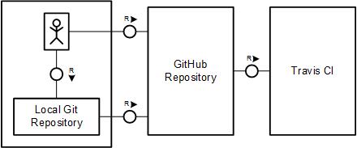
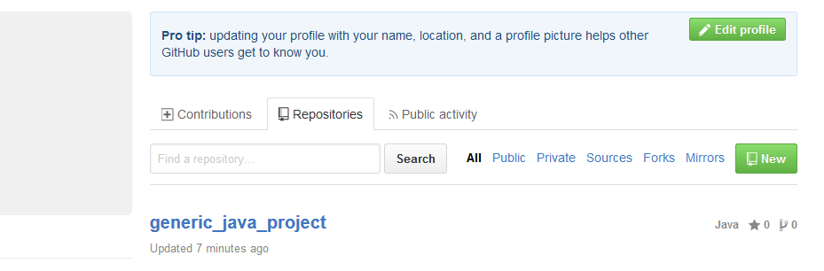
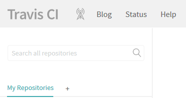
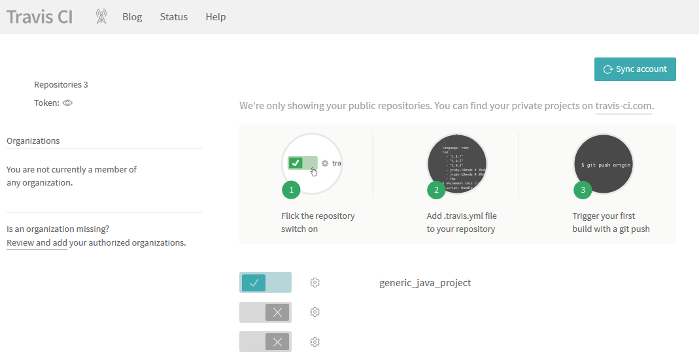
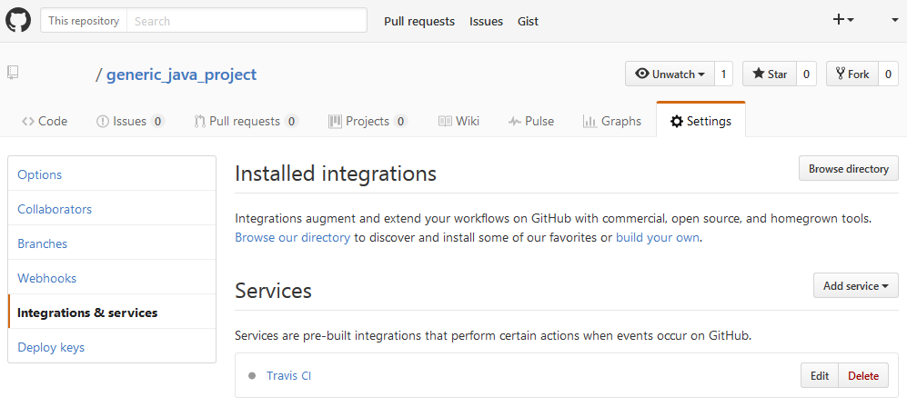
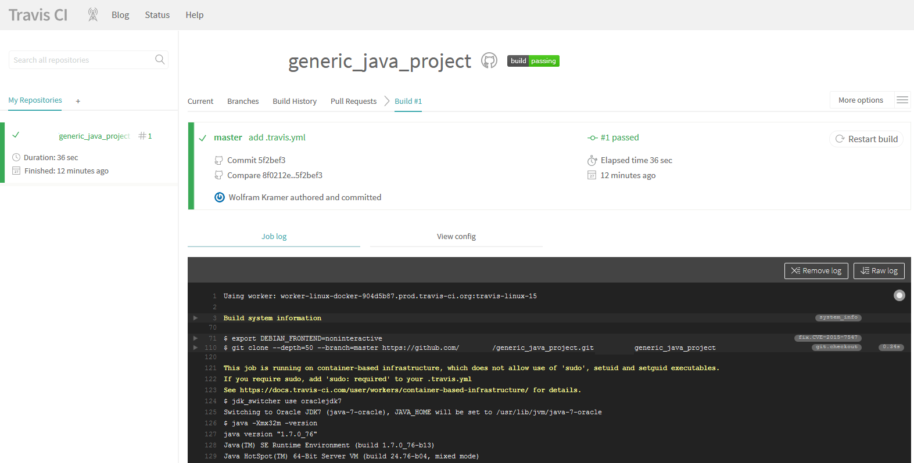

---

title: Continuous Integration (CI) Best Practices with SAP: Generic Project with CI using Cloud Services
description: Part 5.1: Configuring cloud-based CI system for Maven-based generic Java project.
primary_tag: products>sap-cloud-platform
tags: [  tutorial>intermediate, tutorial:type/project ]

---

## Prerequisites

  - **Proficiency:** Intermediate
  - [Generic Project](http://www.sap.com/developer/tutorials/ci-best-practices-generic.html)

## Next Steps

  - [Back to the Navigator](http://www.sap.com/developer/tutorials/ci-best-practices-intro.html)

---


This scenario focuses on using publicly available services to build Java applications quickly and efficiently using the cloud services GitHub and Travis CI. There is no need to set up any local infrastructure.

This pipeline adheres to basic CI and CD practices and can be easily extended. It ensures that each change to your project's repository is built centrally, thus applying the "Build Every Change" CI practice which is crucial for collaborative development.

GitHub's public Source Code Management (SCM) service, and Travis CI as the build system, provide an enormous ecosystem. Travis CI is a distributed continuous integration service for building and testing software projects, which are hosted at GitHub. Both GitHub and Travis CI offer various plans to suit your individual requirements, ranging from a free public offering to an on-premise installation of the full service.

#### Prerequisites

- An account on GitHub and Travis CI. If you already have an account, you can reuse it.

GitHub and Travis CI are both also available in enterprise on-premise versions. You can also set up mixed scenario, using one part in the cloud and the other on-premise.

> GitHub: https://github.com  
> GitHub Enterprise: https://enterprise.github.com/home  
> Travis CI: https://travis-ci.org, https://en.wikipedia.org/wiki/Travis_CI


### Basic setup

The example shows how to create a GitHub repository containing a small sample application, and configure Travis CI to react on a commit event in GitHub by triggering a build.



Figure 1: The component landscape

####  Procedure

1. Enter the GitHub site and log in to your account.

    > GitHub: https://github.com

2. Create a new repository with a name of your choice. This example uses the name `generic_java_project`.

    

3. The next step is creating a sample application. Clone the new repository to your local PC. Before doing this, ensure that the proxy is set for Git.

    - Set the HTTP proxy:

    ```
    git config --global http.proxy {the URL of your HTTP proxy}
    git config --global https.proxy {the URL of your HTTPS proxy}
    ```

    - Now clone the repository:

    ```
    git clone {The URL of the new GitHub project}
    ```

4. Add the initial project files into the Git workspace. For example, add the following files including the content located in the appendix of the [Generic Project](http://www.sap.com/developer/tutorials/ci-best-practices-generic.html):

    ```
    {git repository root}/pom.xml
    {git repository root}/src/main/java/company/org/App.java
    {git repository root}/src/test/java/company/org/AppTest.java
    ```

5. Add, commit, and push the sources. The initial project is now available in GitHub.

    ```
    git add .
    git commit -m "Initial version of HelloWorld"
    git push origin master
    ```

6. Open the URL of Travis CI in your browser and select **Sign in with GitHub**. You log in to Travis CI with your GitHub account.

    > Travis CI: https://travis-ci.org

7. In the Travis CI front end, select **My Repositories** and select **+**.

    

    You see a list of your GitHub repositories.

8. Add your repository (in this example, `generic_java_project`) to Travis CI by turning on the switch.

    

    A web hook to the settings of your GitHub repository is automatically added and is called when you push new changes. You can verify your settings in GitHub by selecting **Settings > Integrations & services** from your project:

    

9. Travis CI requires a file called `.travis.yml` to be in your project's root directory. This file specifies the build technology and environment. This example uses Java as the build technology and the appropriate Java SDK version for the compilation. Add a new `.travis.yml` file to your project root directory with the following content:

    ```
    sudo: false
    language: java
    jdk: oraclejdk7
    ```

10. Commit and push the new file to trigger a build on Travis CI. Check the build status in Travis CI.

    


### Pull Requests

So far, the example has used the `master` branch of the project without isolating the changes: the build triggered in Travis CI corresponds to a CI build, which processes the current change that already has been integrated into the `master` branch.

To avoid spoiling the `master` branch by integrating unqualified changes, a concept similar to voter builds is required. Build and test changes in isolation from the `master` branch before merging them. Pull requests in GitHub are attached to dedicated branches (that are separate from the `master` branch), in which the commits of a developer can be collected, reviewed, built, and verified. Once the quality of the new content has been proven, the pull request is closed by the responsible person and the underlying branch is merged into the `master` branch.

There is no additional configuration required to implement this; Travis CI reacts on any commit events in any branch. Even creating a pull request triggers a build.

The development paradigm that uses pull requests is described below. For more information, please see the GitHub help page:

> GitHub Help: https://help.github.com/

Figure 2 illustrates the mechanics of pull requests.

1. The developer clones or fetches the current repository to a local disk.

2. The developer creates commits in a local branch.

3. A push to GitHub is done into a new central branch that is different from the `master` branch.

4. The commit is automatically built by Travis CI.

5. Repeat steps 2 - 4 until the developer is ready to propose that the changes can be merged into the `master` branch.

6. The developer creates a pull request in GitHub.

7. Travis CI builds the current content of the pull request and other developers get a chance to review the changes. The request remains  open for commits.

8. As soon as the maturity of the content has reached the desired level, the responsible person merges the pull request into the `master` branch.


Figure 2: The CI process with pull requests in GitHub.


## Next Steps

  - [Back to the Navigator](http://www.sap.com/developer/tutorials/ci-best-practices-intro.html)
