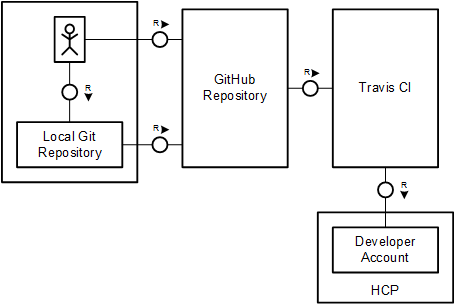
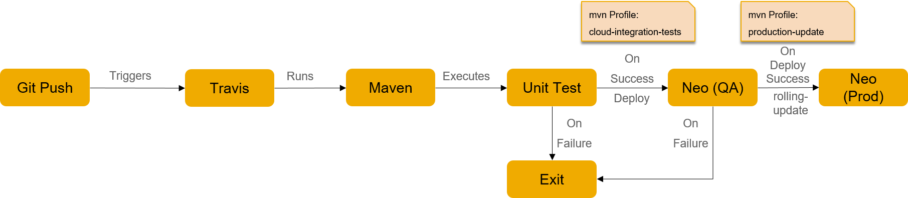
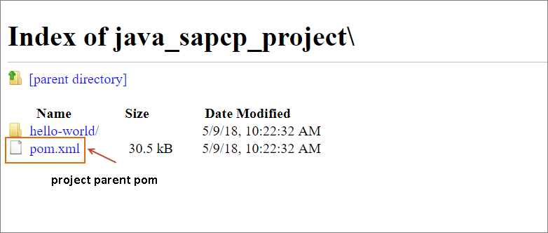
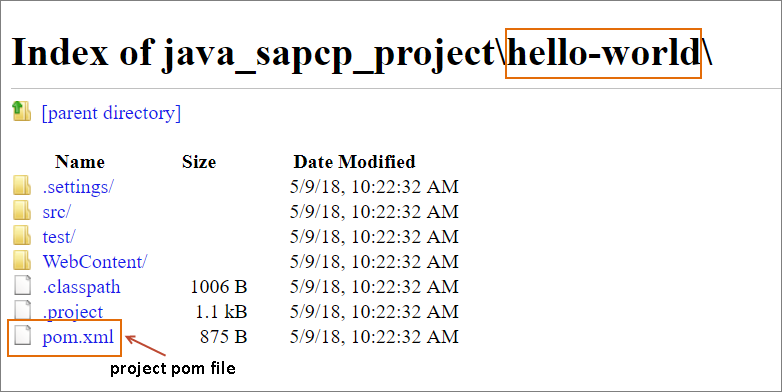
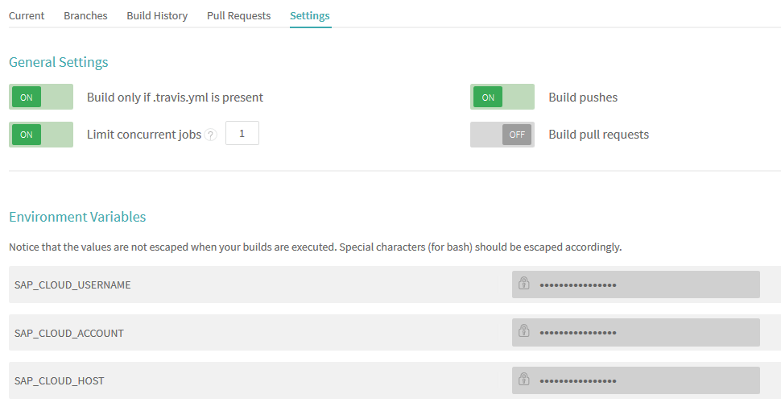
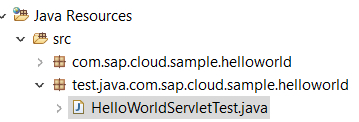
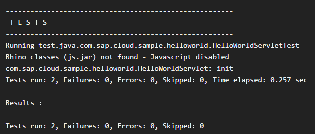

---

title: Continuous Integration (CI) Best Practices with SAP — Java Web on SAP Cloud Platform using a Cloud-based Build Service
description: Part 5.2 — Configuring Cloud-based Build System for Maven-based Java Web on SAP Cloud Platform project.
primary_tag: products>sap-cloud-platform
tags: [  tutorial>intermediate, tutorial:type/project ]

---

## Prerequisites

  - **Proficiency:** Intermediate
  - [Generic Project with CI on Cloud](https://www.sap.com/developer/tutorials/ci-best-practices-generic-cloud.html)
  
---


### 1. Introduction

This chapter is a continuation of the discussion in [Generic Project (Pure Java) Using Cloud Services](https://www.sap.com/developer/tutorials/ci-best-practices-generic-cloud.html) and explains the CI approach on both Neo and CF environment. We follow the approach of using GitHub and Travis CI as cloud services to process sample code that is delivered as part of the SDK installation for Java Web development. The sample discussed here contains some web applications that are built using Maven and share a common parent `pom.xml` file. Documentation and resources for Java web application development include the following:

> [Java: Getting Started](https://help.sap.com/viewer/65de2977205c403bbc107264b8eccf4b/Cloud/en-US/e66f3eecbb5710148397a19b46c4979b.html)  
> [Tutorial: Developing and deploying a basic Java application on SAP Cloud Platform](https://www.sap.com/developer/tutorials/hcp-java-basic-app.html)  
> [Installing the SDK](https://help.sap.com/viewer/65de2977205c403bbc107264b8eccf4b/Cloud/en-US/7613843c711e1014839a8273b0e91070.html)  
> [SDK Download](https://tools.hana.ondemand.com/#cloud)
 
We go beyond the pure build, and discuss how to add a post-build step to deploy the application to SAP Cloud Platform.



Figure 1: Landscape using GitHub and Travis CI

We also explain the best practices with respect to the Travis CI integration and Maven application deployment on SAP Cloud Platform for blue-green deployment. In simple terms, blue-green deployment ensures a minimum of downtime by running two processes called "blue" and "green" in the same instance. At any time, only one of the processes (blue) is available for access while the other (green) is ready for the blue process to get closed. This is illustrated below:


Figure 2: Blue-green deployment

This document covers the blue-green deployment procedures on both Neo and Cloud Foundry environment. 

SAP Cloud Platform offers two ways to achieve zero downtime blue-green deployment of applications in Neo environment: 

- Manually – involves manually enabling or disabling application processes. This method provides better control over the processes and lets you specify the time at which the new version is enabled.
- Automatically – also called "rolling update". The entire process switch is automated. The system automatically chooses and disables the processes of the old version while simultaneously enabling the new version. We describe below how to use the rolling update feature in the Neo case.

For the Cloud Foundry environment, we use a shell script to apply the blue-green deployment procedure.


### 2. Prerequisites

- In case of SAP Cloud Platform Neo

    - Ensure that there are two different subaccounts on SAP Cloud Platform: QA and production. The production account must have at least three compute units available at the time of deployment. 

- In case of SAP Cloud Platform Cloud Foundry

    - Ensure to have two different spaces: QA and production. Ensure to have the necessary provisioning done for the application runtime. 


### 3. Basic Setup

Basically we'll follow the instructions for creating the GitHub project and a Travis CI build as described in [Generic Project (Pure Java) Using Cloud Services](https://www.sap.com/developer/tutorials/ci-best-practices-generic-cloud.html). In contrast we'll use a sample project from the `samples` folder of the SAP Cloud Platform SDK installation zip as sources that you can download from the link below. Though the sample is shipped together with the Neo SDK, it can also be used for Cloud Foundry.

> [Installing the SAP Cloud Platform Neo SDK](https://help.sap.com/viewer/65de2977205c403bbc107264b8eccf4b/Cloud/en-US/7613843c711e1014839a8273b0e91070.html)  
> [Neo SDK Download](https://tools.hana.ondemand.com/#cloud)

This example uses the project name `java_sapcp_project`.

The following illustration depicts the flow implementing the CI/CD process:



Figure 3: The CI/CD process flow

#### Procedure

1. In GitHub, create a new repository named `java_sapcp_project` and clone it to your local machine as described in [Generic Project (Pure Java) Using Cloud Services](https://www.sap.com/developer/tutorials/ci-best-practices-generic-cloud.html), steps 1-3.

2. The `samples` folder in the SAP Cloud Platform SDK contains a Maven parent project that includes a couple of modules. For this example, we are going to use only the `hello-world` module. Therefore copy the sources of the `hello world` Maven project and the parent `pom.xml` file from the `samples` folder into your cloned `java_sapcp_project` repository root folder. The structure should look like this:
  
  
  <br/>Use comments in the parent `pom.xml` file to exclude the other modules from the project:

    ```
    <modules>
    <!--
        <module>...
           ...</module>
    -->
        <module>hello-world</module>
    <!--
        <module>...
           ...</module>
    -->
    </modules>
    ```

3. Continue setting up the GitHub project and Travis CI build as described in [Generic Project (Pure Java) Using Cloud Services](https://www.sap.com/developer/tutorials/ci-best-practices-generic-cloud.html), steps 5-10. The result is a successful build of the application on Travis CI.

### 4. Deploying to SAP Cloud Platform - Neo Environment

If the application should be deployed to SAP Cloud Platform Cloud Foundry, skip this section and continue with section 5.

The tools that are required for deployment to SAP Cloud Platform Neo are already referenced in the project's `pom.xml` file; you only need to configure the deployment parameters.

#### Prerequisites

   Deploy the `java_sapcp_project` application on the SAP Cloud Platform Neo production account. The application must be deployed with the number of application processes set to 3 using the `-m` parameter in the `neo` command.

   > [`neo` deploy command](https://help.sap.com/viewer/65de2977205c403bbc107264b8eccf4b/Cloud/en-US/937db4fa204c456f9b7820f83bc87118.html)

#### Procedure

1. In the sources of the sample project, open the parent `pom.xml` file.

2. In the property definition, change the value of `${sap.cloud.sdk.path}` as follows:

    ```
    ...
      <properties>
        ...
        <sap.cloud.sdk.path>${project.build.directory}/sdk</sap.cloud.sdk.path>
        ...
      </properties>
    ...
    ```
    
    The above step ensures that the 'Neo SDK' is installed in the project directory to be accessed by the Maven goals. 

3. The profile `cloud-integration-tests` is used for automated testing and deployment to the QA account. In the section of `pom.xml` that defines the profile `cloud-integration-tests`, add the following lines to define the SDK installation directory:

    ```
    ...
      <profile>
        <id>cloud-integration-tests</id>
        <build>
          <plugins>
            <plugin>
              <groupId>com.sap.cloud</groupId>
              <artifactId>${sap.cloud.sdk.plugin}</artifactId>
              <executions>
                ...
                <execution>
                  <phase>initialize</phase>
                  <goals>
                    <goal>install-sdk</goal>
                  </goals>
                </execution>
                ...
              </executions>
              ...
            </plugin>
            ...
          </plugins>
        </build>
      </profile>
    ...
    ```
     
    > [SAP Cloud Platform Maven Plugin](https://help.sap.com/viewer/65de2977205c403bbc107264b8eccf4b/Cloud/en-US/4cbdab6e2eb14c92ab76540ffb32174c.html)

    The profile `cloud-integration-tests` must also contain the Maven steps to deploy the application and restart it in the QA environment. Include the following executions as part of the `${sap.cloud.sdk.plugin}` plugin configuration inside the profile:
    
    ```
    <execution>
      <id>deploying-application</id>
      <phase>package</phase>
      <goals>
        <goal>run-console-command</goal>
      </goals>
      <configuration>
        <!-- Following console command is used to deploy the application to the QA environment -->
        <consoleCommand>deploy -a ${sap.cloud.account} -b ${sap.cloud.application} -h ${sap.cloud.host} -u ${sap.cloud.username} -p ${sap.cloud.password} -source ${project.build.directory}/${project.artifactId}.war</consoleCommand>			              
      </configuration>
    </execution>
    <execution>
      <id>restart-application</id>
      <phase>package</phase>
      <goals>
        <goal>run-console-command</goal>
      </goals>
      <configuration>
        <!-- The console command is used to restart the application in order to reflect the changes -->
        <consoleCommand>restart -a ${sap.cloud.account} -b ${sap.cloud.application} -h ${sap.cloud.host} -u ${sap.cloud.username} -p ${sap.cloud.password}</consoleCommand>			              
      </configuration>
    </execution>
    ```

    Once the tests on the QA account pass, the profile `update`, which is described in the next step, deploys the application into the production environment. Maven executes the deployment to production only if the test has been passed, thus ensuring continuous deployment.

      
4. The rolling update on the production account is handled by the profile `update`. It ensures that the current running process is shut down gracefully before the updated application's processes start.

    > [Console Client Commands: rolling-update](https://help.sap.com/viewer/65de2977205c403bbc107264b8eccf4b/Cloud/en-US/3f5d41207b6a4d0b9ad2e46dc6f27e69.html).

    Add the following new profile to the `pom.xml` file:

    ```
    ...
      <profile>
        <id>update</id>
        <build>
          <plugins>
            <plugin>
              <groupId>com.sap.cloud</groupId>
              <artifactId>${sap.cloud.sdk.plugin}</artifactId>
              <executions>
                <!-- This execution is required to install the SDK -->
                <execution>
                 <phase>initialize</phase>
                 <goals>
                  <goal>install-sdk</goal>
                 </goals>
                </execution>
                <!-- This execution is used to run the rolling-update command for blue-green deployment -->
                <execution>
                  <id>deploying-application</id>
                  <phase>package</phase>
                  <goals>
                    <goal>run-console-command</goal>
                  </goals>
                  <configuration>
                    <consoleCommand>rolling-update -a ${sap.cloud.account} -b ${sap.cloud.application} -h ${sap.cloud.host} -u ${sap.cloud.username} -p ${sap.cloud.password} -source ${project.build.directory}/${project.artifactId}.war</consoleCommand>                 
                  </configuration>
                </execution>
              </executions>
         	    <configuration>
                <skip>${skipIntegrationTests}</skip>
                <sdkInstallPath>${sap.cloud.sdk.path}</sdkInstallPath>
              </configuration>
            </plugin>
          </plugins>
        </build>
      </profile>
    ...
    ```

For the rolling update to execute successfully, the minimum number of processes that needs to be configured at the time of deployment is three. The currently running process (blue) takes up one process and the new process waiting to run (green) needs another process, along with the units required to process the rolling update. 

### 5. Deploying to SAP Cloud Platform - Cloud Foundry environment

If the application should be deployed to SAP Cloud Platform Neo, skip this section and refer to section 4.

The following blog gives a good introduction for Cloud Foundry on SAP Cloud Platform:
  
> [A new seamless SAP Cloud Platform experience](https://blogs.sap.com/2017/05/16/a-new-seamless-sap-cloud-platform-experience/)

We use the Cloud Foundry Maven plugin to handle the deployment of the application to the QA space. For the deployment to the production space, we need a different approach since blue-green deployment is not supported by the Cloud foundry client like it is for Neo. We use a separate shell script to do that.

The artifact (the `.war` file) used for the deployment to QA and to production should be the same and not be built twice. Therefore, it is stored into a temporary folder on Travis CI side. For that, some changes in the `pom.xml` file are needed.

#### Procedure

1. In the sources of the copied `hello world` project, open the projects `pom.xml` file. In this `pom.xml` file ensure that the artifact id is the same as the application name. As hello-world might be in use already (especially in case of a trial account) we'll continue the example with `yourApplicationName`. Please exchange `yourApplicationName` with a real name of your choice.
    ```
    ...
      <artifactId>yourApplicationName</artifactId>
      <packaging>war</packaging>
    ...
    ```

2. To handle the build on Travis more easily the output directory to store the `.war` file needs to be set to `/tmp`. Therefore a new section must be added into projects `pom.xml` file, located in the sources of the copied `hello world` project:

    ```
    ...
      <build>
        <plugins>
          <plugin>
            <artifactId>maven-war-plugin</artifactId>
            <version>3.0.0</version>
            <configuration>
              <warSourceDirectory>WebContent</warSourceDirectory>
              <outputDirectory>/tmp</outputDirectory>
            </configuration>
          </plugin>
        </plugins>
      </build>
    ...
    ```

3. We maintain the profile `cloud-integration-tests` in projects `pom.xml` file (located in the sources of the copied hello world project), which deploys the application to the QA environment and retains the war file for production deployment. Please exchange `yourApplicationName` with the chosen real name, but close with suffix `-qa`.

    For further information for the Maven Cloud Foundry Plugin, refer to:

    > [Cloud Foundry Maven Plugin](https://github.com/wdxxs2z/cloudfoundry-java-client-expend/tree/master/cloudfoundry-maven-plugin).

    ```
    ...
      <profiles>
        <profile>
          <id>cloud-integration-tests</id>
          <build>
            <plugins>
              <plugin>
                <groupId>org.cloudfoundry</groupId>
                <artifactId>cf-maven-plugin</artifactId>
                <version>1.0.4</version>
                <configuration>
                  <target>${sap.cloud.api}</target>
                  <username>${sap.cloud.username}</username>
                  <password>${sap.cloud.password}</password>
                  <space>${sap.cloud.space}</space>
                  <org>${sap.cloud.org}</org>
                  <appname>yourApplicationName-qa</appname>
                  <memory>640</memory>
                  <diskQuota>512</diskQuota>
                </configuration>
                <executions>
                  <execution>
                    <id>deploying-application</id>
                    <phase>package</phase>
                    <goals>
                      <goal>push</goal>
                    </goals>
                  </execution>
                </executions>
              </plugin>
            </plugins>
          </build>
        </profile>
      </profiles>
    ...
    ```
    As we use a neo example we also need to adapt the parent pom.xml file - located in the root folder named `java_sapcp_project`. There we must delete all configuration in regards to profile `cloud-integration-tests`. 
    > **Note**: Please be sure that the whole `profile` block is disabled/deleted.

    ```
    ...
    <!-- <profile>
      <id>cloud-integration-tests</id>
      <activation>
        <activeByDefault>false</activeByDefault>
      </activation>
      <build>
        <plugins>
        </plugins>
      </build>
    </profile> -->
    ...
    ```

4. For the Cloud Foundry environment, we use a shell script to perform the blue-green deployment. It has two parts:

    a. Installing CF CLI to perform the Cloud Foundry operations. Further information about installing the Cloud Foundry Command Line Interface can be found here:
    
      > [Cloud Foundry Command Line Interface](https://docs.cloudfoundry.org/cf-cli/). 

    b. Performing the blue-green deployment to Cloud Foundry. The new version of the application is deployed in parallel to the still running old version of the application using the manifest of the old application version. Then the route is changed from the old to the new version, and the old version is deleted.
  
    The script expects to retrieve the API endpoint of the SAP Cloud Platform account, organization and space details along with the user credentials from environment variables. They are defined when configuring the Travis build in the next section.

    In the root folder of your project, create a new file named `cf_blue_green_travis.sh` with the following content.

    ```
    #!/bin/bash

    #
    # Define Functions
    #

    # Remove manifest information stored in the temporary directory
    function finally ()
    {
      echo "Delete Manifest"
      rm $MANIFEST
    }

    # Inform that the deployment has failed for some reason
    function on_fail () {
      finally
      echo "DEPLOY FAILED - you may need to check 'cf apps' and 'cf routes' and do manual cleanup"
      
      # Set the Exit code to 1 to denote this as an erroneous Travis build
      exit 1 
    }
    
    #
    # Fist part: installation of the Cloud Foundry client
    #

    # Exit immediately in case of non-zero status return
    Set -e

    # Get the cloud foundry public key and add the repository
    wget -q -O - https://packages.cloudfoundry.org/debian/cli.cloudfoundry.org.key | sudo apt-key add -
    echo "deb http://packages.cloudfoundry.org/debian stable main" | sudo tee /etc/apt/sources.list.d/cloudfoundry-cli.list
    
    # Update the local package index, then install the cf CLI
    sudo apt-get update
    sudo apt-get install cf-cli
    
    # Login to Cloud Foundry
    cf api $CF_API #Use the cf api command to set the api endpoint
    cf login -u $CF_PROD_USERNAME -p $CF_PROD_PASSWORD -o $CF_ORGANIZATION -s $CF_PROD_SPACE
    
    # Get the script path to execute the script
    pushd `dirname $0` > /dev/null
    popd > /dev/null
    
    #
    # Second Part: blue-green deployment
    #
    
    #Store the current path
    CURRENTPATH=$(pwd)

    # Set the application name in BLUE variable
    BLUE=$CF_APP 
    
    # Green variable will store a temporary name for the application 
    GREEN="${BLUE}-B"
    
    # Pull the up-to-date manifest from the BLUE (existing) application
    MANIFEST=$(mktemp -t "${BLUE}_manifestXXXXXXX.temp")
    
    # Create the new manifest file for deployment
    cf create-app-manifest $BLUE -p $MANIFEST
    
    # Check in case of first run and empty manifest file
    if [ ! -s $MANIFEST ]
    then
      echo "applications:
    - name: $BLUE
      instances: 1
      memory: 640M
      disk_quota: 512M
      routes:
      - route: $BLUE.$CF_DOMAIN" > $MANIFEST
      cf push -f $MANIFEST -p /tmp/$CF_APP.war
    fi
        
    # Find and replace the application name (to the name stored in green variable) in the manifest file
    sed -i -e "s/: ${BLUE}/: ${GREEN}/g" $MANIFEST
    sed -i -e "s?path: ?path: $CURRENTPATH/?g" $MANIFEST
    
    trap on_fail ERR
        
    # Prepare the URL of the green application
    DOMAIN=$CF_DOMAIN
    cf push -f $MANIFEST -p /tmp/$CF_APP.war
    GREENURL=https://${GREEN}.${DOMAIN}
        
    # Check the URL to find if it fails
    curl --fail -I -k $GREENURL
    
    # Reroute the application URL to the green process
    cf routes | tail -n +4 | grep $BLUE | awk '{print $3" -n "$2}' | xargs -n 3 cf map-route $GREEN
    
    # Perform deletion of old application and rename the green process to blue 
    cf delete $BLUE -f
    cf rename $GREEN $BLUE
    cf delete-route $DOMAIN -n $GREEN -f
    
    # Clean up
    finally

    echo "DONE"
    ```

### 6. Configure the Travis Build

Travis CI lets you customize a build, that is, define environment variables, which control the deploy target. The example uses those variables to provide the SAP Cloud Platform account and credentials.

The configurations in the Neo and Cloud Foundry case differ from each other, hence we separate them in the following procedure description.


#### Procedure for the Neo environment

1. Open the `pom.xml` file and make the following changes in the `properties` section.
     
    ```
    ...
      <properties>
      ...
        <sap.cloud.host>${env.SAP_CLOUD_HOST}</sap.cloud.host>
        <sap.cloud.account>${env.SAP_CLOUD_ACCOUNT}</sap.cloud.account>
        <sap.cloud.username>${env.SAP_CLOUD_USERNAME}</sap.cloud.username>
        <sap.cloud.password>${env.SAP_CLOUD_PASSWORD}</sap.cloud.password>
        <sap.cloud.application> - name of your application - </sap.cloud.application>
      ...
      </properties>
    ...
    ```

    This ensures that the SAP Cloud Platform access information is taken from the build environment, and we don't need to include that information in the `pom.xml` file.

    The account password is encrypted and defined as part of the global environment variables in `.travis.yml` in one of the steps below.
  
2. Open `.travis.yml` and add the following lines, which forces Travis to call Maven using the correct profile, to `.travis.yml`:

    ```
    script:
    - mvn clean install -P cloud-integration-tests -Denv.SAP_CLOUD_HOST=$SAP_CLOUD_HOST -Denv.SAP_CLOUD_ACCOUNT=$SAP_CLOUD_ACCOUNT -Denv.SAP_CLOUD_USERNAME=$SAP_CLOUD_USERNAME -Denv.SAP_CLOUD_PASSWORD=$SAP_CLOUD_PASSWORD

    after_success: 
    - mvn clean install -P update -Denv.SAP_CLOUD_HOST=$SAP_CLOUD_PROD_HOST -Denv.SAP_CLOUD_ACCOUNT=$SAP_CLOUD_PROD_ACCOUNT -Denv.SAP_CLOUD_USERNAME=$SAP_CLOUD_PROD_USERNAME -Denv.SAP_CLOUD_PASSWORD=$SAP_CLOUD_PROD_PASSWORD
    ```

    The first Maven call executes the unit tests and upon successful test execution, deploys the application to the QA account.
    
    The second Maven call triggers the deployment of the application to the production account.
    
    The environment variables are part of the settings in Travis CI in the next step.

3. Open Travis CI and go to your project. Select **More options > Settings**, switch **Limit concurrent jobs** on and enter `1` as the value to prevent concurrent builds from colliding with the deployments on SAP Cloud Platform.

4. Still in the Settings dialog, add environment variables 

    > [Travis Documentation: Customizing the Build](https://docs.travis-ci.com/user/customizing-the-build)
    
    Open Travis CI and go to your project. Select **More options > Settings** and add the values below. You must switch off **Display value in build log** to avoid making your settings public.

    Field                     | Value                               
    :------------------------ |:------------------------------------
    `SAP_CLOUD_USERNAME`      | `<The user name of your SAP Cloud Platform QA account>`
    `SAP_CLOUD_ACCOUNT`       | `<The name of your SAP Cloud Platform QA account>`
    `SAP_CLOUD_HOST`          | `hana.ondemand.com`
    `SAP_CLOUD_PROD_USERNAME` | `<The user name of your SAP Cloud Platform production account>`
    `SAP_CLOUD_PROD_ACCOUNT`  | `<The name of your SAP Cloud Platform production account>`
    `SAP_CLOUD_PROD_HOST`     | `hana.ondemand.com`
   
    Although the environment variables are not visible, they are stored in clear text. The next steps properly explain how to encrypt the SAP Cloud Platform password.

    

5. On your local machine, install Ruby and the Travis command line client:

    > [Travis Documentation: Encryption keys](https://docs.travis-ci.com/user/encryption-keys/)

6. In your local clone of the GitHub repository, execute the following command in the directory where `.travis.yml` is located.

    ```
    travis encrypt SAP_CLOUD_PASSWORD={your SAP Cloud Platform QA password} --add env.global
    ```

    This command automatically adds an encrypted environment entry into `.travis.yml`, which should look similar to the following:
         
    ```
    sudo: false
    jdk: oraclejdk8
    script: mvn install -P cloud-integration-tests
    env:
      global:
        secure: SdKbOJMBDLU4W6GJfK0n...
    ```

    Repeat the same for the credentials for the production account:

    ```
    travis encrypt SAP_CLOUD_PROD_PASSWORD={your SAP Cloud Platform Production password} --add env.global
    ```

7. Use Git to commit the changes, then push them to GitHub. Monitor the statuses of the build in Travis CI and of the application in the SAP Cloud Platform Cockpit.

#### Procedure for the Cloud Foundry environment

1. Open the projects parent `pom.xml` file located in the root folder named `java_sapcp_project` and make the following changes in the `properties` section.

    ```
    ...
      <properties>
      ...
        <sap.cloud.api>${env.CF_API}</sap.cloud.api>
        <sap.cloud.org>${env.CF_ORGANIZATION}</sap.cloud.org>
        <sap.cloud.space>${env.CF_SPACE}</sap.cloud.space>
        <sap.cloud.username>${env.CF_USERNAME}</sap.cloud.username>
        <sap.cloud.password>${env.CF_PASSWORD}</sap.cloud.password>
      ...
      </properties>
    ...
    ```

    This ensures that the SAP Cloud Platform access information is taken from the build environment.

    The account password is encrypted and defined as part of the global environment variables in `.travis.yml` in one of the steps below.

2. Open `.travis.yml` and enter the following content. The value for the `CF_APP` environment variable has to be the same as the chosen `yourApplicationName` from above:

    ```
    language: java

    env:
      global:
      - CXX=g++-4.8
      - CF_APP=yourApplicationName
    script:
    - sudo mkdir /mvnbuild
    - mvn -Dmaven.wagon.http.ssl.insecure=true -Dmaven.wagon.http.ssl.allowall=true -P cloud-integration-tests clean install -Denv.CF_API=$CF_API -Denv.CF_ORGANIZATION=$CF_ORGANIZATION -Denv.CF_SPACE=$CF_SPACE -Denv.CF_USERNAME=$CF_USERNAME -Denv.CF_PASSWORD=$CF_PASSWORD

    - 'if [ $TRAVIS_TEST_RESULT -eq 0 ]; then
     chmod +x ./cf_blue_green_travis.sh;
     sudo add-apt-repository -y ppa:ubuntu-toolchain-r/test;
     sudo apt-get -qq update;
     sudo apt-get -qq install g++-4.8;
     sudo ./cf_blue_green_travis.sh;
    fi'

    sudo: required
    ```

    Note that for the Cloud Foundry environment, we must execute certain installations with the sudo permissions.

3. Open Travis CI and go to your project. Select **More options > Settings**, switch **Limit concurrent jobs** on and enter `1` as the value to prevent concurrent builds from colliding with the deployments on SAP Cloud Platform.

4. Still in the Settings dialog, add environment variables 

    > [Travis Documentation: Customizing the Build](https://docs.travis-ci.com/user/customizing-the-build)

    Open Travis CI and go to your project. Select **More options > Settings** and add the values below. You must switch off **Display value in build log** to avoid making your settings public.

      Field                     | Value                               
      :------------------------ |:------------------------------------
      `CF_ORGANIZATION`         | `<The organization name of SAP Cloud Platform>`
      `CF_API`                  | `<The API endpoint of the Cloud Foundry environment>`
      `CF_SPACE`                | `<The QA space name on SAP Cloud Platform>`
      `CF_USERNAME`             | `<The user name of your SAP Cloud Platform QA space>`
      `CF_PROD_SPACE`           | `<The production space name on SAP Cloud Platform>`
      `CF_PROD_USERNAME`        | `<The user name of your SAP Cloud Platform production space>`
      `CF_DOMAIN`               | `<The domain in which the application runs>`

    Although the environment variables are not visible, they are stored in clear text. The next steps properly explain how to encrypt the SAP Cloud Platform password.

5. On your local machine, install Ruby and the Travis command line client:

    > [Travis Documentation: Encryption keys](https://docs.travis-ci.com/user/encryption-keys/)

6. In your local clone of the GitHub repository, execute the following command in the directory where `.travis.yml` is located.

    ```
    travis encrypt CF_PASSWORD={your SAP Cloud Platform QA password} --add env.global
    ```

    This command automatically adds an encrypted environment entry into `.travis.yml`, which should look similar to the following:
         
    ```
    sudo: false
    jdk: oraclejdk8
    script: mvn install -P cloud-integration-tests
    env:
      global:
        secure: SdKbOJMBDLU4W6GJfK0n...
    ```

    Repeat the same for the credentials for the production space:

    ```
    travis encrypt CF_PROD_PASSWORD={your SAP Cloud Platform Production password} --add env.global
    ```

7. Use Git to commit the changes, then push them to GitHub. Monitor the statuses of the build in Travis CI and of the application in the SAP Cloud Platform Cockpit.

### 7. Automating Unit Tests in Maven

Unit tests scrutinize classes individually and independently for proper operations. JUnit is one of the unit testing frameworks you can  integrate with Maven for test automation. The sample project that is imported already contains the integration test and unit test using EasyMock and ServletUnit.

#### Procedure

1. Add the test classes under the `test` package as shown below:

    

2. Once the test classes are ready, automate them in the Maven build by including the dependency in the `pom.xml`:

    ```
    ...
    <dependencies>
    ...
      <dependency>
        <groupId>junit</groupId>
        <artifactId>junit</artifactId>
        <version>4.11</version>
      </dependency>   
    ...
    </dependencies>
    ...
    ```

3. While Travis CI builds Maven, the test cases are executed as part of the Maven build. A successful test execution is shown in the build log:

    

    If the JUnit test case fails, the deployment phase in the Maven build is interrupted. 


### 8. Further Refinements

1. If you have more than one parallel build:  
    In our example, the number of parallel builds is restricted to one to avoid conflicts in deployment. You can circumvent this restriction by providing dynamic names for the deployed application. In the property definition block of the `pom.xml` file, apply the following change:  

    ```
    <sap.cloud.application>${env.TRAVIS_BRANCH}${env.TRAVIS_BUILD_NUMBER}</sap.cloud.application>
    ```

    The application name is generated from the branch and the build number. Any build produces a unique application name that is also well-categorized by branch. Ensure that the resulting name adheres to the application naming rules for SAP Cloud Platform.  
     
    > [Console Client Commands: deploy](https://help.sap.com/viewer/65de2977205c403bbc107264b8eccf4b/Cloud/en-US/937db4fa204c456f9b7820f83bc87118.html)
     
2. Restricting builds for branches:  
    If only a few branches should be built automatically, add a build restriction into `.travis.yml`:

    ```
    branches:
      only:
        - master
    ```
     
    > [Travis Documentation: Building Specific Branches](https://docs.travis-ci.com/user/customizing-the-build/#Building-Specific-Branches)

More sophisticated control mechanisms are provided by the Travis build matrix:

> [Travis Documentation: Build Matrix](https://docs.travis-ci.com/user/customizing-the-build/#Build-Matrix)
  

## Next Steps

  - [Back to the Navigator](https://www.sap.com/developer/tutorials/ci-best-practices-intro.html)
  
