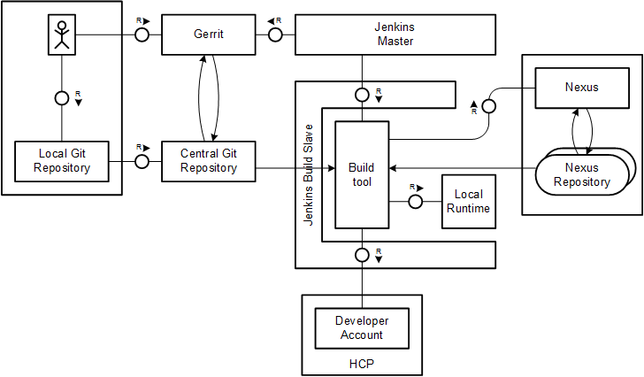

---

title: CI Best Practices Guide: Java Web on HCP
description: Part 4.2: Configuring the CI system for Maven-based Java Web project.
tags: [  tutorial>intermediate, tutorial:type/project ]

---

## Prerequisites  

  - **Proficiency:** Intermediate
  - [Generic Project](http://go.sap.com/developer/tutorials/ci-best-practices-generic.html)

## Next Steps

  - [Back to the Navigator](http://go.sap.com/developer/tutorials/ci-best-practices-intro.html)
  
---


The example shown here uses samples that are part of the SDK installation for Java Web development. These samples contain some web applications and are built using Maven as module builds. They all use a common parent `pom.xml`.
For further documentation specific to Java web application development, please take a look at the documentation and the tutorial.

> Documentation: https://help.hana.ondemand.com/help/frameset.htm?e66f3eecbb5710148397a19b46c4979b.html  
> Tutorial: https://hcp.sap.com/developers/TutorialCatalog/jav100_2_java_hello_world.html


The setup of the build pipeline initially follows exactly the steps as outlined in the part "Generic Project". The additional dependencies defined in the `pom.xml` files can be resolved using the Maven central repository only. The SAP Java Web SDK is available there. Next, as described in the first section of this part, the pure build will be set up.

> SDK installation guide: https://help.hana.ondemand.com/help/frameset.htm?7613843c711e1014839a8273b0e91070.html  
> Downloads: https://tools.hana.ondemand.com/#cloud

In the second section, we will see how you enable scenario tests running directly on the build server by launching a local runtime on the fly in the build process.
In the third section, we show how to deploy the artifacts on a developer account on HCP. The scenario tests are then executed there in order to do acceptance testing on the same environment like later in production.



### CI Build Process

#### Procedure

To configure the pure build and deploying the artifacts on Nexus, execute exactly the same steps as described in part "Generic Project".
Take a copy of the samples folder in the SDK installation directory as sources of your project. We assume that a voter and a CI job are created on Jenkins
with the names `VO_neo-java-web-sdk-samples_master` and `CI_neo-java-web-sdk-samples_master`.

### Scenario Tests on the Build Server

SAP’s `neo-java-web-maven-plugin` Maven plugin implements a client to SAP HANA Cloud Platform, enabling the build to issue commands there, for example, the deployment of an application or starting and stopping it. Whereas this cloud-based scenario will be described in the next section, the plugin also has a local mode that enables you to launch a local runtime and to deploy the application there, which is much faster than deploying over the network to HCP directly.

To access the runtime, the SAP Java Web SDK has to be available. It will be installed on the fly into the build workspace during the build.

> Documentation: https://help.hana.ondemand.com/help/frameset.htm?4cbdab6e2eb14c92ab76540ffb32174c.html

Some of the Scenario tests are run as Selenium tests. Selenium tries to start a browser. A Firefox must be installed on the Jenkins build slave machine.
Starting Firefox again requires a display to send the front end to. But often, on a Linux build machine there is no display installed, for example, an X server. Hence the naïve start of Firefox on the build slave will fail. The standard procedure to solve this is to temporarily open the virtual frame buffer Xvfb during the build.

To make Xvfb running (it should only run during the lifetime of the build job), an additional pre-build step has to be defined inside which it is started.
The `DISPLAY` environment variable (so Firefox knows where to send the front end) will be set and provided to the Maven call using the Envinject plugin of Jenkins.
For the installation of Firefox, one might run into compatibility problems between Selenium and Firefox. It might happen that your first trial will fail. Then try out other version combinations.
We have tested the combination Firefox 42.0 with Selenium 2.52.0 which has worked. In doubt, rather use higher Selenium or lower Firefox versions. Whereas Firefox has to be installed on the machine, Selenium will be fetched by Maven automatically.

The scenario tests are assumed still to run fast enough to be integrated into the integration build. Therefore the changes described below apply to the Jenkins jobs `VO_neo-java-web-sdk-samples_master` and `CI_neo-java-web-sdk-samples_master` just created before.


#### Procedure

##### Enhance the `pom.xml` to install the SDK.

  1. In the sources of the sample project, open the parent `pom.xml`. 
  2. In the property definition part, change the value of `${sap.cloud.sdk.path}` as follows:
     ```
     ...
       <properties>
         ...
           <sap.cloud.sdk.path>${project.build.directory}/sdk</sap.cloud.sdk.path>
         ...
       </properties>
     ...
     ```
  3. In the section defining profile `local-integration-tests`, add the following lines to tell the maven plugin to install the SDK and where:
     ```
     ...
       <profile>
         <id>local-integration-tests</id>
         <build>
           <plugins>
             <plugin>
               <groupId>com.sap.cloud</groupId>
               <artifactId>${sap.cloud.sdk.plugin}</artifactId>
               <executions>
                 ...
                 <execution>
                   <phase>initialize</phase>
                   <goals>
                     <goal>install-sdk</goal>
                   </goals>
                 </execution>
                 ...
               </executions>
               ...
             </plugin>
             ...
           </plugins>
         </build>
       </profile>
     ...
     ```
     > Documentation: https://help.hana.ondemand.com/mavenSite/usage.html


##### Requirements for Selenium tests.

  1. Log on as root to the Jenkins slave and install Xvfb.
     It is very likely that it is already installed with your Linux distribution.  
     > Man page: http://www.x.org/releases/X11R7.6/doc/man/man1/Xvfb.1.xhtml
  2. Log on as `root` to the Jenkins slave and install Firefox, version 42.0.  
     > Home page: https://www.mozilla.org  
     > Downloads: https://ftp.mozilla.org/pub/firefox/releases/42.0/
  3. In the sources of the sample project, open the parent `pom.xml`. Check that the number of the Selenium version to be used is correct:
     ```
     <properties>
       ...
       <selenium.test.framework.version>2.52.0</selenium.test.framework.version>
     </properties>
     ```

##### Install the Envinject Plugin in Jenkins.

  1. In Jenkins, go to "Manage Jenkins" / "Manage Plugins" / "Available".
  2. Search for the “Environment Injector Plugin”, select it, and press “Install without restart”.
  3. Restart Jenkins.

##### Configure the Jenkins Job

Do the following changes for both jobs `VO_neo-java-web-sdk-samples_master` and `CI_neo-java-web-sdk-samples_master`.

  1. In Jenkins, open the job and go to "Configure". There should be a new section “Build Environment”.  
     | Field | Value |
     | --- | ------------------------------------------------------------------------- |  
     | Build Environment / Inject environment ... | `checked` |
     | Build Environment / Inject environment / Properties Content | `DISPLAY=:99` |
     | Pre Steps / Execute shell / Command | `Xvfb :99 -ac & echo $! > Xvfb.pid; ps -aef | grep Xvfb` | 
     | Build / Goals and options | `clean deploy -P local-integration-tests -Dhttps.proxyHost={proxy host} -Dhttps.proxyPort={proxy port}` |
     | Post Steps / Execute shell / Command	| `cat Xvfb.pid | xargs kill` |  
     The DISPLAY environment variable is needed to tell Firefox where to send the front end to. Another tricky thing happens in the build pre step. Xvfb is started opening the display just mentioned.
     Since Xvfb should only run during the lifetime of the build, the process id is kept in a file from which it is restored in the post step to kill the Xvfb process.
  2. Press "Apply" and "Save".

Rerun the build (by pushing a small change). When you open the log, you should see how the local runtime is installed, the application is deployed, started, and the tests including selenium tests are executed.


### Scenario Tests on HCP

We refer now to the situation of the release process that has been pointed out in the part "Pipeline Suggestions". The scenario tests are executed on a clone of the production runtime system, namely a developer account on the HCP trial landscape. We assume that the tests are too exhaustive to be executed still in the integration build. Therefore, the scheduled build will be changed only in the way that the tests of the last section are not executed locally any more.

To do that, the prerequisite to do the setup is that you have a valid development account on HCP. We recommended that you do not use your personal user for doing the deployment but you should use a machine user instead that you may create on HCP and grant the deploy permissions to it.

Technically, the deployment to HCP is done in the Maven build using SAP’s `neo-java-web-maven-plugin`. By activating the Maven profile `cloud-integration-tests`, the build stops the application that is still running in the HCP account, then it deploys and starts the application. After the test execution the application is stopped again.

#### Prerequisites

- You have a developer account on the HCP trial Landscape.
 
> Documentation: https://help.hana.ondemand.com/help/frameset.htm?975c8fc61a384668a82e91c8448deb0b.html  
> HCP Cockpit: https://account.hanatrial.ondemand.com

#### Procedure

##### Create an additional user for your account.

  1. Open the SAP cockpit and ensure that you are on the "Log on" / "Register" start page.
     If you are still in your personal cockpit view, just log off.
  2. Click on "Register" and fill out the form. 
     Use a different e-mail address from your personal account. Click on “Register”.
  3. Soon after your registration you will receive an e-mail with the activation link. Open it and activate the new user.
  4. Log off again and log on with your own user. 
     You will see the Cockpit view for your account.
  5. In the navigation area, select "Members" / "Add Members". Enter the user id of your newly created user. Assign the role "Developer" to the user.
  6. Test the connection. Open a local console. On Linux, enter the following (it is highly recommended that you do not enter passwords in clear text but use the password encryption mechanism referenced at the end of the section):  
     ```
     export https_proxy={The URL of your HTTPS proxy}
     export http_proxy={The URL of your HTTP proxy}
     cd {the installation directory of your Neo SDK}/tools
     ./neo.sh list-applications --host https://hanatrial.ondemand.com --account {your account}\
       --user {HCP user} --password {HCP password}
     ```
     
You should be able to see the applications installed in your account.

##### Enhance the `pom.xml` to install the SDK

  1. In the sources of the sample project, open the parent `pom.xml`.
  2. Similar to the change for the local scenario test, now add the following lines in the section defining the profile  `cloud-integration-tests`:  
     ```
     ...
       <profile>
         <id>cloud-integration-tests</id>
         <build>
           <plugins>
             <plugin>
               <groupId>com.sap.cloud</groupId>
               <artifactId>${sap.cloud.sdk.plugin}</artifactId>
               <executions>
                 ...
                 <execution>
                   <phase>initialize</phase>
                   <goals>
                     <goal>install-sdk</goal>
                   </goals>
                 </execution>
                 ...
               </executions>
               ...
             </plugin>
             ...
           </plugins>
         </build>
       </profile>
     ...
     ```
     > Documentation: https://help.hana.ondemand.com/mavenSite/usage.html 

##### Configure the Jenkins job

Do the following changes for both jobs `VO_neo-java-web-sdk-samples_master` and `CI_neo-java-web-sdk-samples_master`.

  1. In Jenkins, open the job and go to "Configure".
  2. Enter the following data (in contrast to the local scenario tests above, here are no pre and post build steps necessary):  
     | Field | Value |
     | --- | ------------------------------------------------------------------------- |  
     | Build / Goals and options | `clean deploy -P cloud-integration-tests -Dhttps.proxyHost={proxy host} -Dhttps.proxyPort={proxy port} -Dsap.cloud.account={HCP account} -Dsap.cloud.username={HCP user} -Dsap.cloud.password={HCP password} -Dsap.cloud.host=hanatrial.ondemand.com` |
  3. Start the job. You should be able to see the job deploying onto HCP and executing the scenario tests.


#### Further Enhancements

- Eliminate the password in clear text. It is highly recommended to encrypt the password using the Maven Password Encryption feature.
  > Documentation: https://help.hana.ondemand.com/mavenSite/usage.html


## Next Steps

  - [Back to the Navigator](http://go.sap.com/developer/tutorials/ci-best-practices-intro.html)