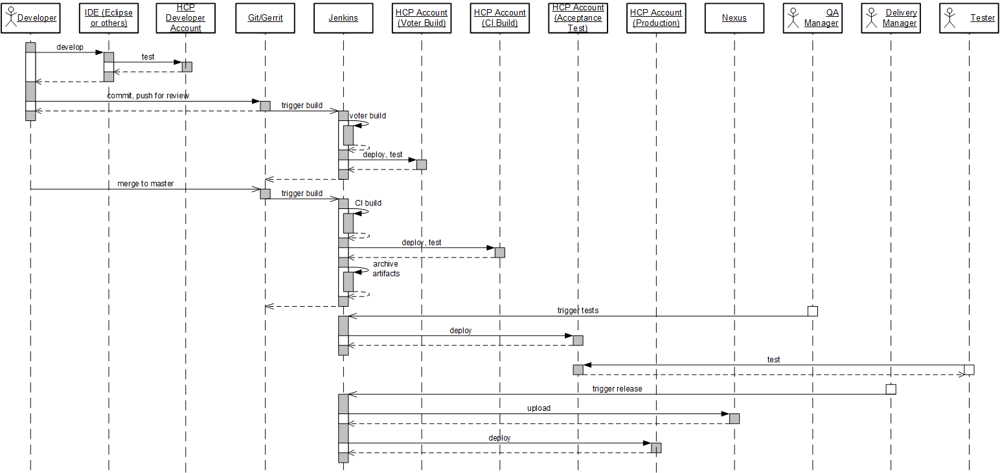

---

title: Continuous Integration (CI) Best Practices with SAP: Java Web on SAP HANA Cloud Platform
description: Part 4.2: Configuring the CI system for Maven-based Java Web project.
tags: [  tutorial>intermediate, tutorial:type/project ]

---

## Prerequisites  

  - **Proficiency:** Intermediate
  - [Pipeline Skeleton](http://go.sap.com/developer/tutorials/ci-best-practices-pipeline-skeleton.html) 
  - [Generic Project](http://go.sap.com/developer/tutorials/ci-best-practices-generic.html)

## Next Steps

  - [Back to the Navigator](http://go.sap.com/developer/tutorials/ci-best-practices-intro.html)
  
---


The example shown here uses samples that are delivered as part of the SDK installation for Java Web development. These samples contain some web applications that are built using Maven and share a common parent `pom.xml`. Documentation and resources for Java web application development:

> Documentation: https://help.hana.ondemand.com/help/frameset.htm?e66f3eecbb5710148397a19b46c4979b.html  
> Tutorial: https://hcp.sap.com/developers/TutorialCatalog/jav100_2_java_hello_world.html  
> SDK installation guide: https://help.hana.ondemand.com/help/frameset.htm?7613843c711e1014839a8273b0e91070.html  
> SDK Download: https://tools.hana.ondemand.com/#cloud

The samples can be built without any further prerequisites. The dependencies listed in the `pom.xml` are all available on the Maven central repository. This includes the SAP Java Web SDK itself that does not need to be installed on the build server.

We will setup a Continuous Delivery pipeline for one of the sample applications applying what was shown in the 
[Pipeline Skeleton](http://go.sap.com/developer/tutorials/ci-best-practices-pipeline-skeleton.html) part. We will use the following infrastructure: 


In our scenario we assume that a Java Web developer works with a local Eclipse development environment and Git as the versioning tool. The developer also owns a developer account in HCP to deploy and test the application manually. Commits in Git are not pushed directly into the `master` branch, but to Gerrit for voting. A voter build is automatically triggered to guarantee build and component test quality even before the commit is merged into `master`. We will show in our example how to include automated scenario tests by automatically deploying the application to a runtime. For the latter, two alternatives are possible: a JEE instance which is created on-the-fly on the build server or an account on SAP HANA Cloud Platform.

After successful voter build and an eventual review by another developer, the commit is merged into `master` by the developer or a responsible person. This event triggers the CI build, which is implemented similarly to the voter build containing compilation, component and scenario tests on either a local JEE runtime or the SAP HANA Cloud Platform. The build result will be archived on Jenkins, so there is no need to rebuild the software in subsequent pipeline steps.

We will then implement a deploy job for acceptance tests. The quality manager triggers it manually to deploy the application to a test account on SAP HANA Cloud Platform. Manual testers are assumed to execute the acceptance test.

When the acceptance test was successful, the delivery manager can decide to trigger the release of the application. The artifact is uploaded to Nexus and the application is deployed to the productive SAP HANA Cloud Platform account.



Thus, several accounts on SAP HANA Cloud Platform are needed to separate the different concerns within the whole pipeline and to ensure that different deployed versions of the application in different quality stages do not get in conflict with each other. Note that the name of the deployed application does not change.

In principle, it would be possible to work with less accounts by sharing one for different concerns. But then, additional care must be taken to avoid conflicts. There are different possibilities:

- Locking the account when an automated test is currently running, enforcing exclusive usage. But this bears the risk of queuing the tests.
- Assignment of dynamically generated application names.

We just mention the possibility and will not go into the details.


### Preparation of the Project

We will call our project `neo-java-web-sdk-samples`. To set up the Gerrit project, execute the corresponding steps as described in
[Generic Project](http://go.sap.com/developer/tutorials/ci-best-practices-generic.html). The `samples` folder in the SAP HANA Cloud Platform SDK contains a Maven parent project with a couple of modules. We do not want to build all the modules in this example but restrict ourselves on the `explore-ui5` module only. The others do not need to be included into the Gerrit project, and in the parent `pom.xml`, place them into comments:

```
    <modules>
	<!--
        <module>...
           ...</module>
	-->
        <module>explore-ui5</module>
	<!--
        <module>...
           ...</module>
    -->
    </modules>
```

We do not use Maven snapshot versions, hence ensure that the version number in the parent `pom.xml` does not end with `SNAPSHOT`.


### Voter Build: Preparation of the Java Compilation

To configure the voter build, execute the corresponding steps as described in part [Generic Project](http://go.sap.com/developer/tutorials/ci-best-practices-generic.html), but take `neo-java-web-sdk-samples` as project name and use the sources from the sample. We assume now that a voter job is created on Jenkins with the name `VO_neo-java-web-sdk-samples_master_build`.


### Voter Build: Scenario Tests on the Build Server

The SAP `neo-java-web-maven-plugin` provides a client API to SAP HANA Cloud Platform, enabling the build to issue commands there, for example, starting, stopping or deploying an application. The plugin also includes a local mode that enables you to launch a local runtime and to deploy the application there, which is much faster than deploying over the network directly to SAP HANA Cloud Platform.
We describe both alternatives, and it is up to you to decide which one is appropriate for your scenario. 

> Documentation: https://help.hana.ondemand.com/help/frameset.htm?4cbdab6e2eb14c92ab76540ffb32174c.html

Part of the automatic scenario tests are Selenium tests. Selenium tries to start a browser which requires Firefox to be installed on the Jenkins build slave machine. Firefox requires a display to send the front end to; however, on a Linux build machine there usually is no display (for example an X server) installed. Hence starting Firefox during the build would fail. We solve this issue by temporarily opening the virtual frame buffer `Xvfb` during the build and setting the `DISPLAY` environment variable using the Envinject plugin of Jenkins so that Firefox knows where to display the front end.

You might have compatibility problems between Selenium and Firefox, it might happen that your first trial will fail; we suggest trying out other version combinations. We have tested Firefox 42.0 with Selenium 2.52.0. Firefox must be installed on the machine, whereas Selenium is automatically fetched by Maven.


#### Procedure

##### Enhance the `pom.xml` to install the SDK.

1. In the source code of the sample project, open the parent `pom.xml`.

2. In the property definition part, change the value of `${sap.cloud.sdk.path}` as follows:

    ```
    ...
      <properties>
        ...
          <sap.cloud.sdk.path>${project.build.directory}/sdk</sap.cloud.sdk.path>
        ...
      </properties>
    ...
    ```

3. In the section that defines the profile `local-integration-tests`, add the following lines to indicate where to install the SDK:

    ```
    ...
      <profile>
        <id>local-integration-tests</id>
        <build>
          <plugins>
            <plugin>
              <groupId>com.sap.cloud</groupId>
              <artifactId>${sap.cloud.sdk.plugin}</artifactId>
              <executions>
                ...
                <execution>
                  <phase>initialize</phase>
                  <goals>
                    <goal>install-sdk</goal>
                  </goals>
                </execution>
                ...
              </executions>
              ...
            </plugin>
            ...
          </plugins>
        </build>
      </profile>
    ...
    ```

    > Documentation: https://help.hana.ondemand.com/mavenSite/usage.html


#### Requirements for Selenium tests

1. Log in as `root` onto the Jenkins slave and install `Xvfb`. However, it is very likely that it was already installed with your Linux distribution.  
   
    > Documentation: http://www.x.org/releases/X11R7.6/doc/man/man1/Xvfb.1.xhtml
   
2. Log in as `root` onto the Jenkins slave and install Firefox, version 42.0.  

    > Home page: https://www.mozilla.org  
    > Downloads: https://ftp.mozilla.org/pub/firefox/releases/42.0/
   
3. In the sources of the sample project, open the parent `pom.xml` and verify the Selenium version number:

    ```
    <properties>
      ...
      <selenium.test.framework.version>2.52.0</selenium.test.framework.version>
    </properties>
    ```


#### Configure the Jenkins job

Apply the following changes to the job `VO_neo-java-web-sdk-samples_master_build`.

1. In Jenkins, open the job and go to **Configure > Build Environment**.  

    Field                                                       | Value
    :---------------------------------------------------------- | :------------------------------------
    Inject environment ...                                      | `checked`
    Properties Content                                          | `DISPLAY=:99`
    
2.  Go to the **Pre Steps** section and select **Add pre-build step > Execute shell**. Enter as command:
    
    ```
    Xvfb :99 -ac & echo $! > Xvfb.pid; ps -aef | grep Xvfb
    ```
    
    `Xvfb` starts and opens the display. Since `Xvfb` should only run during the
    lifetime of the build, the process id is kept in a file from which it is retrieved in the post-step
    to kill the `Xvfb` process.
    
3. In the **Build** section, enter the following line as **Goals and options**:

    ```
    clean verify -P local-integration-tests -Dhttps.proxyHost=<your proxy host> -Dhttps.proxyPort=<your proxy port>
    ```
    
4. In the **Post Steps** section, select **Add post-build step > Execute shell**. Enter as command:
   
    ```
    cat Xvfb.pid | xargs kill
    ```

5. Press **Save**.

Rerun the build by pushing a small change. When you open the log, you see the local runtime installed, the application deployed and
started, and the tests, including Selenium tests, executed.


### Voter Build: Scenario Tests on SAP HANA Cloud Platform

We will now change the configuration such that the scenario tests are executed on a developer account on the SAP HANA Cloud Platform trial landscape.

You must have a valid development account on SAP HANA Cloud Platform. Do not use your personal user ID for the deployment; instead, use a machine user that you create on SAP HANA Cloud Platform and grant the deploy permissions to.

The deployment to SAP HANA Cloud Platform is performed in the Maven build using the SAP `neo-java-web-maven-plugin`. By activating the Maven profile `cloud-integration-tests`, the build stops the application that is still running in the SAP HANA Cloud Platform account, deploys the new artifact and restarts the application. After the test execution, the application is stopped again.

#### Prerequisites

- A developer account on the SAP HANA Cloud Platform trial landscape.
 
> Documentation: https://help.hana.ondemand.com/help/frameset.htm?975c8fc61a384668a82e91c8448deb0b.html  
> SAP HANA Cloud Platform Cockpit: https://account.hanatrial.ondemand.com

#### Procedure

##### Create an additional user for your account.

1. Open the SAP HANA Cloud Platform Cockpit and ensure that you are on the **Log on > Register** start page. If you still see your personal Cockpit view, simply log off.

2. Click **Register** and fill out the form. Use a different e-mail address than your personal account. Click **Register**.

3. Soon after your registration you receive an e-mail that contains the activation link. Open it and activate the new user.

4. Log off and log in again with your *original* user, not with the new one. You see the Cockpit view for your account.

5. In the navigation area, select **Members > Add Members**. Enter the user ID of your newly created user. Assign the role `Developer` to the user.

6. Test the connection by opening a local console. On Linux, enter the following:  

    ```
    export https_proxy=<URL of your HTTPS proxy>
    export http_proxy=<URL of your HTTP proxy>
    cd <the installation directory of your SAP HANA Cloud Platform SDK>/tools
    ./neo.sh list-applications --host https://hanatrial.ondemand.com --account <your HCP account>\
      --user <your HCP user> --password <your HCP password>
    ```
     
    You see the applications installed in your account.


##### Modify the `pom.xml` to install the SDK.

1. In the sources of the sample project, open the parent `pom.xml`.

2. Add the following lines in the section that defines the profile  `cloud-integration-tests`:  

    ```
    ...
      <profile>
        <id>cloud-integration-tests</id>
        <build>
          <plugins>
            <plugin>
              <groupId>com.sap.cloud</groupId>
              <artifactId>${sap.cloud.sdk.plugin}</artifactId>
              <executions>
                ...
                <execution>
                  <phase>initialize</phase>
                  <goals>
                    <goal>install-sdk</goal>
                  </goals>
                </execution>
                ...
              </executions>
              ...
            </plugin>
            ...
          </plugins>
        </build>
      </profile>
    ...
    ```

    > Documentation: https://help.hana.ondemand.com/mavenSite/usage.html 


##### Configure the Jenkins job

Make the following changes to the job `VO_neo-java-web-sdk-samples_master_build`.

1. In Jenkins, open the job and go to **Configure**.

2. In the **Build Environment** section, enter the following data:

    Field                                                  | Value 
    :----------------------------------------------------- | :---------------  
    Inject passwords to the build as environment variables | `checked`
    Global passwords                                       | `checked`
    Mask password parameters                               | `checked`

3. In the **Build** section, enter as **Goals and options**:

    ```
    clean verify -P cloud-integration-tests -Dhttps.proxyHost=<your proxy host> -Dhttps.proxyPort=<your proxy port> -Dsap.cloud.account=${HCP_VOTER_ACCOUNT} -Dsap.cloud.username=${HCP_USER} -Dsap.cloud.password=${HCP_PASSWORD} -Dsap.cloud.host=hanatrial.ondemand.com
    ```

4. Save.


##### Define the needed credentials

1. In Jenkins, go to **Manage Jenkins > Configure System > Global Passwords**.

2. Define your credential data by creating new entries for the names `HCP_USER`, `HCP_VOTER_ACCOUNT` and `HCP_PASSWORD`.  
    The values of these variables will be masked in the build log.
    
3. Save.

Start the job by pushing a small change. You see the job deploying onto SAP HANA Cloud Platform and executing the scenario tests.


### CI build

You can use the voter build as a template for the CI build job. In this example its name is `CI_neo-java-web-sdk-samples_master_build`.
Concerning the run time for automatic scenario test execution, what was said for the voter builds also applies to the CI build. Thus most of the job configuration can be taken from the voter build with few differences:

- The merge into the `master` branch is the event that triggers the build.
- The CI build is part of the continuous delivery pipeline, and thus configuration for archiving the artifact and definition of the subsequent job as described in [Pipeline Skeleton](http://go.sap.com/developer/tutorials/ci-best-practices-pipeline-skeleton.html) is needed.
- The CI build deploys to a different SAP HANA Cloud Platform account. We assume in this example that the user credentials remain unchanged, but you may decide to use different deploy users.

#### Procedure

1. Open the job definition.

2. Change the **Gerrit Trigger** section according to the needs of the CI build as described in 
    [Generic Project](http://go.sap.com/developer/tutorials/ci-best-practices-generic.html).

3. Select **Add post-build action > Archive the artifacts**. Enter

    ```
    explore-ui5/target/*.war, pom.xml, explore-ui5/pom.xml
    ```

4. Select **Add post-build action > Build other projects (manual step)**. Enter `CI_neo-java-web-sdk-samples_master_testDeploy` as downstream project name.
    Ignore the warning. Select **Add Parameters > Predefined parameters**. Enter:
    
    ```
    BUILD_JOB_NUMBER=${BUILD_NUMBER}
    ```
 
5. In the Maven Goal definition of the **Build** section, change the variable name for the account to `${HCP_CI_ACCOUNT}`.
 
6. Save.

7. In **Manage Jenkins > Configure System > Global Passwords**, add `HCP_CI_ACCOUNT` and save.


### Test Deploy job

This job is manually triggered but semantically linked to the job before. In our case, it has the name `CI_neo-java-web-sdk-samples_master_testDeploy`.

In contrast to the build job, we choose now a freestyle project instead of a Maven project because we do not want to go through all the Maven phases and thus to rebuild the artifact once again. We rather call dedicated Maven targets for starting, stopping and deploying the application.


#### Procedure

1. Open the Jenkins front end, go to **New Item**, select **Freestyle project** and enter `CI_neo-java-web-sdk-samples_master_testDeploy` as name.

2. Enter the following values to the configuration:
  
    Field                                  | Value
    :------------------------------------- | :------------------------------------------------------------------------- 
    This job is parametrized               | `checked`
    Name                                   | `BUILD_JOB_NUMBER`
    Restrict where this project can be run | `checked`; Label Expression: the label that you have assigned to the slave, in this case `builds`.
    Source Code Management                 | `none`
    
3. In the **Build Environment** section, enter:

    Field                                                  | Value
    :----------------------------------------------------- | :-------------------- 
    Delete workspace before build starts                   | `checked`
    Inject passwords to the build as environment variables | `checked`
    Global passwords                                       | `checked`
    Mask password parameters                               | `checked`

4. In the **Build** section, select **Add build step > Copy artifacts from another project** and enter:

    Field                                  | Value
    :------------------------------------- | :------------------------------------------------------------------------- 
    Project name                           | `CI_neo-java-web-sdk-samples_master_build`
    Which build                            | `Specific build`
    Build number                           | `${BUILD_JOB_NUMBER}`
    Artifacts to copy                      | `explore-ui5/target/*.war, pom.xml, explore-ui5/pom.xml`
    
5. Select **Add build step > Execute shell**  and enter as shell command

    ```
    # got to module
    cd explore-ui5

    # technically needed step for not skipping the deployment
    mkdir -p WebContent/WEB-INF
    touch WebContent/WEB-INF/web.xml

    #install Neo SDK
    mvn neo-java-web:install-sdk -DsdkInstallPath=target/sdk

    # stop running application
    mvn neo-java-web:stop -P cloud-integration-tests -Dhttps.proxyHost=<your proxy host> -Dhttps.proxyPort=<your proxy port> \
    -Dsap.cloud.account=${HCP_TEST_ACCOUNT} -Dsap.cloud.username=${HCP_USER} -Dsap.cloud.password=${HCP_PASSWORD} \
    -Dsap.cloud.host=hanatrial.ondemand.com

    # deploy the application
    mvn neo-java-web:deploy -P cloud-integration-tests -Dhttps.proxyHost=<your proxy host> -Dhttps.proxyPort=<your proxy port> \
    -Dsap.cloud.account=${HCP_TEST_ACCOUNT} -Dsap.cloud.username=${HCP_USER} -Dsap.cloud.password=${HCP_PASSWORD} \
    -Dsap.cloud.host=hanatrial.ondemand.com

    # start the application
    mvn neo-java-web:start -P cloud-integration-tests -Dhttps.proxyHost=<your proxy host> -Dhttps.proxyPort=<your proxy port> \
    -Dsap.cloud.account=${HCP_TEST_ACCOUNT} -Dsap.cloud.username=${HCP_USER} -Dsap.cloud.password=${HCP_PASSWORD} \
    -Dsap.cloud.host=hanatrial.ondemand.com
    ```
    
    Creating an empty `web.xml` file is needed for technical reasons for the deployment to work with the current implementation of `pom.xml` file.

6. Select **Add post-build action > Build other projects (manual step)**.
    Enter `CI_neo-java-web-sdk-samples_master_release` as downstream project name.
    Ignore the warning. Select **Add Parameters > Predefined parameters**. Enter:
    
    ```
    BUILD_JOB_NUMBER=${BUILD_JOB_NUMBER}
    ```
    
7. Save the job definition.

8. In **Manage Jenkins > Configure System > Global Passwords**, add `HCP_TEST_ACCOUNT` and save.


### Release job

The release job named `CI_neo-java-web-sdk-samples_master_release` is mostly a copy of the test deploy job.

It differs from the latter in the productive SAP HANA Cloud Platform account as deployment target and an additional step for uploading the artifacts to Nexus. There is no post-build action for subsequent jobs.

#### Procedure

1. Open the Jenkins front end and go to **New Item**, select **Freestyle project**.  
    Enter `CI_neo-java-web-sdk-samples_master_release` as name, select **Copy existing item** and enter `CI_neo-java-web-sdk-samples_master_testDeploy`.

2. In the command input of the **Execute shell** build step, add the following lines just before the SAP HANA Cloud Platform SDK installation command:

    ```
    # upload to the Nexus release repository. Do not forget the parent pom
    mvn deploy:deploy-file -Durl=<URL of your Nexus release repository> \
    -Dfile=../pom.xml -DrepositoryId=nexusCIProcess -Dpackaging=pom -DpomFile=../pom.xml

    mvn deploy:deploy-file -Durl=<URL of your Nexus release repository> \
    -Dfile=target/explore-ui5.war -DrepositoryId=nexusCIProcess -Dpackaging=war -DpomFile=pom.xml
    ```

3. Replace the occurrences of `${HCP_TEST_ACCOUNT}` by `${HCP_PROD_ACCOUNT}`.

4. Remove the post-build action. This job does not have a downstream project.

5. Save.

6. In **Manage Jenkins > Configure System > Global Passwords**, add `HCP_PROD_ACCOUNT` and save.

### Setup of the pipeline

We apply the steps which are described in the [Pipeline Skeleton](http://go.sap.com/developer/tutorials/ci-best-practices-pipeline-skeleton.html) part to
our scenario. 


#### Procedure

1. Open the Jenkins front end and click into the last view tab containing the `+` sign.

2. Enter `neo-java-web-sdk-samples_pipeline` and select **Build Pipeline View**. Press **OK**.

3. In the Layout section, enter the name of the CI build job, `CI_neo-java-web-sdk-samples_master_build`, into the field **Select Initial Job**.

4. In the field **No Of Displayed Builds** enter `5` for the beginning, but you may enter whatever is convenient for you. 

5. Press **OK**.


## Next Steps

  - [Back to the Navigator](http://go.sap.com/developer/tutorials/ci-best-practices-intro.html)
