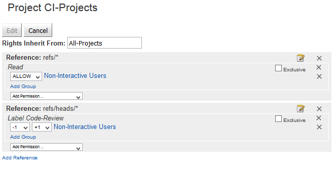
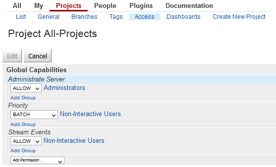

---

title: Continuous Integration (CI) Best Practices with SAP: Landscape Configuration
description: Part 3.4: Configuring the CI Component Landscape.
primary_tag: products>sap-cloud-platform
tags: [  tutorial>intermediate, tutorial:type/project ]

---

## Prerequisites  

  - **Proficiency:** Intermediate
  - [Source Code Versioning System](https://www.sap.com/developer/tutorials/ci-best-practices-scm.html)
  - [Build Scheduler](https://www.sap.com/developer/tutorials/ci-best-practices-build.html)
  - [Artifact Repository](https://www.sap.com/developer/tutorials/ci-best-practices-artifacts.html)


## Next Steps

  - [Back to the Navigator](https://www.sap.com/developer/tutorials/ci-best-practices-intro.html)

---

> This document is part of the guide Continuous Integration (CI) Best Practices with SAP. For all the examples to work properly make sure that you have followed the setup instructions for all components listed in the prerequisites box. Depending on the release of the components, the front ends may look different in your concrete setup.

After having installed and started the components that are involved in our CI process landscape, there are some more steps to configure to make them smoothly work together within a process pipeline.


### 1. Gerrit Parent Project

To avoid the need to maintain the Jenkins permissions in Gerrit for each project separately, it is a good practice to create a common parent project that hosts the needed permissions.

> [Set up Gerrit access rights](https://wiki.jenkins.io/display/JENKINS/Gerrit+Trigger#GerritTrigger-SetUp)

#### Procedure

1. Open the Gerrit front end, log in as administrator user, and go to **Projects > Create new Project**.

2. Enter `CI-Projects` as **Project Name** and select **Only serve as parent for other projects**.

3. Click **Create Project**.

4. Still logged in as administrator, select the **Access** tab to enter the access rights maintenance for the project `CI-Projects`. Click `Edit` and add the following permissions:

    ```
    Reference: refs/*   
    Read: ALLOW for Non-Interactive Users   
    Reference: refs/heads/*   
    Code-Review: -1, +1 for Non-Interactive Users
    ```

    

5. Save.


### 2. Subscribing Jenkins to Gerrit Events

Jenkins establishes an SSH connection to Gerrit to listen to the event stream. In order to do this, Jenkins needs access to Gerrit, and in the Jenkins configuration, Gerrit has to be defined:

#### Procedure

1. In the Gerrit front end, create a new user `jenkins`. Click **Become > New Account** and enter `jenkins` as **Full Name**, and **Username**. It is the latter property which is used to identify the user uniquely.

2. In the Gerrit front end, log on as `jenkins`, select **`jenkins` > Settings > SSH Public Keys** and add the public key from `.ssh/id_rsa.pub` located in the `jenkins` home directory on the Jenkins master machine.

3. Log in to the Gerrit front end as administrator user.

    - Grant the needed permissions to the Gerrit user `jenkins`: go to **People > List groups > Non-interactive Users** and add `jenkins` as member.

    - Go to **Projects > List > All-Projects > Access**, and in the section **Global Capabilities**  add

        ```
        Stream Events: ALLOW for Non-Interactive Users
        ```  

        

4. Open a browser window to Jenkins and go to **Manage Jenkins > Gerrit Trigger > Add new Server**.

    - Enter a logical name for the server into field **Add New Server**.

    - Select **Gerrit Server with Default Configurations**.

    - Press **OK**.

5. Enter the following data:

    Field         | Value
    :------------ | :-----------------------------------
    Name          | `<any logical name, e.g. the hostname of Gerrit>`
    Hostname      | `<hostname of Gerrit>`
    Front end URL | `http://<hostname of Gerrit>:8080`
    SSH Port      | `29418`
    Username      | `jenkins` |
    SSH Key file  | `/home/jenkins/.ssh/id_rsa`

6. Test the connection.

7. Proceed with the **Gerrit Reporting Values** section and for the **Verify** and **Code Review** parameters enter the following values:

    Field         | Value
    :------------ | :-----------------------------------
    Started       | `0`
    Successful    | `1`
    Failed        | `-1`
    Unstable      | `-1`
    Not Built     | `0`

8. Open the **Advanced** options. In the **Gerrit Verified Commands** section, enter the following values:

    Field      | Value
    :--------- | :-------------------------------------------------------------------------
    Started    | `gerrit review --message 'Build Started <BUILDURL> <STARTED_STATS>' <CHANGE>,<PATCHSET>`
    Successful | `gerrit review --message 'Build Successful <BUILDS_STATS>' --code-review <CODE_REVIEW> <CHANGE>,<PATCHSET>`
    Failed     | `gerrit review --message 'Build Failed <BUILDS_STATS>' --code-review <CODE_REVIEW> <CHANGE>,<PATCHSET>`
    Unstable   | `gerrit review --message 'Build Unstable <BUILDS_STATS>' --code-review <CODE_REVIEW> <CHANGE>,<PATCHSET>`
    Not Built  | `gerrit review --message 'No Builds Executed <BUILDS_STATS>' <CHANGE>,<PATCHSET>`    

9. Save.

10. Establish the connection by pressing the status button on the Gerrit Trigger overview page. It should change into the OK status.


### 3. Configuring Nexus Deployment Target in Jenkins

For some scenarios, you need an upload of the build artifacts to Nexus. The upload URL is defined in the configuration of Maven on the Jenkins slave machines.

#### Procedure

1. On the Jenkins slave machine, log on as user `jenkins`.

2. In `jenkins`' home directory `/home/jenkins`, create a new folder `.m2`. To this folder, create a copy of the file `settings.xml` from the `conf` directory in the maven installation.

3. Open the `settings.xml` file just copied and change the following parts according to your network setup:

    - In the `<proxies>` section, enter the right data according to your network configuration.

        ```
        <proxies>
          <proxy>
            <active>true</active>
            <protocol>http</protocol>
            <host>your proxy host</host>
            <port>your proxy port</port>
            <nonProxyHosts>include all host name patters that shall not be proxied</nonProxyHosts>
          </proxy>
        </proxies>
    ```

    - In the `<servers>` section, enter the following lines that define the access credentials to the Nexus instance:

        ```
        <servers>
          <server>
            <id>nexus1</id>
            <username>deployment</username>
            <password>deployment123</password>
          </server>
        </servers>
        ```

    The user `deployment` is a Nexus default user for deployments. For later productive usage, you should define another user with secure password. The `id` identifies the maven deployment target and will be referred in the `pom.xml` file of the Maven project.


#### Further Enhancements

  - Define a user and permission schema for Nexus. Especially create own Nexus users for Administration and Deployment with secure passwords.


> The content of this document is for guidance purposes only. No warranty or guarantees are provided.


## Next Steps

  - [Back to the Navigator](https://www.sap.com/developer/tutorials/ci-best-practices-intro.html)
