---

title: Continuous Integration (CI) Best Practices with SAP - SAP Fiori Hybrid Apps with SAP Mobile Platform SDK
description: Part 4.8 - Basic CI setup for SAP Fiori Hybrid Apps with the SAP Mobile Platform SDK
primary_tag: products>sap-cloud-platform
tags: [ tutorial>intermediate, tutorial:type/project ]
time: 120

---

## Prerequisites

  - **Proficiency:** Intermediate
  - [CI/CD Practices](https://www.sap.com/developer/tutorials/ci-best-practices-ci-cd.html)

## Next Steps

  - [Back to the Navigator](https://www.sap.com/developer/tutorials/ci-best-practices-intro.html)

---

### 1. Introduction

This guide contains instructions on how to set up Continuous Integration (CI) for Android and iOS Fiori Hybrid app development on a Mac, which is required for iOS builds. For other development options and an introduction to Hybrid app development, please refer to [this blog](https://blogs.sap.com/2017/06/21/sap-cloud-platform-mobile-services-development-options/). In addition, if you would like a more generic introduction to CI, please take a look at the overview in our [Best Practices guide](https://www.sap.com/developer/tutorials/ci-best-practices-ci-cd.html) and at the introduction to CI in the Mobile app development space in the [CI guide for native iOS development](https://www.sap.com/developer/tutorials/ci-best-practices-mobile-ios.html).

The goal of this guide is to explain the setup of a CI landscape as shown in Figure 1, where whenever a developer makes a change, the project is built and tested automatically, and where the result is an ``.apk`` (Android) or ``.ipa`` (iOS) file that is suitable for ad-hoc distribution, i.e. an application binary that can be sent to colleagues for reviews. During development and build, libraries should be centrally and automatically made available as well.

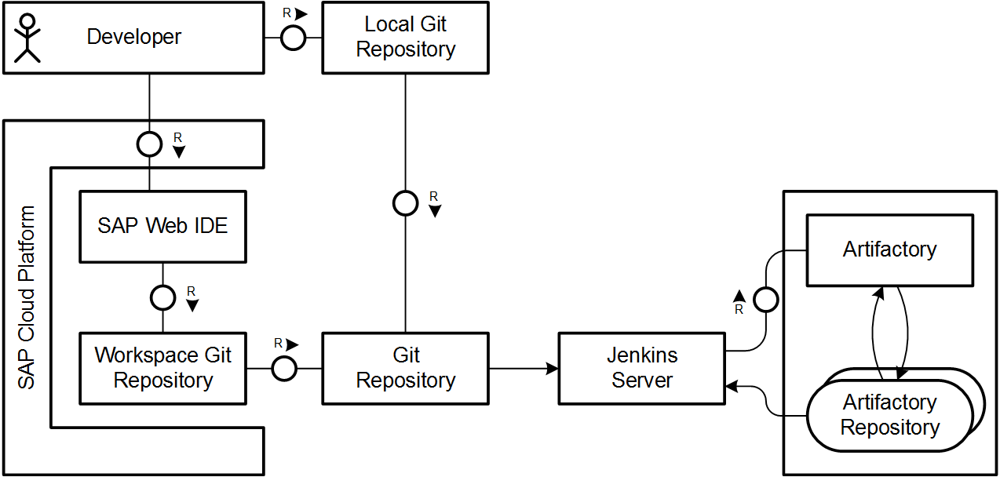

*Figure 1: Architecture of the Continuous Integration setup for Fiori Hybrid apps*

The setup section gives an overview over one-time setup activities per build server, such as component installation and configuration. Afterwards there is a brief guide on how to upload npm packages from the SAP Mobile Platform SDK, a step that needs to be repeated for each SDK version that should be made available for the build infrastructure. The guide is being concluded by project-specific configuration that will enable the project to be built in the CI infrastructure.

The content has been selected so that it is suitable for CI and/or iOS novices, or so that it can be used for a proof of concept on automation. Advanced readers and people with existing infrastructure may want to skip the initial one-time setup and proceed with the npm section.

Please note that this guide lists specifically the steps required to manually create a packaged Hybrid application that is suitable for deployment to mobile devices and that can potentially be offline-enabled. Scenarios where an application is both being packaged for mobile consumption and being deployed to a Fiori Launchpad for display in Desktop browsers are not included due to reasons detailed [in this blog post](https://blogs.sap.com/2018/01/19/mobile-app-development-hybrid-vs.-native/).

### Outline
1. Introduction
1. Setup
    1. Shared Setup
        1. Homebrew and Git
        1. Cordova
        1. iOS Development
        1. Android Development
        1. Certificates
    1. Additional Build Node Steps: Jenkins and Artifactory
    1. Additional Workstation Steps
        1. SAP Mobile Platform SDK
        1. Additions iOS Tools
1. Uploading Kapsel Plugins to npm
1. Project setup
	  1. Creating a Fiori App in SAP Web IDE
    1. Creating a Fiori Cordova project
	  1. Configuring Mobile Services
	  1. Integrating with Mobile Services
    1. Building for iOS
    1. Building for Android
    1. Versioning Code with Git
    1. Managing UI5
	  1. Creating the Jenkins Pipeline
    1. Development in Web IDE

### 2. Setup

#### 2.1 Shared Setup

##### 2.1.1 Homebrew and Git

These setup steps have been described in the [CI guide for native iOS development](https://www.sap.com/developer/tutorials/ci-best-practices-mobile-ios.html). Please follow the setup steps given there in order to prepare both the build node and the developer machine.

##### 2.1.2 Cordova

In this section, we are going to install the basic dependencies of Cordova. This is required for all Cordova installations, regardless of the targeted operating systems of your mobile application.

###### 2.1.2.1 Java 8

By default, Java 6 is installed on Mac. However, Cordova requires at least version 8, so that we need to upgrade to a newer release using Homebrew:

```
brew install /caskroom/versions/java8
```

###### 2.1.2.2 Node.js

[Node.js](https://nodejs.org/en/) is a JavaScript runtime that allows executing JavaScript code outside the classical browser context, and has become a popular engine for both server-side applications and client-side tooling. Since Cordova is one such tool depending on node, we need to install it with the following command:

```
$ brew install node@6
```

In order to resolve dependencies in the Node.js ecosystem, we are going to use npm. In the build server setup section, the setup of a private npm registry is explained. Once done, we need to configure both the build server and the developer machine as follows, so that they will be able to fetch dependencies from our private registry:

```
npm config set registry http://host:port/path/to/npm/registry/
```

Please refer to the documentation of your npm installation, an example being given in the aforementioned server setup section, for the exact URL that is required for your installation.

###### 2.1.2.3 Cordova Command-line Tools

[Apache Cordova](https://cordova.apache.org/) is a framework for creating mobile applications where the business logic is written using web technology, i.e. HTML, JavaScript and CSS, and that abstracts away the underlying operating system. This is done so that the application can be deployed to multiple mobile operating systems while maintaining only one code base. We are going to use this framework to package our Fiori app for deployment onto mobile devices, hence we need to install it by running:

```
$ npm i -g cordova@8.0.0
```

##### 2.1.3 iOS Development Tools

Please follow the setup steps described in the [CI guide for native iOS development](https://www.sap.com/developer/tutorials/ci-best-practices-mobile-ios.html) in order to install Xcode and required build tools.

##### 2.1.4 Android Development Tools

The [Android SDK](https://developer.android.com/sdk/) is a comprehensive set of tooling required for building Android applications, and is required for us to be able to create Android builds of Cordova applications. There are two ways to obtain and install the components required:

###### 2.1.4.1 Installation via Android Studio

These days, Google is increasingly pushing developers to download and install [Android Studio](https://developer.android.com/studio/). This is a pleasant approach for end users, even though it is not strictly required for Cordova app development. If you decide to take this route, which is also mentioned in the [Cordova setup guide for Android](https://cordova.apache.org/docs/en/latest/guide/platforms/android/#installing-the-requirements), simply download and install Android from the linked Google page. Once this is done, make sure to add the following lines to your ``~/.bash_profile``:

```
export ANDROID_HOME=/Users/{YOUR_USER_NAME}/Library/Android/sdk
export PATH=$PATH:$ANDROID_HOME/tools:$ANDROID_HOME/tools/bin:$ANDROID_HOME/platform-tools
```

###### 2.1.4.2 Installation via Homebrew

As an alternative to the Android Studio installation, the Android SDK can be directly installed via Homebrew. This is especially useful if you are trying to automate deployments, e.g. to build servers:

```
$ brew cask install android-sdk
```

###### 2.1.4.3 Configuration

In either case, once the Android SDK has been installed, we need to ensure all required SDK components are available for the Cordova build tools. The following handy command uses the Android SDK Manager command-line interface to do so:

```
sdkmanager "tools" "platform-tools" "build-tools;27.0.3" "emulator" "extras;android;m2repository" "extras;google;m2repository" "platforms;android-26" "sources;android-26" "system-images;android-27;google_apis;x86" "extras;intel;Hardware_Accelerated_Execution_Manager"
```

###### 2.1.4.4 Gradle

[Gradle](https://gradle.org/) is a popular build tool and dependency manager in the Java ecosystem, and is also used to build Android apps. In addition to the Android SDK, Cordova also requires us to install this in order to be able to build Android applications. Once more, the installation is fairly simple using Homebrew:

```
$ brew install gradle
```

##### 2.1.5 Certificates

These setup steps have been described in the [CI guide for native iOS development](https://www.sap.com/developer/tutorials/ci-best-practices-mobile-ios.html). Please follow the setup steps given there in order to prepare both the build node and the developer machine.

#### 2.2 Additional Build Node Steps: Jenkins and Artifactory

These setup steps have been described in the [CI guide for native iOS development](https://www.sap.com/developer/tutorials/ci-best-practices-mobile-ios.html). Please follow the setup steps given there in order to prepare the build node, while making sure to select the npm repository type during setup. Once done, you will receive additional set-up instructions for both the developer machine and build server in the "Set Me Up" section on the welcome page of Artifactory, as shown in Figure 2.

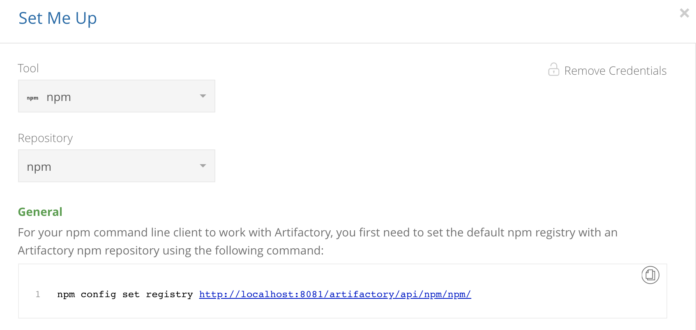

*Figure 2: Set-up instructions for npm in Artifactory*

#### 2.3 Additional Workstation Steps

##### 2.3.1 SAP Mobile Platform SDK

The [SAP Mobile Platform SDK](https://store.sap.com/sap/cp/ui/resources/store/html/SolutionDetails.html?pid=0000013098&catID=&pcntry=DE&sap-language=EN&_cp_id=id-1527256329389-0) is our collection of tools and libraries that facilitates integration of Android, Windows and iOS mobile apps with SAP Mobile Platform and SAP Cloud Platform Mobile Services. For this specific guide, it most notably contains the Kapsel SDK, which is a subset specifically tailored to developing applications with Cordova. In order to be able to leverage the Cordova plugins provided by SAP, you will need to download and install it on your developer machine. In Section 3, *Uploading Kapsel Plugins to npm*, we are going to make those plugins available to the build server and ourselves by means of an npm registry.

In order to obtain a copy, simply follow the link given above, log in to SAP Store with your SCN user, click the "Trial Version" button shown in Figure 3 and fill out the request form. An e-mail with download instructions is going to be sent to you. For this tutorial, version ``3.1`` has been used.

Once installed, add the following line to ``~/.bash_profile`` for easier access later on:

```
export KAPSEL_HOME=~/SAP/MobileSDK3/KapselSDK
```

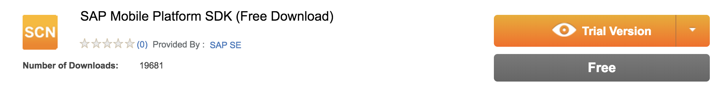

*Figure 3: Obtaining a copy of SAP Mobile Platform SDK*

##### 2.3.2 Additional iOS Tools

In order to be able to launch Cordova apps that we build from the Cordova command-line tools, we also need to install the following component:

```
$ npm install -g ios-deploy
```

### 3. Uploading Kapsel Plugins to npm

Now that all software has been set up, we can proceed with making the Cordova plugins from Mobile Platform SDK available in our infrastructure. Before being able to upload artifacts to npm, we first need to log in to the registry with a user that has write permissions:

```
npm login
```

You will then be prompted for your credentials. Afterwards, simply run this command, which will upload all Kapsel Cordova plugins to the registry:

```
for d in $KAPSEL_HOME/plugins/* ; do (cd "$d" && npm publish --registry http://localhost:8081/artifactory/api/npm/npm/) done
```

Please note that the command may fail for the legacy push plugin, because it has the same ID and version as the newer push implementation. This can be safely ignored.

### 4. Project setup

In order to create our Hybrid application, we are going to perform the following steps:

1. Create a Fiori app from a template in SAP Web IDE
1. Create a Cordova app locally
1. Export the Fiori app from Web IDE and merge it with the local Cordova project
1. Integrate the application with SAP Cloud Platform Mobile Services
1. Create a new Git repository for the Hybrid project
1. Import the Hybrid project in Web IDE to continue editing
1. Create a Jenkins build job that accesses the same Git repository

#### 4.1 Creating a Fiori App in SAP Web IDE

First, we are going to create a Fiori app based on a template in SAP Web IDE. For this guide, we are simply using a regular empty UI5 application as shown in Figures 4 and 5. As project name and application ID, choose ``CIExample``and ``com.sap.ci.cordova.CIExample``, respectively, as shown in Figure 6, so that your project is consistent with the instructions in later sections. On the next screen, go with the default view type and hit "Finish".

Next, right-click your project and select "Export", as shown in Figure 7.

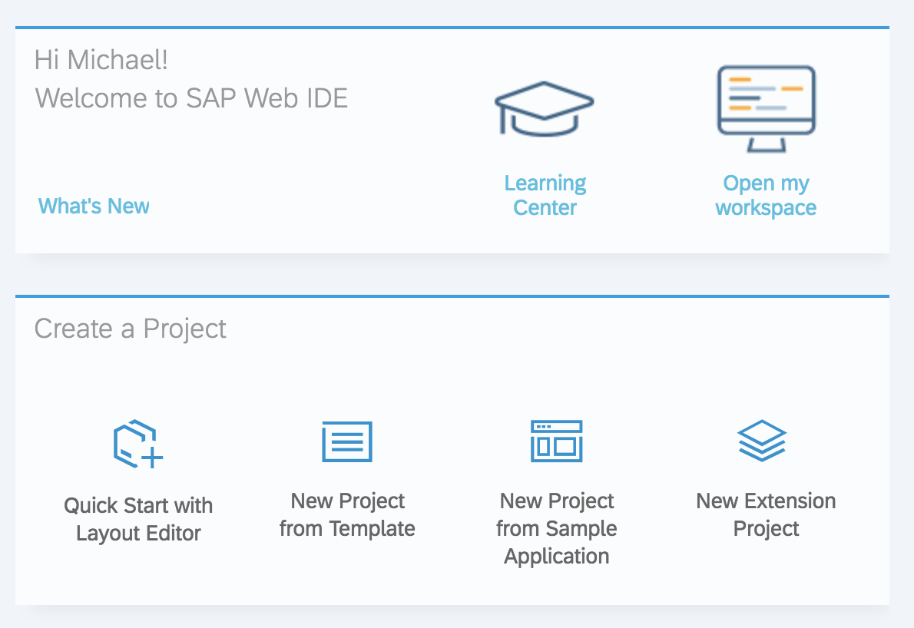

*Figure 4: Creating a new project in Web IDE*

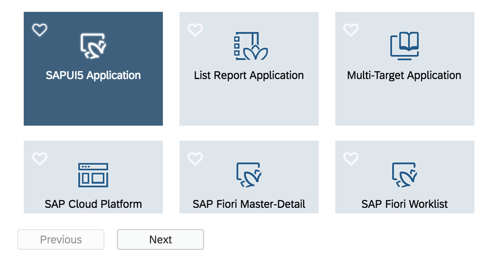

*Figure 5: Creating a UI5-based project in Web IDE*


*Figure 6: Project settings*


*Figure 7: Exporting the project from Web IDE*

#### 4.2 Creating a Fiori Cordova project

Next, we need to create a Cordova project and replace the default web app inside it with the Fiori app exported from Web IDE. In order to create a new Cordova project, run:

```
$ cordova create cordova-fiori-ci com.sap.ci.ios.CIExample
$ cd cordova-fiori-ci
```

Which creates an app named ``cordova-fiori-ci`` with the bundle identifier ``com.sap.ci.ios.CIExample``. Please note that you should use whatever App ID you registered with your Apple Developer program in step 2.4. In this case, we are simply reusing the application identifier we used in the [CI guide for native iOS development](https://www.sap.com/developer/tutorials/ci-best-practices-mobile-ios.html).

Now we need to add the platforms that we want to support:

```
$ cordova platform add ios@4.5.4 --save
$ cordova platform add android@7.0.0 --save
```

The ``--save`` flag makes sure that platform references are stored in ``package.json`` and ``config.xml``, which makes sure that we are later able to restore those project settings on the build server. Now, before we proceed with changing the project too much, you should check if everything is in order and the project is runnable at all:

```
cordova emulate ios
```

Now that it has been established that everything works fine up to this point, we can exchange the default web app with the Web IDE export. For that purpose, run:

```
$ rm -rf www
$ unzip ~/Downloads/CIExample.zip -d www/
$ mv www/neo-app.json ./neo-app.json
```

Since the ``index.html`` page that the Cordova app is displaying now moved from the ``www``folder to ``www/webapp``, we need to adjust ``config.xml`` accordingly by replacing ``<content src="index.html" />`` with ``<content src="webapp/index.html" />``.

Now we need to adjust ``www/webapp/index.html`` to make sure UI5 is loaded from the correct path. By default, it will be referenced as follows:

```
<script id="sap-ui-bootstrap"
      src="../../resources/sap-ui-core.js"
      ...
```

That means that when deployed to a server, the Fiori app will by default assume UI5 is deployed in a folder on the same level as the application root folder. However, in the Cordova container, UI5 will actually be included in the app itself and can be found at ``www/resources``. Hence, in order for the app to work in the Cordova container, we need to adjust the UI5 reference as follows:

```
<script id="sap-ui-bootstrap"
      src="../resources/sap-ui-core.js"
      ...
```

Finally, for the Fiori application to continue working in the SAP Web IDE preview, we also need to adjust ``neo-app.json`` so that it looks as follows:

```
{
  "welcomeFile": "/www/webapp/index.html",
  "routes": [
    {
      "path": "/www/resources",
      "target": {
        "type": "service",
        "name": "sapui5",
        "entryPath": "/resources"
      },
      "description": "SAPUI5 Resources"
    },
    {
      "path": "/www/test-resources",
      "target": {
        "type": "service",
        "name": "sapui5",
        "entryPath": "/test-resources"
      },
      "description": "SAPUI5 Test Resources"
    }
  ],
  "sendWelcomeFileRedirect": true
}
```

Now rerun the app via ``cordova emulate ios`` to verify the project has been configured properly.

#### 4.3 Configuring Mobile Services

Before we proceed with integrating the app with SAP Cloud Platform, please note that if you were following the [CI guide for native iOS development](https://www.sap.com/developer/tutorials/ci-best-practices-mobile-ios.html), you can simply reuse the application configuration that was created on Mobile Services via the Cloud Platform SDK for iOS Assistant. Otherwise, please refer to Step 1 of the [Advanced Authentication Mobile Interactive Tutorial](https://www.sap.com/developer/tutorial-navigator/mobile-interactive-tutorials/authentication/html5-ios/advanced.html). It will guide you through the steps required to configure a new application that we can use on Mobile Services. Please make sure that in the Security settings of the app, you select ``Basic`` instead of ``SAML``, as shown in Figure 8.

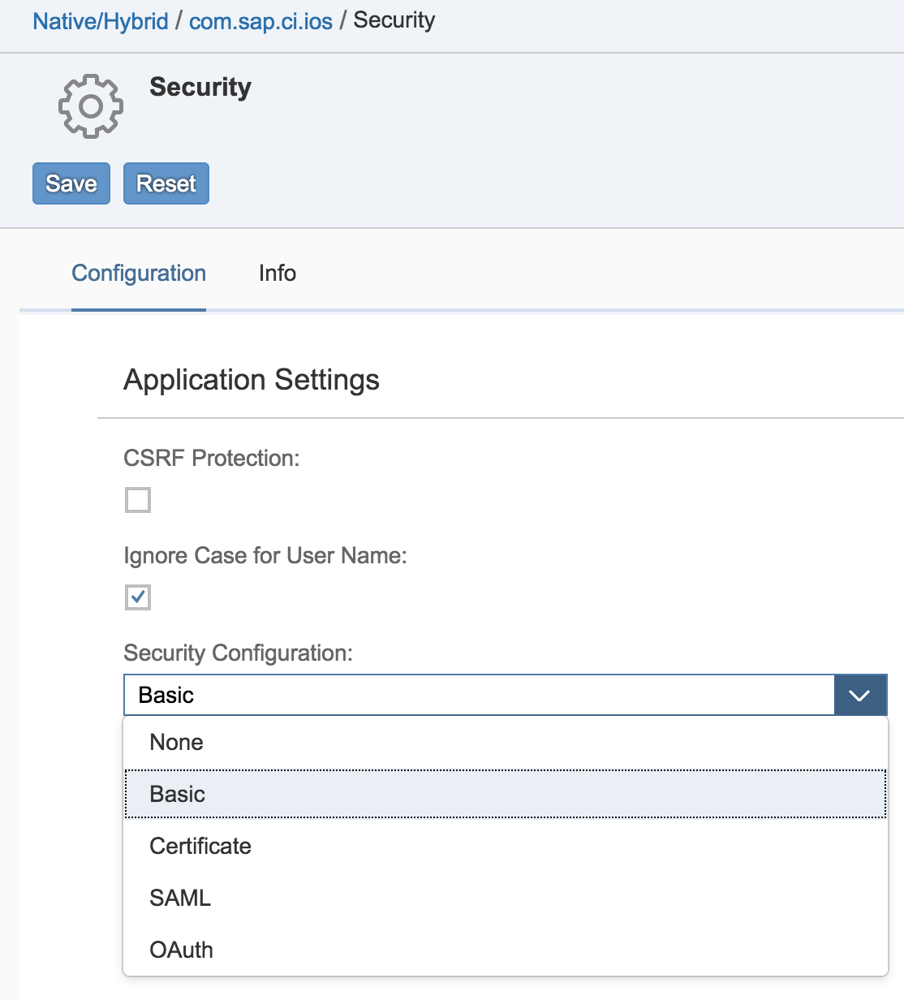

*Figure 8: Security settings on SAP Cloud Platform Mobile Services*

#### 4.4 Integrating with Mobile Services

At this point, we have a working Fiori app running in a Cordova container. However, it does not leverage any of the device-native features or SAP Cloud Platform services yet. Therefore, let's add the Kapsel logon plugin and use it to register with Mobile Services. First, we need to add the plugin itself:

```
$ cordova plugin add kapsel-plugin-logon
```

Then, in ``www/webapp/index.html``, locate the following code snippet, which attaches the UI5 component to the document:

```
<script>
			sap.ui.getCore().attachInit(function() {
				new sap.m.Shell({
					app: new sap.ui.core.ComponentContainer({
						height : "100%",
						name : "com.sap.ci.cordova.CIExample"
					})
				}).placeAt("content");
			});
</script>
```

In order to make this work with Mobile Services, we need to adjust the application life cycle a little. In essence, we need to make sure that we first register with Mobile Services, and then load the UI5 component as soon as the registration succeeds. For that purpose, replace the script tag with the following, while making sure to adjust ``SERVER_CONTEXT.serverHost`` and ``APP_ID`` and with the appropriate values:

```
<script type="text/javascript" src="../cordova.js"></script>
<script>
  (function(window) {
    "use strict";

    /*
      * SAP Cloud Platform Mobile Services application configuration ID
      */				
    const APP_ID = "com.sap.ci.ios";

    /*
      * SAP Cloud Platform Mobile Services server settings
      * Make sure to only provide the *host*, not the full server URL!
      */
    const SERVER_CONTEXT = {
      serverHost: "hcpms-pxxxxxxxtrial.hanatrial.ondemand.com",
      https: true,
      serverPort: 443
    };

    setEnvironment();
    launchApp();

    /*
      * Utility method setting a global flag which is indicating if the app is running in a Cordova container
      * or SAP Web IDE
      */
    function setEnvironment() {
      // window.cordova: Implies Cordova container.
      // EXCEPTIONS:
      //   window.sap_webide_FacadePreview: Implies Web IDE with Hybrid App Toolkit plugin enabled
      //   window.sap_webide_companion: Implies Web IDE App Companion
      window.isCordovaRuntime = "cordova" in window && !("sap_webide_FacadePreview" in window || "sap_webide_companion" in window);
    }

    /*
      * Utility method that launches the app with or without the Kapsel Logon plugin,
      * depending on the environment
      */
    function launchApp() {
      if(window.isCordovaRuntime) {
        launchWithKapsel(APP_ID, SERVER_CONTEXT);
      } else launchComponent();
    }

    /*
      * Utility method for launching the UI5 component
      */
    function launchComponent() {
      sap.ui.getCore().attachInit(function() {
        new sap.m.Shell({
          app: new sap.ui.core.ComponentContainer({
            height : "100%",
            name : "com.sap.ci.cordova.CIExample"
          })
        }).placeAt("content");
      });
    }

    /*
      * Utility method for registering with SAP Cloud Platform Mobile Services
      * once deviceready has fired and subsequently launching the UI5 component
      */
    function launchWithKapsel(appId, serverContext) {
      document.addEventListener('deviceready', function() {
        sap.Logon.init(function(registrationContext) {
          launchComponent();
        }, function(e) {
          alert("Registration failed: " + e);
          console.error(e);
        },
        appId, serverContext);
      }, false);
    }
  })(window);
</script>
```

In case you are not sure which ``serverHost`` to fill, you can find it in the "APIs" section of the application configuration overview page, as shown in Figure 9. When copying the values, please make sure that you do not accidentally copy the ``https://`` portion of the URL as well since only the host is required, not the full URL.

Now that the integration code is in place, run ``cordova emulate ios`` again to test the connection to Mobile Services. If everything works properly, you should first see a registration screen, a passcode screen and then the Fiori app itself, in that exact order, as shown in Figures 10 through 12.

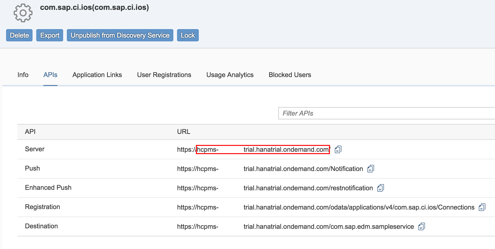

*Figure 9: Security settings on SAP Cloud Platform Mobile Services*

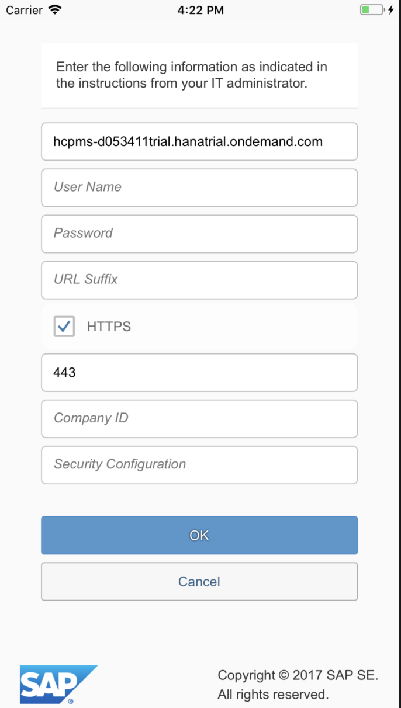

*Figure 10: Registration screen in the hybrid app*


*Figure 11: Passcode screen in the hybrid app*

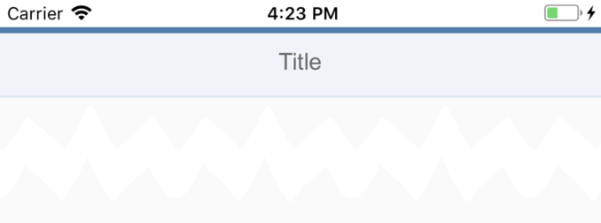

*Figure 12: UI5 app running in the Cordova container*

#### 4.5 Building for iOS

Now that the Cordova app is integrated with Mobile Services, we can move on to maintaining required to make release builds, which can then be distributed to testers. For that purpose, create a ``build.json`` file with the following contents, replacing ``codeSignIdentity`` and ``developmentTeam`` with the correct values:

```
{
  "ios": {
    "debug": {
      "codeSignIdentity": "iPhone Developer",
      "developmentTeam": "ABCDEFGHIJ",
      "packageType": "development"
    },
    "release": {
      "codeSignIdentity": "iPhone Developer",
      "developmentTeam": "ABCDEFGHIJ",
      "packageType": "ad-hoc"
    }  
  }
}
```

In case you are unsure, the team ID can be found on the [Apple Developer Membership](https://developer.apple.com/account/#/membership) page, as shown in Figure 13. With this build configuration file in place, we can check if a local build succeeds

```
$ cordova build ios --device --buildConfig=build.json --buildFlag="-allowProvisioningUpdates"
```

Please note that as of the time of writing, there is a documented alternative to using ``--buildFlag``: [Setting ``automaticProvisioning: true`` in ``build.json``](https://cordova.apache.org/docs/en/latest/guide/platforms/ios/#using-buildjson). This appears to be broken in ``cordova-ios 4.5.4``, but may be working in a future release.


*Figure 13: Apple Developer team ID*

#### 4.6 Building for Android

Once Android Studio and the Android SDK have been set up, building debuggable applications suitable for testing is comparably easy. Simply run:

```
cordova build android
```

and a debug-enabled binary will be generated that can be distributed to testers.

#### 4.7 Versioning Code with Git

Next, we need to initialize a Git repository in the Cordova project, so that we can track changes:

```
cd cordova-fiori-ci
git init
```

In order to not inflate the repository with superfluous generated files, add a ``.gitignore`` file. We can leverage the community-maintained service [gitignore.io](https://www.gitignore.io) for that purpose:

```
curl https://www.gitignore.io/api/node%2Cmacos%2Capachecordova > .gitignore
```

Finally, we should add the following Fiori-specific lines that will make sure we do not accidentally check in UI5 build artifacts:

```
\# Fiori
www/node_modules
www/dist
\# Only if you do not want to have your own UI5 version under source control
www/resources
```

Concerning the ``www/resources`` entry, it is generally acceptable to add it to your project for now and revisit it should you run into issues. Please see the next section - Managing UI5 - for a discussion of the alternatives.

Last but not least, configure your Git remote and upload a first version of your project. The exact instructions should be displayed e.g. in GitHub, or wherever you created your Git repository. They should look approximately like this. Please note that in this example, we are assuming you configured your Git for SSH, as recommended in the Git setup guide:

```
$ git remote add origin git@host:path/to/repo.git
$ git add .
$ git commit -am "Initial commit"
```

#### 4.8 Managing UI5

Before we proceed with finalizing the setup, there are two options to discuss when dealing with UI5 resources: Taking a fallback version shipped with the Mobile Platform SDK, or manually managing a specific UI5 distribution. The former approach leverages the fact that the Kapsel SDK comes with the ``kapsel-plugin-ui5``, which is added by default if you add ``kapsel-plugin-logon``. When being added to the project, it checks the ``www/resources`` path, i.e. the default location of UI5 in packaged Hybrid applications, and if no such folder can be found, then it adds a minified UI5 distribution to the project which can be used by your web app as well. The caveat here is that you do not have fine-grained control over the UI5 version supplied. The alternative is to manually manage UI5. This can be done by either simply adding it under source control (which would require to omit the ``www/resources`` entry from ``.gitignore``), or to leverage a dependency manager tool, such as ``npm``, to add a specific UI5 distribution to your project during build time. In this tutorial, we are going to stick with the fallback version added by the Kapsel SDK for the sake of simplicity. Please note, however, that it is generally recommended to supply a specific UI5 version that is required by your project.

#### 4.9 Creating the Jenkins Pipeline

Now we are getting to the final step - configuring our basic build job in Jenkins. In this guide, we are going to create a Pipeline by means of a so-called Jenkinsfile, which we can add to our project just as a regular source code artifact. The advantage is that is externalizing the knowledge and steps required to build a project within the project itself, rather than externally to it in some server configuration. Secondly, we can version such pipelines, which is a great way to evolve build scripts together with the project. First, please follow the instructions in Section 4.5 of the [CI guide for native iOS development](https://www.sap.com/developer/tutorials/ci-best-practices-mobile-ios.html) to create a new Pipeline project in your Jenkins instance, but make sure to also add "Clean before checkout" in the "Additional Behaviors" section, as shown in Figure 14. Then create a file called ``Jenkinsfile`` in the project root directory with the following contents:

```
pipeline {
    agent any

    stages {
        stage('Build UI5') {
            steps {
                dir('www') {
                    sh 'npm install'
                    sh 'grunt'
                }
            }
        }
        stage('Prepare Cordova') {
            steps {
                sh 'cordova prepare'
            }
        }
        stage('Build iOS') {
            steps {
                sh 'cordova build ios --device --buildConfig=build.json --buildFlag="-allowProvisioningUpdates"'
                sh 'find . -name "*.ipa"'
            }
        }
        stage('Build Android') {
            steps {
                sh 'cordova build android'
            }
        }
    }
}
```

Now, in your Cordova project root, run

```
$ git add Jenkinsfile
$ git commit Jenkinsfile -m "Adding Pipeline"
$ git push -u origin master
```

In your Jenkins web interface, you should now see a new build pop up under the left-hand menu, as shown in Figure 15. Wait for it to complete, which can take a few minutes. Eventually, you should find that the build succeeded, including references to a generated ``.ipa`` and ``.apk`` file in your workspace. The easiest way to verify this is taking a look at the logs of the corresponding job stage and check for the messages displayed in Figures 16 and 17. If everything is in order, you can now install your very first CI-built Android and iOS hybrid Fiori app onto your phones.


*Figure 14: Jenkins Pipeline configuration*

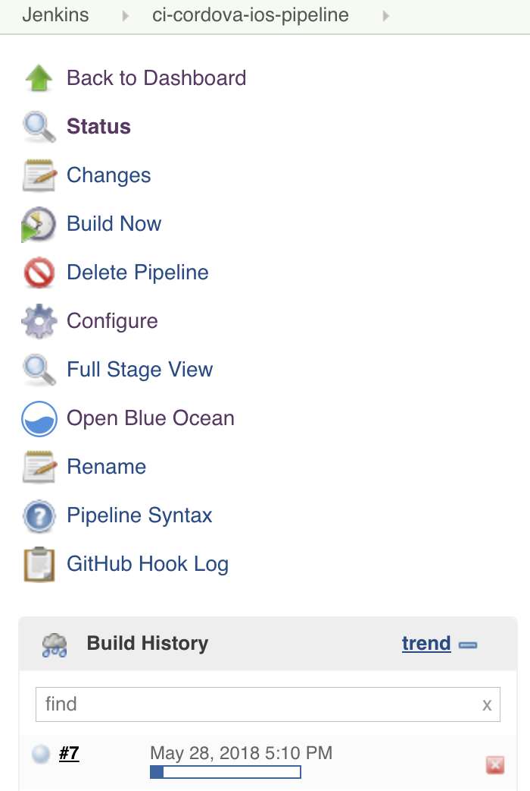

*Figure 15: Jenkins Pipeline triggered by Git commit*

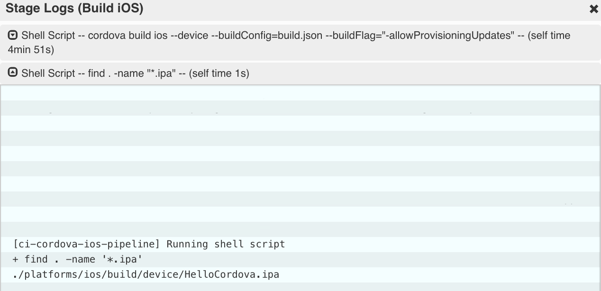

*Figure 16: Logs of successful iOS build showing ``.ipa`` file location*

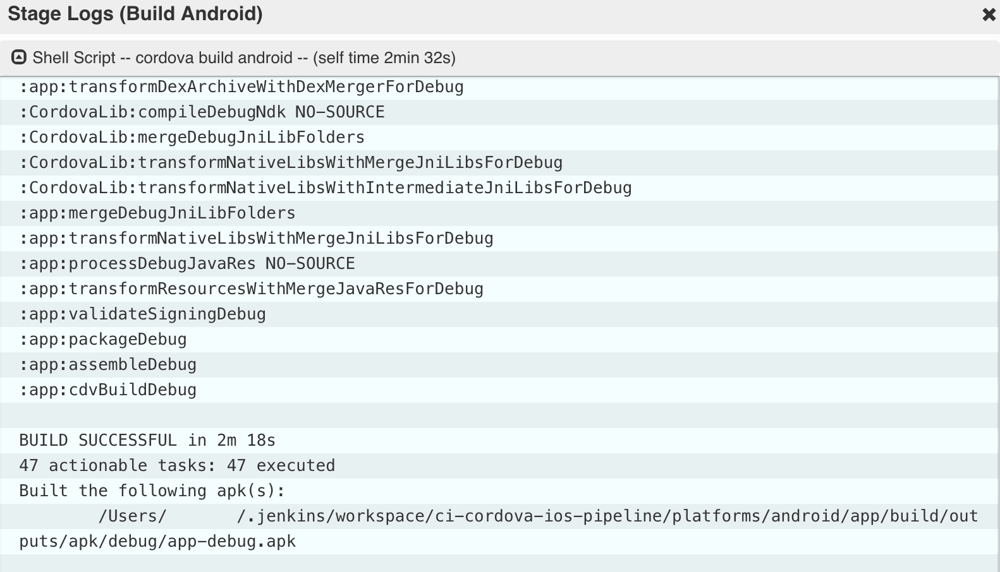

*Figure 17: Logs of successful Android build showing ``.apk`` file location*

#### 4.10 Development in Web IDE

Since the project we created is maintained in Git, we can check it out in SAP Web IDE and continue the UI5 app development there. While it is possible to leverage Web IDE UI5 app support, the build server can take care of packaging it into a Cordova container. In order to do so, simply right-click your Web IDE workspace and select the "Git" > "Clone Repository" option from the context menu as shown in Figure 18. In the next screen, input your Git repository URL, as shown in Figure 19, and select "Clone". You will be prompted for your credentials and subsequently, the hybrid project is added to your workspace, where you can run and edit it as usual.


*Figure 18: Cloning a Git repository in Web IDE (1)*

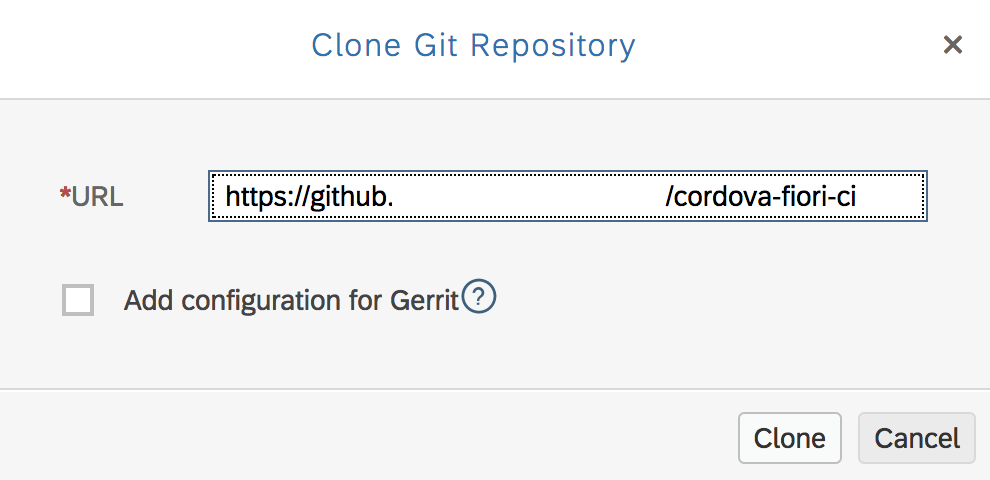

*Figure 19: Cloning a Git repository in Web IDE (2)*

