---

title: Continuous Integration (CI) Best Practices with SAP - Cloud Platform SDK for iOS
description: Part 4.7 - Basic CI setup with the SAP Cloud Platform SDK for iOS
primary_tag: products>sap-cloud-platform
tags: [  tutorial>intermediate, tutorial:type/project ]

---

## Prerequisites

  - **Proficiency:** Intermediate
  - [CI/CD Practices](https://www.sap.com/developer/tutorials/ci-best-practices-ci-cd.html)

## Next Steps

  - [Back to the Navigator](https://www.sap.com/developer/tutorials/ci-best-practices-intro.html)

---

### 1. Introduction

Done correctly, Continuous Integration (CI) can reduce turnaround time and increases quality and transparency - facts that are well-known and commonly advertised by practitioners, and that have been [confirmed in numerous studies](https://arxiv.org/pdf/1703.07019).
Another benefit in CI is that it can be used as a tool to centralize knowledge about builds and distribution. This is especially useful in technologically heterogeneous ecosystems such as Mobile, where thorough testing even requires dedicated hardware. But before we go deeper: What is CI, anyway? There is an elaborate introduction to the topic of CI and related practices in the [Best Practices guide](https://www.sap.com/developer/tutorials/ci-best-practices-ci-cd.html), but a summary will be given here as well.


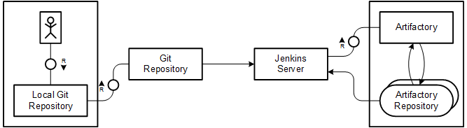

*Figure 1: High-level CI architecture with an additional binary artifact repository for dependency management*

Generally speaking, CI is a practice that enables development teams to submit and verify changes frequently, say multiple times a day. In reality, this varies widely and can go down even to [multiple releases per minute](https://www.youtube.com/watch?v=dxk8b9rSKOo). No matter the extent, the basis always is the setup shown in Figure 1: The idea is that instead of having a decentralized setup where all development team members work and verify changes individually, a centralized build infrastructure is setup to execute builds and tests. This is done for every relevant change a developer submits via a source code management system, which is able to merge contributions of individual team members and then notifies the build server about a new source code version. The build server then pulls the changes and verifies them, reporting found issues back to the development team. While this would be a sufficient minimal setup, builds executed both by the build server and developers are likely to require dependencies, such as internally used libraries. In order to centrally maintain and distribute those, typically binary artifact repositories are used, as shown in the diagram. The important thing to note is that CI only talks about integrating changes, but also serves as a foundation for more advanced approaches such as Continuous Delivery (CDE) and Continuous Deployment (CD), in which the artifact repository or a target system could also be a deployment target for each integrated change.

This guide contains instructions on how to set up CI for iOS development on a Mac, which is required for iOS builds. For other development options, please refer to [this blog](https://blogs.sap.com/2017/06/21/sap-cloud-platform-mobile-services-development-options/). The goal is to have a native app development setup where whenever a developer makes a change, the project is built and tested automatically, and where the result is an ``.ipa`` file that is suitable for ad-hoc distribution, i.e. an iOS binary that can be sent to colleagues for reviews. During development and build, libraries should be centrally and automatically made available as well.

The setup section gives an overview over one-time setup activities per build server, such as component installation and configuration. Afterwards there is a brief guide on how to create CocoaPods packages from the Cloud Platform SDK for iOS, a step that needs to be repeated for each SDK version that should be made available for the build infrastructure. The guide is being concluded by project-specific configuration that will enable the project to be built in the CI infrastructure.

The content has been selected so that it is suitable for CI and/or iOS novices, or so that it can be used for a proof of concept on automation. Advanced readers and people with existing infrastructure may want to skip the initial one-time setup and proceed with the CocoaPods section.

### Outline
1. Introduction
1. Setup
    1. Shared Setup
        1. Homebrew
	      1. Git
	      1. CocoaPods
	      1. fastlane
    1. Additional Build Node Steps
	      1. Jenkins
	      1. Artifactory
    1. Additional Workstation Steps
	      1. Cloud Platform SDK for iOS
	  1. Certificates
1. Creating Cloud Platform SDK for iOS pods
1. Project setup
	  1. Generating SAP Project
	  1. Dependency Management with CocoaPods
	  1. Easier Builds with fastlane
	  1. Creating the Jenkins Pipeline

### 2. Setup

#### 2.1 Shared Setup

##### 2.1.1 Homebrew
[Homebrew](https://brew.sh/) is what they themselves call "the missing package manager for macOS". If you're used to the lovely magical *nix universe of "``sudo`` just give me that piece of software", Homebrew is what you are looking for.


*Figure 2: ``sudo`` what I want. Source: [xkcd](https://xkcd.com/149/)*

In essence, it's a handy tool for one-line setup of various software components that are missing on your Mac. In this guide, we will be using it for setting up both Git and Jenkins.

The actual installation is very straightforward. Following the instructions on the Homebrew homepage, all you need to do is to open a terminal and run the following command, which will pull the install script from the Homebrew Git repository and run it on your Mac:

```
$ /usr/bin/ruby -e "$(curl -fsSL https://raw.githubusercontent.com/Homebrew/install/master/install)"
```

##### 2.1.2 Git
Source code management (SCM) is a key practice in modern software development, especially with multiple developers working on the same project. It is a powerful tool for bringing structure into chaos, enabling you to merge changes of contributors while at the same time cleanly separating their working copies.  These days, [Git](https://git-scm.com/) is the industry de-facto standard in SCM and the tool of choice for the majority of developers. As an example, there is a buzzing open-source ecosystem around Git, it's nucleus being GitHub [with more than 25 million open-source repositories](https://octoverse.github.com/).

The Git setup is nicely explained [in the Git Getting Started Guide](https://git-scm.com/book/en/v2/Getting-Started-First-Time-Git-Setup), but I'll give the key points here as well. Installation is pretty straightforward via Homebrew:

```
$ brew install git
```

After which you need to make sure to make yourself known to the tool:

```
$ git config --global user.name "John Doe"
$ git config --global user.email johndoe@example.com
```

Without that step, Git may be complaining about missing author information when you are trying to persist changes in the repository.

With the local tooling in place, you will need to register with a Git provider in order to be able to create remote repositories. You can really use any you like, such as [GitHub](https://github.com/) or [Bitbucket](https://bitbucket.org/), to name a few. In this guide, detailed instructions for working with GitHub are given. Therefore, in order to follow these instructions, a GitHub account or a GitHub on-premise deployment is recommended. However, most of the steps should be easily transferrable to other providers, such as Bitbucket or GitLab, as well.

Finally, and only as an added bonus, you can configure both your Git provider and Mac for SSH access. This is a matter of both security (no more passwords floating around) and convenience (SSO for everything using that SSH key). There is a [wonderful elaborate tutorial](https://help.github.com/articles/connecting-to-github-with-ssh/) available by GitHub themselves if you wish to perform this additional step.

##### 2.1.3 CocoaPods
Much like Homebrew is being referred to as the missing package manager for Mac, [CocoaPods](https://cocoapods.org/) is the missing dependency manager for Objective-C and Swift provided by the open-source community. Technically speaking, the CocoaPods dependency manager consists of a client-side component that is able to resolve dependency declaration in software projects, a central metadata repository where package declarations are stored, including download URLs, and an arbitrary service that is hosting those packages. See Figure 3 for a depiction of this flow.

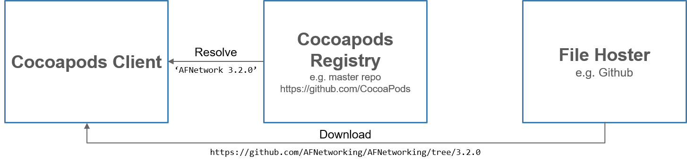

*Figure 3: Schematic overview of CocoaPods resolving a dependency*

Now the important thing to know about CocoaPods is that it is mostly geared towards open-source, and most of the documentation you will find will reflect that fact. However, the protocol also supports binary formats as well, which sometimes is the only real way to go for enterprise frameworks, which due to legal obligations or Intellectual Property issues cannot always be open-sourced. In our setup, we are going to use CocoaPods to both provide the iOS SDK in the form of CocoaPods packages, so-called "pods", and to automatically add them to our project when we build it locally or on the build server.

Since CocoaPods is a [Ruby](https://www.ruby-lang.org/en/)-based tool, this time we will not use Homebrew but install both Ruby and CocoaPods separately. First run

```
$ curl -sSL https://get.rvm.io | bash -s stable --ruby
```

To download and install Ruby, then run

```
$ gem install cocoapods
```

to also install the CocoaPods client tools.

##### 2.1.4 fastlane
[fastlane](https://fastlane.tools/) is a tool, or more a toolbox, that alleviates typical mobile developer tasks, such as building, testing, taking screenshots, and signing. Coming from an enterprise Android background, the tools and their popularity puzzled me for a while, considering how the main value proposition advertised on their homepage is centered around localized screenshot automation and public app store deployment, none of which typically are main concerns of enterprise developers. Now after having written this guide, take it from me: Don't even think about not using it. The best way to understand what fastlane gives you is taking a look at their [Scan documentation](https://docs.fastlane.tools/actions/scan/), and their example of what your build commands would look like wouldn't you be using fastlane.

Of course, there is [this getting-started guide](https://docs.fastlane.tools/getting-started/ios/setup) on their homepage, but for this tutorial you don't necessarily go through all of it. In order to install fastlane, simply run:

```
$ gem install fastlane -NV
```

##### 2.1.5 iOS Development Tools

[https://developer.apple.com/xcode/](Xcode) is the standard IDE for anything related to Apple, and also includes the required build tools for Cordova to be able to compile iOS applications. In order to install it, you will need to open the App Store on both your build server and your developer machine and search for the software, as shown in Figure 4. Once done, run the following command in order to make sure all required command-line tools are available, too:

```
$ xcode-select --install
```


*Figure 4: Obtaining Xcode from the App Store*

##### 2.1.6 Certificates

Even though we are now officially done with the software setup, there is one more thing: Dealing with certificates. They are needed for signing, which in turn is a requirement for distributing any iOS app in any way - be it in the official App Store, to colleagues, the latter being what we are going to do, or even just deploying to your own local device for testing. Not to put too fine a point on it, it is a tedious task. A tedious task which is rarely repeated, i.e. approximately once per new Mac you touch, which makes it worse because it gives you plenty time to forget what exactly the single right way to do it was again. Luckily there is fastlane's "sigh" component that takes care of provisioning profile setup for you - but more on that specifically later in the project setup guide. For now, we just need to ensure that we have the right certificates and provisioning profiles in place for our app to work. This is what we need:


1. An iOS Device
1. A Development Certificate for "iOS App Development"
1. A Distribution certificate for "App Store and Ad Hoc"
1. An app identifier. Please note that, ``com.sap.ci.ios.CIExample``, which is shown in the screenshot, cannot be reused and you will need to pick another.
1. "iOS App Development" provisioning profile including the device (1) and development certificate (2), if you are deploying to your phone for testing
1. "Ad Hoc" provisioning profile using including the device (1) and distribution certificate (3)

Before we proceed, go to the [Apple Developer website](https://developer.apple.com/account/#/welcome) and make sure that you are enrolled in the [Apple Developer Program](https://developer.apple.com/programs/), either individually or as a member of a development team. Once this has been established, go to "Certificates, Identifiers and Profiles" in the left-hand side menu.

###### 2.1.5.1 Device
Connect your iPhone to your Mac. Then, in Xcode, in the top menu, navigate to "Window" > "Devices and Simulators". Add your connected device via the "+" button to the bottom left as shown in Figure 5.

###### 2.1.5.2 Development Certificate
In the left-hand side menu, in the "Certificates" section, select "Development" to see your list of certificates, as shown in Figure 6. Hit the "+" button to add a new one, selecting "iOS App Development" as the purpose of your certificate (Figure 7). You will then need to create a Certificate Signing Request (CSR) on your Mac and upload it to the Developer page to receive your certificate. Finally, download and install the certificate to your local keychain.

##### 2.1.5.3 Distribution Certificate
In the left-hand side menu, in the "Certificates" section, select "Production" to see your list of certificates, which should look similar to the Development Certificates list. Hit the "+" button to add a new one, but this time selecting "App Store and Ad Hoc" distribution as the purpose of your certificate. Once more, you will need to provide a CSR to generate the certificate, which you should download and install, too. Please note that if you are a member of a team you may not be able to generate new distribution certificates, which from a security point of view is a good thing. However, in order to build a shippable binary at the end of this guide, you will need to contact the certificate owner for their private key and install it on your build machine in order to be able to use it.

Once you created both your distribution and development certificates, make sure to download them and to add them to the keychains of both your build and development node, as shown in Figure 8.

###### 2.1.5.4 App ID
In the left-hand side menu, in the "Identifiers" section, select "App IDs" to see your list of App IDs, as shown in Figure 9. Create a new one to your liking, but remember to always use that specific identifier in the remainder of this tutorial.

###### 2.1.5.5 Development Provisioning Profile
In the left-hand side menu, in the "Provisioning Profiles" section, select "Development" to see your list of development provisioning profiles, as shown in Figure 10. Hit the "+" button to add a new one, selecting "iOS App Development" as the purpose. When asked, make sure to select the App ID, device and development certificate you created. In the end, give your provisioning profile an arbitrary name and save it.

###### 2.1.5.6 Distribution Provisioning Profile
In the left-hand side menu, in the "Provisioning Profiles" section, select "Distribution" to see your list of distribution provisioning profiles, which should look similar to your development profile list. Hit the "+" button to add a new one, but this time selecting "Ad Hoc" as the purpose. When asked, make sure to select the App ID, Device and distribution certificate you created. In the end, give your provisioning profile an arbitrary name and save it.


*Figure 5: Adding a device to your Developer account*

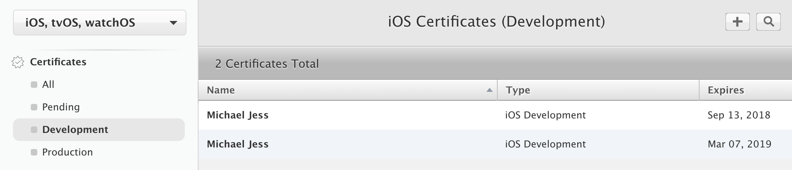

*Figure 6: Development certificate list*


*Figure 7: Creating a new development certificate*

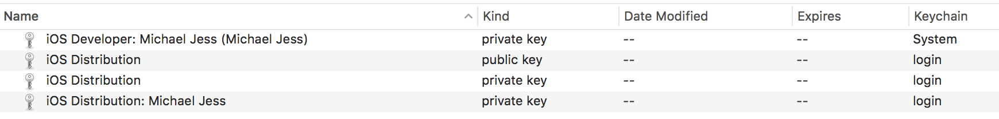

*Figure 8: iOS development and distribution certificates in the keychain*

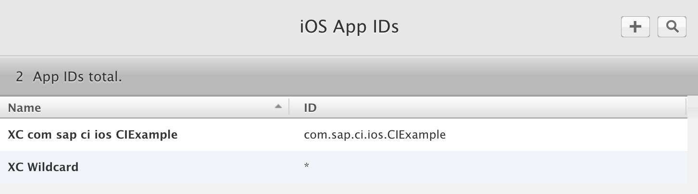

*Figure 9: Registering a new application ID with Apple*

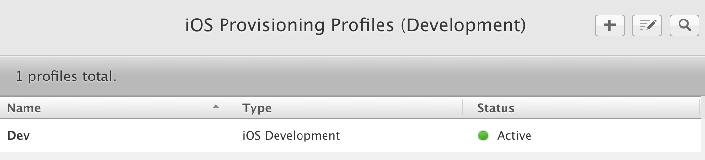

*Figure 10: Creating a new provisioning profile*

#### 2.2 Build node Setup

##### 2.2.1 Jenkins
[Jenkins](https://jenkins.io/) is an automation server which has been around for a while. Originally having been released under the name of Hudson, it was branched off, rebranded and continued under its current name by the open-source community. Put simply, Jenkins is a server that can run build commands for your projects, including test and deploy scripts. That may not sound much, but there's an enormous ecosystem - including sophisticated deploy pipeline support  and integration for all sorts of external tools, such as SCM integration. The cool thing is that one of the more baseline features is that Jenkins can be configured to trigger builds on external events, such as an SCM change.

In order to install it, we can just run:

```
$ brew install jenkins
```

Now configure ``/usr/local/opt/jenkins/homebrew.mxcl.jenkins.plist`` and remove the following lines:

```
      <string>--httpListenAddress=127.0.0.1</string>
      <string>--httpPort=8080</string>
```

We need to make this modification because the brew installation overrides the Jenkins defaults for listen interfaces, preventing external applications to access it. By removing these lines, we revert to Jenkins default behavior, which enables services such as GitHub to send a notification to it whenever there is a code change.

We should also make sure to install the latest Xcode command-line interface (CLI) tools. Otherwise the iOS builds later on might not work:

```
$ xcode-select install
```

Now we can start our Jenkins service and go ahead with the configuration. Run

```
$ brew services start jenkins
```

and open ``http://localhost:8080/`` in your browser. Jenkins will now require a password for you to log in as an administrator, but unlike other software it does not come with a preset default. Instead it is generated during setup and stored in a file, which we now need to read, e.g. from your Terminal via

```
$ cat ~/.jenkins/secrets/initialAdminPassword
```
You can now just copy the displayed password and paste it into the Jenkins UI. When asked which plugins to install, just go with the default selection, as shown in Figure 11. Among other things, the defaults enable us to leverage Pipelines, a great feature that enables us to also version control build scripts. Eventually you will be asked to optionally create a new admin user (Figure 12).

Finally we will need to adjust the Jenkins ``PATH`` environment variable to make sure that the tools we are using can find their dependencies. Since Jenkins is started as a service, it won't be able to inherit your user environment variables, even though it will be started in your user context. The issue is that environment variables are typically stored in ``~/.bash_profile``, which is only evaluated after your Jenkins server stared. Therefore we need to maintain those variables manually. In order to do so, in the Jenkins UI, click the "Manager Jenkins" link in the left-hand menu. Then navigate to Configure System > Global Properties > Environment Variables, and click "Add PATH". In your Terminal, execute

```
$ echo $PATH
```

which will print your current PATH variable. Copy the value and in Jenkins, paste it in the form prefix by "$PATH:" as shown in Figure 13. Save the settings and your Jenkins server is ready to receive iOS builds.


*Figure 11: Installing Jenkins features*

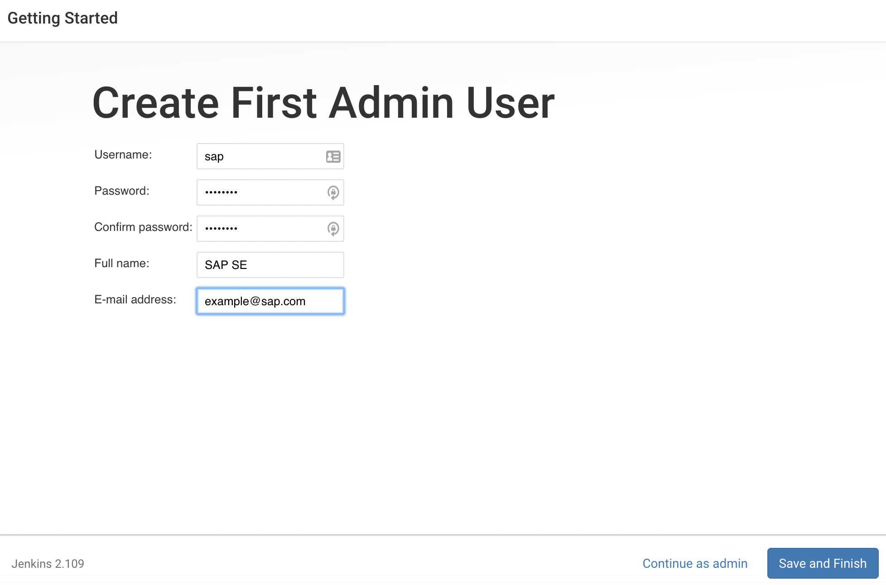

*Figure 12: Creating an admin user in Jenkins*

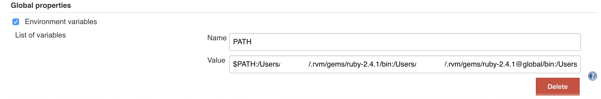

*Figure 13: Setting the PATH variable in Jenkins*

##### 2.2.2 Artifactory
[Artifactory](https://jfrog.com/artifactory/) is being referred to by its vendor, JFrog, as the "Enterprise universal artifact manager", and in this guide we are going to show how to use it to host pods for our automation setup. But wait, why are we caring about this at all, anyway? Without any supporting tools, individual developers will need to manually manage dependencies within their projects, which is is a matter of knowing where to get them from, where to put them and what transitive dependencies need to be satisfied, if any. Repositories, such as Artifactory, serve as a central point where binary artifacts, such as project dependencies, can be published and from where they can be retrieved. This is done in a standard way so that dependency management tools like CocoaPods can be used to automatically retrieve dependencies from there and include them in our project, hence eliminating tedious activities.

Concerning Artifactory itself, the attentive reader may have noticed how so far mostly free or open-source open-source software has been recommended, especially considering how CocoaPods support is not available in the free Artifactory version. Indeed, there are alternative ways set up a repository for CocoaPods, such as this documented do-it-yourself alternative: [Manually setting up a repository on the local file system](https://guides.cocoapods.org/making/private-cocoapods.html). However, this setup needs to be manually maintained and it would depend on infrastructure accessible to all developers and build hosts, such as a shared network drive, to function. When we take a look at what artifact managers are available and what they support, we quickly find [there is no real alternative](https://binary-repositories-comparison.github.io/) - hence the recommendation to use Artifactory, if possible. The added benefit of Artifactory is that it also supports all other repository formats that are interesting for Mobile development, i.e. NPM, NuGet and Maven. For the sake of this tutorial, you can simply request a 30-day Pro trial.

As with the other software components, there is [this setup guide](https://www.jfrog.com/confluence/display/RTF/Installing+on+Linux+Solaris+or+Mac+OS) on the JFrog homepage, but a summary will be given here. First, we need to make sure the dependencies are installed, which is only Java in this case. This is a default software package on Macs, so we can skip this step. Next, select an installation option of your choice to download and install Artifactory, e.g. the zip option which simply needs to be extracted and subsequently requires setting the  ``$ARTIFACTORY_HOME`` environment variable accordingly in ``~/.bash_profile``:

```
export ARTIFACTORY_HOME==~/artifactoy-pro-5.9.1
```

Now open a new Terminal for it to reload these settings or run

```
$ source ~/.bash_profile
```

to reload the configuration in an already-open Terminal. Once this has been done, you can start Artifactory by running

```
$ $ARTIFACTORY_HOME/bin/artifactoryctl start
```

Once the server has started, navigate to [http://localhost:8081](http://localhost:8081) to open the Artifactory web interface. When it is asking you which repositories to create, pick only CocoaPods or everything Mobile-related as shown in Figure 14. The absolute minimum you should select, however, is CocoaPods.

When everything is set up, Artifactory will take you to the main dashboard, containing a neat "Set Me Up" section that nicely explains how to proceed with your system setup, as shown in Figure 15. Select the ``cocoapods-local`` entry to learn how to configure your Mac for this repository. In a nutshell, you need to do three things: Installing the CocoaPods Artifactory extension, adding the ``cocoapods-local`` repository to your Mac, and configuring credentials to access that repository. To do so, run

```
$ gem install cocoapods-art
$ pod repo-art add cocoapods-local "http://localhost:8081/artifactory/api/pods/cocoapods-local"
```

And then, in the ``~/.netrc`` file (which you may need to create if it does not exist yet), enter:

```
machine localhost
login <USERNAME>
password <PASSWORD>
```

Note that on your development machine, you may want to configure a user with write access to the repository to be able to upload.

If you are unsure what values to put for user and password, just follow the "Set Me Up" guide: There is an option for you to receive configuration snippets that contain your personal credentials for local configuration, as can be seen in Figure 16.

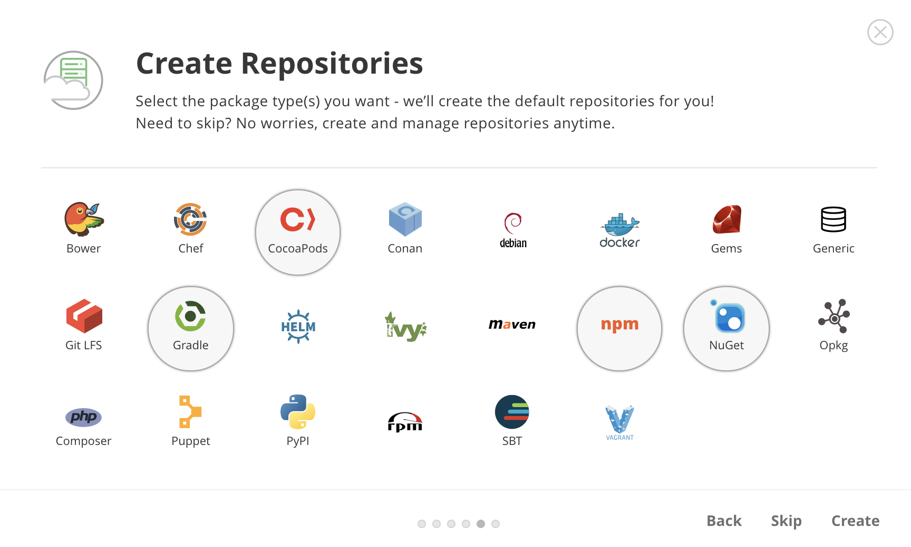

*Figure 14: Selecting repository types in Artifactory*

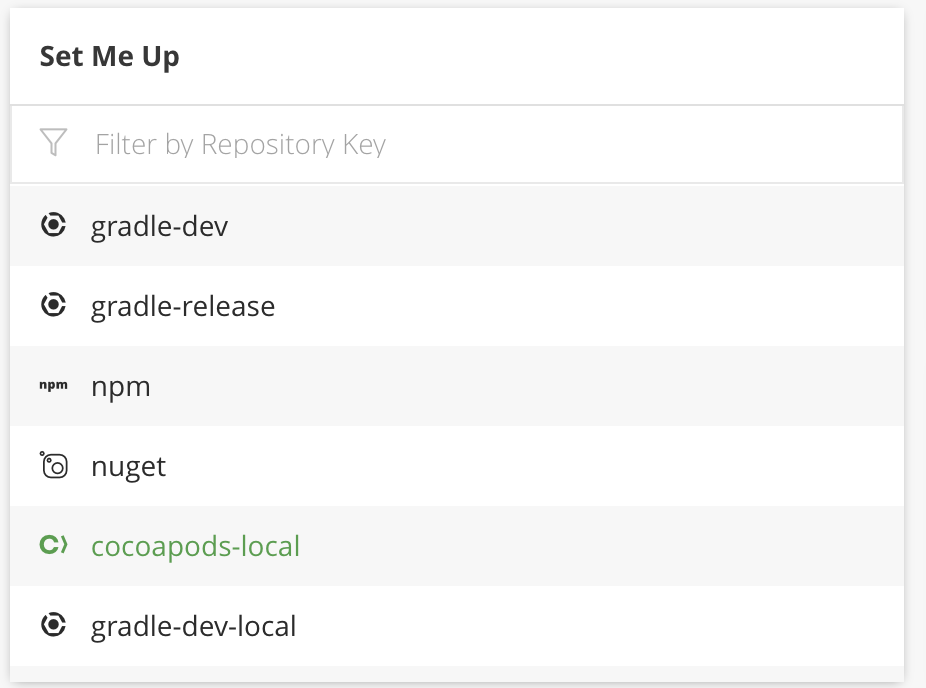

*Figure 15: "Set Me Up"-options in Artifactory*

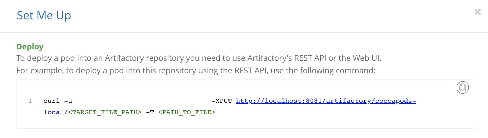

*Figure 16: Upload example in the CocoaPods setup guide*

#### 2.3 Workstation Setup

##### 2.3.1 Cloud Platform SDK for iOS
The [SAP Cloud Platform SDK for iOS](https://www.sap.com/germany/developer/topics/cloud-platform-sdk-for-ios.html) is our latest SDK for native app development for iOS in Swift. Apart from facilitating the integration of your app with SAP Cloud Platform, it also contains a wide variety of Fiori for iOS controls, which enables you to build iOS native apps that won't look alien to your average SAP user base. In the context of this tutorial, we require it for two reasons: Firstly, it contains the Assistant, which is a great time-safer if you're creating a new app that should integrate with SAP Cloud Platform, and we are going to do exactly that later. Secondly, it has an option to export the bare libraries, which we subsequently are going to turn into pods. In order to download it, go to the [SAP Store](https://store.sap.com), search for "SAP Cloud Platform SDK for iOS" as shown in Figure 17, and request a download. After filling in your personal details, you will receive an email with a download link. Download and open the DMG file to install the SDK.

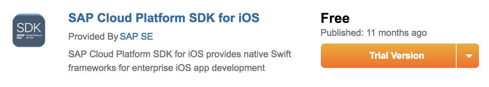

*Figure 17: Upload example in the CocoaPods setup guide*

### 3. Creating pods

Finally, all the software components are in place and we can take a look at how we take the SAP Cloud Platform SDK for iOS and make it available in this infrastructure. In order to enable that, first we will need to actually get the Cloud Platform SDK for iOS frameworks. For that purpose, simply open the Assistant app that we installed in the previous step and in the top menu, select the "Export Frameworks" option as shown in Figure 18 and export the frameworks to an arbitrary folder. When you take a look at the generated folder, you are going to see three framework flavors that were exported: ``Fat``, ``iphoneos`` and ``iphonesimulator``. The latter two contain binaries for building real device or simulator apps respectively, and they will not work for the other purpose. The fat release contains both in one package, which makes it a great option for development scenarios. So why don't we just ship the fat release? The reason is that when you submit your app to the app store, it won't be accepted if it also includes simulator binaries, hence the need for all these flavors. In this tutorial, we will assume the fat release is used for the sake of simplicity.

In order to create pods and automagically upload them to your Artifactory service, simply run the following command. We won't need to provide Artifactory credentials here, because ``curl`` picks them up automatically from ``~/.netrc``, where we stored them before:

```
$ find . -type d -regex '.*\.framework' | xargs basename | while read framework; do
  version=$(defaults read "$(realpath $framework/Info.plist)" CFBundleShortVersionString)
  dir="${framework%.*}"
  echo -e "\n$dir"
  mkdir -p "pods/$dir"
  cp -r "$framework" "pods/$dir/$framework"
  curl -s "https://raw.githubusercontent.com/miffels/catfood/master/blogs/ci/podspecs/${dir}.podspec" | sed -e "s/__VERSION__/$version/g" > "pods/$dir/$dir.podspec"
  curl -s https://raw.githubusercontent.com/miffels/catfood/master/blogs/ci/podspecs/LICENSE > "pods/${dir}/LICENSE"
  echo -e "\tArchiving..."
  tar -C pods -czf "pods/$dir.tar.gz" "$dir" 1>/dev/null
  echo -e "\tUploading..."
  curl -XPUT "http://localhost:8081/artifactory/cocoapods-local/$dir/" -T "pods/$dir.tar.gz" 1>/dev/null
done
```

And, just in case you want to delete all uploaded libraries from the repository for some reason, you can simply run those two commands to get rid of the artifact from the server:

```
$ find . -type d -regex '.*\.framework' | xargs basename | while read framework; do
  version=$(defaults read "$(realpath $framework/Info.plist)" CFBundleShortVersionString)
  dir="${framework%.*}"
  curl -XDELETE http://localhost:8081/artifactory/cocoapods-local/$dir && curl -XDELETE http://localhost:8081/artifactory/cocoapods-local/.specs/$dir
done
```

Once you are done with your repository changes, make sure to run this command to update your local CocoaPods repository:

```
$ pod repo-art update cocoapods-local
```

Now the iOS SDK is available to CocoaPods clients, and your local tools can find them. You can take a look at your ``cocoapods-local`` repository as shown in Figure 19 to make sure everything is in order. While doing so, also take note of the version displayed (in this case ``2.1.400``), which you need to match in your dependency specification later on.

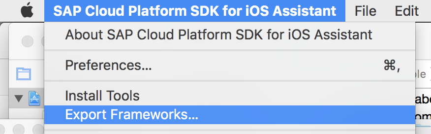

*Figure 18: Exporting SAP Cloud Platform SDK for iOS frameworks from the Assistant*

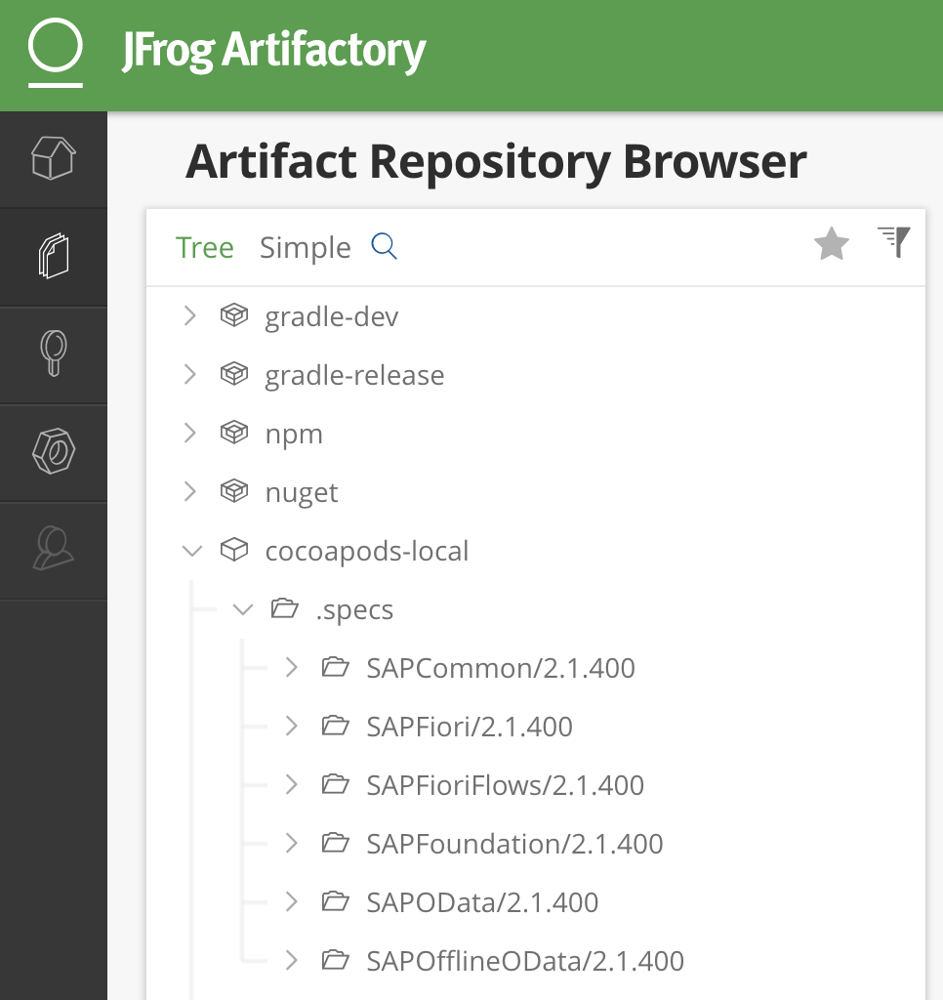

*Figure 19: Repository contents after pods have been uploaded*

### 4. Project setup
The last step is to create a new project in the Cloud Platform SDK for iOS Assistant, and to configure it so that it works nicely with the infrastructure that we just created.

#### 4.1 Creating the iOS Project
If you are using the Assistant for the very first time, make sure to configure your Cloud Platform login as documented [in this tutorial](https://www.sap.com/germany/developer/tutorials/fiori-ios-hcpms-sdk-assistant.html). Once done, create a new project by adding the "+" button on the initial screen and configure it as follows, as shown in Figure 20 - values not listed in the bullet points are optional or arbitrary:

	- Product Name: The last (n-th) bit of the "App ID" that you registered with Apple, in this case ``CIExample``
	- Organization Identifier: The remaining n-1 bits of your App ID, in this case ``com.sap.ci.ios``

Proceed to the next screen and create a new application in SAP Cloud Platform as depicted in Figure 21. All of those values are really just Cloud Platform-internal, but ideally you should match what you selected in the first screen for the sake of simplicity.

On the final screen, which is shown in Figure 22, add a new destination to your project by hitting the "+" button and selecting "Existing destination…". From the list, select ``com.sap.edm.sampleservice``, which is an OData service shipped with Mobile Services for just that purpose.


*Figure 20: General project settings in the Assistant*


*Figure 21: Selecting the Sample Service in the Assistant*

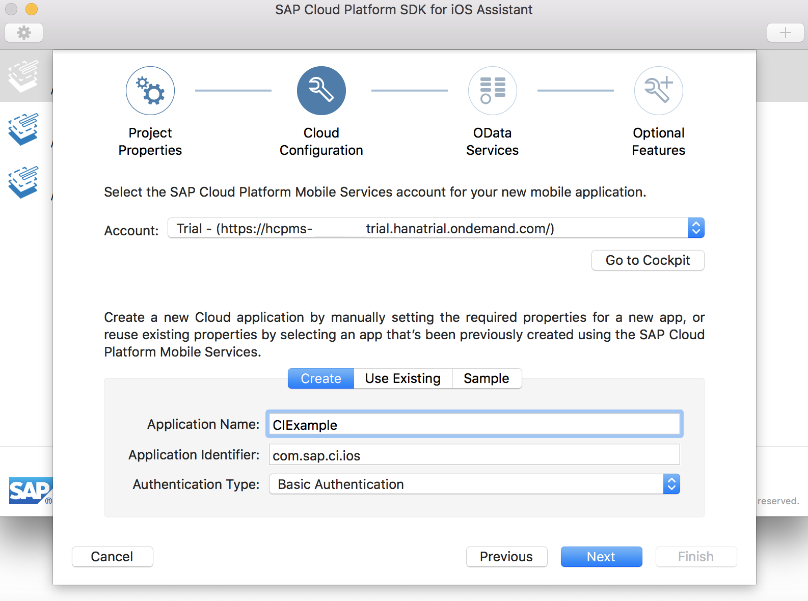

*Figure 22: Maintaining server-related configuration in the Assistant*

Once the app has been generated, Xcode will automatically open it. Now select your project file and as shown in Figure 23, adjust the team in your main target to match your setup. For you, it may be your organization.

Now we are just going to add some dummy tests in order for our build job to have something to execute. For that purpose, go to the Tests tab and add a new Unit Test Target as shown in Figure 24. This will also add two empty tests by default, which are good enough for what we are trying to do. At this point, you can right-click the target that should now show in the tests list and run it to see if things work so far.

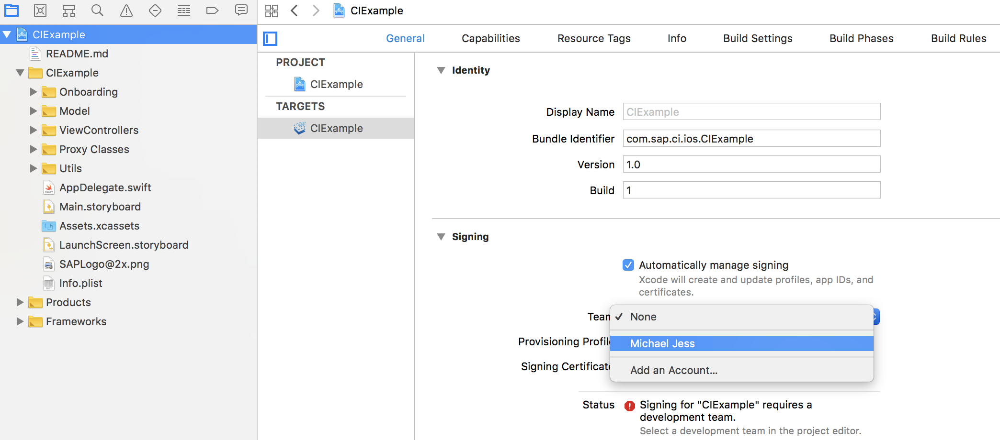

*Figure 23: Setting the team ID for building in Xcode*

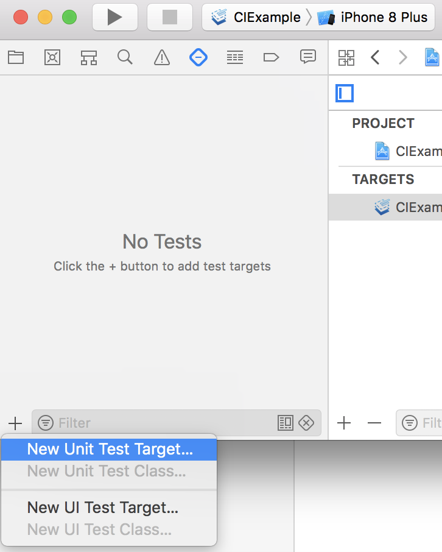

*Figure 24: Adding tests to the project*

#### 4.2 Managing Dependencies with CocoaPods

These setup steps are not yet specific to our tutorial, but some basic settings that should be maintained early on. Now we are going to get our hands dirty by removing the included frameworks and using CocoaPods instead: First, expand the Frameworks folder in your project, select all SAP frameworks, right-click and delete them, as demonstrated in Figure 25. Ideally, you should move them to Trash, since otherwise the files might still be lingering in your source code repository, which would needlessly inflate the repository and possibly confuse other team members. Next, we add a Podfile to our project by running the following command from Terminal in the project root directory:

```
$ pod init
```

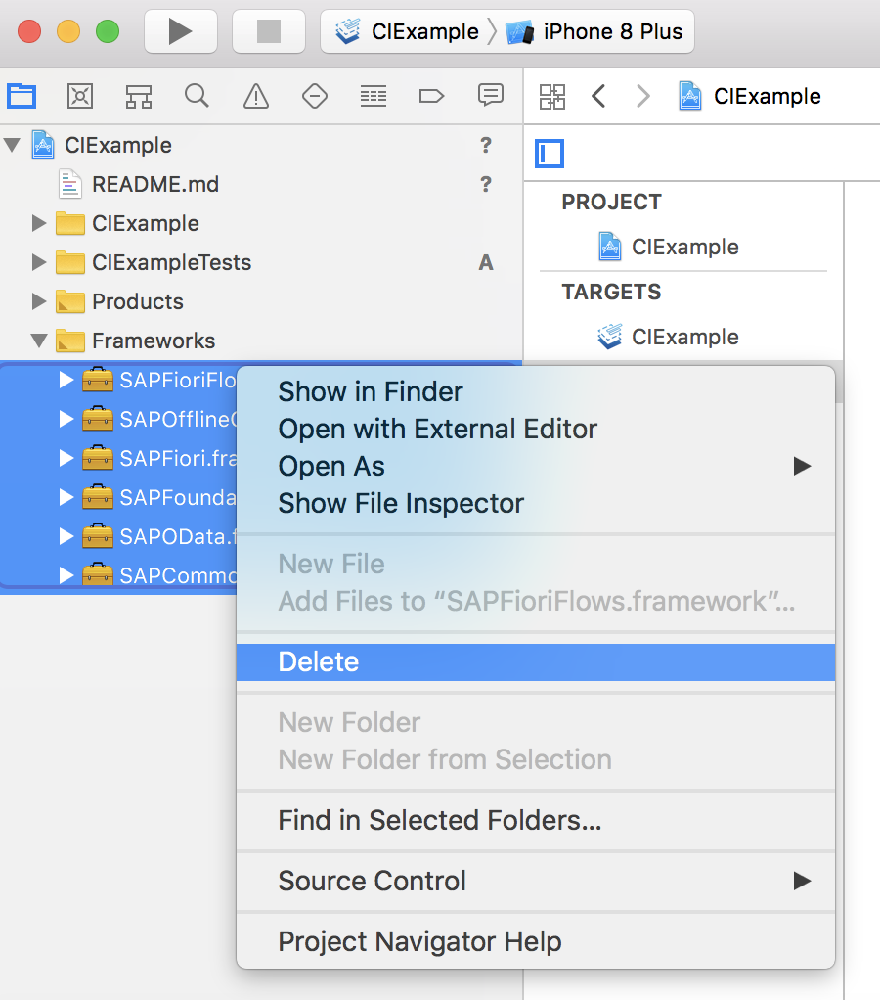

*Figure 25: Removing frameworks from the project*

Now modify the newly-created Podfile so that its contents match the following specification, replacing the SDK version, in this case '2.1.400', accordingly:

```
plugin 'cocoapods-art', :sources => [
    'cocoapods-local'
]

target 'CIExample' do
    use_frameworks!

    pod 'SAPFioriFlows', '~> 2.1.400'
    pod 'SAPFoundation', '~> 2.1.400'
    pod 'SAPOData', '~> 2.1.400'

    target 'CI-ExampleTests' do
        inherit! :search_paths
    end
end
```

If you are unsure or do just want to reference the latest release, you can omit the version specification. However, this is not recommended because two developers or build servers running CocoaPods at different times may be receiving different SDK versions, depending on what is currently available in your repository.

Now, in order to see if all this works, simply run

```
$ pod install
```

for CocoaPods to download the dependencies and create a properly configured workspace for you. Now in order to proceed, close Xcode, navigate to your project directory, and open the ``.xcworkspace`` file (shown in Figure 26) that CocoaPods created for you. The reason is that if you proceed without the workspace, you simply won't see the dependencies CocoaPods added. See Figure 27 for an example of what your Xcode project should now look like. Once more, run the unit tests in your project to validate everything still works.

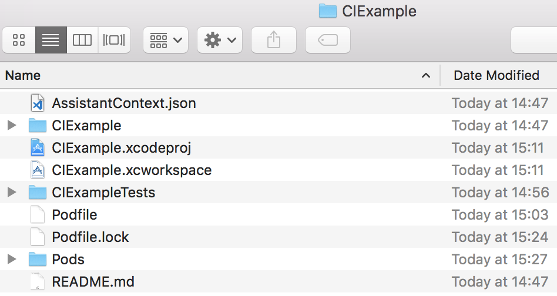

*Figure 26: The Xcode workspace generated by CocoaPods*

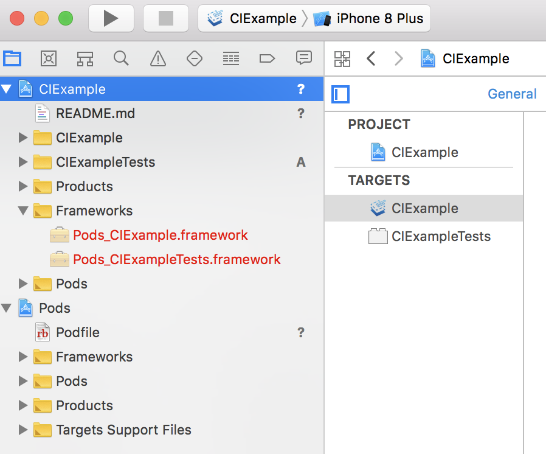

*Figure 27: Generated workspace opened in Xcode*

#### 4.3 Managing Build Targets and Certificates with fastlane
Now that dependency management is working, we should create some build targets in fastlane to get our automation going. To do so, simply run

```
$ fastlane init
```

which will create a number of files in your project. When prompted, the preset you are choosing does not really matter. For this tutorial we chose #2 - "beta distribution" - because it contains setup steps for the Appfile, which then contains your Apple email address and your App ID. Why is this useful? Previously we mentioned fastlane's "sigh" component, which does all the certificate handling for you. Typically it would prompt you for your user name and App ID whenever you run it, but it can also just read them from the Appfile. In fact, the fastlane ``CredentialsManager`` can also store your password in the keychain for you, which enables the tool for automatic build jobs, since it will no longer prompt for credentials during build. For the very same reason now is the best time to run

```
$ fastlane sigh
```

right now, which will tell you if your Apple Developer setup is correct and which will store your password so that Jenkins can pick it up later.

Now that this is done, we need to adjust the generated Fastfile, which you can find in the fastlane folder of your project. For our scenario, the following contents are a good starting point:

```
default_platform(:ios)

platform :ios do
  desc "Description of what the lane does"
  cocoapods(
    clean: true
  )
  sigh(adhoc: true)

  lane :custom_lane do
    # add actions here: https://docs.fastlane.tools/actions
  end
  lane :tests do
    scan(workspace: "CIExample.xcworkspace", scheme: "CIExample")
  end
  lane :beta do
    gym(workspace: "CIExample.xcworkspace",
      scheme: "CIExample",
      export_method: "ad-hoc")
  end
end
```

Finally, we will need to adjust the generated Gemfile, which lists Ruby dependencies of our project:

```
source "https://rubygems.org"
gem "fastlane"
gem "cocoapods"
gem "cocoapods-art"
```


This is important for the standard fastlane-CocoaPods integration to work properly. Now you can run both so-called lanes we defined in the Fastfile as follows:

```
$ fastlane tests
$ fastlane beta
```

If they complete successfully, we are good. Otherwise you should check the logs for additional information.

#### 4.4 Versioning Code with Git
Now we need to put our project into a Git repository, so that Jenkins can pick it up from builds. First, you will need to create a new Git repository as shown in Figure 28. As mentioned previously, in this guide we are showing the setup using the example of GitHub, so the exact screens might vary for you. Once done, go to the repository "Integration & services" settings as shown in Figure 29 and add the "Jenkins (GitHub plugin)" service to your repository. Finally, in the next screen that pops up, enter the webhook URL of your Jenkins, which is simply ``http(s)://your.host.name:port/github-webhook/``, as shown in Figure 30. Now your Git repository is able to send notifications to your build server whenever a code change happens.

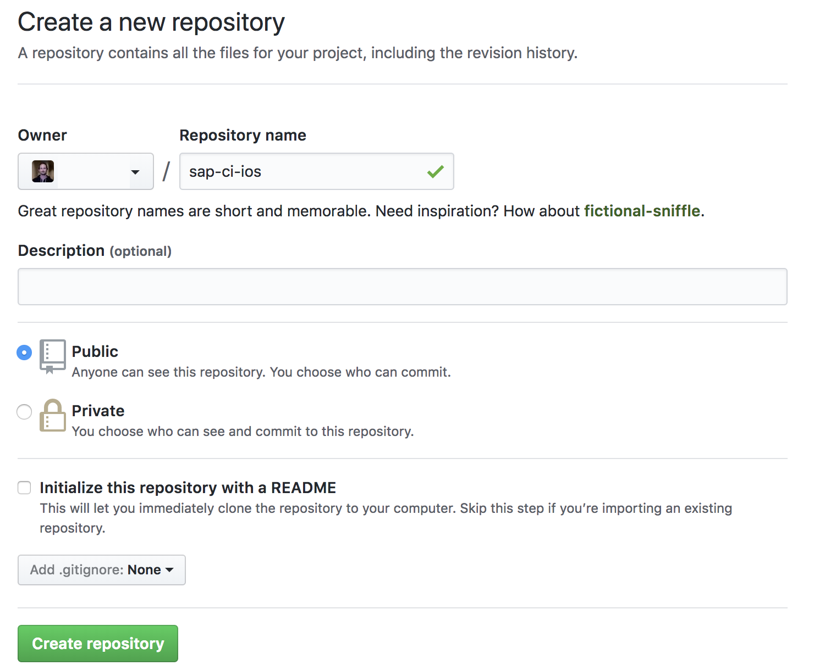

*Figure 28: Creating a new repository in GitHub*

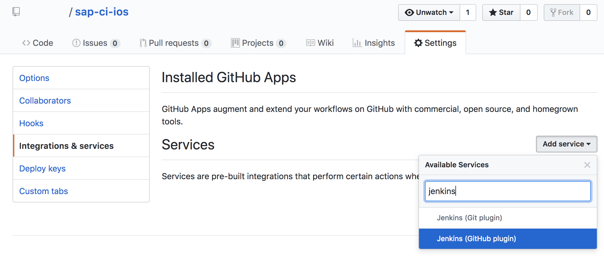

*Figure 29: Adding Jenkins plugin to GitHub repository*


*Figure 30: Setting the webhook URL for source control notifications*

Now, in your project root directory, run

```
$ git init && curl https://www.gitignore.io/api/xcode%2Cmacos%2Ccocoapods%2Cfastlane > .gitignore
```

in Terminal. This command does two things: First, it initializes an empty Git repository in your project, i.e. we basically enable it for Git. Secondly, we leverage gitignore.io to generate a community-maintained default file that excludes certain files, such as build artifacts, from source code management. In addition, we recommend to also add the following lines to the ``.gitignore`` file:

```
# Additional build artifacts
*.mobileprovision
*.ipa
*.app.dSYM.zip
fastlane/test_output
fastlane/report.xml
```

Last but not least, configure your Git remote and upload a first version of your project. The exact instructions should be displayed e.g. in GitHub, or wherever you created your Git repository. They should look approximately like this. Please note that in this example, we are assuming you configured your Git for SSH, as recommended earlier:

```
$ git remote add origin git@host:path/to/repo.git
$ git add .
$ git commit -am "Initial commit"
```

Please note that push command is omitted here because we are going to use it in the next step to trigger our first build.

#### 4.5 Creating the Jenkins Pipeline
Now we are getting to the final step - configuring our basic build job in Jenkins. In this guide, we are going to create a Pipeline by means of a so-called Jenkinsfile, which we can add to our project just as a regular source code artifact. The advantage is that this to include the knowledge and steps required to build a project within the project itself, rather than externally to it in some server configuration. Secondly, we can version such pipelines, which is a great way to evolve build scripts together with the project. In order to get started, first create a file called ``Jenkinsfile`` in the project root directory with the following contents:

```
pipeline {
    agent any

    stages {
        stage('Prepare Tools') {
            steps {
                sh 'bundle install'
            }
        }
        stage('Test') {
            steps {
                sh 'bundle exec fastlane tests'
            }
        }
        stage('Build') {
            steps {
                sh 'bundle exec fastlane beta'
            }
        }
    }
}
```

Then, back in your Jenkins web interface, you should see a Welcome message akin to what is shown in Figure 31. Click "create new jobs" to get started, and select the "Freestyle Project" option shown in Figure 32. In the "Build Triggers" section, select "GitHub hook trigger for GITScm polling", as depicted in Figures 33. Then, configure the Pipeline that Jenkins should fetch from Git, as shown in Figure 34.


*Figure 31: Jenkins welcome screen*

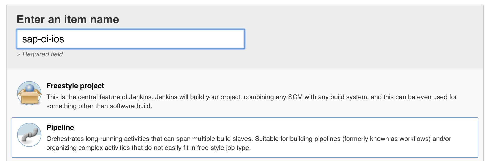

*Figure 32: Creating a new Pipeline job in Jenkins*


*Figure 33: Webhook configuration in Jenkins job*

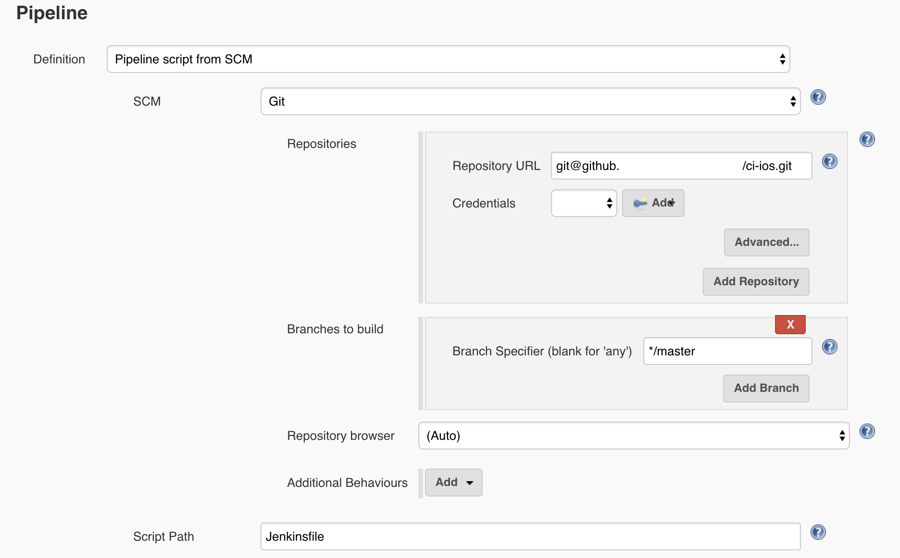

*Figure 34: Configuring Pipeline from SCM*

Now save the settings, and back in your Terminal, in your iOS project root, run

```
$ git add Jenkinsfile
$ git commit Jenkinsfile -m "Adding Pipeline"
$ git push -u origin master
```

In your Jenkins web interface, you should now see a new build pop up under the left-hand menu, as shown in Figure 35. Wait for it to complete, which can take a few minutes. Eventually, you should find that the build succeeded, including tests that have been run and a generated ``.ipa`` file in your project root directory. The easiest way to verify this is taking a look at the logs of the build job, and check for the message displayed in Figure 36. If everything is in order, you can now browse to the indicated location and use Xcode to install your very first CI-built iOS app on your phone.

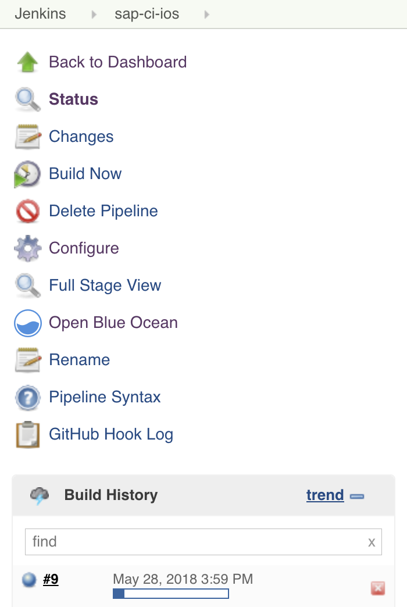

*Figure 35: Jenkins job triggered by a code change in Git*

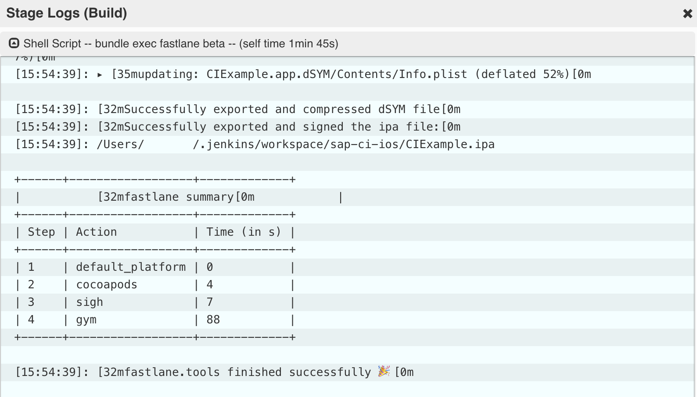

*Figure 36: Log of the successful Jenkins build stage*

## Next Steps

  You can read through the remaining guides in order to proceed with advanced automation topics such as Git-related workflows (e.g. branching strategies and code reviews) and setting up pipelines.

  - [Back to the Navigator](https://www.sap.com/developer/tutorials/ci-best-practices-intro.html)
