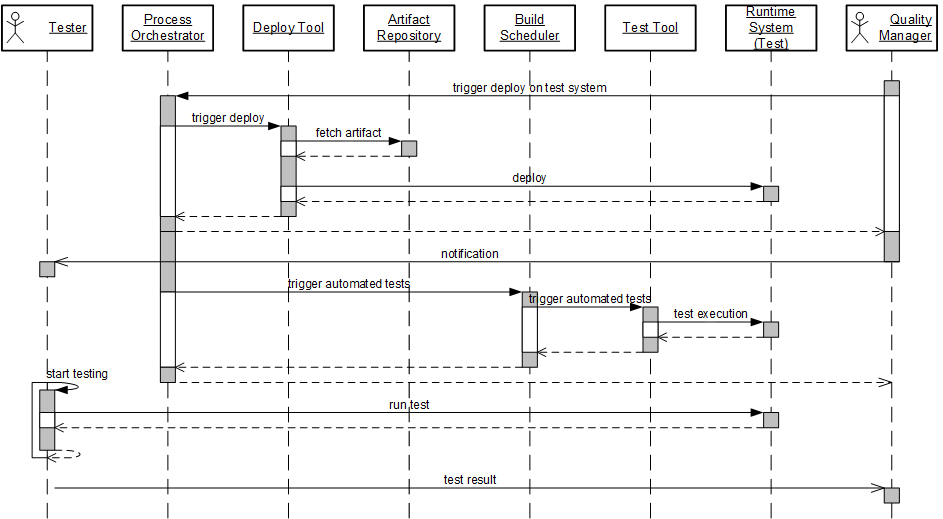
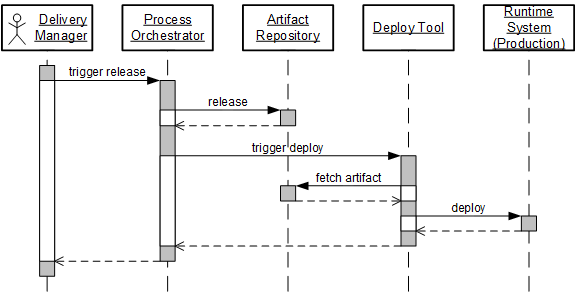

---

title: Continuous Integration (CI) Best Practices with SAP: Pipeline Suggestions
description: Part 2.2: Patterns for a CI/CD pipeline.
tags: [  tutorial>intermediate, tutorial:type/project ]

---

## Prerequisites

  - **Proficiency:** Intermediate
  - [CI/CD Practices](http://www.sap.com/developer/tutorials/ci-best-practices-ci-cd.html)
  
## Next Steps
 
  - [Back to the Navigator](http://www.sap.com/developer/tutorials/ci-best-practices-intro.html)
  
---

The practices described in the part [CI/CD Practices](http://www.sap.com/developer/tutorials/ci-best-practices-ci-cd.html) are a good starting point for planning your delivery pipeline. But how can they be translated into a concrete Continuous Delivery (CD) landscape? Which components are needed and how does the overall CD process look like?

### CI/CD pipeline

The recommended process flow starts with the change by a developer. This change is targeted to the main line in the source code management system. As outlined already in the [CI/CD Practices](http://www.sap.com/developer/tutorials/ci-best-practices-ci-cd.html) part, it is highly recommended to implement a voter build including automatic tests as a gate keeper. This helps you to discover issues before they reach the main line.

When the change has passed the voter build and tests, it is merged into the main line. As a precondition for a merge, applying a 4-eyes principle by doing code reviews is a common practice. Gerrit for, example collects, feedback of human code reviewers together with voter build and test results in one common place as a prerequisite for the merge.

As a next step after the merge, the CI build is triggered automatically. It builds the change and thus checks the build integrity of the main line. The build is self-testing, that is, it contains automatic tests. With this step the Continuous Integration (CI) pipeline has been passed. The change has been integrated into the main line successfully.

When running a Continuous Delivery scenario, the requirements are much higher. The single change does not only have to be successfully integrated into the main line. After the qualification of every single change the product must still have a quality such that it could be released and deployed to production. To reach this, the change has to be deployed to an acceptance test system that by any means should correspond to the productive runtime system. Automation of the tests executed there should be done as far as possible, but also manual test steps might be executed. The deployment to the test system can be triggered either manually or by time schedule, the execution should be automated.

A change that has passed the acceptance tests is ready to be deployed to the production system. This last step in a CD process is still assumed to be triggered manually. The reason is that in most cases, a human, for example a release manager or application operator should explicitly decide whether to release the version.

### CI/CD process actors

The actors in a typical CI/CD process implementing the process flow are basically the ones described below. The picture we are drawing is still a more or less high-level one. Actual implementations may deviate from it to a large extent by means of the selected components and their layout. Also, depending on the specific requirements of a concrete process, some of the components might not be required, but instead some others that are not described here.

The main actors are:

- The developer's workspace
    - The developer who creates changes.
    - He works in his local workspace: either locally with IDE and build tools and runtime physically installed on his PC, or on the cloud with the Web IDE). The changes done by the developer are pushed to the source code management system.
- The CI/CD infrastructure
    - The source code management system.
    - A process orchestration system controlling the pipeline and providing transparency.
    - A build scheduler managing build and test requests.
    - Build tooling on build nodes, being the work horses in the process.
    - Test tooling on test nodes for automated tests that do not require a runtime system.
    - Artifact repository as storage of build results.
    - Test tooling on test nodes for scenario and acceptance tests.
    - Deploy tool for installing the application to runtime systems.
    - Test runtime systems onto which the application is deployed for acceptance tests. These are explicitly parts of the CI/CD infrastructure.
- The Quality Manager responsible for the acceptance tests. He triggers the deployment to the test system.
- The productive runtime system.
- The delivery manager releasing the application and triggering the deployment to production.

### CI/CD process flow

#### Voter Build

We will now describe in detail, how the actors described above interact with each other. We start with the local development and the voter build.

The developer first fetches the latest version from the main line. Based on this, the developer starts working locally resulting in a change. This change is pushed into the central source code management system. There are different solutions to keep this change first outside the main line to enable a voter build to check the change before it is actually being merged.

In the case of Gerrit, for example, the change is pushed into a virtual branch from where it is fetched by the voter build. In a GitHub landscape, a pull request with a separate branch for the feature in work could be used. The voter build is triggered whenever a commit is pushed into the branch.

The initiator of the voter build is shown here as Process Orchestrator. Which tool is used in a dedicated case depends on the implementation of the CI landscape. In a Gerrit/Jenkins landscape, this role is rather taken by Gerrit. Feedback messages always are sent from the Process Orchestrator to the developer to give him transparency on the process status of the change.

What happens in detail in the build is that first the source code is fetched. In this rather high level picture it is left open how the build scheduler is implemented. In many cases, it might be a distributed system in which the scheduling unit is different from the processing unit. This distinction is omitted here. In any case, the build tool triggered takes over the job to transform the sources into binaries or whatever form of artifacts. We assume here that unit tests are done in this build step. As soon as the build has finished, the artifacts are uploaded by the build tool to an artifact repository to be consumed by the next automatic process step, the test.

The test tool fetches the artifacts just uploaded from the artifact repository and runs the tests. Whether the testing scope for voter builds only contains component tests or, for example, a virtual runtime is instantiated on the fly for some runtime tests, depends on the requirements of each development team on the voter build process.

Whether a separate artifact repository is necessary in this step, depends highly on the concrete setup of the landscape and the process. In its role as exchange medium of build results, the artifact repository stores the artifacts for the test process that runs after the build. This is required especially when the build and the test on the runtime system are decoupled by means of the underlying machines. Some build controllers like Jenkins which we mainly use in our examples offers an archiving mechanism that could be used instead of a separate artifact repository. It can also be omitted in the case builds and tests are tightly coupled and are running for example on the same machine: the runtime tests could be part of the build process.

In addition to the technical validation of the change by a voter build, a code review by another person applying a 4-eyes principle might be desired.

It is good practice to define both - the voter build result and the assessment of the code reviewer - as prerequisites that must be fulfilled in order to let the change pass to the next stage, the merge into the main line.

#### Merge and CI Build

If the voter build was successful and all other prerequisites - like 4-eye code review - are fulfilled, the change can be merged into the main line. This could be done automatically or manually triggered by the developer himself, by the reviewer or even by a responsible person like the team architect. This depends on the policies that are established within the team. In the diagram below, the developer himself initiates the merge.

As soon as the merge into the main line is done, the CI build is triggered automatically. Now, from a technical point of view, similar things like in the case of the voter build happen: the change is built and automatically tested in an extend that makes sense for the CI process.

Now we have reached the point from where on the sequel processes differ in the two scenarios continuous delivery and continuous deployment. In the latter case, which is not in the focus of this guide, the application would be automatically released and deployed to production after having passed a successful CI build. But we stay in the realm of continuous delivery (CD) scenario.

We assume that the successfully built artifact still requires additional acceptance tests, which may include both automatic and manual parts but which are in general too exhaustive to be executed within the CI build.

The upload to the artifact repository has similar as in the case of the voter build the sole purpose to temporarily store the artifact for being fetched by sequel process steps. 

#### Acceptance Test

The changes that have passed the CI build successfully are candidates for the acceptance tests. Usually not all candidates are tested since manual acceptance tests take time. Maybe they are scheduled on a daily basis, whereas changes entering the CI build may come in high frequency. One other thing is that the test system has to be kept stable during the test and must not be polluted by other changes coming in rather randomly during this time. Therefore we assume that the choice of a candidate and its deployment to the test system is a conscious action done by the quality manager or some other responsible person triggered by pressing a button. Alternatively, an automatism, which takes the last successfully CI built candidate and which is scheduled at a fixed time every day, could be implemented.

After pressing the button, the process orchestrator fetches the artifact in question from the artifact repository (or from where is it currently stored) and deploys it to the test system. Then, the person who is responsible to execute the test is notified and, if the acceptance test contains automatic parts, they may be started now as well.

The quality requirements that a software has to fulfill before it can be deployed to production are a topic that can fill a whole book. Going into the details will be far beyond the scope of this small best practices guide. For sure, the quality requirements and thus the scope of the tests to be executed to qualify a software to be ready-for-production depend on various things, like, for example, the size of the application, the technology, the complexity (is it a stand-alone application or does it run in a complex integration scenario), the consumer space (is the application open for any cloud user or is the access restricted to a small user group), and so on.

It therefore highly depends on the specific landscape which tests have to be executed and whether they can be automated or must be executed manually. Since one can think of different tests with completely different characteristics (functional tests versus performance tests), it could happen that more than one test system has to be used in parallel.

The following list gives you an idea of what could be part of a full-fledged qualification:

  - Automated integration tests
  - Manual scenario and acceptance tests
  - Performance and scalability tests
  - Globalization checks
  - Security scans and IP scans (these usually operate on sources and hence could be part of the CI build)
  - Translation
  - Artifact signing
  
A software version that has successfully passed the acceptance test is ready to be instantly deployed to the productive system. 

#### The Release

The release process controls how to bring an application version that was successfully qualified into production.

There are the two additional actors, the delivery manager and the production runtime system which come now into the game.

The delivery manager is responsible for the life cycle of the application and decides on the release of the software. He triggers the release through the process orchestrator. Two technical things happen: the artifact is put into the release state in the artifact repository and the installable archive is deployed to the productive system. We assume here that the deployment process on the production runtime system is automated as much as possible with the orchestrator as the unique entry point for any process triggering. The deploy tool which is called by the orchestrator downloads the artifact and deploys it to the production system. Success notifications are flowing back through the orchestrator to the application operator.

### Further Remarks

What was shown in this part is only a proposal. You may use it as a CI process prototype implementation that can give you an idea of the implementation principles and a starting point for you to continue. It will for sure not be sufficient to serve all the specific requirements of the team, the product, or the QA strategy.

The implementation of the components you choose may differ from this proposal. Also the granularity of the actors just described may differ in a concrete setup. The separation between process orchestrator and build scheduler is not sharp and the aspect of process orchestration might move freely between the two actors. From a technical point of view it could be even the same component.

What concerns the developer and the application operator, so-called DevOps approaches eliminate their separation as well: for cloud applications, it is meanwhile state of the art for development units to be end-to-end responsible for their application. This starts with analysis, design, and prototyping and ends with deploying and operating the running application on the cloud.

When discussing the concrete setup of CI process landscapes for specific SAP technologies, we will also see aspects to be covered that were not yet part of the rather prototype-like process landscape just described.

Finally, any CD process must fit to the individual needs of the development team and the technological boundary conditions. We will explain later in [part 4: CI/CD Process Setup](http://www.sap.com/developer/tutorials/ci-best-practices-intro.html) how these aspects influence the design of the CI process and how this leads to adaptations of the prototype landscape.

What was discussed here so far is the process for integration into the main line. But as we have learned in section "Everything is under version control", it is possible to apply the process for feature branches as well. All what was said before applies to this case except that the "release" is not implemented as deployment into the production system but as push of the bundled changes made to the feature branch into the main line.

## Next Steps
 
  - [Back to the Navigator](http://www.sap.com/developer/tutorials/ci-best-practices-intro.html)
  