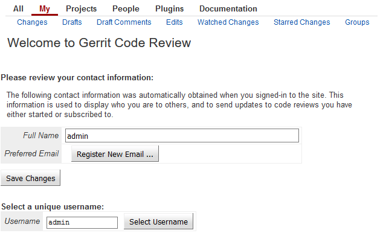
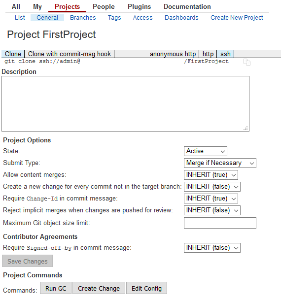
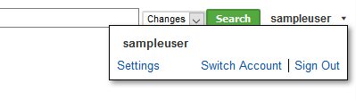

---

title: Continuous Integration (CI) Best Practices with SAP: Source Code Versioning System
description: Part 3.1: Setting up a Git/Gerrit Instance.
tags: [  tutorial>intermediate, tutorial:type/project ]

---

## Prerequisites

  - **Proficiency:** Intermediate

## Next Steps
 
  - [Build Scheduler](http://www.sap.com/developer/tutorials/ci-best-practices-build.html)
  - [Back to the Navigator](http://www.sap.com/developer/tutorials/ci-best-practices-intro.html)

---


> The purpose of this guide is to enable you to do first steps in designing your own CI processes using components like Gerrit, Jenkins and Nexus. These setup instructions for these components serve educational purposes only and are not meant as reference setup for productive purposes; for productive use, refer to the official component documentation.

What we offer in this part is not more than a basic recipe to set up a minimum installation including only those components on Linux that we consider as absolutely necessary to run a CI/CD process for development with SAP. However, the setup best suited to your concrete requirements cannot be part of this document because it highly depends on your concrete local situation, the network setup, the overall landscape into which the CI/CD process will be embedded, and so on. Therefore, we will restrict ourselves here to showing only the principles and the core elements.

If you are interested in other examples of CI/CD processes with a focus on specific needs and local conditions, just follow the references we provide to the official documentation for the described components. For each component, we provide hints to how the described setup could be improved. This concerns the professional and reliable operation, for example, further security activities and operational refinements.

Note: This document is restricted to the description of component installation on Linux. For installation on Windows, we refer to the installation documentation on the web.


### 1. Introduction

The interface between local (single developer) and collaborative (team) development is the source code management (SCM) tool together with a code review system. As already described in [CI/CD Practices](http://www.sap.com/developer/tutorials/ci-best-practices-ci-cd.html), the SCM tools plays a key role in the CI process. It only makes the development process reproducible. The SCM tool is also the interface to any sequel step, most importantly, the build step in the overall CI process.

There are many different possible choices for a SCM and review system. In this document, we show how to use Git as SCM tool and Gerrit as Git repository server and code review tool. These tools are very frequently used.

Git is a distributed SCM tool that has already a high adoption in the open source community and is more and more used in commercial environments. Gerrit is a repository server that can host and maintain Git repositories centrally. In a collaborative development scenario, changes are shared among developers through a Gerrit hosted central Git repository. In addition, Gerrit offers features for code review and voter builds which help to keep the main line (which is in Git usually called `master`) clean.

Git is part of most Linux distribution and can be seen as a standard tool on a developer's PC. Gerrit is offered as open source tool.

> [Gerrit Download](http://gerrit-releases.storage.googleapis.com/index.html)  
> [Gerrit Documentation](https://gerrit-review.googlesource.com/Documentation/index.html)  
> [Gerrit quick get started guide](https://gerrit-review.googlesource.com/Documentation/install-quick.html)

As part of the CI landscape, identify a Linux machine that will act as the host of the central Gerrit installation.

Our example is based on Gerrit release 2.13.3. In other releases, the front ends and the installation procedure may differ. In case of doubt, refer to the official component documentation.

### 2. Prerequisites

- Java JDK 1.7.0 or higher is installed on the machine.
- Git is installed on the machine

For installation of Git, see 

> [Git](https://git-scm.com/)  
> [Git Download](https://git-scm.com/download/linux)


### 3. Installation of Gerrit

#### Procedure

1. On the hosting machine, log on as user `root`.

2. Create an OS user `gerrit`:

    ```
    useradd -d /home/gerrit -m -s /bin/bash gerrit
    ```

3. Create a Gerrit installation directory. In this document, we call it `/data/gerrit`, but any other directory that follows the respective conventions will work as well. The file partition of the directory must be large enough to store all the Gerrit data, especially the database. The user `gerrit` must be the owner of the directory.
    
    ```
    mkdir -p /data/gerrit
    chown gerrit /data/gerrit/
    ```
   
4. Log on as `gerrit`.

5. Download the Gerrit installation (`gerrit.war` file) from the download site and save it to `/data/gerrit`.

6. Execute the following commands to do the installation and to prepare the Gerrit database:

    ```
    cd /data/gerrit
    java -jar gerrit.war init -d /data/gerrit
    java -jar gerrit.war reindex -d /data/gerrit
    ```

    During the installation procedure of the Gerrit instance, you may decide for the default settings in the questionnaire in a first run, but it is recommended to approve the installation of the `download-commands` plugin. It enables the display of the clone URL in the Gerrit frontend.
    
7. To get the server up quickly with the ability to administer it, open the Gerrit configuration file `/data/gerrit/etc/gerrit.config` and set the authentication method to:

    ```
    [auth]
            type = DEVELOPMENT_BECOME_ANY_ACCOUNT
    ```

    For security reasons, you should change this to an appropriate authentication method as soon as possible.
    
8. Start the Gerrit daemon.

    ```
    cd /data/gerrit/bin
    ./gerrit.sh start
    ```

9. The Gerrit application should now be accessible with a browser on port 8080.

10. In the Gerrit front end, click on **Become** and sign up. This first account has admin rights by default. Enter `admin` as **Full Name** and **Username**. Press **Save Changes** and **Select Username**.

    

    Since they require administrative rights, some of the following actions must be executed by this user. For day-by-day working with Gerrit, individual users with restricted permissions should be used.

11. In the same way, create a working user, which is used to perform Git operations like `pull` and `push`. We use `sampleuser` further in this example.

12. As first action, you can create a new project. Still logged in as `admin`, select **Projects > Create New Project**, enter `FirstProject` as **Project Name** and select **Create initial empty commit**. Press **Create Project**.

    

### 4. Working with a Git Repository Hosted by Gerrit

It is recommended to use the SSH protocol for working with Gerrit. We describe here an example how to create and configure an SSH key to work with Gerrit from a local computer. Your permanent setup may differ according to your security policies.


#### Prerequisites

Git is installed on your local computer. If the computer is running on Linux, install Git using the package installer of your distribution and refer to the Git documentation that was mentioned before. If your computer is running on Windows, the Git installation includes `Git Bash`, which shows a Linux-like user experience. 

> [Git Download Linux](https://git-scm.com/download/linux)  
> [Git Download Windows](https://git-scm.com/download/win)


#### Procedure

1. On your local computer, create an SSH key pair, if it does not yet exist. On Linux or on Git Bash on Windows, execute `ssh-keygen` and enter `<path to your home directory on your computer>/.ssh/id_rsa_sample` to create an SSH key pair for this demo purpose. In `<path to your home directory on your computer>/.ssh/` there is now a file pair `id_rsa_sample` / `id_rsa_sample.pub` available. This key pair is by default issued for your operating system user on your computer. Nevertheless, it can be used by your Gerrit user `sampleuser`.  

2. Log in to Gerrit with user `sampleuser`, click your name on the right upper corner and select **Settings > SSH Public Keys**.

    

3. Select **Add Key...** and paste the contents of the file `id_rsa_sample.pub` into the field.

    

    Git requests through SSH to Gerrit are now authorized provided the request uses the generated sample key. This is done in the next step.

4. Open `<path to your home directory>/.ssh/config`. Add The following lines:

    ```
    Host <Full qualified hostname of Gerrit>
         IdentityFile <path to your home directory>/.ssh/id_rsa_sample
    ```

    Check that the right key is taken by executing:

    ```
    ssh -p 29418 -v sampleuser@<Full qualified hostname of Gerrit>
    ```

    A frequent pitfall may be that the `HOME` environment variable is not correctly set.
   
5. You are now able to locally clone the Git repository of the project `FirstProject` by executing

    ```
    git clone <SSH-based URL of the FirstProject repository hosted on Gerrit>
    ```

6. Change into the directory of your cloned repository. For enabling Gerrit to apply the review process, a change ID must be generated into Git commits. This is done by a Git hook that can be downloaded directly from Gerrit by issuing:

    ```
    gitdir=$(git rev-parse --git-dir); scp -p -P 29418 sampleuser@<Full qualified hostname of Gerrit>:hooks/commit-msg ${gitdir}/hooks/
    ```
7. Do a change in the repository by creating a new file. Then add it and create a commit:

    ```
    touch test.txt
    git add .
    git commit -m "My first commit"
    git push origin master:refs/for/master
    ```

    You should be able to execute all the steps. If not, check the SSH key settings.


### 5. Further Enhancements

- So far, there is no authentication and authorization concept in place yet. You must not take Gerrit into productive usage in this state.

    - Choose an appropriate authentication method and implement it.

    - Choose an appropriate permission concept for Gerrit and implement it.

    For details, we refer to the official documentation.

- The default database installation used by Gerrit is H2. For larger installations, you can use MySQL or Postgres.

- Encapsulate the `gerrit.sh` into startup scripts in a way that Gerrit starts automatically with machine reboot.

- The `gerrit.war` package includes a standalone Jetty servlet container. Deployment on other JEE run times is possible.


> The content of this document is for guidance purposes only. No warranty or guarantees are provided.

## Next Steps
 
  - [Build Scheduler](http://www.sap.com/developer/tutorials/ci-best-practices-build.html)
  - [Back to the Navigator](http://www.sap.com/developer/tutorials/ci-best-practices-intro.html)
