---

title: Continuous Integration (CI) Best Practices with SAP: SAP HANA Extended Application Services, advanced model (XS advanced) on SAP HANA
description: Part 4.6: Configuring the CI system for a SAP HANA Extended Application Services, advanced model Application (XS advanced) on SAP HANA.
primary_tag: products>sap-cloud-platform
tags: [  tutorial>intermediate, tutorial:type/project ]

---

## Prerequisites  

  - **Proficiency:** Intermediate
  - [Source Code Versioning System](http://www.sap.com/developer/tutorials/ci-best-practices-scm.html)
  - [Build Scheduler](http://www.sap.com/developer/tutorials/ci-best-practices-build.html)
  - [Artifact Repository](http://www.sap.com/developer/tutorials/ci-best-practices-artifacts.html)
  - [Landscape Configuration](http://www.sap.com/developer/tutorials/ci-best-practices-landscape.html)
  - [Generic Project](http://www.sap.com/developer/tutorials/ci-best-practices-generic.html)

## Next Steps

  - [Back to the Navigator](http://www.sap.com/developer/tutorials/ci-best-practices-intro.html)

---

> This document is part of [Continuous Integration (CI) Best Practices with SAP](http://www.sap.com/developer/tutorials/ci-best-practices-intro.html). To ensure that all the examples work properly, follow the setup instructions for all the prerequisites components.


### 1. Introduction

The SAP HANA Developer Guide for SAP HANA XS Advanced Model is a good starting point for getting familiar with application development for SAP HANA Extended Application Services, advanced model (XS advanced). The `TinyWorld` tutorial is a good introduction to developing your first SAP HANA XS advanced application using different module types. For detailed information about installing an SAP HANA XS Advanced instance, see the official documentation listed below. The example we describe in this chapter is based on SAP HANA XS advanced 2.0 SPS00.

> [SAP HANA Platform](https://help.sap.com/viewer/p/SAP_HANA_PLATFORM)  
> [SAP HANA Developer Guide for SAP HANA XS Advanced Model](https://help.sap.com/viewer/4505d0bdaf4948449b7f7379d24d0f0d/2.0.01/en-US)  
> [SAP HANA Server Installation and Update Guide](https://help.sap.com/viewer/2c1988d620e04368aa4103bf26f17727/2.0.01/en-US)  
> [`TinyWorld` Tutorial](https://blogs.sap.com/2016/03/28/developing-with-xs-advanced-a-tinyworld-tutorial)

There are also comprehensive SAP HANA Academy videos on YouTube:

> [SAP HANA Academy - XS Advanced (YouTube)](https://www.youtube.com/playlist?list=PLkzo92owKnVwL3AWaWVbFVrfErKkMY02a)

SAP HANA XS advanced applications may consist of multiple modules and be implemented as a multi target application (MTA) project using SAP Web IDE for SAP HANA. For details developing MTAs, see the official guides listed above. You can find more information about concepts, design, and specification of MTAs in the MTA specification:

> [The Multi-Target Application Model: A guide to understand multi-target applications](https://www.sap.com/documents/2016/06/e2f618e4-757c-0010-82c7-eda71af511fa.html)

 SAP HANA XS advanced supports Git as a source control management system. SAP HANA SPS12 and later includes a Gerrit server that is integrated with the XS advanced runtime. Gerrit for XS advanced is an optional component of the XS advanced platform that can be installed via the software provisioning manager. SAP Web IDE for SAP HANA fully supports Git repositories. For the setup of Gerrit for XS advanced have a look at the following documentation:

> [Set up Gerrit for XS Advanced Application Development](https://help.sap.com/viewer/4505d0bdaf4948449b7f7379d24d0f0d/2.0.00/en-US%20Less/2d0c64a1a50045ab867605cf4b89def8.html)  

The CI process discussed in this chapter implements an MTA running on SAP HANA XS advanced. Source changes are pushed by the developer to a central Git repository (either the one that is integrated in SAP HANA or a custom Git repository). Inside the CI build, the MTA archive builder - a command-line tool shipped by SAP - triggers the technology-specific compilers for the dedicated modules contained in the MTA. Then, the MTA archive builder packages the artifacts from each module into one archive file with the extension `.mtar`. To download and learn more about the MTA archive builder refer to the following links:  

> [MTA Archive Builder Download](https://launchpad.support.sap.com/#/softwarecenter/template/products/%20_APP=00200682500000001943&_EVENT=DISPHIER&HEADER=Y&FUNCTIONBAR=N&EVENT=TREE&NE=NAVIGATE&ENR=73554900100800000903&V=MAINT&TA=ACTUAL&PAGE=SEARCH/MULTITRG%20APP%20ARCHIVE%20BUILDER)  
> [MTA Archive Builder Documentation](https://help.sap.com/viewer/58746c584026430a890170ac4d87d03b/HANA%202.0%20SPS%2002/en-US/ba7dd5a47b7a4858a652d15f9673c28d.html)

After the MTA archive builder has run, the build result is automatically deployed into an environment for automatic testing during the CI build. For the deployment, the XS advanced command-line client triggers the XS deploy service. The CI build may contain tests such as static code checks for the JavaScript sources (`ESLint`) or automated tests for the user interface.

After successful build and test, the `mtar` file is archived for further processing, for example deployment to a test system for manual acceptance tests. The deployment can be triggered either manually by someone such as a quality manager, or automatically via a defined schedule (for example, once a day in the morning). Testers then execute manual acceptance tests.

After successful testing, the delivery manager decides whether to release the tested version to the productive system and to store the archive as released version to an artifact repository (in our example, we use Nexus).

Figure 1 shows an overview of the entire process.

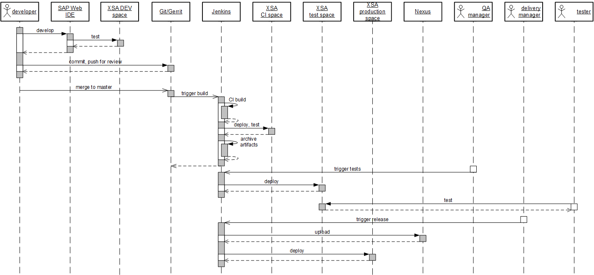

Figure 1: CI process for XS advanced development.

The CI process requires different runtime environments for deployment of the `mtar` file. Our example uses three: one for automatic testing during the CI build, one for acceptance testing, and one for productive usage. We use different XS advanced spaces to separate these environments, which may be hosted by a common XS advanced instance and organization, or may be hosted by different organizations, or even by different XS advanced instances. The options used depend on the concrete project setup and do not have an impact on the implementation of the CI process. A dedicated space and organization on an XS advanced system is required for hosting SAP Web IDE. We assume here that these are the space (usually: DEV) and the organization that are automatically created during the installation of the XS advanced system. Builds in SAP Web IDE, which are triggered by the user, require a DI Builder component to be deployed in a development space (DEV) residing in the same organization as SAP Web IDE. For more information about organization and space concepts, see the administration guide. Figure 2 shows the full setup.

> [Maintaining Organizations and Spaces in SAP HANA XS Advanced Model](https://help.sap.com/viewer/1c837b3899834ddcbae140cc3e7c7bdd/1.0.11/en-US/4b1ee6ac2a7c4e75bc84a70fc105530c.html)  

Public npm packages that are required during the build (such as Grunt) are fetched from the public repository, SAP scoped npm packages are taken from the SAP npm repository.

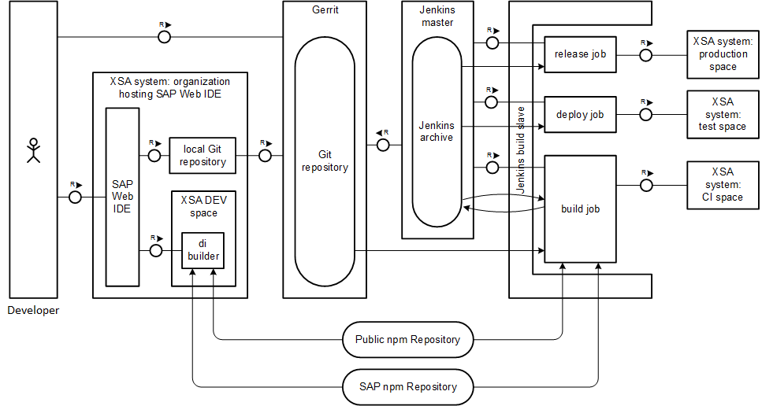

Figure 2: Component setup.

What is described in detail here is only an example that shows how to set up a continuous delivery process for SAP HANA XS advanced model applications. Your setup may differ significantly according to your needs.


### 2. Prerequisites

### 2.1 SAP HANA System and SAP Web IDE for HANA release

It is assumed that a SAP HANA XS advanced system with SAP HANA Runtime Tools is installed. We do not assume an already installed SAP Web IDE, since its installation is described below. But we assume throughout this guide that the version of SAP Web IDE is higher than:

- SPS12 patch 6 for SAP Web IDE 1

- SPS00 patch 2 for SAP Web IDE 2

The recommendation is to use SAP Web IDE for HANA to SAP Web IDE 2 SPS 01 or higher.  As of this release the SAP Web IDE for HANA is backwards compatible and can be used on all previous releases.

For older SAP Web IDE releases, some additional steps have to be done to ensure that fetching npm packages that are needed from the build work on SAP Web IDE and in the CI build. They are referred from within the text and are described in detail in paragraph 8.1.

SAP HANA XS advanced runtime consists of an on-premise version of the open-source Cloud Foundry platform, which has been extended by SAP to support integration with the SAP HANA database and OData, and which is compatible with the XS classic model. For information about installing the SAP HANA XS advanced system, see the official documentation:

> [SAP HANA Platform](https://help.sap.com/viewer/p/SAP_HANA_PLATFORM)  

Some additional configuration, described below, is required when installing SAP Web IDE - see chapter 4.1.

For our landscape we will use one SAP HANA XS advanced instance with several spaces for DEV, CI Build, Test and Prod as shown in figure 2.


### 2.2 (Optional) Installing of Gerrit in the SAP HANA XS Advanced Instance

Our example uses Gerrit as the repository server hosting the project sources. You may decide to use a Gerrit instance hosted by yourself as described in [Source Code Management](http://www.sap.com/developer/tutorials/ci-best-practices-scm.html), or you may use the Gerrit instance of the SAP HANA XS advanced server:

> [Set up Gerrit for XS Advanced Application Development](https://help.sap.com/viewer/4505d0bdaf4948449b7f7379d24d0f0d/2.0.00/en-US/2d0c64a1a50045ab867605cf4b89def8.html)  

The Gerrit installation for SAP HANA XS advanced is available for Linux `x86_64` and in combination with an SAP HANA XS advanced license only.

Gerrit within SAP HANA XS advanced has the advantage of using the built-in user authorization mechanism of SAP HANA XS advanced, and connecting Gerrit to a separate user authorization system (like LDAP).


### 3. Configuring the CI Infrastructure


### 3.1 Installing the SAP HANA XS Advanced Command-Line Client

Use the SAP HANA XS Advanced command-line client to connect to the SAP HANA XS advanced system and each space in order to automatically deploy the build result - an MTA archive (`.mtar`). For detailed information, see the following official documentation and SAP note.

> [SAP HANA Client Installation and Update Guide](https://help.sap.com/viewer/e7e79e15f5284474b965872bf0fa3d63/2.0.01/en-US/bc5b63411b584e9dbe13037c2322a234.html)  
> [Note 2242468 - Setting up SAP HANA extended application services, advanced model command-line client from SAP HANA Installation DVD](https://launchpad.support.sap.com/#/notes/0002242468)

#### Procedure

1. Enter SAP ONE Support Launchpad, navigate to **Software Downloads**, and search for `XS advanced client`. Download the zip archive of the newest release for the operating system that runs on your Jenkins slave machine.

    > [SAP ONE Support Launchpad](https://launchpad.support.sap.com/)

2. Log in to the Jenkins slave machine as `root`.

3. Unpack the zip archive containing the XS advanced client into a dedicated directory. Our example uses `/opt/sap/xs`:

    ```
    mkdir -p /opt/sap/xs
    cd /opt/sap/xs
    unzip <path of the zip archive>/XS_CLIENT<version number>.zip
    ```

4. Make sure that the `xs` is included in the `PATH` environment variable of the Jenkins slave process which is intended to build the project. We suggest that you add a line as shown below, into the `.bashrc` file of the user `jenkins` provided bash is the login shell:

    ```
    PATH=$PATH:/opt/sap/xs/bin
    ```

5. Verify that the client is properly installed by typing `xs help`.

6. To update the environment, you may have to restart the Jenkins slave process. For this, in the Jenkins front end, select **Manage Jenkins > Manage Nodes**, then choose your node and select **Disconnect**. Then, reconnect again by selecting **Launch slave agent**.


### 3.2 Installing Node.js on the Jenkins Slave Machine

The CI process requires the MTA project sources that are cloned from the Git repository to be packed using the MTA archive builder (see next chapter) to a deployable `mtar` archive. The MTA build requires Node.js and the included package manager npm on the Jenkins slave machine.

#### Procedure

1. Install Node.js on the Jenkins slave machine.

    > [Node.js Home Page](https://Nodejs.org/en/)   
    > [Node.js Downloads](https://nodejs.org/en/download/)

    You can install the `tar.gz` package on Linux in any directory. We recommend that you define a common installation directory on all your Jenkins slave machines.

    We tested the procedure with node versions 4 and 6 and npm versions 2 and 3. If possible, use the latest version.

2. Open the Jenkins front end, and go to **Manage Jenkins > Manage Plugins > Available**. Select **Node.js Plugin** and start the installation.

    Although the primary feature offered by this plugin (using JavaScript directly in job implementations) is not used in our example, it does handle multiple Node.js versions in parallel, allowing you to choose the appropriate one at the job level.

3. In the Jenkins front end, go to **Manage Jenkins > Configure System**. Scroll down to the **Node.js** section and select **Node.js installations**. Enter the path to the Node.js binaries and an appropriate name for this installation. The name is referred to by build job definitions.


### 3.3 Installing the MTA Archive Builder

As Java application, the MTA archive builder, which is available from the SAP ONE Support Launchpad, can be installed directly on the Jenkins slave machine, or it can be stored on a location which is accessible via HTTP, for example Nexus. The latter alternative has the advantage that upgrades are much easier to handle.

> [Multi-target Application Archive Builder](https://help.sap.com/viewer/58746c584026430a890170ac4d87d03b/HANA%202.0%20SPS%2002/en-US/ba7dd5a47b7a4858a652d15f9673c28d.html)  
> [SAP ONE Support Launchpad](https://launchpad.support.sap.com/)

#### Procedure

1. Enter SAP ONE Support Launchpad, navigate to **Software Downloads**, search for `MTA Archive Builder` and download the newest version.

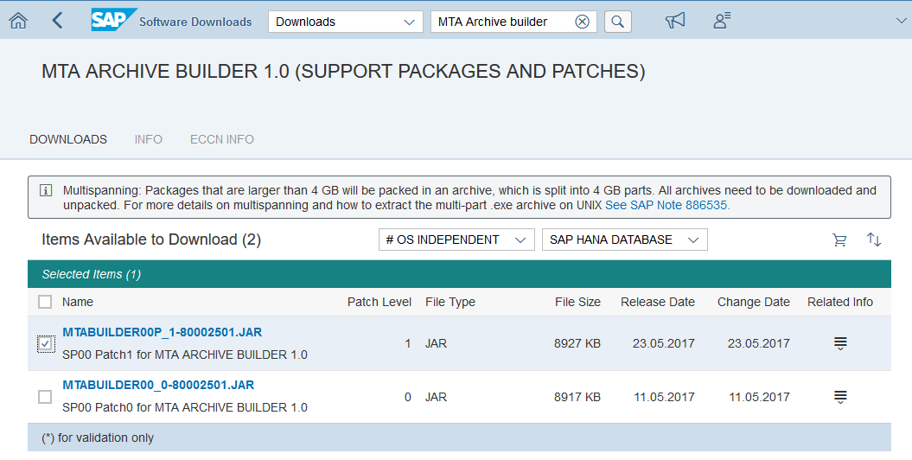

2. Upload the MTA archive builder JAR file to a location where it is accessible via HTTP, for example Nexus.


### 3.4 Setting Up and Preparing the npm Registry (old SAP Web IDE for HANA releases only)

> This step is only required for SAP Web IDE releases that are equal or lower than:

- SPS12 patch 6 for SAP Web IDE 1

- SPS00 patch 2 for SAP Web IDE 2

In that case, please see paragraph 8.1 "Setting Up and Preparing the npm Registry" for details.


### 4. Configuring the SAP HANA XS Advanced System

### 4.1 Installing and Configuring SAP Web IDE for SAP HANA

To develop SAP HANA XS advanced applications a SAP Web IDE for SAP HANA is used and installed.
For information about installing SAP Web IDE for SAP HANA, see the official documentation.

> [SAP Web IDE for SAP HANA - Installation and Upgrade Guide](https://help.sap.com/viewer/1a8e7ab05a2e4119b02b702f211422f5/2.0.00/en-US/c0563b9c5cbd4a78ab0e58c6bc97bedb.html)   
> [SAP Web IDE for SAP HANA Reference](https://help.sap.com/viewer/4505d0bdaf4948449b7f7379d24d0f0d/2.0.01/en-US/0a1c5d829a074a8a889acd2ace444042.html)  

The recommendation is to update your SAP Web IDE for HANA to SAP Web IDE 2 SPS 01 or higher.  As of this release the SAP Web IDE for HANA is backwards compatible and can be used on all previous releases.  
One step that we highlight here is configuring the npm cache. The MTA extension file for SAP Web IDE must be modified.


#### Procedure

1. Download the `SAP WEB IDE 2` software component as described in the SAP Web IDE installation and upgrade guide from the Software Downloads of the SAP ONE Support Launchpad. Enter `SAP WEB IDE 2`as search pattern.

    > [SAP ONE Support Launchpad, Software Downloads](https://launchpad.support.sap.com/#/softwarecenter)  

    Choose the appropriate Service Pack, download the zip file, and store it to a directory on a machine where the XS advanced command-line tool is installed.

2. Open the release notes of the chosen service pack. In the SAP ONE Support Launchpad, enter `SAP WEB IDE 2` into the search field and select `Knowledge Base` from the drop-down box. Open the central release note for your chosen service pack and follow the instructions there. Download the MTA extension file (extension `mtaext`) which is attached to the note.

    > [SAP ONE Support Launchpad](https://launchpad.support.sap.com/)

    Store the `mtaext` file to the same directory as the Web IDE zip file.

3. Connect to the SAP HANA XS advanced development system by setting the API endpoint to the SAP HANA XS advanced system for all sub-sequent `xs` commands.

    ```
    xs api https://<host>:3<instance-number>30
    ```

    You can verify the endpoint by entering `xs api`.

4. Log in to your SAP HANA XS advanced system:

    ```
    xs login -o <your organization> -s <your space>
    ```

    You are asked for a username and password. Log in as your administrator user (our setup uses `XSA_ADMIN`) which was created during the installation of the XS advanced instance. Enter the organization and space names that you specified during installation and to which the administrative applications have been deployed. Our setup assumes `myorg` as the name of the organization and `SAP` as the name of the space.

5. Change to the directory where the SAP Web IDE zip file and the `mtaext` file are located. Open the `mtaext` file and add the following lines:

    ```
    modules:
    (...)
      - name: di-local-npm-registry
        properties:
           UPSTREAM_LINK: "https://registry.npmjs.org/"
           SAPUPSTREAM_LINK: "https://npm.sap.com/"
    (...)
    ```

    > [SAP Web IDE for SAP HANA - Installation and Upgrade Guide](https://help.sap.com/viewer/1a8e7ab05a2e4119b02b702f211422f5/2.0.00/en-US/c0563b9c5cbd4a78ab0e58c6bc97bedb.html)

    Save the file.

6. Deploy SAP Web IDE, accompanied by the modified `mtaext` file. If SAP Web IDE is already installed, you must uninstall it first.

    ```
    xs install XSACSAPWEBIDE<version number>.ZIP -e sap-xsac-devx-<version number>.mtaext -o ALLOW_SC_SAME_VERSION
    ```


### 4.2 Configuring the user management in SAP HANA XS Advanced

Some configuration steps are required to enable developers and the CI process to work with SAP HANA XS advanced. This procedure creates all the needed spaces, grants permissions, and enables the DI builder component to be triggered from SAP Web IDE.

#### Procedure

##### Connecting to the XS advanced space via the command-line client

1. Log in to a machine where the XS advanced command-line tool is installed. This could be the Jenkins slave machine or any other host.

2. Log in to the XS advanced system using the client as described in paragraph 4.1.

3. Get the URL of the XS advanced administration front end by executing the following command:

    ```
    xs app --urls xsa-admin
    ```

    This URL administers access to the XS advanced system using the frontend. All actions can also be performed using the `xs` command from the command line.


##### Creating users

Use the administrator user only for administrative purposes. In our example, we set up two different users:

- One user is a developer who is creating an XS advanced application. This user needs permissions to work with SAP Web IDE and to deploy applications into a space in the XS advanced system for manual tests during development. The name of the user is `SAMPLEUSER`.
- One machine user for the CI process automatically deploys the application to the XS advanced system. The name of the user is `JENKINS`.

1. Enter XS Advanced Administration and Monitoring Tools by using a browser to the URL obtained above. Log in as user `XSA_ADMIN`.

    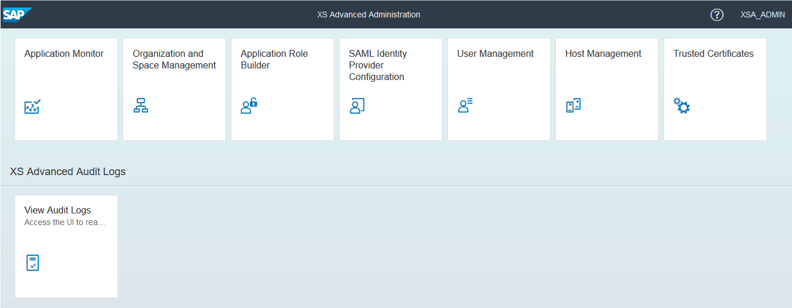

2. Select **User Management**, then **New**, and enter `SAMPLEUSER` as the user name. Also enter an email address and an initial password, then select **Create**.

    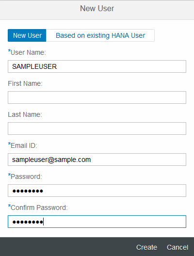

3. Select the newly created user, and on its detail data screen, select **Role Collections > Add**. Select the `XS_CONTROLLER_USER` role collection and press **OK**.

    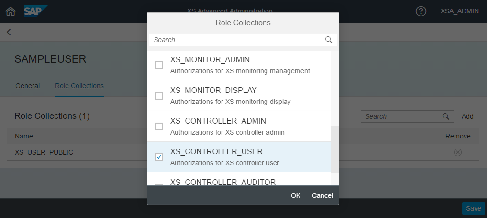

4. Save.

5. Repeat steps 2 - 4 to set up a user named `JENKINS`.

The passwords you set for the users are initial ones; when these users initially log in, a password change is requested. We recommend that users log in immediately, for example, to the XS Advanced Administration and Monitoring Tools.

##### Creating a Role Collection for SAP Web IDE access

The user `SAMPLEUSER` does not yet have permission for accessing SAP Web IDE on the XS advanced system yet. We create a role collection, which then can be assigned to the user. We also need an administrative role for SAP Web IDE that is assigned to `XSA_ADMIN`.

> [Enabling Access to the SAP Web IDE Administration and Development Tools](https://help.sap.com/viewer/1a8e7ab05a2e4119b02b702f211422f5/2.0.01/en-US/731c647f126d4850a176ff4aa2a35381.html)

1. From your browser, go to XS Advanced Administration and Monitoring Tools. Log in as user `XSA_ADMIN`.

2. Select the tile **Application Role Builder**. From the toolbar on the left, select **Role Collection**.

    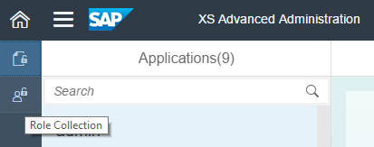

3. Press the `+` sign at the bottom of the left pane to create a new role collection.

    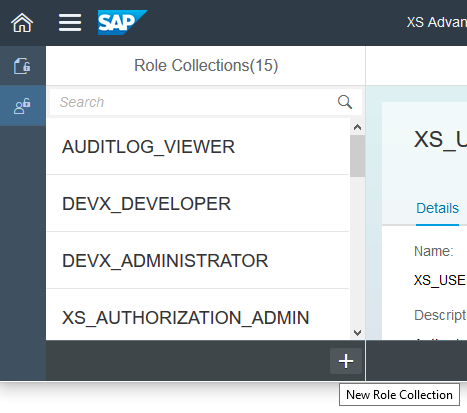

4. Enter `WebIDE_DEVELOPER` as **Name** (you may provide any name of your choice) to create the new role collection.

5. On the detail page of the new role collection, select **Roles > Add Application Role**. Enter `webide!i1` as **Application Name**, `WebIDE_Developer` as **Template Name** and `WebIDE_Developer` as **Application Role**.

    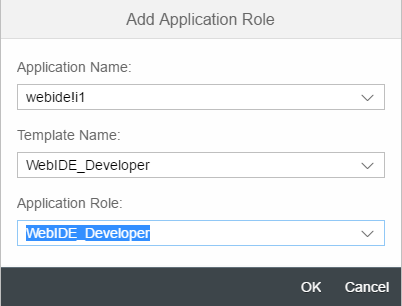

    Press **OK** and **Save**.

    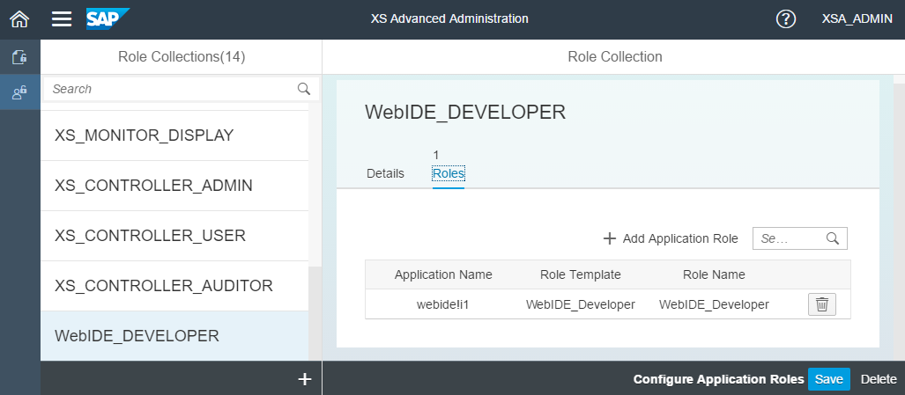

6. Repeat steps 3 - 5, applying the following data:

    Field                           | Value
    :------------------------------ | :--------------------------
    Role Collection Name            | `WebIDE_ADMINISTRATOR`
    Application Name                | `webide!i1`
    Template Name                   | `WebIDE_Administrator`
    Role Name                       | `WebIDE_Administrator`

7. Return to the home screen of **Administration and Monitoring Tools** and select the tile **User Management**. Select the developer user (`SAMPLEUSER` in our example), open its details, select **Role Collections > Add**, and choose the `WebIDE_DEVELOPER` role collection. Press **OK** and **Save**.

8. Repeat step 7 for user `XSA_ADMIN` and role collection `WebIDE_Administrator`.


### 4.3 Creating Organizations and Spaces

The design of organizations and spaces depends on the setup of your XS advanced system landscape and the processes that you are planning to implement. An organization is an entity in the XS advanced system that can be shared by a couple of users by means of resources. Any organization has at least one space. Applications are always deployed into a dedicated space. The setup of spaces that we use for this example is as follows:

- A space named `DEV`, which is used by the developer to manually deploy the application for ad hoc tests. This space is located in the default organization `myorg`, in which an SAP Web IDE is also deployed. You can choose any organization for your space; however, SAP Web IDE must also be deployed into a space of the same organization.

- An organization named `CI`. This organization hosts the spaces into which the machine user of the CI process does its deployments. These spaces are:

    - `CI_BUILD`: Used for automated runtime tests during a CI build.

    - `TEST`: Used for manual acceptance tests of release candidates.

    - `PROD`: Space hosting the application in productive usage.

In our scenario, we assume that all organizations and spaces are located on the same XS advanced system. This may differ in your setup; eventually, you must log in to different XS advanced systems to create the organizations and spaces.

1. Enter XS Advanced Administration and Monitoring Tools in a browser. Log in as user `XSA_ADMIN`.

2. To create a new organization, select **Organization and Space Management** and press the `+` sign at the bottom of the left pane.

3. Enter `CI` as the organization name, and select **OK**.

4. On the `CI` organization detail page, select **Spaces > Create Space** and enter `CI_BUILD` as the space name.

    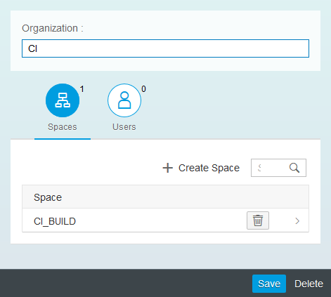

5. Select the new `CI_BUILD` space to open its detail page. Select **Users > Add User**, choose `JENKINS` and grant the **Developer** role.

    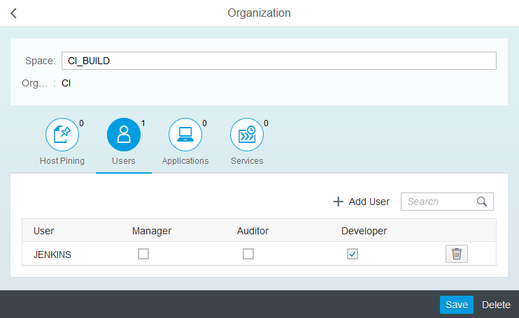

6. Save.

7. Repeat steps 4 - 6 to create spaces `TEST` and `PROD` belonging to organization `CI`.

    

8. Enter organization `myorg` and create a new space named `DEV`.

9. In the new space `DEV`, add `SAMPLEUSER` and `XSA_ADMIN` both with role **Developer**.  

    

10. Save.


### 4.4 Uploading Git Certificate

SAP Web IDE for HANA connects via HTTPS to a Git repository server, in our example, Gerrit. To enable a trusted connection to Gerrit, you must upload its server certificate to the XS advanced system.

1. Open a browser and establish an HTTPS connection to your Gerrit server.

2. Using your browser, export the Gerrit server certificate into a local file. The steps for doing this vary, according to the browser you are using. Search on the Web for your browser's specific details.

3. In your browser, enter XS Advanced Administration and Monitoring Tools. Log in as user `XSA_ADMIN`.

4. Select the tile **Application Monitor**. In your browser, open the URL of the application `di-cert-admin.ui`.

    

5. Select **Upload** and in the dialog, enter the certificate file of the Gerrit server, which you just have downloaded, and click **Upload**.

    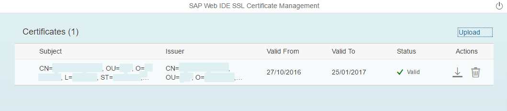

Now the new developer user is able to use the integration of SAP Web IDE with the Gerrit server.


### 4.5 Space Enablement

When a developer user wants to build the application which he is currently developing in SAP Web IDE, a builder application (its technical name is `di-builder`) must be deployed in that space to which the user is logged in. Use the Space Enablement application, which is part of the SAP Web IDE installation on the XS advanced system, to deploy the builder application.

1. Enter XS Advanced Administration and Monitoring Tools in a browser. Log in as user `XSA_ADMIN`.

2. Select the tile **Application Monitor**. In your browser, open the URL of the application `di-space-enablement-ui`.

    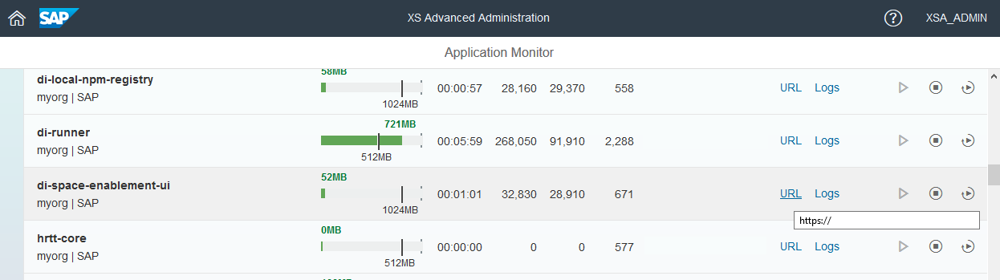

3. Select **Enable** to enable the `DEV` space for SAP Web IDE usage. This is the step that requires `XSA_ADMIN` to get developer rights in space `DEV`.

    

    The execution takes a couple of seconds during which the builder application is deployed into the space `DEV`.


### 5. Creating the Tiny World XS Advanced Application

In our example, we use the Tiny World tutorial to show something a bit more concrete than a simple Hello-World example. For further details, see the SAP HANA XS advanced Developer Guide:

> [SAP HANA Developer Guide for SAP HANA XS Advanced Model](https://help.sap.com/viewer/4505d0bdaf4948449b7f7379d24d0f0d/2.0.00/en-US/1547c14105be409ebfc3a9e9634a7188.html)  
> [Tiny World Tutorial](https://blogs.sap.com/2016/03/28/developing-with-xs-advanced-a-tinyworld-tutorial)


#### Procedure

##### Starting SAP Web IDE for SAP HANA

1. You need to know the URL of SAP Web IDE for SAP HANA to work with. On a shell where the `xs` command is installed, enter:

    ```
    xs login -a http://<server>:3<instance-number>30
    xs app --urls webide
    ```

2. In your browser (we recommend using either Chrome or Firefox to work with SAP Web IDE), open the retrieved URL and log in as `SAMPLEUSER`. If are you logging in for the first time, you are prompted to change your initial password.


##### Cloning the Git repository and initial setup of the `tinyworld` project

1. In Gerrit, create a project named `tinyworld` with a `master` branch as described in [Generic Project](http://www.sap.com/developer/tutorials/ci-best-practices-generic.html).

2. In SAP Web IDE, mark the workspace folder and select **Git > Clone Repository**.

3. Enter the URL and credentials of your Git/Gerrit repository, and activate **Add configuration for Gerrit Change-ID**.

    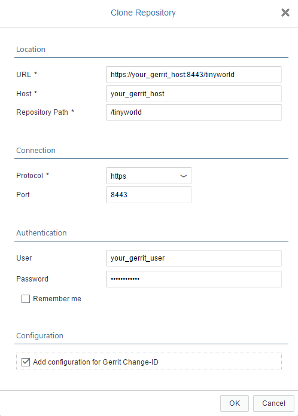

    Select **OK** to clone the repository into SAP Web IDE.

4. SAP Web IDE automatically converts the cloned empty project into an MTA project by creating an `mta.yaml` file, which contains the ID and the version data of the project.

5. When you follow the Tiny World example to the end of part 3, an SAP HANA database module, a Node.js module, and an HTML5 module are created. We will perform these steps here, for demonstration purposes. Alternatively, you may add whatever content you like to your project.

6. Save all your changes in SAP Web IDE.

7. Check the `package.json` files of the Node.js and HTML5 module: the dependencies to SAP modules must be scoped, that means, their names must follow the scheme `@sap/*`, for example `@sap/xsjs`. If they follow the old naming convention like `sap-xsjs`, rename them accordingly. Check that the version of the scoped packages have at least the following versions:

    ```
    "@sap/xsenv": "1.2.6"
    "@sap/xsjs": "1.14.1"
    "@sap/xsjs-test": "2.0.2"
    "@sap/approuter": "2.7.1"
    ```

    > For old SAP Web IDE releases, the old naming convention, for example `sap-xsjs`, must be applied.

8. Define a space for building and deploying module applications. In the project navigation pane, mark your `tinyworld` project, open **Project Settings > Space**, and select the `DEV` space. Save.

    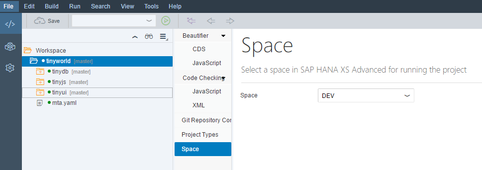

    Selecting **Build** on the project node performs a build of your project's modules inside the selected space. When the build has finished, you can run the application from SAP Web IDE.

9. Open the Git Pane, select `Stage All`, enter a commit description, and choose `Commit and Push`. Select `origin/master` from the list.

    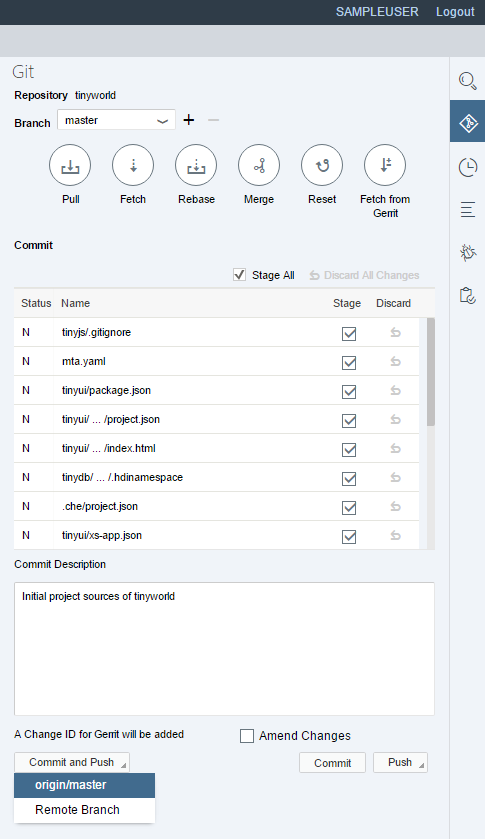

    This step pushes your changes to Gerrit for review.


### 6. Configuring the CI Pipeline

### 6.1 Creating a Jenkins CI Build Job

We create the job for the CI build, which is triggered on each change that is merged into the `master` branch. The configuration and credentials that are used in this section are based on the examples in [Build Scheduler](http://www.sap.com/developer/tutorials/ci-best-practices-build.html). The Jenkins CI build job fetches the sources from Git and starts the build of the MTA project by calling the MTA archive builder; the build result is an `mtar` file. The deployment of the `mtar` file to an XS advanced space requires connection details like host, port, space, organization, and login credentials.


#### Procedure

1.  Open Jenkins, select **New Item** to create a new job for the CI build, and enter an appropriate item name; the example uses `CI_TinyWorld_master_build`. Select **Freestyle Project** and press **OK**.

2.  Select **This build is parametrized** and enter the following string parameters:

    Name                   | Default Value
    :----------------------| :------------------------------------------------------
    `XSA_API_ENDPOINT`     | XS advanced API endpoint URL, example: `https://<hostname>:3<instance number>30`
    `ORGANIZATION`         | Organization of the application. In our example: `CI`
    `CI_SPACE`             | CI build stage space of the application. In our example: `CI_BUILD`
    `TEST_SPACE`           | Test space of the application. In our example: `TEST`
    `PROD_SPACE`           | Productive space of the application. In our example: `PROD`
    `NEXUS_REPOSITORY`     | URL of the Nexus release repository to upload the artifact.

3. Continue the configuration and enter the following:

    Field                                           | Value
    :---------------------------------------------- | :-------------------------------------------------------------------------
    Restrict where this project can be run          | `selected`
    Label Expression                                | The label that you have assigned to the slave. In our example: `builds`
    Source Code Management > Git                    | `selected`
    Repository URL                                  | The SSH-based URL of your repository
    Credentials                                     | `jenkins`
    Branches to build; Branch Specifier             | `master`
    Build Triggers                                  |
    Poll SCM                                        | `selected`
    Schedule                                        | Enter a pull frequency. For immediate results, two minutes is an appropriate value
    Build Environment                               |
    Delete workspace before build starts            | `selected`
    Inject passwords to the build as environment    | `selected`
    Global passwords                                | `selected`
    Mask password parameters                        | `selected`
    Provide Node & npm bin/folder to PATH           | `selected`
    Installation                                    | The node installation name as defined above

4. In the **Build** section, select **Add build step > Execute shell**. In the **Command** field, enter the following code:

    > For SAP Web IDE releases equal or lower than SAP Web IDE 1 SPS12 patch 6 or SAP Web IDE 2 SPS00 patch 2, use the script implementation from paragraph 8.2 instead.

    ```
    # install MTA archive builder
    mkdir tmp
    cd tmp
    wget --output-document=mta.jar '<URL from where to download the MTA archive builder>'
    cd ..

    # create local npmrc file
    cat <<EOF > .npmrc
    registry=https://registry.npmjs.org/
    @sap:registry=https://npm.sap.com/
    EOF

    # link to local .npmrc file from submodules
    modulePaths=`awk -F: '$1 ~ /path/ { gsub(/\s/,"", $2)
    print $2 }' mta.yaml`
    for path in $modulePaths; do
      ln -sft $path ../.npmrc
    done

    # extract artifact name
    mtaName=`awk -F: '$1 ~ /^ID/ { gsub(/\s/,"", $2)
    	print $2 }' mta.yaml`

    # execute MTA build
    java -jar tmp/mta.jar --mtar ${mtaName}.mtar --build-target=XSA build

    # deploy to CI system
    xs api ${XSA_API_ENDPOINT}
    xs login -u ${HANA_XSA_USER} -p ${HANA_XSA_PASSWORD} -o ${ORGANIZATION} -s ${CI_SPACE}
    xs deploy -f ${mtaName}.mtar

    # add automatic tests here
    #

    # clean up
    xs undeploy -f ${mtaName}
    xs services | awk '$1 ~ /^.+$/ {
        if (found == 1)
          system( "xs delete-service -f "$1 ) }
      /-----/ {found = 1}'
    xs logout
    ```

    An MTA project can consist of several modules applying different technologies (Java, node.js, HDI, html5). The MTA archive builder triggers a build of each module using the builder that is configured in `mta.yaml`. Each module type is assigned a default builder that is used if one is not specified explicitly (for example `npm` is the default builder for `node.js` modules). All module build results are packed into one `mtar` file. In the shell script above, the name of the `mtar` file is generated from the project ID that is provided in the `mta.yaml` file. The packed archive also contains a deployment descriptor file named `mtad.yaml`, which is generated by the MTA archive builder from the data provided by `mta.yaml`.

    After successful deployment, the application can be tested automatically. We leave this step to be performed according to your needs.

    At the end, we do some clean up that creates a defined state in the XS advanced space for the CI builds that follow after the current one: we undeploy the application and remove any running service. The HDI service, which is instantiated automatically during application deployment might contain some test data that is created by automated tests; we do not want this data to be present during other CI build runs.

5. Archive the artifact and the `mta.yaml` (which contains the project metadata) to be available for subsequent Jenkins jobs. Select **Add post-build action > Archive the artifacts** and enter `*.mtar, mta.yaml` into the **Files to archive** field.

6. In the **Post-build Actions** section, select **Add post-build action > Build other projects (manual step)** and enter `CI_TinyWorld_master_testDeploy` as **Projects to build**. You can safely ignore the warning that the job entered does not yet exist, as we will be creating it.

7. Select **Add Parameters > Current build Parameters**.

8. Save.

9. Define the credentials for accessing the SAP HANA XS advanced system as global passwords. In Jenkins, go to **Manage Jenkins > Configure System > Global Passwords**. Select **Add**, set the **Name** to `HANA_XSA_USER` and the **Password** to the user name (in our example, `JENKINS`). Select **Add** again and set the **Name** to `HANA_XSA_PASSWORD` and the **Password** to the password for `HANA_XSA_USER`. Save your changes.

10. In Jenkins, navigate to the job and trigger it manually by selecting **Build with Parameters > Build**. Leave the default values of the parameters. Monitor the build and deployment of the created `mtar` file to the XS advanced instance.


### 6.2 Creating a Jenkins Job for Deployment to the Test System

The next job of the CI build jobs is triggered manually: the quality manager or test coordinator must provide a test space with one candidate that has passed the CI build job successfully. The space is used by manual testers for acceptance tests.

From a technical point of view, this job imports the `mtar` file that was archived in the CI build job to the `TEST` space.


#### Procedure

1. Open Jenkins and select **New Item > Freestyle Job**. Enter `CI_TinyWorld_master_testDeploy`.

2. The XS advanced system parameters are taken from the CI build job. Select **This build is parametrized**, enter the following string parameters and leave their values empty:

    Name                   | Default Value
    :--------------------- | :------------------------------------------------------
    `XSA_API_ENDPOINT`     | `<empty>`
    `ORGANIZATION`         | `<empty>`
    `CI_SPACE`             | `<empty>`
    `TEST_SPACE`           | `<empty>`
    `PROD_SPACE`           | `<empty>`
    `NEXUS_REPOSITORY`     | `<empty>`

3. For the other configuration options, enter the following:

    Field                                        | Value
    :------------------------------------------- | :-------------------------------------------------------------------------
    Restrict where this project can be run       | `selected`
    Label Expression                             | The label you have assigned to the slave. In our example: `builds`
    Source Code Management > None                | `selected`
    Build Environment                            |
    Delete workspace before build starts         | `selected`
    Inject passwords to the build as environment | `selected`
    Global passwords                             | `selected`
    Mask password parameters                     | `selected`

4. In the **Build** section, select **Add build step > Copy artifacts from other projects** and enter:

    Field                                  | Value
    :------------------------------------- | :-------------------------------------------------------------------------
    Project name                           | `CI_TinyWorld_master_build`
    Which build                            | `Upstream build that triggered this job`
    Artifacts to copy                      | `*.mtar, mta.yaml`

    This step restores the artifact that was created in the build job into the workspace directory of this job.

5. Select **Add build step > Execute shell** and enter the following script implementation:

    ```
    # deploy to TEST space
    xs api ${XSA_API_ENDPOINT}
    xs login -u ${HANA_XSA_USER} -p ${HANA_XSA_PASSWORD} -o ${ORGANIZATION} -s ${TEST_SPACE}
    xs deploy -f *.mtar
    xs logout
    ```

6. In the **Post-build Actions** section, select **Add post-build action > Build other projects (manual step)** and enter `CI_TinyWorld_master_release` as **Downstream Project Names**. You can safely ignore the warning that the job entered does not yet exist, as we will be creating it in the next step.

7. Select **Add Parameters > Current build Parameters**.

8. Save.


### 6.3 Creating a Jenkins Release Job

The last job in the pipeline implements the release of a version that has successfully passed the acceptance test. Technically, two things happen: the artifact is uploaded to Nexus into a release repository, and it is deployed to the productive space.

We will use a copy of the test deploy job, adapting the target pointing to the productive space, and adding a step for the upload to Nexus.


#### Procedure

1. Open Jenkins and select **New Item**. Enter `CI_TinyWorld_master_release`. Select **Copy existing item** and enter `CI_TinyWorld_master_testDeploy` as the copy template.

2. In the **Build** section, enter the following code into the **Command** field:

    ```
    # upload to Nexus
    awk -F: '\
    BEGIN {
        print "<project xsi:schemaLocation=\"http://maven.apache.org/POM/4.0.0 http://maven.apache.org/xsd/maven-4.0.0.xsd\">"
        print "<modelVersion>4.0.0</modelVersion>"}
    $1 ~ /^version/ { gsub(/\s/,"", $2)
        printf "<version>%s</version>\n", $2}
    $1 ~ /^ID/ { gsub(/\s/,"", $2)
        idx = match($2, /\.[^\.]*$/)
        printf "<groupId>%s</groupId>\n", substr($2,0,idx-1)
        printf "<artifactId>%s</artifactId>\n", substr($2,idx+1)}
    END {print "</project>\n"}
    ' mta.yaml > pom.xml

    mtaName=`awk -F: '$1 ~ /^ID/ { gsub(/\s/,"", $2)
    	print $2 }' mta.yaml`

    mvn deploy:deploy-file -Durl=${NEXUS_REPOSITORY} \
        -Dfile=${mtaName}.mtar -DrepositoryId=nexusCIProcess -Dpackaging=mtar -DpomFile=pom.xml

    # deploy to PROD space
    xs api ${XSA_API_ENDPOINT}
    xs login -u ${HANA_XSA_USER} -p ${HANA_XSA_PASSWORD} -o ${ORGANIZATION} -s ${PROD_SPACE}
    xs deploy -f *.mtar
    xs logout
    ```

    Before deploying the application into the `PROD` space, the script uploads the `mtar` file to Nexus as the released version. We have used Maven as the tool for the upload, since it provides an easy way to do this, as well as performing error handling. But a `pom.xml` is required that contains the co-ordinates of the artifact. The script extracts all data required to be available in the `pom.xml` automatically from the `mta.yaml` file.

3. Remove any post-build action.

4. Save.


### 6.4 Adding a Pipeline View

Now that we have created the CI Jenkins jobs, next we will add a convenient overview of the pipeline in Jenkins.


#### Procedure

1. Open Jenkins and click the view tab with the **+** sign.

2. Enter `TinyWorld_pipeline` and select `Build Pipeline View`.

3. Select `CI_TinyWorld_master_build` for **Select Initial Job** and specify the **No of Displayed Builds**, for example `5`.

4. Press **OK**.


### 6.5 Creating a Jenkins Voter Build Job

The voter build job is executed immediately after you push a commit to Gerrit for review.


#### Procedure

1. Open Jenkins and select **New Item**. Enter `VO_TinyWorld_master_build` as **Item name**, select **Copy existing item**, and enter `CI_TinyWorld_master_build` as **Copy from**.

2. Unselect **This build is parametrized**.

3. In the **Source Code Management** section, select **Advanced...** and enter `refs/changes/*:refs/changes/*`as **Ref spec**. Enter `$GERRIT_REFSPEC` as **Branches to build**.

4. In the **Build Trigger** section, unselect **Poll SCM** and select **Gerrit Event** instead.

5. In the **Gerrit Trigger** section:

    - Choose your Gerrit server.

    - Open **Trigger on > Add** and select `Patchset Created`

    - In the **Dynamic Trigger Configuration Section**, enter `tinyworld` as **Gerrit Project** and `master` as branch.

6. In the **Build** section, enter the following code into the **Command** field:

    ```
    # install MTA archive builder
    mkdir tmp
    cd tmp
    wget --output-document=mta.jar '<URL from where to download the MTA archive builder>'
    cd ..

    # create local npmrc file
    cat <<EOF > .npmrc
    registry=https://registry.npmjs.org/
    @sap:registry=https://npm.sap.com/
    EOF

    # link to local .npmrc file from submodules
    modulePaths=`awk -F: '$1 ~ /path/ { gsub(/\s/,"", $2)
    print $2 }' mta.yaml`
    for path in $modulePaths; do
      ln -sft $path ../.npmrc
    done

    # extract artifact name
    mtaName=`awk -F: '$1 ~ /^ID/ { gsub(/\s/,"", $2)
	    print $2 }' mta.yaml`

    # execute MTA build
    java -jar tmp/mta.jar --mtar ${mtaName}.mtar --build-target=XSA build
    ```

7. Remove any post build action.

8. Save.


### 6.6 Round Trip Through the Process

All Jenkins jobs are now ready to do a full round-trip through the CI process, including a voter build that is done before a commit reaches the master branch.

1. Enter the `tinyworld` project in SAP Web IDE. Perform a small change (for example, increase the version number of your component in `mta.yaml`). Add the change to Git, commit it, and push it to Gerrit.

2. After few seconds, the voter build in Jenkins starts. Monitor the build result in Jenkins and Gerrit.

    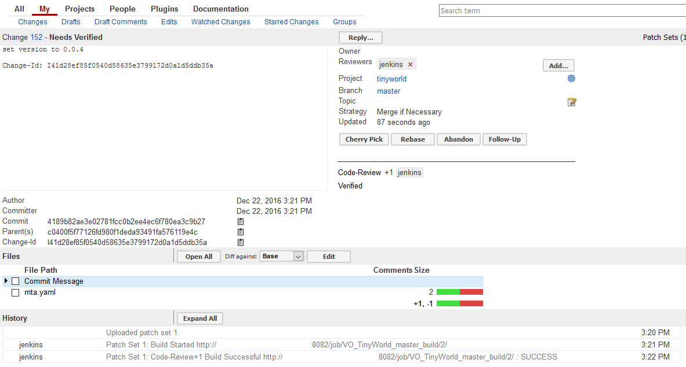

3. In Gerrit, review and submit the change. It is now in the merged status.

4. Monitor the CI build in the pipeline view in Jenkins. It starts within 2 minutes of submitting the change.

    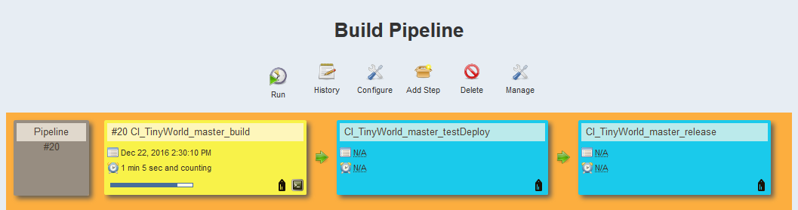

5. When the CI build job has finished successfully, start the test deploy job. Verify in the log that the `mtar` file is deployed to the `TEST` space.

6. Under the assumption that the manual tester has finished the testing efforts, release the `mtar` file and deploy it to the `PROD` space. Trigger the release job. Use the Jenkins log to monitor how the archive is uploaded to Nexus and deployed. Keep in mind that a released version can be deployed to a Nexus release repository only once. You must always increment the version number of the application, otherwise the Nexus upload fails.

    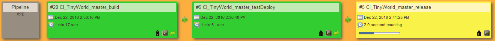

    Check in Nexus that the `mtar` file was correctly uploaded.

    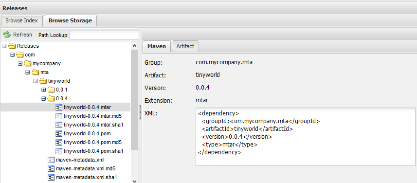


### 7. Enhancements

### 7.1 Enhancing the Module Builds: Establishing Grunt Builders

Without any further configuration, the MTA archive builder executes implicitly defined default builders to build the different kinds of modules. For module types `nodejs` and `html5`, `npm` is the default builder that packages the source folder of the module to a zip file. However, for your productive CI process, you will want more, specifically static code checks and tests, to be done inside a CI (and voter) build to validate the quality of the code.

The MTA archive builder lets you inject custom builders for the modules. We will use the `html5` and `nodejs` module as example to demonstrate how you can configure a custom Grunt builder to process JavaScript sources. This builder requires an additional `Gruntfile.js` which is the build definition file that declares automated checks and tests.

We recommend that whenever you do changes on `Gruntfile.js`, you do it on a local computer, which lets you perform local build tests.

#### Prerequisites

Install Node.js and Java 1.8 or higher on your local computer.

#### Procedure

1. Clone the Git repository to your local computer and enter the project directory.

2. Create a new file `Gruntfile.js` in the `tinyui` folder. Open the new file and copy into it the content of `tinyui/Gruntfile.js` from the appendix. This code lets you run an `ESLint` check and minification on the sources. To execute the targets locally, call Grunt by specifying the target `vo_build` or `ci_build`. Perform the task `ci_build` only within the CI build (that is, not locally), since it modifies the sources.

3. Open the `package.json` file and add the following `devDependencies`:

    ```
      "dependencies": {
        (...)
      },
      "devDependencies": {
        (...)
        "grunt": "0.4.5",
        "grunt-cli": "1.2.0",
        "grunt-eslint": "19.0.0",
        "grunt-contrib-uglify": "1.0.1"
      },
      (...)
    ```

4. Create another new file `Gruntfile.js`, this time in the `tinyjs` folder. Open the file and copy into it the content of `tinyjs/Gruntfile.js` from the appendix. This file let you run an `ESLint` check on the sources and execute unit tests.

5. Open the `package.json` file and add the following `devDependencies`:

    ```
      "dependencies": {
         (...)
        },
      "devDependencies": {
        (...)
	    "grunt": "0.4.5",
	    "grunt-cli": "1.2.0",
        "grunt-eslint": "19.0.0",
	    "grunt-execute": "0.2.2"
      },
      (...)
    ```

6. In the project's root folder, open `mta.yaml`. Enter Grunt as the builder for the `tinyjs` and `tinyui` modules as follows:

    ```
    (...)
     - name: tinyjs
       type: nodejs
       path: tinyjs
       build-parameters:
          builder: grunt
    (...)
     - name: tinyui
       type: html5
       path: tinyui
       build-parameters:
          builder: grunt
    (...)

    ```

7. Save the changes, create a commit, and push it to Gerrit. Monitor the voter build. Grunt is called inside the MTA build, although at this point, the Grunt build does nothing. In the next section, we will add some additional steps.


### 7.2 Enhancing the Module Builds: ESLint

ESLint is a commonly used static code analysis tool for JavaScript. This section discusses, at a very high level, how to integrate ESLint into the Grunt build.

> [ESLint Home](http://eslint.org/)

#### Procedure

1. Create an ESLint configuration file. One convenient way to do this is to execute the following commands on a local machine inside the `tinyjs` and `tinyui` folders in your cloned repository:

    ```
    npm install -g eslint
    eslint --init
    ```

    You can find additional information at the following location:

    > [ESLint on the npm repository](https://www.npmjs.com/package/eslint)

    Depending on the configuration format you have chosen, there is now a new file, named, for example, `.eslintrc.json`. You may later reconfigure this file by switching rules on and off according to your requirements. You might have to change some rules from `error` to `warn`, or to switch them off at the beginning to reach an ESLint run on `tinyui` and `tinyjs`.   

2. Commit the change.


### 7.3 Enhancing the Module Builds: Unit tests

We integrate a small XS Unit test into the build. The example follows chapter 6 from the `TinyWorld` Tutorial.

> [`TinyWorld` Tutorial](https://blogs.sap.com/2016/03/28/developing-with-xs-advanced-a-tinyworld-tutorial)

#### Procedure

1. Execute the steps as described in Chapter 6 of the `TinyWorld` tutorial. As result, you should now see files named `test/sampleTest.xsjslib` and `testrun.js` in the `tinyjs` module folder.

    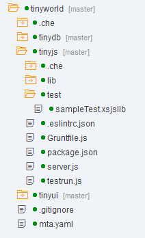

2. Add all changes to Git and create a commit.

3. Make sure that **JUnit Plugin** is installed on your Jenkins instance.

4. In Jenkins, open the configuration of job `CI_TinyWorld_master_build`.

5. In the **Post-build Actions** section, add the step **Publish JUnit test result report** and enter the following data:

    Field                                  | Value
    :------------------------------------- | :-------------------------------------------------------------------------
    Test report XML                        | `**/.testresults/*.xml`
    Health report amplification factor     | `1` or any other value, which is convenient for you


### 7.4 Enhancing the Module Builds: Creating MTA Extensions

The current setup assumes that ESLint and tests are executed in both voter and CI build, but that minification takes place only in the CI build, since it is relevant only when the application is deployed on the server. The `Gruntfile.js` file simply defines the tasks; the MTA build must be able to orchestrate them correctly. This is done by MTA extensions.

#### Procedure

1. In your project folder, parallel to the `mta.yaml` file, add a file named `mta.vo_build.mtaext` and fill it with the following content:

    ```
    _schema-version: '2.0'
    ID: com.mycompany.mta.tinyworld.ext.vo_build
    extends: com.mycompany.mta.tinyworld

    modules:

     - name: tinyui
       build-parameters:
          grunt-opts:
            - vo_build

     - name: tinyjs
       build-parameters:
          grunt-opts:
            - vo_build
    ```

2. In the same directory, create another new named `mta.ci_build.mtaext` and add the following content:

    ```
    _schema-version: '2.0'
    ID: com.mycompany.mta.tinyworld.ext.ci_build
    extends: com.mycompany.mta.tinyworld

    modules:

     - name: tinyui
       build-parameters:
          grunt-opts:
            - ci_build

     - name: tinyjs
       build-parameters:
          grunt-opts:
            - ci_build
    ```

3. In Jenkins, open the definition of job `VO_TinyWorld_master_build` and in the build command, change the call of the MTA archive builder:

    ```
    java -jar tmp/mta.jar --mtar ${mtaName}.mtar --build-target=XSA --extension=mta.vo_build.mtaext build
    ```

4. Open the definition of job `CI_TinyWorld_master_build` and in the build command, change the call of the MTA archive builder:

    ```
    java -jar tmp/mta.jar --mtar ${mtaName}.mtar --build-target=XSA --extension=mta.ci_build.mtaext build
    ```

5. Push the commit to Gerrit, let the voter build execute and submit your change in Gerrit. Monitor the CI build, which starts shortly after submission. ESLint checks are executed in both builds. The `tinyjs` module is tested and the `tinyui` module is minified (still not much happens here, but as soon as additional JavaScript files are part of the module, this will become apparent). In the CI build job, follow the **Test Result** link on the job overview page to check the test results.

    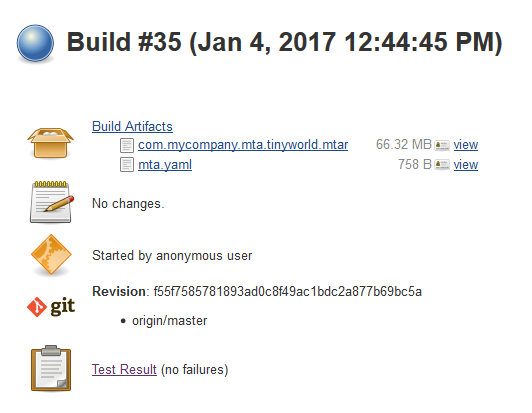


### 8. Deviating steps for old SAP Web IDE releases

This paragraph describes the differences relevant for old SAP Web IDE releases.

### 8.1 Setting Up and Preparing the npm Registry

Before installing SAP Web IDE, first prepare the mentioned npm registry, since its URL must already be configured while installing SAP Web IDE. The npm registry serves the following purposes:

1. It supports the CI build running on Jenkins by hosting SAP-specific node modules that are needed to build XS advanced applications. These modules can be fetched from SAP ONE Support Launchpad, as described below.

2. The CI build of the JavaScript modules is based on Grunt, and thus dependencies to Grunt must be added to the modules' `package.json` file. The development infrastructure (DI) builder triggered by SAP Web IDE must be able to resolve the dependencies declared in `package.json`. You can configure the npm cache on the XS advanced system (the application named `di-local-npm-registry`) to forward all requests for modules that are not provided by SAP and thus not contained in the cache to a configured npm registry. In our example, the npm registry containing Grunt is implemented as a proxy repository on Nexus pointing to the public npm registry `http://registry.npmjs.org/`. You can handle dependencies to any other published npm module in the same way.

Our implementation uses Nexus as the repository server. The set up of Nexus is described in the [Artifact Repository](http://www.sap.com/developer/tutorials/ci-best-practices-artifacts.html) that is part of this CI Best Practices Guide. We provide one npm registry for type `hosted` for purpose 1 and one npm registry of type `proxy` to the public npm registry for purpose 2. To create a unified view for these registries, we define a repository group containing them. Finally, we upload the SAP modules to the registry mentioned first. Figure 3 shows the npm registry setup.

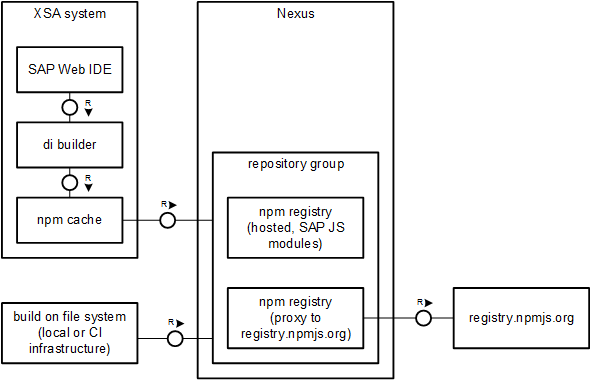

Figure 3: npm registry design.

#### Procedure

1. Log in to your Nexus instance as an administrator.

2. Select **Repositories > Add > Hosted Repository**.

    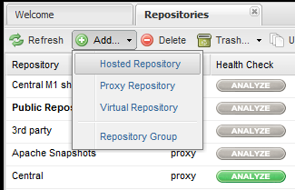

    Enter the following data for your new repository. You can enter any ID and name you like; in our example, we use those listed below:

    Field                           | Value
    :------------------------------ | :--------------------------
    Repository ID                   | `SAP_NPM_Modules`
    Repository Name                 | `SAP NPM Modules`
    Provider                        | `npm`
    Deployment Policy               | `Allow Redeploy`

    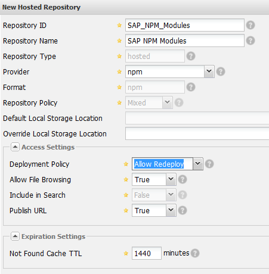

    Save.

3. Select **Repositories > Add > Proxy Repository** and enter the following values:

    Field                           | Value
    :------------------------------ | :--------------------------
    Repository ID                   | `npmjs`
    Repository Name                 | `npmjs proxy`
    Provider                        | `npm`
    Remote Storage Location         | `http://registry.npmjs.org/`

    Save.

4. Select **Repositories > Add > Repository Group** and enter the following values:

    Field                           | Value
    :------------------------------ | :--------------------------
    Repository ID                   | `NPM_GROUP`
    Repository Name                 | `NPM Group`
    Provider                        | `npm`

    Add `npmjs proxy` and `SAP NPM Modules` to the list of **Ordered Group Repositories**

    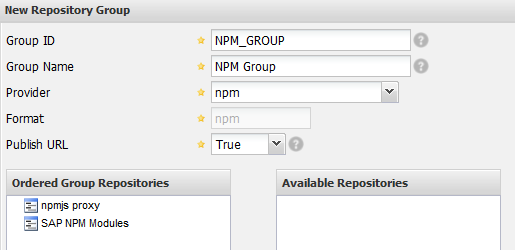

    If needed, you may add more repositories to this group.

    Save.

5. Open a web browser and enter SAP ONE Support Launchpad, navigate to **Software Downloads** and search for `XS JAVASCRIPT`. Download the newest zip archive, store it on a machine with npm installed, and extract the archive into a working directory. The zip file includes node module folders like `approuter`, `sap-xsjs` and others.

    > [SAP ONE Support Launchpad](https://launchpad.support.sap.com/)

6. Publish all modules to the npm registry `SAP NPM Modules`. Make sure that you also upload nested modules, which would not be the case if you just execute `npm publish` inside one of the module folders: `npm` ignores nested `node_modules` folders. Instead, `npm publish` must be executed recursively in all modules contained in nested `node_modules` folders. On a Linux machine, you can execute the following script from the folder containing the modules to perform the upload automatically:

    ```
    npm_registry=<URL of the SAP NPM Modules registry>

    process_module() {
        if [ $1 ]; then
           module=$1
           cd $module
           echo "Processing $module ..."
           moduleVersion=`awk '$1 ~ /version/ {match($2,"\"([0-9]+.[0-9]+.[0-9]+.*)\"",a)
              print a[1]}' package.json`
           if curl -Isf $npm_registry/$module/$moduleVersion; then
        	   echo "$module/$moduleVersion already existing"
           else
        	   echo "uploading $module/$moduleVersion"
	           npm publish --registry $npm_registry --ignore-scripts

	           if [ -d node_modules ]; then
	               cd node_modules
	               process_dir
	               cd ..
	           fi
           fi
           cd ..
        fi
    }

    process_dir() {
        for i in $( ls -1 ); do
    	if [ -d $i ]; then
	        process_module $i
	    fi
        done
    }

    process_dir
    ```

The upload requires that you authorize yourself against the registry. Follow the steps how to define an authorization token as described in the following document:

> [Publishing npm Packages](http://books.sonatype.com/nexus-book/reference/npm-deploying-packages.html)


### 8.2 Creating a Jenkins CI Build Job

Replace the script implementation in the Jenkins job by the following lines. Replace `<URL of the npm repository group>` by the URL of the npm repository group defined in paragraph 8.1.

    ```
    # install MTA archive builder
    mkdir tmp
    cd tmp
    wget --output-document=mta.jar '<URL from where to download the MTA archive builder>'
    cd ..

    # create local npmrc file
    cat <<EOF > .npmrc
    registry=<URL of the npm repository group>
    EOF

    # link to local .npmrc file from submodules
    modulePaths=`awk -F: '$1 ~ /path/ { gsub(/\s/,"", $2)
    print $2 }' mta.yaml`
    for path in $modulePaths; do
      ln -sft $path ../.npmrc
    done

    # extract artifact name
    mtaName=`awk -F: '$1 ~ /^ID/ { gsub(/\s/,"", $2)
    	print $2 }' mta.yaml`

    # execute MTA build
    java -jar tmp/mta.jar --mtar ${mtaName}.mtar --build-target=XSA build

    # deploy to CI system
    xs api ${XSA_API_ENDPOINT} --skip-ssl-validation
    xs login -u ${HANA_XSA_USER} -p ${HANA_XSA_PASSWORD} -o ${ORGANIZATION} -s ${CI_SPACE}
    xs deploy -f ${mtaName}.mtar

    # add automatic tests here
    #

    # clean up
    xs undeploy -f ${mtaName}
    xs services | awk '$1 ~ /^.+$/ {
        if (found == 1)
          system( "xs delete-service -f "$1 ) }
      /-----/ {found = 1}'
    xs logout
    ```


### Appendix

#### `tinyui/Gruntfile.js`

```
"use strict";
module.exports = function (grunt) {
    grunt.initConfig({
        pkg: grunt.file.readJSON("package.json"),
        "eslint": {
            options: {
                configFile: ".eslintrc.json"
            },
            target: ["*.js", "lib/**.js"]
        },
        "uglify": {
            build: {
                files: [
                    {
                        expand: true,
                        src: "**/*.js",
                        filter: function (filepath) {
                            return !filepath.match(new RegExp("node_modules", "gi"));
                        }
                    }]
            }
        }
    });

    grunt.loadNpmTasks("grunt-eslint");
    grunt.loadNpmTasks("grunt-contrib-uglify");
    grunt.registerTask("default", []);
    grunt.registerTask("vo_build", ["eslint"]);
    grunt.registerTask("ci_build", ["eslint", "uglify"]);
};
```


#### `tinyjs/Gruntfile.js`

```
"use strict";
module.exports = function (grunt) {
    grunt.initConfig({
        pkg: grunt.file.readJSON("package.json"),
        "eslint": {
            options: {
                configFile: ".eslintrc.json"
            },
            target: ["*.js", "lib/**.js"]
        },
        "execute": {
            test: {
                src: ["testrun.js"]
            }
        }
    });

    grunt.loadNpmTasks("grunt-eslint");
    grunt.loadNpmTasks("grunt-execute");
    grunt.registerTask("default", []);
    grunt.registerTask("vo_build", ["eslint", "execute:test"]);
    grunt.registerTask("ci_build", ["eslint", "execute:test"]);
};
```


> The content of this document is for guidance purposes only. No warranty or guarantees are provided.

## Next Steps

  - [Back to the Navigator](http://www.sap.com/developer/tutorials/ci-best-practices-intro.html)
