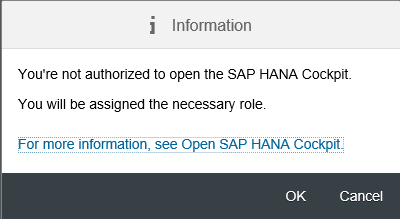

## Prerequisites  

  - **Proficiency:** Intermediate
  - [Source Code Versioning System](https://developers.sap.com/tutorials/ci-best-practices-scm.html)
  - [Build Scheduler](https://developers.sap.com/tutorials/ci-best-practices-build.html)
  - [Artifact Repository](https://developers.sap.com/tutorials/ci-best-practices-artifacts.html)
  - [Landscape Configuration](https://developers.sap.com/tutorials/ci-best-practices-landscape.html)
  - [CD Pipeline Skeleton](https://developers.sap.com/tutorials/ci-best-practices-pipeline-skeleton.html)
  - [Generic Project](https://developers.sap.com/tutorials/ci-best-practices-generic.html)

## Next Steps

  - [Back to the Navigator](https://developers.sap.com/tutorials/ci-best-practices-intro.html)

---

> This document is part of the guide [Continuous Integration (CI) Best Practices with SAP](https://developers.sap.com/tutorials/ci-best-practices-intro.html). For all the examples to work properly make sure that you have followed the setup instructions for all components listed in the prerequisites box.

For SAP HANA Extended Application Services (XS) classic model (XSC) development you can use either the SAP HANA Studio or the SAP HANA Development Workbench. For more details about installing and getting started, please refer to the product documentation.

>- [SAP HANA Developer Guide for SAP HANA Studio](https://help.sap.com/viewer/52715f71adba4aaeb480d946c742d1f6/2.0.01/en-US)  
>- [SAP HANA Web-Based Development Workbench](https://help.sap.com/viewer/b3d0daf2a98e49ada00bf31b7ca7a42e/2.0.01/en-US/7f99b0f952d04792912587c99e299ef5.html)

A developer working on an SAP HANA XSC application works directly in the SAP HANA repository using the SAP HANA Studio. Design-time objects are modified first as an inactive version in the SAP HANA repository, then activated afterwards. As a best practice, we recommend that developers on large teams use their own SAP HANA systems for development to avoid conflicts with other developers. For a CI-based process, changes in the SAP HANA sources are stored in Git; this is where developers push their changes to.

The CI build in our example use case does not contain a compilation step, since nothing needs to be compiled. Instead, the artifact for XS classic model is an archive that contains the XS design-time objects wrapped as a delivery unit (DU), which can be deployed to any SAP HANA system. To define and package a delivery unit from the sources in Git, a dedicated SAP HANA system - referred to in this discussion as the SAP HANA CI system - is used together with the command line client `regi`.

`regi` imports the sources from Git into the SAP HANA CI system, first activating and deploying them to the SAP HANA database and, lastly, packaging and exporting them as a delivery unit (DU). This idea was first described in an SCN article.

> [SCN article on Continuous delivery and SAP HANA](http://scn.sap.com/community/hana-in-memory/use-cases/blog/2013/04/17/continuous-delivery-and-sap-hana)

Thus, you can think of the SAP HANA CI system and `regi` as the *build tool*, whereby the SAP HANA CI system is the *build back end* and `regi` is a client tool that interacts with the back end. Since new versions of sources are uploaded to the SAP HANA CI system automatically all the time in the context of the CI process, its status is unstable. Do not use it for any other purpose, for example, manual tests.

A CI build step may contain tests, for example static code checks for the JavaScript sources (like `ESLint`) or even automated tests for the user interface. To ensure that subsequent Git changes do not conflict with each other on the SAP HANA CI system, builds must run strictly sequentially. Otherwise, multiple SAP HANA CI systems need to run in parallel. After successful build and test processes, the artifact is archived for further processing.

A dedicated test system is required for acceptance testing. This system is provisioned via `hdbalm import` with a stable version of the DU. The deployment of the DU version, which is successfully created during a CI build, can be triggered either manually by the responsible person (like a quality manager) or automatically via a defined schedule (for example, once a day in the morning). Testers then have the opportunity to execute manual acceptance tests.

After successful testing, the delivery manager determines whether to release the tested version to the productive system and to store the archive as release version to an artifact repository, which in the case of this example is Nexus.


Figure: The CD process flow for SAP HANA XSC

The landscape setup required for this process is described in [Landscape Configuration](https://developers.sap.com/tutorials/ci-best-practices-landscape.html). The pipeline implementation by means of Jenkins jobs places real code into the skeleton, as described in [Sample Pipeline Configuration](https://developers.sap.com/tutorials/ci-best-practices-pipeline-skeleton.html).


Figure: The CD process component landscape

One word of clarification is needed for the different entities that play a role in the process. The SAP HANA design-time content is organized in hierarchies of packages. As in the Java world, they are reflected as a directory structure on the local file system.

Any SAP HANA XS source object belongs to a package. During development, delivery units do not yet play a role but gain significance when life-cycle management tools perform exports or transports of content to other systems: then, the delivery unit is the entity on which these tools operate.

Any given package can be either unassigned, or assigned to exactly one delivery unit. Packages and sub packages can be assigned individually. Theoretically, the structure within a delivery unit might be completely unrelated to the package hierarchy, making it rather unclear at design time which packages are contained in which delivery unit. Therefore we recommend that you design a source structure with delivery unit assignments that fit naturally to the package structure in the following sense: if a package belongs to a certain delivery unit, the sub packages also belong to that delivery unit.

Thus, to make the handling simple, we assume for the example that the sources are organized in one common package (with eventual sub packages) which is assigned to exactly one delivery unit that does not contain any other packages. The detailed assumptions are described later in this guide.

The scenario discussed throughout this chapter is only an example intended to demonstrate how to set up a continuous delivery process for SAP HANA XS classic model applications.


### Prerequisites

- Install SAP HANA Systems (instance for development, the CI process, test and productive system)

- Install SAP HANA Studio on your local PC

>- [SAP HANA Installation and Update Overview](https://help.sap.com/viewer/2c1988d620e04368aa4103bf26f17727/2.0.00/en-US/8cd2fc57041f437e9dc95f07a5e48e4d.html)  
>- [SAP HANA Server Installation Guide](https://help.sap.com/viewer/2c1988d620e04368aa4103bf26f17727/2.0.01/en-US)  
>- [SAP HANA Studio Installation Guide](https://help.sap.com/viewer/a2a49126a5c546a9864aae22c05c3d0e/2.0.01/en-US)


### Preparing the SAP HANA systems

Some basic permissions and settings are required on the SAP HANA systems.

#### Procedure

1. After you have installed your SAP HANA systems, access them using the SAP HANA Cockpit via the URL `http://<host>:<port>/sap/hana/admin/cockpit`, where `<port>` is usually `43<instance number>` (HTTPS) or `80<instance number>` (HTTP) for a single-container system, which is fully sufficient for our purposes. If you do not yet have admin permissions assigned, they are assigned when you initially enter the SAP HANA Cockpit.

    

2. Click **OK**.

    

3. Click **Continue**.

4. For your test and productive systems, you need a SAP HANA database user with the permission for the features of `SAP HANA Application Lifecycle Management` to perform configuration through the user interface and to use the `hdbalm` command line tool within your Jenkins job definitions. The respective user role is `sap.hana.xs.lm.roles::Administrator`. `hdbalm` will not ask you to change your password, so you should change the initial user password before using `hdbalm`.

5. Select **Manage Roles and Users** or enter `http://<host>:<port>/sap/hana/ide/security` in your browser.

    

6. Navigate to **Security > Users**, select your user, open the **Granted Roles** tab, and add the role `sap.hana.xs.lm.roles::Administrator`.

    

7. Save.

8. You should now see additional tiles in your SAP HANA Cockpit (`http://<host>:<port>/sap/hana/admin/cockpit`).

    

    Check your new permissions by selecting the **HANA Application Lifecycle Management** tile or by entering `http://<host>:<port>/sap/hana/xs/lm` in your browser.

9. From within the **SAP HANA Application Lifecycle Management**, open **Settings**.

    

    Change the vendor to the value that reflects your organizational structure.

    


### Installing the SAP HANA client on the Jenkins slave machine

For more information about installing the SAP HANA Client please refer to the product documentation.

The SAP HANA Client installation contains the following command line tools:

- `regi` is a client that interacts with the SAP HANA repository.

- `hdbalm` provides life-cycle management tasks.

- `hdbuserstore` provides secure credential handling.

For additional information enter the tool name on the command line followed by the argument `help`.

>- [SAP HANA Client Installation and Update Guide](https://help.sap.com/viewer/e7e79e15f5284474b965872bf0fa3d63/2.0.01/en-US)  
>- [Using `hdbalm`](https://help.sap.com/viewer/a4d43a319ecf464e9d838454a6bdb9ad/2.0.00/en-US/b92b9bdc457c42ba920e3ed6b09e4463.html)  
>- [Secure User Store (`hdbuserstore`)](https://help.sap.com/viewer/b3ee5778bc2e4a089d3299b82ec762a7/2.0.00/en-US/dd95ac9dbb571014a7d7f0234d762fdb.html)


#### Procedure

1. Log in to the Jenkins slave machine as `root`, download the SAP HANA Client installation package and SAPCAR and store them into a temporary directory.

2. Extract the `SAR` package.

    ```
    SAPCAR_{SAPCAR version}.EXE -xvf IMDB_CLIENT{HANA client version}.SAR
    ```

3. From the extracted directory, execute the SAP HANA Client installation:

    ```
    ./hdbinst
    ```

    Follow the instructions within the installation wizard.

4. Add the installation path (which was defined in the installation procedure) to the `PATH` and `LD_LIBRARY_PATH` environment variables that apply to the user under which the Jenkins builds are running.


### SAP HANA Studio Setup

#### Procedure

1. On your PC, start your SAP HANA Studio and in the menu, open **Window > Perspective > Open Perspective > Other > SAP HANA Development**.

    

2. Open the **Systems** tab. Right-click into the white pane, and select **Add System**. Enter the connection data to your SAP HANA development system.

    

3. Click **Next**, then enter your user ID and password.

4. Click **Finish**. Your system is now listed in the systems view.

    

### Creating a reference SAP HANA demo application

In this guide, we'll use the SAP education application (`SHINE`) to demonstrate how to set up the CI process using "real" code, rather than simply a "Hello World" example. `SHINE` is available as a DU with the name `HCODEMOCONTENT_<SP>.tgz` from GitHub or in the SAP Software Download Center.

>- [`SHINE` Reference Application](https://github.com/SAP/hana-shine)   
>- [`SHINE` documentation](https://github.com/SAP/hana-shine/blob/master/README.md)

The steps below are preparation steps that bring the `SHINE` sources into a Gerrit project. Given the `SHINE` DU as a tar ball (`.tgz`), you will import the DU to the SAP HANA Development system and set up a local HANA workspace containing the source files of the DU. From there you will push the source files to Gerrit.

#### Procedure

##### Importing the project sources into the SAP HANA development system

1. Download the package containing the `SHINE` delivery unit and store it locally on your PC.

2. Open the SAP HANA Studio, open the **SAP HANA Development** perspective and log in to your SAP HANA development system.

3. Select **File > Import > SAP HANA Content > Delivery Unit**. Select your SAP HANA development system, then select **Client** and browse for your downloaded delivery unit package file. These steps are described in detail in the `SHINE` documentation.

4. Click **Finish** and wait for the upload to finish.


##### Creating of the Gerrit project

1. Create a project in Gerrit as described in [Generic Project](https://developers.sap.com/tutorials/ci-best-practices-generic.html).

2. Clone the project to your local PC.

3. In the SAP HANA Studio, open the **Repositories** tab in the **SAP HANA Development** perspective, select the correct system, right click and choose **Create Repository Workspace** from the context menu.

4. Enter the directory name of the Git repository that was just cloned before into the **Workspace Name** field. Enter the path to the directory into the **Workspace Root** field. You can safely ignore the warning that appears.

    

5. In the newly created workspace, right-click `sap/hana/democontent/epm` and select **Check Out**.

    

    The checked out HANA content is now located in the local Git repository workspace.

6. We will use Maven as the tool to upload the application to Nexus after release. This requires a short `pom.xml` to be added to the project root folder with the following content:

    ```
    <project xsi:schemaLocation="http://maven.apache.org/POM/4.0.0 http://maven.apache.org/xsd/maven-4.0.0.xsd">
      <modelVersion>4.0.0</modelVersion>
      <groupId>{group ID of your Application}</groupId>
      <artifactId>HCO_DEMOCONTENT</artifactId>
      <version>{version number}</version>
    </project>
    ```

    Enter appropriate values for `groupID` and `version`. The details are described in the part [CD Pipeline Skeleton](https://developers.sap.com/tutorials/ci-best-practices-pipeline-skeleton.html).

7. In the local Git workspace, perform `git add`. Ensure that the directory `._SYS_REGI_settings`, which was created automatically by the SAP HANA Studio, is not committed into Git, since the existence of this directory will prevent other developers to create an own HANA repository workspace. Best practice is to add the pattern `._SYS_REGI_settings/*` into the `.gitignore` file. Perform a commit, and push the change into the central repository. The Gerrit project is now filled with the `SHINE` sources.


### Working with SAP HANA Studio

For general information about working with the SAP HANA Studio, please use the product documentation:

> [SAP HANA Developer Guide for SAP HANA Studio](https://help.sap.com/viewer/52715f71adba4aaeb480d946c742d1f6/2.0.01/en-US)  

When developers check out sources from the SAP HANA repository to a local workspace to store them in Git, they must ensure that all sources have already been activated in the SAP HANA repository of the development system. The checkout mechanism always uses the newest version, which might be either an active or inactive one. Checking out partially activated sources leads to an inconsistent source state in Git.


### Creating a Jenkins CI build job

The Jenkins CI build job fetches the sources from Git, imports them into the SAP HANA CI system using `regi` to assign the package structure to a delivery unit that will be exported afterwards using `regi`. As an alternative you can assemble a software component per DU using `hdbalm assemble`, which is described at the end of this guide. For the sake of simplicity we'll make some assumptions about the example use case:

- The sources contained in the Gerrit project have a unique common package root: in our case, it is `sap/hana/democontent/epm`. Using more than a single top-level package requires adaptations to the job definition by means of loops over the top-level packages.

- There are no other sources in the SAP HANA system that belong to the common package but not to the Gerrit project.

- The delivery unit to be packaged contains only the sources of the Gerrit project.

These assumptions allow us to treat the entities *package* and *delivery unit* as equivalents and avoid overlaps in packages.


#### Procedure

1. Open Jenkins, select **New Item**, then select **Freestyle Job**, and assign `CI_Shine_master_build` as job name.

2. Define the values for the SAP HANA CI system (used for the packaging), the delivery unit, and the package as parameters of the job so that you can change these values quickly, if necessary without having to search for them in the job implementation. Select **This build is parametrized**, and enter the following string parameters:

    Name                   | Default Value
    :--------------------- | :------------------------------------------------------
    `HANA_HOST`            | `{fully qualified host name of the SAP HANA CI system}`
    `HANA_PORT`            | `{SAP HANA port the regi tool connects to (3<instance number>15}`
    `DELIVERY_UNIT`        | `HCO_DEMOCONTENT`
    `DELIVERY_UNIT_VENDOR` | `{your vendor name}`
    `PACKAGE`              | `sap/hana/democontent/epm`

3. For the other configuration options, enter the following:

    Field                                  | Value
    :------------------------------------- | :-------------------------------------------------------------------------
    Restrict where this project can be run | `checked`; Label Expression: the label that you have assigned to the slave, in this case `builds`
    Source Code Management > Git           | `checked`
    Repository URL                         | `{the SSH-based URL of your repository}`
    Credentials                            | `jenkins`
    Branches to build; Branch Specifier    | `master`
    Build Triggers                         |
    Poll SCM                               | `checked`
    Schedule                               | `{Enter a pull frequency. For immediate results, two minutes is an appropriate value.}`
    Build Environment                      |
    Delete workspace before build starts   | `checked`
    Inject passwords to the build as environment | `checked`
    Global passwords                       | `checked`
    Mask password parameters               | `checked`

4. Choose **Add build step**, select **Execute shell** and enter the following code:

    ```
    # calculate the top-level package dir
    top_level_package=${PACKAGE%%/*}

    #connect the SAP HANA Integration System
    #hdbuserstore set <mykey> <host:port> <user> <password>
    hdbuserstore set HDBKEY "${HANA_HOST}:${HANA_PORT}" "${HANA_USER}" "${HANA_PASSWORD}"

    #create workspace local on the Jenkins server
    regi create workspace regi_workspace --key=HDBKEY -f

    cd regi_workspace

    # track the package of interest
    regi track ${PACKAGE}

    # check out a local copy from the SAP HANA repository
    regi checkout --force

    # Copy top level package directory of sources to regi workspace
    rsync -qvrW --delete --exclude=".git" --exclude="._SYS_REGI_settings" "${WORKSPACE}/${top_level_package}" "${WORKSPACE}/regi_workspace"

    # Commit the changes
    regi commit

    # Activate the changes
    regi activate

    # Unassign the DU to get a proper state
    regi unassign ${PACKAGE}

    # create the DU if not yet existing
    regi show du ${DELIVERY_UNIT} || regi create du ${DELIVERY_UNIT} --key=HDBKEY

    # assign the package to the DU
    regi assign ${PACKAGE} ${DELIVERY_UNIT} --key=HDBKEY

    # Full DU export
    mkdir ${WORKSPACE}/target
    regi export ${DELIVERY_UNIT} "${WORKSPACE}/target/${DELIVERY_UNIT}.tgz" --key=HDBKEY

    # Make pom.xml available for sequel jobs
    cp "${WORKSPACE}/pom.xml" "${WORKSPACE}/target"
    ```

    This script copies the sources that have been cloned from Gerrit via `rsync` into a `regi` workspace into which the current version of the sources from the SAP HANA repository were previously checked out. Checking out the sources from the SAP HANA repository along parametrizing `rsync` ensures that files that are deleted in Git are also deleted from the SAP HANA repository. After sources have been committed and activated, the delivery unit assignment is refreshed and the delivery unit exported. The credentials for logging in to the SAP HANA system, described below (step 8), is the final piece.

    Please note that support by SAP for the usage of the `regi` tool is restricted to the commands that are used in the code above.

5. Archive the artifacts so they are available for subsequent Jenkins jobs. Select **Add post-build action > Archive the artifacts**. Enter `target/*` into the **Files to archive** field.

6. To define the next job in the pipeline, select **Add post-build action > Build other project (manual step)** and add the following entries:

    Field                                  | Value
    :------------------------------------- | :-------------------------------------------------------------------------
    Downstream Project Names               | `CI_Shine_master_testDeploy`
    Parameters                             | `BUILD_JOB_NUMBER=${BUILD_NUMBER}`

    Ignore the warning that the job entered does not yet exist. We will create it in the next step.

7. Save the job definition.

8. Define user name and password to be used to access your SAP HANA CI system via `regi` as global passwords: Select **Manage Jenkins > Configure Jenkins > Global Passwords**. Click **Add**, then set **Name** to `HANA_USER` and **Password** to the user name. Click **Add** again, set **Name** to `HANA_PASSWORD` and **Password** to the password of `HANA_USER`. Save your changes.


### Creating a Jenkins job for deployment to the test system

The next job in the CD pipeline is triggered manually: it is the stage  for the quality manager or test coordinator to provide a test system with one candidate that has successfully passed the CI build job. The system can then be used by manual testers for acceptance tests.

From a technical point of view, this job takes the build result (that is, the exported delivery unit) from the previous job and imports it to the test system using `hdbalm import`.

#### Procedure

1. Open Jenkins and click **New Item**, then select **Freestyle Job**. Enter `CI_Shine_master_testDeploy`.

2. Select **This build is parametrized**, and enter the following string parameters:

    Name                   | Default Value
    :--------------------- | :------------------------------------------------------
    `BUILD_JOB_NUMBER`     | Leave empty
    `HANA_HOST`            | `{fully qualified host name of the SAP HANA CI system}`
    `HANA_HTTP_PORT`       | `{SAP HANA http port: usually 43<instance number> (HTTPS) or 80<instance number> (HTTP)}`

3. As the other configuration options, enter the following:

    Field                                  | Value
    :------------------------------------- | :-------------------------------------------------------------------------
    Restrict where this project can be run | `checked`; Label Expression: the label that you have assigned to the slave, in this case, `builds`
    Source Code Management > None          | `checked`
    Build Environment                      |
    Delete workspace before build starts   | `checked`
    Inject passwords to the build as environment | `checked`
    Global passwords                       | `checked`
    Mask password parameters               | `checked`

4. In the **Build** section, select **Add build step > Copy artifacts from other projects** and enter:

    Field                                  | Value
    :------------------------------------- | :-------------------------------------------------------------------------
    Project name                           | `CI_Shine_master_build`
    Which build                            | `Specific build`
    Build number                           | `$BUILD_JOB_NUMBER`
    Artifacts to copy                      | `target/*`

    This step restores the artifact that was created in the build job into the workspace directory of this job.

5. Select **Add build step > Execute shell** and enter the following script implementation:

    ```
    # connection data for hdbalm
    export HDBALM_HOST=${HANA_HOST}
    export HDBALM_PORT=${HANA_HTTP_PORT}
    export HDBALM_USER=${HANA_USER}
    export HDBALM_PASSWD=${HANA_PASSWORD}

    # import the delivery unit archive
    hdbalm -y import "target/${DELIVERY_UNIT}.tgz"
    ```

6. Select **Add post-build action > Build other project (manual step)** and add the following entries:

    Field                                  | Value
    :------------------------------------- | :-------------------------------------------------------------------------
    Downstream Project Names               | `CI_Shine_master_release`
    Parameters                             | `BUILD_JOB_NUMBER=${BUILD_JOB_NUMBER}`

    Ignore the warning that the job entered does not yet exist; we will create it in the next step.

7. Save the job definition.


### Creating a Jenkins release job

The final job in the pipeline implements the release of a version that has successfully passed the acceptance test.

Technically, two things happen: the artifact is uploaded to Nexus into a release repository, and it is imported by `hdbalm` to the production system.

We create a copy of the deploy job in the test system, adapt the target URL that points to the productive system and add another step for the upload to Nexus.


#### Procedure

1. Open Jenkins, click **New Item**, and enter `CI_Shine_master_release`. Select **Copy existing item** and enter `CI_Shine_master_testDeploy` as the copy template.

2. Change the `HANA_HOST` parameter to the host name of the production system.

3. In the **Build** section, add the following lines at the beginning of the shell script:

    ```
    # deploy to Nexus
    mv target/pom.xml .
    mvn deploy:deploy-file -B -Durl=<url to your Nexus release repository> -Dfile="target/${DELIVERY_UNIT}.tgz" -DrepositoryId=nexusCIProcess -Dpackaging=tgz -DpomFile=pom.xml
    ```

4. Remove any post-build action.

5. Save the job definition.


### Setting up a Pipeline View

After we have created all the required Jenkins jobs, we will add a convenient overview of the pipeline in Jenkins.


#### Procedure

1. Open Jenkins and click the view tab with the **+** sign.

2. Enter `Shine_pipeline` and Check `Build Pipeline View`

3. Select `CI_Shine_master_build` in the **Select Initial Job** field and specify `5` in the **No of Displayed Builds** field.

4. Press **OK**.

5. Perform a local change in your sources, commit, and then push it directly to `master`. After refreshing the pipeline view, you see the build job processing.

    

6. Now act as quality manager. Trigger the import of the delivery unit to the test system.

    

7. Finally, assume that the acceptance test was successful. In the role as delivery manager, trigger the release.

    

8. You see the application deployed on all the systems and uploaded as archive into Nexus.


### Alternative approaches

This guide provides an example that demonstrates how a CD process might look for SAP HANA XSC applications. This section briefly discusses two alternative approaches.


#### Assembling and installing a Software Component

Instead of using an exported delivery unit, you can use the `hdbalm assemble` command to assemble the delivery unit from the CI system as a software component in form of a zip file. In the CI build job, replace the `regi export` command with the following lines:

```
#assembles a software component for the DU
export HDBALM_HOST=${HANA_HOST}
export HDBALM_PORT=${HANA_HTTP_PORT}
export HDBALM_USER=${HANA_USER}
export HDBALM_PASSWD=${HANA_PASSWORD}
hdbalm -y assemble --ignore_language_errors --scvs_only ${DELIVERY_UNIT},${Vendor}
```

The zip file is archived in Jenkins, and passed to the `CI_Shine_master_testDeploy` and `CI_Shine_master_release` jobs. In both, the `hdbalm import` command is replaced by `hdbalm install`.

```
hdbalm -y install <software component zip file>
```

You must also adapt the upload to Nexus in the `CI_Shine_master_release` job to operate on the software component zip file.

> [Using `hdbalm`](https://help.sap.com/viewer/a4d43a319ecf464e9d838454a6bdb9ad/2.0.00/en-US/b92b9bdc457c42ba920e3ed6b09e4463.html)  


#### Transporting between systems

Instead of exporting and importing an archive (delivery unit or software component), you can establish direct transports between the systems: `hdbalm` can use a direct connection from the target system to the source system to pull a delivery unit. You might find this approach preferable, especially if you are already familiar to life-cycle management. To implement it, you must provide an additional permission in the target system and define the transport route. For the discussion below, we assume that the production system is the transport target, and the test system is the transport source.

> [Setting Up the Transport](https://help.sap.com/viewer/52715f71adba4aaeb480d946c742d1f6/2.0.00/en-US/50a00deb7663496d93ebb938bbb723ca.html)


##### Preparing the target (productive) system

Before using the `hdbalm transport` command, configure the landscape in the target SAP HANA system and create a transport route.

1. Log in to your SAP HANA Cockpit of the target system using `http://<host>:<port>/sap/hana/admin/cockpit`

2. Open **Manage Roles and Users**, select your user, and add the permission `sap.hana.xs.admin.roles::HTTPDestAdministrator`.

    

    This role provides the required permission to create a new transport route.

3. In the SAP HANA Cockpit, open **HANA Application Lifecycle Management** and navigate to **TRANSPORT**.

4. In the sub menu of the **TRANSPORT** view, open **System** and press **+Register**. Enter the host name and the HTTP port of the source system of the transport (test system).

5. Press **Next**. Select **Maintain Destination**. Configure the connection details of the source (test) system so that the target system can access it. Click **Authentication Details** and enter the user name and the password of the source system. We recommend that you enable a secured connection. When you have finished the configuration, press **Save** and close the pop-up window.

6. Select **Finish** in the **Register System** pop-up. You see the test system listed.

    

7. In the transport view of the HANA Application Lifecycle Management, click **Transports** and select **Create**. Enter a name for your transport route, choose your source system, and select **Delivery Units**. Mark your delivery unit in the list. Select **Create** to save your transport route configuration.

    

8. Log in to the Jenkins build machine (or any other machine on which a SAP HANA client is installed). Enter the following commands:

    ```
    export HDBALM_USER={HANA user of the productive system}
    export HDBALM_HOST={host name of the productive system}
    export HDBALM_PORT={http port of the productive system}
    hdbalm transport list
    ```

    Enter the password of the SAP HANA user. You see a list of the transports defined on the productive system. Look for the transport that you just defined and make a note of its route ID. The route ID does not change, even if you modify the route, and can be used during jobs for automation.


##### Adapting the release job

Replace the `hdbalm import` command in the release job with the `hdbalm transport` command, which triggers the transport.

1. Open the `CI_Shine_master_release` job in Jenkins.

2. Replace the `hdbalm import` command in the shell script of the **Build** section with the following command:

    ```
    hdbalm -y transport start <route id>
    ```

    Replace `<route id>` by the number obtained from the step above.

