---

title: Continuous Integration (CI) Best Practices with SAP: SAP HANA Extended Application Services (XS), classic model
description: Part 4.3: Configuring the CI system for a SAP HANA Extended Application Services (XS), classic model Application.
tags: [  tutorial>intermediate, tutorial:type/project ]

---

## Prerequisites  

  - **Proficiency:** Intermediate
  - [Generic Project](http://go.sap.com/developer/tutorials/ci-best-practices-generic.html)

## Next Steps

  - [Back to the Navigator](http://go.sap.com/developer/tutorials/ci-best-practices-intro.html)
  
---

For SAP HANA Extended Application Services (XS) classic model (XSC) development you can use the SAP HANA Studio or the SAP HANA Development Workbench. For further information on the installation and how to get started, please refer to the official documentation.

> [SAP HANA Developer Guide for SAP HANA Studio](http://help.sap.com/hana/SAP_HANA_Developer_Guide_for_SAP_HANA_Studio_en.pdf)  
> [SAP HANA Developer Guide for SAP HANA Web Workbench](http://help.sap.com/hana/SAP_HANA_Developer_Guide_for_SAP_HANA_Web_Workbench_en.pdf)

A developer working on an SAP HANA XSC application works directly in the SAP HANA repository using the SAP HANA Studio. Design-time objects are modified first as an inactive version in the SAP HANA repository where they are activated afterwards. It is good practice for a developer in a large team to use his own SAP HANA development system for development in order to avoid conflicts
with other developers. For a CI-based process changes in the SAP HANA sources are stored in Git to which the developer pushes his changes.

The CI build in our case does not contain a compilation step in the usual sense, since nothing needs to be compiled. Instead, the artifact for XS classic model is an archive containing the XS design time objects wrapped as a so-called delivery unit (DU), which can be deployed to any SAP HANA system. To define and package a delivery unit from the sources in Git, a dedicated SAP HANA system - which we will henceforth call SAP HANA CI system - is used together with the command line client `regi`. 

`regi` is used for importing the sources from Git into the SAP HANA CI system in an inactive way, activating and deploying them to the SAP HANA database and, lastly, packaging and exporting them as delivery unit (DU). This idea was first described in an SCN article.

> [Continuous delivery and SAP HANA](http://scn.sap.com/community/hana-in-memory/use-cases/blog/2013/04/17/continuous-delivery-and-sap-hana)

Thus, the SAP HANA CI system and `regi` combined can be seen as the *build tool*, whereby the SAP HANA CI system is the *build backend* and `regi` a client tool to interact with it. Since new versions of sources are uploaded to the SAP HANA CI system automatically all the time in the context of the CI process, its status is unstable. It should not be used for any other purposes as, for example, manual tests.

A CI build step may contain tests such as for example static code checks for the JavaScript sources (like `ESLint`) or even automated tests for the user interface. To ensure subsequent Git changes do not conflict with each other on the SAP HANA CI system, the builds must run strictly sequentially. Otherwise multiple SAP HANA CI systems would be needed in parallel. After successful build and test, the artifact is archived for further processing. 

For acceptance tests, a dedicated test system is needed which is provisioned via `hdbalm import` with a stable version of the DU. The deployment of the DU version, which was successfully created during a CI build, can be triggered either manually by a responsible person (like a quality manager) or automatically via a defined schedule (for example, once a day in the morning). Testers then have the opportunity to execute manual acceptance tests.

After successful testing, it is the decision of the delivery manager to release the tested version to the productive system and to store the archive as release version to an artifact repository (here: Nexus).

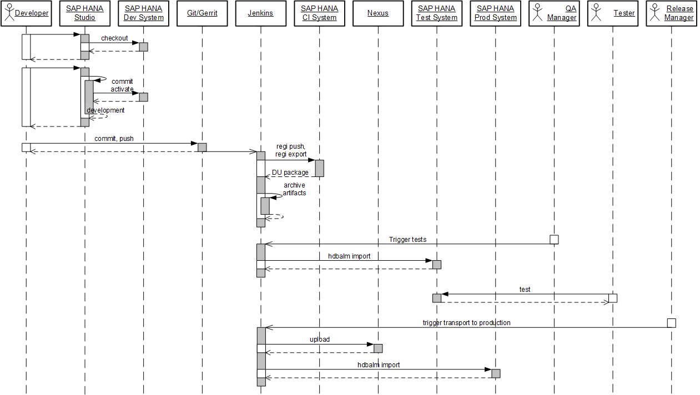

The setup of the landscape needed to run this process is described in the part [Landscape Configuration](http://go.sap.com/developer/tutorials/ci-best-practices-landscape.html)
of this best practices guide. The pipeline implementation by means of Jenkins jobs puts real code into the skeleton described in [Sample Pipeline Configuration](http://go.sap.com/developer/tutorials/ci-best-practices-pipeline-skeleton.html).

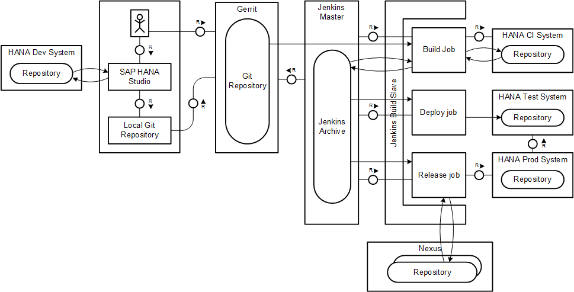

One word of clarification is needed for the different entities that play a role in the process. The SAP HANA design-time content is organized in hierarchies of packages. As in the Java world, they are reflected as a directory structure on the local file system. Any SAP HANA XS source belongs to a package. During development, delivery units do not yet play a role but gain significance when life-cycle management tools perform exports or transports of content to other systems: then, the delivery unit is the entity on which these tools operate.

Any given package can be either unassigned or assigned to exactly one delivery unit. Packages and sub-packages can be assigned individually. Theoretically, the structure within a delivery unit might be completely unrelated to the package
hierarchy, making it rather unclear at design time which packages are contained in which delivery unit. Therefore we recommend to design a source structure with delivery unit assignments that fit naturally to the package structure in the following sense: if a package belongs to a certain delivery unit, the sub-packages also belong to that delivery unit.

Thus, to make the handling simple, we assume that the sources are organized in one common package (of course with eventual sub-packages) being assigned to exactly one delivery unit that does not contain any other packages. The detailed assumptions will be described later in this guide.

Please be aware that what is described in the following is only an example for how to set up a continuous delivery process for SAP HANA XS classic model
applications.


### Prerequisites

- Installed SAP HANA Systems (instance for development, the CI process, test and productive system)
- Installed SAP HANA Studio on your local PC

The installation of the SAP HANA system and the SAP HANA Studio is not subject of this guide and we refer to the official documentation:

> [SAP Help Portal - SAP HANA Installation and Update Overview](http://help.sap.com/saphelp_hanaplatform/helpdata/en/8c/d2fc57041f437e9dc95f07a5e48e4d/content.htm)  
> [SAP HANA Server Installation Guide](http://help.sap.com/hana/SAP_HANA_Server_Installation_Guide_en.pdf)  
> [SAP HANA Studio Installation Guide](http://help.sap.com/hana/SAP_HANA_Studio_Installation_Update_Guide_en.pdf)


### Preparation of the SAP HANA systems

Some basic permissions and settings are required on the SAP HANA systems in order to make the scenario running.

#### Procedure

1. After you have installed your SAP HANA Systems, access them using the SAP HANA Cockpit via the URL `http://<host>:<port>/sap/hana/admin/cockpit`, where `<port>` is usually `43<instance number>` (HTTPS) or `80<instance number>` (HTTP) for a single-container system, which is fully sufficient for our purposes. In case you do not have the admin permissions assigned yet, you will get them when entering the SAP HANA Cockpit as shown in the next screenshots.

    

2. Click **OK**.

    

3. Click **Continue**.

4. For your test and productive system, you need a SAP HANA database user with the permission for the SAP HANA Application life-cycle Management features to do pre-configurations through the user interface and to use the `hdbalm` command line tool within your Jenkins job definitions. The respective user role is `sap.hana.xs.lm.roles::Administrator`.  Note that you can't use a user that still has the initial password, since `hdbalm` will not ask you to change it. Change the password for this user before using `hdbalm`.

5. Click the  **Manage Roles and Users** tile as shown below or directly enter `http://<host>:<port>/sap/hana/ide/security` in your browser.
 
    

6. Navigate to **Security > Users**, select your user, open the **Granted Roles** tab and add the role `sap.hana.xs.lm.roles::Administrator`.
 
    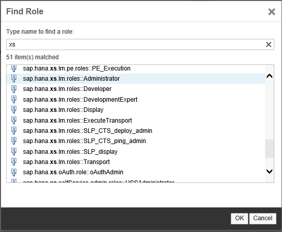

7. Save.

8. After you assigned the role, you will now see additional tiles in your SAP HANA Cockpit `http://<host>:<port>/sap/hana/admin/cockpit`. 

    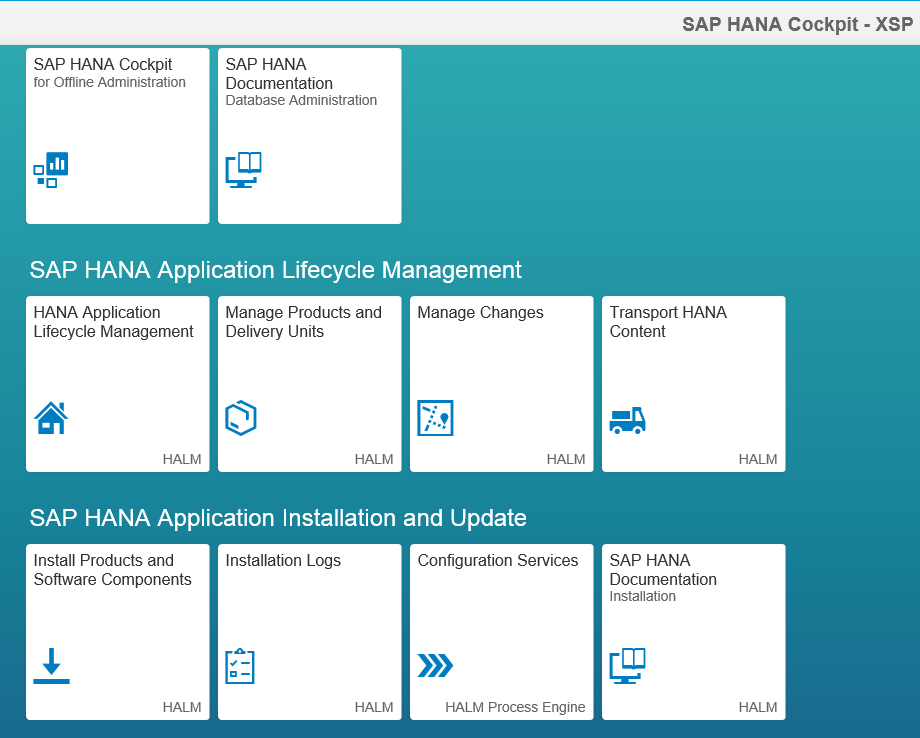

    Check your new permissions by clicking the tile **HANA Application Lifecycle Management** or by entering `http://<host>:<port>/sap/hana/xs/lm` in your browser directly.

9. Stay in the **SAP HANA Application Lifecycle Management** interface and open **Settings**. 

    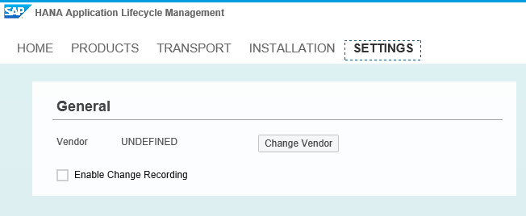

    Change the vendor to the value that reflects your organizational structure. 

    


### Install the SAP HANA client on the Jenkins slave machine

For more information on how to install the SAP HANA Client please refer to the official documentation.

The SAP HANA Client installation contains the command line tools `regi`, `hdbalm` and `hdbuserstore`:

- `regi` is a client to interact with the SAP HANA repository.
- `hdbalm` is a tool to provide life-cycle management tasks.
- `hdbuserstore` provides secure handling of credentials. 

For help of each of these tools enter the tool name on the command line followed by the argument `help`.

> [SAP HANA Client Installation and Update Guide](http://help.sap.com/hana/sap_hana_client_installation_update_guide_en.pdf)  
> [`hdbalm` documentation in the SAP Help Portal](https://help.sap.com/saphelp_hanaplatform/helpdata/en/b9/2b9bdc457c42ba920e3ed6b09e4463/content.htm)  
> [`hdbuserstore` documentation in the SAP Help Portal](http://help.sap.com/saphelp_hanaplatform/helpdata/en/dd/95ac9dbb571014a7d7f0234d762fdb/content.htm)


#### Procedure

1. Logon to the Jenkins slave machine as `root`, download the SAP HANA Client installation package and SAPCAR and store them into a temporary directory.

2. Extract the `SAR` package.

    ```
    SAPCAR_{SAPCAR version}.EXE -xvf IMDB_CLIENT{HANA client version}.SAR
    ```

3. Change into the extracted directory and execute the SAP HANA Client installation. Enter

    ```
    ./hdbinst
    ```
    
    and follow the instructions during the installation procedure.
    
4. Add the installation path that was defined in the installation procedure to the `PATH` and `LD_LIBRARY_PATH` environment variables of the user under which the Jenkins builds are running.

### SAP HANA Studio Setup

#### Procedure

1. On your PC, start your SAP HANA Studio and in the menu, open **Window > Perspective > Open Perspective > Other... > SAP HANA Development**.

    

2. Open the **Systems** tab. Point with the mouse into the white pane and in the context menu, select **Add System...**. Enter the connection data to your SAP HANA Development system.

    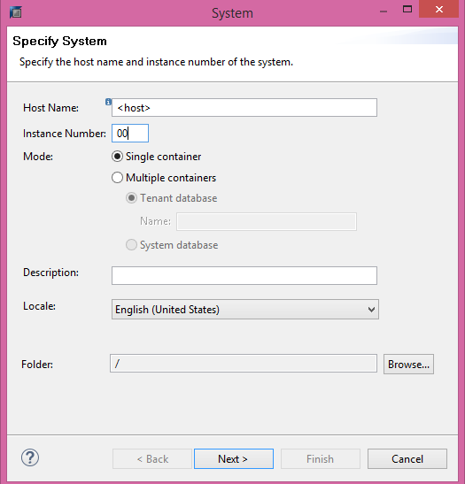

3. Click on **Next** and enter your user and password.

4. Click on finish. Your system is now listed in the systems view.

    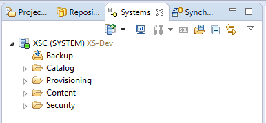

### Create a reference SAP HANA demo application

In this guide, we will use the SAP education application (`SHINE`) to set up the CI process with "real" code, not just a "Hello World" example. It is available as a DU with the name `HCODEMOCONTENT_<SP>.tgz` from GitHub or in the SAP Software Download Center.

> [`SHINE` Reference Application](https://github.com/SAP/hana-shine)  
> [`SHINE` documentation](https://github.com/SAP/hana-shine/blob/master/README.md)

The first steps that follow now are preparation steps to bring the `SHINE` sources into a Gerrit project to have something to start with. The delivery unit of `SHINE` will be downloaded as tar ball (`.tgz`) which is first imported to the SAP HANA Development system. From there it is pushed to Gerrit through a local workspace. After that we set up the CI process by implementing the Jenkins jobs.

#### Procedure

##### Import of the Project sources into the SAP HANA Development System

1. Download the package containing the `SHINE` delivery unit and store it locally on the disc of your PC.

2. Open the SAP HANA Studio, open the **SAP HANA Development** perspective and log on to your SAP HANA Development System.

3. Go to **File > Import > SAP HANA Content > Delivery Unit**. In the dialog, select your SAP HANA Development System, then select **Client** and browse for your downloaded delivery unit package file. These steps are described in detail in the `SHINE` documentation. 

4. Click on **Finish** and wait for the upload to be finished.

##### Creation of the Gerrit project

1. Create a project in Gerrit as described in [Generic Project](http://go.sap.com/developer/tutorials/ci-best-practices-generic.html).

2. Clone the project to your local PC.

3. In the SAP HANA Studio, open the **Repositories** tab in The **SAP HANA Development** perspective, select the right system,
    and in the context menu, choose **Create Repository Workspace**.

4. Enter as **Workspace Name** the directory name of the Git repository that was just cloned before and as **Workspace Root** the path to the directory. You will notice a warning like shown in the picture below. Ignore it.

    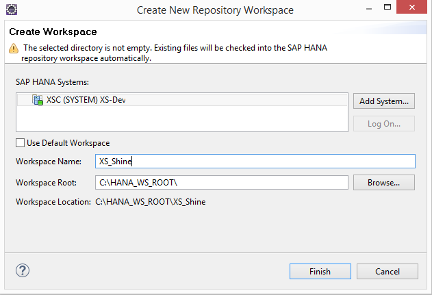

5. In the newly created workspace, navigate to the sub package `sap/hana/democontent/epm` and from the context menu, select **Check Out**.

    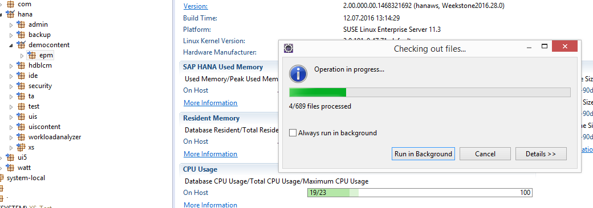

    The checked out HANA content is now exactly located in the local Git repository workspace.

6. In the local Git workspace, add the sources, do a commit and push into the central repository. Now the Gerrit project is initially filled with the `SHINE` sources.

### Working with the SAP HANA studio

We will not describe here how to work with the SAP HANA Studio. For detailed explanation, we refer to the official documentation.

> [SAP HANA Developer Guide for SAP HANA Studio](http://help.sap.com/hana/SAP_HANA_Developer_Guide_for_SAP_HANA_Studio_en.pdf)  

When a developer checks out sources from the SAP HANA repository to a local workspace in order to store them in Git, he has to pay attention that all the sources were activate before in the SAP HANA repository of his SAP HANA Development System. The checkout mechanism always takes the newest version, which could be the active or inactive one. Checking out partially activated sources will lead to an inconsistent source state in Git.

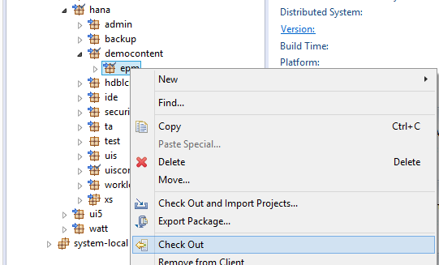

### Jenkins CI build job

The Jenkins CI build job fetches the sources from Git, imports them into the SAP HANA CI system using `regi` in order assign the package structure to a Delivery Unit that will be exported afterwards using `regi`. As alternative you can assemble a software component per DU via `hdbalm assemble` which is described at the end of the guide. For the sake of simplicity of this example we will make some assumptions:

- The sources contained in the Gerrit project have a unique common package root: in our case, it is `sap/hana/democontent/epm`. Having two or more top level packages will require adaptations in the job definition by means of loops over the top level packages.
- There are no other sources in the SAP HANA system that belong to the common package but not to the Gerrit project.
- The delivery unit to be packaged contains exactly the sources of the Gerrit project, not less, not more.

These assumptions allow us to treat the entities *package* and *delivery unit* as equivalents and not having to deal with overlaps in packages and so on.

#### Procedure

1. Open Jenkins and click on **New Item** and select **Freestyle Job**. We call it `CI_Shine_master_build`.

2. It is convenient to define the values for the SAP HANA CI system (used for the packaging), the delivery unit and the package as parameters of the job so that they can be changed quickly if needed without searching for them in the job implementation. Check **This build is parametrized** and enter the following string parameters:
    
    Name                   | Default Value
    :--------------------- | :------------------------------------------------------
    `HANA_HOST`            | `{fully qualified host name of the SAP HANA CI system}`
    `HANA_PORT`            | `{SAP HANA port the regi tool connects to (3<instance number>15}`
    `DELIVERY_UNIT`        | `HCO_DEMOCONTENT`
    `DELIVERY_UNIT_VENDOR` | `{your vendor name}`
    `PACKAGE`              | `sap/hana/democontent/epm`

3. For the other configuration options, enter the following:

    Field                                  | Value
    :------------------------------------- | :------------------------------------------------------------------------- 
    Restrict where this project can be run | `checked`; Label Expression: the label that you have assigned to the slave, in this case `builds` 
    Source Code Management > Git           | `checked` 
    Repository URL                         | `{the ssh based URL of your repository}` 
    Credentials                            | `jenkins` 
    Branches to build; Branch Specifier    | `master`
    Build Triggers                         |
    Poll SCM                               | `checked`
    Schedule                               | `{Enter a pull frequency. In order to have immediate results, every two minutes could be an appropriate value}`
    Build Environment                      |
    Delete workspace before build starts   | `checked`
    Inject passwords to the build as environment | `checked`
    Global passwords                       | `checked`
    Mask password parameters               | `checked`

4. Choose **Add build step**, select **Execute shell** and enter the script as below:

    ```
    # calculate the top-level package dir
    top_level_package=${PACKAGE%%/*}

    #connect the SAP HANA Integration System
    #hdbuserstore set <mykey> <host:port> <user> <password>
    hdbuserstore set HDBKEY ${HANA_HOST}:${HANA_PORT} ${HANA_USER} ${HANA_PASSWORD}

    #create workspace local on the Jenkins server
    regi create workspace regi_workspace --key=HDBKEY -f

    cd regi_workspace

    # track the package of interest
    regi track ${PACKAGE}

    # check out a local copy from the SAP HANA repository
    regi checkout --force

    # Copy top level package directory of sources to regi workspace
    rsync -qvrW --delete --exclude='.git' --exclude='._SYS_REGI_settings' ${WORKSPACE}/${top_level_package} ${WORKSPACE}/regi_workspace

    # Commit the changes
    regi commit

    # Activate the changes
    regi activate

    # Unassign the DU to get a proper state
    regi unassign ${PACKAGE}

    # create the DU if not yet existing
    regi show du ${DELIVERY_UNIT} || regi create du ${DELIVERY_UNIT} --key=HDBKEY

    # assign the package to the DU
    regi assign ${PACKAGE} ${DELIVERY_UNIT} --key=HDBKEY

    # Full DU export 
    mkdir ${WORKSPACE}/target
    regi export ${DELIVERY_UNIT} ${WORKSPACE}/target/${DELIVERY_UNIT}.tgz --key=HDBKEY

    # Make pom.xml available for sequel jobs
    cp ${WORKSPACE}/pom.xml ${WORKSPACE}/target
    ```
    
    Roughly speaking, what happens is that the sources cloned from Gerrit are copied via `rsync` into a `regi` workspace into which the current version of the sources from the SAP HANA repository were previously checked out. Checking out the sources from the SAP HANA repository together with parametrizing `rsync` ensures that files deleted in Git will be deleted in the SAP HANA repository as well. After commit and activation, the delivery unit assignment is refreshed and the delivery unit exported. What is still missing are the credentials for the logon to the SAP HANA system. This is described below (see step 7).

5. Archive the artifacts such that they are available for the sequel Jenkins jobs. Select **Add post-build action > Archive the artifacts**. Enter `target/*` into the **Files to archive** field.
    
6. To define the next job in the pipeline job, select **Add post-build action > Build other project (manual step)** and add the following entries:

    Field                                  | Value
    :------------------------------------- | :------------------------------------------------------------------------- 
    Downstream Project Names               | `CI_Shine_master_testDeploy` 
    Parameters                             | `BUILD_JOB_NUMBER=${BUILD_NUMBER}` 

    Ignore the warning that the job entered does not yet exist. We will create it in the next step.

6. Save the job definition.

7. We provide the username and password to be used to access your SAP HANA CI System via `regi` as global passwords. For that, go to **Manage Jenkins > Configure Jenkins > Global Passwords**. Click **Add**, then set **Name** to `HANA_USER` and **Password** to the user name. Click **Add** again, set **Name** to `HANA_PASSWORD` and **Password** to the password of `HANA_USER`. Save your changes.
    

### Jenkins job for deployment to the test system

The next job of the CI build jobs is triggered manually: it is the stage  for the quality manager or test coordinator to provide a test system with one candidate that has passed the CI build job successfully. The system will then be used by manual testers for acceptance tests.

From a technical point of view, this job takes the build result (here: the delivery unit) from the previous job and imports it to the test system using `hdbalm import`.

#### Procedure

1. Open Jenkins and click on **New Item** and select **Freestyle Job**. Enter `CI_Shine_master_testDeploy`.

2. Check **This build is parametrized** and enter the following string parameters:
    
    Name                   | Default Value
    :--------------------- | :------------------------------------------------------
    `BUILD_JOB_NUMBER`     | leave it empty
    `HANA_HOST`            | `{fully qualified host name of the SAP HANA CI system}`
    `HANA_HTTP_PORT`       | `{SAP HANA http port: usually 43<instance number> (HTTPS) or 80<instance number> (HTTP)}`

3. As the other configuration options, enter the following:

    Field                                  | Value
    :------------------------------------- | :------------------------------------------------------------------------- 
    Restrict where this project can be run | `checked`; Label Expression: the label that you have assigned to the slave, in this case `builds` 
    Source Code Management > None          | `checked` 
    Build Environment                      |
    Delete workspace before build starts   | `checked`
    Inject passwords to the build as environment | `checked`
    Global passwords                       | `checked`
    Mask password parameters               | `checked`

4. In the **Build** section, select **Add build step > Copy artifacts from other projects** and enter:

    Field                                  | Value
    :------------------------------------- | :------------------------------------------------------------------------- 
    Project name                           | `CI_Shine_master_build`
    Which build                            | `Specific build`
    Build number                           | `$BUILD_JOB_NUMBER`
    Artifacts to copy                      | `target/*`
    
    This step restores the artifact that was created in the build job into the workspace directory of this job.

5. Select **Add build step > Execute shell** and enter the following script implementation:

    ```
    # connection data for hdbalm
    export HDBALM_HOST=${HANA_HOST}
    export HDBALM_PORT=${HANA_HTTP_PORT}
    export HDBALM_USER=${HANA_USER}
    export HDBALM_PASSWD=${HANA_PASSWORD}

    # import the delivery unit archive
    hdbalm -y import target/${DELIVERY_UNIT}.tgz
    ```
    
6. Select **Add post-build action > Build other project (manual step)** and add the following entries:

    Field                                  | Value
    :------------------------------------- | :------------------------------------------------------------------------- 
    Downstream Project Names               | `CI_Shine_master_release` 
    Parameters                             | `BUILD_JOB_NUMBER=${BUILD_JOB_NUMBER}` 

    Ignore the warning that the job entered does not yet exist. We will create it in the next step.
    
7. Save the job definition.


### Jenkins release job

The last job in the pipeline implements the release of a version that has successfully passed the acceptance test.

Technically, two things happen: the artifact is uploaded to Nexus into a release repository, and it is imported by `hdbalm` to the production system.

We take a copy of the deploy job to the test system, adapt the target URL pointing to the productive system and add an additional step for the upload to Nexus.


#### Procedure
    
#### Jenkins Job definition

1. Open Jenkins and click on **New Item** and enter `CI_Shine_master_release`. Select **Copy existing item** and enter `CI_Shine_master_testDeploy` as copy template.

2. Change the `HANA_HOST` parameter to the host name of the production system.
   
3. In the **Build** section, add the following lines at the beginning of the shell script:

    ```
    # deploy to Nexus
    mv target/pom.xml .
    mvn deploy:deploy-file -B -Durl=<url to your Nexus release repository> -Dfile=target/${DELIVERY_UNIT}.tgz -DrepositoryId=nexusCIProcess -Dpackaging=tgz -DpomFile=pom.xml
    ```

4. Remove any post-build action.
     
5. Save the job definition.


### Pipeline View

After we have created all the required Jenkins jobs, we will add a convenient overview of the pipeline in Jenkins.


#### Procedure

1. Open Jenkins and click on view tab with the **+** sign.

2. Enter `Shine_pipeline` and Check `Build Pipeline View`

3. Select `CI_Shine_master_build` as **Select Initial Job** and for example `5` as **No of Displayed Builds**.

4. Press **OK**. 

5. Do a local change in your sources, commit and push it directly to `master`. After refreshing the pipeline view, you see the build job processing.
    
    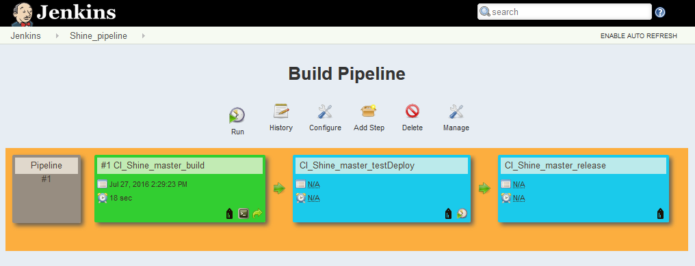
    
6. Now act as quality manager. Trigger the import of the delivery unit to the test system.

    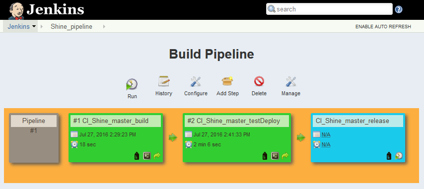

7. Finally, assume that the acceptance test was successful. In the role as delivery manager, trigger the release.

    

8. You will see the application deployed on all the systems and uploaded as archive into Nexus.


### Alternative approaches

As already stated, this guide shall give you an idea about how a CD process could look like for SAP HANA XSC applications. There are alternatives to the approach shown, and we briefly sketch two of them.


#### Assemble and install a Software Component

Instead of dealing with an exported delivery unit you can assemble the delivery unit from the CI system as software component using the `hdbalm assemble` command. The result is a software component archive as zip file. In the CI build job, the `regi export` command is replaced by the following lines:

```
#assembles a software component for the DU 
export HDBALM_HOST=${HANA_HOST}
export HDBALM_PORT=${HANA_HTTP_PORT}
export HDBALM_USER=${HANA_USER}
export HDBALM_PASSWD=${HANA_PASSWORD}
hdbalm -y assemble --ignore_language_errors --scvs_only ${DELIVERY_UNIT},${Vendor}
```

The zip file is archived in Jenkins like the delivery unit file before and passed to the `CI_Shine_master_testDeploy` and `CI_Shine_master_release` jobs. In both, the `hdbalm import` command is replaced by `hdbalm install`.

```
hdbalm -y install <software component zip file>
```

In addition, the upload to Nexus in the `CI_Shine_master_release` must be adapted accordingly to operate on the software component zip file.

For details we refer to the official documentation:

> [`hdbalm` documentation in the SAP Help Portal](https://help.sap.com/saphelp_hanaplatform/helpdata/en/b9/2b9bdc457c42ba920e3ed6b09e4463/content.htm) 


#### Transport between systems

Instead of exporting and importing an archive (delivery unit or software component), direct transports between the systems are also possible: `hdbalm` can use a direct connection from the target system to the source system for pulling a delivery unit. Especially if you are already familiar to life-cycle management tools, this approach might be preferable. To implement it, you must provide an additional permission in the target system and define the transport route. We assume that the productive system is the transport target, and the test system is the transport source. 

For details we refer to the official documentation:

> [SAP HANA Application Lifecycle Management - Transport - documentation in the SAP Help Portal](https://help.sap.com/saphelp_hanaplatform/helpdata/en/50/a00deb7663496d93ebb938bbb723ca/content.htm)

##### Preparation of the target (productive) system

Before we can use the `hdbalm transport` command, we need to configure the system landscape in the target SAP HANA System and create a transport route.

1. Log in to your SAP HANA Cockpit of the target system with the URL `http://<host>:<port>/sap/hana/admin/cockpit`

2. Open **Manage Roles and Users**, select your user and add the permission
    `sap.hana.xs.admin.roles::HTTPDestAdministrator`.

    
    
    This role provides the required permission to create a new transport route.

3. In the SAP HANA Cockpit, open the **HANA Application Lifecycle Management** and navigate in the menu to **TRANSPORT**.

4. In the sub menu of the **TRANSPORT** view, open **System** and press **+Register**. In the pop-up window, enter the host name and the HTTP port of the source system of the transport (test system).
    
5. Press **Next**. On the pop-up window, press on **Maintain Destination**. Configure the connection details of the source (test) system so that the target system can access it. Click on **Authentication Details** and maintain the user name and the password of the source system. It is recommended to enable secured connection. When you have finished the configuration, press **Save** and close the pop-up window by pushing the **x** button in the upper right corner.
    
6. Press **Finish** on the **Register System** pop-up. You will see the test system listed.

    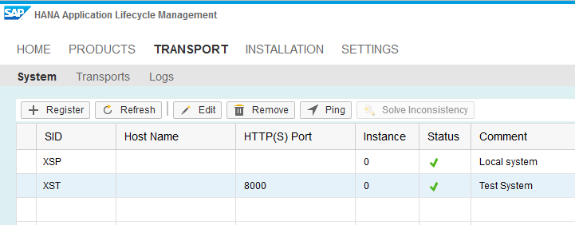
    
7. In the transport view of the HANA Application Lifecycle Management, click on **Transports** and select **Create**. Enter a name for your transport route, choose your source system, and select **Delivery Units**. Mark your delivery unit in the list. Select **Create** to save your transport route configuration.

    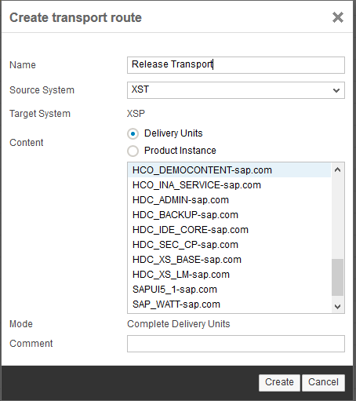

8. Log in to the Jenkins build machine (or any other machine where a SAP HANA client is installed). Enter the following
    commands:

    ```
    export HDBALM_USER={HANA user of the productive system}
    export HDBALM_HOST={host name of the productive system}
    export HDBALM_PORT={http port of the productive system}
    hdbalm transport list
    ```

    Enter the password of the SAP HANA user after the prompt, and you will get a list of the transports defined on the productive system. Look for the transport that you just defined and remember its route id. This is a manual step that is needed for each newly created transport route. The route id will not change, even if it is modified, and can be used during jobs for automation.
    
##### Adaptation of the release job

The `hdbalm import` command in the release job in the example above must be replaced by the command `hdbalm transport` triggering the transport.

1. Open the configuration of the `CI_Shine_master_release` job in Jenkins.

2. Replace the `hdbalm import` command in the shell script of the **Build** section by the following command:

    ```
    hdbalm -y transport start <route id>
    ```

    Replace `<route id>` by the number obtained from the step above.

## Next Steps
 
  - [Back to the Navigator](http://go.sap.com/developer/tutorials/ci-best-practices-intro.html)
