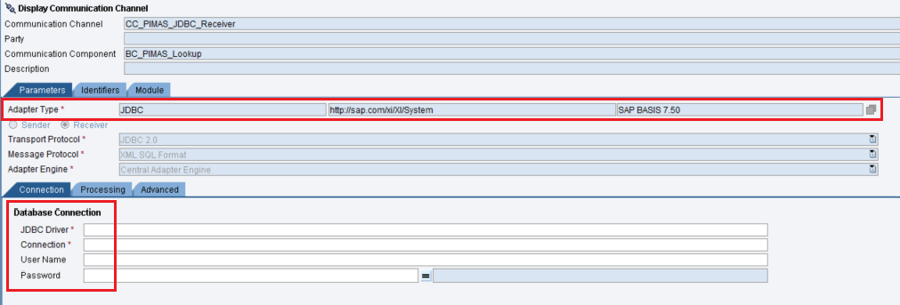
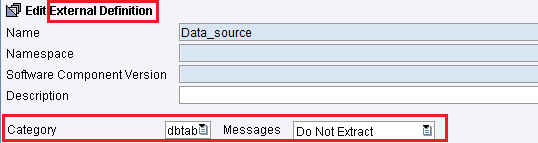
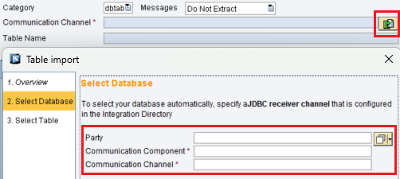
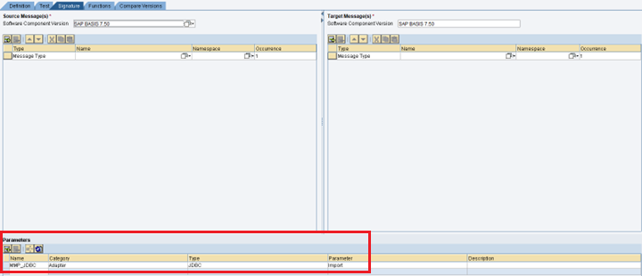
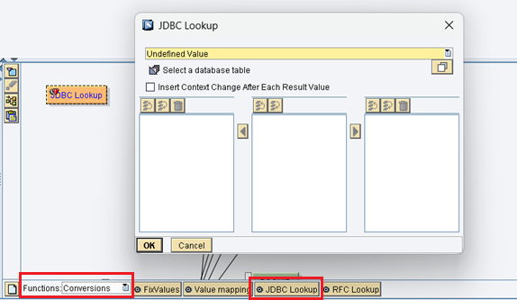
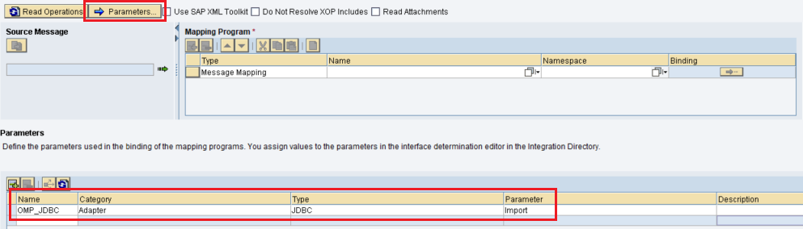

# Learn how to migrate JDBC Lookups from SAP Process Orchestration to Cloud Integration
<!-- description -->This tutorial is developed into two different steps, one for the SAP Process Orchestration and the other for the Cloud Integration capability of SAP Integration Suite.
In this sample scenario we are moving data from system A to system B and enrich with content data.


## Intro

JDBC Lookup is a method used to enhance a specific set of data retrieved from a given data source with extra inputs.
This method can be done in both platforms, SAP Process Orchestration and Cloud Integration, in two distinguished ways. The main difference between them is the number of messages sent. SAP Process Orchestration sends one SQL Statement per key wanted, where the solution created in Cloud Integration sends one SQL Statement with all the information required. 


## Prerequisites
- SAP Process Orchestration package needs a JDBC connection allowance
- Database is accessible for SAP Process Orchestration and Cloud Integration
- Create a JDBC Driver and JDBC Data Source for connecting to the database
  


## You will learn
- How to use the JDBC Lookup function on SAP Process Orchestration
- How to create an alternative JDBC Lookup on Cloud Integration


### Configure the JDBC Lookup function on SAP Process Orchestration

In the SAP Process Orchestration there is an out of the box function that operates the JDBC Lookup, called **JDBC Lookup**. To operate the previous method mentioned, we need to follow these steps:

1. Create Business Component and Communication Channel with type JDBC Receiver and fill the information for the Database Connection.
     
      

2.	Create an **External Definition** with category: 'dbtab' and messages: 'Do Not Extract', as shown in the image below.

      

3.	Select the Communication Channel previously created and the desired fields from the Data Source.

      

4.	Create a Message Mapping and in 'Signature' create a parameter with ('Adapter', 'JDBC', 'Import').

      

5.	Still in Message Mapping in 'Definition' - 'Conversions' select the function 'JDBC Lookup' and follow this URL to better understand the [JDBC Lookup Function](https://blogs.sap.com/2008/02/15/sap-pi-71-mapping-enhancements-series-graphical-support-for-jdbc-and-rfc-lookups/).

      

6.	Create an Operation Mapping and attribute the Service Interface and Message Mapping and add a parameter in the same way as we did previously in the Message Mapping ('Adapter', 'JDBC', 'Import').

    

For this method to work we need to make sure that the package has JDBC connection allowance.

>*Note: Step 1 is done in the Integration Builder while the remaining are done in ESR.*


### Create the JDBC Lookup function on Cloud Integration

In the Cloud Integration this method does **not** have a single specific approach to operate the JDBC Lookup, but it can be done by a simple integration flow system through the following steps (the final integration flow can be seen in the last step):

1.	Retrieve the data from the data source.  

2.	Use a Sequential Multicast to create two branches, one to carry the initial message and one to operate the JDBC Lookup.

      

3.	Set and personalize the parameters used to define the SQL Statement in the next step, through a "Content Modifier". In the following table there are the fields, the description and the guidelines to fill them in:


	|  Field Name     				| Description                                        | Guidelines                               | Necessity
	|  :------------- 				| :-------------                                     | :-------------                           | :-------------           
	|  Access Parameters            | `All the fields needed to access the DataBase`     | `All seperated by commas`                | `Mandatory`  
	|  Key Parameters               | `Fields used as keys to fetch the data`            | `All seperated by commas`                | `Mandatory`
	|  SQL Action                   | `Action to operate on the SQL Statment`            | `Only one and using capital letters`     | `Mandatory`
	|  Table Name                   | `Name of the table for access`                     | `Only one and using capital letters`     | `Mandatory`
    |  SP Parameters                | `Parameters to fill in case of action Execute. Only relevant for stored procedures`     | `All seperated by commas`                | `Optional`
  

4.	Define a dynamic SQL Statement with the fields value defined in the previous step. The script shown below can be applied in all scenarios:

    ```Groovy
    import com.sap.gateway.ip.core.customdev.util.Message;
    import java.util.HashMap;
    import groovy.xml.*; 

    def Message processData(Message message) {
    
        def accessParam = message.getProperty("access")
        def dbTableName = message.getProperty("table")
        def sqlAction = message.getProperty("action") 
        def keyParam = message.getProperty("key")
        def spParams = message.getProperty("SPParams") 
    

        def bodyString = message.getBody(java.lang.String) as String;

        def oXML = new XmlParser().parseText(bodyString);
    
        Writer writer = new StringWriter();
    
        def indentPrinter = new IndentPrinter(writer, ' ');
    
        def builder = new MarkupBuilder(indentPrinter);
    
        /*Create the SQL Statement with a builder function with an exception route for the 'EXECUTE' method.
        Define a Statement with the table name provided followed by the action.
        In case the access and key parameters are filled, they are processed one by one seperated by a comma.*/

        builder.'root' {
            if (spParams && sqlAction == "EXECUTE"){
                oXML.row.each{ item ->
                    'Statement' {
                        "${dbTableName}"('action': "${sqlAction}") { 
                            'table' "${dbTableName}"
                            def arrSPFields = spParams.tokenize(",");
                            arrSPFields.each{ SPField ->
                                def SPValue = item."${SPField}".text();
                                "${SPField}" "${SPValue}"
                            }
                        }   
                    }
                }            
            }else{ 
                'Statement' {
                    "${dbTableName}"('action': "${sqlAction}") { 
                        'table' "${dbTableName}"
                        
                        if (accessParam){ 
                            'access' {
                                def arrFields = accessParam.tokenize(",");
                                arrFields.each{ field ->
                                    "${field}" ''
                                }
                            }
                        }

                        if (keyParam){ 
                            oXML.row.each{ item -> 
                                "key" { 
                                    def arrKeyFields = keyParam.tokenize(",");
                                    arrKeyFields.each{ keyField ->
                                        def keyValue = item."${keyField}".text();
                                        "${keyField}" "${keyValue}"
                                    }
                                }
                            } 
                        }
                    }   
                }
            }
        }
            
        message.setBody(writer.toString());
    
        return message;
    }
    ```  

5.	Join both branches and gather the messages in one XML File.

      

6.	Combine the messages through XSLT Mapping. Sample script below:

    ```XML
    <xsl:stylesheet version="1.0" xmlns:xsl="http://www.w3.org/1999/XSL/Transform">
        <xsl:output omit-xml-declaration="yes" indent="yes"/>

        /*Create a key for the lookup.
            Its 'match' attribute represents a collection of nodes (response from JDBC query) where lookup takes place.
            Its 'use' attribute is the field inside the collection.*/

        <xsl:key name="contacts-lookup" match="Statement_response/row" use="ID"/>

        /*For every row in CustomerNotification do:
            1. Copy original contents.
            2. Find via lookup a collection of contacts (use 'key' function and pass a key name and the value to find) and add to the current row copies of EMAIL and TELEPHONE nodes.*/

        <xsl:template match="CustomerNotification/row">
            <row>
                <xsl:copy-of select="node()" copy-namespaces="no"/>
                <xsl:for-each select="key('contacts-lookup', ID)">
                    <xsl:copy-of select="EMAIL" copy-namespaces="no"/>
                    <xsl:copy-of select="TELEPHONE" copy-namespaces="no"/>
                </xsl:for-each>
            </row>
        </xsl:template>

        <xsl:template match="/">
            <CustomerNotification>
                <root>
                    <xsl:apply-templates select="//CustomerNotification/row"/>
                </root>
            </CustomerNotification>
        </xsl:template>
    </xsl:stylesheet>

    ```
>Disclaimer: In order for XSLT Mapping to work, it needs to be adapted accordingly to each scenario.  

7.	Send the final message.

    


### Test yourself 


